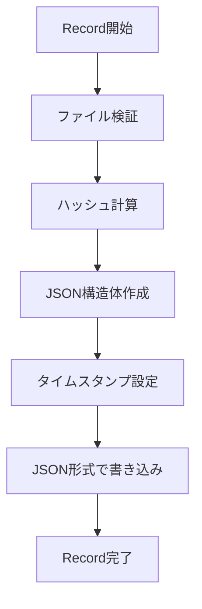
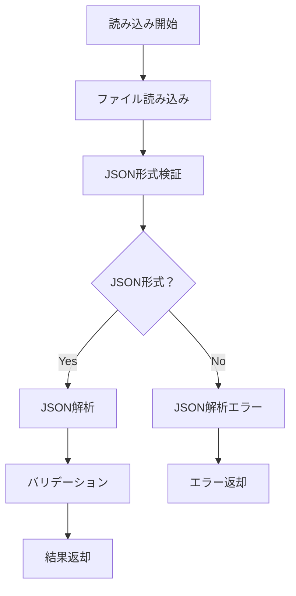

# 設計方針書：ハッシュファイル形式のJSON化

## 1. 概要

現在のテキスト形式のハッシュファイルをJSON形式に移行するための設計方針を記述する。
この移行により、将来的な機能拡張への対応と、ハッシュファイルの可読性・保守性を向上させる。

## 2. アーキテクチャ

### 2.1. 全体方針

- **JSON形式への完全移行**: レガシー形式のサポートは廃止し、JSON形式のみサポート
- **シンプルな実装**: レガシー形式の互換性を考慮せず、JSON形式に特化した実装
- **APIの保持**: 既存のValidator APIインターフェースは変更しない
- **標準ライブラリ使用**: 外部依存を避け、Go標準ライブラリの `encoding/json` を使用

### 2.2. 設計戦略

#### 2.2.1. JSON専用設計
- **JSON形式のみ**: ハッシュファイルの読み書きはJSON形式のみサポート
- **エラーハンドリング**: レガシー形式のファイルが存在する場合は適切なエラーを返す
- **バリデーション**: JSON形式の厳密な検証を実施

#### 2.2.2. 移行戦略
- **書き込み**: 新しいハッシュファイルはすべてJSON形式で作成
- **読み込み**: JSON形式のみサポート、レガシー形式はエラー
- **既存ファイル**: レガシー形式のファイルが存在する場合はエラーを返す

## 3. コンポーネント設計

### 3.1. 新規コンポーネント

#### 3.1.1. HashFileFormat 構造体
```go
// HashFileFormat は、ハッシュファイルのJSON形式を定義する
type HashFileFormat struct {
    Version   string    `json:"version"`
    Format    string    `json:"format"`
    Timestamp time.Time `json:"timestamp"`
    File      FileInfo  `json:"file"`
}

// FileInfo は、ファイル情報を定義する
type FileInfo struct {
    Path string   `json:"path"`
    Hash HashInfo `json:"hash"`
}

// HashInfo は、ハッシュ情報を定義する
type HashInfo struct {
    Algorithm string `json:"algorithm"`
    Value     string `json:"value"`
}
```

#### 3.1.2. フォーマット検出機能
```go
// detectHashFileFormat は、ハッシュファイルの形式を検出する
func detectHashFileFormat(content []byte) (HashFileFormat, bool, error)

// isJSONFormat は、内容がJSON形式かどうかを判定する
func isJSONFormat(content []byte) bool
```

#### 3.1.3. 変換機能
```go
// legacyToJSON は、レガシー形式をJSON形式に変換する
func legacyToJSON(path, hash string) HashFileFormat

// jsonToLegacy は、JSON形式をレガシー形式に変換する（テスト用）
func jsonToLegacy(format HashFileFormat) (string, string)
```

### 3.2. 既存コンポーネントの更新

#### 3.2.1. Validator構造体
- 既存のフィールドは変更しない
- 内部的にJSON処理機能を追加
- 既存のメソッドシグネチャは保持

#### 3.2.2. Record関数の更新
```go
func (v *Validator) Record(filePath string) error {
    // 既存の処理...

    // JSON形式でハッシュファイルを作成
    format := HashFileFormat{
        Version:   "1.0",
        Format:    "file-hash",
        Timestamp: time.Now().UTC(),
        File: FileInfo{
            Path: targetPath,
            Hash: HashInfo{
                Algorithm: v.algorithm.Name(),
                Value:     hash,
            },
        },
    }

    // JSON形式で書き込み
    return v.writeHashFileJSON(hashFilePath, format)
}
```

#### 3.2.3. readAndParseHashFile関数の更新
```go
func (v *Validator) readAndParseHashFile(targetPath string) (string, string, error) {
    // ファイル読み込み
    content, err := safefileio.SafeReadFile(hashFilePath)
    if err != nil {
        return "", "", err
    }

    // JSON形式の検証と解析
    format, err := validateHashFileFormat(content)
    if err != nil {
        return "", "", err
    }

    return v.parseJSONHashFile(format, targetPath)
}
```

### 3.3. エラーハンドリング設計

#### 3.3.1. 新しいエラータイプ
```go
var (
    // ErrInvalidJSONFormat は、JSON形式が不正な場合に返される
    ErrInvalidJSONFormat = errors.New("invalid JSON format in hash file")

    // ErrUnsupportedVersion は、サポートされていないバージョンの場合に返される
    ErrUnsupportedVersion = errors.New("unsupported hash file version")

    // ErrInvalidTimestamp は、タイムスタンプが不正な場合に返される
    ErrInvalidTimestamp = errors.New("invalid timestamp in hash file")
)
```

#### 3.3.2. エラー処理フロー
1. **JSON解析エラー**: JSONとして解析できない場合はErrInvalidJSONFormat
2. **スキーマエラー**: 必須フィールドが不足している場合はErrInvalidJSONFormat
3. **バージョンエラー**: サポートされていないバージョンの場合はErrUnsupportedVersion
4. **データエラー**: パスの不一致などはErrHashCollision

## 4. データフロー設計

### 4.1. 書き込みフロー



### 4.2. 読み込みフロー



### 4.3. JSON形式検証フロー

```mermaid
graph TD
    A[内容確認] --> B[先頭文字が'{'？]
    B -->|Yes| C[JSON解析試行]
    B -->|No| D[JSON解析エラー]
    C --> E{解析成功？}
    E -->|Yes| F[JSON形式と判定]
    E -->|No| G[JSON解析エラー]
```

## 5. セキュリティ設計

### 5.1. JSON解析セキュリティ

#### 5.1.1. 脆弱性対策
- **サイズ制限**: JSON解析前にファイルサイズをチェック
- **深度制限**: 標準ライブラリのデフォルト制限を使用
- **型安全**: 構造体での型安全なアンマーシャル

#### 5.1.2. 入力検証
- **必須フィールド**: すべての必須フィールドの存在確認
- **値検証**: パス、ハッシュ値、タイムスタンプの形式検証
- **範囲チェック**: バージョン番号の妥当性確認

### 5.2. 既存セキュリティ機能の保持

- **SafeReadFile/SafeWriteFile**: 既存のセキュアファイル操作を継続使用
- **パス検証**: 既存のvalidatePath関数を継続使用
- **TOCTOU対策**: 既存のファイル操作セキュリティを維持

## 6. 性能設計

### 6.1. 最適化方針

#### 6.1.1. JSON処理最適化
- **ストリーミング**: 大きなファイルでも効率的に処理
- **メモリ効率**: 不要なメモリ使用を避ける
- **キャッシュ**: 頻繁に使用される設定値のキャッシュ

#### 6.1.2. フォーマット検出最適化
- **早期判定**: 最小限のデータで形式を判定
- **キャッシュ**: 同じファイルの重複検出を避ける

### 6.2. 性能目標

- **処理時間**: 既存実装の110%以内
- **メモリ使用量**: 既存実装の110%以内
- **CPU使用率**: 既存実装の110%以内

## 7. テスト設計

### 7.1. テスト戦略

#### 7.1.1. 段階的テスト
1. **単体テスト**: 各新機能の個別テスト
2. **統合テスト**: 既存機能との統合テスト
3. **互換性テスト**: レガシー形式との互換性テスト
4. **性能テスト**: 性能劣化の確認

#### 7.1.2. テストケース設計
- **正常系**: JSON形式の正常な読み書き
- **異常系**: 不正なJSON形式の処理
- **レガシー形式**: レガシー形式ファイルのエラー処理
- **境界値**: 大きなファイルパス、特殊文字

### 7.2. テストデータ設計

#### 7.2.1. JSON形式テストデータ
```json
{
  "version": "1.0",
  "format": "file-hash",
  "timestamp": "2025-07-04T10:30:00Z",
  "file": {
    "path": "/tmp/test.txt",
    "hash": {
      "algorithm": "SHA256",
      "value": "abc123"
    }
  }
}
```

#### 7.2.2. 異常系テストデータ
- 不正なJSON構文
- 必須フィールドの欠如
- 不正なタイムスタンプ形式
- サポートされていないバージョン
- レガシー形式のファイル

## 8. 運用設計

### 8.1. 移行戦略

#### 8.1.1. 完全移行
1. **JSON形式のみ**: 新しいファイルはJSON形式のみ作成
2. **レガシー形式の廃止**: レガシー形式ファイルの読み込みはエラー
3. **明確なエラーメッセージ**: レガシー形式に対する適切なエラー通知

#### 8.1.2. 監視・メトリクス
- **JSON形式ファイル数**: 新しく作成されたJSON形式ファイル数
- **レガシー形式エラー数**: レガシー形式ファイルのアクセス試行回数
- **変換必要性**: レガシー形式ファイルの存在確認

### 8.2. 障害対応

#### 8.2.1. 回復戦略
- **明確なエラー通知**: レガシー形式ファイルに対する適切なエラーメッセージ
- **エラーログ**: 詳細なエラー情報の記録
- **移行ガイド**: レガシー形式からJSON形式への移行手順の提供

## 9. 将来拡張性

### 9.1. 拡張ポイント

#### 9.1.1. 新機能対応
- **複数ハッシュアルゴリズム**: 同一ファイルの複数ハッシュ保存
- **メタデータ**: ファイルサイズ、最終更新日時等の追加情報
- **署名**: デジタル署名による改ざん防止

#### 9.1.2. バージョン管理
- **バージョン2.0**: 新機能追加時の形式拡張
- **互換性マトリクス**: 各バージョン間の互換性定義
- **移行ツール**: 形式間の変換ツール
