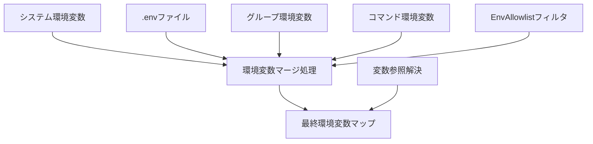
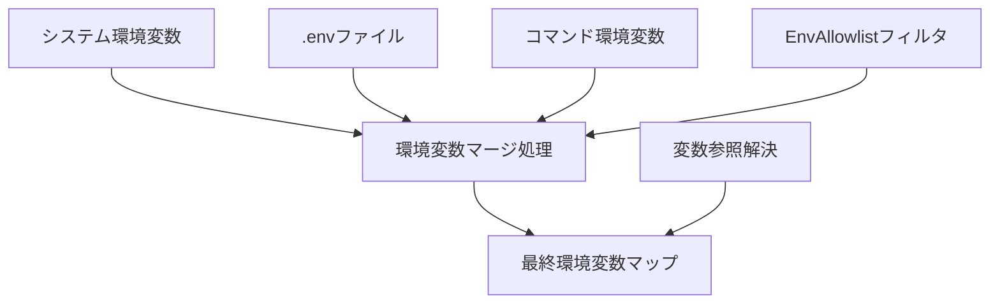
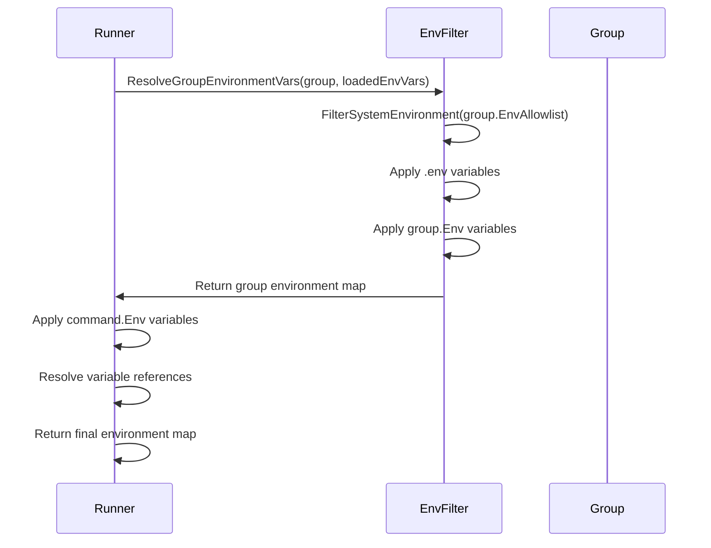
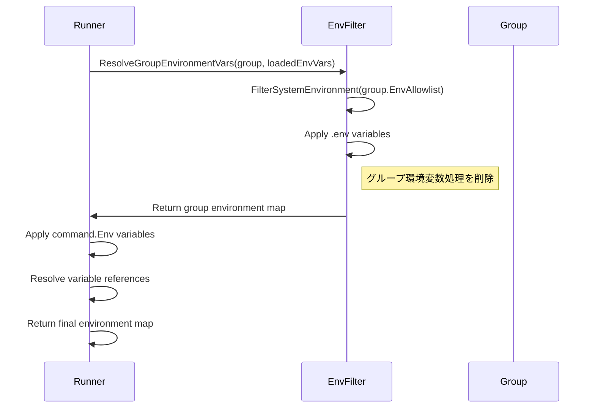
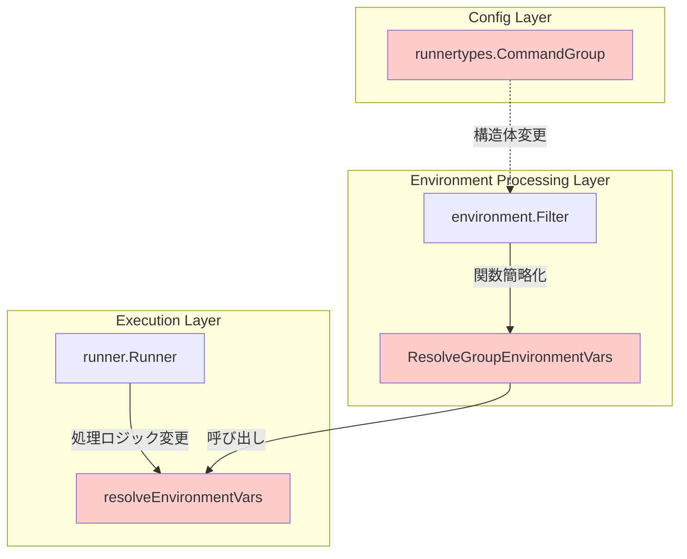

# アーキテクチャ設計書: グループレベル環境変数設定削除

## 1. 概要

### 1.1 目的
本文書では、go-safe-cmd-runnerプロジェクトにおけるグループレベル環境変数設定（`CommandGroup.Env`）の完全削除に関するアーキテクチャ設計について説明する。この変更により、環境変数設定の複雑性を軽減し、デバッグ性と保守性を向上させる。

### 1.2 変更の背景
現在のシステムでは、環境変数を4箇所で設定可能（システム環境変数、.envファイル、グループ設定、コマンド固有設定）であり、設定の優先順位が複雑化している。この設計変更により、環境変数設定箇所を3箇所に削減し、シンプルで理解しやすい設定体系を実現する。

## 2. アーキテクチャ変更概要

### 2.1 変更前のアーキテクチャ



**環境変数優先順位（変更前）**
1. コマンド固有の環境変数（最高優先度）
2. グループレベルの環境変数
3. .envファイルの環境変数
4. システム環境変数（最低優先度）

### 2.2 変更後のアーキテクチャ



**環境変数優先順位（変更後）**
1. コマンド固有の環境変数（最高優先度）
2. .envファイルの環境変数（中間優先度）
3. システム環境変数（最低優先度）

## 3. システム構成要素の変更

### 3.1 データ構造の変更

#### 3.1.1 CommandGroup構造体（変更前）
```go
type CommandGroup struct {
    Name         string    `toml:"name"`
    Description  string    `toml:"description"`
    Priority     int       `toml:"priority"`
    DependsOn    []string  `toml:"depends_on"`
    Template     string    `toml:"template"`
    Commands     []Command `toml:"commands"`
    VerifyFiles  []string  `toml:"verify_files"`
    Env          []string  `toml:"env"`           // 削除対象
    EnvAllowlist []string  `toml:"env_allowlist"` // 維持
}
```

#### 3.1.2 CommandGroup構造体（変更後）
```go
type CommandGroup struct {
    Name         string    `toml:"name"`
    Description  string    `toml:"description"`
    Priority     int       `toml:"priority"`
    DependsOn    []string  `toml:"depends_on"`
    Template     string    `toml:"template"`
    Commands     []Command `toml:"commands"`
    VerifyFiles  []string  `toml:"verify_files"`
    // Envフィールドを削除
    EnvAllowlist []string  `toml:"env_allowlist"` // 維持
}
```

### 3.2 処理フローの変更

#### 3.2.1 環境変数解決処理（変更前）


#### 3.2.2 環境変数解決処理（変更後）


### 3.3 コンポーネント間の依存関係

#### 3.3.1 影響を受けるコンポーネント

**変更が必要なコンポーネント:**
- `internal/runner/runnertypes/config.go`: `CommandGroup`構造体
- `internal/runner/environment/filter.go`: `ResolveGroupEnvironmentVars`関数
- `internal/runner/runner.go`: `resolveEnvironmentVars`関数
- 関連するテストファイル

**変更不要（維持）なコンポーネント:**
- `EnvAllowlist`機能
- 変数参照解決機能（`${VAR}`形式）
- .envファイル読み込み機能
- システム環境変数フィルタリング機能

#### 3.3.2 コンポーネント依存図



## 4. 設定ファイル形式の変更

### 4.1 変更前の設定例
```toml
[[groups]]
name = "build"
env = ["NODE_ENV=production", "BUILD_ID=${CI_BUILD_ID}"]  # 削除対象
env_allowlist = ["NODE_ENV", "BUILD_ID", "CI_BUILD_ID"]

[[groups.commands]]
name = "webpack"
cmd = "npm"
args = ["run", "build"]
env = ["WEBPACK_ENV=production"]
```

### 4.2 変更後の設定例
```toml
[[groups]]
name = "build"
# グループレベルenv設定を削除
env_allowlist = ["NODE_ENV", "BUILD_ID", "CI_BUILD_ID"]  # 維持

[[groups.commands]]
name = "webpack"
cmd = "npm"
args = ["run", "build"]
# グループ環境変数をコマンドレベルに統合
env = ["NODE_ENV=production", "BUILD_ID=${CI_BUILD_ID}", "WEBPACK_ENV=production"]
```

### 4.3 移行パターン

#### 4.3.1 単純統合パターン
```toml
# 変更前
[[groups]]
name = "web"
env = ["PORT=3000", "NODE_ENV=development"]

[[groups.commands]]
name = "start"
env = ["DEBUG=true"]

# 変更後
[[groups]]
name = "web"
# グループenvを削除

[[groups.commands]]
name = "start"
env = ["PORT=3000", "NODE_ENV=development", "DEBUG=true"]  # 統合
```

#### 4.3.2 複数コマンド共通変数パターン
```toml
# 変更前
[[groups]]
name = "database"
env = ["DB_HOST=localhost", "DB_PORT=5432"]

[[groups.commands]]
name = "migrate"
env = ["MIGRATION_DIR=./migrations"]

[[groups.commands]]
name = "seed"
env = ["SEED_FILE=./seeds/development.sql"]

# 変更後
[[groups]]
name = "database"
# グループenvを削除

[[groups.commands]]
name = "migrate"
env = ["DB_HOST=localhost", "DB_PORT=5432", "MIGRATION_DIR=./migrations"]

[[groups.commands]]
name = "seed"
env = ["DB_HOST=localhost", "DB_PORT=5432", "SEED_FILE=./seeds/development.sql"]
```

## 5. セキュリティ考慮事項

### 5.1 維持されるセキュリティ機能
- **EnvAllowlist機能**: グループレベルでの環境変数アクセス制御は維持
- **変数参照解決時のセキュリティチェック**: `${VAR}`展開時のallowlist検証は継続
- **環境変数名・値の検証機能**: 不正な環境変数設定の検出機能は維持

### 5.2 セキュリティ影響の分析
- **影響なし**: EnvAllowlistによる環境変数アクセス制御は維持されるため、セキュリティレベルは変更前と同等
- **改善点**: 設定箇所の削減により、設定ミスによるセキュリティリスクが軽減

## 6. パフォーマンス影響

### 6.1 メモリ使用量
- **削減**: グループレベル環境変数の保存領域削除により、わずかなメモリ使用量削減
- **影響**: 実際の影響は軽微（設定ファイル内の環境変数数に比例）

### 6.2 処理性能
- **改善**: 環境変数マージ処理の簡略化により、わずかな処理性能向上
- **影響**: 実際の性能向上は軽微（ミリ秒オーダー）

## 7. 後方互換性

### 7.1 Breaking Change
- 本変更は**Breaking Change**として扱う
- 開発中機能のため、外部ユーザーへの影響は想定されない
- 内部で使用している設定ファイルは手動で移行が必要

### 7.2 移行対応
- 既存のグループ環境変数設定は自動変換されない
- 設定ファイルを使用している開発者は手動でコマンドレベルに移行する必要がある

## 8. エラーハンドリングの変更

### 8.1 変更前のエラーパターン
```
- グループ環境変数の構文エラー
- グループ環境変数のallowlist違反
- グループ環境変数の変数参照エラー
- コマンド環境変数のエラー
```

### 8.2 変更後のエラーパターン
```
- コマンド環境変数のエラー（グループ関連エラーを削除）
```

### 8.3 ログ出力の簡素化
- グループ環境変数処理関連のデバッグログを削除
- エラーメッセージの簡素化
- 処理フローの追跡しやすさの向上

## 9. 将来の拡張計画

### 9.1 代替機能の検討（本要件範囲外）
- **テンプレート変数での環境変数サポート強化**
- **グループ専用.envファイルサポート**
- **環境別設定ファイル管理機能**

### 9.2 移行支援機能（将来実装予定）
- **設定ファイル検証ツール**: グループ環境変数使用の検出
- **自動移行ツール**: 既存設定の自動変換
- **設定ベストプラクティスガイド**: 推奨設定パターンの提供

## 10. 実装リスク

### 10.1 高リスク
- **既存設定ファイルの動作不良**: グループ環境変数を使用している設定の動作停止
  - 対策: 内部設定ファイルの手動移行

### 10.2 中リスク
- **機能削除による柔軟性の低下**: グループレベル環境変数制御の不能
  - 対策: 将来の代替機能実装計画、コマンドレベル設定での対応

### 10.3 低リスク
- **設定の冗長化**: グループ内複数コマンドでの環境変数重複設定
  - 対策: 将来のテンプレート機能での解決予定

## 11. 実装戦略

### 11.1 段階的実装アプローチ
1. **Phase 1**: データ構造の変更（破壊的変更の最小化）
2. **Phase 2**: 処理ロジックの簡略化（機能削除）
3. **Phase 3**: テスト・検証・ドキュメント更新

### 11.2 検証戦略
- 既存機能（EnvAllowlist、変数参照解決等）の動作確認
- パフォーマンステストによる性能影響測定
- 統合テストによる全体動作確認

## 12. 承認

本アーキテクチャ設計は、要件定義書に基づいて作成されており、グループレベル環境変数設定の完全削除という目的を達成するための技術的基盤を提供する。

設計レビュー: [要レビュー]
承認者: [プロジェクト責任者]
承認日: [承認日]
