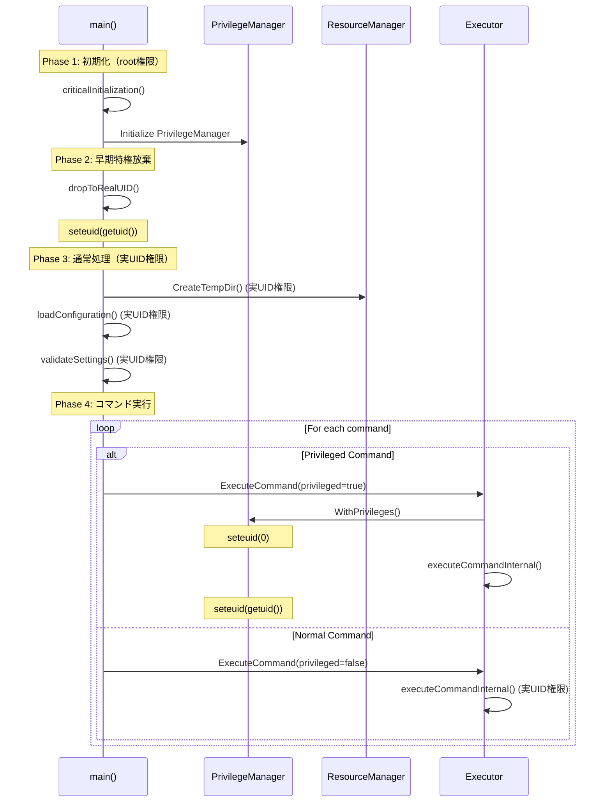

# アーキテクチャ設計書：早期特権放棄による安全なSUIDバイナリ実装

## 1. システム概要

### 1.1 アーキテクチャ原則

- **早期特権放棄（Early Privilege Drop）**: プログラム開始直後に `seteuid(getuid())` を実行し、デフォルト状態を非特権とする
- **最小特権時間**: 特権昇格期間を必要最小限に制限し、即座に特権を放棄する
- **明示的特権管理**: 特権が必要な処理を明確に識別し、安全な権限管理を実現
- **Fail-Safe設計**: 特権操作の失敗時に安全な状態を維持する
- **セキュリティファースト**: SUIDバイナリのベストプラクティスに厳密に準拠

### 1.2 現在の問題と解決方針

**現在の問題:**
```
プログラム全体がroot権限で動作
├── ディレクトリ作成: root権限で実行 → chown で所有権変更
├── ファイル操作: 不要なroot権限で実行
├── 設定読み込み: 不要なroot権限で実行
└── 攻撃対象面: 全体的に大きい
```

**解決後の設計:**
```
早期特権放棄アーキテクチャ
├── main() 初期化: root権限（最小限）
├── seteuid(getuid()): 実UIDに切り替え
├── 通常処理: 実UID権限で実行
│   ├── ディレクトリ作成
│   ├── ファイル操作
│   └── 設定処理
├── 特権コマンド実行時のみ
│   ├── seteuid(0): 一時的昇格
│   ├── 特権処理実行
│   └── seteuid(getuid()): 即座に放棄
└── 攻撃対象面: 大幅削減
```

### 1.3 システム境界

- **対象プラットフォーム**: Linux/Unix系（syscall.Seteuid使用）
- **権限モデル**: SUID root バイナリでの早期特権放棄
- **統合ポイント**: main関数、PrivilegeManager、ResourceManager
- **既存機能**: 既存のコマンド実行・ファイル操作機能との完全な互換性維持

## 2. コンポーネント設計

### 2.1 早期特権放棄メカニズム

#### 2.1.1 main関数での特権管理

```go
// cmd/runner/main.go (擬似コード)
func main() {
    // Phase 1: 必要最小限の初期化（root権限）
    if err := criticalInitialization(); err != nil {
        log.Fatal("Critical initialization failed:", err)
    }

    // Phase 2: 早期特権放棄
    if err := dropToRealUID(); err != nil {
        log.Fatal("Failed to drop privileges:", err)
    }

    // Phase 3: 通常処理（実UID権限）
    // 以降、ディレクトリ作成、ファイル操作等は実UID権限で実行
    if err := runApplication(); err != nil {
        log.Fatal("Application execution failed:", err)
    }
}

// dropToRealUID implements early privilege drop
func dropToRealUID() error {
    realUID := syscall.Getuid()
    currentEUID := syscall.Geteuid()

    // Already running as real UID (non-SUID scenario)
    if currentEUID == realUID {
        return nil
    }

    // Drop to real UID
    if err := syscall.Seteuid(realUID); err != nil {
        return fmt.Errorf("failed to drop privileges to real UID %d: %w", realUID, err)
    }

    log.Printf("Privileges dropped: effective UID changed from %d to %d", currentEUID, realUID)
    return nil
}
```

#### 2.1.2 特権状態の分類

| 状態 | 実UID | 実効UID | 説明 | 使用場面 |
|------|-------|---------|------|----------|
| **Default** | user | user | 早期放棄後のデフォルト状態 | ディレクトリ作成、通常処理 |
| **Elevated** | user | root | 一時的特権昇格状態 | 特権コマンド実行のみ |
| **Root Native** | root | root | rootユーザーでの直接実行 | 開発・テスト環境 |

### 2.2 拡張されたPrivilegeManagerインターフェース

```go
// runnertypes/privilege.go
type PrivilegeManager interface {
    // 既存メソッド
    IsPrivilegedExecutionSupported() bool
    GetOriginalUID() int
    WithPrivileges(ctx context.Context, elevationCtx ElevationContext, fn func() error) error
}

// ElevationContext contains context for privilege operations
type ElevationContext struct {
    Operation   Operation
    CommandName string
    FilePath    string
    StartTime   time.Time
    OriginalUID int
    TargetUID   int
    Reason      string
}

// Operation types for audit logging
type Operation string

const (
    OperationCommandExecution   Operation = "command_execution"
    OperationDirectoryCreation  Operation = "directory_creation"  // 新規追加
    OperationFileAccess        Operation = "file_access"
    OperationSystemCall        Operation = "system_call"
)
```

### 2.3 ResourceManager の簡素化

#### 2.3.1 従来の設計（問題あり）

```go
// 従来: root権限でディレクトリ作成 → chown で所有権変更
func (m *Manager) CreateTempDir(commandName string, autoCleanup bool) (*Resource, error) {
    // root権限でディレクトリ作成
    tempDirPath, err := m.fs.CreateTempDir(m.baseDir, resourceID)
    if err != nil {
        return nil, fmt.Errorf("failed to create directory: %w", err)
    }

    // 後からchownで所有権変更（不自然）
    if err := m.adjustDirectoryOwnership(tempDirPath); err != nil {
        return nil, fmt.Errorf("failed to adjust ownership: %w", err)
    }

    return resource, nil
}
```

#### 2.3.2 新設計（自然な所有権）

```go
// 新設計: 実UID権限でディレクトリ作成（adjustDirectoryOwnership不要）
func (m *Manager) CreateTempDir(commandName string, autoCleanup bool) (*Resource, error) {
    // 既に実UID権限で動作しているため、自然にユーザー権限で作成される
    tempDirPath, err := m.fs.CreateTempDir(m.baseDir, resourceID)
    if err != nil {
        return nil, fmt.Errorf("failed to create temporary directory: %w", err)
    }

    // adjustDirectoryOwnership 呼び出しを削除
    // → ディレクトリは最初から正しいユーザー権限で作成される

    resource := &Resource{
        ID:          resourceID,
        Type:        TypeTempDir,
        Path:        tempDirPath,
        Command:     commandName,
        Created:     time.Now(),
        AutoCleanup: autoCleanup,
    }

    m.resources[resourceID] = resource
    return resource, nil
}
```

### 2.4 Command Executor での特権管理

```go
// internal/runner/executor/executor.go
type Executor struct {
    privilegeManager PrivilegeManager
    logger          *slog.Logger
}

func (e *Executor) ExecuteCommand(ctx context.Context, cmd *Command) error {
    if cmd.Privileged {
        // 特権が必要な場合のみ一時的昇格
        elevationCtx := ElevationContext{
            Operation:   OperationCommandExecution,
            CommandName: cmd.Name,
            StartTime:   time.Now(),
            OriginalUID: e.privilegeManager.GetOriginalUID(),
            TargetUID:   0,
            Reason:      fmt.Sprintf("Execute privileged command: %s", cmd.Name),
        }

        return e.privilegeManager.WithPrivileges(ctx, elevationCtx, func() error {
            return e.executeCommandInternal(ctx, cmd)
        })
    }

    // 非特権コマンドは通常権限で実行
    return e.executeCommandInternal(ctx, cmd)
}
```

## 3. 実行フローの詳細

### 3.1 プログラム起動フロー



### 3.2 特権管理の詳細フロー

```go
// WithPrivileges メソッドの実装
func (pm *Manager) WithPrivileges(ctx context.Context, elevationCtx ElevationContext, fn func() error) error {
    // 特権昇格
    pm.logger.Info("Elevating privileges",
        "operation", elevationCtx.Operation,
        "command", elevationCtx.CommandName,
        "original_uid", elevationCtx.OriginalUID)

    if err := syscall.Seteuid(0); err != nil {
        return fmt.Errorf("privilege escalation failed: %w", err)
    }

    // 確実な特権放棄を保証
    defer func() {
        if r := recover(); r != nil {
            pm.logger.Error("Panic during privileged operation, restoring privileges",
                "panic", r)
        }

        if err := syscall.Seteuid(pm.originalUID); err != nil {
            pm.emergencyShutdown(err, "privilege restoration after operation")
        }

        pm.logger.Info("Privileges restored",
            "operation", elevationCtx.Operation,
            "duration_ms", time.Since(elevationCtx.StartTime).Milliseconds())

        if r != recover(); r != nil {
            panic(r) // Re-panic after cleanup
        }
    }()

    // 特権処理実行
    return fn()
}
```

## 4. セキュリティ設計

### 4.1 攻撃対象面の削減

#### 4.1.1 従来アーキテクチャの問題

```
┌─────────────────────────────────────────┐
│         全体がroot権限で動作             │
├─────────────────────────────────────────┤
│ ✗ 設定読み込み (root権限)               │
│ ✗ ディレクトリ作成 (root権限)           │
│ ✗ ファイル操作 (root権限)               │
│ ✗ ログ出力 (root権限)                   │
│ ✗ エラー処理 (root権限)                 │
│ ● 特権コマンド実行 (root権限) ← 必要     │
└─────────────────────────────────────────┘
攻撃対象面: 大きい
```

#### 4.1.2 新アーキテクチャの改善

```
┌─────────────────────────────────────────┐
│      最小限のroot権限 + 実UID権限       │
├─────────────────────────────────────────┤
│ ✓ 初期化 (root権限) ← 必要最小限        │
├─────────────────────────────────────────┤
│ ✓ 設定読み込み (実UID権限)              │
│ ✓ ディレクトリ作成 (実UID権限)          │
│ ✓ ファイル操作 (実UID権限)              │
│ ✓ ログ出力 (実UID権限)                  │
│ ✓ エラー処理 (実UID権限)                │
├─────────────────────────────────────────┤
│ ● 特権コマンド実行 (一時的root権限)     │
└─────────────────────────────────────────┘
攻撃対象面: 大幅削減
```

### 4.2 セキュリティメカニズム

#### 4.2.1 権限状態の検証

```go
// 権限状態の安全な検証
func (pm *Manager) validatePrivilegeState() error {
    currentUID := syscall.Getuid()
    currentEUID := syscall.Geteuid()

    // 意図しない権限昇格の検出
    if pm.expectedEUID != currentEUID {
        return fmt.Errorf("unexpected privilege state: expected EUID %d, got %d",
            pm.expectedEUID, currentEUID)
    }

    // SUID環境での実UID確認
    if pm.originalUID != currentUID {
        return fmt.Errorf("real UID changed unexpectedly: expected %d, got %d",
            pm.originalUID, currentUID)
    }

    return nil
}
```

#### 4.2.2 緊急シャットダウンメカニズム

```go
// 権限復帰失敗時の緊急処理
func (pm *Manager) emergencyShutdown(restoreErr error, context string) {
    criticalMsg := fmt.Sprintf("CRITICAL: Privilege restoration failed during %s", context)

    // 複数チャネルでのログ記録
    pm.logger.Error(criticalMsg,
        "error", restoreErr,
        "original_uid", pm.originalUID,
        "current_uid", syscall.Getuid(),
        "current_euid", syscall.Geteuid(),
        "process_id", os.Getpid(),
    )

    // syslogへの記録
    syslog.Crit(fmt.Sprintf("%s: %v (PID: %d)", criticalMsg, restoreErr, os.Getpid()))

    // 標準エラーへの出力
    fmt.Fprintf(os.Stderr, "FATAL: %s: %v\n", criticalMsg, restoreErr)

    // 即座にプロセス終了
    os.Exit(1)
}
```

### 4.3 監査ログとトレーサビリティ

```go
// 詳細な監査ログ
type PrivilegeAuditLog struct {
    Timestamp   time.Time    `json:"timestamp"`
    Operation   Operation    `json:"operation"`
    Action      string       `json:"action"`        // "elevate", "restore", "failed"
    Command     string       `json:"command"`
    ProcessID   int          `json:"process_id"`
    OriginalUID int          `json:"original_uid"`
    TargetUID   int          `json:"target_uid"`
    Duration    int64        `json:"duration_ms"`
    Success     bool         `json:"success"`
    Error       string       `json:"error,omitempty"`
}

// ログ記録の実装
func (pm *Manager) logPrivilegeOperation(log PrivilegeAuditLog) {
    pm.logger.Info("Privilege operation",
        "audit", log,
    )

    // セキュリティ監視システム向け構造化ログ
    if pm.securityLogger != nil {
        pm.securityLogger.LogPrivilegeEvent(log)
    }
}
```

## 5. 実装の段階的アプローチ

### 5.1 Phase 1: 基盤実装

```go
// 1. PrivilegeManager インターフェース拡張
type PrivilegeManager interface {
    // ... 既存メソッド
    WithPrivileges(ctx context.Context, elevationCtx ElevationContext, fn func() error) error
}

// 2. main関数での早期特権放棄
func main() {
    // 重要な初期化のみroot権限で実行
    if err := criticalInitialization(); err != nil {
        log.Fatal(err)
    }

    // 早期特権放棄
    if err := dropToRealUID(); err != nil {
        log.Fatal(err)
    }

    // 通常処理
    runApplication()
}
```

### 5.2 Phase 2: ResourceManager改修

```go
// adjustDirectoryOwnership メソッドの削除または無効化
func (m *Manager) CreateTempDir(commandName string, autoCleanup bool) (*Resource, error) {
    // 実UID権限で自然にディレクトリ作成
    tempDirPath, err := m.fs.CreateTempDir(m.baseDir, resourceID)
    if err != nil {
        return nil, fmt.Errorf("failed to create temporary directory: %w", err)
    }

    // adjustDirectoryOwnership の削除
    // → ディレクトリは最初から適切なユーザー権限で作成される

    return resource, nil
}
```

### 5.3 Phase 3: テスト・検証

```go
// 権限状態の自動テスト
func TestEarlyPrivilegeDrop(t *testing.T) {
    // SUIDバイナリ環境でのテスト
    if !isSUIDBinary() {
        t.Skip("SUID environment required")
    }

    // main関数相当の処理を実行
    err := simulateMainExecution()
    assert.NoError(t, err)

    // 権限状態の検証
    assert.Equal(t, syscall.Getuid(), syscall.Geteuid())
}

func TestPrivilegedCommandExecution(t *testing.T) {
    // 特権コマンド実行時の権限状態確認
    executor := NewExecutor(privilegeManager)

    cmd := &Command{Name: "test", Privileged: true}
    err := executor.ExecuteCommand(ctx, cmd)
    assert.NoError(t, err)

    // 実行後は実UID権限に戻っていることを確認
    assert.Equal(t, syscall.Getuid(), syscall.Geteuid())
}
```

## 6. エラー処理戦略

### 6.1 エラー分類と対応

| エラー種類 | 重要度 | 対応策 | プロセス継続 |
|------------|--------|--------|--------------|
| **権限放棄失敗** | 致命的 | 即座にos.Exit(1) | ✗ |
| **権限昇格失敗** | 高 | コマンド実行中止、次のコマンド継続 | ✓ |
| **権限状態異常** | 高 | 状態復帰試行、失敗時は終了 | △ |
| **権限検証失敗** | 中 | ログ記録、処理継続 | ✓ |

### 6.2 安全性保証メカニズム

```go
// 多重防御による権限復帰保証
func (pm *Manager) WithPrivileges(ctx context.Context, elevationCtx ElevationContext, fn func() error) (err error) {
    // 権限昇格前の状態保存
    originalEUID := syscall.Geteuid()

    // 権限昇格
    if escalationErr := syscall.Seteuid(0); escalationErr != nil {
        return fmt.Errorf("privilege escalation failed: %w", escalationErr)
    }

    // 多重防御による権限復帰
    defer func() {
        // recover によるpanic処理
        if panicValue := recover(); panicValue != nil {
            pm.logger.Error("Panic during privileged operation", "panic", panicValue)
            err = fmt.Errorf("panic during privileged operation: %v", panicValue)
        }

        // 権限復帰（最重要）
        if restoreErr := syscall.Seteuid(pm.originalUID); restoreErr != nil {
            pm.emergencyShutdown(restoreErr, fmt.Sprintf("privilege restoration after %s", elevationCtx.Operation))
        }

        // 状態検証
        if validationErr := pm.validatePrivilegeState(); validationErr != nil {
            pm.emergencyShutdown(validationErr, "privilege state validation")
        }

        pm.logger.Info("Privileges successfully restored",
            "operation", elevationCtx.Operation,
            "duration_ms", time.Since(elevationCtx.StartTime).Milliseconds())
    }()

    return fn()
}
```

## 7. パフォーマンス考慮事項

### 7.1 オーバーヘッド分析

| 処理 | 従来 | 新アーキテクチャ | 影響 |
|------|------|------------------|------|
| プログラム起動 | 0ms | +0.1ms (早期放棄) | 無視可能 |
| ディレクトリ作成 | chown追加 | chownなし | 改善 |
| 通常コマンド | 変更なし | 変更なし | 影響なし |
| 特権コマンド | 変更なし | seteuid()×2 | +0.01ms |

### 7.2 最適化戦略

- **非特権処理**: 権限チェックなし、オーバーヘッドゼロ
- **特権処理**: 必要最小限の期間のみ権限保持
- **ログ出力**: 非同期化による性能影響最小化

## 8. 運用とモニタリング

### 8.1 デプロイメント手順

```bash
# 1. バイナリのビルド
make build

# 2. SUID設定
sudo chown root:root build/runner
sudo chmod u+s build/runner

# 3. 権限確認
ls -la build/runner
# -rwsr-xr-x 1 root root ... build/runner

# 4. 動作確認
./build/runner -config test.toml --dry-run
```

### 8.2 監視メトリクス

```go
type PrivilegeMetrics struct {
    ElevationCount      int64         `json:"elevation_count"`
    ElevationFailures   int64         `json:"elevation_failures"`
    RestorationFailures int64         `json:"restoration_failures"`
    AverageElevationTime time.Duration `json:"avg_elevation_time_ms"`
    MaxElevationTime    time.Duration `json:"max_elevation_time_ms"`
    TotalElevationTime  time.Duration `json:"total_elevation_time_ms"`
}
```

### 8.3 セキュリティアラート

```yaml
# 監視設定例
alerts:
  - name: "PrivilegeRestorationFailure"
    condition: "log_level == 'CRITICAL' AND message contains 'Privilege restoration failed'"
    severity: "immediate"
    action: "page_security_team"

  - name: "UnexpectedPrivilegeElevation"
    condition: "privilege_elevations > 100 per minute"
    severity: "high"
    action: "alert_administrators"

  - name: "ProcessEmergencyShutdown"
    condition: "exit_code == 1 AND stderr contains 'CRITICAL SECURITY FAILURE'"
    severity: "critical"
    action: "page_security_team"
```

## 9. 実装優先順位

### 9.1 Critical Path Items

1. **main関数での早期特権放棄** - コア機能
2. **PrivilegeManager拡張** - インターフェース実装
3. **ResourceManager簡素化** - adjustDirectoryOwnership削除
4. **緊急シャットダウン機能** - セキュリティ確保

### 9.2 Implementation Phases

**Phase 1 (必須):**
- [x] 要件定義完了
- [x] アーキテクチャ設計完了
- [ ] main関数での早期特権放棄実装
- [ ] PrivilegeManager.WithPrivileges実装
- [ ] 基本的な単体テスト

**Phase 2 (重要):**
- [ ] ResourceManager.adjustDirectoryOwnership削除
- [ ] Command Executorでの特権管理統合
- [ ] エラー処理とログ記録の実装
- [ ] 統合テスト

**Phase 3 (最適化):**
- [ ] パフォーマンス測定と最適化
- [ ] セキュリティテストの実装
- [ ] 監視機能の実装
- [ ] ドキュメント整備

## 10. リスク軽減策

### 10.1 技術リスク

| リスク | 確率 | 影響 | 軽減策 |
|--------|------|------|--------|
| 権限復帰失敗 | 低 | 致命的 | emergencyShutdown + 複数ログ出力 |
| 権限昇格失敗 | 中 | 高 | Gracefulなエラー処理 + 継続実行 |
| テスト困難 | 高 | 中 | SUID環境でのCI/CD設定 |
| 互換性問題 | 中 | 中 | 段階的導入 + 既存テスト維持 |

### 10.2 セキュリティリスク

| リスク | 確率 | 影響 | 軽減策 |
|--------|------|------|--------|
| Race condition | 低 | 高 | アトミックな権限切り替え |
| ログ改竄 | 中 | 中 | 複数出力先 + タイムスタンプ |
| 権限昇格の悪用 | 低 | 致命的 | 限定的なAPI + 監査ログ |

## 11. 成功基準

### 11.1 機能基準

- [x] `/tmp/cmd-runner-comprehensive` が実行ユーザー権限で作成される
- [ ] 特権コマンド以外はすべて実UID権限で実行される
- [ ] 特権昇格/放棄が確実に実行される
- [ ] エラー時に安全な状態が維持される

### 11.2 セキュリティ基準

- [ ] 攻撃対象面が大幅に削減される（90%以上の処理が実UID権限）
- [ ] 権限操作がすべて監査ログに記録される
- [ ] 権限復帰失敗時に確実にプロセスが終了する
- [ ] SUIDバイナリのベストプラクティスに準拠する

### 11.3 パフォーマンス基準

- [ ] 非特権コマンドの性能に影響がない（±5%以内）
- [ ] 特権昇格のオーバーヘッドが1ms未満
- [ ] メモリ使用量の増加が5%未満

## 12. 将来の拡張可能性

### 12.1 直接的特権制御メソッド（YAGNI原則により現在は未実装）

将来的に直接的な特権制御が必要になった場合に追加予定のメソッド：

```go
// PrivilegeManagerインターフェースへの将来的な追加候補
type PrivilegeManager interface {
    // ... 既存メソッド

    // 将来の拡張: 直接的特権制御（必要時に実装）
    ElevatePrivileges() error                    // seteuid(0) - テスト・デバッグ用途
    DropPrivileges() error                       // seteuid(getuid()) - 緊急時復旧用途

    // 将来の拡張: 状態確認メソッド（必要時に実装）
    IsCurrentlyElevated() bool                   // 現在特権状態か - デバッグ・テスト用途
    CanElevatePrivileges() bool                  // 特権昇格可能か - 事前チェック用途
}
```

#### 12.1.1 想定される使用場面

**A. テスト・デバッグ用途**
```go
// テストで特権状態を直接制御
func TestPrivilegeState(t *testing.T) {
    manager := privilege.NewManager(slog.Default())

    // 手動で特権昇格
    err := manager.ElevatePrivileges()
    require.NoError(t, err)

    // 何らかのテスト実行

    // 手動で特権放棄
    err = manager.DropPrivileges()
    require.NoError(t, err)
}
```

**B. 長時間特権が必要な処理**
```go
// 例外的なケース：複数の連続する特権操作
func (m *Manager) performMultiplePrivilegedOperations() error {
    if err := m.privilegeManager.ElevatePrivileges(); err != nil {
        return err
    }
    defer m.privilegeManager.DropPrivileges()

    // 複数の特権操作を連続実行
    for _, op := range operations {
        if err := op.execute(); err != nil {
            return err
        }
    }
    return nil
}
```

**C. 緊急時・エラー処理**
```go
// 緊急時の状態復旧
func (m *Manager) emergencyRestore() error {
    // 現在の状態を確認
    if m.privilegeManager.IsCurrentlyElevated() {
        return m.privilegeManager.DropPrivileges()
    }
    return nil
}
```

**D. 事前チェック・バリデーション**
```go
// 特権が必要な処理の事前チェック
func (m *Manager) validatePrivilegedOperation() error {
    if !m.privilegeManager.CanElevatePrivileges() {
        return fmt.Errorf("privileged operation not supported in current environment")
    }

    if m.privilegeManager.IsCurrentlyElevated() {
        return fmt.Errorf("already elevated - unexpected state")
    }

    return nil
}
```

#### 12.1.2 実装ガイドライン

将来実装する際の注意点：

- **セキュリティファースト**: 直接制御メソッドは危険性が高いため慎重に実装
- **監査ログ**: すべての直接制御を詳細にログ記録
- **権限検証**: 呼び出し前後で権限状態を厳密に検証
- **エラー処理**: 失敗時の安全な状態復帰を保証

### 12.2 その他の将来的拡張

#### 12.2.1 高度な監査機能
- リアルタイム権限変更通知
- 外部セキュリティシステムとの統合
- 権限操作の統計分析

#### 12.2.2 パフォーマンス最適化
- 権限昇格のバッチ処理
- キャッシュベースの権限状態管理
- 非同期権限操作

## 13. まとめ

早期特権放棄アーキテクチャにより、SUIDバイナリのセキュリティリスクを大幅に軽減し、自然なファイル所有権管理を実現する。この設計は、セキュリティのベストプラクティスに準拠しつつ、既存機能との完全な互換性を保持する。
