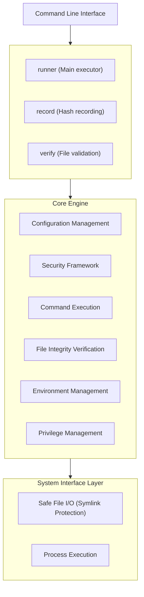

# Go Safe Command Runner - Design and Implementation Overview

## Executive Summary

The Go Safe Command Runner is a security-focused command execution framework designed for privileged task delegation and automated batch processing. The system provides multiple layers of security controls to enable safe execution of privileged operations while maintaining strict security boundaries.

**Key Use Cases:**
- Scheduled backup operations with root privileges
- Delegating specific administrative tasks to non-root users
- Automated system maintenance with security controls
- Batch processing with file integrity verification

## System Architecture

### High-Level Architecture



### Core Components

#### 1. Configuration Management (`internal/runner/config/`)
- **Purpose**: TOML-based configuration loading and validation
- **Key Features**:
  - Schema validation with required field checking
  - Path security validation (absolute paths, no relative components)
  - Default value assignment
  - Cross-reference validation between sections
  - Risk-based command control configuration
  - User/group execution specification support

**Implementation Highlights:**
```go
// Safe configuration loading with validation
func (l *Loader) LoadConfig(path string) (*runnertypes.Config, error) {
    data, err := safefileio.SafeReadFile(path)  // Secure file reading
    if err := toml.Unmarshal(data, &cfg); err != nil {
        return nil, fmt.Errorf("failed to parse config: %w", err)
    }
    // Path validation and default assignment
}
```

#### 2. Command Execution Engine (`internal/runner/executor/`)
- **Purpose**: Safe command execution with output capture and timeout control
- **Key Features**:
  - Process isolation and resource management
  - Configurable timeouts at global and command level
  - Structured output capture with size limits
  - Background process support with signal handling

#### 3. File Integrity System (`internal/filevalidator/`)
- **Purpose**: SHA-256 based file verification to prevent tampered binary execution
- **Key Features**:
  - Hash recording and verification workflow
  - Privileged file access with controlled escalation
  - Atomic operations to prevent race conditions
  - Integration with privilege management
  - Environment file verification - integrity validation of `.env` files before execution

**Security Flow:**
```
File Access Request → Permission Check → Privilege Escalation (if needed)
→ File Open → Privilege Restoration → Hash Calculation → Verification
```

#### 4. Privilege Management (`internal/runner/privilege/`)
- **Purpose**: Controlled privilege escalation with comprehensive audit trails
- **Key Features**:
  - Thread-safe privilege operations with global mutex
  - Automatic privilege restoration with panic protection
  - Support for both native root and setuid binary execution
  - Emergency shutdown protocol on security failures

**Privilege Escalation Pattern:**
```go
func (m *Manager) WithPrivileges(ctx ElevationContext, fn func() error) error {
    m.mu.Lock()
    defer m.mu.Unlock()

    if err := m.escalatePrivileges(ctx); err != nil {
        return err
    }

    defer m.emergencyShutdownOnRestoreFailure(fn) // Fail-safe mechanism
    return fn()
}
```

#### 5. Environment Security (`internal/runner/environment/`)
- **Purpose**: Zero-trust environment variable filtering
- **Key Features**:
  - Allowlist-based filtering at global and group levels
  - Dangerous pattern detection (passwords, tokens, etc.)
  - Inheritance control (inherit/explicit/reject modes)
  - Variable name and value validation

#### 6. Safe File Operations (`internal/safefileio/`)
- **Purpose**: Symlink-safe file operations using modern Linux security primitives
- **Key Features**:
  - openat2 with RESOLVE_NO_SYMLINKS for symlink attack prevention
  - Step-by-step path validation
  - Atomic file operations
  - Cross-platform compatibility with fallback mechanisms

#### 7. Security Framework (`internal/runner/security/`)
- **Purpose**: Centralized security validation and policy enforcement
- **Key Features**:
  - Command path allowlist validation
  - Dangerous command detection
  - File permission validation
  - Path traversal attack prevention
  - Risk-based command analysis and blocking
  - Sensitive data redaction in logs

#### 8. Resource Management (`internal/runner/resource/`)
- **Purpose**: Unified management of side effects for both normal execution and dry-run modes
- **Key Features**:
  - Command execution abstraction
  - Temporary directory lifecycle management
  - Privilege escalation coordination
  - Dry-run simulation with realistic analysis
  - Network operations (Slack notifications)

#### 9. Verification Management (`internal/verification/`)
- **Purpose**: Centralized management of file verification and path resolution
- **Key Features**:
  - Configuration and environment file verification
  - Command path resolution with security validation
  - Privileged file access fallback
  - Standard system path skip functionality

#### 10. Risk Assessment (`internal/runner/risk/`)
- **Purpose**: Risk-based security assessment for command execution
- **Key Features**:
  - Command risk level analysis (low, medium, high, critical)
  - Risk level-based security policy enforcement
  - Command override detection and blocking

#### 11. Logging and Audit (`internal/logging/`, `internal/runner/audit/`)
- **Purpose**: Secure logging with sensitive data protection
- **Key Features**:
  - Multi-handler logging (file, syslog, Slack notifications)
  - Conditional text handler and interactive log handler
  - Pre-execution error handling
  - Structured audit trails
  - Automatic sensitive data redaction

#### 12. Data Redaction (`internal/redaction/`)
- **Purpose**: Automatic filtering of sensitive information from logs and output
- **Key Features**:
  - Pattern-based detection of passwords, tokens, API keys
  - Environment variable sanitization
  - Configurable redaction policies

#### 13. Terminal Capabilities (`internal/terminal/`)
- **Purpose**: Safe handling of terminal capabilities and interactive operations
- **Key Features**:
  - Terminal capability detection and management
  - Interactive prompt processing
  - Cross-platform terminal operations

#### 14. Group Membership Management (`internal/groupmembership/`)
- **Purpose**: Safe management of user group memberships
- **Key Features**:
  - Support for both CGO and non-CGO implementations
  - Group information parsing and validation
  - User-group association management

#### 15. Color Management (`internal/color/`)
- **Purpose**: Console output color control
- **Key Features**:
  - Terminal color support detection
  - Configurable color output control

#### 16. Common Utilities (`internal/common/`, `internal/cmdcommon/`)
- **Purpose**: Providing basic functionality shared across packages
- **Key Features**:
  - File system abstraction interfaces
  - Test support through mock implementations
  - Command common utilities

## Data Flow Architecture

### Command Execution Flow

```
Configuration Loading → Security Validation → Group Processing → Command Execution

1. Configuration Loading:
   ├── TOML parsing and validation
   ├── Path security checks (hash directory absolute path validation)
   ├── Default value assignment
   └── Cross-reference validation

2. Security Validation:
   ├── Configuration file integrity verification
   ├── Environment file integrity verification (when specified)
   ├── Environment variable filtering
   ├── Command path validation and risk assessment
   ├── Permission checks
   └── User/group execution validation

3. Group Processing:
   ├── Dependency resolution
   ├── Priority determination
   ├── Resource allocation (temporary directories)
   ├── Environment preparation
   └── Risk-based command filtering

4. Command Execution:
   ├── Risk level assessment and enforcement
   ├── Privilege escalation (if needed)
   ├── User/group switching (if specified)
   ├── Process spawning with isolation
   ├── Output capture and monitoring with redaction
   ├── Privilege restoration
   ├── Resource cleanup
   └── Audit logging and notifications
```

### File Verification Flow

```
File Path Input → Security Checks → Hash Calculation → Verification → Result

1. Security Checks:
   ├── Path validation (no symlinks, absolute path)
   ├── Permission analysis
   └── Privilege requirement determination

2. File Access and Hash Calculation:
   ├── Privilege escalation (if file requires root access)
   ├── Secure file opening
   ├── Privilege restoration (immediately after file open)
   ├── Streaming SHA-256 calculation (runs with normal privileges)
   └── Hash comparison preparation

3. Verification:
   ├── Hash comparison with stored values
   ├── Detailed error reporting with context
   └── Audit log recording
```

## Security Design Principles

### 1. Defense in Depth
Multiple security layers implemented to ensure no single point of failure compromises the entire system:
- **Input Validation**: All inputs validated at entry points (including absolute path requirements)
- **Path Security**: Comprehensive path validation and symlink protection
- **File Integrity**: Hash-based verification of all critical files (configuration, environment files, executables)
- **Privilege Control**: Minimal privilege principle with controlled escalation
- **Environment Isolation**: Strict allowlist-based environment filtering
- **Command Validation**: Allowlist-based command execution control with risk assessment
- **Data Protection**: Automatic redaction of sensitive information in logs and output

### 2. Zero Trust Model
No implicit trust in system environment:
- All files verified before use
- Environment variables filtered by allowlist
- Commands validated against known-good patterns
- Privileges granted only when necessary and immediately revoked

### 3. Fail-Safe Design
System designed to fail safely:
- Default deny for all operations
- Emergency shutdown on security failures
- Comprehensive error handling and logging
- Graceful degradation when security features unavailable

### 4. Audit and Monitoring
Complete visibility into security-relevant operations:
- Structured logging with security context
- Privilege operation metrics and tracking
- Security event recording
- Multi-channel critical error reporting

## Implementation Patterns

### 1. Interface-Driven Design
Heavy use of interfaces for testability and modularity:
```go
type PrivilegeManager interface {
    WithPrivileges(context ElevationContext, fn func() error) error
    IsSupported() bool
}

type FileValidator interface {
    Verify(filepath string) error
    Record(filepath string) (string, error)
}
```

### 2. Composition Over Inheritance
Component composition for feature extension:
```go
type ValidatorWithPrivileges struct {
    *Validator                    // Base functionality
    privMgr      PrivilegeManager // Extended functionality
    logger       *slog.Logger     // Observability
}
```

### 3. Context-Aware Operations
Operations with context for security and observability:
```go
func (m *Manager) ExecuteWithContext(
    ctx context.Context,
    elevationCtx ElevationContext,
    cmd Command,
) (*Result, error)
```

### 4. Resource Management Patterns
Proper resource lifecycle management:
```go
type ResourceManager interface {
    Acquire(ctx context.Context) (Resource, error)
    Release(resource Resource) error
}

// Usage with automatic cleanup
func (r *Runner) executeWithResources(ctx context.Context) error {
    resource, err := r.resourceMgr.Acquire(ctx)
    if err != nil {
        return err
    }
    defer r.resourceMgr.Release(resource)

    return r.performOperation(resource)
}
```

## Performance Characteristics

### 1. Hash Computation
- Efficient streaming hash calculation
- File size limits prevent resource exhaustion
- Parallel processing for multiple files
- Memory-efficient implementation

### 2. Environment Processing
- O(1) allowlist lookups using map structures
- Compiled regex patterns for pattern matching
- Minimal string operations
- Batch processing optimization

### 3. Privilege Operations
- Global mutex serializes privileged operations
- Fast privilege escalation/restoration using system calls
- Metrics collection for performance monitoring
- Resource usage tracking

### 4. Risk Assessment
- O(1) risk level lookups using pre-compiled patterns
- Efficient command analysis using regex matching
- Minimal overhead for risk evaluation
- Cached results for repeated command analysis

### 5. Data Redaction
- Pre-compiled regex patterns for sensitive data detection
- Streaming redaction for large outputs
- Minimal performance impact on normal operations
- Configurable redaction policies

## Package Structure

The current package structure of the project is:

```
go-safe-cmd-runner/
├── cmd/                           # Entry points
│   ├── record/                    # Hash recording command
│   ├── runner/                    # Main execution command
│   └── verify/                    # File verification command
├── internal/                      # Internal packages
│   ├── cmdcommon/                 # Command common utilities
│   ├── color/                     # Color management
│   ├── common/                    # Common interfaces and utilities
│   ├── filevalidator/             # File integrity validation
│   ├── groupmembership/           # Group membership management
│   ├── logging/                   # Log management
│   ├── redaction/                 # Data redaction
│   ├── runner/                    # Core execution engine
│   │   ├── audit/                 # Audit functionality
│   │   ├── config/                # Configuration management
│   │   ├── environment/           # Environment variable management
│   │   ├── executor/              # Command execution
│   │   ├── privilege/             # Privilege management
│   │   ├── resource/              # Resource management
│   │   ├── risk/                  # Risk assessment
│   │   ├── runnertypes/           # Type definitions
│   │   └── security/              # Security framework
│   ├── safefileio/                # Safe file I/O
│   ├── terminal/                  # Terminal capabilities management
│   └── verification/              # Verification management
├── docs/                          # Project documentation
└── sample/                        # Sample configuration files
```

## Deployment Considerations

### 1. Binary Distribution
- Setuid bit configuration for privilege escalation
- Root ownership requirements
- Binary integrity verification before deployment
- Secure installation procedures

### 2. Configuration Management
- Secure hash directory permissions (755 or stricter)
- Write-protected configuration files
- Regular integrity verification of critical files
- Configuration template management
- Simplified configuration with absolute path requirements (environment variable fallback removed)

### 3. Monitoring and Alerting
- Structured logs for security events
- Syslog integration for centralized logging
- Emergency shutdown event monitoring
- Performance metrics collection
- Slack integration for critical alerts
- Sensitive data redaction in all logs

### 4. Security Operations
- Regular security audits of configuration
- Privilege operation monitoring
- File integrity verification schedules
- Incident response procedures
- Risk-based command monitoring and alerting
- User/group execution audit trails

## Future Extensibility

### 1. Plugin Architecture
Interface-driven design enables easy extension:
- Custom hash algorithms
- Additional privilege backends
- Extended security validators
- Custom output formatters
- Pluggable risk assessment engines
- Custom notification backends
- Extended redaction patterns

### 2. Platform Support
Current focus on Linux/Unix with extensibility to:
- Windows privilege management
- macOS security features
- Container runtime integration

### 3. Integration Points
Well-defined interfaces for integration with:
- Configuration management systems
- Monitoring and alerting platforms
- Audit and compliance systems
- Identity and access management
- SIEM and security orchestration platforms
- ChatOps and collaboration tools (Slack, Teams)
- Container orchestration platforms

## Conclusion

The Go Safe Command Runner demonstrates security engineering best practices through its multi-layered security approach, comprehensive input validation, secure privilege management, risk-based command control, and extensive audit capabilities. The system is designed to fail securely and provide complete visibility into security-relevant operations, making it suitable for production use in security-conscious environments.

The implementation showcases modern Go development patterns including interface-driven design, composition-based architecture, resource management patterns, and comprehensive testing strategies. The system's modular design enables easy extension and customization while maintaining strict security boundaries.

Key innovations include unified resource management for both normal and dry-run modes, intelligent risk assessment for command security, automatic sensitive data protection, and comprehensive audit capabilities with multi-channel notifications. The system provides enterprise-grade security controls while maintaining operational flexibility and extensibility.
