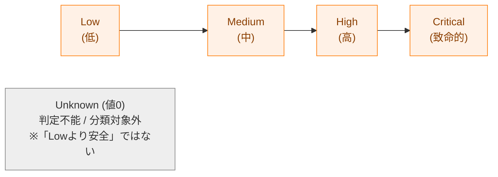
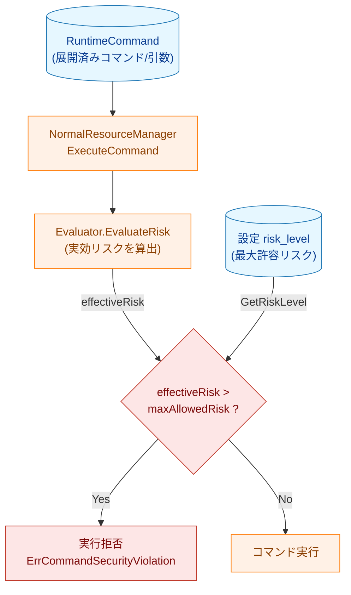
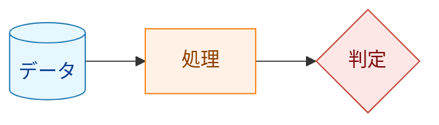
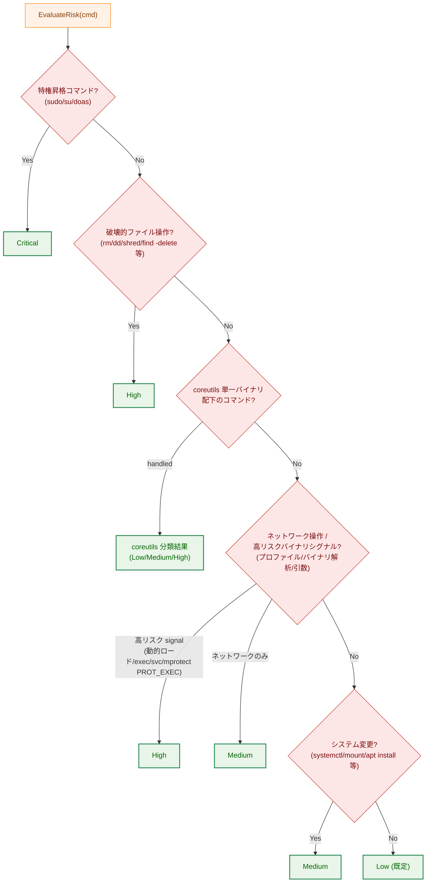
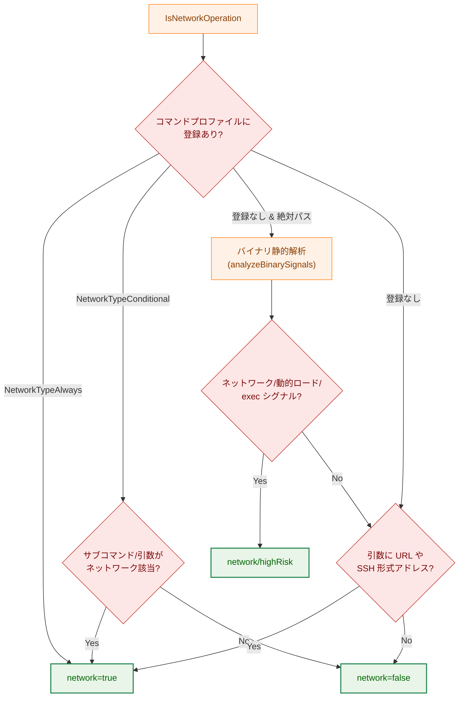
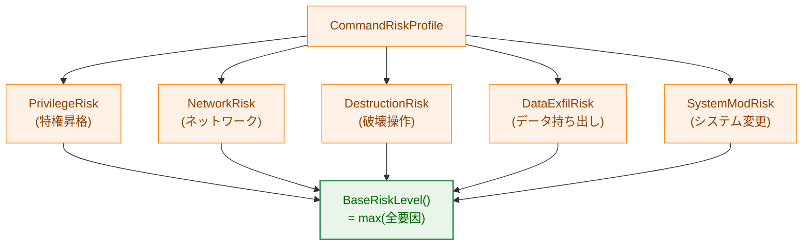

# コマンドリスク判定 技術解説

## 概要

本文書は、`runner` がコマンドを **実行する時点** で行う「リスク判定（risk evaluation）」の仕組みを、開発者向けに解説するものである。

`runner` は設定ファイル（TOML）に記述された各コマンドを実行する前に、そのコマンドが持つセキュリティ上の危険度を **リスクレベル** として算出する。算出されたリスクレベルが、コマンドまたはグループに設定された **最大許容リスクレベル（`risk_level`）** を超える場合、そのコマンドの実行を拒否する。これにより「設定で明示的に許可した範囲を超える危険な操作」を実行前に遮断する。

この判定は、ハッシュ検証（ファイル整合性検証）やバイナリ静的解析といった他のセキュリティ層と組み合わさって動作する。本文書ではそれらの詳細には立ち入らず、**リスクレベルの決定ロジック** に焦点を当てる。

### 対象読者

- リスク判定ロジックを変更・拡張する開発者
- 新しいコマンドのリスクプロファイルを追加する開発者
- `risk_level` 設定の挙動を理解したい利用者

### 関連パッケージ

| パッケージ | 役割 |
|-----------|------|
| `internal/runner/base/risk` | 実行時リスク判定のエントリポイント（`Evaluator`） |
| `internal/runner/base/security` | 個別判定ロジック（特権昇格・破壊操作・ネットワーク・coreutils 等） |
| `internal/runner/resource` | リスク判定の呼び出しと許容レベルとの比較（実行可否の判断） |
| `internal/runner/base/runnertypes` | `RiskLevel` 型と設定値のパース |

## リスクレベルの定義

リスクレベルは `runnertypes.RiskLevel`（`internal/runner/base/runnertypes/config.go`）で定義される列挙型である。**危険度の順序を持つのは `Low` 以上の 4 段階** であり、`Unknown`（値 0）はこの順序の一部ではなく「リスクを判定できなかった／分類対象外」を表す特別な値である点に注意する。



| レベル | 定数 | 文字列 | 意味 |
|--------|------|--------|------|
| 0 | `RiskLevelUnknown` | `unknown` | リスクを判定できなかった／分類対象外（**Low より安全という意味ではない**） |
| 1 | `RiskLevelLow` | `low` | セキュリティリスクが最小限のコマンド |
| 2 | `RiskLevelMedium` | `medium` | 中程度のリスク（ネットワーク操作・システム変更など） |
| 3 | `RiskLevelHigh` | `high` | 高リスク（破壊的操作・動的ロード・exec シグナルなど） |
| 4 | `RiskLevelCritical` | `critical` | 実行を遮断すべきコマンド（特権昇格など） |

**重要な性質**：

- `Low` 〜 `Critical` は整数として **大小比較可能** であり、複数の要因がある場合は原則として **最大値** が採用される（`max(...)`）。
- `Unknown`（値 0）は数値としては最小だが、意味は「判定不能／分類対象外」であって **`Low` より安全という意味ではない**。実装上、`Unknown` が「最も低いリスク」として許容比較（`effectiveRisk > maxAllowedRisk`）を通過してしまうことはない。実行時パス（`EvaluateRisk`）が `Unknown` を返すのは **エラーと同時の場合のみ** で、その際はエラーが呼び出し元へ伝播して **フェイルクローズド**（実行中止）になるためである。`Unknown` は主に「この判定では確定できないので後続の判定に委ねる」という内部シグナルとして使われる（例：`getDefaultRiskByDirectory` や `AnalyzeCommandSecurity` の中間結果）。
- `critical` は **設定ファイルでは指定できない**（`ParseRiskLevel` がエラーを返す）。内部利用専用であり、特権昇格コマンドのように「必ず遮断すべき」ものに割り当てられる。
- 設定で `risk_level` を省略した場合の既定値は `low` である（`CommandSpec.GetRiskLevel` が `RiskLevelLow` を返す）。

## 実行時の全体フロー

リスク判定は通常実行モード（`NormalResourceManager.ExecuteCommand`）の中で行われる。配線は `runner.go` で行われ、`NetworkAnalyzer` → `StandardEvaluator` → `ResourceManager` の順に組み立てられる。



**凡例（Legend）**



実行可否の比較は `internal/runner/resource/normal_manager.go` で行われる。

```go
// Step 1: 実効リスクを算出
effectiveRisk, err := n.riskEvaluator.EvaluateRisk(cmd)

// Step 2: 設定から最大許容リスクを取得（既定は low）
maxAllowedRisk, err := cmd.GetRiskLevel()

// Step 3: 比較。超過していれば実行を拒否する
if effectiveRisk > maxAllowedRisk {
    return ..., fmt.Errorf("%w: command %s (effective risk: %s) exceeds maximum allowed risk level (%s)",
        runnertypes.ErrCommandSecurityViolation, ...)
}
```

ポイント：

- **実効リスク（effectiveRisk）**：コマンドの内容から算出される実際の危険度。
- **最大許容リスク（maxAllowedRisk）**：利用者が設定で許可した上限。
- `critical` は設定に書けないため、特権昇格コマンドのように実効リスクが `critical` になるものは **どんな設定でも必ず拒否される**（既定の `low` はもちろん、最大の `high` を設定しても `critical > high` となる）。

## リスク判定アルゴリズム（`EvaluateRisk`）

実行時リスクの中核は `risk.StandardEvaluator.EvaluateRisk`（`internal/runner/base/risk/evaluator.go`）である。判定は **早期リターン方式** で、上位（より危険な）判定から順に評価し、最初に該当したレベルを返す。



判定順序（コードのステップに対応）：

### Step 1: 特権昇格コマンド → Critical

`security.IsPrivilegeEscalationCommand` がコマンド名を検査する。`sudo` / `su` / `doas` に該当すると **Critical** を返す。

- シンボリックリンクを辿って判定する（`extractAllCommandNames`）。`/usr/bin/foo` が実体として `sudo` を指していても検出する。
- シンボリックリンクの深さが上限（`MaxSymlinkDepth`）を超えた場合はエラー（`ErrSymlinkDepthExceeded`）を返し、リスクは `Unknown` となる。`EvaluateRisk` はエラーを呼び出し元へ伝播し、**フェイルクローズド**（コマンドは実行されない）。

特権昇格コマンドは `commandRiskProfiles` 上で `PrivilegeRisk = Critical` として定義されている（後述のプロファイル参照）。

### Step 2: 破壊的ファイル操作 → High

`security.IsDestructiveFileOperation` が以下を **High** と判定する：

- コマンド名が `rm` / `rmdir` / `unlink` / `shred` / `dd` のいずれか。
- `find` の引数に `-delete`、または `-exec` の直後に破壊的コマンドがある。
- `rsync` の引数に `--delete` 系オプションがある。

### Step 3: coreutils 単一バイナリの分類

Rust 製 coreutils のように、すべてのサブコマンドが **1 つのバイナリ** を共有する実装に対応するための特別処理である。`security.CoreutilsCommandRisk` が判定する。

通常のバイナリ静的解析（Step 4 のネットワーク解析内）では、coreutils は単一バイナリ内に全サブコマンドのシンボルを含むため誤分類されてしまう。これを避けるために、解析より前に専用ロジックで分類する。

判定条件と挙動：

- 対象は、解決済みパスの **親ディレクトリが coreutils ディレクトリ（`common.CoreutilsDir`）と完全一致** するコマンドのみ。一致しない場合は `handled=false` を返し、後続のステップへ進む。
- setuid/setgid ビットが立っていれば **High**（coreutils のハードリンクが setuid であることは通常ありえず、パッケージング不備か改ざんの兆候）。
- 実効サブコマンドの決定：
  - 通常はパスの basename（例：`/opt/coreutils/rm` → `rm`）。
  - マルチコール・エントリポイント（basename が `coreutils`）の場合は、引数の最初の非オプション要素を採用（`coreutils rm -rf ...` → `rm`）。
- 実効サブコマンドによる分類：
  - 破壊系（`dd`, `rm`, `rmdir`, `shred`, `truncate`, `unlink`）→ **High**
  - 既知の安全系（`ls`, `cat`, `mkdir`, `sha256sum` 等の読み取り・情報取得・テキスト処理・新規作成系）→ **Low**
  - それ以外（ディレクトリ配下だが分類不明）→ **Medium**（フェイルセーフの既定）
- setuid チェックの stat がエラーになった場合、実行時パス（`EvaluateRisk`）では **エラーを伝播してフェイルクローズド**（実行しない）。

### Step 4: ネットワーク操作 / 高リスクバイナリシグナル → High / Medium

`NetworkAnalyzer.IsNetworkOperation` が判定する。関数名は "Network" だが、戻り値は `(isNetwork, isHighRisk, error)` であり、**ネットワーク操作とは限らない高リスクバイナリシグナルも `isHighRisk` 側で報告する**。具体的には、動的ロードシンボル（`dlopen`/`dlsym`/`dlvsym`）、exec シスコール、`svc #0x80` 直接シスコール、**mprotect 系の `PROT_EXEC`** がこれに含まれる（詳細は 4-2 を参照）。

- `isHighRisk == true` → **High**（ネットワークか否かによらず High。mprotect `PROT_EXEC` 等はここに入る）
- `isNetwork == true`（高リスクでない）→ **Medium**
- どちらも false → 次のステップへ

検出は以下の優先順位で行われる：



#### 4-1. コマンドプロファイルによる判定（最優先）

`commandProfileDefinitions`（`internal/runner/base/security/command_analysis.go`）にハードコードされた既知コマンドの一覧を参照する。各プロファイルは `NetworkType` を持つ：

- `NetworkTypeAlways`：常にネットワーク操作を行う。該当すると即 `network=true`。
  - 例：`curl`, `wget`, `ssh`, `scp`, `nc`, `aws`、AI 系（`claude`, `gemini` 等）。
  - **スクリプト言語・シェルも含む**：`bash`, `python`, `node`, `ruby`, `java`, `perl` などは、本体バイナリにネットワークシンボルが無くても任意のネットワークツールを内部で呼び出せるため `Always` として扱う（フェイルセーフ）。
- `NetworkTypeConditional`：引数によってネットワーク操作になるかが決まる。
  - `git`：サブコマンドが `clone` / `fetch` / `pull` / `push` / `remote` の場合（`findFirstSubcommand` でオプションを読み飛ばして判定）。
  - `rsync`：リモート指定がある場合。
  - 加えて、引数に URL や SSH 形式アドレスがあればネットワークと判定。

これらの判定もシンボリックリンクを辿って行う。

#### 4-2. バイナリ静的解析（プロファイル未登録かつ絶対パス）

プロファイルに無い未知コマンドは、事前計算された解析レコード（`RecordStore`）を用いて静的解析する（`analyzeBinarySignals`）。レコードには ELF/Mach-O のシンボル解析・シスコール解析の結果が含まれる。

検出されるシグナルと扱い：

| シグナル | 結果 |
|----------|------|
| ネットワークシンボル（socket/DNS）・ネットワークシスコール | `isNetwork = true`（Medium 相当） |
| 動的ロードシンボル（`dlopen`/`dlsym`/`dlvsym`） | `isHighRisk = true`（High） |
| exec シスコール | `isHighRisk = true`（High） |
| `svc #0x80` 直接シスコール（未解決） | `isHighRisk = true`（High） |
| mprotect 系で `PROT_EXEC` が確定または不明 | `isHighRisk = true`（High） |

**フェイルクローズドの設計**：解析の確実性が担保できない場合は安全側（高リスク）に倒す。

- `RecordStore` が nil（解析機能なし）→ `(false, false)`。
- `contentHash` が空（バイナリの同一性が未検証）→ `(true, true)` = High。
- 解析レコードが見つからない／スキーマ不一致／content hash 不一致／解析エラー／未知の結果 → いずれも High 扱い。

> 注：`contentHash` はハッシュ検証で得た「algo:hex」形式の事前計算ハッシュであり、解析レコードがディスク上のバイナリと一致することを保証する。リスク判定はファイル整合性検証と密接に連動している。

#### 4-3. 引数ベースの検出

プロファイル・バイナリ解析で確定しない場合でも、引数に以下が含まれればネットワークと判定する（`hasNetworkArguments`）：

- `://` を含む URL。
- SSH 形式アドレス（`[user@]host:path`）。メールアドレスやポート番号、時刻表記との誤検出を避けるため、正規表現で厳密に判定する。

### Step 5: システム変更 → Medium

`security.IsSystemModification` が以下を **Medium** と判定する：

- システム管理系コマンド：`systemctl`, `service`, `mount`, `umount`, `fdisk`, `mkfs`, `crontab` 等。
- パッケージ管理コマンド（`apt`, `yum`, `npm`, `pip` 等）で、引数に `install` / `remove` / `uninstall` / `upgrade` / `update` を伴う場合のみ。

### Step 6: 既定 → Low

上記いずれにも該当しないコマンドは **Low** とする。

## コマンドリスクプロファイル

`CommandRiskProfile`（`internal/runner/base/security/command_risk_profile.go`）は、1 つのコマンドに対する **複数のリスク要因** を分離して保持する構造体である。



各要因は `RiskFactor`（`Level` と人間可読の `Reason`）を持つ。総合リスクは全要因の **最大値**（`BaseRiskLevel`）として計算される。

プロファイルはビルダーパターン（`NewProfile(...).XxxRisk(...).Build()`）で定義する。例：

```go
// 特権昇格コマンド
NewProfile("sudo", "su", "doas").
    PrivilegeRisk(runnertypes.RiskLevelCritical, "...").
    Build(),

// AI サービス（ネットワーク + データ持ち出しの 2 要因）
NewProfile("claude", "gemini", "chatgpt", ...).
    NetworkRisk(runnertypes.RiskLevelHigh, "Always communicates with external AI API").
    DataExfilRisk(runnertypes.RiskLevelHigh, "May send sensitive data to external service").
    AlwaysNetwork().
    Build(),
```

`Validate()` により整合性が検証される（例：`NetworkTypeAlways` なら `NetworkRisk >= Medium` であること）。

### 新しいコマンドのプロファイルを追加する

1. `command_analysis.go` の `commandProfileDefinitions` にエントリを追加する。
2. 該当するリスク要因（`PrivilegeRisk` / `NetworkRisk` / `DestructionRisk` / `DataExfilRisk` / `SystemModRisk`）を設定する。
3. ネットワークの種別（`AlwaysNetwork()` / `ConditionalNetwork(...)`）を必要に応じて指定する。
4. 各リスク要因には根拠（`Reason`）を必ず記述する（監査ログに出力される）。

## 実行時パスとドライランパスの違い

リスク判定には 2 つの入口があり、**目的が異なる** ことに注意する。

| 観点 | 実行時パス | ドライランパス |
|------|-----------|---------------|
| 関数 | `risk.StandardEvaluator.EvaluateRisk` | `security.AnalyzeCommandSecurity` |
| 呼び出し元 | `NormalResourceManager.ExecuteCommand` | `dryrun_manager.go` |
| 目的 | 実行可否の判断（許容レベルと比較） | リスクの **表示・説明** |
| エラー時の挙動 | フェイルクローズド（実行を中止） | フェイルセーフ（High として表示を継続） |
| 追加の判定 | なし | ディレクトリ既定リスク、ハッシュ検証、setuid、危険パターン照合 など |

`AnalyzeCommandSecurity` はドライラン時により詳細な情報を提供するために、以下の追加判定を含む（実行時パスとは別系統）：

- **ディレクトリベースの既定リスク**（`getDefaultRiskByDirectory`）：`/bin`, `/usr/bin` などは Low、`/sbin`, `/usr/sbin` などは Medium。
- **ハッシュ検証失敗** → Critical。
- **setuid/setgid ビット** → High。
- **危険コマンドパターン照合**（`rm -rf`, `dd if=`, `mkfs` 等）。

> 補足：両パスは共通の `security` パッケージ関数（特権昇格・破壊操作・coreutils・ネットワーク解析）を再利用しているが、判定の組み立てと最終的な扱いは独立している。ロジックを変更する際は **両方への影響** を確認すること。

## 監査ログ

リスク判定の結果は監査ログに記録される（`internal/runner/base/audit/logger.go` の `LogRiskProfile`）。

- `audit_type`: `command_risk_profile`
- `risk_level`: 算出されたリスクレベル
- `risk_factors`: 各リスク要因の `Reason` の配列
- `network_type`: ネットワーク種別

ログレベルはリスクレベルに対応する：

| リスクレベル | ログレベル |
|-------------|-----------|
| Critical | Error |
| High | Warn |
| Medium | Info |
| Low / Unknown | Debug |

これにより、なぜそのコマンドが特定のリスクレベルと判定されたかを事後に追跡できる。

## まとめ

- `runner` は実行時に各コマンドの **実効リスクレベル** を算出し、設定の **最大許容リスクレベル** と比較して実行可否を決める。
- 判定は危険度の高い順（特権昇格 → 破壊操作 → coreutils → ネットワーク → システム変更 → 既定 Low）で早期リターンする。
- 複数要因を持つコマンドは、要因の **最大値** が総合リスクとなる。
- 判定が確実でない場合（シンボリックリンク異常、解析レコード欠落、ハッシュ未検証など）は、実行時パスでは **フェイルクローズド**（実行しない）で安全側に倒す。
- `critical` は設定で指定できず、特権昇格などの「必ず遮断すべき」コマンドに内部的に割り当てられる。
