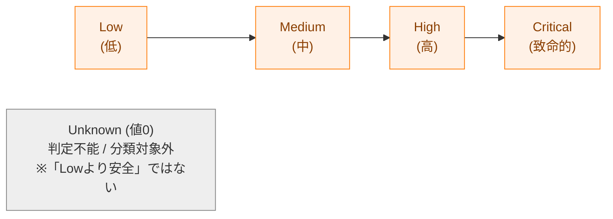
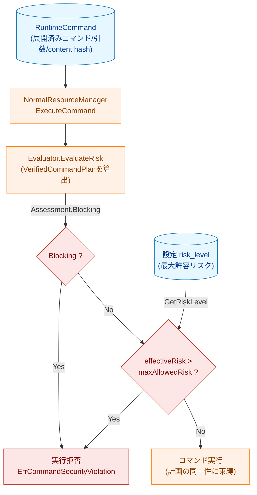
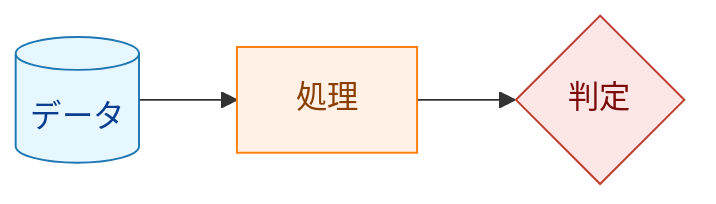
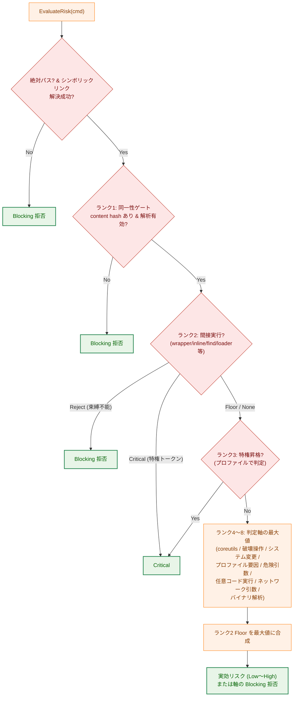
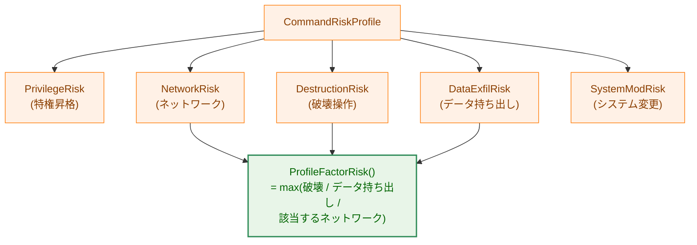

# コマンドリスク判定 技術解説

## 概要

本文書は、`runner` がコマンドを **実行する時点** で行う「リスク判定（risk evaluation）」の仕組みを、開発者向けに解説するものである。

`runner` は設定ファイル（TOML）に記述された各コマンドを実行する前に、そのコマンドが持つセキュリティ上の危険度を **リスクレベル** として算出する。算出されたリスクレベル（実効リスク）が、コマンドに設定された **最大許容リスクレベル（`risk_level`）** を超える場合、そのコマンドの実行を拒否する。また、判定が確実に行えない場合（バイナリの同一性が未検証、シンボリックリンク解決の失敗、間接実行で束縛不能な対象など）は、許容レベルとは無関係に **ブロッキング（Blocking）拒否** とする。これにより「設定で明示的に許可した範囲を超える危険な操作」と「安全性を確認できない操作」を実行前に遮断する。

リスク判定の結果は、単なるリスクレベルではなく **検証済み実行計画（`VerifiedCommandPlan`）** として返される。計画は、評価したバイナリの同一性（解決済みパス・content hash・fd）を実行時の同一性と束縛し、実行器はこの計画にもとづいて実行する（評価した実体と実行する実体が一致することを保証する）。

この判定は、ハッシュ検証（ファイル整合性検証）やバイナリ静的解析といった他のセキュリティ層と密接に連動して動作する。本文書では **リスクレベルの決定ロジック** に焦点を当てる。

### 対象読者

- リスク判定ロジックを変更・拡張する開発者
- 新しいコマンドのリスクプロファイルを追加する開発者
- `risk_level` 設定の挙動を理解したい利用者

### 関連パッケージ

| パッケージ | 役割 |
|-----------|------|
| `internal/runner/base/risk` | 実行時リスク判定のエントリポイント（`StandardEvaluator.EvaluateRisk`） |
| `internal/runner/base/security` | 個別判定ロジック（特権昇格・破壊操作・システム変更・coreutils・間接実行・任意コード実行・バイナリ解析など） |
| `internal/runner/base/risktypes` | 評価結果の DTO（`VerifiedCommandPlan` / `RiskAssessment` / `ReasonCode` / `BinaryAnalysisResult` など） |
| `internal/runner/base/runnertypes` | `RiskLevel` 型と設定値のパース、`RuntimeCommand` |
| `internal/runner/base/audit` | リスク判定結果の監査ログ出力（`Logger.LogRiskProfile`） |
| `internal/runner/resource` | リスク判定の呼び出しと許容レベルとの比較（実行可否の判断、`NormalResourceManager` / `DryRunResourceManager`） |

## リスクレベルの定義

リスクレベルは `runnertypes.RiskLevel`（`internal/runner/base/runnertypes/config.go`）で定義される列挙型である。**危険度の順序を持つのは `Low` 以上の 4 段階** であり、`Unknown`（値 0）はこの順序の一部ではなく「リスクを判定できなかった／分類対象外」を表す特別な値である点に注意する。



| レベル | 定数 | 文字列 | 意味 |
|--------|------|--------|------|
| 0 | `RiskLevelUnknown` | `unknown` | リスクを判定できなかった／分類対象外（**Low より安全という意味ではない**） |
| 1 | `RiskLevelLow` | `low` | セキュリティリスクが最小限のコマンド |
| 2 | `RiskLevelMedium` | `medium` | 中程度のリスク（ネットワーク操作・システム変更など） |
| 3 | `RiskLevelHigh` | `high` | 高リスク（破壊的操作・任意コード実行・動的ロード・exec シグナルなど） |
| 4 | `RiskLevelCritical` | `critical` | 実行を遮断すべきコマンド（特権昇格など） |

**重要な性質**：

- `Low` 〜 `Critical` は整数として **大小比較可能** であり、複数の要因がある場合は原則として **最大値** が採用される（`max(...)`）。
- `Unknown`（値 0）は数値としては最小だが、意味は「判定不能／分類対象外」であって **`Low` より安全という意味ではない**。実装上、判定不能なケースは数値比較ではなく `RiskAssessment.Blocking`（ブロッキング拒否）として表現され、許容レベル比較を素通りすることはない（**フェイルクローズド**）。`Unknown` は主に「この判定では確定できないので後続の判定に委ねる」という内部シグナルとして使われる（例：`SystemModificationRisk` や `ProfileFactorRisk` の「該当なし」を表す戻り値）。
- `critical` と `unknown` は **設定ファイルでは指定できない**（`ParseRiskLevel` がいずれもエラーを返す）。`critical` は内部利用専用であり、特権昇格コマンドのように「必ず遮断すべき」ものに割り当てられる。
- 設定で `risk_level` を省略した場合の既定値は `low` である（`CommandSpec.GetRiskLevel` が `RiskLevelLow` を返す）。

### `risk_level` のスコープ（コマンドレベルのみ）

`risk_level` は **コマンドレベル（command-level）** の設定であり、個々のコマンド（`CommandSpec.RiskLevel`）に宣言する。省略したコマンドはコマンドテンプレート（command template, `CommandTemplate.RiskLevel`）の既定へフォールバックし、それも未設定なら実効既定は `low` となる。**グループレベルやグローバルレベルの `risk_level` は存在しない**：グループスコープやグローバル既定として設定することはできず、グループ／グローバル設定からの継承もない。各コマンドが（必要に応じてコマンドテンプレート経由で）自身の最大許容リスクを持つ。これにより許容リスクの判断は実行対象コマンドにローカルに閉じ、あるコマンドの上限を緩めても他のコマンドに暗黙に影響しない。

## 実行時の全体フロー

リスク判定は通常実行モード（`NormalResourceManager.ExecuteCommand`）の中で行われる。評価器の配線は `runner.go` で行われ、検証マネージャから得た解析依存（`AnalysisDeps`）を `NetworkAnalyzer` に渡し、それを `StandardEvaluator` に渡して組み立てる（`security.NewNetworkAnalyzer` → `risk.NewStandardEvaluator`）。



**凡例（Legend）**



実行可否の比較は `internal/runner/resource/normal_manager.go` で行われる。

```go
// Step 1: 検証済み実行計画を算出（実効リスク・拒否理由・検証済み同一性を含む）
plan, err := n.riskEvaluator.EvaluateRisk(cmd)
// err は「予期しない内部エラー（分類不能なレコード読込失敗）」のみ。
// ポリシー上の拒否はエラーではなく plan.Assessment.Blocking で表現される。

effectiveRisk := plan.Assessment.Level

// Step 2: 設定から最大許容リスクを取得（既定は low）
maxAllowedRisk, err := cmd.GetRiskLevel()

// Step 3: 統一リスクゲート。Blocking なら許容レベルに関わらず拒否、
//         そうでなければ実効リスクが許容上限を超えていれば拒否する。
denied := plan.Assessment.Blocking || effectiveRisk > maxAllowedRisk
```

ポイント：

- **実効リスク（effectiveRisk）**：コマンドの内容から算出される実際の危険度（`Assessment.Level`）。
- **ブロッキング（Blocking）**：許容レベルに関係なく拒否すべき状態（同一性未検証、解析不能、間接実行で束縛不能など）。`Assessment.Blocking` で表現され、`effectiveRisk > maxAllowedRisk` の比較より優先される。
- **最大許容リスク（maxAllowedRisk）**：利用者が設定で許可した上限。
- `critical` は設定に書けないため、特権昇格コマンドのように実効リスクが `critical` になるものは **どんな設定でも必ず拒否される**（既定の `low` はもちろん、最大の `high` を設定しても `critical > high` となる）。
- 計画が開いた検証済みファイルディスクリプタは、許可・拒否・エラーのいずれの経路でも `plan.Close()` で必ず解放される（ディスクリプタ漏れ防止）。

## リスク判定アルゴリズム（`EvaluateRisk`）

実行時リスクの中核は `risk.StandardEvaluator.EvaluateRisk`（`internal/runner/base/risk/evaluator.go`）である。判定は **ランク付けされた拒否ゲートで短絡（ショートサーキット）した後、残りの判定軸の最大値をとる** 構成になっている。すなわち以下の 2 段構えである。

1. **短絡する拒否ゲート（ランク1〜3）**：同一性ゲート・間接実行・特権昇格。いずれかに該当すると即座に拒否（Blocking）または Critical を返す。
2. **順序非依存の最大値（ランク4〜8）**：残りの判定軸を **すべて評価** し、その **最大値** を実効リスクとする。「最初に該当したものを返す」早期リターン方式ではない点に注意する。



### 前処理: 絶対パスとシンボリックリンク解決

判定軸に入る前に、次の前提を満たすことを確認する。満たさなければ **Blocking 拒否** となる。

- コマンドパスは評価器到達時点で **絶対パス** でなければならない（呼び出し側が解決済み）。相対パスは同一性が確立できず、バイナリ解析が暗黙にスキップされてしまうため拒否する（`ReasonNonAbsolutePath`）。
- シンボリックリンク連鎖は `security.ResolveCommandNames`（**strict**）で一度だけ解決する。解決失敗・深さ上限超過（`MaxSymlinkDepth = 40`、`ErrSymlinkDepthExceeded`）・循環は `ReasonSymlinkResolutionFailed` で **フェイルクローズド** 拒否する。部分解決された連鎖で評価して危険な実体を見逃すことを防ぐためである。

解決によって得られる「名前集合」（元の名前・basename・連鎖中の各リンク先とその basename）は、以降の名前ベース判定（特権・破壊操作・システム変更など）で共有される。

### ランク1: 同一性ゲート → Blocking 拒否

バイナリの同一性を確認できない場合は、設定された `risk_level` に関わらず拒否する（`identityGate`）。これは他のどの判定軸よりも前に評価され、未検証バイナリが後続の軸で「Low/High 許容可」と判定されて通過することを防ぐ。

- `cmd.ExpandedCmdContentHash` が空（ハッシュ検証で同一性が確立されていない）→ `ReasonUncertainUnverifiedIdentity` で Blocking。
- バイナリ解析が無効（`NetworkAnalyzer.AnalysisEnabled()` が false、すなわち `RecordStore` 未設定）→ `ReasonAnalysisDisabled` で Blocking。解析無効はフェイルオープンではなくフェイルクローズドである。

### ランク2: 間接実行（indirect execution）の解析

検証済みバイナリ以外の実体を実行・ロードする形態を検出する（`security.AnalyzeIndirectExecution`）。詳細は後述の「間接実行の解析」を参照。結果（`IndirectExecutionResult.Kind`）に応じて以下のように扱う。

- `IndirectCritical`：実効ターゲットに特権昇格トークン（sudo/su/doas）がある → **Critical**（短絡）。
- `IndirectReject`：実行時まで同一性を束縛できない形態（抽出不能なラッパー、禁止されたローダ制御変数、find/xargs の子プロセス exec、動的ローダ直接起動、リモートシェルヘルパー）→ **Blocking 拒否**（短絡）。
- `IndirectFloor`：許容されるが最小リスクレベルを持つ形態（ラッパーの抽出可能な内側コマンドは一律 High、インラインシェル・パッケージスクリプトランナーは High など）→ そのレベルを **リスクの下限（floor）** として、後続の判定軸の最大値に合成する。
- `IndirectNone`：間接実行形態ではない。

連鎖中に実行・ロードされる各実体（`ExecutedArtifact`）は、監査のために計画へ記録される（ラッパー内側コマンドの fd 束縛・同一性束縛は行わない。タスク 0138）。

### ランク3: 特権昇格 → Critical

解決済みプロファイルが特権昇格を示す場合は **Critical**（常に拒否）。`security.ResolveProfile(names)` でプロファイルを引き、`profile.IsPrivilege()`（`PrivilegeRisk >= High`）が真なら該当する。プロファイル上では `sudo` / `su` / `doas` が `PrivilegeRisk = Critical` として定義されている。シンボリックリンクを辿った名前集合で照合するため、別名（`/usr/bin/foo` が `sudo` を指す等）でも検出する。

### ランク4〜8: 判定軸の最大値（`evaluateDimensions`）

ここからは **順序非依存** で、該当するすべての軸を評価し最大値をとる（`addDimension` が `max` をとりつつ理由コードを蓄積する）。初期値は `Low`。途中でフェイルクローズドが必要な軸（coreutils のファイル情報取得失敗、バイナリ解析の不確実）に当たった場合は **Blocking 拒否** を返す。

- **ランク4: coreutils 単一バイナリ分類**（`security.CoreutilsCommandRisk`）。該当する場合は権威的に扱い、バイナリ解析軸（ランク8）を抑止する。ただし他の軸は引き続き寄与する。
- **破壊的ファイル操作**（`security.IsDestructiveFileOperation`）→ High。
- **システム変更**（`security.SystemModificationRisk`）→ Medium/High（後述）。
- **ランク5: プロファイル要因**（`applyProfileFactors` → `security.ProfileFactorRisk`）。特権はランク3、システム変更は上記で扱うため、ここでは破壊・データ持ち出し・該当するネットワークの 3 要因のみを合成する。プロファイルの人間可読な理由（`GetRiskReasons`）と `NetworkType` も記録する。
- **ランク6: 危険な引数パターン**（`security.CheckDangerousArgPatterns`）：`rm -rf`、`dd if=`、`chmod 777`、`mkfs.*` など。
- **ランク7: 任意コード実行ランナー**（`security.IsArbitraryCodeExecutionRunner`）→ 引数によらず High（後述）。
- **ネットワーク引数**：プロファイル未登録のコマンドで、引数に URL や SSH 形式アドレスがあれば（`security.HasNetworkArguments`）→ Medium。
- **ランク8: バイナリ静的解析**（coreutils 該当時は抑止）。`NetworkAnalyzer.Classify` の結果を合成する（後述）。`BinaryAnalysisUncertain` は **Blocking 拒否**。

最後に、ランク2の `IndirectFloor` のレベルを最大値へ合成し（ラップされた危険コマンドが過小評価されないように）、理由コード・理由文字列を追記して重複排除する。

最終的に Blocking でなければ、`allowedPlan` が検証済み実体を fd 束縛で開いて実行可能な計画を返す（開けない場合は `ReasonIdentityUnbound` で Blocking 拒否）。

## 間接実行（indirect execution）の解析

`security.AnalyzeIndirectExecution`（`internal/runner/base/security/indirect_execution.go`）は、**検証したバイナリとは別の実体を実行・ロードする形態** を検出し、評価器がどう扱うべきか（Critical / Reject / Floor / None）を返す。検出は basename と解決済みシンボリックリンクで行い、ラッパーがラッパーをラップする入れ子は再帰的に解析する（深さ上限 `indirectExecMaxDepth = 16`）。

主な検出対象：

- **シェバン（shebang）スクリプト**：`#!/usr/bin/env python` のように、カーネルがシェバンのインタプリタ（別実体）を起動するため、インタプリタ連鎖を評価しゲートする。basename ベースのラッパー照合より前に判定する。
- **ラッパー**（`env`, `timeout`, `nice`, `ionice`, `nohup`, `stdbuf`, `setsid`, `time`, `chrt`, `taskset`）：runner はこれらを再実装せず、内側コマンドを抽出して一律 High の floor としてリスク評価する（一意に抽出できるため reject ではなく評価する。runner が内側コマンドを exec・fd 束縛・同一性束縛するわけではない）。内側コマンドが特権トークンなら Critical。`env` は `NAME=VALUE` 代入・`-S` 分割文字列・`-C/--chdir`（拒否）を個別に解析し、ローダ制御変数（`LD_*` / `DYLD_*`）の指定や PATH 上書き＋裸の内側名は拒否する。
- **find / xargs の子プロセス exec**（`-exec`/`-execdir`/`-ok`/`-okdir`、xargs のヘルパー）：runner の子プロセスではなく find/xargs 自身の子プロセスから実行されるため同一性束縛できない。特権トークンなら Critical、それ以外は Reject。
- **動的ローダ直接起動**（`ld-linux*.so --preload ...` 等）：任意ライブラリをロードできるため Reject。
- **リモートシェル／出力フィルタヘルパー**（`rsync -e`、`tar --to-command` / `--checkpoint-action`）：ツールの子プロセスからヘルパーが走るため Reject。
- **パッケージスクリプトランナー**（`npm run` / `npx` / `yarn <script>` / `pnpm run` / `bunx` 等）：未検証のマニフェストからスクリプトを実行するため High の Floor。
- **インラインコード**（`bash -c`、`python -c`/`-e` など）：High の Floor。
- **SysV service**：未検証の init スクリプト（`/etc/init.d/<name>`）を実行するため、init スクリプトを連鎖実体として記録しつつ High の Floor。

内側コマンドの評価（`evaluateInnerAs`）は `role` で分岐する。**ラッパー経由インナー（`RoleInner`）は細粒度算出を行わず一律 High 下限**とする（特権トークンは Critical、禁止形態は Reject を優先）。インナーは fd 束縛・自動ハッシュ検証されないため、内容に応じた細粒度レベルを与えても実体固定の裏付けがなく、明示的な `risk_level = "high"` のオプトインなしには実行されない fail-safe を優先する（タスク 0138）。一方、**直接スクリプト実行の shebang インタプリタ連鎖（`RoleInterpreter`）は従来どおり細粒度算出を維持する**（特権・破壊操作・coreutils・システム変更・任意コード実行ランナー・危険引数パターン・リスクプロファイル要因を折り込み、直接起動の場合より過小評価されないようにする）。連鎖中の実体は、Floor/Critical/Reject のいずれの結果でも監査のために記録される。

> 設計意図：これらの「束縛不能な実行形態」を拒否するのは、ハッシュ検証で確認した実体とは異なる実体が実行されてしまう経路を塞ぐためである。内側コマンドを一意に抽出できるラッパーは（一律 High として）許容され、他者のプロセス（find/xargs 自身の子プロセスなど）からヘルパーを起動する形態は、ターゲットを監査用に抽出・記録できる場合でも runner が同一性束縛できないため拒否される。なお runner はラッパーを再実装せず、内側コマンドの exec・fd 束縛も行わない（タスク 0138）。

## コマンドリスクプロファイル

`CommandRiskProfile`（`internal/runner/base/security/command_risk_profile.go`）は、1 つのコマンドに対する **複数のリスク要因** を分離して保持する構造体である。



各要因は `RiskFactor`（`Level` と人間可読の `Reason`）を持つ。

リスク評価への寄与の仕方は要因ごとに異なる：

- `PrivilegeRisk` は専用の特権ゲート（ランク3、`IsPrivilege()`）で処理する。
- `SystemModRisk` は `SystemModificationRisk`（後述）で処理する。
- 残りの `DestructionRisk` / `DataExfilRisk` / `NetworkRisk`（該当する場合）は `ProfileFactorRisk` で 1 つのレベルに折り込み、ランク5の判定軸として最大値に寄与する。

そのため、`CommandRiskProfile.BaseRiskLevel()`（全要因の単純最大値）は **現在の評価経路では使用されておらず**、プロファイル検査・テスト向けの補助関数として残されている。

プロファイルの解決は `ResolveProfile(names)` が行う。シンボリックリンクで複数の名前がプロファイルに一致した場合は、各要因の最大値をとってマージする（`mergeProfilesMax`）。

プロファイルはビルダーパターン（`NewProfile(...).XxxRisk(...).Build()`）で定義する。例：

```go
// 特権昇格コマンド
NewProfile("sudo", "su", "doas").
    PrivilegeRisk(runnertypes.RiskLevelCritical, "...").
    Build(),

// AI サービス（ネットワーク + データ持ち出しの 2 要因）
NewProfile("claude", "gemini", "chatgpt", "gpt", "openai", "anthropic").
    NetworkRisk(runnertypes.RiskLevelHigh, "Always communicates with external AI API").
    DataExfilRisk(runnertypes.RiskLevelHigh, "May send sensitive data to external service").
    AlwaysNetwork().
    Build(),
```

`NetworkType` は次の 3 種である（`ProfileNetworkApplies` が適用可否を判定する）：

- `NetworkTypeAlways`：常にネットワーク操作を行う。
  - 例：`curl`, `wget`（Medium）, `ssh`, `scp`, `nc`, `aws`、AI 系（`claude` 等、High）。
  - **スクリプト言語・シェルも含む**：`bash`, `python`, `node`, `ruby`, `java`, `perl`、その他多数の言語ランタイム（Lua/Tcl/R/Julia/Guile/Erlang/JVM 系/.NET 系/PowerShell など）は、本体バイナリにネットワークシンボルが無くても任意のネットワークツールを内部で呼び出せるため `Always`（Medium）として扱う。なおこれらの多くは後述の **任意コード実行ランナー** にも該当し、その場合は High となる。
- `NetworkTypeConditional`：引数によってネットワーク操作になるかが決まる。
  - `git`：サブコマンドが `clone` / `fetch` / `pull` / `push` / `remote` の場合（グローバルオプションを読み飛ばして判定）。
  - `rsync`：リモート指定がある場合。
  - 加えて、引数に URL や SSH 形式アドレスがあればネットワークと判定。
- `NetworkTypeNone`：ネットワークプロファイルなし。

`Validate()` により整合性が検証される（例：`NetworkTypeAlways` なら `NetworkRisk >= Medium` であること、`NetworkSubcommands` は `Conditional` のみで指定可）。

### システム変更リスク（`SystemModificationRisk`）

システム変更は専用関数 `SystemModificationRisk(names)` が判定する（プロファイルの `SystemModRisk` ではなくこちらが評価経路の単一の情報源）。判定は、**解決済みのバイナリ名（basename とシンボリックリンク解決結果）が、後述の High／Medium の名前集合に含まれるか**だけで行い、引数（サブコマンド・フラグ）は参照しない。

- パッケージマネージャ（`apt`, `apt-get`, `yum`, `dnf`, `zypper`, `pacman`, `brew`, `pip`, `npm`, `yarn`, `dpkg`, `rpm`）→ **High**。未検証のメンテナンススクリプト（dpkg `postinst`、rpm `%post`、pip `setup.py`、npm `postinstall` 等）を特権実行し得るため、サブコマンドによらず一律 High（`apt list` のような照会も High）。
- `systemctl`：全サブコマンド一律 **High**（照会系の `status`/`show`/`list-*` を含む。未検証の unit を扱うため）。
- `service`：未検証の init スクリプトを実行するため常に **High**。
- その他のシステム管理系コマンド（`mount`, `umount`, `fdisk`, `parted`, `mkfs`, `fsck`, `crontab`, `at`, `batch`, `chkconfig`, `update-rc.d`）→ **Medium**（定義済み操作によるシステム状態変更で、未検証コードの特権実行ではないため）。

該当しない場合は `RiskLevelUnknown` を返し、システム変更軸は寄与しない。

> **粗粒度化（0137／systemctl サブコマンド粒度の撤回）**: 本判定は、かつて systemctl のサブコマンド解析（read-only=Medium／change=High）と、0137 が導入したパッケージマネージャのフラグ方式・verb 方式の検出（install/remove 系の動詞のみを Medium とし照会系を除外）を持っていたが、これらは脅威モデルに対して過剰で実 config が依存していないため撤回し、名マッチ固定レベルへ単純化した。サブコマンド／フラグ解析を行っていた旧実装と関連シンボルは撤去済み。

### 任意コード実行ランナー（`IsArbitraryCodeExecutionRunner`）

`arbitrary_code.go` の `arbitraryCodeExecutionRunners` に列挙されたコマンドは、本ツールのリスク評価・ハッシュ検証の外部にある入力（スクリプト・レシピ・ビルド定義）から任意のコードを実行しうるため、**引数によらず High** とする。

- シェル（`bash`, `sh`, `zsh` 等）、スクリプトインタプリタ・ランタイム（`python`, `node`, `ruby`, `perl`, `php`, `lua`, `java`, `dotnet`, `pwsh` 等、別名を含む）。
- ビルド・タスクランナー（`make`, `cmake`, `gradle`, `mvn`, `bazel`, `rake`, `just`, `go`, `cargo` 等）。

`--version` や `--help` のような無害な起動も区別せず High とする（網羅的に安全な起動を判別するのは安全でないため）。

### 新しいコマンドのプロファイルを追加する

1. `command_analysis.go` の `commandProfileDefinitions` にエントリを追加する。
2. 該当するリスク要因（`PrivilegeRisk` / `NetworkRisk` / `DestructionRisk` / `DataExfilRisk` / `SystemModRisk`）を設定する。
3. ネットワークの種別（`AlwaysNetwork()` / `ConditionalNetwork(...)`）を必要に応じて指定する。
4. 各リスク要因には根拠（`Reason`）を必ず記述する（監査ログに出力される）。
5. インタプリタ・ビルドランナーを追加する場合は、`arbitrary_code.go` の `arbitraryCodeExecutionRunners` にも追加し、別名が過小評価されないようにする。

## バイナリ静的解析（`NetworkAnalyzer.Classify`）

プロファイルに無い未知コマンドは、事前計算された解析レコード（`RecordStore`）を用いて静的解析する（`NetworkAnalyzer.Classify`、`internal/runner/base/security/network_analyzer.go`）。レコードには ELF/Mach-O のシンボル解析・シスコール解析の結果が含まれる。`Classify` は **4 つのクラス** のいずれかを返す（`risktypes.BinaryAnalysisResult`）。

| クラス | 意味 | 評価器での扱い |
|--------|------|----------------|
| `BinaryAnalysisClean` | 危険・ネットワークいずれのシグナルも無し | 寄与なし（Low） |
| `BinaryAnalysisNetwork` | ネットワークシグナルのみ | Medium |
| `BinaryAnalysisHighRisk` | 動的ロード/exec/svc/mprotect シグナル | High |
| `BinaryAnalysisUncertain` | シグナルを確実に取得できない | **Blocking 拒否**（フェイルクローズド） |

検出されるシグナルと理由コード：

| シグナル | 扱い | 理由コード |
|----------|------|-----------|
| ネットワークシンボル（socket/DNS）・ネットワークシスコール | Network | `binary_analysis_network` |
| 動的ロードシンボル（`dlopen`/`dlsym`/`dlvsym`） | HighRisk | `binary_analysis_dynamic_load` |
| exec シスコール | HighRisk | `binary_analysis_exec` |
| `svc #0x80` 直接シスコール（未解決） | HighRisk | `binary_analysis_svc` |
| mprotect 系で `PROT_EXEC` が確定または不明 | HighRisk | `binary_analysis_mprotect_exec` |

**フェイルクローズドの設計**：解析の確実性が担保できない場合は `Uncertain`（Blocking 拒否）に倒す。具体的には次のいずれも `Uncertain` となる。

- `RecordStore` が nil（解析機能なし）→ `analysis_disabled`（通常はランク1の同一性ゲートで先に拒否される）。
- `contentHash` が空（バイナリの同一性が未検証）→ `uncertain_unverified_identity`。
- 解析レコードが見つからない → `uncertain_missing_record`。
- スキーマ不一致 → `uncertain_schema_mismatch`。
- content hash 不一致 → `uncertain_hash_mismatch`。

なお、分類不能な真の I/O 失敗（レコード読込失敗）だけは `Classify` が **エラー** を返し、評価器はそれを呼び出し元へ伝播する（`NormalResourceManager` は最小限の deny 監査を出してから処理を中止する）。

> 注：`contentHash` はハッシュ検証で得た「algo:hex」形式の事前計算ハッシュであり、解析レコードがディスク上のバイナリと一致することを保証する。リスク判定はファイル整合性検証と密接に連動している。

### ネットワーク引数の検出（`HasNetworkArguments`）

プロファイル・バイナリ解析とは別に、引数に以下が含まれればネットワーク操作とみなす（プロファイル未登録のコマンドに対してランク4〜8の軸として Medium を寄与）。

- `://` を含む URL。
- SSH 形式アドレス（`[user@]host:path`）。メールアドレスやポート番号、時刻表記との誤検出を避けるため、正規表現で厳密に判定する。

## coreutils 単一バイナリの分類

Rust 製 coreutils のように、すべてのサブコマンドが **1 つのバイナリ** を共有する実装に対応するための特別処理である（`security.CoreutilsCommandRisk`、`coreutils.go`）。通常のバイナリ静的解析では、単一バイナリ内に全サブコマンドのシンボルを含むため誤分類されてしまう。これを避けるため、ランク4で専用ロジックにより分類し、該当時はバイナリ解析軸を抑止する。

判定条件と挙動：

- 対象は、解決済みパスの **親ディレクトリが coreutils ディレクトリ（`common.CoreutilsDir = /usr/lib/cargo/bin/coreutils`）と完全一致** するコマンドのみ。一致しない場合は `handled=false` を返し、他の軸（バイナリ解析を含む）で評価される。
- setuid/setgid ビットが立っていれば **High**（coreutils のハードリンクが setuid であることは通常ありえず、パッケージング不備か改ざんの兆候）。
- 実効サブコマンドの決定：
  - 通常はパスの basename（例：`/usr/lib/cargo/bin/coreutils/rm` → `rm`）。
  - マルチコール・エントリポイント（basename が `coreutils`）の場合は、引数の最初の非オプション要素を採用（`coreutils rm -rf ...` → `rm`）。
- 実効サブコマンドによる分類：
  - 破壊系（`dd`, `rm`, `rmdir`, `shred`, `truncate`, `unlink`）→ **High**
  - 既知の安全系（`ls`, `cat`, `mkdir`, `sha256sum` 等の読み取り・情報取得・テキスト処理・新規作成系）→ **Low**
  - それ以外（ディレクトリ配下だが分類不明・識別不能）→ **High**（フェイルセーフの既定。`coreutils <subcmd>` が解析不能な場合に破壊系サブコマンドを隠せないよう、Medium ではなく High に倒す）
- setuid チェックの stat がエラーになった場合、実行時パスでは **エラーを伝播してフェイルクローズド**（Blocking 拒否）。

## 実行時パスとドライランパスの違い

リスク判定には 2 つの入口があるが、**いずれも同一の `EvaluateRisk` を共有** する。差異は「結果をどう扱うか」だけである（以前存在した `AnalyzeCommandSecurity` のような別系統のドライラン専用ロジックは廃止された）。

| 観点 | 実行時パス | ドライランパス |
|------|-----------|---------------|
| 評価関数 | `risk.StandardEvaluator.EvaluateRisk`（共通） | 同左（共通） |
| 呼び出し元 | `NormalResourceManager.ExecuteCommand` | `DryRunResourceManager.evaluateCommandRisk` |
| 目的 | 実行可否の判断（許容レベルと比較） | リスクの **表示・説明**（実行はしない） |
| ポリシー拒否時の挙動 | 実行を中止（エラー） | 拒否を記録して **継続**（プレビュー継続） |
| 同一性未検証／解析不能の扱い | Blocking 拒否（中止） | Blocking 拒否として記録。`verification_unavailable`（同一性未検証・解析無効）は別扱いし、専用の終了コードで報告 |
| 内部エラー（レコード読込失敗等） | 監査を出して中止 | 監査を出して中止（ハードエラー） |

両パスとも、判定の確実性（同一性・解析の可用性）が担保できない場合はフェイルクローズドに倒す点は共通である。ドライランは「この環境では検証できないため拒否されるが、検証可能な本番環境での結果を予測する」ための表示を付加する点が異なる。

### 拒否 / エラー / High 許可の区別（dry-run の失敗時挙動）

dry-run のプレビューは 3 つの結果を区別し、失敗を **High として表示継続することは決してない**。失敗はリスクレベルへ丸め込まず、拒否（deny）かエラーとして表面化させる。

- **deny 予告（deny preview）** — ポリシー拒否に分類できる失敗（解析レコード欠落、スキーマ／content hash 不一致、解析無効、シンボリックリンク解決失敗、identity 束縛不能）は **拒否（deny）** として予告する。プレビューは中止せず、拒否を記録して次のコマンドへ継続する。
- **エラー（error）** — 解析自体を進められない失敗（パス解決失敗、コマンド不在）と、分類不能な内部 I/O 障害（例：予期しないレコード読込エラー）は、実行時パスと共有する 2 系統の切り分けに従い **エラー**（中止するハードエラー）として返す。
- **High 許可（High-allowable）** — 実効リスクが本当に High に算出されるコマンド（例：危険なバイナリ解析シグナル）は High として表示し、High を許可する設定下では実行される。High/Critical への変換は詳細解析内の特定チェックによってのみ起こり、検証不能なコマンドのフォールバックとして使われることはない。検証不能なコマンドは High 表示ではなく deny 予告である。

## 監査ログ

リスク判定の結果は監査ログに記録される（`internal/runner/base/audit/logger.go` の `Logger.LogRiskProfile`）。許可・拒否のいずれの決定でも、また内部エラーで中止する経路でも、必ず 1 件のエントリが出力される。入力は `risktypes.RiskAuditEntry`（DTO）である。

主なフィールド：

- `audit_type`: `command_risk_profile`
- `mode`: `normal` / `dry-run`
- `decision`: `allow` / `deny`
- `risk_level`: 算出された実効リスクレベル
- `max_allowed_risk`: 設定された最大許容リスク
- `resolved_path` / `content_hash` / `record_id`: 相関用の識別情報（未取得なら欠落マーカー）
- `network_type`: ネットワーク種別（none/always/conditional）
- `reason_codes`: 機械可読の理由コード（`ReasonCode` の配列）
- `risk_factors`: 各リスク要因の人間可読な `Reason` の配列
- `blocking_reason`: 拒否理由コード（Blocking・Critical いずれの拒否でも設定）
- `error_class`: 失敗起因の拒否の分類（シンボリックリンク解決失敗・coreutils ファイル情報失敗・レコード読込失敗・パス解決失敗・risk_level 設定不正など）
- `verification_unavailable`: ドライランで検証/解析が利用不能だったことを示す
- `command_args`: マスク済みのコマンド引数
- `chain`: 間接実行で実行・ロードされた各実体（path / role / disposition / content_hash）

ログレベルはリスクレベルに対応し、さらに **拒否の場合は最低でも Warn** に引き上げられる（Low ceiling で拒否された Medium コマンドも Warn/Error 検索で見つかるように）。

| リスクレベル | ログレベル |
|-------------|-----------|
| Critical | Error |
| High | Warn |
| Medium | Info（拒否時は Warn 以上） |
| Low / Unknown | Debug（拒否時は Warn 以上） |

これにより、なぜそのコマンドが特定のリスクレベルと判定されたか、どの理由コードで拒否されたかを事後に追跡できる。

## 脅威モデルと限界

リスク判定は **多層防御の 1 層** であり、単独で全脅威を遮断するものではない。判定を拡張する開発者は以下の前提・限界を意識する必要がある（利用者向けには `docs/user/risk_assessment.md` にも記載）。

- **ブロックリスト方式**：コマンド名・引数の評価は **既知** の危険シグナル（プロファイル・パターン・解析）に対して加点する。いずれにも該当しないコマンドはこの次元では `low` と算出されるため、**未知のコマンドは既定 `risk_level = "low"` で通過し得る**（フェイルクローズドが救うのはバイナリ解析の不確実のみで、未知だが無害なコマンドではない）。したがって安全な運用は、**許可コマンドの許可リスト（allowlist）とハッシュ固定（`verify_files`）の併用** に依存する：ハッシュが記録済み解析レコードと一致する検証済みバイナリだけが実行される。ブロックリストは主たる制御ではなくバックストップである。
- **照合は basename 中心の完全一致**：実行時リスク判定はコマンド名の規則を（シンボリックリンク解決後の）**完全一致** の basename で照合し、部分一致（部分文字列一致）では照合しない — `lsrm` は `rm` とは扱われず、`systemctl-helper` は `systemctl` とは扱われない。限界は **ハードリンクやリネームに対応しない** ことである：危険なバイナリを別の basename に配置した場合、検証済みであってもリスクが正しく算出されない。緩和策は同じく許可リスト＋ハッシュ固定である（シンボリックリンクは解決されるが、ハードリンクは内容とハッシュを共有しても名前は共有しない）。
- **`output_file` は別サブシステムで評価され、コマンドリスクには合算されない**：コマンドの実行時リスク判定（本文書の対象である `EvaluateRisk`）は、出力先をコマンドの実効リスクに加算しない。ただし出力パスは出力サブシステム（`internal/runner/base/output`）が独立に検証・リスク評価する：パストラバーサルと危険文字の検査（`ValidateAndResolvePath`）、ディレクトリとファイルのシンボリックリンク成分および書き込み権限の検査（`security.Validator.ValidateOutputWritePermission`）を行い、書き込み先に独自のリスクレベル（システム重要ファイル／ディレクトリと機密鍵ファイルは Critical、システム／機密設定ディレクトリは High、作業ディレクトリまたはユーザーのホームディレクトリ配下は Low、その他は Medium。`AnalyzeOutput` / `evaluateSecurityRisk`、dry-run プレビューに表示）を割り当てる。留意点は、この出力パスのリスクがコマンドの実効リスクとは別に追跡される、という点のみであって、出力パスが未検査だということではない。
- **root 実行向けの危険判定との関係（別系統、完全一致 vs 部分一致）**：root 実行を対象とした別系統の validator 側チェックが存在する（`Validator.IsDangerousRootCommand` / `HasDangerousRootArgs`）。これは **方針の異なる別系統** である：root 向けの引数チェックは引数値に対して **部分一致（部分文字列一致）** を用いる（`HasDangerousRootArgs` は `strings.Contains`）のに対し、本文書で説明する実行時リスク判定はコマンド名規則に **完全一致 basename** を用いる。両者は異なるパスに適用され、本タスクでは **統合しない**。関係性は次のとおり：root 実行向けチェックは特権実行のための validator／セキュリティ解析パスに属し、実行時リスク判定（`EvaluateRisk`）は `risk_level` に対して許可／拒否を決めるゲートである。1 つのコマンドに複数の規則が該当する場合、実行時判定は該当する全次元の **最大値** をとり（より具体的な危険分類がより一般的な分類によって引き下げられることはない）、短絡する拒否ゲート（同一性 → 間接実行 → 特権昇格）は最大値計算より優先する。コマンドを root で実行しても、それ自体では算出リスクレベルは変わらない。権限昇格は別途検出する（`sudo`/`su`/`doas` トークン → `critical`）。

### 名前ベース AI 検出の限界

AI サービスの名前ベース検出（`claude`/`gemini`/`chatgpt` 等を High とするプロファイル、`commandProfileDefinitions`）は、一般的なデータ送信（`curl`/`wget`/`scp`/`sftp`/`rsync`/`ssh`/`nc` 等の Medium）を塞ぐための仕組みではない。これは **salient（顕著）な明示的ケースに対する多層防御（defense-in-depth）の一層** にすぎず、機密データの外部送信そのものをコマンド名で網羅的に遮断するものではない。具体的な限界は次のとおり：

- **未列挙のツールは素通りする**：プロファイルに列挙されていない AI クライアント（新興サービスや社内ツール等）はこの High 加点を受けず、データ送信の判断軸の Medium（プロファイルが無く引数にもネットワーク兆候が無ければ Low）で算出される。
- **リネームで回避できる**：実行時判定は **完全一致 basename** で照合するため（前述「照合は basename 中心の完全一致」）、`claude` を別 basename にコピー／ハードリンクすると High 検出を回避できる（シンボリックリンクは解決されるが、ハードリンク・リネームには対応しない）。
- **multi-call は捕捉しない**：名前ベース判定は単一コマンドの名前のみを見るため、`curl` でデータを一時ファイルへ退避し別コマンドで送信する、といった複数コマンドに分割した送信は、個々のステップが Medium 以下で素通りし得る。

したがって、機密データ送信に対する安全な運用は名前ベース AI 検出に依存せず、**許可コマンドの許可リスト（allowlist）とハッシュ固定（`verify_files`）の併用** を前提とする（前述「ブロックリスト方式」と同じ緩和策）。名前ベース AI 検出は、その許可リストの内側で顕著なケースを追加的に High へ引き上げるバックストップとして位置づけられる。

## まとめ

- `runner` は実行時に各コマンドの **検証済み実行計画（`VerifiedCommandPlan`）** を算出し、その実効リスクレベルを設定の **最大許容リスクレベル** と比較して実行可否を決める。判定不能・束縛不能なケースは許容レベルに関わらず **Blocking 拒否** とする。
- 判定はまず短絡する拒否ゲート（同一性ゲート → 間接実行 → 特権昇格）を評価し、続いて残りの判定軸（coreutils・破壊操作・システム変更・プロファイル要因・危険引数・任意コード実行・ネットワーク引数・バイナリ解析）の **最大値** をとる。早期リターンではなく順序非依存の最大値である。
- 検証済みバイナリ以外を実行・ロードする **間接実行形態** は、内側コマンドを一意に抽出できるラッパー（一律 High）を除き拒否される。
- 判定が確実でない場合（同一性未検証、解析無効、シンボリックリンク異常、解析レコード欠落・不一致など）は **フェイルクローズド**（Blocking 拒否）で安全側に倒す。
- `critical`（および `unknown`）は設定で指定できず、`critical` は特権昇格などの「必ず遮断すべき」コマンドに内部的に割り当てられる。
- 実行時パスとドライランパスは同一の `EvaluateRisk` を共有し、結果の扱い（中止するか、表示して継続するか）だけが異なる。
