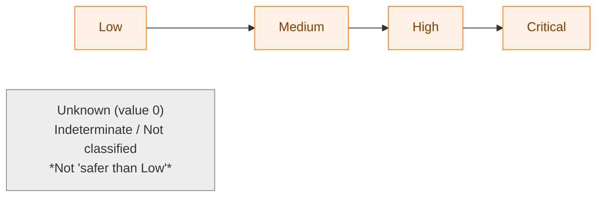
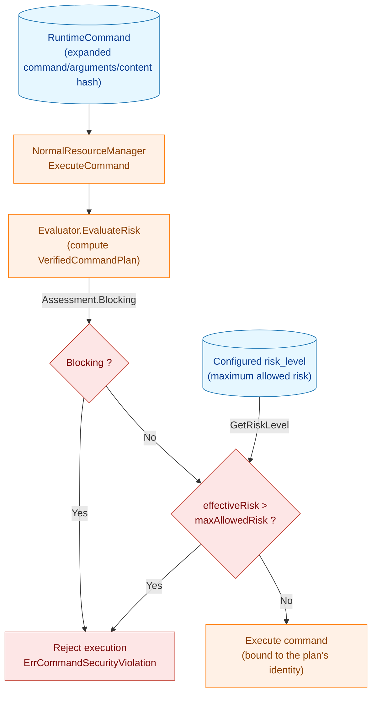
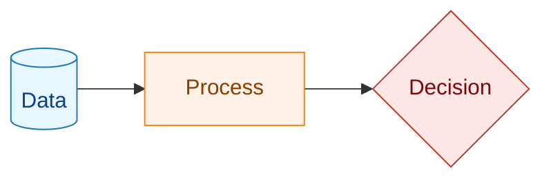
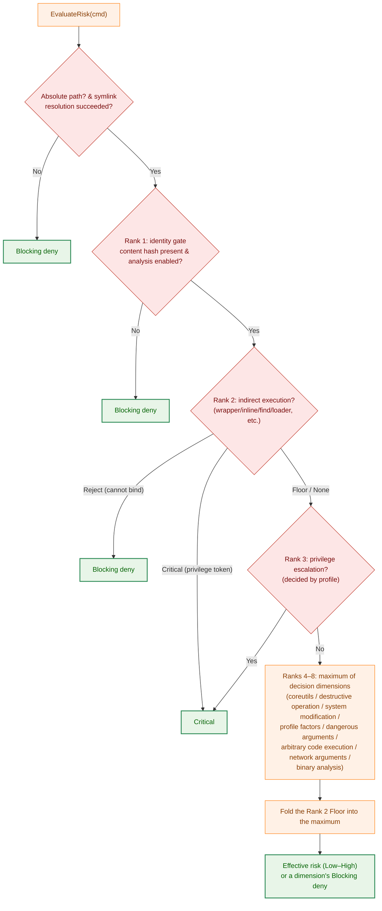
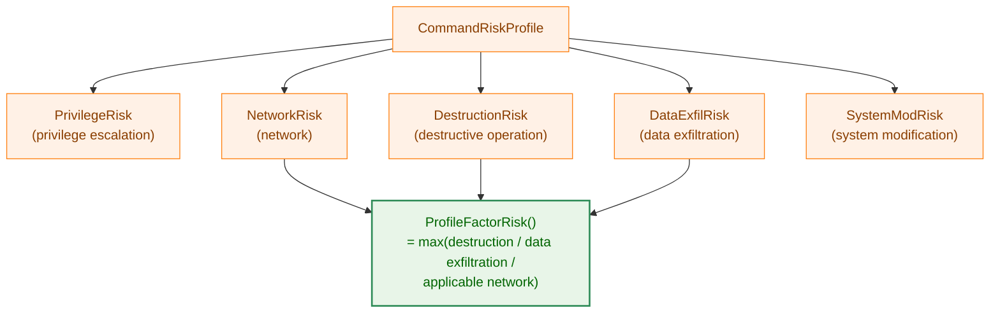

# Command Risk Evaluation: Technical Explanation

## Overview

This document explains, for developers, the mechanism of the "risk evaluation" that `runner` performs at the point when it **executes** a command.

Before executing each command described in the configuration file (TOML), `runner` computes the security danger level that the command carries as a **risk level**. If the computed risk level (the effective risk) exceeds the **maximum allowed risk level (`risk_level`)** configured on the command, it rejects execution of that command. In addition, when the evaluation cannot be performed with certainty (the binary's identity is unverified, symlink resolution failed, an indirect-execution target cannot be bound, etc.), it is a **Blocking deny** regardless of the allowed level. This blocks, before execution, both "dangerous operations that exceed the range explicitly allowed by the configuration" and "operations whose safety cannot be confirmed."

The result of risk evaluation is returned not as a mere risk level but as a **verified command plan (`VerifiedCommandPlan`)**. The plan binds the identity of the evaluated binary (resolved path, content hash, fd) to the identity at execution time, and the executor executes based on this plan (guaranteeing that the entity that was evaluated and the entity that is executed are identical).

This evaluation works closely in concert with other security layers such as hash verification (file integrity verification) and binary static analysis. This document focuses on the **logic that determines the risk level**.

### Intended Audience

- Developers who change or extend the risk evaluation logic
- Developers who add a risk profile for a new command
- Users who want to understand the behavior of the `risk_level` setting

### Related Packages

| Package | Role |
|-----------|------|
| `internal/runner/base/risk` | Entry point for runtime risk evaluation (`StandardEvaluator.EvaluateRisk`) |
| `internal/runner/base/security` | Individual decision logic (privilege escalation, destructive operations, system modification, coreutils, indirect execution, arbitrary code execution, binary analysis, etc.) |
| `internal/runner/base/risktypes` | DTOs for the evaluation result (`VerifiedCommandPlan` / `RiskAssessment` / `ReasonCode` / `BinaryAnalysisResult`, etc.) |
| `internal/runner/base/runnertypes` | The `RiskLevel` type, parsing of configuration values, and `RuntimeCommand` |
| `internal/runner/base/audit` | Audit logging of the risk evaluation result (`Logger.LogRiskProfile`) |
| `internal/runner/resource` | Invocation of risk evaluation and comparison with the allowed level (decision of whether execution is allowed, `NormalResourceManager` / `DryRunResourceManager`) |

## Definition of Risk Levels

The risk level is an enumerated type defined by `runnertypes.RiskLevel` (`internal/runner/base/runnertypes/config.go`). **Only the four levels from `Low` upward have an ordering of danger**; note that `Unknown` (value 0) is not part of this ordering but a special value representing "risk could not be determined / not classified."



| Level | Constant | String | Meaning |
|--------|------|--------|------|
| 0 | `RiskLevelUnknown` | `unknown` | Risk could not be determined / not classified (**does not mean safer than Low**) |
| 1 | `RiskLevelLow` | `low` | Command with minimal security risk |
| 2 | `RiskLevelMedium` | `medium` | Moderate risk (network operations, system modification, etc.) |
| 3 | `RiskLevelHigh` | `high` | High risk (destructive operations, arbitrary code execution, dynamic load, exec signal, etc.) |
| 4 | `RiskLevelCritical` | `critical` | Command that should be blocked (privilege escalation, etc.) |

**Important properties**:

- `Low` through `Critical` are **comparable** as integers, and when there are multiple factors the **maximum** is adopted as a rule (`max(...)`).
- `Unknown` (value 0) is the smallest as a number, but its meaning is "indeterminate / not classified," and it **does not mean safer than `Low`**. In the implementation, an indeterminate case is represented not by a numeric comparison but as `RiskAssessment.Blocking` (a Blocking deny), and it never slips past the allowed-level comparison (**fail-closed**). `Unknown` is mainly used as an internal signal meaning "this evaluation cannot determine it, so defer to the subsequent evaluation" (e.g., the return value of `SystemModificationRisk` or `ProfileFactorRisk` representing "not applicable").
- `critical` and `unknown` **cannot be specified in the configuration file** (`ParseRiskLevel` returns an error for both). `critical` is reserved for internal use only and is assigned to things that "must be blocked," such as privilege escalation commands.
- When `risk_level` is omitted in the configuration, the default value is `low` (`CommandSpec.GetRiskLevel` returns `RiskLevelLow`).

### Scope of `risk_level` (command-level only)

`risk_level` is a **command-level** setting. It is declared on an individual command (`CommandSpec.RiskLevel`), and a command that omits it falls back to the **command template** default (`CommandTemplate.RiskLevel`); if that is also unset, the effective default is `low`. There is **no group-level or global-level `risk_level`**: the value cannot be set at the group scope or as a global default, and there is no inheritance from a group or global setting. Each command (optionally via its command template) carries its own maximum allowed risk. This keeps the allowed-risk decision local to the command being executed, so widening the ceiling for one command never silently affects another.

## Overall Runtime Flow

Risk evaluation is performed within the normal execution mode (`NormalResourceManager.ExecuteCommand`). The wiring of the evaluator is done in `runner.go`, where the analysis dependencies (`AnalysisDeps`) obtained from the verification manager are passed to `NetworkAnalyzer`, which in turn is passed to `StandardEvaluator` to assemble it (`security.NewNetworkAnalyzer` → `risk.NewStandardEvaluator`).



**Legend**



The comparison of whether execution is allowed is performed in `internal/runner/resource/normal_manager.go`.

```go
// Step 1: Compute the verified command plan (includes the effective risk, the deny reason, and the verified identity)
plan, err := n.riskEvaluator.EvaluateRisk(cmd)
// err is only for an "unexpected internal error (an unclassifiable record-load failure)".
// A policy deny is not an error; it is represented by plan.Assessment.Blocking.

effectiveRisk := plan.Assessment.Level

// Step 2: Get the maximum allowed risk from the configuration (default is low)
maxAllowedRisk, err := cmd.GetRiskLevel()

// Step 3: Unified risk gate. If Blocking, deny regardless of the allowed level;
//         otherwise, deny if the effective risk exceeds the allowed upper limit.
denied := plan.Assessment.Blocking || effectiveRisk > maxAllowedRisk
```

Key points:

- **Effective risk (effectiveRisk)**: the actual danger level computed from the content of the command (`Assessment.Level`).
- **Blocking**: a state that should be denied regardless of the allowed level (unverified identity, analysis impossible, an indirect execution that cannot be bound, etc.). It is represented by `Assessment.Blocking` and takes precedence over the `effectiveRisk > maxAllowedRisk` comparison.
- **Maximum allowed risk (maxAllowedRisk)**: the upper limit the user has allowed in the configuration.
- Because `critical` cannot be written in the configuration, anything whose effective risk becomes `critical`, such as a privilege escalation command, is **always rejected under any configuration** (of course with the default `low`, but even if you configure the maximum `high`, it becomes `critical > high`).
- The verified file descriptor opened by the plan is always released via `plan.Close()` on every path—allow, deny, or error (to prevent descriptor leaks).

## Risk Evaluation Algorithm (`EvaluateRisk`)

The core of runtime risk is `risk.StandardEvaluator.EvaluateRisk` (`internal/runner/base/risk/evaluator.go`). The evaluation is structured to **short-circuit at ranked deny gates and then take the maximum of the remaining decision dimensions**. That is, it has the following two stages:

1. **Short-circuiting deny gates (ranks 1–3)**: the identity gate, indirect execution, and privilege escalation. If any of these match, it immediately returns a deny (Blocking) or Critical.
2. **Order-independent maximum (ranks 4–8)**: it evaluates **all** of the remaining decision dimensions and takes their **maximum** as the effective risk. Note that this is not an early-return scheme of "return the first one that matches."



### Preprocessing: Absolute Path and Symlink Resolution

Before entering the decision dimensions, it confirms that the following prerequisites are met. If they are not met, it becomes a **Blocking deny**.

- The command path must be an **absolute path** by the time it reaches the evaluator (the caller resolves it). A relative path is denied because the identity cannot be established and binary analysis would be silently skipped (`ReasonNonAbsolutePath`).
- The symlink chain is resolved once with `security.ResolveCommandNames` (**strict**). A resolution failure, exceeding the depth limit (`MaxSymlinkDepth = 40`, `ErrSymlinkDepthExceeded`), or a cycle is denied **fail-closed** with `ReasonSymlinkResolutionFailed`. This is to prevent evaluating a partially resolved chain and missing a dangerous entity.

The "name set" obtained by resolution (the original name, the basename, and each link target in the chain together with its basename) is shared by the subsequent name-based decisions (privilege, destructive operations, system modification, etc.).

### Rank 1: Identity Gate → Blocking Deny

When the binary's identity cannot be confirmed, it is denied regardless of the configured `risk_level` (`identityGate`). This is evaluated before any other decision dimension, preventing an unverified binary from being judged "allowable for Low/High" by a subsequent dimension and passing through.

- `cmd.ExpandedCmdContentHash` is empty (identity has not been established by hash verification) → Blocking with `ReasonUncertainUnverifiedIdentity`.
- Binary analysis is disabled (`NetworkAnalyzer.AnalysisEnabled()` is false, i.e., `RecordStore` is not configured) → Blocking with `ReasonAnalysisDisabled`. Disabled analysis is fail-closed, not fail-open.

### Rank 2: Analysis of Indirect Execution

It detects forms that execute or load an entity other than the verified binary (`security.AnalyzeIndirectExecution`). See "Analysis of Indirect Execution" below for details. Depending on the result (`IndirectExecutionResult.Kind`), it is handled as follows.

- `IndirectCritical`: the effective target has a privilege escalation token (sudo/su/doas) → **Critical** (short-circuit).
- `IndirectReject`: a form whose identity cannot be bound until execution time (a wrapper that cannot be extracted, a forbidden loader-control variable, a find/xargs child-process exec, a direct dynamic-loader invocation, a remote-shell helper) → **Blocking deny** (short-circuit).
- `IndirectFloor`: an allowable form that has a minimum risk level (an extractable inner command within a wrapper is a flat High; an inline shell or a package script runner is High, etc.) → that level is folded into the maximum of the subsequent decision dimensions as a **risk floor**.
- `IndirectNone`: not an indirect-execution form.

Each entity executed or loaded within the chain (`ExecutedArtifact`) is recorded in the plan for auditing (the inner command of a wrapper is not fd-bound or identity-bound; Task 0138).

### Rank 3: Privilege Escalation → Critical

When the resolved profile indicates privilege escalation, it is **Critical** (always denied). It looks up the profile with `security.ResolveProfile(names)`, and if `profile.IsPrivilege()` (`PrivilegeRisk >= High`) is true, it matches. In the profiles, `sudo` / `su` / `doas` are defined as `PrivilegeRisk = Critical`. Because matching uses the name set obtained by following symlinks, it is also detected under an alias (e.g., `/usr/bin/foo` pointing to `sudo`).

### Ranks 4–8: Maximum of Decision Dimensions (`evaluateDimensions`)

From here on, it is **order-independent**: it evaluates all applicable dimensions and takes the maximum (`addDimension` takes the `max` while accumulating reason codes). The initial value is `Low`. If it hits a dimension that requires fail-closed handling along the way (a coreutils file-info retrieval failure, or an uncertain binary analysis), it returns a **Blocking deny**.

- **Rank 4: coreutils single-binary classification** (`security.CoreutilsCommandRisk`). When it applies, it is treated as authoritative and suppresses the binary-analysis dimension (Rank 8). However, the other dimensions still contribute.
- **Destructive file operation** (`security.IsDestructiveFileOperation`) → High.
- **System modification** (`security.SystemModificationRisk`) → Medium/High (see below).
- **Rank 5: profile factors** (`applyProfileFactors` → `security.ProfileFactorRisk`). Because privilege is handled in Rank 3 and system modification is handled above, only the three factors of destruction, data exfiltration, and applicable network are folded here. The human-readable reasons of the profile (`GetRiskReasons`) and the `NetworkType` are also recorded.
- **Rank 6: dangerous argument patterns** (`security.CheckDangerousArgPatterns`): `rm -rf`, `dd if=`, `chmod 777`, `mkfs.*`, etc.
- **Rank 7: arbitrary-code-execution runner** (`security.IsArbitraryCodeExecutionRunner`) → High regardless of arguments (see below).
- **Network arguments**: for a command not registered in a profile, if the arguments contain a URL or an SSH-style address (`security.HasNetworkArguments`) → Medium.
- **Rank 8: binary static analysis** (suppressed when coreutils applies). It folds in the result of `NetworkAnalyzer.Classify` (see below). `BinaryAnalysisUncertain` is a **Blocking deny**.

Finally, the level of the Rank 2 `IndirectFloor` is folded into the maximum (so that a wrapped dangerous command is not under-evaluated), and the reason codes and reason strings are appended and deduplicated.

In the end, if it is not Blocking, `allowedPlan` opens the verified entity with fd binding and returns an executable plan (if it cannot be opened, it is a Blocking deny with `ReasonIdentityUnbound`).

## Analysis of Indirect Execution

`security.AnalyzeIndirectExecution` (`internal/runner/base/security/indirect_execution.go`) detects **forms that execute or load an entity other than the verified binary** and returns how the evaluator should handle it (Critical / Reject / Floor / None). Detection is done by basename and resolved symlinks, and a nesting where a wrapper wraps a wrapper is analyzed recursively (depth limit `indirectExecMaxDepth = 16`).

Main detection targets:

- **Shebang script**: as in `#!/usr/bin/env python`, the kernel launches the shebang interpreter (a separate entity), so the interpreter chain is evaluated and gated. This is decided before the basename-based wrapper matching.
- **Wrappers** (`env`, `timeout`, `nice`, `ionice`, `nohup`, `stdbuf`, `setsid`, `time`, `chrt`, `taskset`): `runner` does not re-implement these; it extracts the inner command and assesses its risk (because the inner command can be extracted unambiguously, it evaluates rather than rejects — `runner` does not exec, fd-bind, or identity-bind the inner command). If the inner command is a privilege token, it is Critical. `env` separately analyzes `NAME=VALUE` assignments, the `-S` split-string, and `-C/--chdir` (rejected), and it rejects the specification of a loader-control variable (`LD_*` / `DYLD_*`) or a PATH override combined with a bare inner name.
- **find / xargs child-process exec** (`-exec`/`-execdir`/`-ok`/`-okdir`, the xargs helper): because it is executed from find/xargs's own child process rather than `runner`'s child process, the identity cannot be bound. If it is a privilege token, Critical; otherwise, Reject.
- **Direct dynamic-loader invocation** (`ld-linux*.so --preload ...`, etc.): because it can load arbitrary libraries, Reject.
- **Remote-shell / output-filter helpers** (`rsync -e`, `tar --to-command` / `--checkpoint-action`): because the helper runs from the tool's child process, Reject.
- **Package script runners** (`npm run` / `npx` / `yarn <script>` / `pnpm run` / `bunx`, etc.): because they run a script from an unverified manifest, a High Floor.
- **Inline code** (`bash -c`, `python -c`/`-e`, etc.): a High Floor.
- **SysV service**: because it runs an unverified init script (`/etc/init.d/<name>`), it records the init script as a chain entity while applying a High Floor.

The evaluation of the inner command (`evaluateInnerAs`) branches on `role`. **A wrapper inner command (`RoleInner`) gets no fine-grained computation and is a flat High floor** (a privilege token takes priority as Critical, and forbidden forms as Reject). Because the inner command is not fd-bound or automatically hash-verified, a content-dependent fine-grained level would not be backed by any identity pinning, so a fail-safe is preferred: it is not executed without an explicit `risk_level = "high"` opt-in (Task 0138). In contrast, **the shebang interpreter chain of a direct script execution (`RoleInterpreter`) keeps the fine-grained computation as before** (folding in privilege, destructive operations, coreutils, system modification, arbitrary-code-execution runner, dangerous argument patterns, and risk profile factors, so that it is not under-evaluated compared to a direct invocation). The entities within the chain are recorded for auditing under any result of Floor/Critical/Reject.

> Design intent: these "execution forms that cannot be bound" are rejected in order to close off paths by which an entity different from the one confirmed by hash verification ends up being executed. Wrappers whose inner command can be extracted unambiguously are allowed (as a flat High); forms in which another process launches the helper (find/xargs's own child process, etc.) are rejected because `runner` cannot identity-bind the helper, even when the target can be extracted and recorded for auditing. Note that `runner` does not re-implement wrappers, nor does it exec or fd-bind the inner command (Task 0138).

## Command Risk Profile

`CommandRiskProfile` (`internal/runner/base/security/command_risk_profile.go`) is a struct that holds **multiple risk factors** for a single command separately.



Each factor has a `RiskFactor` (a `Level` and a human-readable `Reason`).

The way each factor contributes to the risk evaluation differs:

- `PrivilegeRisk` is handled by the dedicated privilege gate (Rank 3, `IsPrivilege()`).
- `SystemModRisk` is handled by `SystemModificationRisk` (see below).
- The remaining `DestructionRisk` / `DataExfilRisk` / `NetworkRisk` (when applicable) are folded into a single level by `ProfileFactorRisk` and contribute to the maximum as the Rank 5 decision dimension.

For that reason, `CommandRiskProfile.BaseRiskLevel()` (the simple maximum of all factors) is **not used on the current evaluation path**; it is retained as a helper for profile inspection and tests.

Profile resolution is performed by `ResolveProfile(names)`. When multiple names match a profile via symlinks, it merges them by taking the maximum of each factor (`mergeProfilesMax`).

The profile is defined with the builder pattern (`NewProfile(...).XxxRisk(...).Build()`). Example:

```go
// Privilege escalation command
NewProfile("sudo", "su", "doas").
    PrivilegeRisk(runnertypes.RiskLevelCritical, "...").
    Build(),

// AI service (two factors: network + data exfiltration)
NewProfile("claude", "gemini", "chatgpt", "gpt", "openai", "anthropic").
    NetworkRisk(runnertypes.RiskLevelHigh, "Always communicates with external AI API").
    DataExfilRisk(runnertypes.RiskLevelHigh, "May send sensitive data to external service").
    AlwaysNetwork().
    Build(),
```

`NetworkType` is one of the following three kinds (`ProfileNetworkApplies` decides whether it applies):

- `NetworkTypeAlways`: always performs network operations.
  - Examples: `curl`, `wget` (Medium), `ssh`, `scp`, `nc`, `aws`, and AI-related ones (`claude`, etc., High).
  - **Script languages and shells are also included**: `bash`, `python`, `node`, `ruby`, `java`, `perl`, and many other language runtimes (Lua/Tcl/R/Julia/Guile/Erlang, JVM-based, .NET-based, PowerShell, etc.) are treated as `Always` (Medium), because even if the main binary has no network symbols, they can invoke arbitrary network tools internally. Note that many of these also match the **arbitrary-code-execution runner** described below, in which case they become High.
- `NetworkTypeConditional`: whether it becomes a network operation is determined by the arguments.
  - `git`: when the subcommand is `clone` / `fetch` / `pull` / `push` / `remote` (decided after skipping the global options).
  - `rsync`: when a remote is specified.
  - In addition, if the arguments contain a URL or an SSH-style address, it is evaluated as network.
- `NetworkTypeNone`: no network profile.

Consistency is verified by `Validate()` (for example, if `NetworkTypeAlways`, then `NetworkRisk >= Medium`; `NetworkSubcommands` can be specified only for `Conditional`).

### System Modification Risk (`SystemModificationRisk`)

System modification is decided by the dedicated function `SystemModificationRisk(names, args)` (this, not the profile's `SystemModRisk`, is the single source of truth on the evaluation path).

- `systemctl`: branches by subcommand (`SystemctlSubcommandRisk`). Change verbs (start/stop/enable/mask, etc.) and unknown / unidentifiable verbs are **High**; read-only verbs (status/show/list-*, etc.) and an omitted subcommand are a **Medium** floor (not Low, because they can expose configuration information).
- `service`: because it runs an unverified init script, always **High**.
- Other system administration commands (`mount`, `umount`, `fdisk`, `mkfs`, `crontab`, `at`, etc.) → **Medium**.
- Package management commands (`apt`, `yum`, `dnf`, `npm`, `pip`, `pacman`, etc.), only when the arguments include a change verb such as `install` / `remove` / `upgrade` → **Medium** (a query such as `apt list` is not a target).

When none of these applies, it returns `RiskLevelUnknown` and the system-modification dimension does not contribute.

### Arbitrary-Code-Execution Runner (`IsArbitraryCodeExecutionRunner`)

Commands listed in `arbitraryCodeExecutionRunners` in `arbitrary_code.go` can execute arbitrary code from inputs (scripts, recipes, build definitions) that are outside this tool's risk evaluation and hash verification, so they are treated as **High regardless of arguments**.

- Shells (`bash`, `sh`, `zsh`, etc.), and script interpreters / runtimes (`python`, `node`, `ruby`, `perl`, `php`, `lua`, `java`, `dotnet`, `pwsh`, etc., including aliases).
- Build / task runners (`make`, `cmake`, `gradle`, `mvn`, `bazel`, `rake`, `just`, `go`, `cargo`, etc.).

Harmless invocations such as `--version` or `--help` are also treated as High without distinction (because exhaustively distinguishing harmless invocations is not safe).

### Adding a profile for a new command

1. Add an entry to `commandProfileDefinitions` in `command_analysis.go`.
2. Set the applicable risk factors (`PrivilegeRisk` / `NetworkRisk` / `DestructionRisk` / `DataExfilRisk` / `SystemModRisk`).
3. Specify the network type (`AlwaysNetwork()` / `ConditionalNetwork(...)`) as needed.
4. Always write a rationale (`Reason`) for each risk factor (it is output to the audit log).
5. When adding an interpreter or a build runner, also add it to `arbitraryCodeExecutionRunners` in `arbitrary_code.go` so that aliases are not under-evaluated.

## Binary Static Analysis (`NetworkAnalyzer.Classify`)

An unknown command that is not in a profile is statically analyzed using a precomputed analysis record (`RecordStore`) (`NetworkAnalyzer.Classify`, `internal/runner/base/security/network_analyzer.go`). The record contains the results of symbol analysis and syscall analysis of the ELF/Mach-O. `Classify` returns one of **four classes** (`risktypes.BinaryAnalysisResult`).

| Class | Meaning | Handling in the evaluator |
|--------|------|----------------|
| `BinaryAnalysisClean` | No dangerous or network signal | No contribution (Low) |
| `BinaryAnalysisNetwork` | Network signals only | Medium |
| `BinaryAnalysisHighRisk` | Dynamic load/exec/svc/mprotect signal | High |
| `BinaryAnalysisUncertain` | Signals cannot be obtained with certainty | **Blocking deny** (fail-closed) |

Detected signals and reason codes:

| Signal | Handling | Reason code |
|----------|------|-----------|
| Network symbol (socket/DNS) / network syscall | Network | `binary_analysis_network` |
| Dynamic load symbol (`dlopen`/`dlsym`/`dlvsym`) | HighRisk | `binary_analysis_dynamic_load` |
| exec syscall | HighRisk | `binary_analysis_exec` |
| `svc #0x80` direct syscall (unresolved) | HighRisk | `binary_analysis_svc` |
| `PROT_EXEC` in the mprotect family is confirmed or unknown | HighRisk | `binary_analysis_mprotect_exec` |

**Fail-closed design**: when the certainty of the analysis cannot be guaranteed, it falls to `Uncertain` (a Blocking deny). Specifically, all of the following become `Uncertain`.

- `RecordStore` is nil (no analysis capability) → `analysis_disabled` (normally denied earlier by the Rank 1 identity gate).
- `contentHash` is empty (the binary's identity is unverified) → `uncertain_unverified_identity`.
- The analysis record is not found → `uncertain_missing_record`.
- Schema mismatch → `uncertain_schema_mismatch`.
- Content hash mismatch → `uncertain_hash_mismatch`.

Note that only an unclassifiable, genuine I/O failure (a record-load failure) causes `Classify` to return an **error**, which the evaluator propagates to the caller (`NormalResourceManager` emits a minimal deny audit entry and then aborts processing).

> Note: `contentHash` is a precomputed hash in the "algo:hex" format obtained from hash verification, and it guarantees that the analysis record matches the binary on disk. Risk evaluation is closely linked with file integrity verification.

### Detection of Network Arguments (`HasNetworkArguments`)

Separately from the profile and binary analysis, if the arguments contain the following, it is regarded as a network operation (contributing Medium as a Rank 4–8 dimension for a command not registered in a profile).

- A URL containing `://`.
- An SSH-style address (`[user@]host:path`). To avoid false positives with email addresses, port numbers, and time formats, it is evaluated strictly with a regex.

## Classification of the coreutils Single Binary

This is special handling to support implementations, such as the Rust-based coreutils, where all subcommands share **a single binary** (`security.CoreutilsCommandRisk`, `coreutils.go`). In ordinary binary static analysis, coreutils is misclassified because the single binary contains the symbols of all subcommands. To avoid this, it is classified by dedicated logic in Rank 4, and when it applies, the binary-analysis dimension is suppressed.

Decision conditions and behavior:

- The target is only a command whose resolved path **has a parent directory that exactly matches the coreutils directory (`common.CoreutilsDir = /usr/lib/cargo/bin/coreutils`)**. If it does not match, it returns `handled=false` and is evaluated by the other dimensions (including binary analysis).
- If the setuid/setgid bit is set, it is **High** (a coreutils hardlink being setuid is normally impossible, and a set bit is a sign of a packaging defect or tampering).
- Determination of the effective subcommand:
  - Normally the basename of the path (e.g., `/usr/lib/cargo/bin/coreutils/rm` → `rm`).
  - For the multicall entry point (basename is `coreutils`), the first non-option element of the arguments is adopted (`coreutils rm -rf ...` → `rm`).
- Classification by the effective subcommand:
  - Destructive commands (`dd`, `rm`, `rmdir`, `shred`, `truncate`, `unlink`) → **High**
  - Known safe commands (`ls`, `cat`, `mkdir`, `sha256sum`, etc., which read, retrieve information, process text, or create new files) → **Low**
  - Everything else (under the directory but unclassified / unidentifiable) → **High** (the fail-safe default; it falls to High rather than Medium so that, when `coreutils <subcmd>` cannot be analyzed, a destructive subcommand cannot be hidden)
- If the stat of the setuid check results in an error, the runtime path **propagates the error and is fail-closed** (a Blocking deny).

## Difference Between the Runtime Path and the Dry-Run Path

There are two entry points for risk evaluation, but **both share the same `EvaluateRisk`**. The difference is only "how the result is handled" (a separate dry-run-specific logic such as the former `AnalyzeCommandSecurity` has been removed).

| Aspect | Runtime path | Dry-run path |
|------|-----------|---------------|
| Evaluation function | `risk.StandardEvaluator.EvaluateRisk` (shared) | Same (shared) |
| Caller | `NormalResourceManager.ExecuteCommand` | `DryRunResourceManager.evaluateCommandRisk` |
| Purpose | Decision of whether execution is allowed (comparison with the allowed level) | **Display and explanation** of the risk (does not execute) |
| Behavior on a policy deny | Abort execution (error) | Record the deny and **continue** (continue the preview) |
| Handling of unverified identity / analysis impossible | Blocking deny (abort) | Recorded as a Blocking deny. `verification_unavailable` (unverified identity / disabled analysis) is handled separately and reported with a dedicated exit code |
| Internal error (record-load failure, etc.) | Emit an audit entry and abort | Emit an audit entry and abort (a hard error) |

Both paths share the point that, when the certainty of the evaluation (identity / analysis availability) cannot be guaranteed, they fall to the fail-closed side. The dry-run differs in that it adds a display for "this command is denied because it cannot be verified in this environment, but this predicts the result in a production environment where verification is possible."

### Deny vs Error vs High-allowable (dry-run failure handling)

The dry-run preview distinguishes three outcomes, and a failure is **never shown by continuing to display the command as High** — failures are surfaced as a deny or an error, not folded into the risk level:

- **Deny preview** — failures that can be classified as a policy deny (missing analysis record, schema or content-hash mismatch, disabled analysis, symlink-resolution failure, identity that cannot be bound) are previewed as a **deny**. The preview does not abort; it records the deny and continues to the next command.
- **Error** — failures that prevent the analysis from running at all (path-resolution failure, command not found) and any unclassifiable internal I/O failure (e.g. an unexpected record-load error) are returned as an **error** (a hard error that aborts), per the two-track split shared with the runtime path.
- **High-allowable** — a command whose effective risk genuinely computes to High (for example dangerous binary-analysis signals) is displayed as High and, under a configuration that allows High, would execute. Conversion to High/Critical happens only through the specific checks inside the detailed analysis — it is never used as a fallback for an unverifiable command. An unverifiable command is a deny preview, not a High display.

## Audit Logging

The result of risk evaluation is recorded in the audit log (`Logger.LogRiskProfile` in `internal/runner/base/audit/logger.go`). For either decision—allow or deny—and even on the path that aborts due to an internal error, exactly one entry is always output. The input is `risktypes.RiskAuditEntry` (a DTO).

Main fields:

- `audit_type`: `command_risk_profile`
- `mode`: `normal` / `dry-run`
- `decision`: `allow` / `deny`
- `risk_level`: the computed effective risk level
- `max_allowed_risk`: the configured maximum allowed risk
- `resolved_path` / `content_hash` / `record_id`: identifying information for correlation (the absence marker when not obtained)
- `network_type`: the network type (none/always/conditional)
- `reason_codes`: machine-readable reason codes (an array of `ReasonCode`)
- `risk_factors`: an array of the human-readable `Reason` of each risk factor
- `blocking_reason`: the deny reason code (set for either a Blocking or a Critical deny)
- `error_class`: the classification of a failure-induced deny (symlink resolution failure, coreutils file-info failure, record-load failure, path resolution failure, invalid risk_level configuration, etc.)
- `verification_unavailable`: indicates that verification/analysis was unavailable in the dry-run
- `command_args`: the masked command arguments
- `chain`: each entity executed or loaded during indirect execution (path / role / disposition / content_hash)

The log level corresponds to the risk level, and is further raised to **at least Warn in the case of a deny** (so that even a Medium command denied under a Low ceiling can be found by a Warn/Error search).

| Risk level | Log level |
|-------------|-----------|
| Critical | Error |
| High | Warn |
| Medium | Info (Warn or higher on a deny) |
| Low / Unknown | Debug (Warn or higher on a deny) |

This makes it possible to trace afterward why a command was evaluated as a particular risk level and by which reason code it was denied.

## Threat Model and Limitations

Risk evaluation is **one layer of defense in depth**; it does not block every threat on its own. Developers extending it must keep the following premises and limits in mind (these are also documented for users in `docs/user/risk_assessment.md`).

- **Blocklist approach**: command-name and argument evaluation adds risk for **known** dangerous signals (profiles, patterns, analysis). A command that matches none of them is computed as `low` by that dimension, so an **unknown command can pass under the default `risk_level = "low"`** (fail-closed only rescues binary-analysis uncertainty, not unknown-but-clean commands). Safe operation therefore depends on combining an **allowlist of permitted commands with hash pinning** (`verify_files`): only verified binaries whose content hash matches the recorded analysis record are executed. The blocklist is a backstop, not the primary control.
- **Matching is basename-centered, exact match**: the runtime risk evaluation matches command-name rules by **exact** basename (after symlink resolution), not by substring — `lsrm` is not treated as `rm`, and `systemctl-helper` is not treated as `systemctl`. The limit is that it **does not handle hard links or renames**: a dangerous binary placed under a different basename will not have its risk computed correctly even though it is verified. The mitigation is again allowlist + hash pinning. (Symbolic links are resolved; hard links share content and hash but not name.)
- **`output_file` is assessed by a separate subsystem, not folded into the command risk**: the command's runtime risk evaluation (`EvaluateRisk`, the subject of this document) does not add the output destination to the command's effective risk. The output path is still validated and risk-assessed independently by the output subsystem (`internal/runner/base/output`): it is checked for path traversal and dangerous characters (`ValidateAndResolvePath`), its directory and file are checked for symlink components and write permission (`security.Validator.ValidateOutputWritePermission`), and the destination is assigned its own risk level — Critical for system-critical files/directories and sensitive key files, High for system or sensitive-config directories, Low under the working directory or the user's home directory, Medium otherwise (`AnalyzeOutput` / `evaluateSecurityRisk`, surfaced in the dry-run preview). The point to keep in mind is only that this output-path risk is tracked separately from the command's effective risk, not that the output path is unchecked.
- **Relationship to the root-execution danger checks (separate system, exact vs partial match)**: there is a separate validator-side check aimed at root execution (`Validator.IsDangerousRootCommand` / `HasDangerousRootArgs`). It is a **different system with a different policy**: the root-oriented argument check uses **partial (substring) matching** on argument values (`HasDangerousRootArgs` via `strings.Contains`), whereas the runtime risk evaluation described in this document uses **exact basename matching** for command-name rules. The two are applied on different paths and are **not integrated** in this task. Their relationship: the root-execution checks belong to the validator/security-analysis path for privileged execution, and the runtime risk evaluation (`EvaluateRisk`) is the gate that decides allow/deny against `risk_level`. When more than one rule applies to a command, the runtime evaluation takes the **maximum** across all applicable dimensions (a more specific dangerous classification is never lowered by a more general one), and the short-circuiting deny gates (identity → indirect execution → privilege escalation) take precedence over the maximum-of-dimensions. Running a command as root does not by itself change the computed risk level; privilege escalation is detected separately (the `sudo`/`su`/`doas` tokens → `critical`).

## Summary

- At runtime, `runner` computes the **verified command plan (`VerifiedCommandPlan`)** of each command and compares its effective risk level with the **maximum allowed risk level** in the configuration to decide whether execution is allowed. Indeterminate or unbindable cases are a **Blocking deny** regardless of the allowed level.
- The evaluation first evaluates the short-circuiting deny gates (identity gate → indirect execution → privilege escalation), and then takes the **maximum** of the remaining decision dimensions (coreutils, destructive operation, system modification, profile factors, dangerous arguments, arbitrary code execution, network arguments, binary analysis). It is an order-independent maximum, not an early return.
- **Indirect-execution forms** that execute or load an entity other than the verified binary are rejected, except for wrappers whose inner command can be extracted unambiguously (a flat High).
- When the evaluation is not certain (unverified identity, disabled analysis, symlink anomaly, missing or mismatched analysis record, etc.), it falls to the safe side with **fail-closed** (a Blocking deny).
- `critical` (and `unknown`) cannot be specified in the configuration, and `critical` is internally assigned to commands that "must be blocked," such as privilege escalation.
- The runtime path and the dry-run path share the same `EvaluateRisk`, and only the handling of the result (whether to abort, or to display and continue) differs.
