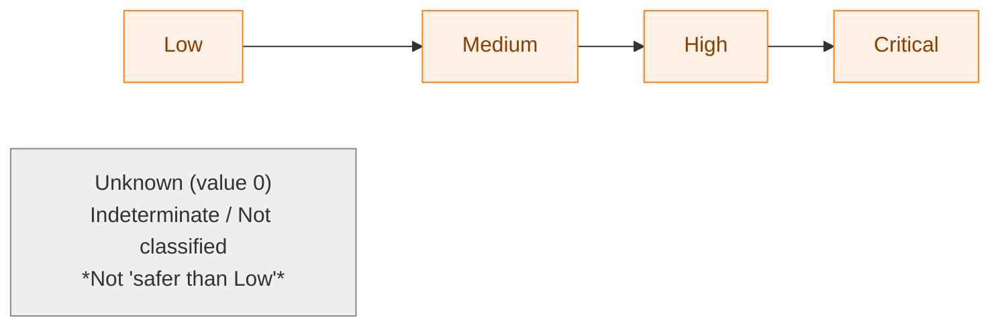
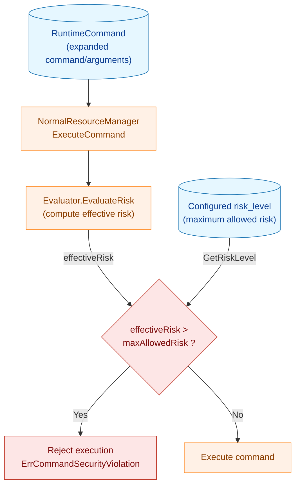
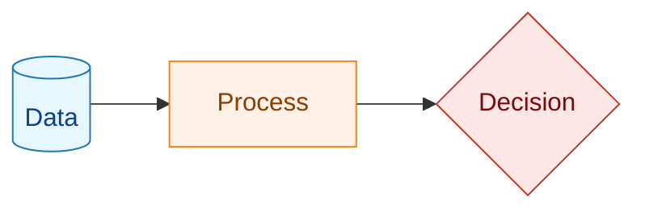
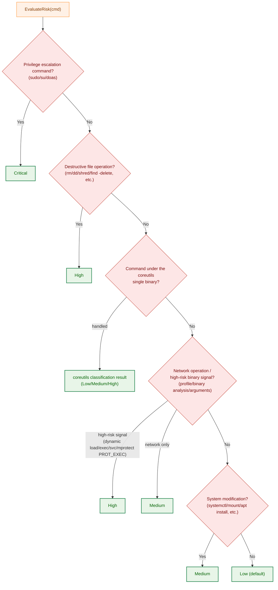
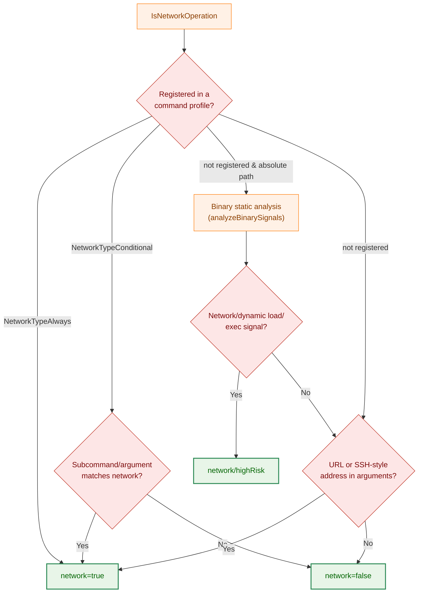
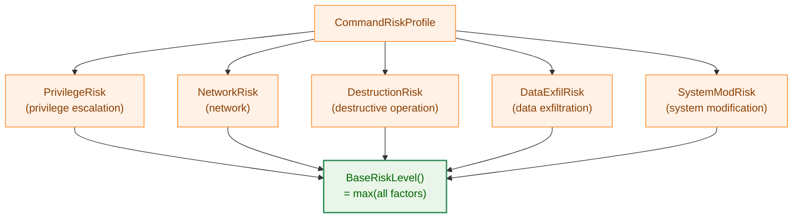

# Command Risk Evaluation: Technical Explanation

## Overview

This document explains, for developers, the mechanism of the "risk evaluation" that `runner` performs at the point when it **executes** a command.

Before executing each command described in the configuration file (TOML), `runner` computes the security danger level that the command carries as a **risk level**. If the computed risk level exceeds the **maximum allowed risk level (`risk_level`)** configured on the command or group, it rejects execution of that command. This blocks, before execution, "dangerous operations that exceed the range explicitly allowed by the configuration."

This evaluation works in combination with other security layers such as hash verification (file integrity verification) and binary static analysis. This document does not go into the details of those, and focuses on the **logic that determines the risk level**.

### Intended Audience

- Developers who change or extend the risk evaluation logic
- Developers who add a risk profile for a new command
- Users who want to understand the behavior of the `risk_level` setting

### Related Packages

| Package | Role |
|-----------|------|
| `internal/runner/base/risk` | Entry point for runtime risk evaluation (`Evaluator`) |
| `internal/runner/base/security` | Individual decision logic (privilege escalation, destructive operations, network, coreutils, etc.) |
| `internal/runner/resource` | Invocation of risk evaluation and comparison with the allowed level (decision of whether execution is allowed) |
| `internal/runner/base/runnertypes` | The `RiskLevel` type and parsing of configuration values |

## Definition of Risk Levels

The risk level is an enumerated type defined by `runnertypes.RiskLevel` (`internal/runner/base/runnertypes/config.go`). **Only the four levels from `Low` upward have an ordering of danger**; note that `Unknown` (value 0) is not part of this ordering but a special value representing "risk could not be determined / not classified."



| Level | Constant | String | Meaning |
|--------|------|--------|------|
| 0 | `RiskLevelUnknown` | `unknown` | Risk could not be determined / not classified (**does not mean safer than Low**) |
| 1 | `RiskLevelLow` | `low` | Command with minimal security risk |
| 2 | `RiskLevelMedium` | `medium` | Moderate risk (network operations, system modification, etc.) |
| 3 | `RiskLevelHigh` | `high` | High risk (destructive operations, dynamic load, exec signal, etc.) |
| 4 | `RiskLevelCritical` | `critical` | Command that should be blocked (privilege escalation, etc.) |

**Important properties**:

- `Low` through `Critical` are **comparable** as integers, and when there are multiple factors the **maximum** is adopted as a rule (`max(...)`).
- `Unknown` (value 0) is the smallest as a number, but its meaning is "indeterminate / not classified," and it **does not mean safer than `Low`**. In the implementation, `Unknown` never passes the allowed-level comparison (`effectiveRisk > maxAllowedRisk`) as "the lowest risk." This is because the runtime path (`EvaluateRisk`) returns `Unknown` **only together with an error**, and in that case the error propagates to the caller and the result is **fail-closed** (execution is aborted). `Unknown` is mainly used as an internal signal meaning "this evaluation cannot determine it, so defer to the subsequent evaluation" (e.g., intermediate results of `getDefaultRiskByDirectory` or `AnalyzeCommandSecurity`).
- `critical` **cannot be specified in the configuration file** (`ParseRiskLevel` returns an error). It is reserved for internal use only and is assigned to things that "must be blocked," such as privilege escalation commands.
- When `risk_level` is omitted in the configuration, the default value is `low` (`CommandSpec.GetRiskLevel` returns `RiskLevelLow`).

## Overall Runtime Flow

Risk evaluation is performed within the normal execution mode (`NormalResourceManager.ExecuteCommand`). The wiring is done in `runner.go`, where `NetworkAnalyzer` → `StandardEvaluator` → `ResourceManager` are assembled in this order.



**Legend**



The comparison of whether execution is allowed is performed in `internal/runner/resource/normal_manager.go`.

```go
// Step 1: Compute the effective risk
effectiveRisk, err := n.riskEvaluator.EvaluateRisk(cmd)

// Step 2: Get the maximum allowed risk from the configuration (default is low)
maxAllowedRisk, err := cmd.GetRiskLevel()

// Step 3: Compare. If it exceeds, reject execution
if effectiveRisk > maxAllowedRisk {
    return ..., fmt.Errorf("%w: command %s (effective risk: %s) exceeds maximum allowed risk level (%s)",
        runnertypes.ErrCommandSecurityViolation, ...)
}
```

Key points:

- **Effective risk (effectiveRisk)**: the actual danger level computed from the content of the command.
- **Maximum allowed risk (maxAllowedRisk)**: the upper limit the user has allowed in the configuration.
- Because `critical` cannot be written in the configuration, anything whose effective risk becomes `critical`, such as a privilege escalation command, is **always rejected under any configuration** (of course with the default `low`, but even if you configure the maximum `high`, it becomes `critical > high`).

## Risk Evaluation Algorithm (`EvaluateRisk`)

The core of runtime risk is `risk.StandardEvaluator.EvaluateRisk` (`internal/runner/base/risk/evaluator.go`). The evaluation is an **early-return scheme**: it evaluates in order from the higher (more dangerous) checks and returns the level that matches first.



Evaluation order (corresponding to the steps in the code):

### Step 1: Privilege escalation command → Critical

`security.IsPrivilegeEscalationCommand` inspects the command name. If it matches `sudo` / `su` / `doas`, it returns **Critical**.

- The decision follows symlinks (`extractAllCommandNames`). Even if `/usr/bin/foo` actually points to `sudo`, it is detected.
- If the symlink depth exceeds the limit (`MaxSymlinkDepth`), it returns an error (`ErrSymlinkDepthExceeded`) and the risk becomes `Unknown`. `EvaluateRisk` propagates the error to the caller, and the result is **fail-closed** (the command is not executed).

Privilege escalation commands are defined as `PrivilegeRisk = Critical` in `commandRiskProfiles` (see the profile section below).

### Step 2: Destructive file operation → High

`security.IsDestructiveFileOperation` evaluates the following as **High**:

- The command name is one of `rm` / `rmdir` / `unlink` / `shred` / `dd`.
- The arguments of `find` contain `-delete`, or a destructive command immediately follows `-exec`.
- The arguments of `rsync` contain a `--delete`-family option.

### Step 3: Classification of the coreutils single binary

This is special handling to support implementations, such as the Rust-based coreutils, where all subcommands share **a single binary**. `security.CoreutilsCommandRisk` makes the decision.

In ordinary binary static analysis (within the network analysis of Step 4), coreutils is misclassified because the single binary contains the symbols of all subcommands. To avoid this, it is classified by dedicated logic before the analysis.

Decision conditions and behavior:

- The target is only a command whose resolved path **has a parent directory that exactly matches the coreutils directory (`common.CoreutilsDir`)**. If it does not match, it returns `handled=false` and proceeds to the subsequent steps.
- If the setuid/setgid bit is set, it is **High** (a coreutils hardlink being setuid is normally impossible, and a set bit is a sign of a packaging defect or tampering).
- Determination of the effective subcommand:
  - Normally the basename of the path (e.g., `/opt/coreutils/rm` → `rm`).
  - For the multicall entry point (basename is `coreutils`), the first non-option element of the arguments is adopted (`coreutils rm -rf ...` → `rm`).
- Classification by the effective subcommand:
  - Destructive commands (`dd`, `rm`, `rmdir`, `shred`, `truncate`, `unlink`) → **High**
  - Known safe commands (`ls`, `cat`, `mkdir`, `sha256sum`, etc., which read, retrieve information, process text, or create new files) → **Low**
  - Everything else (under the directory but unclassified) → **Medium** (the fail-safe default)
- If the stat of the setuid check results in an error, the runtime path (`EvaluateRisk`) **propagates the error and is fail-closed** (does not execute).

### Step 4: Network operation / high-risk binary signal → High / Medium

`NetworkAnalyzer.IsNetworkOperation` makes the decision. Although the function name is "Network," its return value is `(isNetwork, isHighRisk, error)`, and it **also reports, via the `isHighRisk` side, high-risk binary signals that are not necessarily network operations**. Specifically, dynamic load symbols (`dlopen`/`dlsym`/`dlvsym`), exec syscalls, the `svc #0x80` direct syscall, and the **`PROT_EXEC` of the mprotect family** are included in this (see 4-2 for details).

- `isHighRisk == true` → **High** (High regardless of whether it is network; mprotect `PROT_EXEC`, etc. fall here)
- `isNetwork == true` (not high-risk) → **Medium**
- Both false → proceed to the next step

Detection is performed in the following priority order:



#### 4-1. Decision by command profile (highest priority)

It refers to the list of known commands hardcoded in `commandProfileDefinitions` (`internal/runner/base/security/command_analysis.go`). Each profile has a `NetworkType`:

- `NetworkTypeAlways`: always performs network operations. If it matches, `network=true` immediately.
  - Examples: `curl`, `wget`, `ssh`, `scp`, `nc`, `aws`, and AI-related ones (`claude`, `gemini`, etc.).
  - **Script languages and shells are also included**: `bash`, `python`, `node`, `ruby`, `java`, `perl`, etc. are treated as `Always` (fail-safe), because even if the main binary has no network symbols, they can invoke arbitrary network tools internally.
- `NetworkTypeConditional`: whether it becomes a network operation is determined by the arguments.
  - `git`: when the subcommand is `clone` / `fetch` / `pull` / `push` / `remote` (decided after skipping options with `findFirstSubcommand`).
  - `rsync`: when a remote is specified.
  - In addition, if the arguments contain a URL or an SSH-style address, it is evaluated as network.

These decisions are also made following symlinks.

#### 4-2. Binary static analysis (not registered in a profile and absolute path)

An unknown command that is not in a profile is statically analyzed using a precomputed analysis record (`RecordStore`) (`analyzeBinarySignals`). The record contains the results of symbol analysis and syscall analysis of the ELF/Mach-O.

Detected signals and their handling:

| Signal | Result |
|----------|------|
| Network symbol (socket/DNS) / network syscall | `isNetwork = true` (equivalent to Medium) |
| Dynamic load symbol (`dlopen`/`dlsym`/`dlvsym`) | `isHighRisk = true` (High) |
| exec syscall | `isHighRisk = true` (High) |
| `svc #0x80` direct syscall (unresolved) | `isHighRisk = true` (High) |
| `PROT_EXEC` in the mprotect family is confirmed or unknown | `isHighRisk = true` (High) |

**Fail-closed design**: when the certainty of the analysis cannot be guaranteed, it falls to the safe side (high risk).

- `RecordStore` is nil (no analysis capability) → `(false, false)`.
- `contentHash` is empty (the binary's identity is unverified) → `(true, true)` = High.
- The analysis record is not found / schema mismatch / content hash mismatch / analysis error / unknown result → all treated as High.

> Note: `contentHash` is a precomputed hash in the "algo:hex" format obtained from hash verification, and it guarantees that the analysis record matches the binary on disk. Risk evaluation is closely linked with file integrity verification.

#### 4-3. Argument-based detection

Even when it is not determined by the profile or binary analysis, if the arguments contain the following, it is evaluated as network (`hasNetworkArguments`):

- A URL containing `://`.
- An SSH-style address (`[user@]host:path`). To avoid false positives with email addresses, port numbers, and time formats, it is evaluated strictly with a regex.

### Step 5: System modification → Medium

`security.IsSystemModification` evaluates the following as **Medium**:

- System administration commands: `systemctl`, `service`, `mount`, `umount`, `fdisk`, `mkfs`, `crontab`, etc.
- Package management commands (`apt`, `yum`, `npm`, `pip`, etc.), only when the arguments include `install` / `remove` / `uninstall` / `upgrade` / `update`.

### Step 6: Default → Low

A command that matches none of the above is treated as **Low**.

## Command Risk Profile

`CommandRiskProfile` (`internal/runner/base/security/command_risk_profile.go`) is a struct that holds **multiple risk factors** for a single command separately.



Each factor has a `RiskFactor` (a `Level` and a human-readable `Reason`). The overall risk is computed as the **maximum** of all factors (`BaseRiskLevel`).

The profile is defined with the builder pattern (`NewProfile(...).XxxRisk(...).Build()`). Example:

```go
// Privilege escalation command
NewProfile("sudo", "su", "doas").
    PrivilegeRisk(runnertypes.RiskLevelCritical, "...").
    Build(),

// AI service (two factors: network + data exfiltration)
NewProfile("claude", "gemini", "chatgpt", ...).
    NetworkRisk(runnertypes.RiskLevelHigh, "Always communicates with external AI API").
    DataExfilRisk(runnertypes.RiskLevelHigh, "May send sensitive data to external service").
    AlwaysNetwork().
    Build(),
```

Consistency is verified by `Validate()` (for example, if `NetworkTypeAlways`, then `NetworkRisk >= Medium`).

### Adding a profile for a new command

1. Add an entry to `commandProfileDefinitions` in `command_analysis.go`.
2. Set the applicable risk factors (`PrivilegeRisk` / `NetworkRisk` / `DestructionRisk` / `DataExfilRisk` / `SystemModRisk`).
3. Specify the network type (`AlwaysNetwork()` / `ConditionalNetwork(...)`) as needed.
4. Always write a rationale (`Reason`) for each risk factor (it is output to the audit log).

## Difference Between the Runtime Path and the Dry-Run Path

There are two entry points for risk evaluation, and note that their **purposes differ**.

| Aspect | Runtime path | Dry-run path |
|------|-----------|---------------|
| Function | `risk.StandardEvaluator.EvaluateRisk` | `security.AnalyzeCommandSecurity` |
| Caller | `NormalResourceManager.ExecuteCommand` | `dryrun_manager.go` |
| Purpose | Decision of whether execution is allowed (comparison with the allowed level) | **Display and explanation** of the risk |
| Behavior on error | Fail-closed (abort execution) | Fail-safe (continue display as High) |
| Additional checks | None | Directory-based default risk, hash verification, setuid, dangerous pattern matching, etc. |

To provide more detailed information at dry-run time, `AnalyzeCommandSecurity` includes the following additional checks (a separate path from the runtime path):

- **Directory-based default risk** (`getDefaultRiskByDirectory`): `/bin`, `/usr/bin`, etc. are Low; `/sbin`, `/usr/sbin`, etc. are Medium.
- **Hash verification failure** → Critical.
- **setuid/setgid bit** → High.
- **Dangerous command pattern matching** (`rm -rf`, `dd if=`, `mkfs`, etc.).

> Supplement: although both paths reuse common `security` package functions (privilege escalation, destructive operations, coreutils, network analysis), the assembly of the decision and the final handling are independent. When changing the logic, check the **impact on both**.

## Audit Logging

The result of risk evaluation is recorded in the audit log (`LogRiskProfile` in `internal/runner/base/audit/logger.go`).

- `audit_type`: `command_risk_profile`
- `risk_level`: the computed risk level
- `risk_factors`: an array of the `Reason` of each risk factor
- `network_type`: the network type

The log level corresponds to the risk level:

| Risk level | Log level |
|-------------|-----------|
| Critical | Error |
| High | Warn |
| Medium | Info |
| Low / Unknown | Debug |

This makes it possible to trace afterward why a command was evaluated as a particular risk level.

## Summary

- At runtime, `runner` computes the **effective risk level** of each command and compares it with the **maximum allowed risk level** in the configuration to decide whether execution is allowed.
- The evaluation early-returns in order from the highest danger (privilege escalation → destructive operation → coreutils → network → system modification → default Low).
- For a command with multiple factors, the **maximum** of the factors becomes the overall risk.
- When the evaluation is not certain (symlink anomaly, missing analysis record, unverified hash, etc.), the runtime path falls to the safe side with **fail-closed** (does not execute).
- `critical` cannot be specified in the configuration and is internally assigned to commands that "must be blocked," such as privilege escalation.
