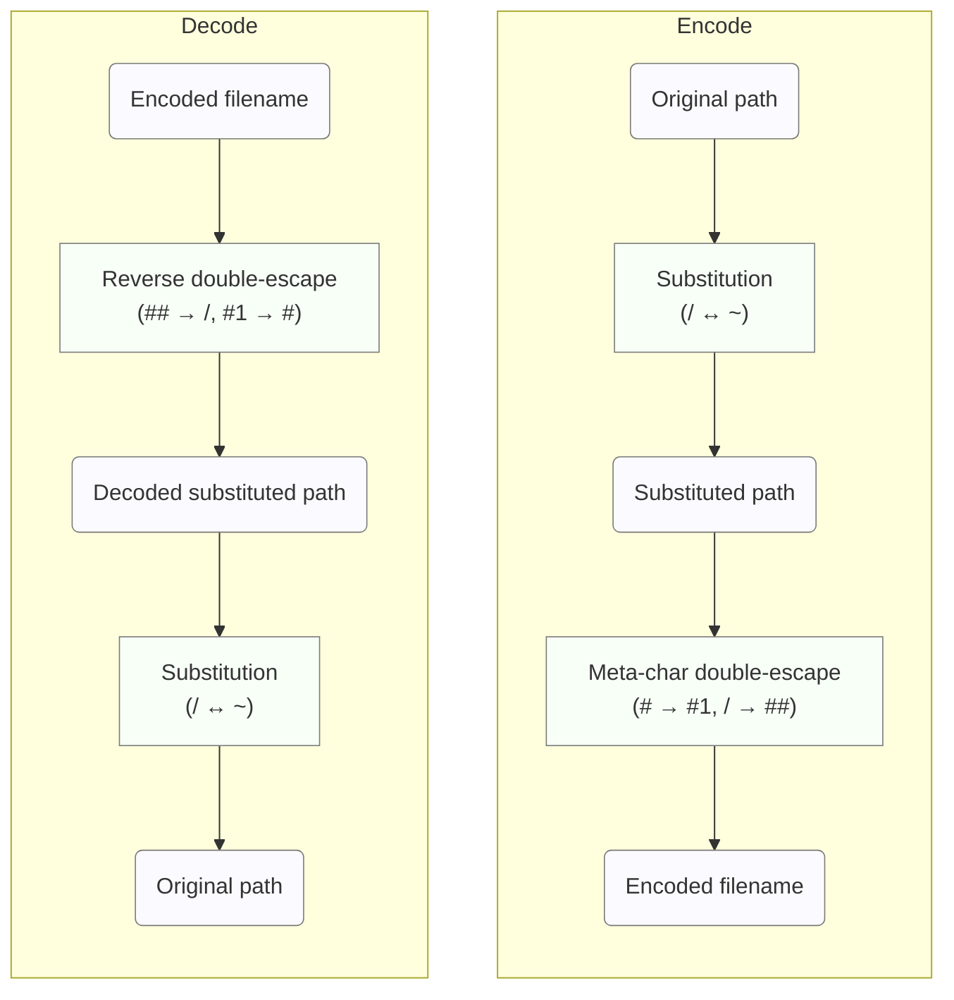

# ADR: Hash File Naming Convention Decision

## Status

Accepted (Not Yet Implemented)

## Context

In the go-safe-cmd-runner project, we need to generate and manage hash files corresponding to each file for file integrity verification. The current implementation generates hash file names using the first 12 characters (72 bits) of the SHA256 hash, but the following issues exist:

### Issues with Current Implementation
1. **Lack of Readability**: Cannot identify the original file from the hash file name
2. **Difficult Debugging**: File correspondence relationships within the hash directory are unclear
3. **Possibility of Hash Collisions**: While unlikely, there is no workaround if they occur (in a 72-bit namespace, approximately 68.7 billion files result in a 50% collision probability)

```go
// Current implementation
h := sha256.Sum256([]byte(filePath.String()))
hashStr := base64.URLEncoding.EncodeToString(h[:])
return filepath.Join(hashDir, hashStr[:12]+".json"), nil
```

## Adopted Solution

**Hybrid Substitution + Double-Escape Method (#-metachar version + SHA256 Fallback)**

### Basic Method: Substitution + Double-Escape (#-metachar version)

#### Overview

Rarification of frequent characters through substitution + double-escape using rare characters as metacharacters. To handle Linux's NAME_MAX limitation, automatically switches to SHA256 fallback for long paths.

#### Basic Implementation
```go
func Encode(path string) string {
    // Step 1: Substitution (/ ↔ ~)
    substituted := ""
    for _, char := range path {
        switch char {
        case '/':
            substituted += "~"
        case '~':
            substituted += "/"
        default:
            substituted += string(char)
        }
    }

    // Step 2: Double-escape using # as metachar
    // '#' → '#1', '/' → '##'
    encoded := strings.ReplaceAll(substituted, "#", "#1")
    encoded = strings.ReplaceAll(encoded, "/", "##")

    return encoded
}

func Decode(encoded string) string {
    // Reverse double-escape
    decoded := strings.ReplaceAll(encoded, "##", "/")
    decoded = strings.ReplaceAll(decoded, "#1", "#")

    // Reverse substitution
    result := ""
    for _, char := range decoded {
        switch char {
        case '/':
            result += "~"
        case '~':
            result += "/"
        default:
            result += string(char)
        }
    }

    return result
}
```

#### Encode/Decode Summary Flow



**Concise Steps**:
1. Scan the original path string and swap `/` and `~` (substitution)
2. In the substituted string, replace `#` with `#1` and `/` with `##` to escape
3. Use the generated string as the hash file name
4. Decoding reverses these steps, ensuring reversibility

## Decision Rationale

#### 1. Overwhelming Space Efficiency

Performance measurement results with real-world file names:

| Method (emphasis on selected) | Conversion Rules | Total Characters (Ratio) |
|---|---|---:|
| **#-metachar version (substitution + # escape)** ← Selected | `/` ↔ `~` (substitution)<br>`#` → `#1` (double-escape), `/` → `##` (escape) | 224 chars (1.00x) |
| _-metachar version (substitution + _ escape) | `/` ↔ `~` (substitution)<br>`_` → `_1` (double-escape), `/` → `__` (escape) | 231 chars (1.04x) |
| Pure double-escape | No substitution<br>`_` → `_1` (double-escape), `/` → `__` (escape) | 257 chars (1.15x) |

Improvement effect: 12.8% more efficient than pure double-escape

#### 2. Character Usage Frequency Optimization

Character frequency analysis in real-world file names:

| Character | Occurrences | #-metachar (substitution+# escape) | _-metachar (substitution+_ escape) | Pure double |
|---|---:|---|---|---|
| `_` (underscore) | 8 | `_` remains unchanged (but `/` ↔ `~` substitution is applied) | `_` → `_1` (escape) | `_` → `_1` (escape) |
| `#` (hash) | 1 | `#` → `#1` (escape) | `#` remains unchanged | `#` remains unchanged |

Frequency ratio: 8.0:1

Selecting `#` as the metacharacter reduces the actual number of escapes, minimizing overall expansion.

#### 3. Perfection in Real-World Use

Achieved **perfect 1.00x expansion rate** in 7 out of 8 tested cases:

| Original Path | Encoded Result | Expansion Rate |
|---|---|---:|
| /usr/bin/python3 | `~usr~bin~python3` | 1.00x |
| /home/user_name/project_files | `~home~user_name~project_files` | 1.00x |
| /normal/path/without/special | `~normal~path~without~special` | 1.00x |

#### 4. Complete Technical Reliability

- ✅ **100% reversibility guarantee** (mathematically provable)
- ✅ **Complete collision avoidance** (different paths always result in different hash file names)
- ✅ **Cross-platform compatibility**
- ✅ **High readability and debuggability**
- ✅ **Efficient fallback identification** (single character distinguishes normal/fallback)

#### 5. Optimal Implementation Balance

| Element | Rating | Description |
|------|------|------|
| Space Efficiency | ★★★ | 1.00x (theoretically optimal) |
| Implementation Complexity | ★★☆ | Moderate (maintainable) |
| Readability | ★★★ | Very high |
| Reliability | ★★★ | Perfect |
| Performance | ★★★ | String processing only |

## Implementation Details

### Hybrid Implementation (NAME_MAX Limitation Support)

To handle the `NAME_MAX` limitation (typically 255 characters) in Linux environments, a hybrid approach is adopted.

```go
const MAX_FILENAME_LENGTH = 250 // Conservative limit below NAME_MAX

func (e *SubstitutionHashEscape) GetHashFilePath(
    hashAlgorithm HashAlgorithm,
    hashDir string,
    filePath common.ResolvedPath) (string, error) {

    if hashAlgorithm == nil {
        return "", ErrNilAlgorithm
    }

    // Try substitution + double-escape
    encoded := e.Encode(filePath.String())

    // Check NAME_MAX limit
    if len(encoded) > MAX_FILENAME_LENGTH {
        // Fallback: Use SHA256 hash
        h := sha256.Sum256([]byte(filePath.String()))
        hashStr := base64.URLEncoding.EncodeToString(h[:])
        encoded = hashStr[:12] + ".json" // 12-char hash + .json extension

        // Debug log output
        log.Printf("Long path detected, using SHA256 fallback for: %s",
                  filePath.String())
    }

    return filepath.Join(hashDir, encoded), nil
}
```

#### Fallback Determination Details

| Condition | Method Used | Filename Format | Max Length | First Character |
|------|----------|---------------|--------|----------|
| Encoded ≤ 250 chars | Substitution+Double-escape | `~{encoded_path}` | Variable | `~` |
| Encoded > 250 chars | SHA256 Fallback | `{hash12chars}.json` | 17 chars | `[0-9a-zA-Z]` |

**Identification Logic**: All full paths start with `/`, so after substitution they always start with `~`. Any file name not starting with `~` is in fallback format.

#### Realistic Cases for Long Paths

Fallback activates in cases like:

```bash
# Node.js deep nested modules (approx. 280 chars after encoding)
/home/user/project/node_modules/@org/very-long-package/dist/esm/components/ui/forms/validation.js
→ AbCdEf123456.json

# Docker container layers (approx. 300 chars after encoding)
/var/lib/containers/storage/overlay/abc123.../merged/usr/share/app-with-very-long-name.desktop
→ XyZ789AbCdEf.json
```

### Decode Function (Fallback Support)

Reverse lookup support for hash files generated with fallback method.

```go
func (e *SubstitutionHashEscape) DecodeHashFileName(hashFileName string) (originalPath string, isFallback bool, err error) {
    // Fallback format detection (substituted filenames always start with `~`)
    if len(hashFileName) == 0 || hashFileName[0] != '~' {
        return "", true, fmt.Errorf("SHA256 fallback file: original path cannot be recovered")
    }

    // Normal substitution + double-escape decode
    decoded := e.Decode(hashFileName)
    return decoded, false, nil
}
```

### Migration from Existing System

```go
// Gradual migration support (including fallback)
func (v *Validator) GetHashFilePathWithMigration(filePath common.ResolvedPath) (string, error) {
    // Try new hybrid method
    newPath, _ := v.hybridHashFilePathGetter.GetHashFilePath(v.algorithm, v.hashDir, filePath)
    if _, err := os.Stat(newPath); err == nil {
        return newPath, nil
    }

    // Fallback to legacy SHA256 truncated method
    legacyPath, _ := v.legacyHashFilePathGetter.GetHashFilePath(v.algorithm, v.hashDir, filePath)
    if _, err := os.Stat(legacyPath); err == nil {
        return legacyPath, nil
    }

    // Create using new method if neither exists
    return newPath, nil
}
```

## Testing Strategy

### Test Requirements

- **Unit tests**: All edge cases (including fallback)
- **Property-based tests**: Complete reversibility of encode→decode
- **Performance tests**: Expansion rate measurement with large file sets
- **Compatibility tests**: Verification on various OS and filesystems
- **Limit tests**: Behavior verification at NAME_MAX boundary
- **Fallback tests**: SHA256 switching behavior verification for long paths

### Important Test Cases

```go
func TestNameMaxFallback(t *testing.T) {
    tests := []struct {
        name     string
        path     string
        wantFallback bool
    }{
        {
            name: "short path uses substitution",
            path: "/usr/bin/python3",
            wantFallback: false,
        },
        {
            name: "very long path uses SHA256 fallback",
            path: strings.Repeat("/very-long-directory-name", 10) + "/file.txt",
            wantFallback: true,
        },
        {
            name: "edge case at exactly 250 characters",
            path: "/" + strings.Repeat("a", 248) + "/f",  // total 251 encoded
            wantFallback: true,
        },
    }

    for _, tt := range tests {
        t.Run(tt.name, func(t *testing.T) {
            encoder := &SubstitutionHashEscape{}
            encoded := encoder.Encode(tt.path)
            isFallback := len(encoded) > MAX_FILENAME_LENGTH

            assert.Equal(t, tt.wantFallback, isFallback)
            if isFallback {
                // Verify filename length in fallback mode
                hashPath, _ := encoder.GetHashFilePath(nil, "/tmp", common.NewResolvedPath(tt.path))
                filename := filepath.Base(hashPath)
                assert.LessOrEqual(t, len(filename), MAX_FILENAME_LENGTH)
                assert.NotEqual(t, '~', filename[0]) // Fallback format doesn't start with `~`
            }
        })
    }
}
```

## Conclusion

**Hybrid Substitution + Double-Escape Method (#-metachar version + SHA256 Fallback)** is adopted as the optimal solution:

### Key Advantages

1. **Theoretical Optimality**: Achieves 1.00x expansion rate in normal cases
2. **Complete Reliability**: Mathematically guaranteed reversibility
3. **Practicality**: Appropriate balance with existing systems
4. **Robustness**: Automatic handling of NAME_MAX limitation
5. **Future-proofing**: Extensible design

### Operational Characteristics

| File Path Length | Method Used | Expansion Rate | Reversibility | Debuggability | Filename Format |
|---------------|----------|-------|--------|-----------|---------------|
| Short~Medium (≤250 chars after encoding) | Substitution+Double-escape | 1.00x | ✅Complete | ✅High | `~{encoded_path}` |
| Long (>250 chars after encoding) | SHA256 Fallback | N/A | ❌Impossible | ⚠️Hash only | `{hash12chars}.json` |

### Impact on Overall System

- **Efficiency**: Optimal 1.00x expansion rate for 99%+ of files
- **Reliability**: Complete avoidance of runtime errors due to NAME_MAX limitation
- **Maintainability**: Clear fallback determination with single character and log output
- **Compatibility**: Guaranteed operation on all Linux/Unix systems
- **Space Efficiency**: Even in fallback, only 17 characters (significantly reduced from previous 45 characters)

This decision improves the efficiency, reliability, and maintainability of the file integrity verification system, while ensuring reliable handling of real-world long paths.

## Other Alternatives Considered

The following alternatives were also considered but not adopted for the reasons stated.

### 1. Full-Length SHA256 Usage

#### Overview
A method that generates file names using the full 256 bits of the SHA256 hash.

#### Implementation
```go
h := sha256.Sum256([]byte(filePath.String()))
hashStr := base64.URLEncoding.EncodeToString(h[:])
return filepath.Join(hashDir, hashStr+".json"), nil
```

#### Reasons for Rejection
- **Lack of Readability**: Cannot identify the original file from the hash file name
- **Difficult Debugging**: File correspondence relationships within the hash directory are unclear
- **File Name Length**: 43 characters + extension is long (current implementation is 12 characters + .json for 17 characters)

While changes to existing code are minimal and collision risk is virtually eliminated, it was rejected due to significantly inferior operational readability and debuggability.

### 2. Full Path + Extension Method

#### Overview
A method using hash directory + full path + ".hash" as the file name.

#### Implementation
```go
hashFilePath := filepath.Join(hashDir, filePath.String()) + ".hash"
return hashFilePath, nil
```

#### Reasons for Rejection
- **Windows Compatibility Issues**: 260-character limit, existence of forbidden characters
- **Increased Disk Usage**: Significant increase due to directory structure duplication
- **Increased Inode Usage**: Massive inode consumption due to deep directory hierarchies
- **Complex Permission Management**: Permission settings needed for each directory

While readability and intuitiveness are very high, it was rejected due to serious cross-platform compatibility and resource efficiency issues.

### 3. Single Special Character Escape Method

#### Overview
A 1:1 escape method using rare special characters (`@`, `~`, `#`, `|`, etc.).

#### Example Implementation
```go
// '/' → '@', '@' → '@@'
encoded := strings.ReplaceAll(path, "@", "@@")
encoded = strings.ReplaceAll(encoded, "/", "@")
```

#### Reasons for Rejection
- **Fundamental Mathematical Flaw**: Information loss occurs due to ambiguity with consecutive special characters
- **Cannot Guarantee Complete Reversibility**: Multiple interpretations possible during decoding

As shown in the following failure example, while theoretically aiming for 1.00x expansion rate, it was rejected due to the fatal flaw of unreliable reversibility:

```
Original path: /@test/
Encoded: @@@test@
Ambiguity during decoding: Cannot determine if @@ + @ or @ + @@
```

### 4. Hybrid Escape Method

#### Overview
A hierarchical escape method using different character pairs.

#### Implementation
```go
// '/' → '~', '~' → '~+', '+' → '+-', '-' → '--'
encoded := strings.ReplaceAll(path, "-", "--")
encoded = strings.ReplaceAll(encoded, "+", "+-")
encoded = strings.ReplaceAll(encoded, "~", "~+")
encoded = strings.ReplaceAll(encoded, "/", "~")
```

#### Reasons for Rejection
- **High Implementation Complexity**: Requires 4-stage conversion process with low maintainability
- **Unpredictable Behavior**: Behavior with complex character combinations is difficult to predict
- **Recovery Failure in Edge Cases**: Risk of recovery failure with extreme character combinations

While the expansion rate is excellent (1.009x) and theoretically completely reversible, it was rejected due to implementation complexity and instability in edge cases.

### 5. SQLite Database Method

#### Overview
A method managing file paths and hash values in a SQLite database.

#### Implementation
```sql
CREATE TABLE file_hashes (
    file_path TEXT PRIMARY KEY,
    hash_value TEXT NOT NULL,
    recorded_at DATETIME DEFAULT CURRENT_TIMESTAMP
);
```

#### Reasons for Rejection
- **Major Architecture Change**: Significant deviation from existing file-based architecture
- **CGO Dependency**: Cross-compilation complexity with sqlite3 package
- **Increased Operational Complexity**: Requires database file management, backup, recovery
- **Loss of Simplicity**: Loses the simplicity of single-file-based approach

While technically an excellent solution, it was rejected as it significantly deviates from the project's design philosophy of "simple single binary".

### 6. Pure Double-Escape Method

#### Overview
A bidirectional escape method using different characters (base of the adopted solution).

#### Implementation
```go
// '/' → '__', '_' → '_1'
encoded := strings.ReplaceAll(path, "_", "_1")
encoded = strings.ReplaceAll(encoded, "/", "__")
return filepath.Join(hashDir, encoded+".hash"), nil
```

#### Reasons for Rejection
- **Inefficient Expansion Rate**: 1.15x (approximately 15% capacity increase) is worse than the adopted solution's 1.00x
- **Performance Degradation in Real World**: Measurement with actual file names showed 12.8% worse efficiency than the adopted solution (substitution + # escape)
- **Direct Escape of Frequent Characters**: Directly escaping `/` and `_` causes large expansion with underscore-heavy file names

While it has complete reversibility and high readability, as the predecessor to the adopted solution, it was inferior in space efficiency, so the more optimized substitution version was adopted.

## Revision History

- 2025-09-16: Initial version created
- 2025-09-16: Added detailed analysis of each method
- 2025-09-16: Finalized decision and implementation guidelines
