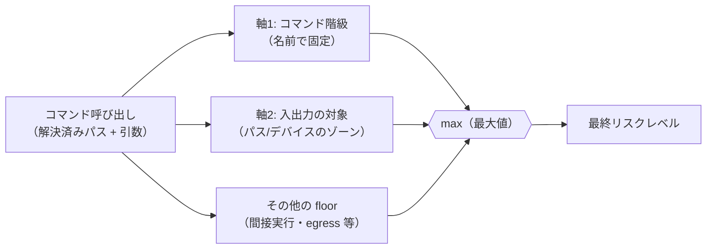
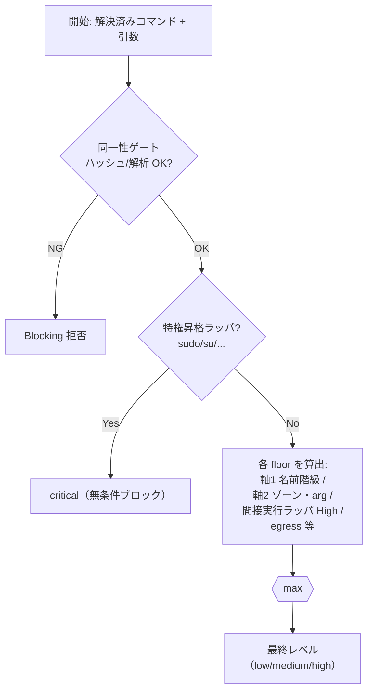

# リスクレベル分類ガイド（概念モデル）

> **位置づけ**: 本書は「コマンドがどのリスクレベルに分類されるか」を**自分で導出できる**ように、
> 分類の統一原則 → 2 軸ルール → 相互作用（max）→ 計算手順の順で解説する概念ガイド（たたき台）。
> 実装レベルの判定アルゴリズム（ランク1〜8・`EvaluateRisk`）は
> [command-risk-evaluation.ja.md](command-risk-evaluation.ja.md)、確定した受け入れ基準は
> [タスク 0140 要件定義書](../../tasks/0140_risk_level_classification_review/01_requirements.md) を参照。
>
> | Item | Value |
> |---|---|
> | Status | `draft`（0140 設計に整合） |
> | 対象読者 | 本システムを初めて理解するアーキテクト / SRE / レビュアー |

## この文書の読み方（漸進的詳細化）

- **概要だけ知りたい** → §1〜§2（統一原則と 4 レベル定義）で十分。
- **分類ルールを理解したい** → §3〜§5（2 軸モデルと各軸の表）。
- **最終レベルを自分で計算したい** → §6〜§7（相互作用と計算手順・例）。
- **設計判断・限界を知りたい** → §8（脅威モデルと前提）。

読み進めるほど詳細になる。上位節だけで全体像が掴める構成。

---

## 1. 30 秒サマリ

> **最終リスク = `max(軸1, 軸2, …)`** —— 適用される全ルールが与える「最小リスク（floor）」の最大値。

- **軸1（コマンド階級）**: コマンド名で決まる固定レベル（例: `useradd` は常に High）。
- **軸2（入出力の対象）**: 引数の対象パス/デバイスのゾーンで決まる（例: `cp` の宛先が `/usr/bin` なら High、作業ディレクトリなら Low）。
- 複数のルールが該当したら、**一番高いレベルが勝つ**（max。順序は関係ない）。

4 レベルの直感:

| レベル | 一言で | 例 |
|---|---|---|
| **critical** | 正当な用途でも無条件ブロック（特権昇格そのもの） | `sudo …`・`su` |
| **high** | 大規模破壊・システム変更・任意コード実行・信頼境界破壊・権限付与 | `mkfs`・`useradd`・`insmod`・`cp → /usr/bin` |
| **medium** | 永続的だが限定的・ネットワーク境界越え | `rm /srv/x`・`curl https://…` |
| **low** | それ以外（safe-zone 内の通常操作含む） | `ls`・`cp a $WORKDIR/b` |

ここまでで概要は十分。以降は基準と計算の詳細。

---

## 2. リスクレベルの定義（統一原則）

リスクレベルは「そのコマンドが正当な許可なしに通った場合の被害の質」で決まる。

```
critical — 任意の内側コマンドを透過実行する特権昇格ラッパ（sudo/su/pkexec/doas/runuser/setpriv/capsh 等）。
           無条件ブロック（per-command でも実行不可）。
high     — ①device/FS/ツリー粒度の不可逆破壊（mkfs・parted・rm -r 等）
           ②永続的な system/boot/service/account/auth 変更（useradd・grub-install・systemctl 等）
           ③高権限での任意コード実行（カーネルモジュール・interpreter・遅延実行・AI 駆動）
           ④信頼境界の破壊（信頼バイナリ/設定の置換。allowlist+ハッシュ固定を無力化）
           ⑤権限/能力の付与（setcap・setuid 付与・chown root 等）
medium   — 永続的だが named-file 粒度の影響（非クリティカルパスの rm/mv/cp）
           / データ egress（curl/scp/ssh 等の境界越え）
           / 定義済み・限定スコープの system 変更（mount 既定・単一 IF 設定）
low      — それ以外（safe-zone 内のロケーション定義コマンド等）
```

**「大規模」の運用定義**: device/FS/ツリー粒度に作用しうる → High、named-file 粒度 → Medium。

**critical と high の境界**: critical は「特権昇格を*透過実行*するラッパ」**だけ**。`visudo` や
`insmod` は危険だが*定義済み操作*なので High（per-command で明示許可可能）に留める。
無条件ブロック（=実行不可）は、正当な特権バッチ用途を壊さないため特権昇格ラッパに限定する。

---

## 3. 計算モデル: 2 軸 × max

最終リスクは独立した複数ルールの floor を **max** で合成する。各ルールは「最低でもこのレベル」を
主張する floor であり、評価順序は結果に影響しない（max は可換）。



- **軸1（名前で固定）**: コマンド名がどの「ファミリ」に属するかで固定レベル（§4）。
- **軸2（対象のゾーン）**: 引数が指すパス/デバイスのゾーンで決まる（§5）。
- どちらか一方しか当てはまらないコマンドも多い（`useradd` は軸1 のみ、`cp` は軸2 が主）。

> **なぜ max か**: 各ルールは「見逃してはいけない危険」を別観点から検出する。1 つでも High を
> 主張したら High。安全側に倒すための合成。

---

## 4. 軸1: コマンド階級（名前で固定）

コマンド名が特定の**ファミリ**に属する場合、引数によらず固定レベルになる。列挙は代表例（非有界）。

### High になるファミリ

| ファミリ（原則） | 代表例 |
|---|---|
| 大規模・不可逆破壊（①） | `mkfs`・`fdisk`・`parted`・`wipefs`・`blkdiscard`・LVM 破壊系（`lvremove` 等） |
| カーネル/モジュール・パラメータ（③/②） | `insmod`・`modprobe`・`kexec`・`sysctl` |
| アカウント・認証 DB（②） | `useradd`・`usermod`・`passwd`・`visudo`・`chpasswd` 等 |
| ブート設定/カーネルイメージ（②③） | `grub-install`・`efibootmgr`・`kernel-install` 等 |
| サービス有効化・電源状態（②） | `chkconfig`・`update-rc.d`・`shutdown`・`reboot` 等 |
| ファイアウォール（②） | `iptables`・`nft`・`ufw`・`firewall-cmd` 等 |
| 能力付与（⑤） | `setcap` |
| 信頼境界の置換 intrinsic（④） | `update-alternatives`・`ldconfig`・`dpkg-divert` 等 |
| ジョブ/遅延・transient 実行（②③） | `crontab`・`at`・`systemd-run` 等 |
| 任意コード実行ランナー（③） | シェル・インタプリタ・ビルドランナー |

### Medium になるファミリ

| ファミリ | 代表例 |
|---|---|
| 限定スコープの system 変更 | LVM 作成/設定系（`lvcreate` 等）・`ip`/`ifconfig`・`mount`/`umount` 既定 |
| データ egress | `curl`・`wget`・`scp`・`sftp`・`rsync`・`ssh`・`nc` |

> 完全な列挙・distro 別名は実装/設計（02）で確定。本ガイドは「どのファミリがどのレベルか」を示す。

---

## 5. 軸2: 入出力の対象（ゾーン）

`cp`/`mv`/`rm`/`ln`/`install`/`tee`/`dd`/`mount` 等の「**ロケーション定義コマンド**」は、
名前ではなく**対象パス/デバイスのゾーン**でレベルが決まる。3 ゾーン:

| ゾーン | 例 | レベル |
|---|---|---|
| **trust-critical** | `/usr/bin`・`/etc`・`/boot`・`/dev`・`/var` 等（その配下も含む） | High |
| **ordinary** | 上記以外の通常パス（`/srv`・`/opt` 等） | Medium |
| **safe-zone** | run 指定の workdir / 出力先 / 専用 temp（信頼され書込保護されたもの） | Low |

ゾーンに加え、軸2 内では以下の floor も働く（条件 → 最小リスク）。詳細は要件 F-004 を参照。

**軸 A: 権限付与・コード実行（対象ゾーンに依らず High）**

| 条件 | floor |
|---|---|
| 特権付与（setuid/setgid・world-write・trust-critical 所有権） | High |
| 内側コマンド実行（`find -exec` 等） | High / 拒否 |

**軸 B: ファイル入出力の対象（ゾーン依存）**

| 条件 | floor |
|---|---|
| 対象/宛先/リンク先が trust-critical | High |
| ブロックデバイス入出力（`dd if=`/`of=`） | High |
| safe-zone の外に及ぶツリー再帰（`rm -r /etc` 等） | High |
| 機微 source の複製（`cp /etc/shadow` 等） | Medium（Low 不可） |
| 宛先不確定（変数展開未確定 等） | Medium（Low 不可） |
| 対象が ordinary | Medium |
| 対象が safe-zone（安全要件充足・再帰も内に閉じる） | Low |

---

## 6. 相互作用と重要ルール

ここからは「自分で計算する」ために知っておくべき相互作用。

### 6.1 max が基本（順序不問）

複数 floor の最大値が最終。`trust-critical > safe-zone` も「High > Low なので max が High を選ぶ」
だけで、特別な優先規則ではない。fail-safe（「Low にしない」）は Medium の floor として max に乗る。

### 6.2 再帰 × safe-zone

ツリー再帰（`rm -r`・`cp -a`）は **safe-zone の外に及ぶときだけ High**。safe-zone 内に閉じた
`rm -rf $WORKDIR/build` は Low（ユーザ自身のデータ自己破壊はスコープ外）。

### 6.3 safe-zone への降格は条件付き

Low へ下げるのは「上げる」より危険なので、safe-zone 判定には安全要件がある:
- **正規化・symlink 解決後の絶対パス**で判定（prefix 一致で破れない）。
- safe-zone は曖昧な `$HOME` ではなく run 指定の信頼ディレクトリに限定（`/tmp` 無条件 safe にしない）。
- **TOCTOU 耐性**: 評価後に外部コマンドが open するまで対象を差し替えられないこと（非書込可な信頼
  ディレクトリ）。満たせなければ fail-closed（Low にしない）。
- 宛先がパース不能/不確定なら Low にしない。

### 6.4 間接実行ラッパは内側を High floor

`env`/`timeout`/`nice`/`chroot`/`unshare`/`ip netns exec` 等、内側コマンドを実行するラッパは、
**外側だけが検証され内側がハッシュ検証されない**ため、内側に **flat High floor** が課される
（`nice ./未検証ツール` が低リスクで通らないように）。さらに `env`/`timeout` は TOML に安全な
代替（`env_vars`/`timeout`）があるため redundant-with-config の観点でも High。

### 6.5 特権昇格ラッパは Critical（最優先・無条件ブロック）

`sudo`/`su`/`pkexec`/`doas`/`runuser`/`setpriv`/`capsh` 等は Critical。内側の実コマンドが
真の危険であり、ゲートが完全にバイパスされるため、レベル計算を待たず無条件ブロック。

### 6.6 egress と AI の限界

egress は Medium 据え置き。`claude`/`gemini` 等の AI は High だが、`curl <AI エンドポイント>` で
事実上バイパス可能なので、AI=High は salient な明示ケースの defense-in-depth に過ぎない（限界として
明記）。なお egress ツールがローカルの trust-critical パスへ書く形（`curl -o /usr/bin/x`）は軸2 で High。

---

## 7. 最終レベルの計算手順

任意のコマンドについて、次の順に評価すると最終レベルを導出できる。



手計算の手順:
1. **特権昇格ラッパか?** → Yes なら **critical**（終了）。
2. **軸1**: コマンド名が High/Medium ファミリ（§4）か? → 該当 floor を記録。
3. **軸2**: ロケーション定義コマンドなら対象ゾーン/arg（§5）の floor を記録。
4. **間接実行ラッパ**なら内側に High floor を記録。**egress** なら Medium を記録。
5. 記録した floor の **max** が最終レベル。どれも該当しなければ **low**。

---

## 8. ワークスルー例

| コマンド | 効く floor | 最終 |
|---|---|---|
| `ls /home/u` | なし | **low** |
| `apt install nginx` | 軸1: PM ファミリ High | **high** |
| `rm -rf $WORKDIR/build` | 軸2: 再帰だが safe-zone 内 → Low | **low** |
| `rm -rf /var/log/old` | 軸2: 再帰が trust-critical（`/var/log`）に及ぶ → High | **high** |
| `cp build/app /usr/local/bin/app` | 軸2: 宛先 trust-critical（`/usr` 配下）→ High | **high** |
| `cp report.csv $WORKDIR/out/` | 軸2: safe-zone → Low | **low** |
| `curl -o $WORKDIR/data.json https://…` | egress Medium + 宛先 safe-zone(Low) → max | **medium** |
| `curl -o /usr/bin/tool https://…` | egress Medium + 宛先 trust-critical High → max | **high** |
| `env FOO=bar ls` | 間接実行 High floor + redundant-with-config | **high** |
| `sudo systemctl restart nginx` | 特権昇格ラッパ | **critical** |

> ポイント: `curl` の 2 例は同じコマンド名でも宛先ゾーンで Medium/High が分かれる（軸2 と max）。

---

## 9. 設計上の前提と限界（脅威モデル）

- **二次ゲートである**: リスクレベルは「許可済みコマンド」に対する追加の上限。第一防御は
  **allowlist + ハッシュ固定**。ブロックリスト（危険コマンド名）は非有界で、列挙漏れは前提。
  リネーム/multi-call/未列挙ツールは素通りし得るが、ハッシュ固定が backstop。
- **safe-zone の信頼前提**: Low 降格は safe-zone ディレクトリが信頼され書込保護されていることが前提
  （§6.3）。満たせなければ降格しない。
- **情報漏えい（read）は限定的**: 機微ファイルの複製には floor を設けるが、完全な情報漏えい
  モデル化はスコープ外。
- **AI 検出は defense-in-depth**: §6.6 のとおり generic egress と区別しきれない。

---

## 10. 参照

- 受け入れ基準（確定）: [0140 要件定義書](../../tasks/0140_risk_level_classification_review/01_requirements.md)
- 課題整理・決定経緯: [0140 ノート](../../tasks/0140_risk_level_classification_review/00_notes.md)
- 実装アルゴリズム（ランク1〜8）: [command-risk-evaluation.ja.md](command-risk-evaluation.ja.md)
- セキュリティ全体像: [security-architecture.ja.md](security-architecture.ja.md)
