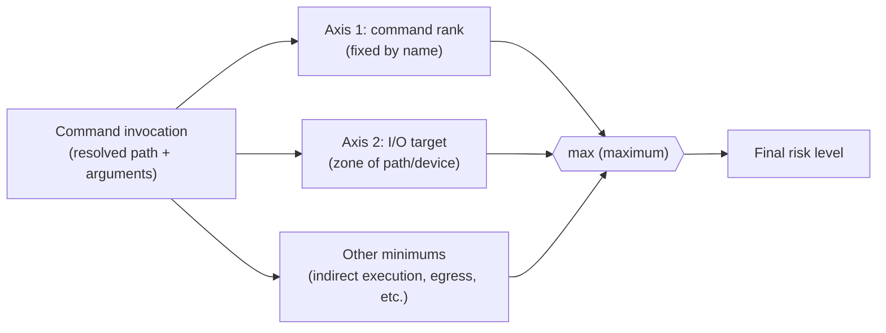
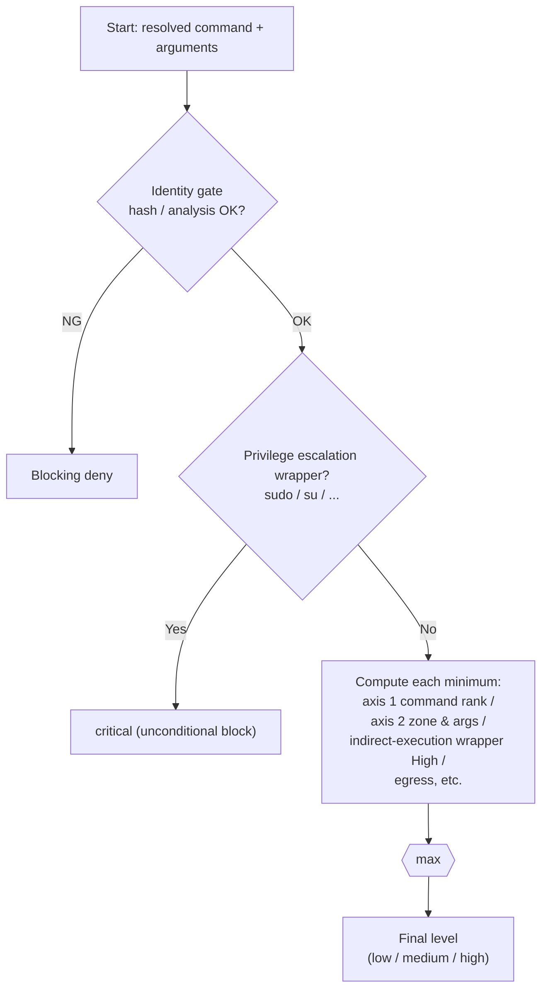

# Risk Level Classification Guide (Conceptual Model)

> **Purpose**: This guide — a conceptual reference — explains the unified classification principles, two-axis rules, interaction (max), and calculation procedure in sequence, so you can **derive for yourself** which risk level any command will be assigned.
> The implementation-level classification algorithm (Ranks 1–8 / `EvaluateRisk`) is described in [command-risk-evaluation.md](command-risk-evaluation.md); the finalized acceptance criteria are in the [Task 0140 requirements document](../../tasks/0140_risk_level_classification_review/01_requirements.md).
>
> | Item | Value |
> |---|---|
> | Status | `approved` (aligned with the finalized behavior of 0141/0142/0144/0145) |
> | Target readers | Architects / SREs / reviewers approaching this system for the first time |
> | Scope of alignment | Axis 1 (command-name classification), axis 2 (destination path trust category), max composition, Critical-only, and safe-zone safety requirements have been aligned to the finalized behavior. See [command-risk-evaluation.md](command-risk-evaluation.md) and [risk_assessment.md](../../user/risk_assessment.md) for detailed classification tables |

## How to Read This Document (Progressive Detail)

- **Want just the overview** → §1–§2 (unified principles and 4-level definitions) are sufficient.
- **Want to understand the classification rules** → §3–§5 (two-axis model and per-axis tables).
- **Want to compute the final level yourself** → §6–§7 (interaction, calculation procedure, and examples).
- **Want to understand design decisions and limitations** → §8 (threat model and assumptions).

Each successive section adds more detail. The top-level sections alone provide a complete picture of the overall structure.

---

## 1. 30-Second Summary

> **Final risk = `max(axis 1, axis 2, …)`** — the maximum of the minimum risk ("floor") asserted by all applicable rules.

- **Axis 1 (command rank)**: A fixed level determined by the command name (e.g., `useradd` is always High).
- **Axis 2 (I/O target)**: Determined by the zone of the target path or device in the arguments (e.g., if `cp`'s destination is `/usr/bin`, High; if it is the working directory, Low).
- When multiple rules apply, **the highest level wins** (max; order does not matter).

Intuition for the 4 levels:

| Level | In a word | Examples |
|---|---|---|
| **critical** | Unconditional block even for legitimate use (privilege escalation itself) | `sudo …`, `su` |
| **high** | Large-scale destruction, system modification, arbitrary code execution, trust-boundary breach, privilege grant | `mkfs`, `useradd`, `insmod`, `cp → /usr/bin` |
| **medium** | Persistent but limited impact / cross-boundary egress | `rm /srv/x`, `curl https://…` |
| **low** | Everything else (including normal operations within the safe-zone) | `ls`, `cp a $WORKDIR/b` |

This much is sufficient for an overview. What follows is the detail of the criteria and computation.

---

## 2. Risk Level Definitions (Unified Principles)

Risk level is determined by "the nature of the harm that would result if the command passed without legitimate authorization."

| Level | Classification criteria | Representative examples |
|---|---|---|
| **critical** | A privilege-escalation wrapper that transparently executes any inner command. **Unconditional block** (cannot be executed even at the per-command level). | `sudo`, `su`, `pkexec`, `doas`, `runuser`, `setpriv`, `capsh` |
| **high** | ① Device/filesystem/tree-level irreversible destruction ② Persistent system/boot/service/account/auth modification ③ Arbitrary code execution under high privilege (kernel modules, interpreters, deferred execution, AI-driven) ④ Trust-boundary breach (replacement of trusted binaries/configuration = renders allowlist + hash pinning ineffective) ⑤ Privilege or capability grant | ①`mkfs`, `parted`, `rm -r` ②`useradd`, `grub-install`, `systemctl` ③`insmod` ④`update-alternatives` ⑤`setcap`, `chown root` |
| **medium** | Persistent but named-file-level impact / egress (cross-boundary) / defined, limited-scope system modification | `rm`/`mv`/`cp` on non-critical paths, `curl`/`scp`/`ssh`, `mount` (default), single-interface configuration |
| **low** | None of the above | `ls`, `cp a $WORKDIR/b` within the safe-zone, etc. |

**Operational definition of "large-scale"**: can affect at device/filesystem/tree granularity → High; named-file granularity → Medium.

**Boundary between critical and high**: critical applies **only** to wrappers that *transparently execute* privilege escalation. `visudo` and `insmod` are dangerous but are *defined operations*, so they remain High (can be explicitly allowed per-command). Unconditional block (= cannot be executed) is limited to privilege-escalation wrappers to avoid breaking legitimate privileged batch use cases.

---

## 3. Calculation Model: Two Axes × max

The final risk is the **max** of the minimum risk values asserted by multiple independent rules. Each rule asserts "at least this level as a minimum," and the evaluation order does not affect the result (max is commutative).

- **Axis 1 (fixed by name)**: The fixed level determined by which "family" the command name belongs to (§4).
- **Axis 2 (zone of the target)**: Determined by the zone of the path or device the arguments point to (§5).
- Many commands are subject to only one of the two (e.g., `useradd` is axis 1 only; `cp` is primarily axis 2).

> **Why max**: each rule detects a different kind of danger that must not be missed. If even one asserts High, the result is High. This is a composition that always favors the safer outcome.

---

## 4. Axis 1: Command Rank (Fixed by Name)

When a command name belongs to a particular **family**, it is assigned a fixed level regardless of arguments. The lists below are representative examples (not exhaustive).

### Families That Become High

| Family (principle) | Representative examples |
|---|---|
| Large-scale, irreversible destruction (①) | `mkfs`, `fdisk`, `parted`, `wipefs`, `blkdiscard`, LVM destruction commands (`lvremove`, etc.) |
| Kernel modules and parameters (③/②) | `insmod`, `modprobe`, `kexec`, `sysctl` |
| Account and authentication DB (②) | `useradd`, `usermod`, `passwd`, `visudo`, `chpasswd`, etc. |
| Boot configuration / kernel image (②③) | `grub-install`, `efibootmgr`, `kernel-install`, etc. |
| Service enablement and power state (②) | `chkconfig`, `update-rc.d`, `shutdown`, `reboot`, etc. |
| Firewall (②) | `iptables`, `nft`, `ufw`, `firewall-cmd`, etc. |
| Capability grant (⑤) | `setcap` |
| Trust-boundary replacement — intrinsic (④) | `update-alternatives`, `ldconfig`, `dpkg-divert`, etc. |
| Job, deferred, and transient execution (②③) | `crontab`, `at`, `systemd-run`, etc. |
| Arbitrary-code-execution runner (③) | Shells, interpreters, build runners |

### Families That Become Medium

| Family | Representative examples |
|---|---|
| Limited-scope system modification | LVM creation/configuration commands (`lvcreate`, etc.), `ip`/`ifconfig`, `mount`/`umount` (default) |
| Egress | `curl`, `wget`, `scp`, `sftp`, `rsync`, `ssh`, `nc` |

> Complete enumeration and distro aliases are finalized in the implementation/design documents (02_architecture). This guide shows which family maps to which level.

---

## 5. Axis 2: I/O Target (Zone)

For **file-operation commands** such as `cp`, `mv`, `rm`, `ln`, `install`, `tee`, `dd`, and `mount`, the risk level is determined not by the command name but by the **zone of the target path or device**. Three zones:

| Zone | Example | Level |
|---|---|---|
| **trust-critical** | `/usr/bin`, `/etc`, `/boot`, `/dev`, `/var`, etc. (including subdirectories) | High |
| **ordinary** | Normal paths that are neither trust-critical nor safe-zone (`/srv`, `/opt`, etc.) | Medium |
| **safe-zone** | The run-designated working directory / output directory / dedicated temp (trusted and write-protected) | Low |

In addition to the zone, the following minimums also apply within axis 2 (condition → minimum risk). See requirement F-004 for details.

**Axis A: Privilege grant and code execution (High regardless of target zone)**

| Condition | Minimum |
|---|---|
| Privilege grant (setuid/setgid or world-write grant by `chmod`/`install`/`setfacl`/`chattr`) | High |
| Inner command execution (`find -exec`, etc.) | High / Reject |

**Axis B: File I/O target (zone-dependent)**

| Condition | Minimum |
|---|---|
| Target / destination / link target is trust-critical | High |
| Block-device I/O (`dd if=`/`of=`) | High |
| Tree recursion extending outside the safe-zone (`rm -r /etc`, etc.) | High |
| Copying a sensitive file (`cp /etc/shadow`, etc.) | Medium (not below Medium) |
| Unresolvable destination — write or delete (variable expansion not yet determined, etc.) | High |
| Unresolvable destination — read (variable expansion not yet determined, etc.) | Medium (not below Medium) |
| Target is ordinary | Medium |
| Target is safe-zone (safety requirements met, recursion stays within) | Low |

---

## 6. Interactions and Key Rules

The following interactions are what you need to know in order to compute the risk level yourself.

### 6.1 max Is the Basis (Order-Independent)

The maximum of all minimum risk values is the final level. "trust-critical > safe-zone" is simply "High > Low, so max selects High" — there is no special precedence rule. A fail-safe ("do not go below Medium") is expressed as a Medium minimum and takes part in the max.

### 6.2 Recursion × Safe-Zone

Tree recursion (`rm -r`, `cp -a`) is High **only when it extends outside the safe-zone**. `rm -rf $WORKDIR/build` confined within the safe-zone is Low (self-deletion of the user's own data is out of scope).

### 6.3 Lowering to Safe-Zone Is Conditional

Lowering to Low is riskier than raising, so safe-zone determination has safety requirements:
- Evaluation is performed on the **absolute path after normalization and symlink resolution** (cannot be broken by prefix matching alone).
- The safe-zone is limited to the run-designated trusted directories — not `$HOME` or any arbitrary path (do not treat `/tmp` as unconditionally safe).
- **TOCTOU resistance**: the target must not be replaceable between evaluation and the time an external command opens it (a trusted directory that is not writable by others). If this cannot be guaranteed, fail-closed (do not assign Low).
- If the destination cannot be parsed or determined, do not assign Low.

### 6.4 Indirect-Execution Wrappers Impose High on the Inner Command

Wrappers that execute an inner command — such as `env`, `timeout`, `nice`, `chroot`, `unshare`, and `ip netns exec` — impose a **flat High minimum** on the inner command, because only the outer command is verified and the inner command is not hash-verified (`nice ./unverified-tool` must not pass at low risk). Additionally, since `env`/`timeout` have safe TOML alternatives (`env_vars`/`timeout`), they are also High on redundant-with-config grounds.

### 6.5 Privilege-Escalation Wrappers Are Critical (Highest Priority, Unconditional Block)

`sudo`, `su`, `pkexec`, `doas`, `runuser`, `setpriv`, `capsh`, etc. are Critical. Because the real danger is the inner command and the gate is completely bypassed, such wrappers are unconditionally blocked before risk-level computation proceeds.

### 6.6 Egress and the Limits of AI Detection

Egress is fixed at Medium. `claude`, `gemini`, and similar AI tools are High, but this can be effectively bypassed via `curl <AI endpoint>`, so AI=High is merely one layer of defense-in-depth for clearly recognizable AI tool invocations (stated here as a known limitation). Note that when an egress tool writes to a local trust-critical path (e.g., `curl -o /usr/bin/x`), axis 2 assigns High.

---

## 7. Calculation Procedure for the Final Level

For any command, evaluating the following steps in order yields the final risk level.

Manual calculation procedure:
1. **Is it a privilege-escalation wrapper?** → If yes, **critical** (stop).
2. **Axis 1**: Does the command name belong to a High/Medium family (§4)? → Record the applicable minimum.
3. **Axis 2**: If it is a file-operation command, record the minimum from the target zone/args (§5).
4. **Indirect-execution wrapper**: record a High minimum for the inner command. **Egress**: record Medium.
5. The **max** of the recorded minimums is the final level. If none apply, **low**.

---

## 8. Worked Examples

| Command | Applicable minimums | Final |
|---|---|---|
| `ls /home/u` | none | **low** |
| `apt install nginx` | Axis 1: package-manager family High | **high** |
| `rm -rf $WORKDIR/build` | Axis 2: recursive but within safe-zone → Low | **low** |
| `rm -rf /var/log/old` | Axis 2: recursion reaches trust-critical (`/var/log`) → High | **high** |
| `cp build/app /usr/local/bin/app` | Axis 2: destination is trust-critical (under `/usr`) → High | **high** |
| `cp report.csv $WORKDIR/out/` | Axis 2: safe-zone → Low | **low** |
| `curl -o $WORKDIR/data.json https://…` | Egress is Medium + destination safe-zone (Low) → max | **medium** |
| `curl -o /usr/bin/tool https://…` | Egress is Medium + destination trust-critical High → max | **high** |
| `env FOO=bar ls` | Indirect-execution High minimum + redundant-with-config | **high** |
| `sudo systemctl restart nginx` | Privilege-escalation wrapper | **critical** |

> Key point: the two `curl` examples use the same command name but differ between Medium/High depending on the destination zone (axis 2 and max).

---

## 9. Design Assumptions and Limitations (Threat Model)

- **This is a secondary gate**: risk level is an additional ceiling applied to "already-allowed commands." The primary defense is **allowlist + hash pinning**. A blocklist of dangerous command names is unbounded and gaps in enumeration are expected. Renamed/multicall/unlisted tools may pass through, but hash pinning is the backstop.
- **Safe-zone trust assumption**: lowering to Low assumes that the safe-zone directory is trusted and write-protected (§6.3). If this cannot be guaranteed, the level is not lowered.
- **Information leakage (read) is limited**: a minimum is set for copying sensitive files, but comprehensive information-leakage modeling is out of scope.
- **AI detection is defense-in-depth**: as stated in §6.6, AI traffic cannot be fully distinguished from general egress.

---

## 10. References

- Acceptance criteria (finalized): [Task 0140 requirements document](../../tasks/0140_risk_level_classification_review/01_requirements.md)
- Issue analysis and decision history: [Task 0140 notes](../../tasks/0140_risk_level_classification_review/00_notes.md)
- Implementation algorithm (Ranks 1–8): [command-risk-evaluation.md](command-risk-evaluation.md)
- Security overall architecture: [security-architecture.md](security-architecture.md)
