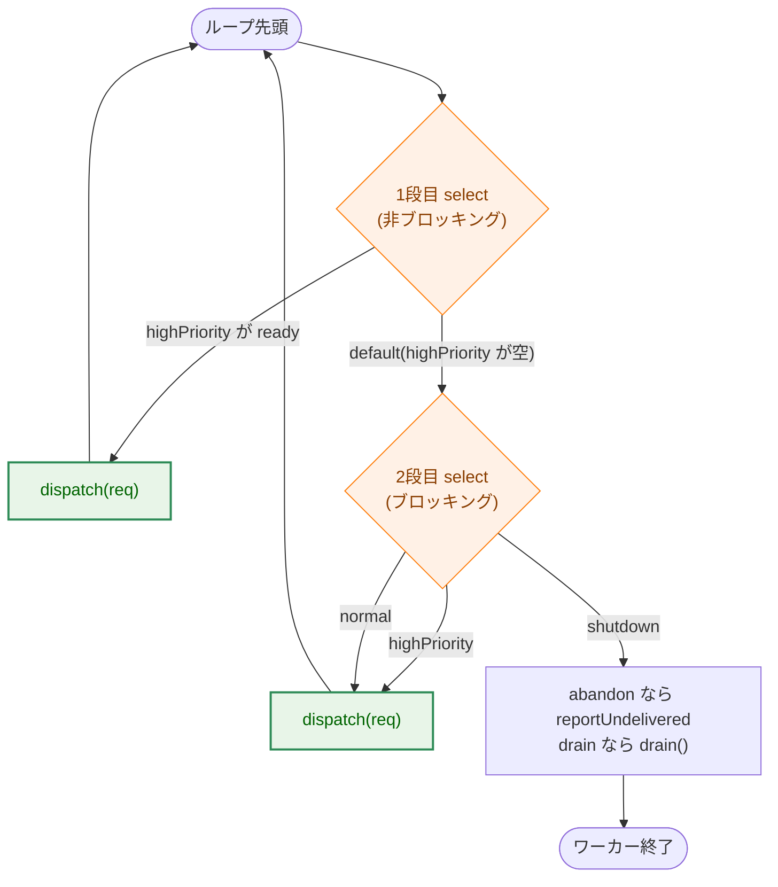
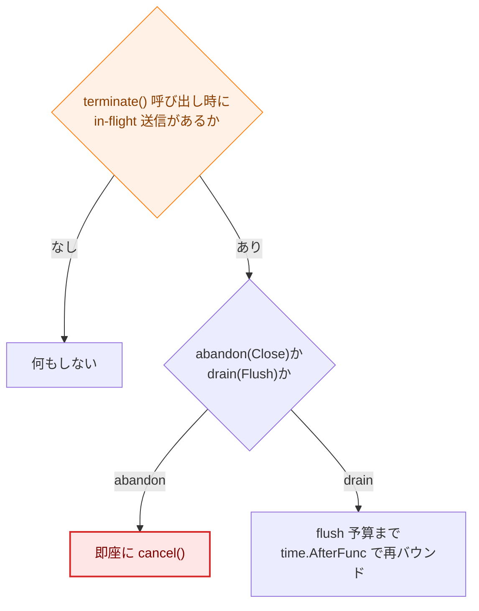

# Slack 通知の非同期送信

## 概要

`internal/logging` の `slackSender`(`slack_sender.go`)は、Slack への通知を高優先度/通常優先度の2本のキューとワーカーゴルーチンで非同期に配送する。コマンド実行のログ経路が Slack への HTTP 送信で遅延しないようにするための仕組みだが、優先度制御・シャットダウン伝播・アカウンティングの3つが絡み合っており、コードコメントだけでは全体像を追いにくい。本ドキュメントはその3点を中心に、非同期送信の挙動と設計判断を整理する。

同期モード(`SlackHandlerOptions.Synchronous`、既定は無効でデバッグ用の抜け道)ではキューもワーカーも持たず、`Handle` がその場で `sendSync` を呼んで送信を完了させる。以下は非同期モードを中心に説明し、同期モードとの違いは各節で補足する。

## 1. キュー優先度制御

ワーカーループ `run()`(`slack_sender.go`)は、2段階の `select` でできている。



- **1段目(非ブロッキング)**: `highPriority` にリクエストがあれば無条件で取り出し、処理してループ先頭に戻る。`normal` や `shutdown` は一切見ない。
- **2段目(ブロッキング)**: 1段目が `default` に落ちた(=その瞬間 `highPriority` が空だった)場合のみ到達する。ここでは `highPriority` / `normal` / `shutdown` の3方向を同時に待つ。

Go の `select` は準備できているケースが複数あれば**ランダムに1つ**を選ぶ仕様のため、もし1段構成で `highPriority` と `normal` を同じ `select` に並べると、`normal` に大量のリクエストがある間 `highPriority`(セキュリティアラート等)が待たされる可能性がある。1段目を分離することで「`highPriority` が空になるまで `normal` には絶対に手を付けない」という優先度を保証している。

2段目でも `highPriority` を含めているのは、1段目の `default` を通過してから2段目に入るまでの間に、別ゴルーチンが `highPriority` へ新規投入する可能性があるため(TOCTOU)。3方向まとめて待つことで、その投入を取りこぼさない。

2段目で `normal` が選ばれても優先度は破られない。1リクエスト処理すればループ先頭に戻り、次の反復では1段目が再び `highPriority` を最優先でチェックするため、`highPriority` が待たされるのは最大でも1回分の遅延に留まる。

## 2. シャットダウンの伝播

`flush()`/`close()`(内部で共通の `terminate()` を呼ぶ)は、ワーカーに指示を送る前に、ロックを取って `sd.closed` と `sd.shutdownState` を直接書き換える。

```go
sd.mu.Lock()
first := !sd.closed
if first {
    sd.closed = true
    sd.shutdownState = req
    sd.boundInFlightLocked(req)
}
sd.mu.Unlock()
```

一方 `serve()` は、リクエストがどちらのキューから取り出されたかに関わらず、送信前に必ずこの `sd.closed`/`sd.shutdownState` をロック越しに**その場で再読み込み**する。

```go
sd.mu.Lock()
state := sd.shutdownState
draining := sd.closed && !state.abandon
```

つまり `sd.shutdown` チャンネルの受信(2段目の `select` でのみ発生する)は、シャットダウンを知る唯一の手段ではない。`highPriority` に大量の残件があり1段目のタイトループが回り続けていても、その中で呼ばれる `dispatch → serve` は毎回この状態をチェックしているため、`terminate()` が `closed = true` をセットした直後の1リクエスト目で気づく。`sd.shutdown` チャンネルは、両キューが空でワーカーが完全にアイドルな時に眠りから起こすためのものであり(`run()` のコメント参照)、ワーカーが忙しい間の主たる通知経路ではない。

`draining == true` と判定された瞬間、`serve()` は `(state.ctx, false)` を返し、`dispatch()` は即座に残りのキューを `drain()` に丸ごと引き渡す。`drain()` は各送信を**1回きり・短いタイムアウト(`perSendTimeout`)**で行い、flush 全体の締切(`ctx.Err()`)に達したら残りを `reportUndelivered(reasonFlushDeadline)` として記録して打ち切る。したがって、`highPriority`/`normal` に大量の残件があっても、フルリトライ(最大約34秒)で1件ずつ律儀に処理され続けることはない。

### in-flight 送信の短縮

`terminate()` が呼ばれた瞬間にちょうど送信中(HTTP 待ち)だったリクエストが**最大1件**だけ存在し得る。これは `boundInFlightLocked` が `sd.inFlightCancel`(送信開始時に `serve()` が登録する)を使って処理する。



- **abandon(`Close()`)**: 配送先が失われた以上、待つ理由がないので即座にキャンセルする。
- **drain(`Flush()`)**: プロセス終了直前に発行されたばかりの通知はミリ秒単位で完了間近であることが多く、まさに flush が届けたい対象なので、打ち切るのではなく flush 予算まで再バウンドする。

この短縮はテスト用の同期点 `afterDequeue`(本番では未設定)で、`serve()` の登録区間とシャットダウンのタイミングを制御して検証している。

### abandon と flush_interrupted の区別

`serve()` の送信後、エラーがコンテキストキャンセルによるものかを判定する `interrupted` に加えて、その時点の `sd.shutdownState.abandon` を再読み込みして `abandoned` を判定する。送信開始前に読んだ `state`(ローカル変数)ではなく、送信後にロックを取り直して読む `sd.shutdownState` を使うのがポイントである。送信中に `Flush()` ではなく `Close()` が割り込んだ場合、送信開始時点ではまだ `abandon` は立っていなかったが、送信終了時点では立っている、という状態遷移をこの再読み込みで捉える。これにより、実際には abandon で打ち切られた通知が `reason=flush_interrupted` と誤って記録されることを防いでいる。

## 3. アカウンティング

`FlushStats` は以下の2つの等式を常に満たすよう設計されている。

```
Submitted == Enqueued + Dropped
Enqueued  == Sent + Failed + Pending
```

- `Submitted`: `slack_notify` 判定を通過し、enqueue の可否判断に到達した全件
- `Enqueued`: キュー(非同期)または受理(同期)された件
- `Dropped`: キュー満杯、またはクローズ済みで受理されなかった件
- `Sent` / `Failed`: 配送が成功/失敗した件
- `Pending`: `Enqueued` のうち `Sent`/`Failed` のどちらでもない残余(flush 締切で打ち切られた件、abandon で見捨てられた件を含む)

これらのカウンタは `mu` 経由でガードされる内訳マップ(`sentByType` 等)とは別に、`slackCounters`(`sync/atomic`)として保持される。

### 同期モードでの整合性

同期モード(`sendSync`)にはワーカーもキューも無いため、`Enqueued`/`Sent`/`Failed` の更新は `Handle` を呼んだ複数ゴルーチンから直接行われる。`terminate()` は非同期モードでは `<-sd.done` でワーカーの終了を待ってから `FlushStats` をキャッシュするが、同期モードにはその待ち合わせ相手がいなかった。

これに対応するため `slackSender` は `syncInFlight sync.WaitGroup` を持つ。`sendSync` は「受理」を確定させる臨界区間の中で `syncInFlight.Add(1)` を行い、送信結果を記録し終えたら `Done()` する。`terminate()` はワーカーが無い場合、`<-sd.done` の代わりに `syncInFlight.Wait()` を呼んでから `FlushStats` をスナップショットする。

```go
if sd.hasWorker() {
    ...
    <-sd.done
} else {
    sd.syncInFlight.Wait()
}
```

`Add` が「受理を確定する臨界区間」の中にあることで、`terminate()` 側の `mu.Lock()`(`closed` をセットする箇所)との順序がミューテックスによって保証される。すなわち `Add` は必ずそれ以降の `terminate()` の `Wait()` より前に完了しており、`sync.WaitGroup` の「`Add` は `Wait` より前に完了していなければならない」という制約を満たす。

これにより、`Close()`/`Flush()` は同期モードでも、進行中の `sendSync` 呼び出しが完了するまで正しく待ち合わせるようになる。ただし、同期送信には非同期モードの `boundInFlightLocked` に相当する短縮機構が無いため、進行中の送信が長時間(最大 `sendTimeout` 分、既定40秒 + リトライ)かかる場合、`Close()`/`Flush()` はその間ブロックされる。

## 設計判断の根拠

- **ロック駆動のシャットダウン伝播**: チャンネル駆動だけに頼ると、忙しいワーカーがシャットダウンに気づくのが「キューが空になるまで」遅れてしまう。`sd.closed`/`sd.shutdownState` を `serve()` が毎回再読み込みする設計にすることで、忙しい時も暇な時も一貫して即座に気づける。
- **1回きり送信での drain**: flush 中の残りキューにフルリトライを適用すると、締切の意味が失われる。`draining` を検出した時点で単一試行・短縮タイムアウトに切り替えることで、締切を実効的に守る。
- **`syncInFlight` による同期モードの待ち合わせ**: 同期モードは元々ワーカーを持たない設計だったため、`Close()`/`Flush()` が完了を待つ相手が存在しなかった。これが「進行中の送信が完了する前に `FlushStats` がキャッシュされ、以後永久に古い値を返す」というバグの原因だった(Pending が実際には配送済み/失敗済みであるにも関わらず、いつまでも残ってしまう)。`WaitGroup` を使った待ち合わせは、非同期モードの `<-sd.done` と対称な最小限の追加である。

## テスト

以下はいずれも [internal/logging/slack_sender_test.go](../../internal/logging/slack_sender_test.go) にある。

- 優先度制御・in-flight 短縮の境界: `TestSlackSender_DequeueRegisterBoundary`
- flush 中の in-flight 送信キャンセル: `TestSlackHandler_FlushCancelsInFlightSend`
- アイドル時の即時 flush: `TestSlackHandler_FlushReturnsWhenWorkerIsIdle`
- アカウンティングの2つの等式: `TestSlackSender_CounterInvariants`
- 同期モードでのクローズ後ドロップ: `TestSlackHandler_SynchronousMode`
- `Handle` とクローズの競合: `TestSlackHandler_ConcurrentHandleAndFlush`

## 参照

- 実装: [internal/logging/slack_sender.go](../../internal/logging/slack_sender.go)、[internal/logging/slack_handler.go](../../internal/logging/slack_handler.go)
- Task 0163: [実装計画](../tasks/0163_redaction_coverage_and_slack_async/03_implementation_plan.md)
