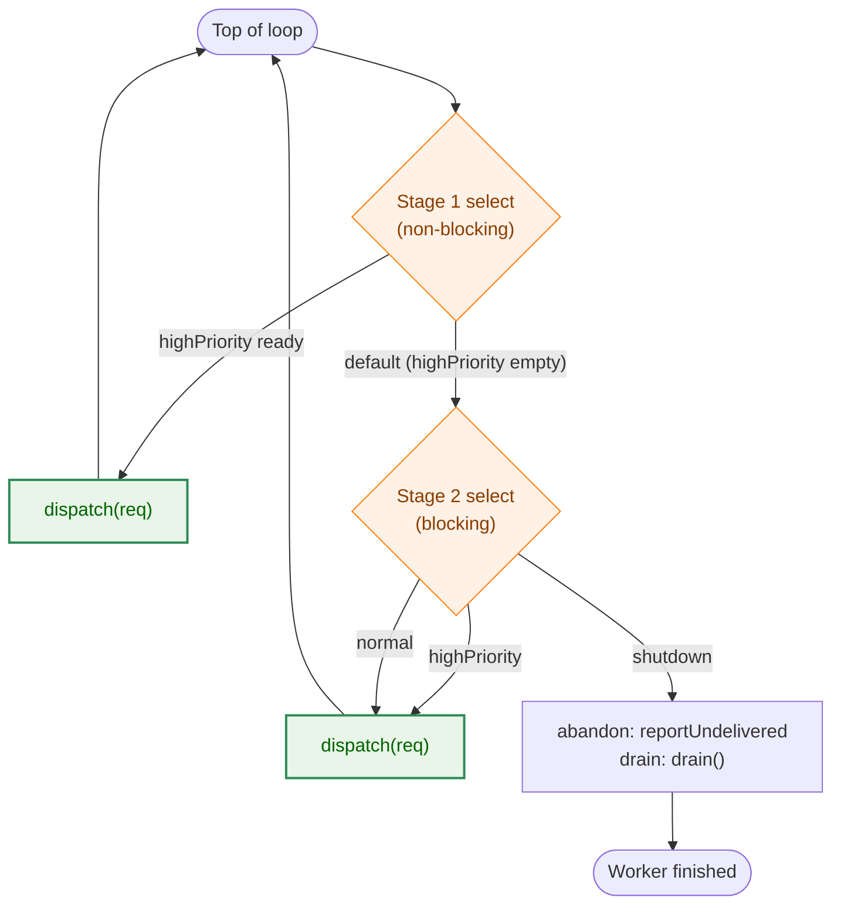
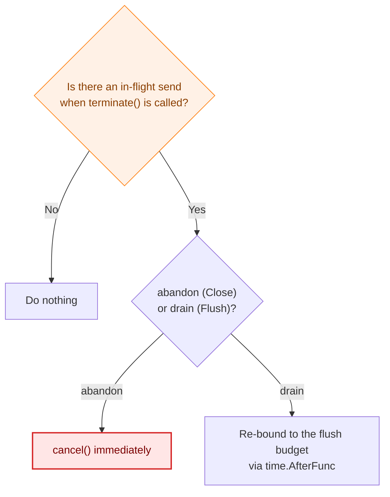

# Asynchronous Delivery of Slack Notifications

## Overview

`slackSender` in `internal/logging` (`slack_sender.go`) delivers Slack notifications asynchronously through two queues — high-priority and normal-priority — and a worker goroutine. This exists so that the logging path for command execution is not delayed by the HTTP send to Slack, but three concerns are intertwined: priority control, shutdown propagation, and accounting. The whole picture is hard to follow from code comments alone. This document focuses on those three concerns to lay out the behavior and design decisions behind asynchronous delivery.

Synchronous mode (`SlackHandlerOptions.Synchronous`, disabled by default; a debugging escape hatch) has no queue and no worker: `Handle` calls `sendSync` inline and completes the send on the spot. The explanation below centers on asynchronous mode, and each section notes where synchronous mode differs.

## 1. Queue Priority Control

The worker loop `run()` (`slack_sender.go`) consists of two stages of `select`.



- **Stage 1 (non-blocking)**: if `highPriority` has a request, take it unconditionally, process it, and go back to the top of the loop. `normal` and `shutdown` are never looked at.
- **Stage 2 (blocking)**: reached only when stage 1 fell through to `default` (meaning `highPriority` was empty at that instant). Here it waits on all three directions at once: `highPriority` / `normal` / `shutdown`.

Because Go's `select` picks **one ready case at random** when multiple are ready, putting `highPriority` and `normal` in the same single-stage `select` would risk `highPriority` (security alerts, etc.) being kept waiting while `normal` has a large backlog. Splitting stage 1 out guarantees the priority rule "never touch `normal` while `highPriority` is non-empty."

Stage 2 also includes `highPriority` because, between stage 1 falling through to `default` and stage 2 being entered, another goroutine could enqueue a new item into `highPriority` (a TOCTOU window). Waiting on all three together makes sure that arrival is not missed.

Even if `normal` is chosen in stage 2, priority is not violated: after one request is processed, the loop returns to the top, and the next iteration's stage 1 checks `highPriority` first again. So `highPriority` can be delayed by at most one iteration's worth of time.

## 2. Shutdown Propagation

`flush()`/`close()` (both call the shared `terminate()` internally) rewrite `sd.closed` and `sd.shutdownState` directly under the lock before signaling the worker.

```go
sd.mu.Lock()
first := !sd.closed
if first {
    sd.closed = true
    sd.shutdownState = req
    sd.boundInFlightLocked(req)
}
sd.mu.Unlock()
```

`serve()`, on the other hand, always **rereads** `sd.closed`/`sd.shutdownState` under the lock right before sending, regardless of which queue the request was taken from.

```go
sd.mu.Lock()
state := sd.shutdownState
draining := sd.closed && !state.abandon
```

In other words, receiving on the `sd.shutdown` channel (which only happens in stage 2's `select`) is not the only way to learn about a shutdown. Even while `highPriority` has a large backlog and stage 1's tight loop keeps spinning, the `dispatch → serve` call inside it checks this state every time, so it notices the shutdown on the very first request processed after `terminate()` sets `closed = true`. The `sd.shutdown` channel exists to wake the worker from sleep when both queues are empty and it is fully idle (see the comment on `run()`); it is not the primary notification path while the worker is busy.

The instant `draining == true` is observed, `serve()` returns `(state.ctx, false)`, and `dispatch()` immediately hands the rest of the queues over to `drain()`. `drain()` sends each request with a **single attempt and a short timeout** (`perSendTimeout`), and once the overall flush deadline (`ctx.Err()`) is reached, it records the remainder as `reportUndelivered(reasonFlushDeadline)` and stops. So even with a large backlog in `highPriority`/`normal`, the worker never dutifully works through it one item at a time with full retries (up to roughly 34 seconds each).

### Shortening the In-Flight Send

At most **one** request can be mid-send (waiting on HTTP) at the exact moment `terminate()` is called. `boundInFlightLocked` handles this using `sd.inFlightCancel`, which `serve()` registers when a send begins.



- **abandon (`Close()`)**: with the destination already gone, there is no reason to wait, so it cancels immediately.
- **drain (`Flush()`)**: a notification issued just before process exit is usually milliseconds from delivery and is exactly the one flush exists to deliver, so rather than cutting it off, it is re-bounded to the flush budget.

This shortening is verified with a test-only synchronization point, `afterDequeue` (unset in production), which controls the timing between `serve()`'s registration section and the shutdown.

### Distinguishing abandon from flush_interrupted

After the send in `serve()`, in addition to `interrupted`, which judges whether the error came from context cancellation, the code rereads the current `sd.shutdownState.abandon` to determine `abandoned`. The key point is that it uses `sd.shutdownState`, reread under the lock after the send finishes, rather than the local variable `state` read before the send started. If `Close()` — not `Flush()` — interrupts a send in progress, `abandon` was not yet set when the send started but is set by the time it ends; this reread captures that state transition. This prevents a notification actually cut off by an abandon from being incorrectly recorded with `reason=flush_interrupted`.

## 3. Accounting

`FlushStats` is designed to always satisfy the following two equations.

```
Submitted == Enqueued + Dropped
Enqueued  == Sent + Failed + Pending
```

- `Submitted`: every notification that passed the `slack_notify` check and reached the enqueue decision point.
- `Enqueued`: notifications accepted into a queue (asynchronous mode) or accepted (synchronous mode).
- `Dropped`: notifications discarded because the queue was full or the sender was already closed.
- `Sent` / `Failed`: notifications whose delivery succeeded or failed.
- `Pending`: the remainder of `Enqueued` that is neither `Sent` nor `Failed` (including notifications cut off at the flush deadline and those abandoned).

These counters are kept as `slackCounters` (`sync/atomic`), separate from the per-type breakdown maps (`sentByType`, etc.) guarded by `mu`.

### Consistency in Synchronous Mode

Synchronous mode (`sendSync`) has no worker and no queue, so `Enqueued`/`Sent`/`Failed` are updated directly from the multiple goroutines that call `Handle`. In asynchronous mode, `terminate()` waits for the worker to finish via `<-sd.done` before caching `FlushStats`, but synchronous mode had no such counterpart to wait on.

To address this, `slackSender` holds a `syncInFlight sync.WaitGroup`. `sendSync` calls `syncInFlight.Add(1)` inside the critical section that commits to acceptance, and calls `Done()` once it has recorded the send's outcome. When there is no worker, `terminate()` calls `syncInFlight.Wait()` in place of `<-sd.done` before snapshotting `FlushStats`.

```go
if sd.hasWorker() {
    ...
    <-sd.done
} else {
    sd.syncInFlight.Wait()
}
```

Because `Add` sits inside the critical section that commits acceptance, its ordering relative to `terminate()`'s `mu.Lock()` (where `closed` is set) is guaranteed by the mutex. That is, `Add` always completes before any subsequent `terminate()`'s `Wait()`, satisfying `sync.WaitGroup`'s requirement that `Add` complete before `Wait`.

This makes `Close()`/`Flush()` correctly wait, even in synchronous mode, for an in-flight `sendSync` call to finish. However, synchronous sends have no shortening mechanism equivalent to asynchronous mode's `boundInFlightLocked`, so if an in-flight send takes a long time (up to `sendTimeout`, 40 seconds by default, plus retries), `Close()`/`Flush()` is blocked for that entire duration.

## Rationale for the Design

- **Lock-driven shutdown propagation**: relying on the channel alone would delay a busy worker's awareness of shutdown until "the queue is empty." Having `serve()` reread `sd.closed`/`sd.shutdownState` every time makes it notice immediately and consistently, whether busy or idle.
- **Single-attempt sends during drain**: applying full retries to the remaining queue during a flush would defeat the purpose of the deadline. Switching to a single attempt and a shortened timeout the moment `draining` is detected keeps the deadline effective.
- **`syncInFlight` for waiting in synchronous mode**: synchronous mode was originally designed without a worker, so `Close()`/`Flush()` had nothing to wait for completion. This was the cause of a bug where `FlushStats` was cached before an in-flight send completed and then permanently returned a stale value (`Pending` staying nonzero forever even though the notification had actually been delivered or had failed). Waiting via a `WaitGroup` is the minimal addition, symmetric to asynchronous mode's `<-sd.done`.

## Tests

All of the following are in [internal/logging/slack_sender_test.go](../../internal/logging/slack_sender_test.go).

- Priority control and the in-flight-shortening boundary: `TestSlackSender_DequeueRegisterBoundary`
- Cancelling an in-flight send during flush: `TestSlackHandler_FlushCancelsInFlightSend`
- Immediate flush when idle: `TestSlackHandler_FlushReturnsWhenWorkerIsIdle`
- The two accounting equations: `TestSlackSender_CounterInvariants`
- Dropping after close in synchronous mode: `TestSlackHandler_SynchronousMode`
- `Handle` racing with close: `TestSlackHandler_ConcurrentHandleAndFlush`

## References

- Implementation: [internal/logging/slack_sender.go](../../internal/logging/slack_sender.go), [internal/logging/slack_handler.go](../../internal/logging/slack_handler.go)
- Task 0163: [Implementation Plan](../tasks/0163_redaction_coverage_and_slack_async/03_implementation_plan.md)
