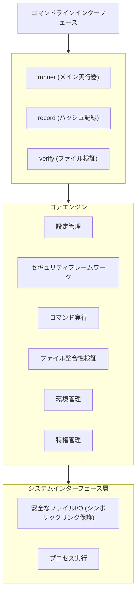

# Go Safe Command Runner - 設計・実装概要

## 概要

Go Safe Command Runnerは、特権タスクの委譲と自動バッチ処理のために設計されたセキュリティ重視のコマンド実行フレームワークです。本システムは、厳格なセキュリティ境界を維持しながら特権操作の安全な実行を可能にする複数のセキュリティ制御層を提供します。

**主要なユースケース:**
- root権限を必要とする定期バックアップ操作
- 非rootユーザーへの特定管理タスクの委譲
- セキュリティ制御を伴う自動システムメンテナンス
- ファイル整合性検証を伴うバッチ処理

## システムアーキテクチャ

### 高レベルアーキテクチャ



### コアコンポーネント

#### 1. 設定管理 (`internal/runner/config/`)
- **目的**: TOMLベースの設定読み込みと検証
- **主要機能**:
  - 必須フィールドチェックを伴うスキーマ検証
  - パスセキュリティ検証（絶対パス、相対コンポーネントなし）
  - デフォルト値の割り当て
  - 重複グループ名検出と環境変数継承分析
  - リスクベースコマンド制御設定
  - ユーザー・グループ実行指定サポート

**実装のハイライト:**
```go
// 検証を伴う安全な設定読み込み
func (l *Loader) LoadConfig(path string) (*runnertypes.Config, error) {
    data, err := safefileio.SafeReadFile(path)  // 安全なファイル読み込み
    if err := toml.Unmarshal(data, &cfg); err != nil {
        return nil, fmt.Errorf("failed to parse config: %w", err)
    }
    // パス検証とデフォルト割り当て
}
```

#### 2. コマンド実行エンジン (`internal/runner/executor/`)
- **目的**: 出力キャプチャとタイムアウト制御を伴う安全なコマンド実行
- **主要機能**:
  - プロセス分離とリソース管理
  - グローバルレベルとコマンドレベルでの設定可能なタイムアウト
  - サイズ制限を伴う構造化出力キャプチャ
  - シグナルハンドリングを伴うバックグラウンドプロセスサポート

#### 3. ファイル整合性システム (`internal/filevalidator/`)
- **目的**: 改ざんされたバイナリの実行を防ぐためのSHA-256ベースファイル検証
- **主要機能**:
  - ハッシュ記録と検証ワークフロー
  - 制御された昇格を伴う特権ファイルアクセス
  - 競合状態を防ぐアトミック操作
  - 特権管理との統合

**セキュリティフロー:**
```
ファイルアクセス要求 → 権限チェック → 特権昇格（必要時）
→ ファイルオープン → 特権復元 → ハッシュ計算 → 検証
```

#### 4. 特権管理 (`internal/runner/privilege/`)
- **目的**: 包括的な監査証跡を伴う制御された特権昇格
- **主要機能**:
  - グローバルミューテックスを使用したスレッドセーフな特権操作
  - パニック保護を伴う自動特権復元
  - ネイティブrootとsetuidバイナリ実行の両方をサポート
  - セキュリティ失敗時の緊急シャットダウンプロトコル

**特権昇格パターン:**
```go
// WithPrivileges: Proper responsibility separation using Template Method pattern
func (m *UnixPrivilegeManager) WithPrivileges(elevationCtx runnertypes.ElevationContext, fn func() error) (err error) {
	m.mu.Lock()
	defer m.mu.Unlock()

	execCtx, err := m.prepareExecution(elevationCtx) // Preparation phase
	if err != nil {
		return err
	}

	if err := m.performElevation(execCtx); err != nil { // Execution phase
		return err
	}

	defer m.handleCleanupAndMetrics(execCtx) // Cleanup phase
	return fn()
}
```

#### 5. 環境セキュリティ (`internal/runner/environment/`)
- **目的**: ゼロトラスト環境変数フィルタリング
- **主要機能**:
  - グローバルレベルとグループレベルでの許可リストベースフィルタリング
  - 危険パターン検出（パスワード、トークンなど）
  - 継承制御（継承/明示的/拒否モード）
  - 変数名と値の検証

#### 6. 安全なファイル操作 (`internal/safefileio/`)
- **目的**: 現代的なLinuxセキュリティプリミティブを使用したシンボリックリンクセーフなファイル操作
- **主要機能**:
  - シンボリックリンク攻撃防止のためのopenat2とRESOLVE_NO_SYMLINKS
  - ステップバイステップパス検証
  - アトミックファイル操作
  - フォールバックメカニズムを伴うクロスプラットフォーム互換性

#### 7. セキュリティフレームワーク (`internal/runner/security/`)
- **目的**: 一元化されたセキュリティ検証とポリシー執行
- **主要機能**:
  - コマンドパス許可リスト検証
  - 危険コマンド検出
  - ファイル権限検証
  - パストラバーサル攻撃防止
  - リスクベースコマンド分析とブロック
  - ログ内機密データの編集

#### 8. リソース管理 (`internal/runner/resource/`)
- **目的**: 通常実行とdry-runモードの両方における副作用の統一管理
- **主要機能**:
  - コマンド実行の抽象化
  - 一時ディレクトリのライフサイクル管理
  - 特権昇格の協調
  - 現実的な分析を伴うdry-runシミュレーション
  - ネットワーク操作（Slack通知）

#### 9. 検証管理 (`internal/verification/`)
- **目的**: ファイル検証とパス解決の一元管理
- **主要機能**:
  - 設定ファイルの検証
  - セキュリティ検証付きコマンドパス解決
  - 特権ファイルアクセスフォールバック
  - 標準システムパスの検証スキップ

#### 10. リスク評価 (`internal/runner/risk/`)
- **目的**: コマンド実行のリスクベースセキュリティ評価
- **主要機能**:
  - コマンドリスクレベル分析（low、medium、high、critical）
  - リスクレベルベースのセキュリティポリシー執行
  - コマンドオーバーライド検出とブロック

#### 11. ログと監査 (`internal/logging/`, `internal/runner/audit/`)
- **目的**: 機密データ保護を伴う安全なログ記録
- **主要機能**:
  - マルチハンドラログ（ファイル、syslog、Slack通知）
  - 条件付きテキストハンドラと対話的ログハンドラ
  - 実行前エラー処理
  - 構造化監査証跡
  - 機密データの自動編集機能

#### 12. データ編集 (`internal/redaction/`)
- **目的**: ログと出力からの機密情報の自動フィルタリング
- **主要機能**:
  - パスワード、トークン、APIキーのパターンベース検出
  - 環境変数のサニタイズ
  - 設定可能な編集ポリシー

#### 13. 端末機能検出 (`internal/terminal/`)
- **目的**: 端末の色彩サポートと対話的実行環境の検出
- **主要機能**:
  - 対話的端末環境の検出（TTY/CI環境判定）
  - 端末色彩サポートの検出と管理
  - ユーザー色彩設定の優先順位制御
  - クロスプラットフォーム端末能力判定

#### 14. グループメンバーシップ管理 (`internal/groupmembership/`)
- **目的**: ユーザーグループメンバーシップの安全な管理
- **主要機能**:
  - CGOと非CGO実装の両方をサポート
  - グループ情報の解析と検証
  - ユーザー・グループの関連付け管理

#### 15. カラー管理 (`internal/color/`)
- **目的**: コンソール出力のカラー制御
- **主要機能**:
  - 端末カラーサポートの検出
  - 設定可能なカラー出力制御

#### 16. ハッシュディレクトリ管理 (`internal/runner/hashdir/`)
- **目的**: ハッシュディレクトリのセキュリティ管理と検証
- **主要機能**:
  - ハッシュディレクトリの検証とセキュリティチェック
  - デフォルトハッシュディレクトリの強制使用
  - カスタムハッシュディレクトリ攻撃の防止
  - パス権限とアクセス制御の検証

#### 17. システム初期化 (`internal/runner/bootstrap/`)
- **目的**: システム起動時の初期化処理とブートストラップ
- **主要機能**:
  - ロガー初期化とコンフィギュレーション
  - 環境変数の初期設定
  - 設定ファイルとハッシュディレクトリの事前検証
  - システム起動時のセキュリティチェック

#### 18. エラー管理 (`internal/runner/errors/`)
- **目的**: 一元化されたエラー定義と処理
- **主要機能**:
  - カスタムエラータイプの定義
  - エラーコンテキストとメタデータ管理
  - セキュリティ対応エラーハンドリング
  - 構造化エラーレポーティング

#### 19. CLI管理 (`internal/runner/cli/`)
- **目的**: コマンドラインインターフェースの管理
- **主要機能**:
  - コマンドライン引数の解析と検証
  - フラグとオプションの管理
  - ヘルプとUsage情報の提供
  - インタラクティブモードサポート

#### 20. テストユーティリティ (`internal/runner/executor/testing/`, `internal/runner/privilege/testing/`)
- **目的**: 各コンポーネントのテスト専用ユーティリティ
- **主要機能**:
  - モック実装とテストヘルパー
  - テスト環境でのセキュリティ機能シミュレーション
  - テストデータ生成とクリーンアップ
  - 分離されたテスト環境の提供

#### 21. 共通ユーティリティ (`internal/common/`, `internal/cmdcommon/`)
- **目的**: パッケージ間で共有される基本機能の提供
- **主要機能**:
  - ファイルシステム抽象化インターフェース
  - モック実装によるテストサポート
  - コマンド共通ユーティリティ

## データフローアーキテクチャ

### コマンド実行フロー

```
設定読み込み → セキュリティ検証 → グループ処理 → コマンド実行

1. 設定読み込み:
   ├── TOML解析と検証
   ├── パスセキュリティチェック（ハッシュディレクトリの絶対パス検証）
   ├── デフォルト値割り当て
   └── 重複グループ名検出と環境変数継承分析

2. セキュリティ検証:
   ├── 設定ファイル整合性検証
   ├── 環境変数フィルタリング
   ├── コマンドパス検証とリスク評価
   ├── 権限チェック
   └── ユーザー・グループ実行検証

3. グループ処理:
   ├── 依存関係解決
   ├── 優先順位決定
   ├── リソース割り当て（一時ディレクトリ）
   ├── 環境準備
   └── リスクベースコマンドフィルタリング

4. コマンド実行:
   ├── リスクレベル評価と執行
   ├── 特権昇格（必要時）
   ├── ユーザー・グループ切り替え（指定時）
   ├── 分離を伴うプロセス生成
   ├── 編集を伴う出力キャプチャと監視
   ├── 特権復元
   ├── リソースクリーンアップ
   └── 監査ログと通知
```

### ファイル検証フロー

```
ファイルパス入力 → セキュリティチェック → ハッシュ計算 → 検証 → 結果

1. セキュリティチェック:
   ├── パス検証（シンボリックリンクなし、絶対パス）
   ├── 権限分析
   └── 特権要件判定

2. ファイルアクセスとハッシュ計算:
   ├── 特権昇格（ファイルがrootアクセスを要求する場合）
   ├── 安全なファイルオープン
   ├── 特権復元（ファイルオープン直後）
   ├── ストリーミングSHA-256計算（通常権限で実行）
   └── ハッシュ比較準備

3. 検証:
   ├── 保存されている値とのハッシュ比較
   ├── 詳細なコンテキストを伴うエラー報告
   └── 監査ログ記録
```

## セキュリティ設計原則

### 1. 多層防御
単一障害点がシステム全体を危険にさらさないよう複数のセキュリティ層を実装:
- **入力検証**: エントリポイントでのすべての入力検証（絶対パス要求を含む）
- **パスセキュリティ**: 包括的なパス検証とシンボリックリンク保護
- **ファイル整合性**: すべての重要ファイル（設定、実行ファイル）のハッシュベース検証
- **特権制御**: 制御された昇格による最小特権原則
- **環境分離**: 厳格な許可リストベース環境フィルタリング
- **コマンド検証**: リスク評価を伴う許可リストベースコマンド実行制御
- **データ保護**: ログと出力における機密情報の自動編集

### 2. ゼロトラストモデル
システム環境への暗黙的な信頼なし:
- 使用前のすべてのファイル検証
- 許可リストによる環境変数フィルタリング
- 既知の良好なパターンに対するコマンド検証
- 必要時のみの特権付与と即座の取り消し

### 3. フェイルセーフ設計
安全に失敗するようシステムを設計:
- すべての操作に対するデフォルト拒否
- セキュリティ失敗時の緊急シャットダウン
- 包括的なエラーハンドリングとログ記録
- セキュリティ機能が利用できない場合の優雅な劣化

### 4. 監査と監視
セキュリティ関連操作への完全な可視性:
- セキュリティコンテキストを伴う構造化ログ
- 特権操作メトリクスと追跡
- セキュリティイベント記録
- 重要エラーのマルチチャンネル報告

## 実装パターン

### 1. インターフェース駆動設計
テスト性とモジュール性のためのインターフェースの多用:
```go
type PrivilegeManager interface {
    WithPrivileges(context ElevationContext, fn func() error) error
    IsSupported() bool
}

type FileValidator interface {
    Verify(filepath string) error
    Record(filepath string) (string, error)
}
```

### 2. 継承よりコンポジション
機能拡張のためのコンポーネントコンポジション:
```go
type ValidatorWithPrivileges struct {
    *Validator                    // 基本機能
    privMgr      PrivilegeManager // 拡張機能
    logger       *slog.Logger     // 可観測性
}
```

### 3. コンテキスト対応操作
セキュリティと可観測性のためのコンテキストを持つ操作:
```go
type ElevationContext struct {
    Operation  string
    FilePath   string
    Reason     string
}
```

### 4. 設定のためのビルダーパターン
合理的なデフォルトを持つ柔軟な設定:
```go
func NewRunnerWithOptions(config *Config, opts ...Option) (*Runner, error) {
    options := &runnerOptions{}
    for _, opt := range opts {
        opt(options)
    }
    // オプション適用とランナー作成
}
```

### 5. リソース管理パターン
実行モード間での副作用の統一処理:
```go
type ResourceManager interface {
    ExecuteCommand(ctx context.Context, cmd Command, group *CommandGroup, env map[string]string) (*ExecutionResult, error)
    CreateTempDir(groupName string) (string, error)
    WithPrivileges(context ElevationContext, fn func() error) error
    SendNotification(message string, details map[string]any) error
}
```

## テスト戦略

### 1. 単体テスト
- すべてのコアコンポーネントの包括的テストカバレッジ
- 外部依存関係のモック実装
- カスタムエラータイプによるエラー条件テスト
- 並行操作の競合状態テスト

### 2. 統合テスト
- エンドツーエンドワークフローテスト
- ファイルシステム相互作用テスト
- 特権操作テスト
- 設定読み込みと検証テスト

### 3. セキュリティテスト
- シンボリックリンク攻撃防止テスト
- パストラバーサル攻撃テスト
- 特権昇格境界テスト
- 環境変数インジェクションテスト

### 4. パフォーマンステスト
- ハッシュ計算パフォーマンスベンチマーク
- メモリ使用量最適化
- 並行操作パフォーマンス
- 大ファイル処理効率
- リスク評価パフォーマンステスト
- dry-runシミュレーション精度検証

## デプロイメント考慮事項

### 1. バイナリ配布
- 特権昇格のためのsetuidビット設定
- root所有権要件
- デプロイメント前のバイナリ整合性検証
- 安全なインストール手順

### 2. 設定管理
- 安全なハッシュディレクトリ権限（755以上の制限）
- 書き込み保護された設定ファイル
- 重要ファイルの定期整合性検証
- 設定テンプレート管理
- 絶対パス要求による設定の簡素化（環境変数フォールバック廃止）

### 3. 監視とアラート
- セキュリティイベントの構造化ログ
- 一元化ログのためのsyslog統合
- 緊急シャットダウンイベント監視
- パフォーマンスメトリクス収集
- 重要アラートのSlack統合
- 全ログでの機密データ編集

### 4. セキュリティ操作
- 設定の定期セキュリティ監査
- 特権操作監視
- ファイル整合性検証スケジュール
- インシデント対応手順
- リスクベースコマンド監視とアラート
- ユーザー・グループ実行監査証跡

## パフォーマンス特性

### 1. ハッシュ計算
- 効率的なストリーミングハッシュ計算
- リソース枯渇を防ぐファイルサイズ制限
- 複数ファイルの並列処理
- メモリ効率的な実装

### 2. 環境処理
- マップ構造を使用したO(1)許可リスト検索
- パターンマッチングのためのコンパイル済み正規表現
- 最小限の文字列操作
- バッチ処理最適化

### 3. 特権操作
- グローバルミューテックスによる特権操作の直列化
- システムコールを使用した高速特権昇格/復元
- パフォーマンス監視のためのメトリクス収集
- リソース使用量追跡

### 4. リスク評価
- 事前コンパイルパターンを使用したO(1)リスクレベル検索
- 正規表現マッチングを使用した効率的コマンド分析
- リスク評価の最小オーバーヘッド
- 繰り返しコマンド分析の結果キャッシュ

### 5. データ編集
- 機密データ検出のための事前コンパイル正規表現パターン
- 大出力のストリーミング編集
- 通常操作への最小パフォーマンス影響
- 設定可能な編集ポリシー

## パッケージ構造

プロジェクトの現在のパッケージ構造は以下の通りです：

```
go-safe-cmd-runner/
├── cmd/                           # エントリポイント
│   ├── record/                    # ハッシュ記録コマンド
│   ├── runner/                    # メイン実行コマンド
│   └── verify/                    # ファイル検証コマンド
├── internal/                      # 内部パッケージ
│   ├── cmdcommon/                 # コマンド共通ユーティリティ
│   ├── color/                     # カラー管理
│   ├── common/                    # 共通インターフェースとユーティリティ
│   ├── filevalidator/             # ファイル整合性検証
│   ├── groupmembership/           # グループメンバーシップ管理
│   ├── logging/                   # ログ管理
│   ├── redaction/                 # データ編集
│   ├── runner/                    # コア実行エンジン
│   │   ├── audit/                 # 監査機能
│   │   ├── bootstrap/             # システム初期化とブートストラップ
│   │   ├── cli/                   # コマンドラインインターフェース
│   │   ├── config/                # 設定管理
│   │   ├── environment/           # 環境変数管理
│   │   ├── errors/                # エラー定義と処理
│   │   ├── executor/              # コマンド実行
│   │   │   └── testing/           # 実行エンジンテスト用ユーティリティ
│   │   ├── hashdir/               # ハッシュディレクトリ管理とセキュリティ
│   │   ├── privilege/             # 特権管理
│   │   │   └── testing/           # 特権管理テスト用ユーティリティ
│   │   ├── resource/              # リソース管理
│   │   ├── risk/                  # リスク評価
│   │   ├── runnertypes/           # 型定義
│   │   └── security/              # セキュリティフレームワーク
│   ├── safefileio/                # 安全なファイルI/O
│   ├── terminal/                  # 端末機能管理
│   └── verification/              # 検証管理（事前検証、パス解決）
├── docs/                          # プロジェクトドキュメント
└── sample/                        # サンプル設定ファイル
```

## 将来の拡張性

### 1. プラグインアーキテクチャ
インターフェース駆動設計により簡単な拡張が可能:
- カスタムハッシュアルゴリズム
- 追加の特権バックエンド
- 拡張セキュリティバリデータ
- カスタム出力フォーマッタ
- プラガブルリスク評価エンジン
- カスタム通知バックエンド
- 拡張編集パターン

### 2. プラットフォームサポート
Linux/Unixへの現在の焦点と以下への拡張性:
- Windows特権管理
- macOSセキュリティ機能
- コンテナランタイム統合
- クラウドプラットフォームアダプタ

### 3. 統合ポイント
以下との統合のための明確に定義されたインターフェース:
- 設定管理システム
- 監視とアラートプラットフォーム
- 監査とコンプライアンスシステム
- アイデンティティとアクセス管理
- SIEMとセキュリティオーケストレーションプラットフォーム
- ChatOpsとコラボレーションツール（Slack、Teams）
- コンテナオーケストレーションプラットフォーム

## まとめ

Go Safe Command Runnerは、多層セキュリティアプローチ、包括的な入力検証、設定ファイルの事前検証、セキュア固定PATH使用、ハッシュディレクトリセキュリティ強化、安全な特権管理、リスクベースコマンド制御、広範な監査機能を通じて、セキュリティエンジニアリングのベストプラクティスを実証しています。**総合セキュリティ評価A（優秀）**を獲得し、**クリティカルリスク0件**を達成したシステムは、安全に失敗し、セキュリティ関連操作への完全な可視性を提供するよう設計されており、セキュリティを重視する環境での本番使用に適しています。

実装は、インターフェース駆動設計、コンポジションベースアーキテクチャ、リソース管理パターン、包括的テスト戦略を含む現代的なGo開発パターンを示しています。システムのモジュラー設計により、厳格なセキュリティ境界を維持しながら簡単な拡張とカスタマイズが可能です。

主要な革新機能には、設定ファイルの事前検証システム、カスタムハッシュディレクトリ攻撃の完全防止、セキュア固定PATH実装によるPATH操作攻撃の排除、通常実行とdry-runモードの両方での統一リソース管理、コマンドセキュリティのインテリジェントリスク評価、自動機密データ保護、マルチチャンネル通知を伴う包括的監査機能が含まれます。システムは、運用の柔軟性と拡張性を維持しながら、エンタープライズグレードのセキュリティ制御を提供します。
