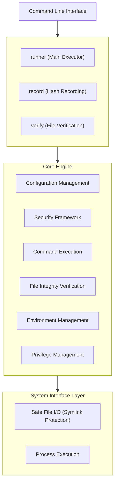

# Go Safe Command Runner - Design and Implementation Overview

## Overview

Go Safe Command Runner is a security-focused command execution framework designed for privileged task delegation and automated batch processing. The system provides multiple layers of security controls that enable safe execution of privileged operations while maintaining strict security boundaries.

**Key Use Cases:**
- Scheduled backup operations requiring root privileges
- Delegation of specific administrative tasks to non-root users
- Automated system maintenance with security controls
- Batch processing with file integrity verification

## System Architecture

### High-Level Architecture



### Core Components

#### 1. Configuration Management (`internal/runner/config/`)
- **Purpose**: TOML-based configuration loading and validation
- **Key Features**:
  - Schema validation with mandatory field checks
  - Path security validation (absolute paths, no relative components)
  - Default value assignment
  - Duplicate group name detection and environment variable inheritance analysis
  - Risk-based command control configuration
  - User/group execution specification support

**Implementation Highlights:**
```go
// Safe configuration loading with validation
func (l *Loader) LoadConfig(path string) (*runnertypes.Config, error) {
    data, err := safefileio.SafeReadFile(path)  // Safe file reading
    if err := toml.Unmarshal(data, &cfg); err != nil {
        return nil, fmt.Errorf("failed to parse config: %w", err)
    }
    // Path validation and default assignment
}
```

#### 2. Command Execution Engine (`internal/runner/executor/`)
- **Purpose**: Safe command execution with output capture and timeout controls
- **Key Features**:
  - Process isolation and resource management
  - Configurable timeouts at global and command levels
  - Structured output capture with size limits
  - Background process support with signal handling

#### 3. File Integrity System (`internal/filevalidator/`)
- **Purpose**: SHA-256 based file verification to prevent execution of tampered binaries
- **Key Features**:
  - Hash recording and verification workflows
  - Privileged file access with controlled escalation
  - Atomic operations to prevent race conditions
  - Integration with privilege management

**Security Flow:**
```
File Access Request → Permission Check → Privilege Escalation (if needed)
→ File Open → Privilege Restoration → Hash Calculation → Verification
```

#### 4. Privilege Management (`internal/runner/privilege/`)
- **Purpose**: Controlled privilege escalation with comprehensive audit trails
- **Key Features**:
  - Thread-safe privilege operations using global mutex
  - Automatic privilege restoration with panic protection
  - Support for both native root and setuid binary execution
  - Emergency shutdown protocols on security failures

**Privilege Escalation Pattern:**
```go
// WithPrivileges: Proper responsibility separation using Template Method pattern
func (m *UnixPrivilegeManager) WithPrivileges(elevationCtx runnertypes.ElevationContext, fn func() error) (err error) {
	m.mu.Lock()
	defer m.mu.Unlock()

	execCtx, err := m.prepareExecution(elevationCtx) // Preparation phase
	if err != nil {
		return err
	}

	if err := m.performElevation(execCtx); err != nil { // Execution phase
		return err
	}

	defer m.handleCleanupAndMetrics(execCtx) // Cleanup phase
	return fn()
}
```

#### 5. Environment Security (`internal/runner/environment/`)
- **Purpose**: Zero-trust environment variable filtering
- **Key Features**:
  - Allowlist-based filtering at global and group levels
  - Dangerous pattern detection (passwords, tokens, etc.)
  - Inheritance control (inherit/explicit/deny modes)
  - Variable name and value validation

#### 6. Safe File Operations (`internal/safefileio/`)
- **Purpose**: Symlink-safe file operations using modern Linux security primitives
- **Key Features**:
  - openat2 and RESOLVE_NO_SYMLINKS for symlink attack prevention
  - Step-by-step path validation
  - Atomic file operations
  - Cross-platform compatibility with fallback mechanisms

#### 7. Security Framework (`internal/runner/security/`)
- **Purpose**: Centralized security validation and policy enforcement
- **Key Features**:
  - Command path allowlist validation
  - Dangerous command detection
  - File permission verification
  - Path traversal attack prevention
  - Risk-based command analysis and blocking
  - Sensitive data redaction in logs

#### 8. Resource Management (`internal/runner/resource/`)
- **Purpose**: Unified management of side effects in both normal execution and dry-run modes
- **Key Features**:
  - Command execution abstraction
  - Temporary directory lifecycle management
  - Privilege escalation coordination
  - Dry-run simulation with realistic analysis
  - Network operations (Slack notifications)

#### 9. Verification Management (`internal/verification/`)
- **Purpose**: Centralized management of file verification and path resolution
- **Key Features**:
  - Configuration file verification
  - Command path resolution with security verification
  - Privileged file access fallback
  - Standard system path verification skipping

#### 10. Risk Assessment (`internal/runner/risk/`)
- **Purpose**: Risk-based security assessment for command execution
- **Key Features**:
  - Command risk level analysis (low, medium, high, critical)
  - Risk level-based security policy enforcement
  - Command override detection and blocking

#### 11. Logging and Auditing (`internal/logging/`, `internal/runner/audit/`)
- **Purpose**: Secure logging with sensitive data protection
- **Key Features**:
  - Multi-handler logging (file, syslog, Slack notifications)
  - Conditional text handlers and interactive log handlers
  - Pre-execution error handling
  - Structured audit trails
  - Automatic sensitive data redaction capabilities

#### 12. Data Redaction (`internal/redaction/`)
- **Purpose**: Automatic filtering of sensitive information from logs and output
- **Key Features**:
  - Pattern-based detection of passwords, tokens, API keys
  - Environment variable sanitization
  - Configurable redaction policies

#### 13. Terminal Capability Detection (`internal/terminal/`)
- **Purpose**: Detection of terminal color support and interactive execution environment
- **Key Features**:
  - Interactive terminal environment detection (TTY/CI environment determination)
  - Terminal color support detection and management
  - User color setting priority control
  - Cross-platform terminal capability determination

#### 14. Group Membership Management (`internal/groupmembership/`)
- **Purpose**: Safe management of user group membership
- **Key Features**:
  - Support for both CGO and non-CGO implementations
  - Group information parsing and validation
  - User/group association management

#### 15. Color Management (`internal/color/`)
- **Purpose**: Color control for console output
- **Key Features**:
  - Terminal color support detection
  - Configurable color output control

#### 16. Hash Directory Management (`internal/runner/hashdir/`)
- **Purpose**: Security management and validation of hash directories
- **Key Features**:
  - Hash directory validation and security checks
  - Enforced use of default hash directories
  - Prevention of custom hash directory attacks
  - Path permission and access control validation

#### 17. System Initialization (`internal/runner/bootstrap/`)
- **Purpose**: Initialization processing and bootstrapping at system startup
- **Key Features**:
  - Logger initialization and configuration
  - Initial environment variable setup
  - Pre-validation of config files and hash directories
  - Security checks at system startup

#### 18. Error Management (`internal/runner/errors/`)
- **Purpose**: Centralized error definition and handling
- **Key Features**:
  - Custom error type definitions
  - Error context and metadata management
  - Security-aware error handling
  - Structured error reporting

#### 19. CLI Management (`internal/runner/cli/`)
- **Purpose**: Command line interface management
- **Key Features**:
  - Command line argument parsing and validation
  - Flag and option management
  - Help and usage information provision
  - Interactive mode support

#### 20. Test Utilities (`internal/runner/executor/testing/`, `internal/runner/privilege/testing/`)
- **Purpose**: Test-specific utilities for each component
- **Key Features**:
  - Mock implementations and test helpers
  - Security feature simulation in test environments
  - Test data generation and cleanup
  - Isolated test environment provision

#### 21. Common Utilities (`internal/common/`, `internal/cmdcommon/`)
- **Purpose**: Provision of basic functionality shared between packages
- **Key Features**:
  - Filesystem abstraction interfaces
  - Test support with mock implementations
  - Command common utilities

## Data Flow Architecture

### Command Execution Flow

```
Configuration Loading → Security Validation → Group Processing → Command Execution

1. Configuration Loading:
   ├── TOML parsing and validation
   ├── Path security checks (hash directory absolute path validation)
   ├── Default value assignment
   └── Duplicate group name detection and environment variable inheritance analysis

2. Security Validation:
   ├── Configuration file integrity verification
   ├── Environment variable filtering
   ├── Command path verification and risk assessment
   ├── Permission checks
   └── User/group execution verification

3. Group Processing:
   ├── Dependency resolution
   ├── Priority determination
   ├── Resource allocation (temporary directories)
   ├── Environment preparation
   └── Risk-based command filtering

4. Command Execution:
   ├── Risk level assessment and enforcement
   ├── Privilege escalation (when needed)
   ├── User/group switching (when specified)
   ├── Process spawning with isolation
   ├── Output capture and monitoring with redaction
   ├── Privilege restoration
   ├── Resource cleanup
   └── Audit logging and notifications
```

### File Verification Flow

```
File Path Input → Security Checks → Hash Calculation → Verification → Result

1. Security Checks:
   ├── Path validation (no symlinks, absolute path)
   ├── Permission analysis
   └── Privilege requirement determination

2. File Access and Hash Calculation:
   ├── Privilege escalation (if file requires root access)
   ├── Safe file opening
   ├── Privilege restoration (immediately after file open)
   ├── Streaming SHA-256 calculation (executed with normal privileges)
   └── Hash comparison preparation

3. Verification:
   ├── Hash comparison with stored values
   ├── Error reporting with detailed context
   └── Audit log recording
```

## Security Design Principles

### 1. Defense in Depth
Multiple security layers implemented so no single point of failure compromises the entire system:
- **Input Validation**: All input validation at entry points (including absolute path requirements)
- **Path Security**: Comprehensive path validation and symlink protection
- **File Integrity**: Hash-based verification of all critical files (config, executables)
- **Privilege Control**: Principle of least privilege with controlled escalation
- **Environment Isolation**: Strict allowlist-based environment filtering
- **Command Validation**: Allowlist-based command execution control with risk assessment
- **Data Protection**: Automatic redaction of sensitive information in logs and output

### 2. Zero Trust Model
No implicit trust in system environment:
- All file verification before use
- Environment variable filtering by allowlist
- Command validation against known good patterns
- Privilege granting only when necessary with immediate revocation

### 3. Fail-Safe Design
System designed to fail safely:
- Default deny for all operations
- Emergency shutdown on security failures
- Comprehensive error handling and logging
- Graceful degradation when security features unavailable

### 4. Audit and Monitoring
Complete visibility into security-related operations:
- Structured logging with security context
- Privileged operation metrics and tracking
- Security event recording
- Multi-channel reporting for critical errors

## Implementation Patterns

### 1. Interface-Driven Design
Heavy use of interfaces for testability and modularity:
```go
type PrivilegeManager interface {
    WithPrivileges(context ElevationContext, fn func() error) error
    IsSupported() bool
}

type FileValidator interface {
    Verify(filepath string) error
    Record(filepath string) (string, error)
}
```

### 2. Composition over Inheritance
Component composition for feature extension:
```go
type ValidatorWithPrivileges struct {
    *Validator                    // Base functionality
    privMgr      PrivilegeManager // Extended functionality
    logger       *slog.Logger     // Observability
}
```

### 3. Context-Aware Operations
Operations with context for security and observability:
```go
type ElevationContext struct {
    Operation  string
    FilePath   string
    Reason     string
}
```

### 4. Builder Pattern for Configuration
Flexible configuration with reasonable defaults:
```go
func NewRunnerWithOptions(config *Config, opts ...Option) (*Runner, error) {
    options := &runnerOptions{}
    for _, opt := range opts {
        opt(options)
    }
    // Apply options and create runner
}
```

### 5. Resource Management Pattern
Unified handling of side effects across execution modes:
```go
type ResourceManager interface {
    ExecuteCommand(ctx context.Context, cmd Command, group *CommandGroup, env map[string]string) (*ExecutionResult, error)
    CreateTempDir(groupName string) (string, error)
    WithPrivileges(context ElevationContext, fn func() error) error
    SendNotification(message string, details map[string]any) error
}
```

## Testing Strategy

### 1. Unit Tests
- Comprehensive test coverage for all core components
- Mock implementations for external dependencies
- Error condition testing with custom error types
- Race condition testing for concurrent operations

### 2. Integration Tests
- End-to-end workflow testing
- File system interaction testing
- Privileged operation testing
- Configuration loading and validation testing

### 3. Security Tests
- Symlink attack prevention testing
- Path traversal attack testing
- Privilege escalation boundary testing
- Environment variable injection testing

### 4. Performance Tests
- Hash calculation performance benchmarks
- Memory usage optimization
- Concurrent operation performance
- Large file processing efficiency
- Risk assessment performance testing
- Dry-run simulation accuracy verification

## Deployment Considerations

### 1. Binary Distribution
- Setuid bit configuration for privilege escalation
- Root ownership requirements
- Binary integrity verification before deployment
- Secure installation procedures

### 2. Configuration Management
- Secure hash directory permissions (755 or more restrictive)
- Write-protected configuration files
- Regular integrity verification of critical files
- Configuration template management
- Simplified configuration with absolute path requirements (environment variable fallback elimination)

### 3. Monitoring and Alerting
- Structured logging for security events
- Syslog integration for centralized logging
- Emergency shutdown event monitoring
- Performance metrics collection
- Slack integration for critical alerts
- Sensitive data redaction across all logs

### 4. Security Operations
- Regular security audits of configuration
- Privileged operation monitoring
- File integrity verification scheduling
- Incident response procedures
- Risk-based command monitoring and alerting
- User/group execution audit trails

## Performance Characteristics

### 1. Hash Calculation
- Efficient streaming hash calculation
- File size limits to prevent resource exhaustion
- Parallel processing for multiple files
- Memory-efficient implementation

### 2. Environment Processing
- O(1) allowlist lookups using map structures
- Compiled regular expressions for pattern matching
- Minimal string manipulations
- Batch processing optimization

### 3. Privileged Operations
- Serialization of privileged operations with global mutex
- Fast privilege escalation/restoration using system calls
- Metrics collection for performance monitoring
- Resource usage tracking

### 4. Risk Assessment
- O(1) risk level lookups using pre-compiled patterns
- Efficient command analysis using regular expression matching
- Minimal overhead for risk assessment
- Result caching for repeated command analysis

### 5. Data Redaction
- Pre-compiled regular expression patterns for sensitive data detection
- Streaming redaction for large output
- Minimal performance impact on normal operations
- Configurable redaction policies

## Package Structure

The current package structure of the project is as follows:

```
go-safe-cmd-runner/
├── cmd/                           # Entry points
│   ├── record/                    # Hash recording command
│   ├── runner/                    # Main execution command
│   └── verify/                    # File verification command
├── internal/                      # Internal packages
│   ├── cmdcommon/                 # Command common utilities
│   ├── color/                     # Color management
│   ├── common/                    # Common interfaces and utilities
│   ├── filevalidator/             # File integrity verification
│   ├── groupmembership/           # Group membership management
│   ├── logging/                   # Log management
│   ├── redaction/                 # Data redaction
│   ├── runner/                    # Core execution engine
│   │   ├── audit/                 # Audit functionality
│   │   ├── bootstrap/             # System initialization and bootstrap
│   │   ├── cli/                   # Command line interface
│   │   ├── config/                # Configuration management
│   │   ├── environment/           # Environment variable management
│   │   ├── errors/                # Error definition and handling
│   │   ├── executor/              # Command execution
│   │   │   └── testing/           # Test utilities for execution engine
│   │   ├── hashdir/               # Hash directory management and security
│   │   ├── privilege/             # Privilege management
│   │   │   └── testing/           # Test utilities for privilege management
│   │   ├── resource/              # Resource management
│   │   ├── risk/                  # Risk assessment
│   │   ├── runnertypes/           # Type definitions
│   │   └── security/              # Security framework
│   ├── safefileio/                # Safe file I/O
│   ├── terminal/                  # Terminal capability management
│   └── verification/              # Verification management (pre-validation, path resolution)
├── docs/                          # Project documentation
└── sample/                        # Sample configuration files
```

## Future Extensibility

### 1. Plugin Architecture
Easy extension possible through interface-driven design:
- Custom hash algorithms
- Additional privilege backends
- Extended security validators
- Custom output formatters
- Pluggable risk assessment engines
- Custom notification backends
- Extended redaction patterns

### 2. Platform Support
Current focus on Linux/Unix with extensibility for:
- Windows privilege management
- macOS security features
- Container runtime integration
- Cloud platform adapters

### 3. Integration Points
Clearly defined interfaces for integration with:
- Configuration management systems
- Monitoring and alerting platforms
- Audit and compliance systems
- Identity and access management
- SIEM and security orchestration platforms
- ChatOps and collaboration tools (Slack, Teams)
- Container orchestration platforms

## Summary

Go Safe Command Runner demonstrates security engineering best practices through multi-layered security approaches, comprehensive input validation, config file pre-validation, secure fixed PATH usage, hash directory security enhancements, safe privilege management, risk-based command control, and extensive audit capabilities. The system achieved a **comprehensive security assessment of A (excellent)** and **0 critical risks**, designed to fail safely and provide complete visibility into security-related operations, making it suitable for production use in security-conscious environments.

The implementation showcases modern Go development patterns including interface-driven design, composition-based architecture, resource management patterns, and comprehensive testing strategies. The system's modular design enables easy extension and customization while maintaining strict security boundaries.

Key innovative features include the config file pre-validation system, complete prevention of custom hash directory attacks, elimination of PATH manipulation attacks through secure fixed PATH implementation, unified resource management for both normal execution and dry-run modes, intelligent risk assessment for command security, automatic sensitive data protection, and comprehensive audit capabilities with multi-channel notifications. The system provides enterprise-grade security controls while maintaining operational flexibility and extensibility.
