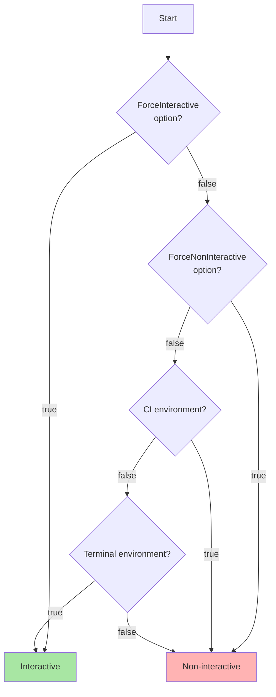
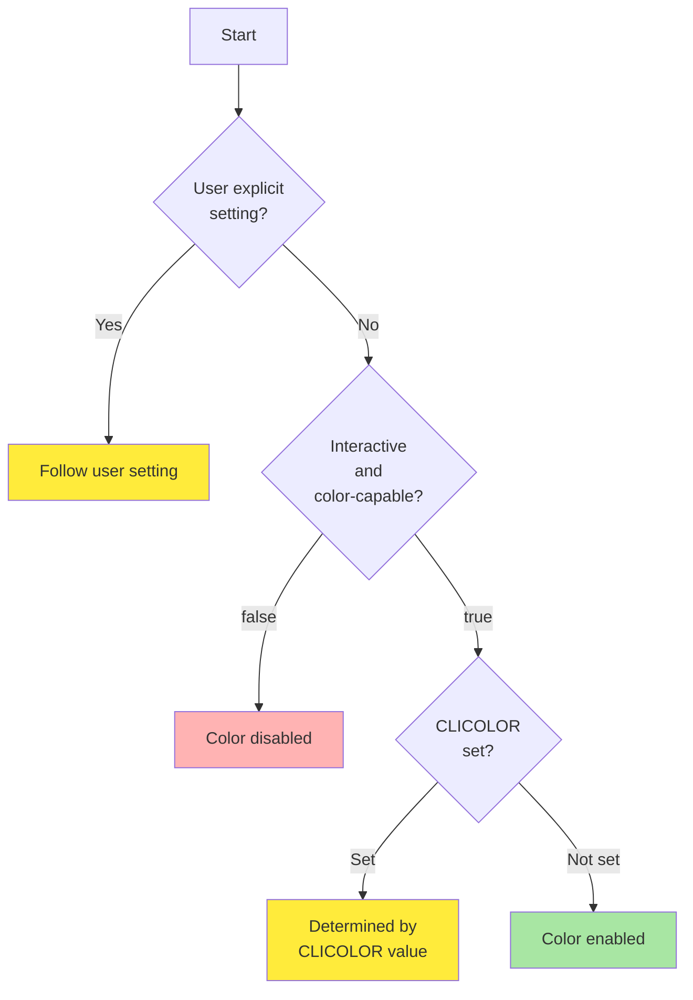
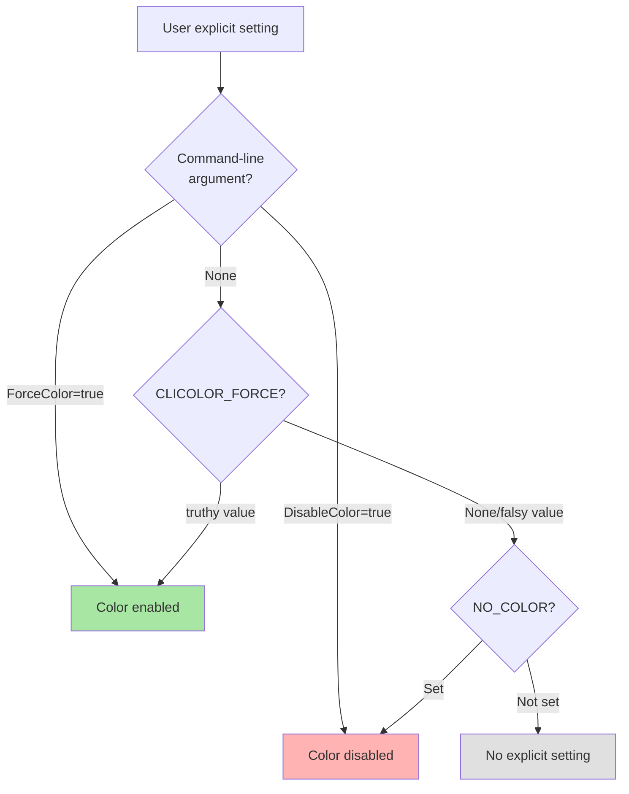

# Terminal Capability Detection Logic

This document explains the terminal capability detection logic in Go Safe Command Runner.

## Overview

Terminal capability detection provides two main features:

1. **Interactive Mode Detection** - Whether the current environment is suitable for interactive user operations
2. **Color Display Detection** - Whether color output should be enabled

These determinations are made by comprehensively considering environment variables, command-line arguments, terminal capabilities, and other factors.

## Interactive Mode Detection Flow



### Interactive Mode Detection Details

#### 1. Forced Specification via Command-Line Arguments (Highest Priority)
- `ForceInteractive = true`: Force interactive mode
- `ForceNonInteractive = true`: Force non-interactive mode

#### 2. CI Environment Detection
When the following environment variables are set, the environment is detected as CI and non-interactive mode is used:

- `CI` - When the value is not `false`, `0`, or `no`
- `CONTINUOUS_INTEGRATION`
- `GITHUB_ACTIONS`
- `TRAVIS`
- `CIRCLECI`
- `JENKINS_URL`
- `BUILD_NUMBER`
- `GITLAB_CI`
- `APPVEYOR`
- `BUILDKITE`
- `DRONE`
- `TF_BUILD`

#### 3. Terminal Environment Detection
The following conditions determine whether it is a terminal environment:

1. **TTY Connection Check**: Either stdout or stderr is connected to a TTY
2. **TERM Environment Variable**: Set and the value is not `dumb`

## Color Display Detection Flow



### Color Display Detection Details

#### 1. User Explicit Setting Detection



#### 2. Color-Capable Terminal Detection
Checks the `TERM` environment variable and supports the following terminal types:

- `xterm` family
- `screen` family
- `tmux` family
- `rxvt` family
- `vt100`, `vt220`
- `ansi`
- `linux`
- `cygwin`
- `putty`

When `TERM=dumb`, it is detected as not color-capable.

#### 3. Priority Order

1. **Command-Line Arguments** (Highest priority)
   - `--force-color` or `--disable-color`

2. **CLICOLOR_FORCE**
   - When the value is `1`, `true`, or `yes` (case insensitive), overrides all conditions and enables color

3. **NO_COLOR**
   - Disables color when set, regardless of value

4. **CLICOLOR** (Only in interactive mode)
   - When the value is `1`, `true`, or `yes`, enables color
   - Ignored in other cases or when not in interactive mode

5. **Auto-Detection** (Default)
   - Enables color when interactive and terminal is color-capable

## Implementation Structure

### Main Components

1. **Capabilities** (`capabilities.go`)
   - Integration of overall detection logic
   - Provides `IsInteractive()` and `SupportsColor()` methods

2. **InteractiveDetector** (`detector.go`)
   - Interactive mode detection
   - CI environment detection
   - Terminal environment detection

3. **ColorDetector** (`color.go`)
   - Terminal color capability detection

4. **UserPreference** (`preference.go`)
   - User explicit setting management
   - Environment variable and command-line argument processing

### Configuration Options

```go
type Options struct {
    PreferenceOptions PreferenceOptions
    DetectorOptions   DetectorOptions
}

type PreferenceOptions struct {
    ForceColor   bool
    DisableColor bool
}

type DetectorOptions struct {
    ForceInteractive    bool
    ForceNonInteractive bool
}
```

## Usage Examples

```go
// Basic usage
options := terminal.Options{
    PreferenceOptions: terminal.PreferenceOptions{
        ForceColor: false,
        DisableColor: false,
    },
    DetectorOptions: terminal.DetectorOptions{
        ForceInteractive: false,
        ForceNonInteractive: false,
    },
}

capabilities := terminal.NewCapabilities(options)

if capabilities.IsInteractive() {
    // Interactive processing
}

if capabilities.SupportsColor() {
    // Color output
}
```

## Notes

1. **CLICOLOR vs CLICOLOR_FORCE**
   - `CLICOLOR` is only effective in interactive mode
   - `CLICOLOR_FORCE` overrides all conditions

2. **NO_COLOR**
   - Disabled when set as an environment variable, regardless of value
   - Complies with [NO_COLOR](https://no-color.org/) standard

3. **CI Environment**
   - Basically non-interactive mode in CI environments
   - Can be overridden with `ForceInteractive`

4. **TTY Detection**
   - Sufficient if either stdout or stderr is a TTY
   - Considers usage in integrated development environments
