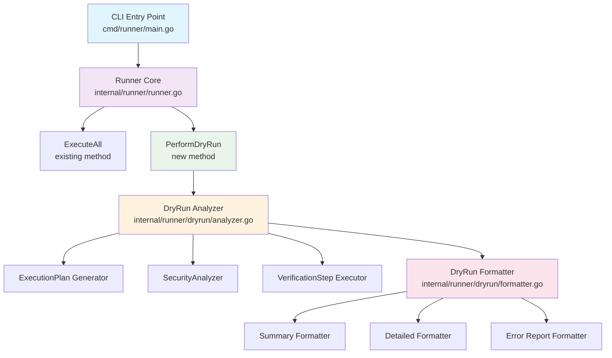
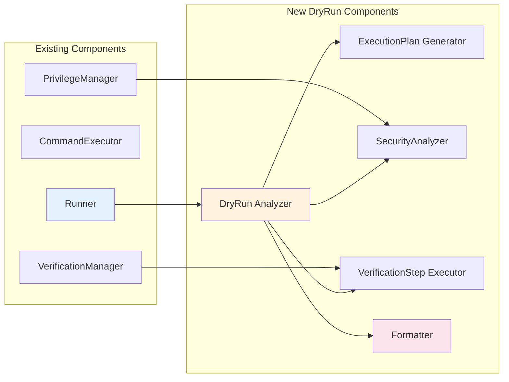
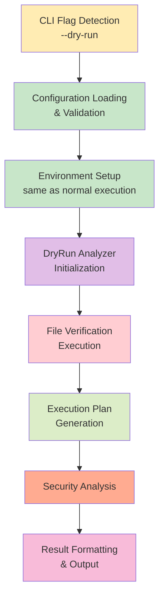
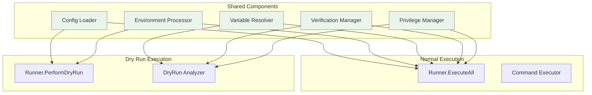
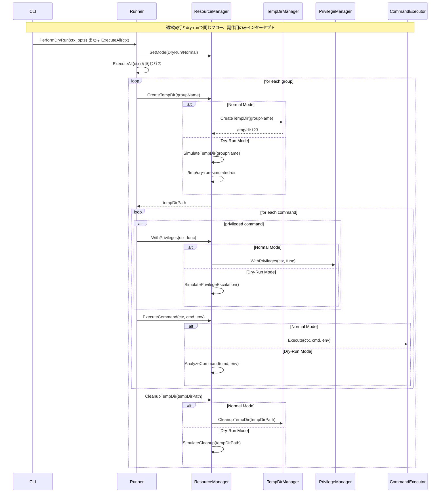

# アーキテクチャー設計書: リアリスティックなDry-Run機能

## 1. 概要

### 1.1 設計目標
- 既存のRunner実行フローを最大限活用し、実際の実行パスに近いdry-run機能を実現
- 副作用なしで詳細な実行計画と検証結果を提供
- 既存コードベースへの影響を最小限に抑制

### 1.2 設計原則
- **単一責任の原則**: dry-run専用のコンポーネントは分析・検証・出力のみを担当
- **開放閉鎖の原則**: 既存のRunnerインターフェースを拡張し、新機能を追加
- **依存性逆転の原則**: 抽象化されたインターフェースを通じて機能を実現

## 2. アーキテクチャー概要

### 2.1 全体構成



### 2.2 コンポーネント間の関係



**コンポーネントの役割:**
- **Runner**: 既存機能を保持しつつ、dry-run用の新しいメソッドを追加
- **DryRun Analyzer**: 実行計画の分析と検証を担当
- **DryRun Formatter**: 結果の整形と出力を担当

## 3. コンポーネント設計

### 3.1 Runner拡張

#### 3.1.1 新規メソッド
```go
type Runner struct {
    // existing fields...
}

// PerformDryRun performs a dry-run analysis without executing commands
func (r *Runner) PerformDryRun(ctx context.Context, opts DryRunOptions) (*DryRunResult, error)

type DryRunOptions struct {
    DetailLevel    DetailLevel    // Summary, Detailed, Full
    OutputFormat   OutputFormat   // Text, JSON, YAML
    ShowSensitive  bool          // Whether to show sensitive variables (masked)
    VerifyFiles    bool          // Whether to perform file verification
}

type DryRunResult struct {
    ExecutionPlan   *ExecutionPlan
    Verification    *VerificationResults
    SecurityAnalysis *SecurityAnalysis
    Errors          []error
    Warnings        []string
}
```

### 3.2 DryRun Analyzer

#### 3.2.1 パッケージ構成
```
internal/runner/dryrun/
├── analyzer.go        # メインの分析エンジン
├── execution_plan.go  # 実行計画生成
├── security.go        # セキュリティ分析
├── verification.go    # ファイル検証
└── types.go          # 型定義
```

#### 3.2.2 主要インターフェース
```go
// Analyzer performs comprehensive dry-run analysis
type Analyzer interface {
    AnalyzeExecution(ctx context.Context, config *runnertypes.Config, envVars map[string]string) (*AnalysisResult, error)
    GenerateExecutionPlan(groups []runnertypes.CommandGroup, envVars map[string]string) (*ExecutionPlan, error)
    AnalyzeSecurity(plan *ExecutionPlan) (*SecurityAnalysis, error)
}

// ExecutionPlanGenerator generates detailed execution plans
type ExecutionPlanGenerator interface {
    GeneratePlan(groups []runnertypes.CommandGroup, envVars map[string]string) (*ExecutionPlan, error)
    ResolveVariables(command string, envVars map[string]string) (string, error)
    DetectPrivilegeRequirements(cmd runnertypes.Command) (PrivilegeInfo, error)
}

// SecurityAnalyzer analyzes security implications
type SecurityAnalyzer interface {
    AnalyzeCommands(plan *ExecutionPlan) (*SecurityAnalysis, error)
    DetectPrivilegeEscalation(commands []ResolvedCommand) ([]SecurityRisk, error)
    ValidateEnvironmentAccess(envAccess []EnvironmentAccess) ([]SecurityRisk, error)
}

// VerificationStepExecutor performs file verification steps
type VerificationStepExecutor interface {
    PerformVerification(ctx context.Context, config *runnertypes.Config, envFile string) (*VerificationResults, error)
    VerifyConfigIntegrity(configPath string) error
    VerifyEnvironmentFile(envPath string) error
    VerifyGlobalFiles(global *runnertypes.GlobalConfig) (*verification.Result, error)
}
```

### 3.3 主要データ構造

#### 3.3.1 実行計画
```go
type ExecutionPlan struct {
    Groups           []GroupPlan      `json:"groups"`
    TotalCommands    int              `json:"total_commands"`
    EstimatedDuration time.Duration   `json:"estimated_duration"`
    RequiresPrivilege bool            `json:"requires_privilege"`
}

type GroupPlan struct {
    Name              string            `json:"name"`
    Description       string            `json:"description"`
    Priority          int               `json:"priority"`
    WorkingDirectory  string            `json:"working_directory"`
    Commands          []ResolvedCommand `json:"commands"`
    Dependencies      []string          `json:"dependencies"`
    EnvironmentVars   map[string]string `json:"environment_vars"`
    EstimatedDuration time.Duration     `json:"estimated_duration"`
}

type ResolvedCommand struct {
    Name            string        `json:"name"`
    Description     string        `json:"description"`
    CommandLine     string        `json:"command_line"`    // 環境変数展開後
    OriginalCommand string        `json:"original_command"` // 元のテンプレート
    WorkingDir      string        `json:"working_dir"`
    Timeout         time.Duration `json:"timeout"`
    RequiredUser    string        `json:"required_user"`   // root, current, etc.
    PrivilegeInfo   PrivilegeInfo `json:"privilege_info"`
    OutputSettings  OutputSettings `json:"output_settings"`
}

type PrivilegeInfo struct {
    RequiresPrivilege bool     `json:"requires_privilege"`
    TargetUser       string   `json:"target_user"`
    Capabilities     []string `json:"capabilities"`
    Risks            []string `json:"risks"`
}
```

#### 3.3.2 セキュリティ分析
```go
type SecurityAnalysis struct {
    Risks              []SecurityRisk      `json:"risks"`
    PrivilegeChanges   []PrivilegeChange   `json:"privilege_changes"`
    EnvironmentAccess  []EnvironmentAccess `json:"environment_access"`
    FileAccess         []FileAccess        `json:"file_access"`
}

type SecurityRisk struct {
    Level       RiskLevel `json:"level"`        // Low, Medium, High, Critical
    Type        RiskType  `json:"type"`         // PrivilegeEscalation, DataExposure, etc.
    Description string    `json:"description"`
    Command     string    `json:"command"`
    Group       string    `json:"group"`
    Mitigation  string    `json:"mitigation"`
}

type PrivilegeChange struct {
    Group       string `json:"group"`
    Command     string `json:"command"`
    FromUser    string `json:"from_user"`
    ToUser      string `json:"to_user"`
    Mechanism   string `json:"mechanism"`  // sudo, setuid, etc.
}
```

#### 3.3.3 検証結果
```go
type VerificationResults struct {
    ConfigVerification    *FileVerification    `json:"config_verification"`
    EnvironmentVerification *FileVerification  `json:"environment_verification"`
    GlobalVerification    *verification.Result `json:"global_verification"`
    Errors               []error               `json:"errors"`
}

type FileVerification struct {
    FilePath   string        `json:"file_path"`
    Verified   bool          `json:"verified"`
    HashValue  string        `json:"hash_value"`
    Algorithm  string        `json:"algorithm"`
    Duration   time.Duration `json:"duration"`
    Error      error         `json:"error,omitempty"`
}
```

### 3.4 DryRun Formatter

#### 3.4.1 フォーマッター構成
```go
// Formatter formats dry-run results for output
type Formatter interface {
    FormatResult(result *DryRunResult, opts FormatterOptions) (string, error)
    FormatSummary(result *DryRunResult) (string, error)
    FormatDetailed(result *DryRunResult) (string, error)
    FormatErrors(errors []error) (string, error)
}

type FormatterOptions struct {
    Format        OutputFormat  // Text, JSON, YAML
    DetailLevel   DetailLevel   // Summary, Detailed, Full
    ShowSensitive bool         // Show sensitive information (masked)
    ColorOutput   bool         // Use colored output for terminals
}
```

## 4. 実行フロー設計

### 4.1 メインフロー



### 4.2 詳細実行手順

#### 4.2.1 初期化フェーズ
1. 既存のRunner初期化処理を実行
2. DryRun Analyzerの作成
3. VerificationStepExecutorの初期化

#### 4.2.2 分析フェーズ
1. **ファイル検証**
   - 設定ファイルの整合性確認
   - 環境ファイルの整合性確認
   - グローバルファイルの検証

2. **実行計画生成**
   - グループ依存関係の解決
   - 実行順序の決定
   - 環境変数の展開と解決
   - コマンドラインの完全解決

3. **セキュリティ分析**
   - 特権昇格要件の分析
   - 環境変数アクセスパターンの分析
   - ファイルアクセスパターンの分析
   - 潜在的リスクの検出

#### 4.2.3 出力フェーズ
1. 結果の整形
2. エラー・警告の集約
3. 指定された形式での出力

## 5. 既存コードとの統合

### 5.1 Runner構造体の拡張
既存のRunner構造体に新しいメソッドを追加し、既存機能に影響を与えない設計：

```go
// 既存メソッドは変更なし
func (r *Runner) ExecuteAll(ctx context.Context) error {
    // existing implementation
}

// 新規メソッド追加
func (r *Runner) PerformDryRun(ctx context.Context, opts DryRunOptions) (*DryRunResult, error) {
    analyzer := dryrun.NewAnalyzer(
        r.config,
        r.verificationManager,
        r.privilegeManager,
    )

    return analyzer.AnalyzeExecution(ctx, r.config, r.envVars)
}
```

### 5.2 インターフェース保持
既存のインターフェース（CommandExecutor, PrivilegeManager等）はそのまま活用し、新しい機能のみdryrunパッケージで実装。

### 5.3 設定ファイル互換性
既存のTOML設定ファイル形式を完全に維持し、新しい設定は必要に応じて追加。

## 6. 拡張性とメンテナンス性

### 6.1 プラガブルアーキテクチャー
- フォーマッターは交換可能な設計
- セキュリティアナライザーは拡張可能
- 検証ステップは追加可能

### 6.2 テスト戦略
- 各コンポーネントは独立してテスト可能
- モックインターフェースを活用
- 既存テストとの分離

### 6.3 エラーハンドリング
- 段階的なエラー収集
- ユーザーフレンドリーなエラーメッセージ
- デバッグ情報の提供

## 7. パフォーマンス考慮事項

### 7.1 メモリ使用量
- 大規模設定での効率的な処理
- ストリーミング処理の活用
- 不要なデータの早期解放

### 7.2 実行時間
- 並列処理可能な部分の最適化
- キャッシュ機構の活用
- プログレス表示の実装

## 8. 実行パス整合性保証

### 8.1 設計原則

#### 8.1.1 共通コンポーネント活用
通常実行とdry-runで同じコンポーネントを可能な限り共有し、実装の乖離を防ぐ。



#### 8.1.2 段階的検証アプローチ
各処理段階で通常実行と同じ検証ロジックを実行する。

### 8.2 具体的保証メカニズム

#### 8.2.1 共有インターフェースの強制
```go
// 通常実行とdry-runで同じインターフェースを使用
type ExecutionContext interface {
    ResolveVariables(cmd string, envVars map[string]string, group *runnertypes.CommandGroup) (string, error)
    ValidatePrivileges(cmd runnertypes.Command) (PrivilegeInfo, error)
    VerifyFileAccess(path string) error
}

// Runner構造体に共通メソッドを追加
func (r *Runner) CreateExecutionContext() ExecutionContext {
    return &executionContext{
        envFilter:        r.envFilter,
        privilegeManager: r.privilegeManager,
        validator:       r.validator,
    }
}
```

#### 8.2.2 変数解決ロジックの共有
```go
// 既存のRunner.resolveVariableReferencesWithDepthを活用
func (a *analyzer) resolveVariables(command string, envVars map[string]string, group *runnertypes.CommandGroup) (string, error) {
    // 通常実行と同じロジックを使用
    return a.runner.resolveVariableReferencesWithDepth(
        command,
        envVars,
        make(map[string]bool),
        0,
        group,
    )
}
```

#### 8.2.3 ファイル検証の共有
```go
// 既存のVerificationManagerを直接使用
func (a *analyzer) performVerification(ctx context.Context, config *runnertypes.Config) (*VerificationResults, error) {
    // 通常実行と全く同じ検証処理
    result, err := a.verificationManager.VerifyGlobalFiles(&config.Global)
    if err != nil {
        return nil, err
    }

    return &VerificationResults{
        GlobalVerification: result,
        // ... 他の検証結果
    }, nil
}
```

### 8.3 テスト戦略による整合性確認

#### 8.3.1 比較テストフレームワーク
```go
type PathConsistencyTest struct {
    testName     string
    configPath   string
    envFile      string
    expectedDiff PathDifference
}

type PathDifference struct {
    VariableResolution []VariableDiff
    PrivilegeAnalysis  []PrivilegeDiff
    FileVerification   []FileDiff
    AcceptableDiffs    []string // 許容される差分
}

func TestExecutionPathConsistency(t *testing.T) {
    tests := []PathConsistencyTest{
        // 各種シナリオでの一貫性テスト
    }

    for _, test := range tests {
        t.Run(test.testName, func(t *testing.T) {
            // 1. 通常実行の準備段階を実行
            normalResult := prepareNormalExecution(test.configPath, test.envFile)

            // 2. dry-run実行
            dryRunResult := performDryRun(test.configPath, test.envFile)

            // 3. 結果の比較検証
            diff := comparePaths(normalResult, dryRunResult)
            assertAcceptableDifference(t, diff, test.expectedDiff)
        })
    }
}
```

#### 8.3.2 継続的統合テスト
```yaml
# .github/workflows/path-consistency.yml
name: Execution Path Consistency Check

on: [push, pull_request]

jobs:
  consistency-test:
    runs-on: ubuntu-latest
    steps:
      - name: Path Consistency Test
        run: |
          # 複数の設定パターンで一貫性テスト
          go test -v ./internal/runner/dryrun -run TestExecutionPathConsistency

      - name: Performance Comparison
        run: |
          # dry-runが通常実行準備段階の性能と大きく乖離していないことを確認
          go test -bench=BenchmarkPathConsistency ./internal/runner/dryrun
```

### 8.4 実装レベルでの保証: 包括的副作用インターセプション

#### 8.4.1 副作用の分類と対処
dry-runで考慮すべき副作用を包括的に分析し、すべてをインターセプトする設計。

**副作用の種類:**
1. **コマンド実行**: 外部プログラムの実行
2. **ファイルシステム**: 一時ディレクトリ作成・削除、ファイル変更
3. **権限管理**: 特権昇格・降格（setuid/seteuid）
4. **プロセス管理**: 子プロセス作成・終了
5. **ネットワーク**: Slack通知、外部API呼び出し
6. **システム状態**: 環境変数変更、シグナル処理

#### 8.4.2 Resource Manager Pattern
すべての副作用を統一的にインターセプトする設計。



#### 8.4.3 包括的 ResourceManager インターフェース
```go
// ExecutionMode determines how all operations are handled
type ExecutionMode int

const (
    ExecutionModeNormal ExecutionMode = iota
    ExecutionModeDryRun
)

// ResourceManager manages all side-effects (commands, filesystem, privileges, etc.)
type ResourceManager interface {
    // Mode management
    SetMode(mode ExecutionMode, opts *DryRunOptions)
    GetMode() ExecutionMode

    // Command execution
    ExecuteCommand(ctx context.Context, cmd runnertypes.Command, group *runnertypes.CommandGroup, env map[string]string) (*ExecutionResult, error)

    // Filesystem operations
    CreateTempDir(groupName string) (string, error)
    CleanupTempDir(tempDirPath string) error
    CleanupAllTempDirs() error

    // Privilege management
    WithPrivileges(ctx context.Context, fn func() error) error
    IsPrivilegeEscalationRequired(cmd runnertypes.Command) (bool, error)

    // Network operations
    SendNotification(message string, details map[string]interface{}) error

    // Dry-run specific
    GetDryRunResults() *DryRunResult // dry-runモードでのみ有効
    RecordAnalysis(analysis *ResourceAnalysis)
}

// ResourceAnalysis captures analysis of a resource operation
type ResourceAnalysis struct {
    Type        ResourceType         `json:"type"`
    Operation   ResourceOperation    `json:"operation"`
    Target      string              `json:"target"`
    Parameters  map[string]interface{} `json:"parameters"`
    Impact      ResourceImpact      `json:"impact"`
    Timestamp   time.Time           `json:"timestamp"`
}

type ResourceType string
const (
    ResourceTypeCommand     ResourceType = "command"
    ResourceTypeFilesystem  ResourceType = "filesystem"
    ResourceTypePrivilege   ResourceType = "privilege"
    ResourceTypeNetwork     ResourceType = "network"
    ResourceTypeProcess     ResourceType = "process"
)

type ResourceOperation string
const (
    OperationCreate  ResourceOperation = "create"
    OperationDelete  ResourceOperation = "delete"
    OperationExecute ResourceOperation = "execute"
    OperationEscalate ResourceOperation = "escalate"
    OperationSend    ResourceOperation = "send"
)

type ResourceImpact struct {
    Reversible  bool     `json:"reversible"`
    Persistent  bool     `json:"persistent"`
    SecurityRisk string  `json:"security_risk,omitempty"`
    Description string   `json:"description"`
}

// ExecutionResult unified result for both normal and dry-run
type ExecutionResult struct {
    ExitCode    int                  `json:"exit_code"`
    Stdout      string               `json:"stdout"`
    Stderr      string               `json:"stderr"`
    Duration    time.Duration        `json:"duration"`
    DryRun      bool                 `json:"dry_run"`
    Analysis    *ResourceAnalysis    `json:"analysis,omitempty"`
}
```

#### 8.4.4 Runner の包括的変更
```go
// Runner構造体の変更
type Runner struct {
    // 既存のフィールドはそのまま、ただしResourceManagerに統合
    config              *runnertypes.Config
    envVars             map[string]string
    validator           *security.Validator
    verificationManager *verification.Manager
    envFilter           *environment.Filter
    runID               string

    // ★新規追加：すべての副作用を管理
    resourceManager     ResourceManager
}

// すべての副作用関連のメソッドでresourceManagerを使用

// 1. 一時ディレクトリ関連
func (r *Runner) ExecuteGroup(ctx context.Context, group runnertypes.CommandGroup) error {
    // ... 既存のロジック ...

    var tempDirPath string
    if processedGroup.TempDir {
        // ★変更：resourceManagerを使用
        var err error
        tempDirPath, err = r.resourceManager.CreateTempDir(processedGroup.Name)
        if err != nil {
            return fmt.Errorf("failed to create temp directory for group %s: %w", processedGroup.Name, err)
        }
        groupTempDirs = append(groupTempDirs, tempDirPath)
    }

    // ... 既存のロジック ...

    defer func() {
        // ★変更：resourceManagerを使用
        for _, tempDirPath := range groupTempDirs {
            if err := r.resourceManager.CleanupTempDir(tempDirPath); err != nil {
                slog.Warn("Failed to cleanup temp directory", "path", tempDirPath, "error", err)
            }
        }
    }()

    // ... 既存のロジック ...
}

// 2. コマンド実行関連
func (r *Runner) executeCommandInGroup(ctx context.Context, cmd runnertypes.Command, group *runnertypes.CommandGroup) (*executor.Result, error) {
    // 環境変数解決（既存ロジック）
    resolvedCmd, env, err := r.prepareCommandExecution(cmd, group)
    if err != nil {
        return nil, err
    }

    // ★変更：resourceManagerを使用
    result, err := r.resourceManager.ExecuteCommand(ctx, resolvedCmd, group, env)
    if err != nil {
        return nil, err
    }

    // 既存の後処理ロジック（統一形式に変換）
    return &executor.Result{
        ExitCode: result.ExitCode,
        Stdout:   result.Stdout,
        Stderr:   result.Stderr,
    }, nil
}

// 3. 特権管理関連（新規追加）
func (r *Runner) executePrivilegedCommand(ctx context.Context, cmd runnertypes.Command, group *runnertypes.CommandGroup, env map[string]string) (*executor.Result, error) {
    // ★変更：resourceManagerを使用
    err := r.resourceManager.WithPrivileges(ctx, func() error {
        result, err := r.resourceManager.ExecuteCommand(ctx, cmd, group, env)
        if err != nil {
            return err
        }
        // 結果を処理
        return nil
    })

    return nil, err
}

// 4. 通知関連
func (r *Runner) sendGroupNotification(group runnertypes.CommandGroup, result *groupExecutionResult, duration time.Duration) {
    notificationData := map[string]interface{}{
        "group":    group.Name,
        "status":   result.status,
        "duration": duration,
        // ... その他の詳細 ...
    }

    message := fmt.Sprintf("Group %s execution %s", group.Name, result.status)

    // ★変更：resourceManagerを使用
    if err := r.resourceManager.SendNotification(message, notificationData); err != nil {
        slog.Warn("Failed to send notification", "error", err)
    }
}

// 5. dry-run用のエントリーポイント
func (r *Runner) PerformDryRun(ctx context.Context, opts DryRunOptions) (*DryRunResult, error) {
    // ★重要：resourceManagerをdry-runモードに設定
    r.resourceManager.SetMode(ExecutionModeDryRun, &opts)

    // ★重要：通常実行と全く同じパスを実行
    err := r.ExecuteAll(ctx)
    if err != nil {
        return nil, fmt.Errorf("dry-run analysis failed: %w", err)
    }

    // dry-run結果を取得
    return r.resourceManager.GetDryRunResults(), nil
}

// 通常実行用（変更なし、resourceManagerは既にnormalモードで初期化済み）
func (r *Runner) ExecuteAll(ctx context.Context) error {
    // 既存ロジックはそのまま
    // すべての副作用はresourceManagerが適切に処理
    // ...
}
```

#### 8.4.5 DefaultResourceManager 実装
```go
type DefaultResourceManager struct {
    mode             ExecutionMode
    dryRunOpts       *DryRunOptions

    // Delegated components
    executor         executor.CommandExecutor
    tempDirManager   *tempdir.TempDirManager
    privilegeManager runnertypes.PrivilegeManager

    // Dry-run state
    dryRunResult     *DryRunResult
    simulatedTempDirs map[string]string  // groupName -> simulatedPath
    resourceAnalyses []ResourceAnalysis

    // Logging
    logger           *slog.Logger
}

// Mode management
func (d *DefaultResourceManager) SetMode(mode ExecutionMode, opts *DryRunOptions) {
    d.mode = mode
    d.dryRunOpts = opts

    if mode == ExecutionModeDryRun {
        d.initializeDryRunState()
    }
}

func (d *DefaultResourceManager) initializeDryRunState() {
    d.dryRunResult = &DryRunResult{
        Metadata:         &ResultMetadata{GeneratedAt: time.Now()},
        ExecutionPlan:    &ExecutionPlan{},
        Verification:     &VerificationResults{},
        SecurityAnalysis: &SecurityAnalysis{},
        Errors:          []DryRunError{},
        Warnings:        []DryRunWarning{},
    }
    d.simulatedTempDirs = make(map[string]string)
    d.resourceAnalyses = []ResourceAnalysis{}
}

// Command execution
func (d *DefaultResourceManager) ExecuteCommand(ctx context.Context, cmd runnertypes.Command, group *runnertypes.CommandGroup, env map[string]string) (*ExecutionResult, error) {
    switch d.mode {
    case ExecutionModeNormal:
        // 通常実行：既存のexecutorを使用
        result, err := d.executor.Execute(ctx, cmd, env)
        if err != nil {
            return nil, err
        }
        return &ExecutionResult{
            ExitCode: result.ExitCode,
            Stdout:   result.Stdout,
            Stderr:   result.Stderr,
            Duration: 0, // executor doesn't track duration yet
            DryRun:   false,
        }, nil

    case ExecutionModeDryRun:
        // dry-run実行：分析のみ実施
        start := time.Now()
        analysis := d.analyzeCommand(ctx, cmd, group, env)
        duration := time.Since(start)

        // 分析結果を記録
        d.recordAnalysis(&analysis)

        return &ExecutionResult{
            ExitCode: 0, // 成功として扱う
            Stdout:   fmt.Sprintf("[DRY-RUN] Would execute: %s", cmd.Command),
            Stderr:   "",
            Duration: duration,
            DryRun:   true,
            Analysis: &analysis,
        }, nil

    default:
        return nil, fmt.Errorf("unknown execution mode: %d", d.mode)
    }
}

// Filesystem operations
func (d *DefaultResourceManager) CreateTempDir(groupName string) (string, error) {
    switch d.mode {
    case ExecutionModeNormal:
        // 通常実行：実際のディレクトリを作成
        return d.tempDirManager.CreateTempDir(groupName)

    case ExecutionModeDryRun:
        // dry-run実行：シミュレーションのみ
        simulatedPath := fmt.Sprintf("/tmp/dry-run-sim-%s-%d", groupName, time.Now().UnixNano())
        d.simulatedTempDirs[groupName] = simulatedPath

        analysis := ResourceAnalysis{
            Type:      ResourceTypeFilesystem,
            Operation: OperationCreate,
            Target:    simulatedPath,
            Parameters: map[string]interface{}{
                "group_name": groupName,
                "simulated": true,
            },
            Impact: ResourceImpact{
                Reversible:   true,
                Persistent:   false,
                Description:  fmt.Sprintf("Would create temporary directory for group %s", groupName),
            },
            Timestamp: time.Now(),
        }
        d.recordAnalysis(&analysis)

        d.logger.Info("Dry-run: Would create temp directory", "group", groupName, "path", simulatedPath)
        return simulatedPath, nil

    default:
        return "", fmt.Errorf("unknown execution mode: %d", d.mode)
    }
}

func (d *DefaultResourceManager) CleanupTempDir(tempDirPath string) error {
    switch d.mode {
    case ExecutionModeNormal:
        // 通常実行：実際のクリーンアップ
        return d.tempDirManager.CleanupTempDir(tempDirPath)

    case ExecutionModeDryRun:
        // dry-run実行：シミュレーションのみ
        analysis := ResourceAnalysis{
            Type:      ResourceTypeFilesystem,
            Operation: OperationDelete,
            Target:    tempDirPath,
            Parameters: map[string]interface{}{
                "simulated": true,
            },
            Impact: ResourceImpact{
                Reversible:   false,
                Persistent:   true,
                Description:  fmt.Sprintf("Would cleanup temporary directory %s", tempDirPath),
            },
            Timestamp: time.Now(),
        }
        d.recordAnalysis(&analysis)

        d.logger.Info("Dry-run: Would cleanup temp directory", "path", tempDirPath)
        return nil

    default:
        return fmt.Errorf("unknown execution mode: %d", d.mode)
    }
}

// Privilege management
func (d *DefaultResourceManager) WithPrivileges(ctx context.Context, fn func() error) error {
    switch d.mode {
    case ExecutionModeNormal:
        // 通常実行：実際の特権昇格
        return d.privilegeManager.WithPrivileges(ctx, fn)

    case ExecutionModeDryRun:
        // dry-run実行：特権昇格のシミュレーション
        analysis := ResourceAnalysis{
            Type:      ResourceTypePrivilege,
            Operation: OperationEscalate,
            Target:    "root",
            Parameters: map[string]interface{}{
                "simulated": true,
                "mechanism": "setuid",
            },
            Impact: ResourceImpact{
                Reversible:   true,
                Persistent:   false,
                SecurityRisk: "HIGH",
                Description:  "Would escalate privileges to root for privileged command execution",
            },
            Timestamp: time.Now(),
        }
        d.recordAnalysis(&analysis)

        d.logger.Info("Dry-run: Would escalate privileges to root")

        // 関数を実行（ただし特権昇格はしない）
        return fn()

    default:
        return fmt.Errorf("unknown execution mode: %d", d.mode)
    }
}

// Network operations
func (d *DefaultResourceManager) SendNotification(message string, details map[string]interface{}) error {
    switch d.mode {
    case ExecutionModeNormal:
        // 通常実行：実際の通知送信
        // 実装は既存のSlack通知ロジックを使用
        return d.sendSlackNotification(message, details)

    case ExecutionModeDryRun:
        // dry-run実行：通知のシミュレーション
        analysis := ResourceAnalysis{
            Type:      ResourceTypeNetwork,
            Operation: OperationSend,
            Target:    "slack_webhook",
            Parameters: map[string]interface{}{
                "message":   message,
                "details":   details,
                "simulated": true,
            },
            Impact: ResourceImpact{
                Reversible:   false,
                Persistent:   true,
                Description:  fmt.Sprintf("Would send notification: %s", message),
            },
            Timestamp: time.Now(),
        }
        d.recordAnalysis(&analysis)

        d.logger.Info("Dry-run: Would send notification", "message", message)
        return nil

    default:
        return fmt.Errorf("unknown execution mode: %d", d.mode)
    }
}

// Helper methods
func (d *DefaultResourceManager) analyzeCommand(ctx context.Context, cmd runnertypes.Command, group *runnertypes.CommandGroup, env map[string]string) ResourceAnalysis {
    // コマンド分析ロジック
    return ResourceAnalysis{
        Type:      ResourceTypeCommand,
        Operation: OperationExecute,
        Target:    cmd.Command,
        Parameters: map[string]interface{}{
            "working_dir": cmd.Dir,
            "timeout":     cmd.Timeout,
            "group":       group.Name,
        },
        Impact: ResourceImpact{
            Reversible:  false,
            Persistent:  true, // コマンドの出力や副作用は永続的
            Description: fmt.Sprintf("Would execute command: %s", cmd.Command),
        },
        Timestamp: time.Now(),
    }
}

func (d *DefaultResourceManager) recordAnalysis(analysis *ResourceAnalysis) {
    d.resourceAnalyses = append(d.resourceAnalyses, *analysis)
    // dryRunResultに分析結果を統合
    d.integratAnalysisIntoDryRunResult(analysis)
}

func (d *DefaultResourceManager) GetDryRunResults() *DryRunResult {
    if d.mode != ExecutionModeDryRun {
        return nil
    }

    // 最終的な結果の構築
    d.dryRunResult.Metadata.Duration = time.Since(d.dryRunResult.Metadata.GeneratedAt)
    return d.dryRunResult
}
```

#### 8.4.6 この設計の利点

**1. 完全な副作用インターセプション**
- コマンド実行、一時ディレクトリ、特権昇格、ネットワーク通信など、すべての副作用を統一的に処理
- dry-runモードでは実際の副作用なしに、詳細な分析と記録を実施

**2. 100%実行パス整合性**
- `ExecuteAll` → `ExecuteGroup` → `executeCommandInGroup` の完全な実行フローを保持
- 通常実行との相違は `ResourceManager.SetMode()` の呼び出しのみ

**3. 段階的移行**
- 既存のコンポーネント（executor, tempDirManager, privilegeManager）をそのまま活用
- 既存機能への影響は最小限

**4. 包括的分析機能**
- 各副作用の詳細な影響分析（可逆性、永続性、セキュリティリスク）
- タイムスタンプ付きの操作履歴
- リソースタイプ別の分類と整理

**5. テストの統一**
- 通常実行とdry-runで同じテストケース使用
- ResourceManagerのモードを切り替えるだけで両方のパスをテスト

#### 8.4.7 移行計画

**Phase 1: ResourceManager インターフェース導入**
```go
// 1. ResourceManager インターフェース定義
// 2. DefaultResourceManager 実装
// 3. 基本的なテストケース作成
```

**Phase 2: Runner の段階的統合**
```go
// 1. Runner 構造体に resourceManager フィールド追加
// 2. コマンド実行部分を resourceManager 経由に変更
// 3. 一時ディレクトリ管理を resourceManager 経由に変更
// 4. 特権管理を resourceManager 経由に変更
// 5. 通知機能を resourceManager 経由に変更
```

**Phase 3: Dry-Run 機能完成**
```go
// 1. PerformDryRun メソッド実装
// 2. DryRun 結果フォーマッター実装
// 3. 包括的なテストスイート作成
// 4. CI/CD パイプラインでの一貫性テスト追加
```

**Phase 4: 最適化と監視**
```go
// 1. パフォーマンス最適化
// 2. セキュリティ分析機能の強化
// 3. 運用監視機能の追加
// 4. ドキュメント整備
```

### 8.5 運用時の保証

#### 8.5.1 バージョン管理
```go
const (
    ExecutionLogicVersion = "1.0.0"
    DryRunCompatibilityVersion = "1.0.0"
)

func (r *Runner) validateCompatibility() error {
    if ExecutionLogicVersion != DryRunCompatibilityVersion {
        return fmt.Errorf("execution logic version mismatch: normal=%s, dryrun=%s",
            ExecutionLogicVersion, DryRunCompatibilityVersion)
    }
    return nil
}
```

#### 8.5.2 警告システム
```go
type ConsistencyWarning struct {
    Type        string
    Description string
    Impact      string
    Recommendation string
}

func (a *analyzer) detectInconsistencies() []ConsistencyWarning {
    warnings := []ConsistencyWarning{}

    // 1. 実行時にのみ判明する条件の検出
    if a.hasRuntimeDependentLogic() {
        warnings = append(warnings, ConsistencyWarning{
            Type: "runtime_dependency",
            Description: "Command contains runtime-dependent logic",
            Impact: "Dry-run results may differ from actual execution",
            Recommendation: "Review conditional logic and external dependencies",
        })
    }

    return warnings
}
```

## 9. セキュリティ考慮事項

### 9.1 機密情報の保護
- 環境変数値のマスキング
- ログ出力時の機密情報除去
- 一時ファイルの安全な処理

### 9.2 権限の最小化
- 必要最小限の権限での実行
- ファイルアクセスの制限
- プロセス分離の維持
