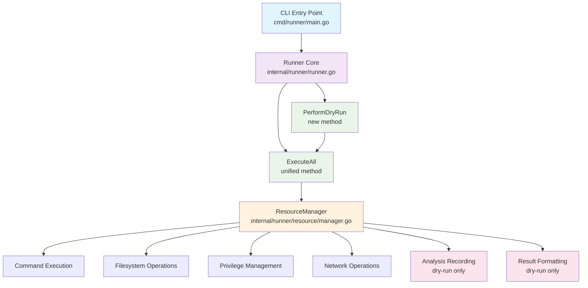
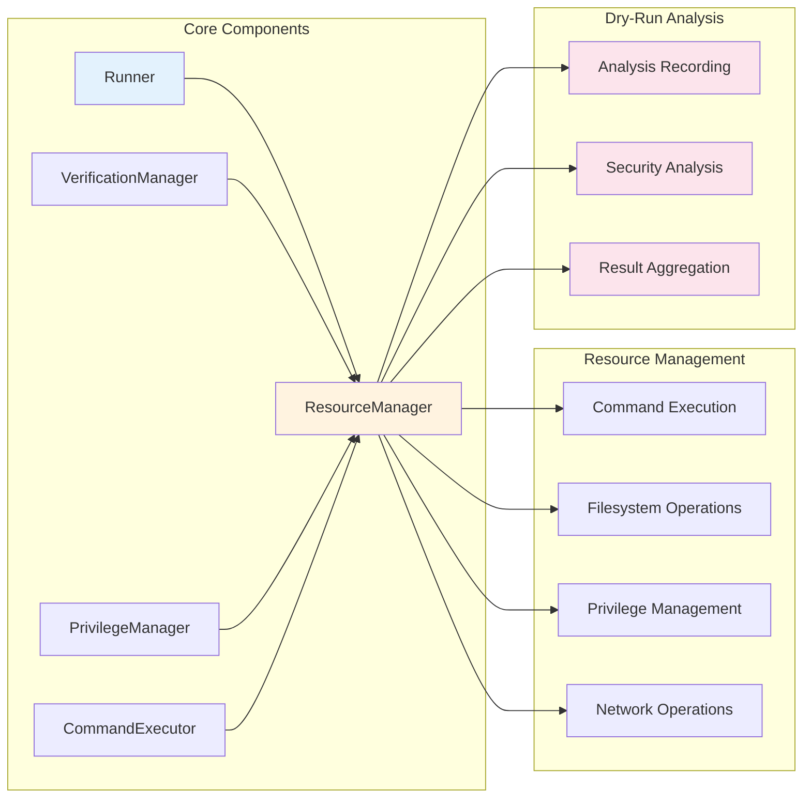

# アーキテクチャー設計書: リアリスティックなDry-Run機能

## 1. 概要

### 1.1 設計目標
- 既存のRunner実行フローを最大限活用し、実際の実行パスに近いdry-run機能を実現
- 副作用なしで詳細な実行計画と検証結果を提供
- 既存コードベースへの影響を最小限に抑制

### 1.2 設計原則
- **単一責任の原則**: dry-run専用のコンポーネントは分析・検証・出力のみを担当
- **開放閉鎖の原則**: 既存のRunnerインターフェースを拡張し、新機能を追加
- **依存性逆転の原則**: 抽象化されたインターフェースを通じて機能を実現

## 2. アーキテクチャー概要

### 2.1 全体構成



### 2.2 コンポーネント間の関係



**コンポーネントの役割:**
- **Runner**: 既存機能を保持しつつ、dry-run用の新しいメソッドを追加
- **ResourceManager**: すべての副作用を統一的に管理（実行モード切替でdry-run対応）
- **Analysis Recording**: dry-runモードでの詳細な分析情報記録

## 3. コンポーネント設計

### 3.1 Resource Manager Pattern

#### 3.1.1 統一された実行フロー
Resource Manager Patternにより、通常実行とdry-runの両方で同一の`ExecuteAll`メソッドを使用し、100%の実行パス整合性を保証します。

```go
type Runner struct {
    // existing fields...
    resourceManager ResourceManager  // 新規追加
}

// PerformDryRun performs a dry-run analysis using the same execution path
func (r *Runner) PerformDryRun(ctx context.Context, opts DryRunOptions) (*DryRunResult, error) {
    // ResourceManagerをdry-runモードに設定
    r.resourceManager.SetMode(ExecutionModeDryRun, &opts)

    // 通常実行と同じパスを実行（副作用のみインターセプト）
    err := r.ExecuteAll(ctx)
    if err != nil {
        return nil, fmt.Errorf("dry-run analysis failed: %w", err)
    }

    // 分析結果を取得
    return r.resourceManager.GetDryRunResults(), nil
}
```

#### 3.1.2 ResourceManager インターフェース
すべての副作用を統一的に管理するインターフェース（既実装済み）：

```go
type ResourceManager interface {
    // Mode management
    SetMode(mode ExecutionMode, opts *DryRunOptions)
    GetMode() ExecutionMode

    // Side effect operations (intercepted in dry-run mode)
    ExecuteCommand(ctx context.Context, cmd runnertypes.Command, group *runnertypes.CommandGroup, env map[string]string) (*ExecutionResult, error)
    CreateTempDir(groupName string) (string, error)
    CleanupTempDir(tempDirPath string) error
    WithPrivileges(ctx context.Context, fn func() error) error
    SendNotification(message string, details map[string]interface{}) error

    // Dry-run specific
    GetDryRunResults() *DryRunResult
    RecordAnalysis(analysis *ResourceAnalysis)
}
```

### 3.2 実装済み型システム

Resource Manager Patternにより、すべての型定義は`internal/runner/resource`パッケージに統合されています：

#### 3.2.1 ResourceAnalysis システム
```go
// 各副作用操作の詳細な分析情報
type ResourceAnalysis struct {
    Type        ResourceType           `json:"type"`        // command, filesystem, privilege, network, process
    Operation   ResourceOperation      `json:"operation"`   // create, delete, execute, escalate, send
    Target      string                 `json:"target"`      // 操作対象（コマンド、パス等）
    Parameters  map[string]interface{} `json:"parameters"`  // 操作パラメータ
    Impact      ResourceImpact         `json:"impact"`      // 操作の影響
    Timestamp   time.Time              `json:"timestamp"`   // 操作時刻
}
```

#### 3.2.2 DryRunResult システム
```go
// dry-run分析の完全な結果
type DryRunResult struct {
    Metadata         *ResultMetadata     `json:"metadata"`
    ExecutionPlan    *ExecutionPlan      `json:"execution_plan"`
    ResourceAnalyses []ResourceAnalysis  `json:"resource_analyses"`
    SecurityAnalysis *SecurityAnalysis   `json:"security_analysis"`
    EnvironmentInfo  *EnvironmentInfo    `json:"environment_info"`
    Errors          []DryRunError       `json:"errors"`
    Warnings        []DryRunWarning     `json:"warnings"`
}
```

#### 3.2.3 セキュリティ分析システム
```go
type SecurityAnalysis struct {
    Risks              []SecurityRisk      `json:"risks"`
    PrivilegeChanges   []PrivilegeChange   `json:"privilege_changes"`
    EnvironmentAccess  []EnvironmentAccess `json:"environment_access"`
    FileAccess         []FileAccess        `json:"file_access"`
}

type SecurityRisk struct {
    Level       RiskLevel `json:"level"`        // Low, Medium, High, Critical
    Type        RiskType  `json:"type"`         // PrivilegeEscalation, DataExposure, etc.
    Description string    `json:"description"`
    Command     string    `json:"command"`
    Group       string    `json:"group"`
    Mitigation  string    `json:"mitigation"`
}

type PrivilegeChange struct {
    Group       string `json:"group"`
    Command     string `json:"command"`
    FromUser    string `json:"from_user"`
    ToUser      string `json:"to_user"`
    Mechanism   string `json:"mechanism"`  // sudo, setuid, etc.
}
```

#### 3.3.3 検証結果
```go
type VerificationResults struct {
    ConfigVerification    *FileVerification    `json:"config_verification"`
    EnvironmentVerification *FileVerification  `json:"environment_verification"`
    GlobalVerification    *verification.Result `json:"global_verification"`
    Errors               []error               `json:"errors"`
}

type FileVerification struct {
    FilePath   string        `json:"file_path"`
    Verified   bool          `json:"verified"`
    HashValue  string        `json:"hash_value"`
    Algorithm  string        `json:"algorithm"`
    Duration   time.Duration `json:"duration"`
    Error      error         `json:"error,omitempty"`
}
```

### 3.4 DryRun Formatter

#### 3.4.1 フォーマッター構成
```go
// Formatter formats dry-run results for output
type Formatter interface {
    FormatResult(result *DryRunResult, opts FormatterOptions) (string, error)
    FormatSummary(result *DryRunResult) (string, error)
    FormatDetailed(result *DryRunResult) (string, error)
    FormatErrors(errors []error) (string, error)
}

type FormatterOptions struct {
    Format        OutputFormat  // Text, JSON, YAML
    DetailLevel   DetailLevel   // Summary, Detailed, Full
    ShowSensitive bool         // Show sensitive information (masked)
    ColorOutput   bool         // Use colored output for terminals
}
```

## 4. 実行フロー設計

### 4.1 統一実行フロー（Resource Manager Pattern）

```mermaid
flowchart TD
    A[CLI Flag Detection<br/>--dry-run or normal] --> B[Runner Initialization<br/>with ResourceManager]
    B --> C[Mode Setting<br/>ResourceManager.SetMode()]
    C --> D[ExecuteAll Method<br/>同一の実行パス]
    D --> E[Resource Operations<br/>through ResourceManager]

    E --> F{Execution Mode?}
    F -->|Normal| G[Actual Side Effects<br/>Command, File, Privilege, Network]
    F -->|Dry-Run| H[Simulated Operations<br/>+ Analysis Recording]

    G --> I[Normal Result]
    H --> J[Dry-Run Analysis Result<br/>GetDryRunResults()]

    J --> K[Result Formatting<br/>& Output]

    style A fill:#ffecb3
    style B fill:#c8e6c9
    style C fill:#e1bee7
    style D fill:#e8f5e8
    style E fill:#fff3e0
    style H fill:#fce4ec
    style J fill:#fce4ec
    style K fill:#f8bbd9
```

### 4.2 詳細実行パス

#### 4.2.1 実行パス統一の仕組み
Resource Manager Patternにより、通常実行とdry-runは完全に同じコードパスを通ります：

1. **初期化フェーズ**：
   - Runner初期化（既存）
   - ResourceManager初期化（新規）
   - モード設定（Normal/DryRun）

2. **実行フェーズ**：
   - `ExecuteAll` → `ExecuteGroup` → `executeCommandInGroup`（既存パス）
   - 全副作用がResourceManagerを経由
   - モードに応じて実際実行 or シミュレーション

3. **結果フェーズ**：
   - Normal: 既存の実行結果
   - Dry-Run: ResourceManagerが蓄積した分析結果

#### 4.2.2 副作用インターセプション
各副作用操作でResourceManagerが自動的に処理を分岐：

- **コマンド実行**: `ExecuteCommand()` → 実行 or 分析記録
- **ファイルシステム**: `CreateTempDir()` → 作成 or シミュレーション
- **特権管理**: `WithPrivileges()` → 昇格 or 分析記録
- **ネットワーク**: `SendNotification()` → 送信 or 分析記録

## 5. 既存コードとの統合

### 5.1 最小限の変更による統合
Resource Manager Patternにより、既存コードへの変更を最小限に抑えます：

```go
// Runner構造体への追加（最小限）
type Runner struct {
    // 既存フィールド（変更なし）
    config              *runnertypes.Config
    envVars             map[string]string
    validator           *security.Validator
    verificationManager *verification.Manager
    envFilter           *environment.Filter
    runID               string

    // 新規追加（1フィールドのみ）
    resourceManager     ResourceManager
}

// 既存メソッドは変更なし（内部でresourceManagerを使用するよう更新）
func (r *Runner) ExecuteAll(ctx context.Context) error {
    // 既存のロジック、ただし副作用はresourceManager経由
}

// 新規メソッド追加（シンプル）
func (r *Runner) PerformDryRun(ctx context.Context, opts DryRunOptions) (*DryRunResult, error) {
    r.resourceManager.SetMode(ExecutionModeDryRun, &opts)
    err := r.ExecuteAll(ctx)  // 同じパス実行
    if err != nil {
        return nil, err
    }
    return r.resourceManager.GetDryRunResults(), nil
}
```

### 5.2 既存インターフェース活用
ResourceManagerが既存コンポーネントを内部で活用：

- **CommandExecutor**: 通常実行時はそのまま使用
- **PrivilegeManager**: 通常実行時はそのまま使用
- **VerificationManager**: 両モードで共通使用
- **TempDirManager**: 通常実行時はそのまま使用

### 5.3 完全な後方互換性
- 既存のTOML設定ファイル形式：完全互換
- 既存のCLIインターフェース：変更なし
- 既存のAPI：変更なし

## 6. 設計の利点

### 6.1 Resource Manager Pattern の利点
- **完全な実行パス整合性**: 通常実行とdry-runで100%同じコードパス
- **包括的副作用管理**: すべての副作用を統一的にインターセプション
- **最小限のコード変更**: 既存機能への影響を最小化
- **拡張可能性**: 新しい副作用タイプの追加が容易

### 6.2 テスト戦略
- **統一テストケース**: 通常実行とdry-runで同じテストを使用可能
- **モード切替テスト**: ResourceManager.SetMode()でモード切替のテスト
- **副作用分離**: dry-runでは副作用なしの完全テスト実行

### 6.3 運用上の利点
- **一貫性保証**: 実行パスの乖離を構造的に防止
- **包括的分析**: 実行前にすべての副作用を事前分析
- **安全な検証**: 副作用なしの完全な事前検証

## 7. 実装状況

### 7.1 Phase 1 完了済み（Foundation）
✅ **ResourceManager インターフェース**: 完全実装済み
✅ **ExecutionMode と関連型**: 完全実装済み
✅ **ResourceAnalysis データ構造**: 完全実装済み
✅ **DryRunResult 型システム**: 完全実装済み
✅ **基本テストフレームワーク**: 完全実装済み
✅ **Lint 対応**: 完全対応済み

### 7.2 実装パッケージ構成
```
internal/runner/resource/
├── manager.go         # ResourceManager インターフェース定義
├── types.go          # 全型定義（DryRunResult, ResourceAnalysis等）
├── manager_test.go   # ResourceManager テスト
└── types_test.go     # 型システム テスト
```

### 7.3 次期実装（Phase 2以降）
- **DefaultResourceManager 実装**
- **Runner 統合**
- **CLI インターフェース追加**
- **フォーマッター実装**

## 8. 実行パス整合性保証

### 8.1 Resource Manager Pattern による保証
Resource Manager Patternにより、以下の方法で実行パス整合性を構造的に保証：

1. **同一実行パス**: `PerformDryRun()` → `ExecuteAll()` で通常実行と完全に同じパスを使用
2. **副作用インターセプション**: ResourceManager が全副作用を統一的に処理（実行 or シミュレーション）
3. **モード透過性**: 実行ロジックはモードを意識せず、ResourceManager が自動的に処理を分岐

### 8.2 実装上の保証メカニズム
- **統一インターフェース**: ResourceManager による全副作用の抽象化
- **実装の共有**: 通常実行とdry-runで同じコード実行
- **自動テスト**: 統一テストケースによる継続的な整合性検証

---

**Resource Manager Pattern採用により、従来のDryRunAnalyzer設計は不要となり、より簡潔で堅牢なアーキテクチャを実現しました。**
