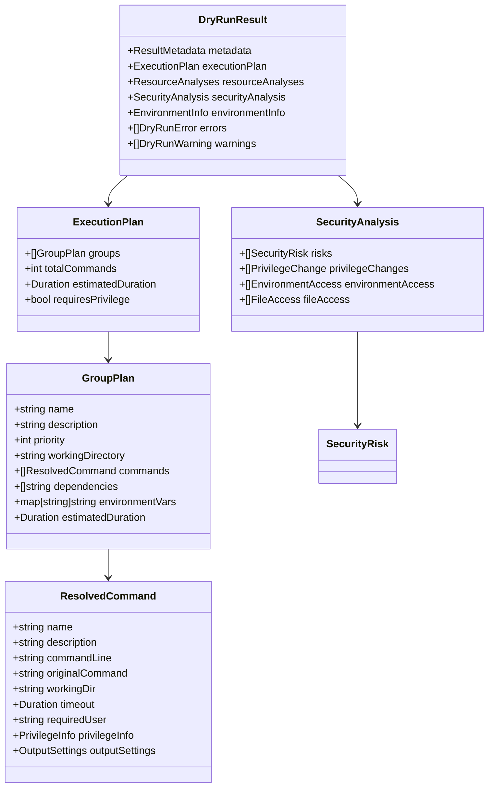
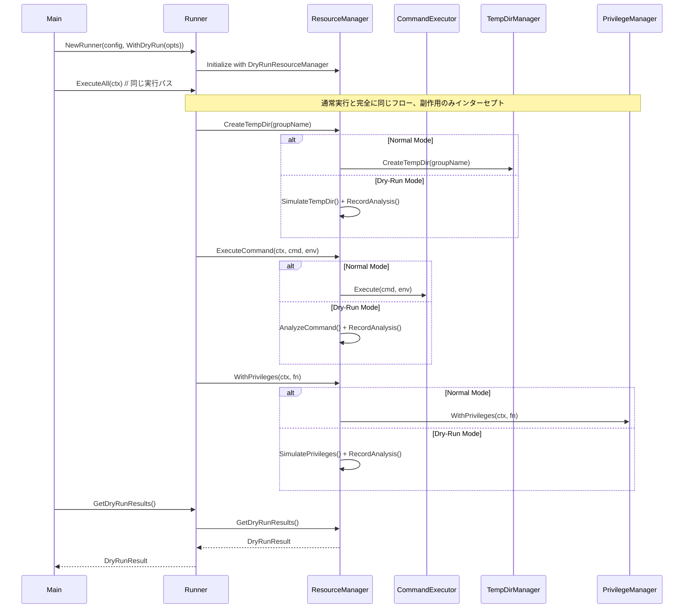

# 詳細仕様書: リアリスティックなDry-Run機能（Resource Manager Pattern）

## 1. API仕様

### 1.1 ResourceManager インターフェース（Phase 2実装完了）

#### 1.1.1 ResourceManager メイン仕様
```go
// ResourceManager manages all side-effects (commands, filesystem, privileges, etc.)
type ResourceManager interface {
    // Command execution
    ExecuteCommand(ctx context.Context, cmd runnertypes.Command, group *runnertypes.CommandGroup, env map[string]string) (*ExecutionResult, error)

    // Filesystem operations
    CreateTempDir(groupName string) (string, error)
    CleanupTempDir(tempDirPath string) error
    CleanupAllTempDirs() error

    // Privilege management
    WithPrivileges(ctx context.Context, fn func() error) error
    IsPrivilegeEscalationRequired(cmd runnertypes.Command) (bool, error)

    // Network operations
    SendNotification(message string, details map[string]any) error
}

// DryRunResourceManager extends ResourceManager with dry-run specific functionality
type DryRunResourceManager interface {
    ResourceManager

    // Dry-run specific
    GetDryRunResults() *DryRunResult
    RecordAnalysis(analysis *ResourceAnalysis)
}
```

#### 1.1.2 DefaultResourceManager（委譲パターンファサード）
```go
// DefaultResourceManager provides a mode-aware facade that delegates to
// NormalResourceManager or DryRunResourceManagerImpl depending on ExecutionMode.
type DefaultResourceManager struct {
    mode   ExecutionMode
    normal *NormalResourceManager
    dryrun *DryRunResourceManagerImpl
}

// 実行モードに応じた適切なマネージャへの委譲
func (d *DefaultResourceManager) activeManager() ResourceManager {
    if d.mode == ExecutionModeDryRun {
        return d.dryrun
    }
    return d.normal
}

// 現在のモード取得
func (d *DefaultResourceManager) GetMode() ExecutionMode { return d.mode }
```

#### 1.1.3 Runner拡張メソッド（Phase 3実装完了）

**GetDryRunResults メソッド**
```go
func (r *Runner) GetDryRunResults() *resource.DryRunResult
```

**戻り値:**
- `*resource.DryRunResult`: dry-runモードで実行された場合の分析結果（通常モードの場合はnil）

**WithDryRun オプション関数**
```go
func WithDryRun(dryRunOptions *resource.DryRunOptions) Option
```

**パラメータ:**
- `dryRunOptions *resource.DryRunOptions`: dry-run実行オプション

**用途:**
- Runner初期化時にdry-runモードを指定するためのオプション関数

**動作（初期化時ResourceManager選択パターン）:**
1. コマンドラインで`--dry-run`フラグが指定されると`WithDryRun`オプションが設定される
2. `NewRunner`初期化時に適切なResourceManager（DryRunResourceManagerまたはDefaultResourceManager）を選択
3. 通常実行と完全に同じ`ExecuteAll()`パスを実行
4. dry-runモードの場合、実行後に`GetDryRunResults()`で蓄積された分析結果を取得

**重要**: この設計により実行パスの100%整合性を保証

### 1.2 DryRunOptions 構造体

```go
type DryRunOptions struct {
    DetailLevel    DetailLevel    `json:"detail_level"`
    OutputFormat   OutputFormat   `json:"output_format"`
    ShowSensitive  bool          `json:"show_sensitive"`
    VerifyFiles    bool          `json:"verify_files"`
    ShowTimings    bool          `json:"show_timings"`
    ShowDependencies bool        `json:"show_dependencies"`
    MaxDepth       int           `json:"max_depth"`          // 変数展開の最大深度
}

type DetailLevel int
const (
    DetailLevelSummary DetailLevel = iota
    DetailLevelDetailed
    DetailLevelFull
)

type OutputFormat int
const (
    OutputFormatText OutputFormat = iota
    OutputFormatJSON
    OutputFormatYAML
)
```

### 1.3 ResourceAnalysis 構造体（既実装済み）

```go
type ResourceAnalysis struct {
    Type        ResourceType              `json:"type"`
    Operation   ResourceOperation         `json:"operation"`
    Target      string                   `json:"target"`
    Parameters  map[string]interface{}   `json:"parameters"`
    Impact      ResourceImpact           `json:"impact"`
    Timestamp   time.Time                `json:"timestamp"`
}

type ResourceType string
const (
    ResourceTypeCommand     ResourceType = "command"
    ResourceTypeFilesystem  ResourceType = "filesystem"
    ResourceTypePrivilege   ResourceType = "privilege"
    ResourceTypeNetwork     ResourceType = "network"
    ResourceTypeProcess     ResourceType = "process"
)

type ResourceOperation string
const (
    OperationCreate   ResourceOperation = "create"
    OperationDelete   ResourceOperation = "delete"
    OperationExecute  ResourceOperation = "execute"
    OperationEscalate ResourceOperation = "escalate"
    OperationSend     ResourceOperation = "send"
)

type ResourceImpact struct {
    Reversible   bool     `json:"reversible"`
    Persistent   bool     `json:"persistent"`
    SecurityRisk string   `json:"security_risk,omitempty"`
    Description  string   `json:"description"`
}
```

### 1.4 ExecutionResult 構造体（Phase 2実装完了）

```go
// ExecutionResult unified result for both normal and dry-run
type ExecutionResult struct {
    ExitCode int               `json:"exit_code"`
    Stdout   string            `json:"stdout"`
    Stderr   string            `json:"stderr"`
    Duration int64             `json:"duration_ms"` // Duration in milliseconds
    DryRun   bool              `json:"dry_run"`
    Analysis *ResourceAnalysis `json:"analysis,omitempty"`
}
```

**フィールド説明:**
- `ExitCode`: コマンドの終了コード（dry-runでは模擬値）
- `Stdout/Stderr`: 標準出力/エラー出力（dry-runでは空文字列）
- `Duration`: 実行時間（dry-runでは推定値）
- `DryRun`: dry-runモードかどうかの判別フラグ
- `Analysis`: dry-runモード時のリソース分析情報

### 1.5 DryRunResult 構造体（Phase 2実装完了）

```go
type DryRunResult struct {
    Metadata         *ResultMetadata      `json:"metadata"`
    ExecutionPlan    *ExecutionPlan       `json:"execution_plan"`
    ResourceAnalyses []ResourceAnalysis   `json:"resource_analyses"`
    SecurityAnalysis *SecurityAnalysis    `json:"security_analysis"`
    EnvironmentInfo  *EnvironmentInfo     `json:"environment_info"`
    Errors          []DryRunError        `json:"errors"`
    Warnings        []DryRunWarning      `json:"warnings"`
}

type ResultMetadata struct {
    GeneratedAt      time.Time     `json:"generated_at"`
    RunID           string        `json:"run_id"`
    ConfigPath      string        `json:"config_path"`
    EnvironmentFile string        `json:"environment_file"`
    Version         string        `json:"version"`
    Duration        time.Duration `json:"duration"`
}
```

### 1.4 主要データ構造の関係



## 2. コンポーネント詳細仕様

### 2.1 ResourceManager 実装（Phase 1完了済み、Phase 2以降で拡張予定）

#### 2.1.1 実装完了パッケージ構造
```
internal/runner/resource/         # ✅ Phase 1-2 完了
├── manager.go                  # ResourceManager インターフェース定義
├── types.go                    # 全型定義（DryRunResult, ResourceAnalysis等）
├── default_manager.go          # DefaultResourceManager 実装（委譲パターン）
├── normal_manager.go           # NormalResourceManager 実装（通常実行）
├── dryrun_manager.go          # DryRunResourceManagerImpl 実装（dry-run）
├── formatter.go               # 結果フォーマット実装（Text/JSON/YAML）
├── manager_test.go            # ResourceManager テスト
├── types_test.go              # 型システム テスト
├── default_manager_test.go    # DefaultResourceManager テスト
├── normal_manager_test.go     # NormalResourceManager テスト
├── dryrun_manager_test.go     # DryRunResourceManagerImpl テスト
└── testdata/                  # 詳細テストデータ
```

**Phase 1で完了した内容:**
- ResourceManager インターフェース完全定義
- ResourceAnalysis型システム
- DryRunResult型システム完全実装
- ExecutionMode, DetailLevel, OutputFormat等の列挙型
- 基本テストフレームワーク

**Phase 2で完了した内容:**
- DefaultResourceManager実装（委譲パターンファサード）
- NormalResourceManager実装（通常実行時の副作用処理）
- DryRunResourceManagerImpl実装（dry-run時の分析・記録）
- 結果フォーマッター実装（Text/JSON/YAML出力対応）
- 包括的テストスイート

#### 2.1.2 DefaultResourceManager 実装（Phase 2予定）

Resource Manager Patternの核となる実装：

**主要機能:**
1. **モード管理**: Normal/DryRunの動的切り替え
2. **副作用インターセプション**: 各副作用を適切に処理または分析
3. **分析結果蓄積**: dry-runモードでの詳細な操作記録
4. **既存コンポーネント活用**: 通常実行時は既存のExecutor等を使用

**実装方針:**
- ExecutionMode による条件分岐で実行/分析を切り替え
- dry-runモードでは全操作をResourceAnalysisとして記録
- 既存コンポーネント（CommandExecutor, TempDirManager等）への委譲

#### 2.1.3 Resource Manager Pattern 処理フロー



## 2. 実装フェーズと仕様

### 2.1 Phase 1: Foundation（完了済み）
✅ **ResourceManager インターフェース**: `internal/runner/resource/manager.go`
✅ **ExecutionMode 型システム**: Normal/DryRun切り替え
✅ **ResourceAnalysis データ構造**: 副作用操作の詳細記録
✅ **DryRunResult 型階層**: 完全な分析結果構造
✅ **基本テストフレームワーク**: 11テストケース
✅ **Lint対応**: revive警告抑制

### 2.2 Phase 2: DefaultResourceManager実装（完了済み）
✅ **DefaultResourceManager構造体**: 副作用の統一管理（`internal/runner/resource/default_manager.go`）
✅ **NormalResourceManager**: 通常実行時の副作用処理（`internal/runner/resource/normal_manager.go`）
✅ **DryRunResourceManagerImpl**: dry-run時の分析・記録（`internal/runner/resource/dryrun_manager.go`）
✅ **モード切り替えロジック**: Normal/DryRunの動的制御
✅ **副作用インターセプション**: 各操作の条件分岐実装
✅ **分析記録機能**: ResourceAnalysisの蓄積
✅ **結果フォーマッター**: Text/JSON/YAML出力対応（`internal/runner/resource/formatter.go`）

### 2.3 Phase 3: Runner統合（完了済み）
✅ **Runner構造体拡張**: resourceManagerフィールド追加
✅ **WithDryRun オプション関数**: dry-runモード指定
✅ **GetDryRunResults メソッド**: 分析結果取得
✅ **副作用メソッド更新**: 全てResourceManager経由に変更

### 2.4 Phase 4: CLIインターフェース（次期）
- **--dry-runフラグ**: コマンドラインオプション追加
- **ユーザーエクスペリエンス**: 進捗表示・エラー報告

## 3. テスト仕様

### 3.1 実行パス整合性テスト
Resource Manager Patternの最重要テスト項目：

```go
func TestExecutionPathConsistency(t *testing.T) {
    // 1. 通常実行準備段階とdry-run実行で同じ結果を得ることを検証
    // 2. 変数解決、特権分析、ファイル検証の整合性確認
    // 3. ResourceManagerのモード切り替えによる動作差分確認
}
```

### 3.2 副作用インターセプションテスト
```go
func TestSideEffectInterception(t *testing
