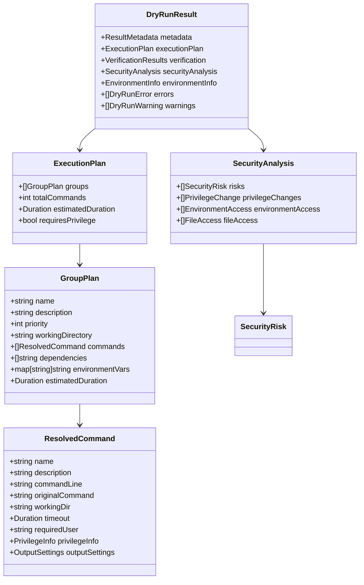
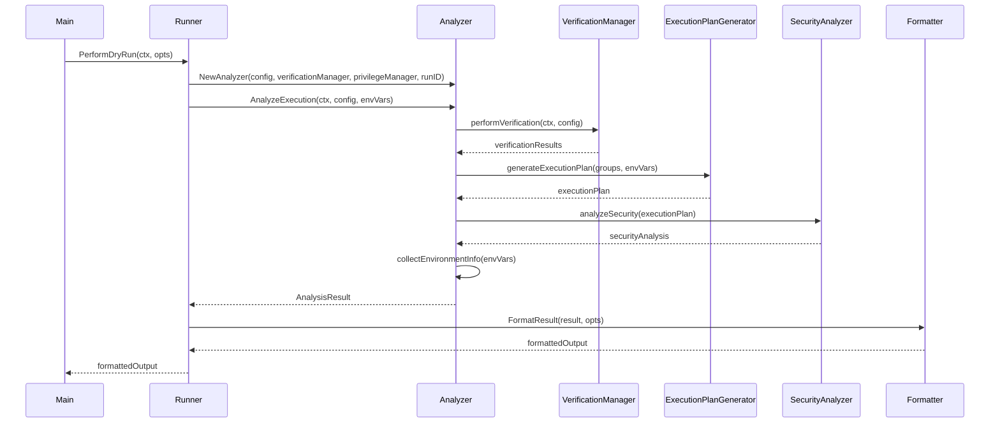

# 詳細仕様書: リアリスティックなDry-Run機能

## 1. API仕様

### 1.1 ResourceManager インターフェース

#### 1.1.1 ResourceManager メイン仕様
```go
type ResourceManager interface {
    // Mode management
    SetMode(mode ExecutionMode, opts *DryRunOptions)
    GetMode() ExecutionMode

    // Command execution
    ExecuteCommand(ctx context.Context, cmd runnertypes.Command, group *runnertypes.CommandGroup, env map[string]string) (*ExecutionResult, error)

    // Filesystem operations
    CreateTempDir(groupName string) (string, error)
    CleanupTempDir(tempDirPath string) error
    CleanupAllTempDirs() error

    // Privilege management
    WithPrivileges(ctx context.Context, fn func() error) error
    IsPrivilegeEscalationRequired(cmd runnertypes.Command) (bool, error)

    // Network operations
    SendNotification(message string, details map[string]interface{}) error

    // Dry-run specific
    GetDryRunResults() *DryRunResult
    RecordAnalysis(analysis *ResourceAnalysis)
}
```

#### 1.1.2 Runner拡張メソッド

**PerformDryRun メソッド**
```go
func (r *Runner) PerformDryRun(ctx context.Context, opts DryRunOptions) (*DryRunResult, error)
```

**パラメータ:**
- `ctx context.Context`: キャンセレーション用コンテキスト
- `opts DryRunOptions`: dry-run実行オプション

**戻り値:**
- `*DryRunResult`: 分析結果
- `error`: エラー情報

**動作:**
1. ResourceManagerをdry-runモードに設定
2. 通常実行と同じ`ExecuteAll()`パスを実行
3. すべての副作用をインターセプトして分析
4. 結果の構造化と返却

### 1.2 DryRunOptions 構造体

```go
type DryRunOptions struct {
    DetailLevel    DetailLevel    `json:"detail_level"`
    OutputFormat   OutputFormat   `json:"output_format"`
    ShowSensitive  bool          `json:"show_sensitive"`
    VerifyFiles    bool          `json:"verify_files"`
    ShowTimings    bool          `json:"show_timings"`
    ShowDependencies bool        `json:"show_dependencies"`
    MaxDepth       int           `json:"max_depth"`          // 変数展開の最大深度
}

type DetailLevel int
const (
    DetailLevelSummary DetailLevel = iota
    DetailLevelDetailed
    DetailLevelFull
)

type OutputFormat int
const (
    OutputFormatText OutputFormat = iota
    OutputFormatJSON
    OutputFormatYAML
)
```

### 1.3 ResourceAnalysis 構造体

```go
type ResourceAnalysis struct {
    Type        ResourceType              `json:"type"`
    Operation   ResourceOperation         `json:"operation"`
    Target      string                   `json:"target"`
    Parameters  map[string]interface{}   `json:"parameters"`
    Impact      ResourceImpact           `json:"impact"`
    Timestamp   time.Time                `json:"timestamp"`
}

type ResourceType string
const (
    ResourceTypeCommand     ResourceType = "command"
    ResourceTypeFilesystem  ResourceType = "filesystem"
    ResourceTypePrivilege   ResourceType = "privilege"
    ResourceTypeNetwork     ResourceType = "network"
    ResourceTypeProcess     ResourceType = "process"
)

type ResourceOperation string
const (
    OperationCreate   ResourceOperation = "create"
    OperationDelete   ResourceOperation = "delete"
    OperationExecute  ResourceOperation = "execute"
    OperationEscalate ResourceOperation = "escalate"
    OperationSend     ResourceOperation = "send"
)

type ResourceImpact struct {
    Reversible   bool     `json:"reversible"`
    Persistent   bool     `json:"persistent"`
    SecurityRisk string   `json:"security_risk,omitempty"`
    Description  string   `json:"description"`
}
```

### 1.4 DryRunResult 構造体

```go
type DryRunResult struct {
    Metadata         *ResultMetadata      `json:"metadata"`
    ExecutionPlan    *ExecutionPlan       `json:"execution_plan"`
    ResourceAnalyses []ResourceAnalysis   `json:"resource_analyses"`
    SecurityAnalysis *SecurityAnalysis    `json:"security_analysis"`
    EnvironmentInfo  *EnvironmentInfo     `json:"environment_info"`
    Errors          []DryRunError        `json:"errors"`
    Warnings        []DryRunWarning      `json:"warnings"`
}

type ResultMetadata struct {
    GeneratedAt      time.Time     `json:"generated_at"`
    RunID           string        `json:"run_id"`
    ConfigPath      string        `json:"config_path"`
    EnvironmentFile string        `json:"environment_file"`
    Version         string        `json:"version"`
    Duration        time.Duration `json:"duration"`
}
```

### 1.4 主要データ構造の関係



## 2. コンポーネント詳細仕様

### 2.1 ResourceManager 実装

#### 2.1.1 パッケージ構造
```
internal/runner/resource/
├── manager.go         # ResourceManager インターフェース定義
├── default_manager.go # DefaultResourceManager 実装
├── types.go          # ResourceAnalysis等の型定義
├── analysis.go       # 分析ロジック
└── testdata/         # テストデータ
    ├── configs/      # テスト用設定ファイル
    └── expected/     # 期待値ファイル

internal/runner/dryrun/
├── formatter.go      # 結果フォーマット
├── types.go         # DryRunResult等の型定義
├── errors.go        # エラー定義
└── testdata/        # テストデータ
```

#### 2.1.2 DefaultResourceManager 主要実装

```go
type DefaultResourceManager struct {
    mode             ExecutionMode
    dryRunOpts       *DryRunOptions

    // Delegated components
    executor         executor.CommandExecutor
    tempDirManager   *tempdir.TempDirManager
    privilegeManager runnertypes.PrivilegeManager

    // Dry-run state
    dryRunResult     *DryRunResult
    simulatedTempDirs map[string]string
    resourceAnalyses []ResourceAnalysis

    // Logging
    logger           *slog.Logger
    runID            string
}

func NewDefaultResourceManager(
    executor executor.CommandExecutor,
    tempDirManager *tempdir.TempDirManager,
    privilegeManager runnertypes.PrivilegeManager,
    runID string,
) ResourceManager {
    return &DefaultResourceManager{
        mode:             ExecutionModeNormal, // デフォルトは通常実行
        executor:         executor,
        tempDirManager:   tempDirManager,
        privilegeManager: privilegeManager,
        logger:           slog.Default(),
        runID:            runID,
        simulatedTempDirs: make(map[string]string),
    }
}

func (d *DefaultResourceManager) SetMode(mode ExecutionMode, opts *DryRunOptions) {
    d.mode = mode
    d.dryRunOpts = opts

    if mode == ExecutionModeDryRun {
        d.initializeDryRunState()
    }
}

func (d *DefaultResourceManager) initializeDryRunState() {
    d.dryRunResult = &DryRunResult{
        Metadata: &ResultMetadata{
            GeneratedAt: time.Now(),
            RunID:      d.runID,
        },
        ExecutionPlan:    &ExecutionPlan{Groups: []GroupPlan{}},
        ResourceAnalyses: []ResourceAnalysis{},
        SecurityAnalysis: &SecurityAnalysis{},
        Errors:          []DryRunError{},
        Warnings:        []DryRunWarning{},
    }
    d.resourceAnalyses = []ResourceAnalysis{}
    d.simulatedTempDirs = make(map[string]string)
}
```

#### 2.1.3 Analyzer処理フロー



### 2.2 実行計画生成 (ExecutionPlanGenerator)

#### 2.2.1 メイン実装

```go
type executionPlanGenerator struct {
    envFilter        *environment.Filter
    privilegeManager runnertypes.PrivilegeManager
    logger          *slog.Logger
}

func (e *executionPlanGenerator) GeneratePlan(groups []runnertypes.CommandGroup, envVars map[string]string) (*ExecutionPlan, error) {
    // 1. グループの優先度順ソート
    sortedGroups := e.sortGroupsByPriority(groups)

    // 2. 各グループの詳細計画生成
    groupPlans := make([]GroupPlan, 0, len(sortedGroups))
    totalCommands := 0
    totalDuration := time.Duration(0)
    requiresPrivilege := false

    for _, group := range sortedGroups {
        groupPlan, err := e.generateGroupPlan(group, envVars)
        if err != nil {
            return nil, fmt.Errorf("failed to generate plan for group %s: %w", group.Name, err)
        }

        groupPlans = append(groupPlans, *groupPlan)
        totalCommands += len(groupPlan.Commands)
        totalDuration += groupPlan.EstimatedDuration

        if groupPlan.RequiresPrivilege {
            requiresPrivilege = true
        }
    }

    return &ExecutionPlan{
        Groups:            groupPlans,
        TotalCommands:     totalCommands,
        EstimatedDuration: totalDuration,
        RequiresPrivilege: requiresPrivilege,
    }, nil
}

func (e *executionPlanGenerator) generateGroupPlan(group runnertypes.CommandGroup, envVars map[string]string) (*GroupPlan, error) {
    resolvedCommands := make([]ResolvedCommand, 0, len(group.Commands))
    groupDuration := time.Duration(0)
    requiresPrivilege := false

    // グループレベルの環境変数をマージ
    groupEnvVars := e.mergeEnvironmentVars(envVars, group.Environment)

    for _, cmd := range group.Commands {
        resolvedCmd, err := e.resolveCommand(cmd, groupEnvVars, &group)
        if err != nil {
            return nil, fmt.Errorf("failed to resolve command %s: %w", cmd.Name, err)
        }

        resolvedCommands = append(resolvedCommands, *resolvedCmd)
        groupDuration += resolvedCmd.Timeout

        if resolvedCmd.PrivilegeInfo.RequiresPrivilege {
            requiresPrivilege = true
        }
    }

    return &GroupPlan{
        Name:              group.Name,
        Description:       group.Description,
        Priority:          group.Priority,
        WorkingDirectory:  group.WorkingDirectory,
        Commands:          resolvedCommands,
        Dependencies:      group.Dependencies,
        EnvironmentVars:   groupEnvVars,
        EstimatedDuration: groupDuration,
        RequiresPrivilege: requiresPrivilege,
    }, nil
}
```

#### 2.2.2 コマンド解決

```go
func (e *executionPlanGenerator) resolveCommand(cmd runnertypes.Command, envVars map[string]string, group *runnertypes.CommandGroup) (*ResolvedCommand, error) {
    // 1. 環境変数展開
    resolvedCommandLine, err := e.resolveVariables(cmd.Command, envVars, group)
    if err != nil {
        return nil, fmt.Errorf("variable resolution failed: %w", err)
    }

    // 2. 特権要件分析
    privilegeInfo, err := e.analyzePrivilegeRequirements(cmd, resolvedCommandLine)
    if err != nil {
        return nil, fmt.Errorf("privilege analysis failed: %w", err)
    }

    // 3. 作業ディレクトリ解決
    workingDir := cmd.WorkingDirectory
    if workingDir == "" {
        workingDir = group.WorkingDirectory
    }

    // 4. タイムアウト設定
    timeout := time.Duration(cmd.Timeout) * time.Second
    if timeout == 0 {
        timeout = 30 * time.Second // デフォルト値
    }

    return &ResolvedCommand{
        Name:            cmd.Name,
        Description:     cmd.Description,
        CommandLine:     resolvedCommandLine,
        OriginalCommand: cmd.Command,
        WorkingDir:      workingDir,
        Timeout:         timeout,
        RequiredUser:    privilegeInfo.TargetUser,
        PrivilegeInfo:   privilegeInfo,
        OutputSettings:  OutputSettings{
            CaptureStdout: cmd.CaptureOutput,
            CaptureStderr: cmd.CaptureOutput,
        },
    }, nil
}

func (e *executionPlanGenerator) resolveVariables(command string, envVars map[string]string, group *runnertypes.CommandGroup) (string, error) {
    resolved := command
    resolving := make(map[string]bool)
    maxIterations := 100

    for i := 0; i < maxIterations && strings.Contains(resolved, "${"); i++ {
        start := strings.Index(resolved, "${")
        if start == -1 {
            break
        }

        end := strings.Index(resolved[start:], "}")
        if end == -1 {
            return "", fmt.Errorf("unclosed variable reference in: %s", command)
        }
        end += start

        varName := resolved[start+2 : end]

        // 循環参照チェック
        if resolving[varName] {
            return "", fmt.Errorf("circular reference detected: %s", varName)
        }

        // 環境変数アクセス権限チェック
        if !e.envFilter.IsVariableAccessAllowed(varName, group) {
            return "", fmt.Errorf("variable access denied: %s (group: %s)", varName, group.Name)
        }

        varValue, exists := envVars[varName]
        if !exists {
            return "", fmt.Errorf("undefined variable: %s", varName)
        }

        resolving[varName] = true
        resolved = resolved[:start] + varValue + resolved[end+1:]
        delete(resolving, varName)
    }

    if strings.Contains(resolved, "${") {
        return "", fmt.Errorf("maximum resolution iterations exceeded")
    }

    return resolved, nil
}
```

### 2.3 セキュリティ分析 (SecurityAnalyzer)

#### 2.3.1 メイン実装

```go
type securityAnalyzer struct {
    privilegeManager runnertypes.PrivilegeManager
    logger          *slog.Logger
}

func (s *securityAnalyzer) AnalyzeCommands(plan *ExecutionPlan) (*SecurityAnalysis, error) {
    risks := []SecurityRisk{}
    privilegeChanges := []PrivilegeChange{}
    environmentAccess := []EnvironmentAccess{}
    fileAccess := []FileAccess{}

    for _, group := range plan.Groups {
        // グループレベルの分析
        groupRisks, err := s.analyzeGroup(group)
        if err != nil {
            return nil, fmt.Errorf("failed to analyze group %s: %w", group.Name, err)
        }
        risks = append(risks, groupRisks...)

        // コマンドレベルの分析
        for _, cmd := range group.Commands {
            cmdRisks, err := s.analyzeCommand(cmd, group)
            if err != nil {
                return nil, fmt.Errorf("failed to analyze command %s: %w", cmd.Name, err)
            }
            risks = append(risks, cmdRisks...)

            // 特権変更の記録
            if cmd.PrivilegeInfo.RequiresPrivilege {
                privilegeChanges = append(privilegeChanges, PrivilegeChange{
                    Group:     group.Name,
                    Command:   cmd.Name,
                    FromUser:  "current",
                    ToUser:    cmd.PrivilegeInfo.TargetUser,
                    Mechanism: "sudo", // 現在はsudoのみサポート
                })
            }

            // 環境変数アクセスの記録
            envAccess := s.extractEnvironmentAccess(cmd, group)
            environmentAccess = append(environmentAccess, envAccess...)

            // ファイルアクセスの記録
            fileAccess = append(fileAccess, s.extractFileAccess(cmd, group)...)
        }
    }

    return &SecurityAnalysis{
        Risks:             risks,
        PrivilegeChanges:  privilegeChanges,
        EnvironmentAccess: environmentAccess,
        FileAccess:        fileAccess,
    }, nil
}

func (s *securityAnalyzer) analyzeCommand(cmd ResolvedCommand, group GroupPlan) ([]SecurityRisk, error) {
    risks := []SecurityRisk{}

    // 1. 特権昇格リスク
    if cmd.PrivilegeInfo.RequiresPrivilege {
        risk := SecurityRisk{
            Level:       RiskLevelMedium,
            Type:        RiskTypePrivilegeEscalation,
            Description: fmt.Sprintf("Command requires privilege escalation to %s", cmd.PrivilegeInfo.TargetUser),
            Command:     cmd.Name,
            Group:       group.Name,
            Mitigation:  "Ensure sudo configuration is properly restricted",
        }

        if cmd.PrivilegeInfo.TargetUser == "root" {
            risk.Level = RiskLevelHigh
        }

        risks = append(risks, risk)
    }

    // 2. 危険なコマンドパターン検出
    dangerousPatterns := []struct {
        pattern     *regexp.Regexp
        level       RiskLevel
        description string
    }{
        {regexp.MustCompile(`rm\s+.*-rf?\s+/`), RiskLevelCritical, "Recursive deletion of system directories"},
        {regexp.MustCompile(`chmod\s+777`), RiskLevelHigh, "Setting world-writable permissions"},
        {regexp.MustCompile(`curl.*\|\s*(sh|bash)`), RiskLevelHigh, "Downloading and executing remote scripts"},
        {regexp.MustCompile(`wget.*\|\s*(sh|bash)`), RiskLevelHigh, "Downloading and executing remote scripts"},
    }

    for _, pattern := range dangerousPatterns {
        if pattern.pattern.MatchString(cmd.CommandLine) {
            risks = append(risks, SecurityRisk{
                Level:       pattern.level,
                Type:        RiskTypeDangerousCommand,
                Description: pattern.description,
                Command:     cmd.Name,
                Group:       group.Name,
                Mitigation:  "Review command carefully and consider safer alternatives",
            })
        }
    }

    return risks, nil
}
```

### 2.4 フォーマッター (Formatter)

#### 2.4.1 テキストフォーマッター

```go
type textFormatter struct {
    opts FormatterOptions
}

func (f *textFormatter) FormatResult(result *DryRunResult, opts FormatterOptions) (string, error) {
    var buf strings.Builder

    // 1. ヘッダー情報
    f.writeHeader(&buf, result.Metadata)

    // 2. サマリー情報
    f.writeSummary(&buf, result)

    // 3. 検証結果
    if result.Verification != nil {
        f.writeVerificationResults(&buf, result.Verification)
    }

    // 4. 実行計画
    if opts.DetailLevel >= DetailLevelDetailed {
        f.writeExecutionPlan(&buf, result.ExecutionPlan, opts)
    }

    // 5. セキュリティ分析
    if result.SecurityAnalysis != nil {
        f.writeSecurityAnalysis(&buf, result.SecurityAnalysis, opts)
    }

    // 6. エラーと警告
    if len(result.Errors) > 0 || len(result.Warnings) > 0 {
        f.writeErrorsAndWarnings(&buf, result.Errors, result.Warnings)
    }

    return buf.String(), nil
}

func (f *textFormatter) writeSummary(buf *strings.Builder, result *DryRunResult) {
    buf.WriteString("═══════════════════════════════════════════════════════════════\n")
    buf.WriteString("                     EXECUTION SUMMARY\n")
    buf.WriteString("═══════════════════════════════════════════════════════════════\n")

    if result.ExecutionPlan != nil {
        buf.WriteString(fmt.Sprintf("Total Groups:         %d\n", len(result.ExecutionPlan.Groups)))
        buf.WriteString(fmt.Sprintf("Total Commands:       %d\n", result.ExecutionPlan.TotalCommands))
        buf.WriteString(fmt.Sprintf("Estimated Duration:   %v\n", result.ExecutionPlan.EstimatedDuration))
        buf.WriteString(fmt.Sprintf("Requires Privilege:   %v\n", result.ExecutionPlan.RequiresPrivilege))
    }

    if result.SecurityAnalysis != nil {
        highRisks := 0
        for _, risk := range result.SecurityAnalysis.Risks {
            if risk.Level >= RiskLevelHigh {
                highRisks++
            }
        }
        buf.WriteString(fmt.Sprintf("Security Risks:       %d total (%d high/critical)\n", len(result.SecurityAnalysis.Risks), highRisks))
    }

    buf.WriteString("\n")
}

func (f *textFormatter) writeExecutionPlan(buf *strings.Builder, plan *ExecutionPlan, opts FormatterOptions) {
    buf.WriteString("═══════════════════════════════════════════════════════════════\n")
    buf.WriteString("                    EXECUTION PLAN\n")
    buf.WriteString("═══════════════════════════════════════════════════════════════\n")

    for i, group := range plan.Groups {
        buf.WriteString(fmt.Sprintf("\n[%d] Group: %s (Priority: %d)\n", i+1, group.Name, group.Priority))

        if group.Description != "" {
            buf.WriteString(fmt.Sprintf("    Description: %s\n", group.Description))
        }

        buf.WriteString(fmt.Sprintf("    Working Directory: %s\n", group.WorkingDirectory))
        buf.WriteString(fmt.Sprintf("    Commands: %d\n", len(group.Commands)))
        buf.WriteString(fmt.Sprintf("    Estimated Duration: %v\n", group.EstimatedDuration))

        if opts.DetailLevel >= DetailLevelFull {
            f.writeGroupCommands(buf, group, opts)
            f.writeGroupEnvironment(buf, group, opts)
        }

        buf.WriteString("\n")
    }
}

func (f *textFormatter) writeGroupCommands(buf *strings.Builder, group GroupPlan, opts FormatterOptions) {
    buf.WriteString("\n    Commands:\n")

    for j, cmd := range group.Commands {
        buf.WriteString(fmt.Sprintf("      [%d.%d] %s\n", group.Priority, j+1, cmd.Name))

        if cmd.Description != "" {
            buf.WriteString(fmt.Sprintf("           Description: %s\n", cmd.Description))
        }

        buf.WriteString(fmt.Sprintf("           Command: %s\n", cmd.CommandLine))
        buf.WriteString(fmt.Sprintf("           Working Dir: %s\n", cmd.WorkingDir))
        buf.WriteString(fmt.Sprintf("           Timeout: %v\n", cmd.Timeout))

        if cmd.PrivilegeInfo.RequiresPrivilege {
            buf.WriteString(fmt.Sprintf("           ⚠️  Requires privilege escalation to: %s\n", cmd.PrivilegeInfo.TargetUser))
        }

        buf.WriteString("\n")
    }
}
```

## 3. エラーハンドリング仕様

### 3.1 エラー型定義

```go
type DryRunError struct {
    Type        ErrorType     `json:"type"`
    Code        string        `json:"code"`
    Message     string        `json:"message"`
    Component   string        `json:"component"`
    Group       string        `json:"group,omitempty"`
    Command     string        `json:"command,omitempty"`
    Details     interface{}   `json:"details,omitempty"`
    Recoverable bool          `json:"recoverable"`
}

type ErrorType string
const (
    ErrorTypeConfigurationError ErrorType = "configuration_error"
    ErrorTypeVerificationError  ErrorType = "verification_error"
    ErrorTypeVariableError      ErrorType = "variable_error"
    ErrorTypeSecurityError      ErrorType = "security_error"
    ErrorTypeSystemError        ErrorType = "system_error"
)

type DryRunWarning struct {
    Type      WarningType `json:"type"`
    Message   string      `json:"message"`
    Component string      `json:"component"`
    Group     string      `json:"group,omitempty"`
    Command   string      `json:"command,omitempty"`
}

type WarningType string
const (
    WarningTypeDeprecatedFeature WarningType = "deprecated_feature"
    WarningTypeSecurityConcern   WarningType = "security_concern"
    WarningTypePerformanceConcern WarningType = "performance_concern"
    WarningTypeCompatibility     WarningType = "compatibility"
)
```

### 3.2 エラー処理方針

1. **継続可能エラー**: 可能な限り処理を続行し、最終的にまとめて報告
2. **致命的エラー**: 即座に処理を停止し、詳細なエラー情報を提供
3. **警告**: 処理は継続するが、ユーザーに注意を促す

## 4. テスト仕様

### 4.1 テスト構造

```
internal/runner/dryrun/
├── analyzer_test.go
├── execution_plan_test.go
├── security_test.go
├── verification_test.go
├── formatter_test.go
└── integration_test.go
```

### 4.2 テストケース分類

#### 4.2.1 単体テスト
- 各コンポーネントの独立機能テスト
- 正常系・異常系の網羅
- エッジケースの処理確認

#### 4.2.2 統合テスト
- コンポーネント間の連携テスト
- エンドツーエンドのワークフローテスト
- パフォーマンステスト

#### 4.2.3 実行パス整合性テスト
通常実行パスとdry-run実行パスの整合性を保証するための専用テスト。

```go
package dryrun_test

import (
    "context"
    "testing"
    "time"

    "github.com/isseis/go-safe-cmd-runner/internal/runner"
    "github.com/isseis/go-safe-cmd-runner/internal/runner/dryrun"
)

// PathConsistencyTestSuite は実行パスの整合性をテストする
type PathConsistencyTestSuite struct {
    configPath string
    envFile    string
    runner     *runner.Runner
}

func TestVariableResolutionConsistency(t *testing.T) {
    tests := []struct {
        name           string
        config         string
        envVars        map[string]string
        expectedResult map[string]string
    }{
        {
            name: "basic variable resolution",
            config: `
                [[groups]]
                name = "test"
                [[groups.commands]]
                name = "echo"
                command = "echo ${MESSAGE}"
            `,
            envVars: map[string]string{"MESSAGE": "hello"},
            expectedResult: map[string]string{"echo": "echo hello"},
        },
        {
            name: "nested variable resolution",
            config: `
                [[groups]]
                name = "test"
                [[groups.commands]]
                name = "complex"
                command = "${CMD} ${ARG1} ${ARG2}"
            `,
            envVars: map[string]string{
                "CMD": "docker",
                "ARG1": "run",
                "ARG2": "${IMAGE}",
                "IMAGE": "nginx:latest",
            },
            expectedResult: map[string]string{
                "complex": "docker run nginx:latest",
            },
        },
    }

    for _, tt := range tests {
        t.Run(tt.name, func(t *testing.T) {
            // 1. 通常実行の準備段階でのコマンド解決
            normalRunner := setupRunner(t, tt.config, tt.envVars)
            normalCommands := extractResolvedCommands(t, normalRunner)

            // 2. dry-run実行での同じコマンド解決
            dryRunResult, err := normalRunner.PerformDryRun(context.Background(), dryrun.DryRunOptions{})
            require.NoError(t, err)
            dryRunCommands := extractDryRunCommands(dryRunResult)

            // 3. 結果の比較
            for cmdName, expectedCmd := range tt.expectedResult {
                normalCmd := normalCommands[cmdName]
                dryRunCmd := dryRunCommands[cmdName]

                assert.Equal(t, expectedCmd, normalCmd, "normal execution command resolution mismatch")
                assert.Equal(t, expectedCmd, dryRunCmd, "dry-run command resolution mismatch")
                assert.Equal(t, normalCmd, dryRunCmd, "normal and dry-run command resolution mismatch")
            }
        })
    }
}

func TestPrivilegeAnalysisConsistency(t *testing.T) {
    tests := []struct {
        name             string
        config           string
        expectedPrivileged []string
    }{
        {
            name: "sudo command detection",
            config: `
                [[groups]]
                name = "admin"
                [[groups.commands]]
                name = "install"
                command = "sudo apt-get install nginx"

                [[groups.commands]]
                name = "normal"
                command = "echo hello"
            `,
            expectedPrivileged: []string{"install"},
        },
    }

    for _, tt := range tests {
        t.Run(tt.name, func(t *testing.T) {
            runner := setupRunner(t, tt.config, nil)

            // 通常実行での特権分析
            normalPrivileged := analyzePrivilegesInNormalPath(t, runner)

            // dry-run実行での特権分析
            dryRunResult, err := runner.PerformDryRun(context.Background(), dryrun.DryRunOptions{})
            require.NoError(t, err)
            dryRunPrivileged := extractPrivilegedCommands(dryRunResult)

            // 結果の比較
            assert.ElementsMatch(t, tt.expectedPrivileged, normalPrivileged)
            assert.ElementsMatch(t, tt.expectedPrivileged, dryRunPrivileged)
            assert.ElementsMatch(t, normalPrivileged, dryRunPrivileged)
        })
    }
}

func TestFileVerificationConsistency(t *testing.T) {
    // ファイル検証プロセスの整合性テスト
    runner := setupRunnerWithFiles(t, "testdata/config.toml", "testdata/.env")

    // 通常実行での検証プロセス
    normalVerification := performNormalVerification(t, runner)

    // dry-run実行での検証プロセス
    dryRunResult, err := runner.PerformDryRun(context.Background(), dryrun.DryRunOptions{})
    require.NoError(t, err)

    // 検証結果の比較
    assert.Equal(t, normalVerification.ConfigHash, dryRunResult.Verification.ConfigVerification.HashValue)
    assert.Equal(t, normalVerification.EnvHash, dryRunResult.Verification.EnvironmentVerification.HashValue)
    assert.Equal(t, normalVerification.GlobalFiles, dryRunResult.Verification.GlobalVerification.VerifiedFiles)
}

// ベンチマークテスト: 通常実行準備段階とdry-runの性能比較
func BenchmarkExecutionPathPerformance(b *testing.B) {
    runner := setupLargeConfigRunner(b)

    b.Run("Normal Execution Preparation", func(b *testing.B) {
        for i := 0; i < b.N; i++ {
            performNormalExecutionPreparation(runner)
        }
    })

    b.Run("DryRun Analysis", func(b *testing.B) {
        for i := 0; i < b.N; i++ {
            runner.PerformDryRun(context.Background(), dryrun.DryRunOptions{})
        }
    })
}

// 継続的統合用テスト
func TestConsistencyAcrossVersions(t *testing.T) {
    // 異なる設定バージョンでの整合性テスト
    configVersions := []string{"v1.0", "v1.1", "v1.2"}

    for _, version := range configVersions {
        t.Run(version, func(t *testing.T) {
            config := loadConfigForVersion(t, version)
            runner := setupRunner(t, config, nil)

            // 通常実行とdry-runの整合性確認
            assertExecutionPathConsistency(t, runner)
        })
    }
}
```

#### 4.2.4 特殊テスト
- 大規模設定ファイルでのテスト
- 循環参照検出テスト
- セキュリティリスク検出テスト

## 5. パフォーマンス要件

### 5.1 実行時間
- 小規模設定（10グループ、50コマンド）: 1秒以内
- 中規模設定（50グループ、250コマンド）: 5秒以内
- 大規模設定（100グループ、500コマンド）: 10秒以内

### 5.2 メモリ使用量
- 実際の実行時の50%以下を維持
- 不要なデータの早期解放
- ストリーミング処理の活用

### 5.3 最適化ポイント
- 並列処理可能な箇所の特定
- キャッシュ機構の実装
- プログレス表示の実装

## 6. セキュリティ要件

### 6.1 機密情報保護
- 環境変数値の自動マスキング
- パスワード・トークン等の検出と隠蔽
- ログ出力時の機密情報除去

### 6.2 アクセス制御
- ファイル読み取り権限の最小化
- プロセス権限の適切な管理
- 一時ファイルの安全な処理

### 6.3 セキュリティ分析精度
- 既知の危険パターンの検出
- 特権昇格要件の正確な分析
- 偽陽性の最小化
