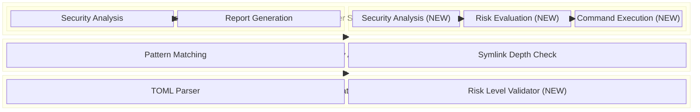
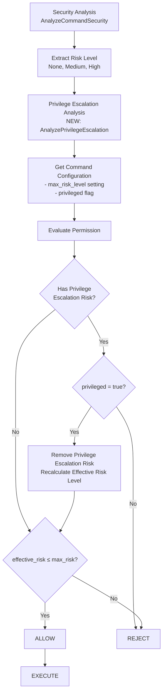
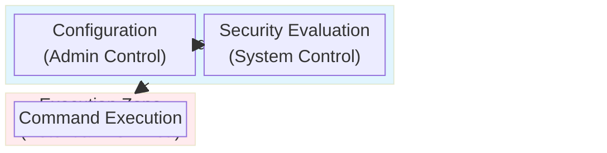
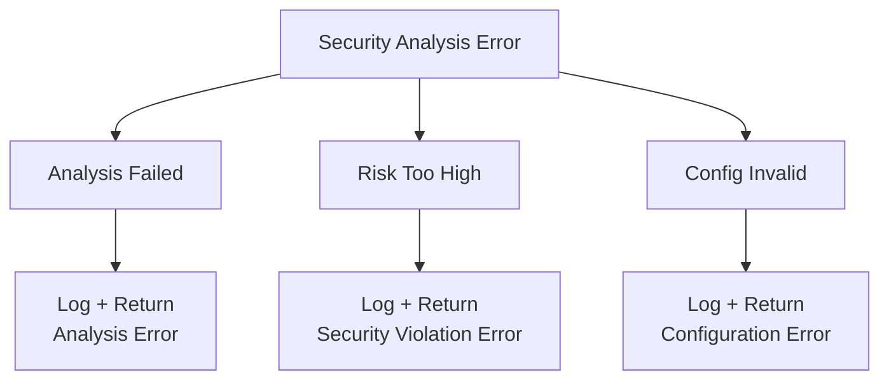

# アーキテクチャ設計書: Normal Mode リスクベースコマンド制御

## 1. システム概要

### 1.1 目的
Normal execution mode でのコマンド実行時にセキュリティ分析を統合し、リスクベースでコマンド実行を制御するシステム。バッチ処理環境での自動化されたセキュリティ制御を実現する。

### 1.2 設計原則
- **Security by Default**: デフォルトで最も安全な設定とし、危険な操作には明示的な許可が必要
- **Non-Interactive**: バッチ処理に最適化し、対話的な確認は行わない
- **Backward Compatibility**: 既存の設定ファイルとの互換性を維持
- **Separation of Concerns**: セキュリティ分析と実行制御を明確に分離

## 2. システムアーキテクチャ

### 2.1 全体構成図



### 2.2 コンポーネント構成

#### 2.2.1 既存コンポーネント（拡張）
- **Security Analysis Engine** (`internal/runner/security/`)
  - 危険コマンドパターンの検出
  - シンボリックリンク深度チェック
  - リスクレベル判定

- **Normal Mode Manager** (`internal/runner/resource/normal_manager.go`)
  - セキュリティ分析の統合（NEW）
  - リスクベース実行制御（NEW）

- **Configuration** (`internal/runner/config/`)
  - `max_risk_level` フィールドの追加（NEW）
  - 設定値の検証（NEW）

#### 2.2.2 新規コンポーネント
- **Risk Evaluator**: セキュリティ分析結果と設定値を照合し実行可否を判定
- **Privilege Escalation Analyzer**: 特権昇格リスクの詳細分析（NEW）
- **Security Error Types**: セキュリティ違反時の専用エラー型

## 3. データフロー

### 3.1 Normal Mode でのコマンド実行フロー


### 3.2 リスク評価フロー



**特権昇格リスク分析:** システムは以下の段階でコマンドの特権昇格リスクを詳細に分析します：
1. **パターンベース検出**: `sudo`, `su`, `systemctl` などの特権昇格コマンドを検出
2. **コンテキスト分析**: 実行ユーザーと対象操作の権限レベルを比較
3. **リスク分類**: 特権昇格リスクを他のセキュリティリスクから分離
4. **条件付き許可**: `privileged = true`フラグによる特権昇格リスクの除外

## 4. インターフェース設計

### 4.1 Privilege Escalation Analyzer Interface

```go
type PrivilegeEscalationAnalyzer interface {
    AnalyzePrivilegeEscalation(cmdName string, args []string) (*PrivilegeEscalationResult, error)
    IsPrivilegeEscalationCommand(cmdName string) bool
    GetRequiredPrivileges(cmdName string, args []string) ([]string, error)
}

type PrivilegeEscalationResult struct {
    HasPrivilegeEscalation bool
    EscalationType         PrivilegeEscalationType
    RequiredPrivileges     []string
    RiskLevel             security.RiskLevel
    Description           string
}

type PrivilegeEscalationType int

const (
    PrivilegeEscalationNone PrivilegeEscalationType = iota
    PrivilegeEscalationSudo    // sudo command
    PrivilegeEscalationSu      // su command
    PrivilegeEscalationSystemd // systemctl/systemd operations
    PrivilegeEscalationService // service management
    PrivilegeEscalationOther   // other privilege escalation
)
```

### 4.2 Risk Evaluator Interface

```go
type RiskEvaluator interface {
    EvaluateCommandExecution(
        riskLevel security.RiskLevel,
        detectedPattern string,
        reason string,
        privilegeResult *PrivilegeEscalationResult,
        command *config.Command,
    ) error
}

type SecurityViolationError struct {
    Command         string
    DetectedRisk    string
    DetectedPattern string
    RequiredSetting string
    CommandPath     string
    RunID           string
}
```

### 4.3 Enhanced Command Configuration

```go
type Command struct {
    Name         string   `toml:"name"`
    Description  string   `toml:"description"`
    Cmd          string   `toml:"cmd"`
    Args         []string `toml:"args"`
    MaxRiskLevel string   `toml:"max_risk_level"` // NEW
    Privileged   bool     `toml:"privileged"`     // EXISTING
    // ... other existing fields
}
```

### 4.4 Normal Manager Enhanced Interface

```go
type NormalResourceManager struct {
    executor             CommandExecutor
    outputWriter         OutputWriter
    evaluator            RiskEvaluator               // NEW
    privilegeAnalyzer    PrivilegeEscalationAnalyzer // NEW
}

func (m *NormalResourceManager) ExecuteCommand(
    command *config.Command,
    env map[string]string,
) (*ExecutionResult, error) {
    // 1. Security Analysis (NEW)
    riskLevel, detectedPattern, reason := security.AnalyzeCommandSecurity(command.Cmd, command.Args)

    // 2. Privilege Escalation Analysis (NEW)
    privilegeResult, err := m.privilegeAnalyzer.AnalyzePrivilegeEscalation(command.Cmd, command.Args)
    if err != nil {
        return nil, fmt.Errorf("privilege escalation analysis failed: %w", err)
    }

    // 3. Risk Evaluation (NEW)
    // privileged=true flag can exclude privilege escalation risks
    // Other security risks are still evaluated against max_risk_level
    if err := m.evaluator.EvaluateCommandExecution(riskLevel, detectedPattern, reason, privilegeResult, command); err != nil {
        return nil, err
    }

    // 4. Execute (EXISTING)
    return m.executor.Execute(command, env)
}
```

## 5. セキュリティ設計

### 5.1 セキュリティ境界



### 5.2 セキュリティ制御ポイント

1. **Configuration Validation**
   - `max_risk_level` の値検証
   - 不正な設定値の拒否

2. **Pre-execution Analysis**
   - セキュリティパターンマッチング
   - シンボリックリンク深度チェック
   - 環境変数検査

3. **Risk-based Access Control**
   - 実際のリスクレベルと許可レベルの照合
   - 特権昇格リスクに対する`privileged`フラグによる例外処理
   - その他のセキュリティリスクは`privileged=true`でもチェック対象

4. **Audit and Logging**
   - セキュリティ違反の詳細ログ
   - 実行拒否の追跡可能性

## 6. エラーハンドリング戦略

### 6.1 エラー分類

```go
type SecurityError string

const (
    SecurityErrorRiskTooHigh     SecurityError = "command_security_violation"
    SecurityErrorAnalysisFailed  SecurityError = "security_analysis_failed"
    SecurityErrorConfigInvalid   SecurityError = "invalid_security_config"
)
```

### 6.2 エラー伝播パターン



## 7. パフォーマンス設計

### 7.1 最適化ポイント

- **Security Analysis Caching**: 同一コマンドパターンの分析結果をキャッシュ
- **Lazy Evaluation**: 必要な場合のみセキュリティ分析を実行
- **Parallel Processing**: 複数コマンドの分析を並列実行

### 7.2 パフォーマンス目標

- セキュリティ分析によるオーバーヘッド: < 100ms/command
- メモリ使用量増加: < 10MB
- 既存実行時間への影響: < 5%

## 8. 運用設計

### 8.1 ログ設計

```json
{
  "timestamp": "2024-01-15T10:30:00Z",
  "level": "ERROR",
  "event": "command_security_violation",
  "command": "rm -rf /important/data",
  "risk_level": "HIGH",
  "detected_pattern": "Recursive file removal",
  "command_path": "groups.basic_tests.commands.dangerous_cleanup",
  "run_id": "01K35WM4J8BBX09DY348H7JDEX"
}
```

### 8.2 設定管理

- **Default Policy**: デフォルトで最も安全な設定
- **Explicit Approval**: 危険操作には明示的な許可が必要
- **Configuration Validation**: 不正な設定の早期検出

## 9. テスト戦略

### 9.1 テストレベル

1. **Unit Tests**
   - Risk Evaluator のロジック
   - Security Error の生成
   - Configuration の検証

2. **Integration Tests**
   - Normal Manager とSecurity Analysisの統合
   - 設定ファイルとの統合

3. **End-to-End Tests**
   - 実際のコマンド実行シナリオ
   - エラーケースの網羅

### 9.2 テストケース設計

```go
func TestRiskBasedExecution(t *testing.T) {
    tests := []struct {
        name            string
        command         *config.Command
        expectedRisk    string
        shouldExecute   bool
        expectedError   error
    }{
        {
            name: "high_risk_with_permission",
            command: &config.Command{
                Cmd: "rm", Args: []string{"-rf", "/tmp"},
                MaxRiskLevel: "high",
            },
            expectedRisk: "HIGH",
            shouldExecute: true,
        },
        {
            name: "high_risk_without_permission",
            command: &config.Command{
                Cmd: "rm", Args: []string{"-rf", "/tmp"},
                // MaxRiskLevel not set
            },
            expectedRisk: "HIGH",
            shouldExecute: false,
            expectedError: SecurityErrorRiskTooHigh,
        },
    }
}
```

## 10. 実装優先順位

### 10.1 Phase 1: 基本機能
1. **Privilege Escalation Analyzer の実装**
   - 基本的な特権昇格パターン検出（sudo, su, systemctl）
   - PrivilegeEscalationResult 構造体の実装
   - 各コマンド種別に応じた分析メソッド

2. **Risk Evaluator の拡張**
   - 特権昇格リスクを考慮した評価ロジック
   - 実効リスクレベル計算機能
   - 詳細なエラーメッセージ生成

3. **Normal Manager の統合**
   - 特権昇格分析の統合
   - ログ出力の拡張

### 10.2 Phase 2: 高度な分析機能
1. **詳細特権昇格分析**
   - chmod/chown コマンドの詳細分析
   - setuid/setgid ビット検出
   - 本質的特権コマンドの拡張

2. **Security Error Types の拡張**
   - 特権昇格専用エラータイプ
   - 詳細エラーメッセージテンプレート
   - コンテキスト情報の追加

3. **ログシステムの強化**
   - 特権昇格分析結果のログ
   - セキュリティ監査ログの拡張

### 10.3 Phase 3: テストと最適化
1. **テストスイートの拡張**
   - 特権昇格分析のユニットテスト
   - エンドツーエンドテストの充実
   - エッジケースのテスト

2. **パフォーマンス最適化**
   - 特権昇格分析のキャッシュ機能
   - 並列分析の実装

3. **ドキュメント整備**
   - 実装ガイドライン
   - セキュリティベストプラクティス

## 11. 拡張性設計

### 11.1 将来的な拡張ポイント

- **Custom Risk Patterns**: ユーザー定義の危険パターン
- **Dynamic Risk Assessment**: 実行時コンテキストを考慮した評価
- **Advanced Privilege Analysis**:
  - ユーザー権限とファイル権限の詳細マッピング
  - SELinux/AppArmorとの統合
  - コンテナ環境での特権分析
- **Risk Metrics**: セキュリティ違反の統計と分析
- **Integration Hooks**: 外部システムとの連携
- **Machine Learning**: 異常なコマンドパターンの自動検出

### 11.2 アーキテクチャの柔軟性

- Interface-based Design により新しい評価器の追加が容易
- Plugin Architecture でカスタム分析エンジンの統合が可能
- Configuration-driven Approach で新しいポリシーの追加が簡単
