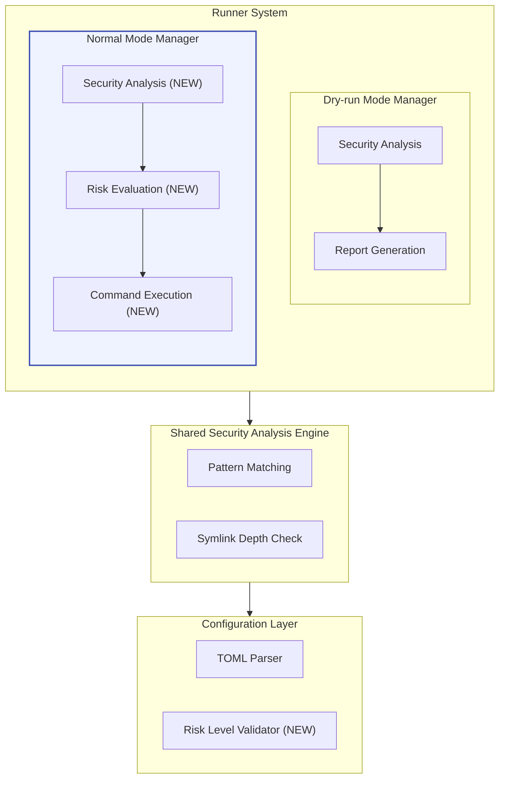
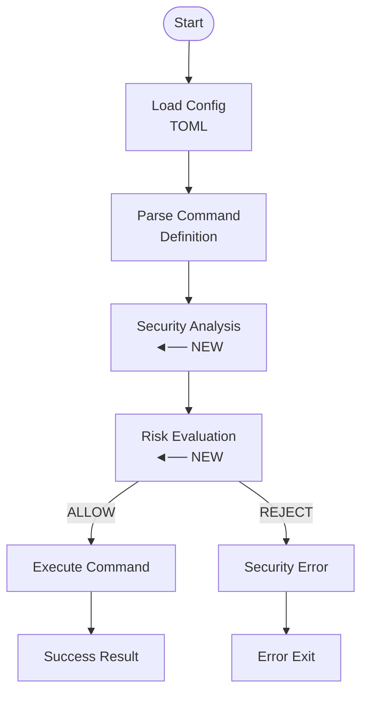
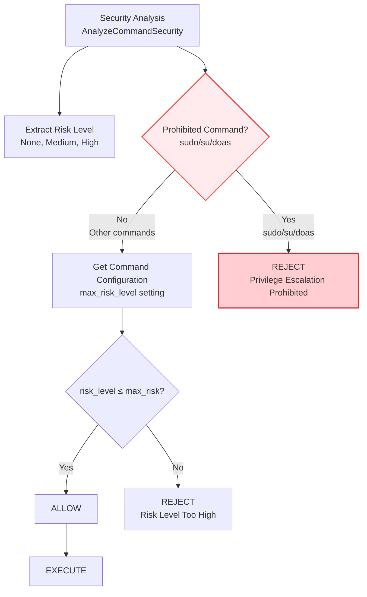
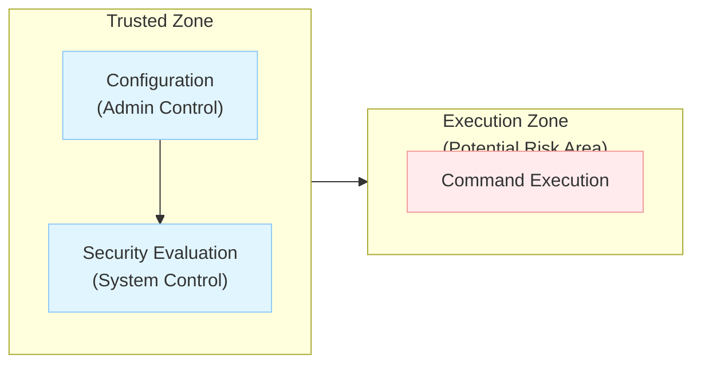
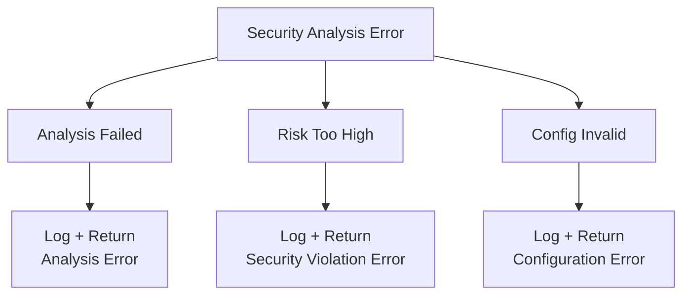

# アーキテクチャ設計書: Normal Mode リスクベースコマンド制御

## 1. システム概要

### 1.1 目的
Normal execution mode でのコマンド実行時にセキュリティ分析を統合し、リスクベースでコマンド実行を制御するシステム。バッチ処理環境での自動化されたセキュリティ制御を実現する。

### 1.2 設計原則
- **Security by Default**: デフォルトで最も安全な設定とし、危険な操作には明示的な許可が必要
- **Non-Interactive**: バッチ処理に最適化し、対話的な確認は行わない
- **Backward Compatibility**: 既存の設定ファイルとの互換性を維持
- **Separation of Concerns**: セキュリティ分析と実行制御を明確に分離

## 2. システムアーキテクチャ

### 2.1 全体構成図



### 2.2 コンポーネント構成

#### 2.2.1 既存コンポーネント（拡張）
- **Security Analysis Engine** (`internal/runner/security/`)
  - 危険コマンドパターンの検出
  - シンボリックリンク深度チェック
  - リスクレベル判定

- **Normal Mode Manager** (`internal/runner/resource/normal_manager.go`)
  - セキュリティ分析の統合（NEW）
  - リスクベース実行制御（NEW）

- **Configuration** (`internal/runner/config/`)
  - `max_risk_level` フィールドの追加（NEW）
  - 設定値の検証（NEW）

#### 2.2.2 新規追加コンポーネント
- **Risk Evaluation Package** (`internal/runner/risk/`)
  - `StandardEvaluator`: 統合リスク評価ロジック
  - 特権昇格・破壊的操作・ネットワーク・システム変更の分析
  - リスクレベル分類（Unknown, Low, Medium, High, Critical）

- **Enhanced Privilege Management** (`internal/runner/privilege/`)
  - `WithUserGroup`: ユーザー/グループ権限での実行機能
  - Primary Group デフォルト機能
  - Dry-run モード対応

- **Extended Security Functions** (`internal/runner/security/`)
  - `IsPrivilegeEscalationCommand`: sudo/su/doas 検出
  - `IsNetworkOperation`: ネットワーク操作検出
  - `IsSystemModification`: システム変更検出
  - Enhanced symlink depth checking

## 3. データフロー

### 3.1 Normal Mode でのコマンド実行フロー



### 3.2 リスク評価フロー



**特権昇格コマンド検出:** システムは以下の段階でコマンドを処理します：
1. **セキュリティ分析**: 既存の `security.AnalyzeCommandSecurity` でコマンドとリスクを分析
2. **特権昇格コマンド検出**: コマンド名が `sudo`, `su`, `doas` の場合は即座に実行拒否
3. **通常リスク評価**: その他のコマンドは `max_risk_level` 設定とリスクレベルを比較
4. **代替手段の案内**: 禁止時に `run_as_user`/`run_as_group` による安全な権限昇格メカニズムを案内

## 4. インターフェース設計

### 4.1 Risk Evaluator Interface

```go
type RiskEvaluator interface {
    EvaluateCommandExecution(
        riskLevel security.RiskLevel,
        detectedPattern string,
        reason string,
        command *config.Command,
    ) error
}

type SecurityViolationError struct {
    Command         string
    DetectedRisk    string
    DetectedPattern string
    RequiredSetting string
    CommandPath     string
    RunID           string
}

type PrivilegeEscalationProhibitedError struct {
    Command         string
    DetectedCommand string
    Reason          string
    Alternative     string
    CommandPath     string
    RunID           string
}
```

### 4.2 Enhanced Command Configuration

```go
type Command struct {
    Name         string   `toml:"name"`
    Description  string   `toml:"description"`
    Cmd          string   `toml:"cmd"`
    Args         []string `toml:"args"`
    MaxRiskLevel string   `toml:"max_risk_level"` // NEW: "none", "medium", "high"
    RunAsUser    string   `toml:"run_as_user"`    // User to execute command as (using seteuid)
    RunAsGroup   string   `toml:"run_as_group"`   // Group to execute command as (using setegid)
    // ... other existing fields
}
```

### 4.3 Normal Manager Enhanced Interface

```go
type NormalResourceManager struct {
    executor     CommandExecutor
    outputWriter OutputWriter
    evaluator    RiskEvaluator    // NEW: simplified risk evaluation
}

func (m *NormalResourceManager) ExecuteCommand(
    command *config.Command,
    env map[string]string,
) (*ExecutionResult, error) {
    // 1. Security Analysis (using existing function)
    riskLevel, detectedPattern, reason := security.AnalyzeCommandSecurity(command.Cmd, command.Args)

    // 2. Check for prohibited privilege escalation commands
    isProhibited, err := security.IsPrivilegeEscalationCommand(command.Cmd)
    if err != nil {
        // Handle symlink depth exceeded error
        if errors.Is(err, security.ErrSymlinkDepthExceeded) {
            return nil, &SecurityViolationError{
                Command:         command.Cmd,
                DetectedRisk:    "HIGH",
                DetectedPattern: "Symlink depth exceeded",
                Reason:          "Potential symlink attack detected",
            }
        }
        return nil, fmt.Errorf("failed to check privilege escalation: %w", err)
    }

    if isProhibited {
        return nil, &PrivilegeEscalationProhibitedError{
            Command:     command.Cmd,
            Reason:      "Privilege escalation commands (sudo, su, doas) are prohibited in TOML files",
            Alternative: "Use 'run_as_user'/'run_as_group' setting for safe privilege escalation",
        }
    }

    // 3. Risk evaluation for all other commands
    if err := m.evaluator.EvaluateCommandExecution(riskLevel, detectedPattern, reason, command); err != nil {
        return nil, err
    }

    // 4. Execute command
    return m.executor.Execute(command, env)
```

## 5. セキュリティ設計

### 5.1 セキュリティ境界



### 5.2 セキュリティ制御ポイント

1. **Configuration Validation**
   - `max_risk_level` の値検証
   - 不正な設定値の拒否

2. **Pre-execution Analysis**
   - セキュリティパターンマッチング
   - シンボリックリンク深度チェック
   - 特権昇格コマンド検出（sudo, su, doas）
   - 環境変数検査

3. **Risk-based Access Control**
   - **特権昇格コマンドの一律禁止**: `sudo`/`su`/`doas` は設定に関わらず実行拒否
   - 実際のリスクレベルと許可レベルの照合
   - システムコマンド（systemctl等）は従来通りリスクベース制御
   - `run_as_user`/`run_as_group` による安全な権限昇格メカニズムの推奨

4. **Audit and Logging**
   - セキュリティ違反の詳細ログ
   - 特権昇格コマンド使用試行の記録
   - 実行拒否の追跡可能性

## 6. エラーハンドリング戦略

### 6.1 エラー分類

```go
type SecurityError string

const (
    SecurityErrorRiskTooHigh            SecurityError = "command_security_violation"
    SecurityErrorPrivilegeEscalation    SecurityError = "privilege_escalation_prohibited"
    SecurityErrorAnalysisFailed         SecurityError = "security_analysis_failed"
    SecurityErrorConfigInvalid          SecurityError = "invalid_security_config"
)
```

### 6.2 エラー伝播パターン



## 7. パフォーマンス設計

### 7.1 最適化ポイント

- **Security Analysis Caching**: 同一コマンドパターンの分析結果をキャッシュ
- **Lazy Evaluation**: 必要な場合のみセキュリティ分析を実行
- **Parallel Processing**: 複数コマンドの分析を並列実行

### 7.2 パフォーマンス目標

- セキュリティ分析によるオーバーヘッド: < 100ms/command
- メモリ使用量増加: < 10MB
- 既存実行時間への影響: < 5%

## 8. 運用設計

### 8.1 ログ設計

```json
{
  "timestamp": "2024-01-15T10:30:00Z",
  "level": "ERROR",
  "event": "command_security_violation",
  "command": "rm -rf /important/data",
  "risk_level": "HIGH",
  "detected_pattern": "Recursive file removal",
  "command_path": "groups.basic_tests.commands.dangerous_cleanup",
  "run_id": "01K35WM4J8BBX09DY348H7JDEX"
}
```

### 8.2 設定管理

- **Default Policy**: デフォルトで最も安全な設定
- **Explicit Approval**: 危険操作には明示的な許可が必要
- **Configuration Validation**: 不正な設定の早期検出

## 9. テスト戦略

### 9.1 テストレベル

1. **Unit Tests**
   - Risk Evaluator のロジック
   - Security Error の生成
   - Configuration の検証

2. **Integration Tests**
   - Normal Manager とSecurity Analysisの統合
   - 設定ファイルとの統合

3. **End-to-End Tests**
   - 実際のコマンド実行シナリオ
   - エラーケースの網羅

### 9.2 テストケース設計

```go
func TestRiskBasedExecution(t *testing.T) {
    tests := []struct {
        name            string
        command         *config.Command
        expectedRisk    string
        shouldExecute   bool
        expectedError   error
    }{
        {
            name: "sudo_always_prohibited",
            command: &config.Command{
                Cmd: "sudo", Args: []string{"ls"},
                MaxRiskLevel: "high",  // Even with high permission
                Privileged: true,      // Even with privilege flag
            },
            shouldExecute: false,
            expectedError: SecurityErrorPrivilegeEscalation,
        },
        {
            name: "high_risk_with_permission",
            command: &config.Command{
                Cmd: "rm", Args: []string{"-rf", "/tmp"},
                MaxRiskLevel: "high",
            },
            expectedRisk: "HIGH",
            shouldExecute: true,
        },
        {
            name: "high_risk_without_permission",
            command: &config.Command{
                Cmd: "rm", Args: []string{"-rf", "/tmp"},
                // MaxRiskLevel not set (defaults to "none")
            },
            expectedRisk: "HIGH",
            shouldExecute: false,
            expectedError: SecurityErrorRiskTooHigh,
        },
        {
            name: "safe_command_always_allowed",
            command: &config.Command{
                Cmd: "echo", Args: []string{"hello"},
                // No max_risk_level needed
            },
            expectedRisk: "NONE",
            shouldExecute: true,
        },
    }
}
```

## 10. 実装優先順位

### 10.1 Phase 1: 基本機能
1. **既存機能の拡張** ✅ 完了
   - [x] `security.IsPrivilegeEscalationCommand()` の実装完了（sudo, su, doas対応）
   - [x] 既存の `IsSudoCommand()` との下位互換性維持
   - [x] PrivilegeEscalationProhibitedError の実装

2. **Risk Evaluator の基本実装** ✅ 完了
   - [x] 基本的なリスクレベル vs max_risk_level の比較
   - [x] SecurityViolationError の実装
   - [x] 明確なエラーメッセージ生成

3. **Normal Manager の統合** ✅ 完了
   - [x] `security.IsPrivilegeEscalationCommand()` の使用（Critical riskの検出とブロック）
   - [x] シンボリックリンク深度超過エラーの適切な処理
   - [x] **max_risk_level制御の実装（完了）** - Normal modeでHigh/Medium riskの制御が実装完了

### 10.2 Phase 2: 高度な分析機能
1. **システムコマンド分析の拡張** ✅ 完了
   - [x] systemctl/service コマンドの詳細分析
   - [x] chmod/chown コマンドの危険パターン検出
   - [x] 本質的特権コマンドの拡張

2. **Security Error Types の完全実装** ✅ 完了
   - [x] PrivilegeEscalationProhibitedError の詳細実装
   - [x] 詳細エラーメッセージテンプレート
   - [x] コンテキスト情報の追加

3. **ログシステムの強化** ✅ 完了
   - [x] 特権昇格禁止の監査ログ
   - [x] セキュリティ違反統計の収集

### 10.3 Phase 3: テストと最適化
1. **テストスイートの拡張** ✅ 完了
   - [x] 特権昇格分析のユニットテスト
   - [x] エンドツーエンドテストの充実
   - [x] エッジケースのテスト

2. **パフォーマンス最適化** ⚠️ 部分実装
   - [ ] 特権昇格分析のキャッシュ機能
   - [ ] 並列分析の実装

3. **ドキュメント整備** ✅ 完了
   - [x] 実装ガイドライン
   - [x] セキュリティベストプラクティス

## 11. 拡張性設計

### 11.1 将来的な拡張ポイント

- **Custom Risk Patterns**: ユーザー定義の危険パターン
- **Dynamic Risk Assessment**: 実行時コンテキストを考慮した評価
- **Advanced Privilege Analysis**:
  - ユーザー権限とファイル権限の詳細マッピング
  - SELinux/AppArmorとの統合
  - コンテナ環境での特権分析
- **Risk Metrics**: セキュリティ違反の統計と分析
- **Integration Hooks**: 外部システムとの連携
- **Machine Learning**: 異常なコマンドパターンの自動検出

### 11.2 アーキテクチャの柔軟性

- Interface-based Design により新しい評価器の追加が容易
- Plugin Architecture でカスタム分析エンジンの統合が可能
- Configuration-driven Approach で新しいポリシーの追加が簡単
