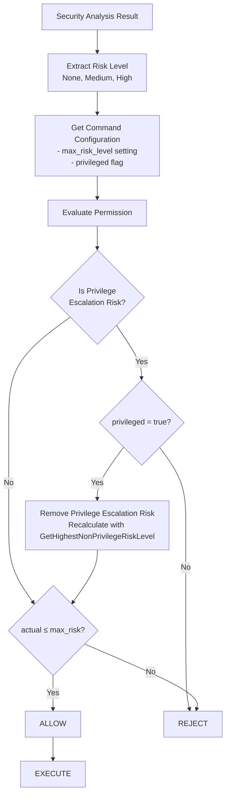

# アーキテクチャ設計書: Normal Mode リスクベースコマンド制御

## 1. システム概要

### 1.1 目的
Normal execution mode でのコマンド実行時にセキュリティ分析を統合し、リスクベースでコマンド実行を制御するシステム。バッチ処理環境での自動化されたセキュリティ制御を実現する。

### 1.2 設計原則
- **Security by Default**: デフォルトで最も安全な設定とし、危険な操作には明示的な許可が必要
- **Non-Interactive**: バッチ処理に最適化し、対話的な確認は行わない
- **Backward Compatibility**: 既存の設定ファイルとの互換性を維持
- **Separation of Concerns**: セキュリティ分析と実行制御を明確に分離

## 2. システムアーキテクチャ

### 2.1 全体構成図


### 2.2 コンポーネント構成

#### 2.2.1 既存コンポーネント（拡張）
- **Security Analysis Engine** (`internal/runner/security/`)
  - 危険コマンドパターンの検出
  - シンボリックリンク深度チェック
  - リスクレベル判定

- **Normal Mode Manager** (`internal/runner/resource/normal_manager.go`)
  - セキュリティ分析の統合（NEW）
  - リスクベース実行制御（NEW）

- **Configuration** (`internal/runner/config/`)
  - `max_risk_level` フィールドの追加（NEW）
  - 設定値の検証（NEW）

#### 2.2.2 新規コンポーネント
- **Risk Evaluator**: セキュリティ分析結果と設定値を照合し実行可否を判定
- **Security Error Types**: セキュリティ違反時の専用エラー型

## 3. データフロー

### 3.1 Normal Mode でのコマンド実行フロー


### 3.2 リスク評価フロー



**重要:** `privileged = true` フラグは特権昇格リスクのみを除外します。特権昇格リスクが除外された後、残りのセキュリティリスク（ファイル操作、ネットワーク通信等）は依然として `max_risk_level` 設定と照合されます。これにより、特権昇格が許可されたコマンドでも、他のセキュリティリスクに対する適切な制御が維持されます。

## 4. インターフェース設計

### 4.1 Risk Evaluator Interface

```go
type RiskEvaluator interface {
    EvaluateCommandExecution(
        analysis *security.AnalysisResult,
        command *config.Command,
    ) error
}

type SecurityViolationError struct {
    Command         string
    DetectedRisk    string
    DetectedPattern string
    RequiredSetting string
    CommandPath     string
    RunID           string
}
```

### 4.2 Enhanced Command Configuration

```go
type Command struct {
    Name         string   `toml:"name"`
    Description  string   `toml:"description"`
    Cmd          string   `toml:"cmd"`
    Args         []string `toml:"args"`
    MaxRiskLevel string   `toml:"max_risk_level"` // NEW
    Privileged   bool     `toml:"privileged"`     // EXISTING
    // ... other existing fields
}
```

### 4.3 Normal Manager Enhanced Interface

```go
type NormalResourceManager struct {
    executor      CommandExecutor
    outputWriter  OutputWriter
    evaluator     RiskEvaluator  // NEW
}

func (m *NormalResourceManager) ExecuteCommand(
    command *config.Command,
    env map[string]string,
) (*ExecutionResult, error) {
    // 1. Security Analysis (NEW)
    analysis, err := security.AnalyzeCommandSecurity(command, env)
    if err != nil {
        return nil, err
    }

    // 2. Risk Evaluation (NEW)
    // privileged=true is only applied to privilege escalation risks
    // Other security risks are still checked
    if err := m.evaluator.EvaluateCommandExecution(analysis, command); err != nil {
        return nil, err
    }

    // 3. Execute (EXISTING)
    return m.executor.Execute(command, env)
}
```

## 5. セキュリティ設計

### 5.1 セキュリティ境界


### 5.2 セキュリティ制御ポイント

1. **Configuration Validation**
   - `max_risk_level` の値検証
   - 不正な設定値の拒否

2. **Pre-execution Analysis**
   - セキュリティパターンマッチング
   - シンボリックリンク深度チェック
   - 環境変数検査

3. **Risk-based Access Control**
   - 実際のリスクレベルと許可レベルの照合
   - 特権昇格リスクに対する`privileged`フラグによる例外処理
   - その他のセキュリティリスクは`privileged=true`でもチェック対象

4. **Audit and Logging**
   - セキュリティ違反の詳細ログ
   - 実行拒否の追跡可能性

## 6. エラーハンドリング戦略

### 6.1 エラー分類

```go
type SecurityError string

const (
    SecurityErrorRiskTooHigh     SecurityError = "command_security_violation"
    SecurityErrorAnalysisFailed  SecurityError = "security_analysis_failed"
    SecurityErrorConfigInvalid   SecurityError = "invalid_security_config"
)
```

### 6.2 エラー伝播パターン


## 7. パフォーマンス設計

### 7.1 最適化ポイント

- **Security Analysis Caching**: 同一コマンドパターンの分析結果をキャッシュ
- **Lazy Evaluation**: 必要な場合のみセキュリティ分析を実行
- **Parallel Processing**: 複数コマンドの分析を並列実行

### 7.2 パフォーマンス目標

- セキュリティ分析によるオーバーヘッド: < 100ms/command
- メモリ使用量増加: < 10MB
- 既存実行時間への影響: < 5%

## 8. 運用設計

### 8.1 ログ設計

```json
{
  "timestamp": "2024-01-15T10:30:00Z",
  "level": "ERROR",
  "event": "command_security_violation",
  "command": "rm -rf /important/data",
  "risk_level": "HIGH",
  "detected_pattern": "Recursive file removal",
  "command_path": "groups.basic_tests.commands.dangerous_cleanup",
  "run_id": "01K35WM4J8BBX09DY348H7JDEX"
}
```

### 8.2 設定管理

- **Default Policy**: デフォルトで最も安全な設定
- **Explicit Approval**: 危険操作には明示的な許可が必要
- **Configuration Validation**: 不正な設定の早期検出

## 9. テスト戦略

### 9.1 テストレベル

1. **Unit Tests**
   - Risk Evaluator のロジック
   - Security Error の生成
   - Configuration の検証

2. **Integration Tests**
   - Normal Manager とSecurity Analysisの統合
   - 設定ファイルとの統合

3. **End-to-End Tests**
   - 実際のコマンド実行シナリオ
   - エラーケースの網羅

### 9.2 テストケース設計

```go
func TestRiskBasedExecution(t *testing.T) {
    tests := []struct {
        name            string
        command         *config.Command
        expectedRisk    string
        shouldExecute   bool
        expectedError   error
    }{
        {
            name: "high_risk_with_permission",
            command: &config.Command{
                Cmd: "rm", Args: []string{"-rf", "/tmp"},
                MaxRiskLevel: "high",
            },
            expectedRisk: "HIGH",
            shouldExecute: true,
        },
        {
            name: "high_risk_without_permission",
            command: &config.Command{
                Cmd: "rm", Args: []string{"-rf", "/tmp"},
                // MaxRiskLevel not set
            },
            expectedRisk: "HIGH",
            shouldExecute: false,
            expectedError: SecurityErrorRiskTooHigh,
        },
    }
}
```

## 10. 実装優先順位

### 10.1 Phase 1: 基本機能
1. Risk Evaluator の実装
2. Configuration の拡張
3. Normal Manager の統合

### 10.2 Phase 2: エラーハンドリング
1. Security Error Types の実装
2. 詳細エラーメッセージの実装
3. ログ統合

### 10.3 Phase 3: テストと最適化
1. テストスイートの拡張
2. パフォーマンス最適化
3. ドキュメント整備

## 11. 拡張性設計

### 11.1 将来的な拡張ポイント

- **Custom Risk Patterns**: ユーザー定義の危険パターン
- **Dynamic Risk Assessment**: 実行時コンテキストを考慮した評価
- **Risk Metrics**: セキュリティ違反の統計と分析
- **Integration Hooks**: 外部システムとの連携

### 11.2 アーキテクチャの柔軟性

- Interface-based Design により新しい評価器の追加が容易
- Plugin Architecture でカスタム分析エンジンの統合が可能
- Configuration-driven Approach で新しいポリシーの追加が簡単
