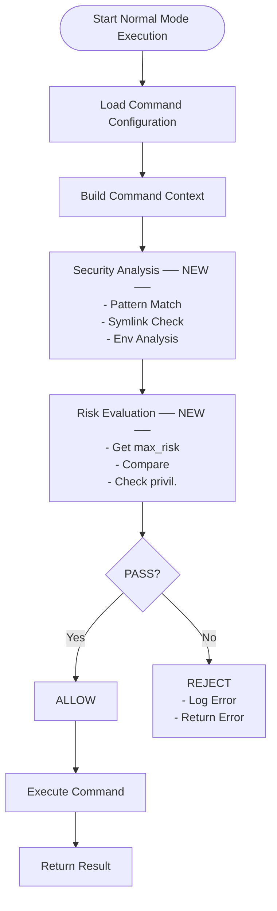

# 詳細仕様書: Normal Mode リスクベースコマンド制御

## 1. システム仕様

### 1.1 機能概要
Normal execution mode でコマンド実行前にセキュリティ分析を実行し、リスクレベルに基づいて実行可否を制御する機能。設定ファイルで定義された `max_risk_level` に基づき、危険なコマンドの実行を制御する。

### 1.2 動作モード
- **Normal Mode with Security**: セキュリティ分析 + 実行制御 + コマンド実行
- **Dry-run Mode**: セキュリティ分析 + レポート生成（既存機能、変更なし）

## 2. データ構造仕様

### 2.1 設定ファイル拡張

#### 2.1.1 Command 構造体の拡張
```go
type Command struct {
    Name         string   `toml:"name"`
    Description  string   `toml:"description"`
    Cmd          string   `toml:"cmd"`
    Args         []string                Privileged: true,
                // MaxRiskLevel 未設定でも privileged = true でも high risk は拒否
            },
            expectedError: &SecurityViolationError{},
            },
    }

    for _, tt := range tests {
        t.Run(tt.name, func(t *testing.T) {
            evaluator := NewDefaultRiskEvaluator(logger)
            err := evaluator.EvaluateCommandExecution(tt.riskLevel, tt.detectedPattern, tt.reason, tt.privilegeResult, tt.command)

            if tt.expectedError != nil {
                assert.Error(t, err)
                assert.IsType(t, tt.expectedError, err)
            } else {
                assert.NoError(t, err)
            }
        })
    }
}
```

#### 7.1.2 Privilege Escalation Analyzer Tests
```go
func TestPrivilegeEscalationAnalyzer(t *testing.T) {
    tests := []struct {
        name                   string
        cmdName                string
        args                   []string
        expectedHasEscalation  bool
        expectedType          PrivilegeEscalationType
        expectedRiskLevel     security.RiskLevel
        expectedTargetUser    string
        expectedServiceName   string
    }{
        {
            name:                  "sudo_as_root",
            cmdName:               "sudo",
            args:                  []string{"-u", "root", "systemctl", "restart", "nginx"},
            expectedHasEscalation: true,
            expectedType:         PrivilegeEscalationSudo,
            expectedRiskLevel:    security.RiskLevelHigh,
            expectedTargetUser:   "root",
        },
        {
            name:                  "sudo_shell",
            cmdName:               "sudo",
            args:                  []string{"-s"},
            expectedHasEscalation: true,
            expectedType:         PrivilegeEscalationSudo,
            expectedRiskLevel:    security.RiskLevelHigh,
        },
        {
            name:                  "systemctl_start",
            cmdName:               "systemctl",
            args:                  []string{"start", "nginx"},
            expectedHasEscalation: true,
            expectedType:         PrivilegeEscalationSystemd,
            expectedRiskLevel:    security.RiskLevelMedium,
            expectedServiceName:  "nginx",
        },
        {
            name:                  "systemctl_enable",
            cmdName:               "systemctl",
            args:                  []string{"enable", "nginx"},
            expectedHasEscalation: true,
            expectedType:         PrivilegeEscalationSystemd,
            expectedRiskLevel:    security.RiskLevelHigh,
            expectedServiceName:  "nginx",
        },
        {
            name:                  "chmod_777",
            cmdName:               "chmod",
            args:                  []string{"777", "/tmp/file"},
            expectedHasEscalation: true,
            expectedType:         PrivilegeEscalationChmod,
            expectedRiskLevel:    security.RiskLevelMedium,
        },
        {
            name:                  "chmod_setuid",
            cmdName:               "chmod",
            args:                  []string{"4755", "/usr/bin/myapp"},
            expectedHasEscalation: true,
            expectedType:         PrivilegeEscalationChmod,
            expectedRiskLevel:    security.RiskLevelHigh,
        },
        {
            name:                  "regular_command",
            cmdName:               "ls",
            args:                  []string{"-la"},
            expectedHasEscalation: false,
            expectedType:         PrivilegeEscalationNone,
            expectedRiskLevel:    security.RiskLevelNone,
        },
    }

    analyzer := NewDefaultPrivilegeEscalationAnalyzer(logger)

    for _, tt := range tests {
        t.Run(tt.name, func(t *testing.T) {
            result, err := analyzer.AnalyzePrivilegeEscalation(tt.cmdName, tt.args)

            assert.NoError(t, err)
            assert.Equal(t, tt.expectedHasEscalation, result.HasPrivilegeEscalation)
            assert.Equal(t, tt.expectedType, result.EscalationType)
            assert.Equal(t, tt.expectedRiskLevel, result.RiskLevel)

            if tt.expectedTargetUser != "" {
                assert.Equal(t, tt.expectedTargetUser, result.TargetUser)
            }

            if tt.expectedServiceName != "" {
                assert.Equal(t, tt.expectedServiceName, result.ServiceName)
            }
        })
    }
},
        },
    }

    for _, tt := range tests {
        t.Run(tt.name, func(t *testing.T) {
            evaluator := NewDefaultRiskEvaluator(logger)
            err := evaluator.EvaluateCommandExecution(tt.riskLevel, tt.detectedPattern, tt.reason, tt.command)

            if tt.expectedError != nil {
                assert.Error(t, err)
                assert.IsType(t, tt.expectedError, err)
            } else {
                assert.NoError(t, err)
            }
        })
    }
}orkingDir   string   `toml:"working_dir"`
    Env          []string `toml:"env"`
    Privileged   bool     `toml:"privileged"`
    MaxRiskLevel string   `toml:"max_risk_level"` // NEW FIELD
    Timeout      int      `toml:"timeout"`
}
```

#### 2.1.2 MaxRiskLevel の値仕様
| 値 | 説明 | 許可されるリスクレベル |
|---|---|---|
| `"none"` | リスクなしのみ | None |
| `"medium"` | Medium risk まで | None, Medium |
| `"high"` | High risk まで | None, Medium, High |
| 未設定/空文字 | デフォルト（none扱い） | None |

#### 2.1.3 設定例
```toml
[[groups.commands]]
name = "safe_echo"
description = "Safe echo command"
cmd = "echo"
args = ["Hello World"]
# max_risk_level 未設定 → None のみ許可

[[groups.commands]]
name = "network_download"
description = "Download from trusted source"
cmd = "wget"
args = ["https://trusted.example.com/data.json"]
max_risk_level = "medium"  # Medium risk まで許可

[[groups.commands]]
name = "system_cleanup"
description = "Cleanup temporary files"
cmd = "rm"
args = ["-rf", "/tmp/app_temp"]
max_risk_level = "high"    # High risk まで許可

[[groups.commands]]
name = "privileged_operation"
description = "System level operation"
cmd = "systemctl"
args = ["restart", "nginx"]
privileged = true          # privileged = true は特権昇格リスクのみを許可
```

### 2.2 エラー型仕様

#### 2.2.1 SecurityViolationError
```go
type SecurityViolationError struct {
    Command         string // 実行しようとしたコマンド
    DetectedRisk    string // 検出されたリスクレベル (NONE/MEDIUM/HIGH)
    DetectedPattern string // 検出された危険パターンの説明
    RequiredSetting string // 必要な設定の説明
    CommandPath     string // 設定ファイル内のコマンドパス
    RunID           string // 実行ID
}

func (e *SecurityViolationError) Error() string {
    return fmt.Sprintf("command_security_violation - Command execution blocked due to security risk\nDetails:\n  Command: %s\n  Detected Risk Level: %s\n  Detected Pattern: %s\n  Required Setting: %s\n  Command Path: %s\nRun ID: %s",
        e.Command, e.DetectedRisk, e.DetectedPattern,
        e.RequiredSetting, e.CommandPath, e.RunID)
}
```

#### 2.2.2 ConfigurationError
```go
type ConfigurationError struct {
    Field   string // 問題のあるフィールド名
    Value   string // 問題のある値
    Message string // エラーメッセージ
}

func (e *ConfigurationError) Error() string {
    return fmt.Sprintf("configuration error in field '%s': %s (value: '%s')",
        e.Field, e.Message, e.Value)
}
```

### 2.3 Privilege Escalation Analyzer 仕様

#### 2.3.1 Interface 定義
```go
type PrivilegeEscalationAnalyzer interface {
    AnalyzePrivilegeEscalation(cmdName string, args []string) (*PrivilegeEscalationResult, error)
    IsPrivilegeEscalationCommand(cmdName string) bool
    GetRequiredPrivileges(cmdName string, args []string) ([]string, error)
}

type PrivilegeEscalationResult struct {
    HasPrivilegeEscalation bool
    EscalationType         PrivilegeEscalationType
    RequiredPrivileges     []string
    RiskLevel             security.RiskLevel
    Description           string
    TargetUser            string   // 対象ユーザー（sudo -u user など）
    ServiceName           string   // サービス名（systemctl start service など）
}

type PrivilegeEscalationType int

const (
    PrivilegeEscalationNone PrivilegeEscalationType = iota
    PrivilegeEscalationSudo       // sudo command
    PrivilegeEscalationSu         // su command
    PrivilegeEscalationSystemd    // systemctl/systemd operations
    PrivilegeEscalationService    // service management
    PrivilegeEscalationChmod      // chmod with elevated permissions
    PrivilegeEscalationChown      // chown operations
    PrivilegeEscalationOther      // other privilege escalation
)

func (t PrivilegeEscalationType) String() string {
    switch t {
    case PrivilegeEscalationNone:
        return "NONE"
    case PrivilegeEscalationSudo:
        return "SUDO"
    case PrivilegeEscalationSu:
        return "SU"
    case PrivilegeEscalationSystemd:
        return "SYSTEMD"
    case PrivilegeEscalationService:
        return "SERVICE"
    case PrivilegeEscalationChmod:
        return "CHMOD"
    case PrivilegeEscalationChown:
        return "CHOWN"
    case PrivilegeEscalationOther:
        return "OTHER"
    default:
        return "UNKNOWN"
    }
}
```

#### 2.3.2 特権昇格パターン検出
```go
type DefaultPrivilegeEscalationAnalyzer struct {
    logger Logger
}

func (a *DefaultPrivilegeEscalationAnalyzer) AnalyzePrivilegeEscalation(
    cmdName string,
    args []string,
) (*PrivilegeEscalationResult, error) {
    result := &PrivilegeEscalationResult{
        HasPrivilegeEscalation: false,
        EscalationType:         PrivilegeEscalationNone,
        RequiredPrivileges:     []string{},
        RiskLevel:             security.RiskLevelNone,
    }

    // Extract base command name for pattern matching
    baseCmdName := filepath.Base(cmdName)

    switch baseCmdName {
    case "sudo":
        return a.analyzeSudoCommand(args)
    case "su":
        return a.analyzeSuCommand(args)
    case "systemctl":
        return a.analyzeSystemctlCommand(args)
    case "service":
        return a.analyzeServiceCommand(args)
    case "chmod":
        return a.analyzeChmodCommand(args)
    case "chown":
        return a.analyzeChownCommand(args)
    default:
        // Check if command requires inherent privilege escalation
        if a.isInherentlyPrivilegedCommand(baseCmdName) {
            result.HasPrivilegeEscalation = true
            result.EscalationType = PrivilegeEscalationOther
            result.RiskLevel = security.RiskLevelMedium
            result.Description = fmt.Sprintf("Command '%s' requires elevated privileges", baseCmdName)
            result.RequiredPrivileges = []string{"root"}
        }
    }

    return result, nil
}
```

### 2.4 Risk Evaluator 仕様

#### 2.4.1 Interface 定義
```go
type RiskEvaluator interface {
    EvaluateCommandExecution(
        riskLevel security.RiskLevel,
        detectedPattern string,
        reason string,
        privilegeResult *PrivilegeEscalationResult,
        command *config.Command,
    ) error
}

type DefaultRiskEvaluator struct {
    logger Logger
}
```

#### 2.4.2 評価ロジック
```go
func (e *DefaultRiskEvaluator) EvaluateCommandExecution(
    riskLevel security.RiskLevel,
    detectedPattern string,
    reason string,
    privilegeResult *PrivilegeEscalationResult,
    command *config.Command,
) error {
    // Step 1: max_risk_level の取得
    maxLevel := parseRiskLevel(command.MaxRiskLevel)

    // Step 2: 実際のリスクレベル取得
    actualLevel := riskLevel

    // Step 3: 特権昇格リスクの詳細チェック
    if privilegeResult.HasPrivilegeEscalation && command.Privileged {
        e.logger.Info("Privilege escalation allowed due to privileged flag",
            "command", command.Name,
            "escalation_type", privilegeResult.EscalationType.String(),
            "target_user", privilegeResult.TargetUser,
            "service_name", privilegeResult.ServiceName)

        // 特権昇格リスクを除外した実効リスクレベルを計算
        effectiveLevel := calculateEffectiveRiskLevel(riskLevel, privilegeResult)
        actualLevel = effectiveLevel
    }

    // Step 4: 比較評価
    if actualLevel.Severity() > maxLevel.Severity() {
        return &SecurityViolationError{
            Command:         buildCommandString(command),
            DetectedRisk:    actualLevel.String(),
            DetectedPattern: detectedPattern,
            RequiredSetting: fmt.Sprintf("Add 'max_risk_level = \"%s\"' to command configuration", actualLevel.String()),
            CommandPath:     buildCommandPath(command),
            RunID:           generateRunID(),
        }
    }

    return nil
}

// calculateEffectiveRiskLevel calculates the effective risk level after excluding privilege escalation risks
func calculateEffectiveRiskLevel(
    originalRisk security.RiskLevel,
    privilegeResult *PrivilegeEscalationResult,
) security.RiskLevel {
    // If the original risk is solely due to privilege escalation, reduce it
    if privilegeResult.HasPrivilegeEscalation {
        // If privilege escalation is the primary risk, the effective risk is lower
        if originalRisk == security.RiskLevelHigh && privilegeResult.RiskLevel == security.RiskLevelHigh {
            return security.RiskLevelMedium // Still has some risk from the privilege escalation context
        }
        if originalRisk == security.RiskLevelMedium && privilegeResult.RiskLevel == security.RiskLevelMedium {
            return security.RiskLevelNone
        }
    }

    return originalRisk
}
```

### 2.4 リスクレベル定義

#### 2.4.1 RiskLevel 型
```go
type RiskLevel int

const (
    RiskLevelNone RiskLevel = iota
    RiskLevelMedium
    RiskLevelHigh
)

func (r RiskLevel) String() string {
    switch r {
    case RiskLevelNone:
        return "NONE"
    case RiskLevelMedium:
        return "MEDIUM"
    case RiskLevelHigh:
        return "HIGH"
    default:
        return "UNKNOWN"
    }
}

func (r RiskLevel) Severity() int {
    return int(r)
}
```

#### 2.4.2 パースロジック
```go
func parseRiskLevel(level string) RiskLevel {
    switch strings.ToLower(strings.TrimSpace(level)) {
    case "medium":
        return RiskLevelMedium
    case "high":
        return RiskLevelHigh
    case "none", "":
        return RiskLevelNone
    default:
        return RiskLevelNone // デフォルトは最も安全な設定
    }
}
```

## 3. 処理フロー仕様

### 3.1 Normal Manager 実行フロー

```go
func (m *NormalResourceManager) ExecuteCommand(
    command *config.Command,
    env map[string]string,
) (*ExecutionResult, error) {

    // Phase 1: セキュリティ分析実行
    riskLevel, detectedPattern, reason := security.AnalyzeCommandSecurity(command.Cmd, command.Args)

    // Phase 2: 特権昇格分析実行
    privilegeResult, err := m.privilegeAnalyzer.AnalyzePrivilegeEscalation(command.Cmd, command.Args)
    if err != nil {
        return nil, fmt.Errorf("privilege escalation analysis failed: %w", err)
    }

    // Phase 3: リスク評価
    if err := m.evaluator.EvaluateCommandExecution(riskLevel, detectedPattern, reason, privilegeResult, command); err != nil {
        // セキュリティ違反をログに記録
        m.logger.Error("Command execution blocked",
            "error", err,
            "command", command.Name,
            "risk_level", riskLevel.String(),
            "privilege_escalation", privilegeResult.HasPrivilegeEscalation,
            "escalation_type", privilegeResult.EscalationType.String())
        return nil, err
    }

    // Phase 4: コマンド実行
    m.logger.Info("Command passed security evaluation",
        "command", command.Name,
        "risk_level", riskLevel.String(),
        "privilege_escalation_allowed", privilegeResult.HasPrivilegeEscalation && command.Privileged)

    return m.executor.Execute(command, env)
}
```

### 3.2 セキュリティ分析統合フロー



## 4. セキュリティ分析仕様

### 4.1 特権昇格分析の詳細実装

#### 4.1.1 Sudo コマンド分析
```go
func (a *DefaultPrivilegeEscalationAnalyzer) analyzeSudoCommand(args []string) (*PrivilegeEscalationResult, error) {
    result := &PrivilegeEscalationResult{
        HasPrivilegeEscalation: true,
        EscalationType:         PrivilegeEscalationSudo,
        RiskLevel:             security.RiskLevelMedium,
        Description:           "Sudo command execution",
        RequiredPrivileges:    []string{"sudo"},
    }

    // Parse sudo arguments to extract target user and command
    for i, arg := range args {
        switch arg {
        case "-u", "--user":
            if i+1 < len(args) {
                result.TargetUser = args[i+1]
                if result.TargetUser == "root" {
                    result.RiskLevel = security.RiskLevelHigh
                    result.Description = "Sudo execution as root user"
                }
            }
        case "-s", "--shell":
            result.RiskLevel = security.RiskLevelHigh
            result.Description = "Sudo shell execution"
        case "-i", "--login":
            result.RiskLevel = security.RiskLevelHigh
            result.Description = "Sudo login shell execution"
        }
    }

    return result, nil
}
```

#### 4.1.2 Systemctl コマンド分析
```go
func (a *DefaultPrivilegeEscalationAnalyzer) analyzeSystemctlCommand(args []string) (*PrivilegeEscalationResult, error) {
    result := &PrivilegeEscalationResult{
        HasPrivilegeEscalation: true,
        EscalationType:         PrivilegeEscalationSystemd,
        RiskLevel:             security.RiskLevelMedium,
        Description:           "Systemd service management",
        RequiredPrivileges:    []string{"systemctl"},
    }

    if len(args) > 0 {
        action := args[0]
        switch action {
        case "start", "stop", "restart", "reload":
            result.RiskLevel = security.RiskLevelMedium
            if len(args) > 1 {
                result.ServiceName = args[1]
                result.Description = fmt.Sprintf("Systemd %s service '%s'", action, result.ServiceName)
            }
        case "enable", "disable":
            result.RiskLevel = security.RiskLevelHigh
            if len(args) > 1 {
                result.ServiceName = args[1]
                result.Description = fmt.Sprintf("Systemd %s service '%s' (persistent change)", action, result.ServiceName)
            }
        case "mask", "unmask":
            result.RiskLevel = security.RiskLevelHigh
            result.Description = fmt.Sprintf("Systemd %s operation (security impact)", action)
        case "daemon-reload":
            result.RiskLevel = security.RiskLevelHigh
            result.Description = "Systemd daemon configuration reload"
        }
    }

    return result, nil
}
```

#### 4.1.3 権限変更コマンド分析
```go
func (a *DefaultPrivilegeEscalationAnalyzer) analyzeChmodCommand(args []string) (*PrivilegeEscalationResult, error) {
    result := &PrivilegeEscalationResult{
        HasPrivilegeEscalation: false,
        EscalationType:         PrivilegeEscalationNone,
        RiskLevel:             security.RiskLevelNone,
    }

    for _, arg := range args {
        // Check for dangerous permission patterns
        if strings.Contains(arg, "777") || strings.Contains(arg, "666") {
            result.HasPrivilegeEscalation = true
            result.EscalationType = PrivilegeEscalationChmod
            result.RiskLevel = security.RiskLevelMedium
            result.Description = "Overly permissive file permissions"
            result.RequiredPrivileges = []string{"file_owner"}
            break
        }

        // Check for setuid/setgid bits
        if strings.Contains(arg, "4") || strings.Contains(arg, "2") {
            if len(arg) == 4 && (arg[0] == '4' || arg[0] == '2') {
                result.HasPrivilegeEscalation = true
                result.EscalationType = PrivilegeEscalationChmod
                result.RiskLevel = security.RiskLevelHigh
                result.Description = "Setting setuid/setgid bits"
                result.RequiredPrivileges = []string{"file_owner", "potential_privilege_escalation"}
                break
            }
        }
    }

    return result, nil
}

func (a *DefaultPrivilegeEscalationAnalyzer) analyzeChownCommand(args []string) (*PrivilegeEscalationResult, error) {
    result := &PrivilegeEscalationResult{
        HasPrivilegeEscalation: true,
        EscalationType:         PrivilegeEscalationChown,
        RiskLevel:             security.RiskLevelMedium,
        Description:           "File ownership change",
        RequiredPrivileges:    []string{"file_owner"},
    }

    for _, arg := range args {
        if strings.Contains(arg, "root") {
            result.RiskLevel = security.RiskLevelHigh
            result.Description = "Ownership change to root user"
            result.RequiredPrivileges = []string{"root"}
            result.TargetUser = "root"
            break
        }
    }

    return result, nil
}
```

#### 4.1.4 本質的に特権が必要なコマンド
```go
func (a *DefaultPrivilegeEscalationAnalyzer) isInherentlyPrivilegedCommand(cmdName string) bool {
    privilegedCommands := map[string]bool{
        "iptables":   true,
        "mount":      true,
        "umount":     true,
        "modprobe":   true,
        "insmod":     true,
        "rmmod":      true,
        "useradd":    true,
        "userdel":    true,
        "usermod":    true,
        "passwd":     true,
        "visudo":     true,
        "crontab":    true,
        "at":         true,
        "nohup":      true,
    }

    return privilegedCommands[cmdName]
}
```

### 4.2 既存セキュリティ分析の活用

#### 4.1.1 危険パターンマッチング
```go
// 既存の security.AnalyzeCommandSecurity を活用
// 以下のパターンを検出:

// High Risk Patterns
var HighRiskPatterns = []string{
    "rm -rf",           // 再帰的削除
    "sudo rm",          // 管理者権限での削除
    "format",           // ファイルシステムフォーマット
    "mkfs",             // ファイルシステム作成
    "fdisk",            // ディスクパーティション操作
    "dd if=",           // 低レベルディスク操作
}

// Medium Risk Patterns
var MediumRiskPatterns = []string{
    "chmod 777",        // 全権限付与
    "chown root",       // 所有者変更
    "wget",             // ネットワークダウンロード
    "curl",             // ネットワークアクセス
    "nc", "netcat",     // ネットワーク通信
}
```

#### 4.1.2 シンボリックリンク深度チェック
```go
const MaxSymlinkDepth = 40

func checkSymlinkDepth(path string) (RiskLevel, error) {
    depth, err := countSymlinkDepth(path)
    if err != nil {
        return RiskLevelNone, err
    }

    if depth > MaxSymlinkDepth {
        return RiskLevelHigh, nil
    }

    return RiskLevelNone, nil
}
```

### 4.2 セキュリティ分析統合

#### 4.2.1 既存関数の活用
現在の実装では`security.AnalyzeCommandSecurity(cmdName string, args []string)`関数が以下の戻り値を提供します：

```go
func AnalyzeCommandSecurity(cmdName string, args []string) (riskLevel RiskLevel, detectedPattern string, reason string)
```

- `riskLevel`: 検出されたリスクレベル（RiskLevelNone, RiskLevelMedium, RiskLevelHigh）
- `detectedPattern`: マッチした危険パターン（例："rm -rf"）
- `reason`: リスク判定の理由（例："Recursive file removal"）

#### 4.2.2 特権昇格リスクの判定
現在の実装では特権昇格リスクの詳細分析は未実装のため、当面は以下のシンプルなルールを適用します：

- `privileged = true`が設定されている場合、Medium riskまでは許可
- High riskは`privileged = true`でも明示的な`max_risk_level = "high"`が必要

## 5. 設定検証仕様

### 5.1 Configuration Validator

#### 5.1.1 Validator Interface
```go
type ConfigValidator interface {
    ValidateCommand(command *config.Command) error
    ValidateGroup(group *config.Group) error
    ValidateConfig(config *config.Config) error
}
```

#### 5.1.2 MaxRiskLevel 検証
```go
func validateMaxRiskLevel(level string) error {
    if level == "" {
        return nil // 空文字は許可（デフォルト値として扱う）
    }

    validLevels := []string{"none", "medium", "high"}
    levelLower := strings.ToLower(strings.TrimSpace(level))

    for _, valid := range validLevels {
        if levelLower == valid {
            return nil
        }
    }

    return &ConfigurationError{
        Field:   "max_risk_level",
        Value:   level,
        Message: fmt.Sprintf("must be one of: %s", strings.Join(validLevels, ", ")),
    }
}
```

### 5.2 設定読み込み時の検証

#### 5.2.1 Config Loading Process
```go
func LoadConfig(filepath string) (*Config, error) {
    // 1. TOML ファイル読み込み
    config, err := toml.LoadFile(filepath)
    if err != nil {
        return nil, fmt.Errorf("failed to load config: %w", err)
    }

    // 2. 構造体へのマッピング
    var cfg Config
    if err := config.Unmarshal(&cfg); err != nil {
        return nil, fmt.Errorf("failed to unmarshal config: %w", err)
    }

    // 3. 設定値の検証
    validator := NewConfigValidator()
    if err := validator.ValidateConfig(&cfg); err != nil {
        return nil, fmt.Errorf("config validation failed: %w", err)
    }

    return &cfg, nil
}
```

## 6. ログ仕様

### 6.1 ログレベル定義

| レベル | 用途 | 出力タイミング |
|---|---|---|
| ERROR | セキュリティ違反 | コマンド実行拒否時 |
| WARN | 設定の問題 | 不正な設定値検出時 |
| INFO | 正常な実行 | セキュリティチェック通過時 |
| DEBUG | 詳細情報 | 分析結果の詳細 |

### 6.2 ログ出力形式

#### 6.2.1 セキュリティ違反ログ
```json
{
  "timestamp": "2024-01-15T10:30:00.123Z",
  "level": "ERROR",
  "event": "command_security_violation",
  "fields": {
    "command": "rm -rf /important/data",
    "command_name": "dangerous_cleanup",
    "detected_risk": "HIGH",
    "detected_patterns": ["Recursive file removal"],
    "max_risk_level": "none",
    "command_path": "groups.basic_tests.commands.dangerous_cleanup",
    "run_id": "01K35WM4J8BBX09DY348H7JDEX",
    "analysis_duration_ms": 15
  }
}
```

#### 6.2.2 正常実行ログ
```json
{
  "timestamp": "2024-01-15T10:30:00.456Z",
  "level": "INFO",
  "event": "command_security_passed",
  "fields": {
    "command": "echo Hello World",
    "command_name": "safe_echo",
    "detected_risk": "NONE",
    "max_risk_level": "none",
    "command_path": "groups.basic_tests.commands.safe_echo",
    "run_id": "01K35WM4J8BBX09DY348H7JDEX",
    "analysis_duration_ms": 3
  }
}
```

### 6.3 ログ実装

#### 6.3.1 Logger Interface
```go
type SecurityLogger interface {
    LogSecurityViolation(violation *SecurityViolationError, riskLevel security.RiskLevel, detectedPattern string, reason string)
    LogSecurityPassed(command *config.Command, riskLevel security.RiskLevel)
    LogAnalysisError(command *config.Command, err error)
}

type DefaultSecurityLogger struct {
    logger Logger
}

func (l *DefaultSecurityLogger) LogSecurityViolation(
    violation *SecurityViolationError,
    riskLevel security.RiskLevel,
    detectedPattern string,
    reason string,
) {
    l.logger.Error("command_security_violation",
        "command", violation.Command,
        "command_name", extractCommandName(violation.CommandPath),
        "detected_risk", violation.DetectedRisk,
        "detected_pattern", detectedPattern,
        "reason", reason,
        "command_path", violation.CommandPath,
        "run_id", violation.RunID)
}
```

## 7. テスト仕様

### 7.1 Unit Test 仕様

#### 7.1.1 Risk Evaluator Tests
```go
func TestRiskEvaluator_EvaluateCommandExecution(t *testing.T) {
    tests := []struct {
        name            string
        riskLevel       security.RiskLevel
        detectedPattern string
        reason          string
        privilegeResult *PrivilegeEscalationResult
        command         *config.Command
        expectedError   error
        description     string
    }{
        {
            name:            "high_risk_without_permission",
            riskLevel:       security.RiskLevelHigh,
            detectedPattern: "rm -rf",
            reason:          "Recursive file removal",
            privilegeResult: &PrivilegeEscalationResult{
                HasPrivilegeEscalation: false,
                EscalationType:         PrivilegeEscalationNone,
                RiskLevel:             security.RiskLevelNone,
            },
            command: &config.Command{
                Name: "dangerous_rm",
                Cmd:  "rm",
                Args: []string{"-rf", "/tmp"},
                // MaxRiskLevel 未設定
            },
            expectedError: &SecurityViolationError{},
            description:   "High riskコマンドは許可設定なしで拒否される",
        },
        {
            name:            "privilege_escalation_with_privileged_flag",
            riskLevel:       security.RiskLevelHigh,
            detectedPattern: "sudo",
            reason:          "Privilege escalation detected",
            privilegeResult: &PrivilegeEscalationResult{
                HasPrivilegeEscalation: true,
                EscalationType:         PrivilegeEscalationSudo,
                RiskLevel:             security.RiskLevelHigh,
                Description:           "Sudo execution as root user",
                TargetUser:            "root",
            },
            command: &config.Command{
                Name:       "privileged_sudo",
                Cmd:        "sudo",
                Args:       []string{"-u", "root", "systemctl", "restart", "nginx"},
                Privileged: true,
                // MaxRiskLevel 未設定でも privileged = true で特権昇格リスクは除外
            },
            expectedError: nil,
            description:   "privileged=trueは特権昇格リスクを除外し、残りのリスクで評価",
        },
        {
            name:            "privilege_escalation_without_privileged_flag",
            riskLevel:       security.RiskLevelMedium,
            detectedPattern: "sudo",
            reason:          "Privilege escalation detected",
            privilegeResult: &PrivilegeEscalationResult{
                HasPrivilegeEscalation: true,
                EscalationType:         PrivilegeEscalationSudo,
                RiskLevel:             security.RiskLevelMedium,
                Description:           "Sudo command execution",
            },
            command: &config.Command{
                Name: "unprivileged_sudo",
                Cmd:  "sudo",
                Args: []string{"ls", "/root"},
                // Privileged: false (デフォルト)
                // MaxRiskLevel 未設定
            },
            expectedError: &SecurityViolationError{},
            description:   "privileged=falseの場合、特権昇格リスクも通常通り評価される",
        },
        {
            name:            "mixed_risk_privilege_escalation_excluded",
            riskLevel:       security.RiskLevelHigh,
            detectedPattern: "sudo rm -rf",
            reason:          "Recursive file removal with sudo",
            privilegeResult: &PrivilegeEscalationResult{
                HasPrivilegeEscalation: true,
                EscalationType:         PrivilegeEscalationSudo,
                RiskLevel:             security.RiskLevelMedium,
                Description:           "Sudo command execution",
            },
            command: &config.Command{
                Name:         "mixed_risk_operation",
                Cmd:          "sudo",
                Args:         []string{"rm", "-rf", "/tmp/safe"},
                Privileged:   true,
                MaxRiskLevel: "medium", // 特権昇格リスク除外後の実効リスクに対する許可
            },
            expectedError: nil,
            description:   "特権昇格リスクが除外されても、残りのファイル削除リスクは評価される",
            description:   "privileged=trueはmedium riskまで許可",
        },
        {
            name:            "privileged_does_not_bypass_high_risk",
            riskLevel:       security.RiskLevelHigh,
            detectedPattern: "rm -rf",
            reason:          "Recursive file removal",
            command: &config.Command{
                Name:       "dangerous_file_operation",
                Cmd:        "rm",
                Args:       []string{"-rf", "/tmp/data"},
                Privileged: true,
                // privileged=true でも特権昇格以外のリスクはチェックされる
            },
            expectedError: &SecurityViolationError{},
            description: "privileged=trueでも特権昇格以外のリスクはチェックされる",
        },
    }

    for _, tt := range tests {
        t.Run(tt.name, func(t *testing.T) {
            evaluator := NewDefaultRiskEvaluator(logger)
            err := evaluator.EvaluateCommandExecution(tt.analysis, tt.command)

            if tt.expectedError != nil {
                assert.Error(t, err)
                assert.IsType(t, tt.expectedError, err)
            } else {
                assert.NoError(t, err)
            }
        })
    }
}
```

#### 7.1.2 Configuration Validation Tests
```go
func TestConfigValidator_ValidateMaxRiskLevel(t *testing.T) {
    tests := []struct {
        name          string
        maxRiskLevel  string
        expectedError bool
        description   string
    }{
        {
            name: "valid_none",
            maxRiskLevel: "none",
            expectedError: false,
        },
        {
            name: "valid_medium",
            maxRiskLevel: "medium",
            expectedError: false,
        },
        {
            name: "valid_high",
            maxRiskLevel: "high",
            expectedError: false,
        },
        {
            name: "valid_empty",
            maxRiskLevel: "",
            expectedError: false,
        },
        {
            name: "invalid_value",
            maxRiskLevel: "invalid",
            expectedError: true,
        },
        {
            name: "case_insensitive",
            maxRiskLevel: "HIGH",
            expectedError: false,
        },
    }

    for _, tt := range tests {
        t.Run(tt.name, func(t *testing.T) {
            err := validateMaxRiskLevel(tt.maxRiskLevel)
            if tt.expectedError {
                assert.Error(t, err)
                assert.IsType(t, &ConfigurationError{}, err)
            } else {
                assert.NoError(t, err)
            }
        })
    }
}
```

### 7.2 Integration Test 仕様

#### 7.2.1 Normal Manager Integration Tests
```go
func TestNormalResourceManager_SecurityIntegration(t *testing.T) {
    // Test setup
    mockExecutor := &MockCommandExecutor{}
    mockWriter := &MockOutputWriter{}
    logger := &MockLogger{}

    manager := NewNormalResourceManager(mockExecutor, mockWriter, logger)

    tests := []struct {
        name            string
        command         *config.Command
        expectedExecute bool
        expectedError   string
    }{
        {
            name: "safe_command_executes",
            command: &config.Command{
                Name: "safe_echo",
                Cmd: "echo",
                Args: []string{"hello"},
            },
            expectedExecute: true,
        },
        {
            name: "dangerous_command_blocked",
            command: &config.Command{
                Name: "dangerous_rm",
                Cmd: "rm",
                Args: []string{"-rf", "/"},
            },
            expectedExecute: false,
            expectedError: "command_security_violation",
        },
        {
            name: "dangerous_command_with_permission",
            command: &config.Command{
                Name: "controlled_rm",
                Cmd: "rm",
                Args: []string{"-rf", "/tmp/safe"},
                MaxRiskLevel: "high",
            },
            expectedExecute: true,
        },
    }

    for _, tt := range tests {
        t.Run(tt.name, func(t *testing.T) {
            mockExecutor.Reset()

            result, err := manager.ExecuteCommand(tt.command, nil)

            if tt.expectedError != "" {
                assert.Error(t, err)
                assert.Contains(t, err.Error(), tt.expectedError)
                assert.False(t, mockExecutor.WasCalled())
                assert.Nil(t, result)
            } else {
                assert.NoError(t, err)
                assert.Equal(t, tt.expectedExecute, mockExecutor.WasCalled())
            }
        })
    }
}
```

### 7.3 End-to-End Test 仕様

#### 7.3.1 実際のTOMLファイルを使用したテスト
```go
func TestE2E_RiskBasedCommandControl(t *testing.T) {
    // テスト用TOMLファイル作成
    configContent := `
[[groups]]
name = "test_group"

[[groups.commands]]
name = "safe_command"
cmd = "echo"
args = ["safe"]

[[groups.commands]]
name = "medium_risk_allowed"
cmd = "wget"
args = ["https://example.com/test"]
max_risk_level = "medium"

[[groups.commands]]
name = "medium_risk_blocked"
cmd = "wget"
args = ["https://evil.com/test"]

[[groups.commands]]
name = "high_risk_allowed"
cmd = "rm"
args = ["-rf", "/tmp/test"]
max_risk_level = "high"

[[groups.commands]]
name = "privileged_command"
cmd = "systemctl"
args = ["status", "test"]
privileged = true
`

    configFile := writeToTempFile(t, configContent)
    defer os.Remove(configFile)

    tests := []struct {
        commandName   string
        shouldSucceed bool
        errorContains string
    }{
        {"safe_command", true, ""},
        {"medium_risk_allowed", true, ""},
        {"medium_risk_blocked", false, "command_security_violation"},
        {"high_risk_allowed", true, ""},
        {"privileged_command", true, ""},
    }

    for _, tt := range tests {
        t.Run(tt.commandName, func(t *testing.T) {
            // 実際のrunnerを使用してテスト実行
            runner := NewRunner(configFile)
            result, err := runner.ExecuteCommand(tt.commandName)

            if tt.shouldSucceed {
                assert.NoError(t, err)
                assert.NotNil(t, result)
            } else {
                assert.Error(t, err)
                assert.Contains(t, err.Error(), tt.errorContains)
            }
        })
    }
}
```

## 8. パフォーマンス仕様

### 8.1 パフォーマンス要件

| メトリック | 目標値 | 測定方法 |
|---|---|---|
| セキュリティ分析時間 | < 100ms/command | 分析開始から結果返却まで |
| メモリ使用量増加 | < 10MB | プロセス全体のメモリ使用量 |
| 実行時間オーバーヘッド | < 5% | 既存処理時間との比較 |

### 8.2 パフォーマンス測定

#### 8.2.1 ベンチマークテスト
```go
func BenchmarkSecurityAnalysis(b *testing.B) {
    commands := generateTestCommands(100) // 100個のテストコマンド

    for i := 0; i < b.N; i++ {
        for _, cmd := range commands {
            riskLevel, detectedPattern, reason := security.AnalyzeCommandSecurity(cmd.Cmd, cmd.Args)

            evaluator := NewDefaultRiskEvaluator(nil)
            err := evaluator.EvaluateCommandExecution(riskLevel, detectedPattern, reason, cmd)
            // エラーは許可（テスト用の危険コマンドが含まれるため）
        }
    }
}

func BenchmarkNormalManagerWithSecurity(b *testing.B) {
    manager := setupTestManager()
    command := &config.Command{
        Name: "test_cmd",
        Cmd: "echo",
        Args: []string{"test"},
    }

    for i := 0; i < b.N; i++ {
        _, err := manager.ExecuteCommand(command, nil)
        if err != nil {
            b.Fatal(err)
        }
    }
}
```

## 9. 運用仕様

### 9.1 設定管理

#### 9.1.1 設定ファイルのベストプラクティス
```toml
# 推奨設定例

# 1. 安全なコマンドは max_risk_level 未設定
[[groups.commands]]
name = "display_status"
cmd = "echo"
args = ["System ready"]
# max_risk_level 未設定 → デフォルトで安全

# 2. ネットワーク系は medium で制御
[[groups.commands]]
name = "fetch_config"
cmd = "curl"
args = ["-s", "https://trusted-config-server.com/config.json"]
max_risk_level = "medium"  # 明示的な許可

# 3. 危険な操作は high + 具体的な説明
[[groups.commands]]
name = "cleanup_temp_directory"
description = "Remove temporary files from /tmp/myapp - VERIFIED SAFE PATH"
cmd = "rm"
args = ["-rf", "/tmp/myapp"]
max_risk_level = "high"    # 危険操作の明示的許可

# 4. システム操作は privileged フラグを使用
[[groups.commands]]
name = "restart_service"
description = "Restart application service"
cmd = "systemctl"
args = ["restart", "myapp.service"]
privileged = true          # 特権昇格リスクのみを許可
```

#### 9.1.2 設定ファイルの検証

```bash
# 設定ファイルの事前検証
./build/runner -config config.toml validate

# dry-runでの事前テスト
./build/runner -config config.toml -dry-run run group_name
```

### 9.2 監査とコンプライアンス

#### 9.2.1 監査ログの保管
- セキュリティ違反ログは必ず保管
- 実行許可されたコマンドの記録
- 設定変更の履歴

#### 9.2.2 定期的なレビュー
- 高リスクコマンドの実行頻度確認
- 新しい脅威パターンの追加検討
- 設定ファイルの定期監査

## 10. トラブルシューティング仕様

### 10.1 よくある問題と解決方法

#### 10.1.1 設定エラー
**問題**: `configuration error in field 'max_risk_level': must be one of: none, medium, high (value: 'low')`
**解決**: `max_risk_level` の値を `"none"`, `"medium"`, `"high"` のいずれかに修正

**問題**: コマンドが実行拒否される
**解決**: エラーメッセージの `Required Setting` に従って設定を追加

#### 10.1.2 パフォーマンス問題
**問題**: セキュリティ分析が遅い
**解決**:
1. コマンド数を削減
2. 不要なセキュリティチェックの無効化
3. より高速なマシンでの実行

### 10.2 デバッグ機能

#### 10.2.1 詳細ログ出力
```bash
# DEBUGレベルでの実行
LOG_LEVEL=DEBUG ./build/runner -config config.toml run group_name

# セキュリティ分析の詳細表示
SECURITY_DEBUG=true ./build/runner -config config.toml run group_name
```

#### 10.2.2 分析結果の表示
```go
// デバッグ用の分析結果出力
func (a *AnalysisResult) DebugString() string {
    var buf strings.Builder

    buf.WriteString(fmt.Sprintf("Command: %s\n", a.CommandString))
    buf.WriteString(fmt.Sprintf("Overall Risk: %s\n", a.OverallRisk.String()))

    for _, pattern := range a.DetectedPatterns {
        buf.WriteString(fmt.Sprintf("  Pattern: %s (Risk: %s) - %s\n",
            pattern.Pattern, pattern.RiskLevel.String(), pattern.Description))
    }

    if a.SymlinkRisk > RiskLevelNone {
        buf.WriteString(fmt.Sprintf("Symlink Risk: %s\n", a.SymlinkRisk.String()))
    }

    return buf.String()
}
```
