# 実装計画書: Normal Mode リスクベースコマンド制御

## 1. プロジェクト概要

### 1.1 実装目標
Normal execution mode でのコマンド実行時にセキュリティ分析を統合し、リスクベースでコマンド実行を制御するシステムの実装。

### 1.2 成果物
- Privilege Escalation Analyzer の実装
- Enhanced Risk Evaluator の実装
- Normal Manager の統合改修
- 包括的なテストスイート
- セキュリティ設定の拡張

### 1.3 実装スコープ
```
internal/runner/
├── security/
│   ├── privilege.go      (NEW)
│   ├── privilege_test.go (NEW)
│   ├── risk_evaluator.go (NEW)
│   └── risk_evaluator_test.go (NEW)
├── resource/
│   ├── normal_manager.go (MODIFIED)
│   └── normal_manager_test.go (MODIFIED)
├── config/
│   ├── command.go        (MODIFIED)
│   └── command_test.go   (MODIFIED)
└── runnertypes/
    └── errors.go         (MODIFIED)
```

## 2. 実装フェーズ

### ✅ Phase 1: 基盤実装完了 (August 24, 2025)

**実装状況**: Phase 1は正常に完了済み

#### ✅ Phase 1.1: Normal Manager セキュリティ統合完了

**実装内容**:
- `internal/runner/resource/normal_manager.go` への `PrivilegeEscalationAnalyzer` と `RiskEvaluator` 統合
- セキュリティ分析パイプライン（3段階評価）の実装
- `runnertypes.RiskLevel` と `security.RiskLevel` 間の型変換機能
- 構造化ログ（slog）によるセキュリティイベント記録
- Critical risk command のブロック機能（特権昇格コマンド検出）

**統合されたセキュリティ分析パイプライン**:
1. 基本リスク評価（既存 risk package）
2. 特権昇格分析（security package）
3. 統合リスク評価（security package evaluator）

**実装ファイル**:
- ✅ `internal/runner/resource/normal_manager.go` - セキュリティ機能統合済み
- ✅ `internal/runner/resource/default_manager.go` - ロガー対応済み
- ✅ `internal/runner/runner.go` - リソースマネージャ初期化更新済み
- ✅ 全テストファイル - ロガーパラメータ対応済み

**テスト結果**:
- ✅ `make test`: 全テスト通過
- ✅ `make lint`: リントエラーなし（0 issues）
- ✅ セキュリティログ出力確認済み（特権昇格検出動作確認済み）

**受け入れ基準達成**:
- ✅ 特権昇格コマンド（sudo/su/doas）の検出・ブロック
- ✅ セキュリティ分析パイプラインの動作確認
- ✅ ログ出力の実装・動作確認
- ✅ 既存機能との完全後方互換性
- ✅ すべてのテストケースの通過

### 🚧 Phase 2: 拡張リスク制御実装 (未実装)

#### 2.2.1 拡張 Risk Level Enforcement

**目標**: Critical以外のリスクレベル（High/Medium）の制御実装

**実装ファイル**: `internal/runner/resource/normal_manager.go`

**実装タスク**:
```go
// 1. インターフェース定義
type PrivilegeEscalationAnalyzer interface {
    AnalyzePrivilegeEscalation(ctx context.Context, cmdName string, args []string) (*PrivilegeEscalationResult, error)
    IsPrivilegeEscalationCommand(cmdName string) bool
    GetRequiredPrivileges(cmdName string, args []string) ([]string, error)
}

// 2. 基本構造体実装
type DefaultPrivilegeEscalationAnalyzer struct {
    logger          *slog.Logger
    sudoCommands    map[string]bool
    systemCommands  map[string]bool
    serviceCommands map[string]bool
}

// 3. 核となるメソッド実装
func (a *DefaultPrivilegeEscalationAnalyzer) AnalyzePrivilegeEscalation(
    ctx context.Context, cmdName string, args []string) (*PrivilegeEscalationResult, error)

func (a *DefaultPrivilegeEscalationAnalyzer) IsPrivilegeEscalationCommand(cmdName string) bool

func (a *DefaultPrivilegeEscalationAnalyzer) GetRequiredPrivileges(
    cmdName string, args []string) ([]string, error)
```

**実装詳細**:
- sudo, su, systemctl, service などの基本的な特権昇格パターン検出
- コマンドパス解析とシンボリックリンク追跡
- 特権昇格タイプの分類（Sudo, Su, Systemd, Service, Other）
- リスクレベルの判定（None, Medium, High）

**受け入れ基準**:
- [ ] 基本的な特権昇格コマンド（sudo, su）の検出
- [ ] systemctl, service コマンドの検出
- [ ] 絶対パス・相対パスでの検出
- [ ] シンボリックリンク経由の検出
- [ ] ログ出力の実装

**テストケース**: `internal/runner/security/privilege_test.go`
```go
func TestAnalyzePrivilegeEscalation_BasicSudo(t *testing.T)
func TestAnalyzePrivilegeEscalation_SystemCommands(t *testing.T)
func TestAnalyzePrivilegeEscalation_NonPrivilegedCommands(t *testing.T)
func TestAnalyzePrivilegeEscalation_SymlinkHandling(t *testing.T)
func TestIsPrivilegeEscalationCommand(t *testing.T)
func TestGetRequiredPrivileges(t *testing.T)
```

#### 2.1.2 Enhanced Risk Evaluator 実装

**目標**: 特権昇格リスクを考慮した統合リスク評価機能の実装

**実装ファイル**: `internal/runner/security/risk_evaluator.go`

**実装タスク**:
```go
// 1. インターフェース定義
type RiskEvaluator interface {
    EvaluateCommandExecution(
        ctx context.Context,
        riskLevel security.RiskLevel,
        detectedPattern string,
        reason string,
        privilegeResult *PrivilegeEscalationResult,
        command *config.Command,
    ) error
}

// 2. 実装構造体
type DefaultRiskEvaluator struct {
    logger *slog.Logger
}

// 3. 評価ロジック実装
func (re *DefaultRiskEvaluator) EvaluateCommandExecution(...) error
```

**実装詳細**:
- 基本リスクレベルと特権昇格リスクの統合評価
- `run_as_user`/`run_as_group` 設定による特権昇格リスクの除外
- `max_risk_level` 設定との照合
- 詳細なエラーメッセージ生成
- セキュリティ違反ログの出力

**受け入れ基準**:
- [ ] 基本リスクレベルの評価
- [ ] 特権昇格リスクの分離評価
- [ ] privileged フラグによる例外処理
- [ ] max_risk_level との照合
- [ ] SecurityViolationError の生成

**テストケース**: `internal/runner/security/risk_evaluator_test.go`
```go
func TestEvaluateCommandExecution_AllowedRisk(t *testing.T)
func TestEvaluateCommandExecution_ExceededRisk(t *testing.T)
func TestEvaluateCommandExecution_PrivilegedBypass(t *testing.T)
func TestEvaluateCommandExecution_PrivilegeEscalationHandling(t *testing.T)
```

#### 2.1.3 Security Error Types 拡張

**目標**: セキュリティ違反専用のエラー型の実装

**実装ファイル**: `internal/runner/runnertypes/errors.go`

**実装タスク**:
```go
// 1. セキュリティエラー型定義
type SecurityViolationError struct {
    Command         string
    DetectedRisk    string
    DetectedPattern string
    RequiredSetting string
    CommandPath     string
    RunID           string
    PrivilegeInfo   *PrivilegeEscalationInfo
}

// 2. エラーメソッド実装
func (e *SecurityViolationError) Error() string
func (e *SecurityViolationError) Is(target error) bool
func (e *SecurityViolationError) Unwrap() error

// 3. ヘルパー関数
func NewSecurityViolationError(...) *SecurityViolationError
func IsSecurityViolationError(err error) bool
```

**受け入れ基準**:
- [ ] 詳細なエラー情報の格納
- [ ] 人間が読みやすいエラーメッセージ
- [ ] エラーチェーン対応
- [ ] JSON シリアライゼーション対応

### 2.2 Phase 2: 統合実装 (Week 3-4)

#### 2.2.1 Normal Manager 統合

**目標**: Normal Manager への新しいセキュリティ機能の統合

**実装ファイル**: `internal/runner/resource/normal_manager.go`

**実装タスク**:
```go
// 1. 構造体拡張
type NormalResourceManager struct {
    executor             CommandExecutor
    outputWriter         OutputWriter
    privilegeAnalyzer    PrivilegeEscalationAnalyzer // NEW
    riskEvaluator        RiskEvaluator               // NEW
    securityAnalyzer     SecurityAnalyzer            // EXISTING
    logger              *slog.Logger
    // ... existing fields
}

// 2. コンストラクタ更新
func NewNormalResourceManager(...) *NormalResourceManager

// 3. ExecuteCommand メソッド拡張
func (m *NormalResourceManager) ExecuteCommand(
    command *config.Command,
    env map[string]string,
) (*ExecutionResult, error)
```

**統合フロー**:
1. Basic Security Analysis (既存機能)
2. Privilege Escalation Analysis (NEW)
3. Comprehensive Risk Evaluation (NEW)
4. Command Execution (既存機能)

**受け入れ基準**:
- [ ] 既存機能の互換性維持
- [ ] セキュリティ分析の統合
- [ ] エラーハンドリングの改善
- [ ] ログ出力の拡張
- [ ] パフォーマンス影響の最小化

#### 2.2.2 Configuration 拡張

**目標**: Command 設定への `max_risk_level` フィールド追加

**実装ファイル**: `internal/runner/config/command.go`

**実装タスク**:
```go
// 1. Command 構造体拡張
type Command struct {
    Name         string   `toml:"name"`
    Description  string   `toml:"description"`
    Cmd          string   `toml:"cmd"`
    Args         []string `toml:"args"`
    MaxRiskLevel string   `toml:"max_risk_level"` // NEW
    Privileged   bool     `toml:"privileged"`     // EXISTING
    // ... other existing fields
}

// 2. 検証メソッド追加
func (c *Command) ValidateMaxRiskLevel() error
func (c *Command) GetMaxRiskLevel() (security.RiskLevel, error)

// 3. デフォルト値設定
func (c *Command) SetDefaults()
```

**受け入れ基準**:
- [ ] TOML での設定値読み込み
- [ ] 不正値の検証とエラー処理
- [ ] デフォルト値の適用
- [ ] 後方互換性の維持

### 2.3 Phase 3: 高度な機能実装 (Week 5-6)

#### 2.3.1 詳細特権昇格分析

**目標**: chmod, chown, setuid等の詳細分析機能

**実装拡張**: `internal/runner/security/privilege.go`

**実装タスク**:
```go
// 1. 拡張分析メソッド
func (a *DefaultPrivilegeEscalationAnalyzer) analyzeFilePermissionCommands(
    cmdName string, args []string) (*PrivilegeEscalationResult, error)

func (a *DefaultPrivilegeEscalationAnalyzer) analyzeSystemdCommands(
    cmdName string, args []string) (*PrivilegeEscalationResult, error)

func (a *DefaultPrivilegeEscalationAnalyzer) analyzeServiceCommands(
    cmdName string, args []string) (*PrivilegeEscalationResult, error)

// 2. セキュリティパターン強化
func (a *DefaultPrivilegeEscalationAnalyzer) detectSetuidCommands(args []string) bool
func (a *DefaultPrivilegeEscalationAnalyzer) detectDangerousFileOperations(args []string) bool
```

**受け入れ基準**:
- [ ] chmod/chown の詳細分析
- [ ] setuid/setgid ビット検出
- [ ] 危険なファイル操作パターン検出
- [ ] systemctl の詳細引数分析

#### 2.3.2 ログシステム強化

**目標**: セキュリティ監査ログの拡張

**実装ファイル**: 複数ファイルに分散

**実装タスク**:
```go
// 1. ログイベント定義
const (
    SecurityEventPrivilegeEscalation = "privilege_escalation_detected"
    SecurityEventRiskViolation      = "security_risk_violation"
    SecurityEventRiskEvaluation     = "security_risk_evaluation"
)

// 2. 構造化ログ実装
func (m *NormalResourceManager) logSecurityAnalysis(...)
func (m *NormalResourceManager) logPrivilegeEscalation(...)
func (m *NormalResourceManager) logRiskViolation(...)
```

**受け入れ基準**:
- [ ] 構造化された監査ログ
- [ ] セキュリティイベントの分類
- [ ] JSON 形式での出力対応
- [ ] ログレベルの適切な設定

### 2.4 Phase 4: テスト強化・最適化 (Week 7-8)

#### 2.4.1 テストスイート拡張

**目標**: 包括的なテストカバレッジの実現

**実装ファイル**: 各コンポーネントの `*_test.go`

**テスト分類**:

1. **Unit Tests**
   - Privilege Escalation Analyzer の詳細テスト
   - Risk Evaluator のロジックテスト
   - Error Types のテスト

2. **Integration Tests**
   - Normal Manager 統合テスト
   - Configuration 読み込みテスト
   - エンドツーエンドフローテスト

3. **Security Tests**
   - セキュリティ境界のテスト
   - 攻撃パターンのテスト
   - エラーケースのテスト

**テストカバレッジ目標**: 90%以上

**実装タスク**:
```go
// 1. テストヘルパー実装
func createTestPrivilegeAnalyzer() *DefaultPrivilegeEscalationAnalyzer
func createTestRiskEvaluator() *DefaultRiskEvaluator
func createTestCommand(riskLevel string) *config.Command

// 2. モックの実装
type MockPrivilegeAnalyzer struct{}
type MockRiskEvaluator struct{}

// 3. ベンチマークテスト
func BenchmarkPrivilegeEscalationAnalysis(b *testing.B)
func BenchmarkRiskEvaluation(b *testing.B)
```

#### 2.4.2 パフォーマンス最適化

**目標**: セキュリティ分析による実行時間増加を5%以下に抑制

**最適化ポイント**:
1. **Caching**: 同一コマンドパターンの分析結果キャッシュ
2. **Lazy Evaluation**: 必要な場合のみ詳細分析実行
3. **Parallel Processing**: 複数コマンド分析の並列化

**実装タスク**:
```go
// 1. キャッシュ実装
type AnalysisCache struct {
    cache map[string]*PrivilegeEscalationResult
    mu    sync.RWMutex
    ttl   time.Duration
}

// 2. 最適化されたAnalyzer実装
type OptimizedPrivilegeEscalationAnalyzer struct {
    *DefaultPrivilegeEscalationAnalyzer
    cache *AnalysisCache
}
```

**パフォーマンス目標**:
- セキュリティ分析オーバーヘッド: < 100ms/command
- メモリ使用量増加: < 10MB
- 既存実行時間への影響: < 5%

## 3. 実装スケジュール

### 3.1 全体スケジュール

```mermaid
gantt
    title 実装スケジュール
    dateFormat  YYYY-MM-DD
    section Phase 1: 基盤実装
    Privilege Analyzer     :p1a, 2024-01-15, 7d
    Risk Evaluator        :p1b, 2024-01-16, 6d
    Security Error Types  :p1c, 2024-01-18, 4d
    section Phase 2: 統合実装
    Normal Manager統合     :p2a, 2024-01-22, 7d
    Configuration拡張     :p2b, 2024-01-24, 5d
    section Phase 3: 高度な機能
    詳細特権昇格分析      :p3a, 2024-01-29, 7d
    ログシステム強化      :p3b, 2024-01-31, 5d
    section Phase 4: テスト・最適化
    テストスイート拡張    :p4a, 2024-02-05, 7d
    パフォーマンス最適化  :p4b, 2024-02-07, 5d
```



### 3.2 マイルストーン

| マイルストーン | 完了予定日 | 成果物 | 実装状況 |
|----------------|------------|--------|----------|
| ✅ Phase 1 完了 | 2025-08-24 | 基本セキュリティ機能実装・Normal Manager統合 | **完了済み** |
| 🚧 Phase 2 完了 | TBD | 拡張リスク制御・max_risk_level制御 | **未実装** |
| 🚧 Phase 3 完了 | TBD | 高度な分析機能実装 | **未実装** |
| 🚧 Phase 4 完了 | TBD | 最終成果物完成 | **未実装** |

**現在の実装状況 (2025-08-24)**:
- ✅ **Phase 1 完了**: Normal Manager へのセキュリティ統合、特権昇格検出、セキュリティ分析パイプライン実装
- 🚧 **Phase 2以降**: 未実装（max_risk_level制御、高度な特権管理等）

## 4. リスク管理

### 4.1 技術リスク

| リスク | 影響度 | 発生確率 | 対策 |
|--------|--------|----------|------|
| 既存機能の破綻 | 高 | 中 | 段階的実装、包括的回帰テスト |
| パフォーマンス劣化 | 中 | 中 | 継続的ベンチマーク、最適化実装 |
| セキュリティ機能の誤動作 | 高 | 低 | 詳細テスト、セキュリティレビュー |
| 設定互換性問題 | 中 | 低 | 後方互換性保証、マイグレーションガイド |

### 4.2 対策

1. **段階的実装**: フェーズごとの漸進的な実装
2. **継続的テスト**: 各フェーズでの包括的テスト実行
3. **コードレビュー**: セキュリティ専門家によるレビュー
4. **パフォーマンス監視**: ベンチマークテストの継続実行

## 5. 品質保証

### 5.1 コード品質基準

- **テストカバレッジ**: 90%以上
- **Lint エラー**: ゼロ
- **セキュリティ脆弱性**: ゼロ
- **コードレビュー**: 全ての変更で実施

### 5.2 テスト戦略

1. **Unit Tests**: 各コンポーネントの独立テスト
2. **Integration Tests**: コンポーネント間連携テスト
3. **Security Tests**: セキュリティ境界テスト
4. **Performance Tests**: パフォーマンス影響測定
5. **End-to-End Tests**: 実際の使用シナリオテスト

### 5.3 レビュープロセス

1. **開発者セルフレビュー**: 実装者による品質チェック
2. **ピアレビュー**: チームメンバーによるコードレビュー
3. **セキュリティレビュー**: セキュリティ専門家によるレビュー
4. **アーキテクチャレビュー**: 設計妥当性のレビュー

## 6. 成功基準

### 6.1 機能要件

- [ ] 特権昇格コマンドの正確な検出
- [ ] リスクレベルに基づく実行制御
- [ ] privileged フラグによる例外処理
- [ ] 詳細なセキュリティログ出力
- [ ] 既存機能との完全な互換性

### 6.2 非機能要件

- [ ] パフォーマンス影響 < 5%
- [ ] メモリ使用量増加 < 10MB
- [ ] テストカバレッジ ≥ 90%
- [ ] セキュリティ脆弱性ゼロ
- [ ] 設定ファイル後方互換性

### 6.3 運用要件

- [ ] 詳細な実装ドキュメント
- [ ] セキュリティ運用ガイド
- [ ] トラブルシューティングガイド
- [ ] パフォーマンス監視手順

## 7. 実装チェックリスト

### 7.1 Phase 1: 基盤実装 ✅ **完了**

#### Risk-Based Command Control ✅ **完了**
- [x] `internal/runner/risk/evaluator.go` 実装
- [x] `RiskEvaluator` インターフェース定義
- [x] `StandardEvaluator` 構造体実装
- [x] `EvaluateRisk` メソッド実装
- [x] 基本リスクレベル分類実装（Low, Medium, High, Critical）
- [x] 特権昇格コマンド検出統合
- [x] 既存セキュリティ関数の活用
- [x] `internal/runner/risk/evaluator_test.go` 実装
- [x] 包括的テストスイート実装（60+テストケース）

#### Enhanced Configuration Support ✅ **完了**
- [x] `internal/runner/runnertypes/config.go` 拡張
- [x] `RiskLevel` 型定義（Unknown, Low, Medium, High, Critical）
- [x] `ParseRiskLevel` 関数実装
- [x] リスクレベル文字列変換実装
- [x] `Command` 構造体の User/Group フィールド追加
- [x] `internal/runner/runnertypes/config_test.go` 実装
- [x] 設定パース・検証テスト実装

#### Enhanced Privilege Management ✅ **完了**
- [x] `internal/runner/privilege/unix.go` 拡張
- [x] `WithUserGroup` メソッド実装
- [x] `IsUserGroupSupported` メソッド実装
- [x] User/Group ルックアップ機能実装
- [x] Primary Group デフォルト機能実装
- [x] Dry-run モード対応
- [x] 包括的テストスイート実装

### 7.2 Phase 2: 統合実装 🔄 **進行中**

#### Resource Manager Integration 🔄 **部分完了**
- [x] `internal/runner/resource/dryrun_manager.go` 修正
- [x] Risk-based analysis integration
- [x] User/Group privilege analysis統合
- [x] セキュリティ違反エラー処理改善
- [x] `internal/runner/resource/dryrun_manager_test.go` 拡張
- [x] User/Group dry-run テスト実装
- [ ] `internal/runner/resource/normal_manager.go` 修正（未着手）
- [ ] Normal execution mode統合（未着手）

#### Security Package Integration ✅ **完了**
- [x] `internal/runner/security/command_analysis.go` 拡張
- [x] Enhanced security functions統合
- [x] Symlink depth checking改善
- [x] Network operation analysis強化
- [x] `internal/runner/security/risk_evaluator.go` 実装
- [x] Risk evaluation logic統合
- [x] 包括的テストスイート実装

#### Configuration Support ✅ **完了**
- [x] TOML configuration parsing対応
- [x] `max_risk_level` field support
- [x] `run_as_user`/`run_as_group` field support
- [x] Backward compatibility維持
- [x] Configuration validation実装

### 7.3 Phase 3: 高度な機能

#### 詳細特権昇格分析
- [ ] `chmod/chown` 詳細分析実装
- [ ] `setuid/setgid` ビット検出実装
- [ ] `systemctl` 詳細引数分析実装
- [ ] 危険なファイル操作パターン検出実装
- [ ] 拡張テストケース実装

#### ログシステム強化
- [ ] セキュリティイベント定義
- [ ] 構造化ログ実装
- [ ] JSON 形式出力対応
- [ ] ログレベル設定
- [ ] ログ機能テスト実装

### 7.4 Phase 4: テスト・最適化

#### テストスイート拡張
- [ ] 統合テストスイート実装
- [ ] セキュリティテストスイート実装
- [ ] エンドツーエンドテスト実装
- [ ] ベンチマークテスト実装
- [ ] テストカバレッジ ≥ 90% 達成

#### パフォーマンス最適化
- [ ] 分析結果キャッシュ実装
- [ ] 遅延評価機能実装
- [ ] 並列処理機能実装
- [ ] パフォーマンス目標達成確認

## 8. デリバリー成果物

### 8.1 コード成果物

1. **新規実装ファイル**
   - `internal/runner/security/privilege.go`
   - `internal/runner/security/privilege_test.go`
   - `internal/runner/security/risk_evaluator.go`
   - `internal/runner/security/risk_evaluator_test.go`

2. **修正ファイル**
   - `internal/runner/resource/normal_manager.go`
   - `internal/runner/resource/normal_manager_test.go`
   - `internal/runner/config/command.go`
   - `internal/runner/config/command_test.go`
   - `internal/runner/runnertypes/errors.go`

### 8.2 ドキュメント成果物

1. **技術ドキュメント**
   - 実装ガイドライン
   - API リファレンス
   - セキュリティアーキテクチャ更新

2. **運用ドキュメント**
   - セキュリティ運用ガイド
   - 設定リファレンス
   - トラブルシューティングガイド

3. **テストドキュメント**
   - テスト戦略書
   - テストケース仕様書
   - パフォーマンステスト結果

## 9. 実装後のフォローアップ

### 9.1 監視項目

- **機能監視**
  - セキュリティ分析の成功率
  - 誤検知・検知漏れの発生率
  - 実行拒否の頻度と理由

- **パフォーマンス監視**
  - セキュリティ分析によるオーバーヘッド
  - メモリ使用量の推移
  - キャッシュヒット率

- **セキュリティ監視**
  - セキュリティ違反の発生状況
  - 特権昇格の試行状況
  - ログ出力の健全性

### 9.2 改善計画

1. **短期改善**（実装後1ヶ月）
   - バグ修正とパフォーマンス調整
   - ユーザーフィードバック対応
   - ドキュメント改善

2. **中長期改善**（実装後3-6ヶ月）
   - 機械学習による異常検知機能
   - 外部システム連携機能
   - カスタムリスクパターン対応

この実装計画書に基づいて、段階的かつ確実にリスクベースコマンド制御機能を実装できます。
