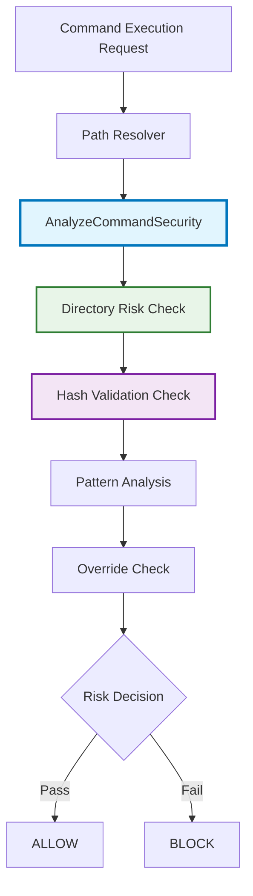

# アーキテクチャ設計書: セキュリティ検証メカニズムの統一

## 1. システム概要

### 1.1 設計目標
- パス制限撤廃による実行可能性の向上
- ハッシュ検証による同名ファイル誤実行防止
- リスクベース評価との統合による包括的セキュリティ

### 1.2 アーキテクチャ原則
- **単一責任**: AnalyzeCommandSecurityでセキュリティ判定を一元化
- **設定最小化**: skip_standard_pathsのみの簡素な設定
- **性能重視**: 標準ディレクトリでのハッシュ検証スキップ

## 2. システムアーキテクチャ

### 2.1 統合後のフロー



### 2.2 コンポーネント構成

#### 2.2.1 PathResolver（最大限簡素化）
```go
// internal/verification/path_resolver.go
type PathResolver struct {
    pathEnv           string
    cache             map[string]string
    mu                sync.RWMutex
    // セキュリティ関連フィールドを完全削除
    // security フィールド削除
    // パス制限関連フィールド削除
}

// ValidateCommandメソッドを完全削除
// validateCommandSafetyメソッドも完全削除
// セキュリティ検証は AnalyzeCommandSecurity で実行される

// PathResolverは純粋なパス解決コンポーネントに集中
// NewPathResolver(pathEnv string) *PathResolver
```

#### 2.2.2 Manager調整
```go
// internal/verification/manager.go の修正
func (m *Manager) ResolveAndValidateCommand(command string) (string, error) {
    if m.pathResolver == nil {
        return "", ErrPathResolverNotInitialized
    }

    // パス解決のみ実行
    resolvedPath, err := m.pathResolver.ResolvePath(command)
    if err != nil {
        return "", err
    }

    // ValidateCommand呼び出しを削除
    // セキュリティ検証は AnalyzeCommandSecurity で実行される

    return resolvedPath, nil
}
```

#### 2.2.3 統合セキュリティ分析エンジン
```go
// internal/runner/security/command_analysis.go の拡張
func AnalyzeCommandSecurity(resolvedPath string, args []string, globalConfig *runnertypes.GlobalConfig) (riskLevel runnertypes.RiskLevel, detectedPattern string, reason string, err error) {
    // 1. パス検証
    if !filepath.IsAbs(resolvedPath) {
        return runnertypes.RiskLevelUnknown, "", "", fmt.Errorf("%w: path must be absolute", ErrInvalidPath)
    }

    // 2. ディレクトリベースデフォルトリスク判定
    defaultRisk := getDefaultRiskByDirectory(resolvedPath)

    // 3. ハッシュ検証
    if shouldSkipHashValidation(resolvedPath, globalConfig) {
        // 標準ディレクトリ + SkipStandardPaths=true の場合はスキップ
    } else {
        if err := validateFileHash(resolvedPath); err != nil {
            return runnertypes.RiskLevelCritical, resolvedPath, fmt.Sprintf("Hash validation failed: %v", err), nil
        }
    }

    // 4. 既存パターン分析（高リスクパターン優先）
    if riskLevel, pattern, reason := checkCommandPatterns(resolvedPath, args, highRiskPatterns); riskLevel != runnertypes.RiskLevelUnknown {
        return riskLevel, pattern, reason, nil
    }

    // 5. setuid/setgid チェック
    if hasSetuidOrSetgid, setuidErr := hasSetuidOrSetgidBit(resolvedPath); setuidErr != nil {
        return runnertypes.RiskLevelHigh, resolvedPath, fmt.Sprintf("Unable to check setuid/setgid status: %v", setuidErr), nil
    } else if hasSetuidOrSetgid {
        return runnertypes.RiskLevelHigh, resolvedPath, "Executable has setuid or setgid bit set", nil
    }

    // 6. 中リスクパターン分析
    if riskLevel, pattern, reason := checkCommandPatterns(resolvedPath, args, mediumRiskPatterns); riskLevel != runnertypes.RiskLevelUnknown {
        return riskLevel, pattern, reason, nil
    }

    // 7. 個別コマンドオーバーライド適用
    if overrideRisk, found := getCommandRiskOverride(resolvedPath); found {
        return overrideRisk, resolvedPath, "Explicit risk level override", nil
    }

    // 8. デフォルトリスクレベル適用
    return defaultRisk, "", "Default directory-based risk level", nil
}
```

## 3. 詳細設計

### 3.1 ディレクトリベースリスク判定

```go
// internal/runner/security/directory_risk.go (新規作成)
package security

import (
    "path/filepath"
    "strings"
    "github.com/isseis/go-safe-cmd-runner/internal/runner/runnertypes"
)

// 標準ディレクトリ定義
var StandardDirectories = []string{
    "/bin",
    "/usr/bin",
    "/usr/local/bin",
    "/sbin",
    "/usr/sbin",
    "/usr/local/sbin",
}

// デフォルトリスクレベルマップ
var DefaultRiskLevels = map[string]runnertypes.RiskLevel{
    "/bin":             runnertypes.RiskLevelLow,
    "/usr/bin":         runnertypes.RiskLevelLow,
    "/usr/local/bin":   runnertypes.RiskLevelLow,
    "/sbin":            runnertypes.RiskLevelMedium,
    "/usr/sbin":        runnertypes.RiskLevelMedium,
    "/usr/local/sbin":  runnertypes.RiskLevelMedium,
}

// getDefaultRiskByDirectory はコマンドパスに基づくデフォルトリスクレベルを返す
func getDefaultRiskByDirectory(cmdPath string) runnertypes.RiskLevel {
    dir := filepath.Dir(cmdPath)

    // 完全一致チェック
    if risk, exists := DefaultRiskLevels[dir]; exists {
        return risk
    }

    // プレフィックスマッチ（サブディレクトリ対応）
    for stdDir, risk := range DefaultRiskLevels {
        if strings.HasPrefix(cmdPath, stdDir+"/") {
            return risk
        }
    }

    // デフォルト: 非標準ディレクトリは個別分析に委ねる
    return runnertypes.RiskLevelUnknown
}

// isStandardDirectory は標準ディレクトリかどうかを判定
func isStandardDirectory(cmdPath string) bool {
    dir := filepath.Dir(cmdPath)

    for _, stdDir := range StandardDirectories {
        if dir == stdDir || strings.HasPrefix(cmdPath, stdDir+"/") {
            return true
        }
    }
    return false
}
```

### 3.2 ハッシュ検証統合

```go
// internal/runner/security/hash_validation.go (新規作成)
package security

import (
    "github.com/isseis/go-safe-cmd-runner/internal/filevalidator"
)

// shouldSkipHashValidation はハッシュ検証をスキップするかを判定
func shouldSkipHashValidation(cmdPath string, globalConfig *runnertypes.GlobalConfig) bool {
    if !globalConfig.SkipStandardPaths {
        return false // SkipStandardPaths=false の場合は全て検証
    }

    return isStandardDirectory(cmdPath) // 標準ディレクトリのみスキップ
}

// validateFileHash はファイルのハッシュ検証を実行
func validateFileHash(cmdPath string) error {
    // 既存のfilevalidatorパッケージを活用
    validator := filevalidator.NewValidator()  // 実装に応じて調整
    return validator.ValidateFile(cmdPath)
}
```

### 3.3 個別コマンドオーバーライド

```go
// internal/runner/security/command_overrides.go (新規作成)
package security

import (
    "github.com/isseis/go-safe-cmd-runner/internal/runner/runnertypes"
)

// 個別コマンドのリスクレベルオーバーライド
var CommandRiskOverrides = map[string]runnertypes.RiskLevel{
    "/usr/bin/sudo":       runnertypes.RiskLevelCritical,
    "/bin/su":             runnertypes.RiskLevelCritical,
    "/usr/bin/curl":       runnertypes.RiskLevelMedium,
    "/usr/bin/wget":       runnertypes.RiskLevelMedium,
    "/usr/sbin/systemctl": runnertypes.RiskLevelHigh,
    "/usr/sbin/service":   runnertypes.RiskLevelHigh,
    "/bin/rm":             runnertypes.RiskLevelHigh,
    "/usr/bin/dd":         runnertypes.RiskLevelHigh,
}

// getCommandRiskOverride は個別コマンドのオーバーライドを取得
func getCommandRiskOverride(cmdPath string) (runnertypes.RiskLevel, bool) {
    risk, exists := CommandRiskOverrides[cmdPath]
    return risk, exists
}
```

## 4. 設定システム

### 4.1 GlobalConfig拡張

```go
// internal/runner/runnertypes/config.go - 既存のGlobalConfig構造体
type GlobalConfig struct {
    Timeout           int      `toml:"timeout"`
    WorkDir           string   `toml:"workdir"`
    LogLevel          string   `toml:"log_level"`
    VerifyFiles       []string `toml:"verify_files"`
    SkipStandardPaths bool     `toml:"skip_standard_paths"` // 既存フィールド活用
    EnvAllowlist      []string `toml:"env_allowlist"`
}
```

### 4.2 設定ファイル例

```toml
[global]
timeout = 300
workdir = "/tmp"
log_level = "info"
verify_files = ["config.toml"]
skip_standard_paths = false  # false: 全ファイル検証, true: 標準ディレクトリをスキップ
env_allowlist = ["PATH", "HOME"]
```

## 5. エラーハンドリング

### 5.1 エラー型定義

```go
// internal/runner/security/errors.go への追加
var (
    // ハッシュ検証関連エラー
    ErrHashValidationFailed = errors.New("hash validation failed")
    ErrHashManifestNotFound = errors.New("hash manifest not found")

    // 既存エラーの拡張
    ErrCommandNotAllowed = errors.New("command not allowed") // パス制限から汎用エラーに変更
)

// HashValidationError はハッシュ検証失敗の詳細エラー
type HashValidationError struct {
    Command      string
    ExpectedHash string
    ActualHash   string
    Err          error
}

func (e *HashValidationError) Error() string {
    return fmt.Sprintf("hash validation failed for %s: expected %s, got %s",
        e.Command, e.ExpectedHash, e.ActualHash)
}
```

## 6. テスト戦略

### 6.1 ユニットテスト

```go
// internal/runner/security/command_analysis_test.go への追加
func TestAnalyzeCommandSecurity_DirectoryBasedRisk(t *testing.T) {
    tests := []struct {
        name         string
        cmdPath      string
        expectedRisk runnertypes.RiskLevel
    }{
        {"bin directory", "/bin/ls", runnertypes.RiskLevelLow},
        {"usr/bin directory", "/usr/bin/git", runnertypes.RiskLevelLow},
        {"sbin directory", "/sbin/iptables", runnertypes.RiskLevelMedium},
        {"custom directory", "/opt/custom/tool", runnertypes.RiskLevelUnknown},
    }

    for _, tt := range tests {
        t.Run(tt.name, func(t *testing.T) {
            risk := getDefaultRiskByDirectory(tt.cmdPath)
            assert.Equal(t, tt.expectedRisk, risk)
        })
    }
}

func TestAnalyzeCommandSecurity_HashValidation(t *testing.T) {
    tests := []struct {
        name           string
        cmdPath        string
        skipStdPaths   bool
        hashValidFail  bool
        expectedRisk   runnertypes.RiskLevel
        expectedReason string
    }{
        {
            name:           "standard dir skip hash",
            cmdPath:        "/bin/ls",
            skipStdPaths:   true,
            expectedRisk:   runnertypes.RiskLevelLow,
        },
        {
            name:           "custom dir hash fail",
            cmdPath:        "/opt/tool",
            hashValidFail:  true,
            expectedRisk:   runnertypes.RiskLevelCritical,
            expectedReason: "Hash validation failed",
        },
    }

    for _, tt := range tests {
        t.Run(tt.name, func(t *testing.T) {
            // テスト実装
        })
    }
}
```

## 7. パフォーマンス考慮事項

### 7.1 最適化戦略

- **ハッシュ検証スキップ**: 標準ディレクトリでの性能向上
- **ディレクトリ判定キャッシュ**: 頻繁なディレクトリ判定の最適化
- **設定キャッシュ**: 設定読み込みの最適化

### 7.2 メトリクス収集

```go
// internal/runner/security/metrics.go (新規作成)
type SecurityMetrics struct {
    HashValidationCount    prometheus.Counter
    HashValidationSkipped  prometheus.Counter
    DirectoryRiskHits      prometheus.CounterVec
    ValidationDuration     prometheus.Histogram
}

func (m *SecurityMetrics) RecordHashValidation(skipped bool, duration time.Duration) {
    if skipped {
        m.HashValidationSkipped.Inc()
    } else {
        m.HashValidationCount.Inc()
    }
    m.ValidationDuration.Observe(duration.Seconds())
}
```

この統合アーキテクチャにより、パス制限を撤廃しつつ、ハッシュ検証とリスクベース評価で強固なセキュリティを実現します。
