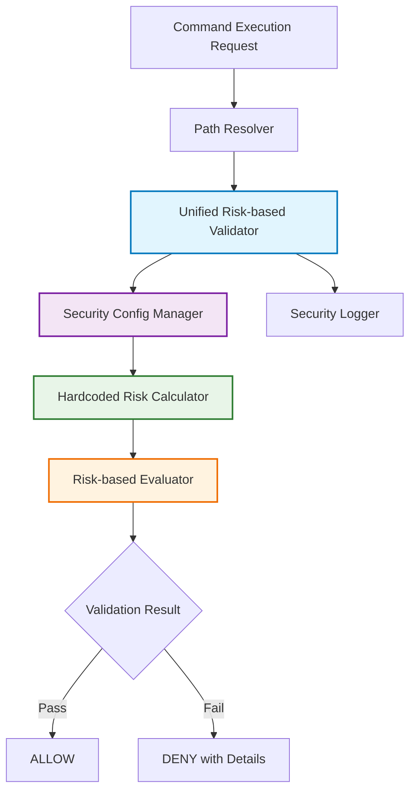
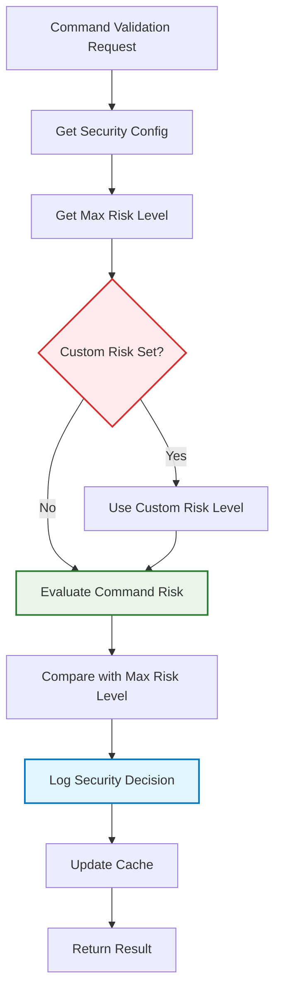

# アーキテクチャ設計書: セキュリティ検証メカニズムの統一

## 1. 概要

### 1.1 設計目標
PathResolver.ValidateCommand とリスクレベル評価システムを統一し、ハードコーディングされたリスクベース計算による単一のセキュリティメカニズムを構築する。

### 1.2 設計原則
- **統一性**: 全セキュリティ検証をリスクベース単一システムで実行
- **互換性**: 現状のハードコーディングされたホワイトリストとの互換性保証
- **拡張性**: 将来のセキュリティ要件に対応可能な設計

## 2. システムアーキテクチャ

### 2.1 統合後のアーキテクチャ概要



### 2.2 コンポーネント構成

#### 2.2.1 統合リスクベース検証機能
```go
// 既存のinternal/runner/securityパッケージを拡張
// internal/runner/security/validator.goに統合機能を追加
type ValidatorWithRiskLevel interface {
    ValidateCommand(resolvedPath string) error
    ValidateCommandWithRisk(ctx context.Context, resolvedPath string, args []string, maxRiskLevel runnertypes.RiskLevel) error
}

// 既存のRiskLevel型を使用
// internal/runner/runnertypes/config.goで定義済み
// type RiskLevel int // 既存
// const (
//     RiskLevelUnknown RiskLevel = iota
//     RiskLevelLow
//     RiskLevelMedium
//     RiskLevelHigh
//     RiskLevelCritical
// )
```

#### 2.2.2 既存セキュリティ設定の活用
```go
// 既存のinternal/runner/security/types.goで定義済み
// type Config struct {
//     AllowedCommands []string
//     // ... 他の設定
// }

// 既存のinternal/runner/runnertypes/config.goで定義済み
// type Command struct {
//     MaxRiskLevel string `toml:"max_risk_level"`
//     // ...
// }
// func (c *Command) GetMaxRiskLevel() (RiskLevel, error)

// 既存のinternal/runner/security/command_analysis.goで実装済み
// func AnalyzeCommandSecurity(resolvedPath string, args []string) (riskLevel runnertypes.RiskLevel, detectedPattern string, reason string, err error)
```

## 3. データフロー

### 3.1 統合リスクベース検証フロー



## 4. インターフェース設計

### 4.1 Path Resolver Integration

```go
// internal/verification/path_resolver.go - 拡張
type PathResolver struct {
    // 既存フィールド
    searchPaths []string
    cache       map[string]string

    // 新規追加（統合されたセキュリティ）
    riskValidator    security.UnifiedValidator
    configManager    security.SecurityConfigManager
}

// ValidateCommand - 既存メソッドを拡張
func (pr *PathResolver) ValidateCommand(resolvedPath string) error {
    if pr.unifiedValidator != nil {
        // 新しい統合検証システムを使用
        return pr.unifiedValidator.ValidateCommand(context.Background(), resolvedPath)
    }

    // フォールバック: 既存のシステム
    return pr.validateCommandSafety(resolvedPath)
}

// ValidateCommandWithArgs - 新規メソッド
func (pr *PathResolver) ValidateCommandWithArgs(resolvedPath string, args []string) error {
    if pr.unifiedValidator != nil {
        return pr.unifiedValidator.ValidateCommandWithArgs(context.Background(), resolvedPath, args)
    }

    // Legacy fallback
    return pr.validateCommandSafety(resolvedPath)
}
```

### 4.2 PathResolverの統合機能拡張

```go
// internal/verification/path_resolver.go の拡張
type PathResolver struct {
    // 既存フィールド...
    pathEnv           string
    security          *security.Validator
    cache             map[string]string
    // 新規追加: リスクベース検証サポート
    useRiskBasedValidation bool
}

func (v *DefaultUnifiedValidator) ValidateCommand(ctx context.Context, resolvedPath string) error {
    return v.ValidateCommandWithArgs(ctx, resolvedPath, []string{})
}

func (v *DefaultUnifiedValidator) ValidateCommandWithArgs(ctx context.Context, resolvedPath string, args []string) error {
    // 1. Check cache
    if result, found := v.cache.Get(resolvedPath, args); found {
        v.logger.Debug("validation cache hit", "path", resolvedPath)
        return result
    }

    // 2. Determine validation mode
    mode := v.config.GetValidationMode()

    var err error
    switch mode {
    case ValidationModeWhitelist:
        err = v.validateWithWhitelist(resolvedPath)
    case ValidationModeRiskBased:
        err = v.validateWithRiskLevel(resolvedPath, args)
    default:
        err = fmt.Errorf("unsupported validation mode: %v", mode)
    }

    // 3. Cache result
    v.cache.Set(resolvedPath, args, err)

    // 4. Log decision
    v.logValidationDecision(resolvedPath, args, mode, err)

    return err
}

func (v *DefaultUnifiedValidator) validateWithRiskLevel(resolvedPath string, args []string) error {
    // Use existing risk analysis
    riskLevel, pattern, reason, err := security.AnalyzeCommandSecurity(resolvedPath, args)
    if err != nil {
        return fmt.Errorf("risk analysis failed: %w", err)
    }

    maxAllowedRisk := v.config.GetDefaultMaxRiskLevel()
    if riskLevel > maxAllowedRisk {
        return &SecurityViolationError{
            Command:         resolvedPath,
            DetectedRisk:    riskLevel.String(),
            DetectedPattern: pattern,
            MaxAllowedRisk:  maxAllowedRisk.String(),
            Reason:          reason,
            Phase:           "verification",
        }
    }

    return nil
}
```

### 4.3 Error Types

```go
// internal/security/errors.go
type SecurityViolationError struct {
    Command         string
    DetectedRisk    string
    DetectedPattern string
    MaxAllowedRisk  string
    Reason          string
    Phase           string
    Timestamp       time.Time
}

func (e *SecurityViolationError) Error() string {
    return fmt.Sprintf("command_verification_failed - Command blocked during %s phase: %s (risk: %s > %s)",
        e.Phase, e.Command, e.DetectedRisk, e.MaxAllowedRisk)
}

type ConfigurationError struct {
    Setting     string
    Value       string
    ValidValues []string
    Location    string
}

func (e *ConfigurationError) Error() string {
    return fmt.Sprintf("invalid_security_configuration - %s: invalid value '%s', valid options: %v",
        e.Setting, e.Value, e.ValidValues)
}
```
## 5. （削除）

## 6. （削除）

## 7. 監査・ログ設計

### 7.1 Security Logging

```go
// internal/security/logger.go
type SecurityLogger interface {
    LogValidationDecision(decision *ValidationDecision)
    LogConfigChange(change *ConfigChange)
}

type ValidationDecision struct {
    Timestamp       time.Time
    Command         string
    Arguments       []string
    ValidationMode  ValidationMode
    Result          ValidationResult
    RiskLevel       RiskLevel
    Pattern         string
    Reason          string
    ProcessID       int
    UserID          int
    GroupID         int
}

type ConfigChange struct {
    Timestamp    time.Time
    ChangedBy    string
    OldConfig    *SecurityConfig
    NewConfig    *SecurityConfig
    ChangeReason string
}
```

### 7.2 Audit Trail

```go
// internal/security/audit.go
type AuditTrail interface {
    RecordSecurityEvent(event *SecurityEvent)
    QueryEvents(filter *EventFilter) ([]*SecurityEvent, error)
    GenerateReport(period TimePeriod) (*SecurityReport, error)
}

type SecurityEvent struct {
    EventID     string
    Timestamp   time.Time
    EventType   SecurityEventType
    Severity    Severity
    Command     string
    UserContext UserContext
    Decision    ValidationResult
    Metadata    map[string]interface{}
}

type SecurityReport struct {
    Period           TimePeriod
    TotalValidations int64
    BlockedCommands  int64
    RiskDistribution map[RiskLevel]int64
    TopBlockedCommands []CommandFrequency
    SecurityTrends   []TrendData
}
```

## 8. 性能考慮事項

### 8.1 Performance Optimization

- **Caching Strategy**: LRU cache with TTL for validation results
- **Risk Analysis Optimization**: Reuse existing optimized `AnalyzeCommandSecurity`
- **Pattern Compilation**: Pre-compile regex patterns at startup
- **Concurrent Processing**: Thread-safe cache and validation logic

### 8.2 Performance Monitoring

```go
// internal/security/metrics.go
type PerformanceMetrics struct {
    ValidationLatency prometheus.Histogram
    CacheHitRate     prometheus.Counter
    ValidationCount  prometheus.Counter
    ErrorRate        prometheus.Counter
}

func (pm *PerformanceMetrics) RecordValidation(duration time.Duration, cacheHit bool, err error) {
    pm.ValidationLatency.Observe(duration.Seconds())
    pm.ValidationCount.Inc()

    if cacheHit {
        pm.CacheHitRate.Inc()
    }

    if err != nil {
        pm.ErrorRate.Inc()
    }
}
```

## 9. テスト戦略

### 9.1 Unit Testing

- **Unified Validator**: 各検証モードの単体テスト
- **Config Manager**: 設定解析と検証のテスト

### 9.2 Integration Testing

- **End-to-End**: PathResolver から Unified Validator までの完全フロー
- **Performance**: 負荷テストとベンチマーク

### 9.3 Security Testing

- **Risk Level Validation**: 各リスクレベルでの適切なブロック
- **Bypass Prevention**: セキュリティ迂回の防止テスト
- **Configuration Security**: 設定ファイルのセキュリティ検証

この統合アーキテクチャにより、go-safe-cmd-runner は統一され、保守しやすく、拡張可能なセキュリティシステムを獲得します。
