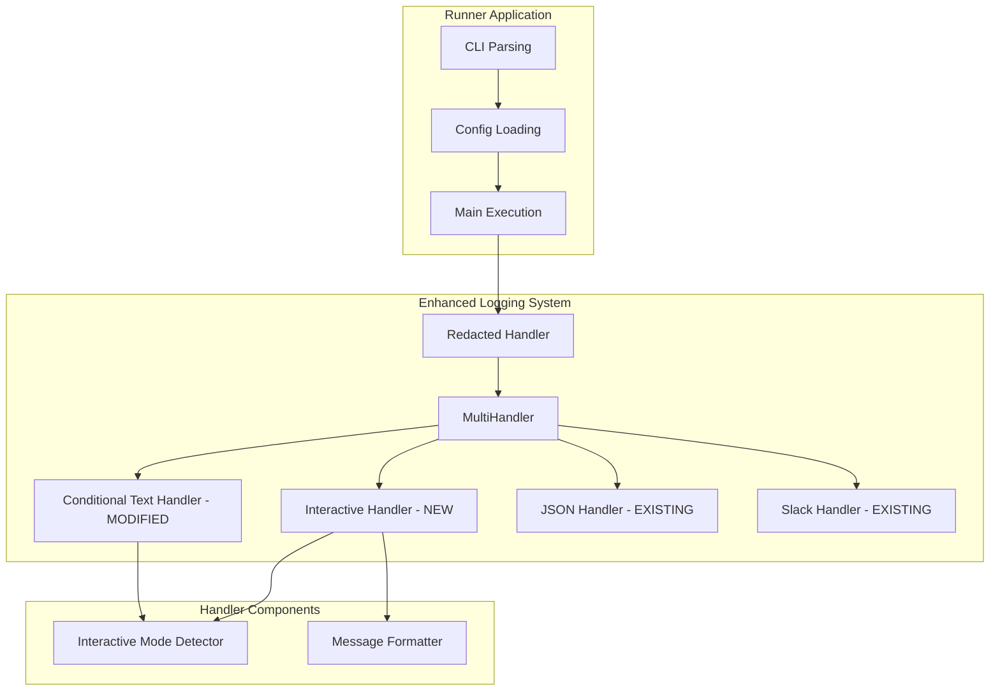
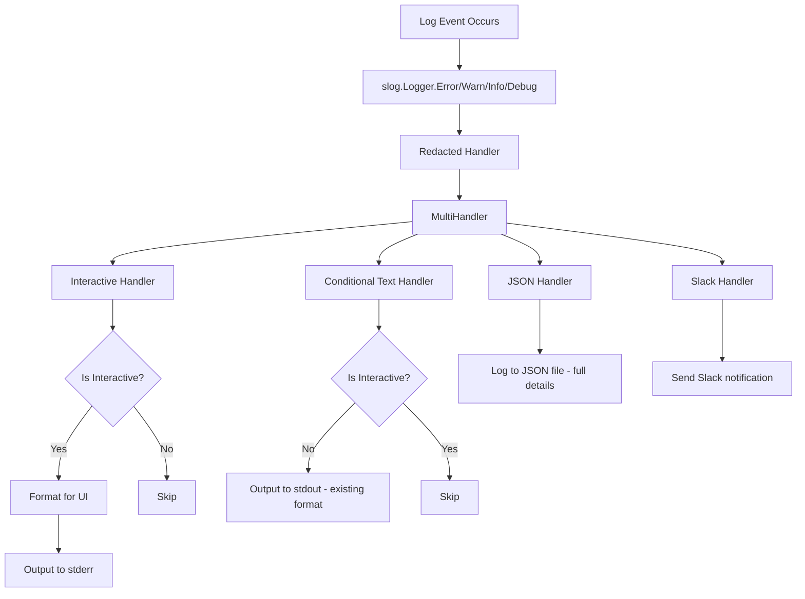
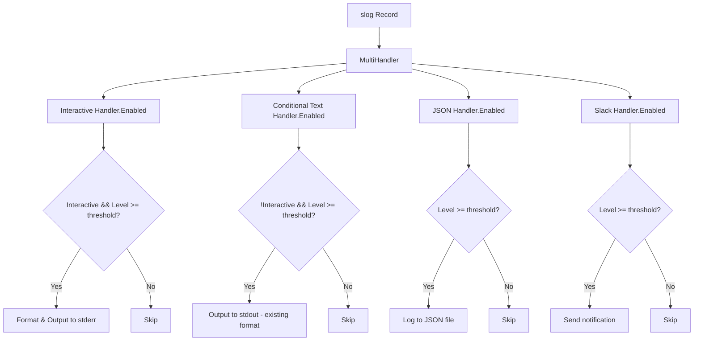

# 対話的UI改善 アーキテクチャ設計書

## 1. アーキテクチャ概要

### 1.1 設計原則
- **既存システムとの統合**: 現在の `internal/logging` パッケージを拡張
- **責任分離**: 対話モード検知、メッセージフォーマット、出力制御を分離
- **後方互換性**: 非対話的利用への影響を最小化
- **設定の一元化**: 既存の `--log-level` オプションを活用

### 1.2 システム構成


## 2. コンポーネント設計

### 2.1 Interactive Handler (新規)
対話的環境向けのログハンドラー

#### 2.1.1 責任
- 対話的環境での適切なログメッセージフォーマット
- ターミナル出力の制御
- カラー表示の管理
- ログファイル参照ヒント情報の提供

#### 2.1.2 実装方法
```go
type InteractiveHandler struct {
    detector     InteractiveDetector
    formatter    MessageFormatter
    level        slog.Level
    output       io.Writer // os.Stderr
    logFilePath  string    // 現在のログファイルパス
    lineTracker  *LogLineTracker // ログファイル行数追跡
}

func NewInteractiveHandler(level slog.Level, logFilePath string) *InteractiveHandler {
    return &InteractiveHandler{
        detector:    NewInteractiveDetector(),
        formatter:   NewMessageFormatter(),
        level:       level,
        output:      os.Stderr,
        logFilePath: logFilePath,
        lineTracker: NewLogLineTracker(),
    }
}

func (h *InteractiveHandler) Enabled(ctx context.Context, level slog.Level) bool {
    return h.detector.IsInteractive() && level >= h.level
}

func (h *InteractiveHandler) Handle(ctx context.Context, r slog.Record) error {
    if !h.detector.IsInteractive() {
        return nil // 非対話的環境では何もしない
    }

    // メインメッセージの生成
    message := h.formatter.FormatRecord(r)

    // ログファイルヒント情報の追加（エラーレベル以上の場合）
    if r.Level >= slog.LevelError && h.logFilePath != "" {
        estimatedLine := h.lineTracker.EstimateCurrentLine()
        logHint := h.formatLogFileHint(estimatedLine)
        message = message + "\n" + logHint
    }

    _, err := fmt.Fprintf(h.output, "%s\n", message)

    // 行数追跡を更新
    h.lineTracker.IncrementLine()

    return err
}

func (h *InteractiveHandler) formatLogFileHint(estimatedLine int) string {
    if h.detector.SupportsColor() {
        return fmt.Sprintf("\033[90mDetails: %s (around line %d)\033[0m",
            h.logFilePath, estimatedLine)
    }
    return fmt.Sprintf("Details: %s (around line %d)", h.logFilePath, estimatedLine)
}
```

### 2.2 Interactive Mode Detector
対話的実行環境を検知する機能（共有コンポーネント）

#### 2.2.1 責任
- ターミナル環境の検出
- CI/CD環境の判定
- カラー表示対応の判定

#### 2.2.2 実装方法
```go
type InteractiveDetector interface {
    IsInteractive() bool
    SupportsColor() bool
}

type DefaultInteractiveDetector struct {
    forceInteractive *bool
    noColor          bool
}

func (d *DefaultInteractiveDetector) IsInteractive() bool {
    if d.forceInteractive != nil {
        return *d.forceInteractive
    }
    return term.IsTerminal(int(os.Stdout.Fd())) && os.Getenv("CI") == ""
}
```

### 2.3 Log Line Tracker (新規)
ログファイルの行数を追跡してヒント情報を提供する機能

#### 2.3.1 責任
- ログファイルへの書き込み行数の概算追跡
- 複数ハンドラー間での行数同期
- メモリ効率的な行数管理

#### 2.3.2 実装方法
```go
type LogLineTracker struct {
    currentLine int
    mutex       sync.RWMutex
}

func NewLogLineTracker() *LogLineTracker {
    return &LogLineTracker{
        currentLine: 1,
    }
}

func (lt *LogLineTracker) IncrementLine() {
    lt.mutex.Lock()
    defer lt.mutex.Unlock()
    lt.currentLine++
}

func (lt *LogLineTracker) EstimateCurrentLine() int {
    lt.mutex.RLock()
    defer lt.mutex.RUnlock()
    return lt.currentLine
}

// グローバルなLine Trackerを共有（複数ハンドラー間で同期）
var globalLineTracker *LogLineTracker

func init() {
    globalLineTracker = NewLogLineTracker()
}
```

### 2.4 Message Formatter
ログメッセージの形式を決定する機能（共有コンポーネント）

#### 2.4.1 責任
- slog.Record から適切なメッセージフォーマットを生成
- ログ情報の構造化
- カラー表示の制御

#### 2.4.2 実装方法
```go
type MessageFormatter interface {
    FormatRecord(r slog.Record) string
}

type DefaultMessageFormatter struct {
    supportsColor bool
}

func (f *DefaultMessageFormatter) FormatRecord(r slog.Record) string {
    // slog.Record の Attrs から必要な情報を抽出
    var logType, message, component, runID string

    r.Attrs(func(a slog.Attr) bool {
        switch a.Key {
        case "error_type", "log_type":
            logType = a.Value.String()
        case "error_message", "message":
            message = a.Value.String()
        case "component":
            component = a.Value.String()
        case "run_id":
            runID = a.Value.String()
        }
        return true
    })

    return f.formatInteractiveMessage(logType, message, component)
}
```

## 3. データフロー

### 3.1 ログイベント発生時のフロー


### 3.2 ログレベル制御フロー


## 4. 既存システムとの統合

### 4.1 既存ハンドラーとの関係

現在のログシステムは以下の3つのハンドラーを使用：
- **slog.NewTextHandler(os.Stdout)**: 人間読み取り用サマリー出力
- **slog.NewJSONHandler(logFile)**: 詳細ログをJSONファイルに出力
- **SlackHandler**: 通知送信

#### 4.1.1 既存TextHandlerの扱い
現在のTextHandlerは非対話的環境でも常にstdoutに出力するため、以下の方針で統合：

```go
// 既存のログシステムの修正
func setupLogging(config Config) error {
    level := parseLogLevel(config.Level)
    var handlers []slog.Handler

    // 1. 既存のTextHandler を ConditionalTextHandler で置き換え
    // （非対話的環境でstdoutに出力、対話的環境では出力しない）
    originalTextHandler := slog.NewTextHandler(os.Stdout, &slog.HandlerOptions{
        Level: slog.LevelInfo,
    })
    conditionalTextHandler := NewConditionalTextHandler(originalTextHandler)
    handlers = append(handlers, conditionalTextHandler)

    // 2. 新しいInteractiveHandler を追加
    // （対話的環境でstderrに出力、非対話的環境では出力しない）
    logFilePath := ""
    if config.LogDir != "" {
        logFilePath = generateLogPath(config) // ログファイルパスを共有
    }
    interactiveHandler := NewInteractiveHandler(level, logFilePath)
    handlers = append(handlers, interactiveHandler)

    // 3. 既存のJSONHandler を維持（ファイル出力）
    if config.LogDir != "" {
        logPath := generateLogPath(config)
        jsonHandler := createJSONHandler(logPath, level, config)
        handlers = append(handlers, jsonHandler)
    }

    // 4. 既存のSlackHandler を維持
    if config.SlackWebhookURL != "" {
        slackHandler, err := logging.NewSlackHandler(config.SlackWebhookURL, config.RunID)
        if err != nil {
            return err
        }
        handlers = append(handlers, slackHandler)
    }

    // MultiHandlerで統合
    multiHandler, err := NewMultiHandler(handlers...)
    if err != nil {
        return err
    }

    logger := slog.New(redaction.NewRedactedHandler(multiHandler))
    slog.SetDefault(logger)
    return nil
}

// ConditionalTextHandler の実装
func NewConditionalTextHandler(textHandler slog.Handler) *ConditionalTextHandler {
    return &ConditionalTextHandler{
        textHandler: textHandler,
        detector:    NewInteractiveDetector(nil, false),
    }
}
```

#### 4.1.2 ConditionalTextHandler の完全実装
上記4.1.1で参照される ConditionalTextHandler の完全実装：

```go
// ConditionalTextHandler は対話モードに応じてTextHandlerの出力を制御する
type ConditionalTextHandler struct {
    textHandler slog.Handler
    detector    InteractiveDetector
}

func NewConditionalTextHandler(textHandler slog.Handler) *ConditionalTextHandler {
    return &ConditionalTextHandler{
        textHandler: textHandler,
        detector:    NewInteractiveDetector(nil, false),
    }
}

func (h *ConditionalTextHandler) Enabled(ctx context.Context, level slog.Level) bool {
    // 非対話的環境でのみ有効
    return !h.detector.IsInteractive() && h.textHandler.Enabled(ctx, level)
}

func (h *ConditionalTextHandler) Handle(ctx context.Context, r slog.Record) error {
    if h.detector.IsInteractive() {
        return nil // 対話的環境では何もしない
    }
    return h.textHandler.Handle(ctx, r)
}

func (h *ConditionalTextHandler) WithAttrs(attrs []slog.Attr) slog.Handler {
    return &ConditionalTextHandler{
        textHandler: h.textHandler.WithAttrs(attrs),
        detector:    h.detector,
    }
}

func (h *ConditionalTextHandler) WithGroup(name string) slog.Handler {
    return &ConditionalTextHandler{
        textHandler: h.textHandler.WithGroup(name),
        detector:    h.detector,
    }
}
```

#### 4.1.3 現在のmain.goでの実装箇所
```go
// cmd/runner/main.go の該当部分（line 462付近）の修正
// 変更前:
// textHandler := slog.NewTextHandler(os.Stdout, &slog.HandlerOptions{
//     Level: slog.LevelInfo,
// })
// handlers = append(handlers, textHandler)

// 変更後:
originalTextHandler := slog.NewTextHandler(os.Stdout, &slog.HandlerOptions{
    Level: slog.LevelInfo,
})
conditionalTextHandler := logging.NewConditionalTextHandler(originalTextHandler)
handlers = append(handlers, conditionalTextHandler)

// 新しいInteractiveHandlerを追加（ログファイルパス付き）
logFilePath := ""
if config.LogDir != "" {
    logFilePath = filepath.Join(config.LogDir, fmt.Sprintf("%s_%s_%s.json", hostname, timestamp, config.RunID))
}
interactiveHandler := logging.NewInteractiveHandler(slogLevel, logFilePath)
handlers = append(handlers, interactiveHandler)
```

#### 4.1.4 ログファイルヒント出力例
```
Config file parsing failed at line 15: expected key but found ']'. Check TOML syntax
Details: /var/log/runner/host_20250126_143022_01K3M7.json (around line 45)

Cannot access config file '/opt/app/config.toml': permission denied. Check file permissions
Details: /var/log/runner/host_20250126_143022_01K3M7.json (around line 52)
```

### 4.2 現在の `HandlePreExecutionError` の修正
```go
// 既存の関数はそのまま維持し、slogに委託
func HandlePreExecutionError(errorType ErrorType, errorMsg, component, runID string) {
    // 従来のstderr出力を削除し、slogに委託
    slog.Error("Pre-execution error occurred",
        "log_type", string(errorType),
        "message", errorMsg,
        "component", component,
        "run_id", runID,
        "slack_notify", true,
        "message_type", "pre_execution_error",
    )

    // RUN_SUMMARYは互換性のため維持
    fmt.Printf("RUN_SUMMARY run_id=%s exit_code=1 status=pre_execution_error duration_ms=0 verified=0 skipped=0 failed=0 warnings=0 errors=1\n", runID)
}
```

### 4.3 統合方針まとめ

#### 4.3.1 ハンドラーの役割分担
- **Interactive Handler**: 対話的環境でのユーザーフレンドリーなログメッセージ（stderr） + ログファイルヒント
- **Conditional Text Handler**: 非対話的環境での従来のテキスト出力（stdout）
- **JSON Handler**: 詳細ログの永続化（ファイル）+ 行数追跡
- **Slack Handler**: リアルタイム通知

#### 4.3.2 後方互換性の保証
1. 非対話的環境では既存のTextHandler出力を維持
2. `HandlePreExecutionError` のAPIは変更せず
3. RUN_SUMMARY 出力は互換性のため継続
4. ログファイル形式は変更なし

#### 4.3.3 段階的移行戦略
1. **Phase 1**: LogLineTrackerとInteractiveHandlerを追加
2. **Phase 2**: ConditionalTextHandlerを追加して既存TextHandlerを置き換え
3. **Phase 3**: ログファイルヒント機能を有効化
4. **Phase 4**: `HandlePreExecutionError` をslog委託に変更
5. **Phase 5**: 必要に応じてRUN_SUMMARY出力の整理

#### 4.3.4 ログファイルヒント機能の制御
- **表示条件**: エラーレベル以上 && 対話的環境 && ログファイルが設定済み
- **行数精度**: 概算値（±5行程度の誤差を許容）
- **パフォーマンス**: 行数追跡のオーバーヘッドは最小限

## 5. エラーハンドリング

### 5.1 後退戦略（Fallback Strategy）
対話モード検知やメッセージフォーマットに失敗した場合の対応

```go
func (c *DefaultOutputController) HandlePreExecutionError(ctx context.Context, errorType ErrorType, details ErrorDetails) {
    defer func() {
        if r := recover(); r != nil {
            // フォールバック: 既存の形式でエラーを出力
            fmt.Fprintf(os.Stderr, "Error: %s - %s (run_id: %s)\n",
                errorType, details.Message, details.RunID)
        }
    }()

    // 通常の処理
    if c.detector.IsInteractive() {
        c.handleInteractiveError(errorType, details)
    } else {
        c.handleMachineError(errorType, details)
    }
}
```

### 5.2 テスト容易性
```go
type MockInteractiveDetector struct {
    interactive bool
    color       bool
}

func (m *MockInteractiveDetector) IsInteractive() bool { return m.interactive }
func (m *MockInteractiveDetector) SupportsColor() bool { return m.color }
```

## 6. パフォーマンス考慮事項

### 6.1 初期化コスト
- Interactive Detector の初期化は一度のみ実行
- メッセージテンプレートは事前にコンパイル済み状態で保持
- ログレベル判定の最適化

### 6.2 メモリ使用量
- エラー詳細情報の構造化によるメモリ使用量増加は最小限
- テンプレートエンジンは軽量な実装を選択
- Context map の使用は必要最小限に限定

## 7. 将来拡張性

### 7.1 多言語対応
```go
type MessageLocalizer interface {
    LocalizeMessage(errorType ErrorType, details ErrorDetails, locale string) string
}
```

### 7.2 カスタムフォーマッター
```go
type CustomMessageFormatter struct {
    templates map[ErrorType]string
}
```

### 7.3 プラグイン対応
```go
type FormatterPlugin interface {
    Name() string
    FormatMessage(errorType ErrorType, details ErrorDetails) string
}
```
