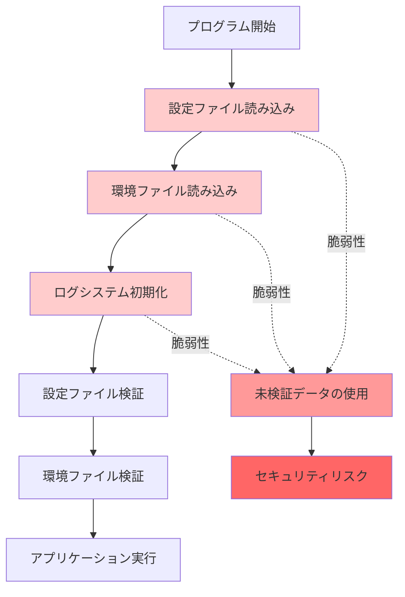
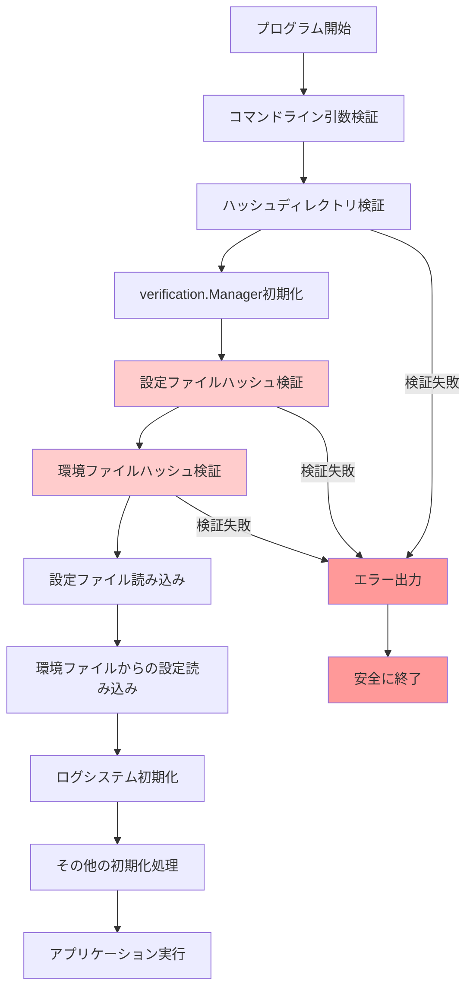
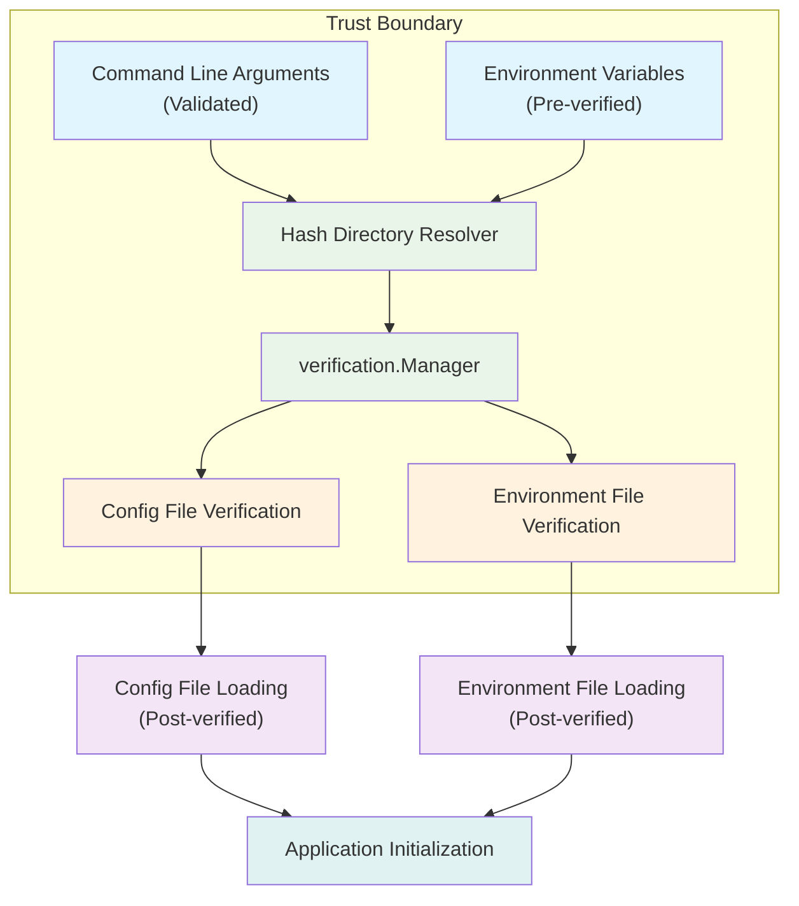
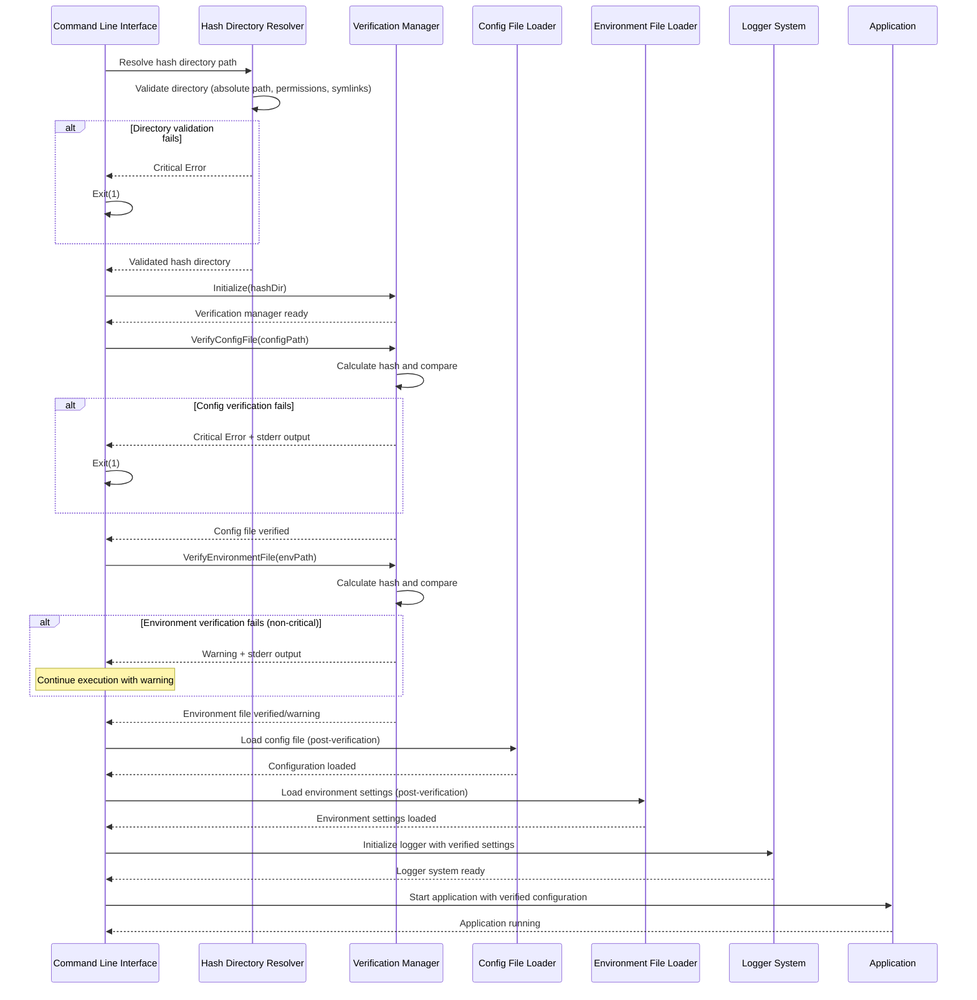
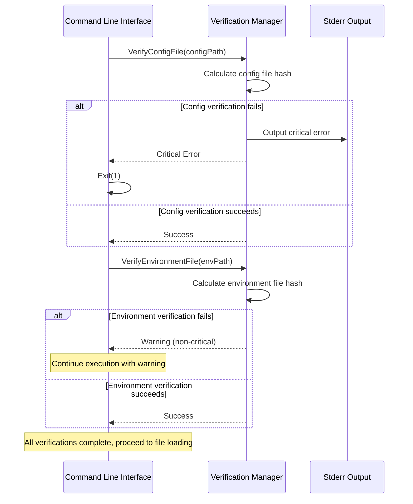
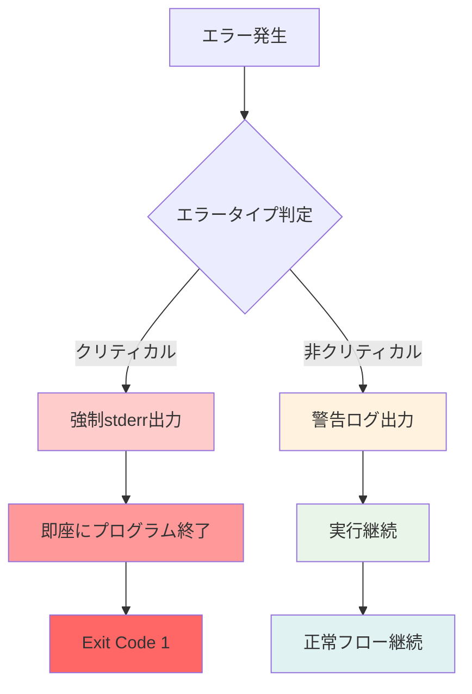
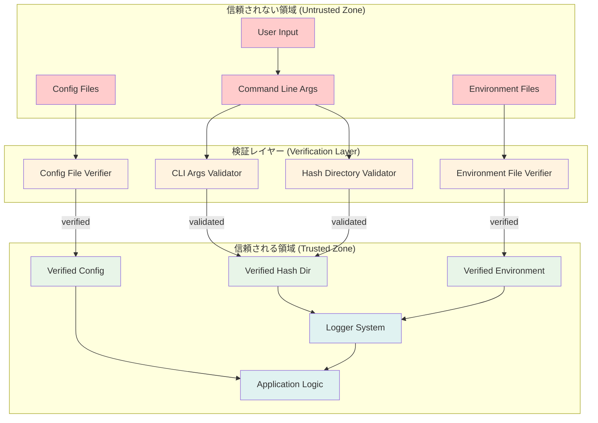

# アーキテクチャ設計書：設定ファイル検証タイミングの修正

## 1. 概要 (Overview)

本ドキュメントは、go-safe-cmd-runnerにおける設定ファイル検証タイミングのセキュリティ脆弱性を修正するためのアーキテクチャ設計を定義する。

### 1.1. 設計方針

- **セキュリティファースト**: 未検証データによるシステム動作を完全に排除
- **フェイルセーフ**: 検証失敗時は安全にプログラムを終了
- **最小権限の原則**: 必要最小限のデータのみ信頼境界内で使用
- **検証可能性**: 実行フローが明確で監査可能

### 1.2. 抽象度レベル

本アーキテクチャ設計書では、以下の抽象度で設計を記述する：
- **システム全体のフロー**: シーケンス図とフローチャートで表現
- **コンポーネント間関係**: 依存関係図で表現
- **主要インターフェース**: 型定義とシグネチャのみ（実装は詳細仕様書）
- **設計パターン**: 概念レベルでの説明

## 2. 現在のアーキテクチャの問題点

### 2.1. 実行フローの問題



### 2.2. セキュリティ脆弱性

- **設定ファイル依存の初期化**: 未検証の`workdir`, `log_level`設定の使用
- **環境ファイル依存の初期化**: 未検証のSlack WebhookURL等の使用
- **信頼境界の混乱**: 検証前後のデータが混在

## 3. 新しいアーキテクチャ設計

### 3.1. セキュア実行フロー



### 3.2. コンポーネント関係図



### 3.3. 詳細な実行シーケンス

#### 3.3.1. メイン実行フローのシーケンス図



#### 3.3.2. 検証処理の実行フロー



### 3.4. エラーハンドリング設計

#### 3.4.1. エラー処理フロー



#### 3.4.2. エラーレベル分類

- **クリティカルエラー**: システムの安全性に直結する検証失敗
  - 設定ファイルハッシュ検証失敗
  - ハッシュディレクトリアクセス失敗
  - 必須パラメータ不足
- **非クリティカルエラー（警告）**: 実行継続可能な問題
  - 環境ファイルハッシュ検証失敗（環境ファイルは任意のため）
  - パフォーマンス関連の問題

## 4. インターフェース設計

### 4.1. コア インターフェース

主要なコンポーネント間の契約を定義するインターフェース：

```go
// HashDirectoryResolver - ハッシュディレクトリの解決と検証
type HashDirectoryResolver interface {
    Resolve() (string, error)
    Validate(path string) error
}

// PreVerifier - 事前検証システム
type PreVerifier interface {
    VerifyConfigFile(path string) error
    VerifyEnvironmentFile(path string) error
}

// CriticalLogger - 強制ログ出力
type CriticalLogger interface {
    LogCritical(format string, args ...interface{})
    LogVerificationFailure(component string, err error)
}

```

### 4.2. データ型定義

```go
// ConfigSource - 設定値のソース
type ConfigSource int
const (
    ConfigSourceCommandLine ConfigSource = iota
    ConfigSourceEnvironment
    ConfigSourceDefault
)

// HashDirectoryError - ハッシュディレクトリエラーの詳細分類
type HashDirectoryError struct {
    Type    string // エラータイプ（"not_absolute", "not_exists", "symlink", etc.）
    Path    string // 問題のあるパス
    Cause   error  // 根本原因
}
```

## 5. セキュリティアーキテクチャ

### 5.1. 信頼境界の設計



### 5.2. 検証処理パターン

検証処理は以下のシンプルなパターンで実装：

- **設定ファイル検証**: クリティカルエラー（失敗時は即座に終了）
- **環境ファイル検証**: 非クリティカルエラー（警告として記録し実行継続）
- **段階的検証**: 前の検証が成功した場合のみ次の検証を実行

## 6. 非機能要件

### 6.1. パフォーマンス要件

- **起動時間**: 検証追加による起動時間増加は100ms未満
- **メモリ使用量**: verification.Manager追加メモリ使用量は10MB未満
- **ハッシュ計算**: ファイルサイズ1MBあたり50ms未満

### 6.2. 運用要件

- **ログ出力**: クリティカルエラーは必ずstderrに出力
- **監視項目**: 検証成功/失敗率、検証処理時間、ハッシュディレクトリソース
- **可用性**: 検証失敗時の確実なプログラム停止

## 7. 設計原則

### 7.1. セキュリティ原則

- **デフォルト拒否**: 検証が完了するまで一切の操作を許可しない
- **早期検証**: 可能な限り早期に全ての入力を検証
- **明示的エラー**: セキュリティ関連エラーは明確に分類・出力

### 7.2. 設計パターン

- **責任の分離**: 検証・実行・ログ出力の明確な責任分担
- **チェーンオブレスポンシビリティ**: 複数検証ステップの連鎖実行
- **依存性注入**: テスト可能性と柔軟性の確保

## 8. マイグレーション戦略

### 8.1. 段階的移行

1. **Phase 1**: 新しい検証フローの実装
2. **Phase 2**: 既存フローとの並行動作
3. **Phase 3**: 既存フローの無効化
4. **Phase 4**: 既存コードの削除

### 8.2. 互換性保持

- コマンドライン引数の後方互換性維持
- ハッシュファイル形式の互換性維持
- エラーメッセージの一貫性保持

この新しいアーキテクチャにより、セキュリティ脆弱性を根本的に解決し、信頼性の高いシステムを構築できます。
