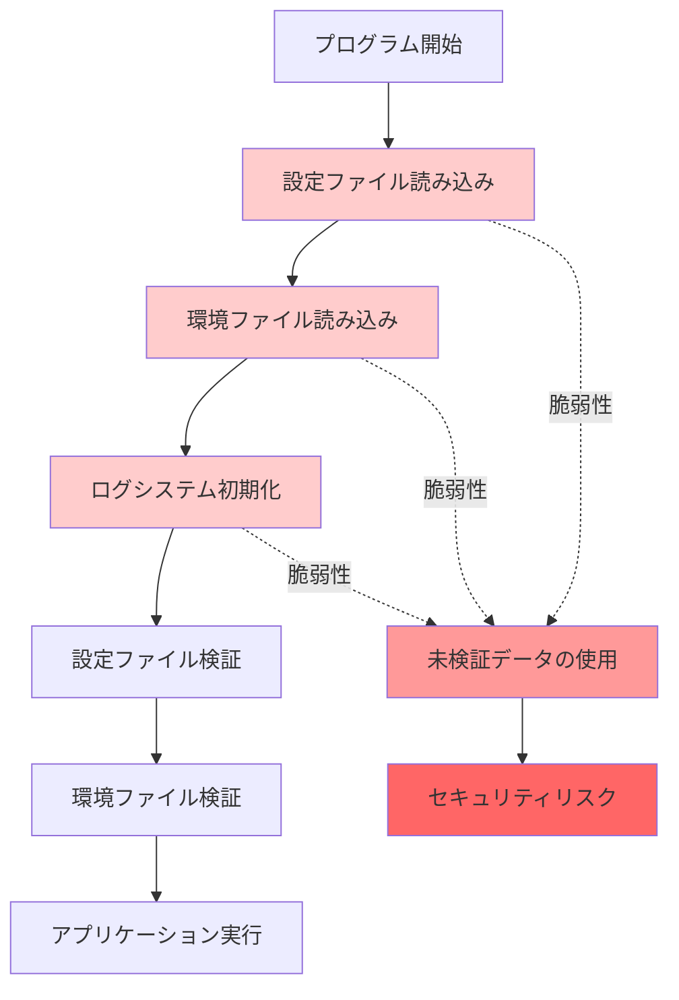
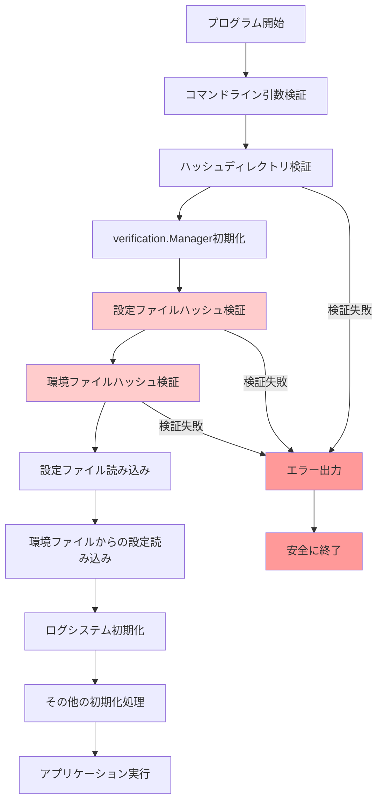

# アーキテクチャ設計書：設定ファイル検証タイミングの修正

## 1. 概要 (Overview)

本ドキュメントは、go-safe-cmd-runnerにおける設定ファイル検証タイミングのセキュリティ脆弱性を修正するためのアーキテクチャ設計を定義する。

### 1.1. 設計方針

- **セキュリティファースト**: 未検証データによるシステム動作を完全に排除
- **フェイルセーフ**: 検証失敗時は安全にプログラムを終了
- **最小権限の原則**: 必要最小限のデータのみ信頼境界内で使用
- **検証可能性**: 実行フローが明確で監査可能

## 2. 現在のアーキテクチャの問題点

### 2.1. 実行フローの問題



### 2.2. セキュリティ脆弱性

- **設定ファイル依存の初期化**: 未検証の`workdir`, `log_level`設定の使用
- **環境ファイル依存の初期化**: 未検証のSlack WebhookURL等の使用
- **信頼境界の混乱**: 検証前後のデータが混在

## 3. 新しいアーキテクチャ設計

### 3.1. セキュア実行フロー



### 3.2. コンポーネント関係図

```mermaid
graph TB
    subgraph "Trust Boundary"
        CLA[Command Line Arguments<br/>(Validated)]
        ENV[Environment Variables<br/>(Pre-verified)]
        CLA --> HDR[Hash Directory Resolver]
        ENV --> HDR
        HDR --> VM[verification.Manager]
        VM --> CFV[Config File Verification]
        VM --> EFV[Environment File Verification]
    end

    CFV --> CFL[Config File Loading<br/>(Post-verified)]
    EFV --> EFL[Environment File Loading<br/>(Post-verified)]
    CFL --> AI[Application Initialization]
    EFL --> AI

    style CLA fill:#e1f5fe
    style ENV fill:#e1f5fe
    style HDR fill:#e8f5e8
    style VM fill:#e8f5e8
    style CFV fill:#fff3e0
    style EFV fill:#fff3e0
    style CFL fill:#f3e5f5
    style EFL fill:#f3e5f5
    style AI fill:#e0f2f1
```

### 3.3. データフロー設計

#### 3.3.1. ハッシュディレクトリ解決

```go
type HashDirectoryResolver struct {
    cmdlineArgs  *CommandLineArgs
    envVars      *EnvironmentVariables
    defaultValue string
}

func (r *HashDirectoryResolver) Resolve() (string, error) {
    // Priority 1: Command line argument
    if r.cmdlineArgs.HashDirectory != "" {
        return r.validatePath(r.cmdlineArgs.HashDirectory)
    }

    // Priority 2: Environment variable
    if envValue := r.envVars.Get("GO_SAFE_CMD_RUNNER_HASH_DIRECTORY"); envValue != "" {
        return r.validatePath(envValue)
    }

    // Priority 3: Default value
    return r.validatePath(r.defaultValue)
}

func (r *HashDirectoryResolver) validatePath(path string) (string, error) {
    // Absolute path validation
    // Directory existence check
    // Permission check
}
```

#### 3.3.2. 事前検証システム

```go
type PreVerificationManager struct {
    hashDir          string
    verificationMgr  *verification.Manager
    stderrLogger     *StderrLogger
}

func (m *PreVerificationManager) VerifyConfigFile(configPath string) error {
    if err := m.verificationMgr.VerifyConfigFile(configPath); err != nil {
        m.stderrLogger.LogCritical("Config file verification failed: %v", err)
        return err
    }
    return nil
}

func (m *PreVerificationManager) VerifyEnvironmentFile(envPath string) error {
    if err := m.verificationMgr.VerifyEnvironmentFile(envPath); err != nil {
        m.stderrLogger.LogCritical("Environment file verification failed: %v", err)
        return err
    }
    return nil
}
```

### 3.4. エラーハンドリング設計

#### 3.4.1. 強制stderr出力システム

```go
type StderrLogger struct {
    writer io.Writer
}

func (l *StderrLogger) LogCritical(format string, args ...interface{}) {
    // Always output to stderr regardless of log level settings
    fmt.Fprintf(l.writer, "[CRITICAL] "+format+"\n", args...)
}
```

#### 3.4.2. セーフ終了システム

```go
type SafeExitManager struct {
    exitCode int
    cleanup  []func() error
}

func (m *SafeExitManager) FailWithCode(code int, message string) {
    fmt.Fprintf(os.Stderr, "[FATAL] %s\n", message)
    for _, cleanup := range m.cleanup {
        if err := cleanup(); err != nil {
            fmt.Fprintf(os.Stderr, "[CLEANUP_ERROR] %v\n", err)
        }
    }
    os.Exit(code)
}
```

## 4. インターフェース設計

### 4.1. コア インターフェース

```go
// ハッシュディレクトリ解決インターフェース
type HashDirectoryResolver interface {
    Resolve() (string, error)
    Validate(path string) error
}

// 事前検証インターフェース
type PreVerifier interface {
    VerifyConfigFile(path string) error
    VerifyEnvironmentFile(path string) error
}

// セーフ終了インターフェース
type SafeExitHandler interface {
    FailWithError(err error)
    FailWithMessage(message string)
}

// 強制ログ出力インターフェース
type CriticalLogger interface {
    LogCritical(format string, args ...interface{})
    LogVerificationFailure(component string, err error)
}
```

### 4.2. 設定値優先順位インターフェース

```go
type ConfigValueResolver interface {
    ResolveHashDirectory() (string, error)
    GetSource() ConfigSource
}

type ConfigSource int

const (
    ConfigSourceCommandLine ConfigSource = iota
    ConfigSourceEnvironment
    ConfigSourceDefault
)
```

## 5. セキュリティアーキテクチャ

### 5.1. 信頼境界の実装

```go
type TrustBoundary struct {
    trustedData   map[string]interface{}
    untrustedData map[string]interface{}
    validator     DataValidator
}

func (tb *TrustBoundary) MoveTrusted(key string, data interface{}) error {
    if err := tb.validator.Validate(data); err != nil {
        return err
    }
    tb.trustedData[key] = data
    delete(tb.untrustedData, key)
    return nil
}

func (tb *TrustBoundary) GetTrusted(key string) (interface{}, bool) {
    data, exists := tb.trustedData[key]
    return data, exists
}
```

### 5.2. 検証チェーンの実装

```go
type VerificationChain struct {
    steps []VerificationStep
}

type VerificationStep struct {
    Name     string
    Verify   func() error
    OnFail   func(error) error
    Critical bool
}

func (vc *VerificationChain) Execute() error {
    for _, step := range vc.steps {
        if err := step.Verify(); err != nil {
            if step.Critical {
                return step.OnFail(err)
            }
            // Log warning for non-critical steps
        }
    }
    return nil
}
```

## 6. パフォーマンス考慮事項

### 6.1. 最適化ポイント

- **単一初期化**: verification.Managerの重複初期化防止
- **並列処理**: 設定ファイルと環境ファイルの並列検証（可能な場合）
- **キャッシュ**: ハッシュ計算結果のキャッシュ
- **遅延評価**: 不要な検証の回避

### 6.2. リソース管理

```go
type ResourceManager struct {
    resources []io.Closer
    mutex     sync.Mutex
}

func (rm *ResourceManager) Register(resource io.Closer) {
    rm.mutex.Lock()
    defer rm.mutex.Unlock()
    rm.resources = append(rm.resources, resource)
}

func (rm *ResourceManager) CleanupAll() error {
    rm.mutex.Lock()
    defer rm.mutex.Unlock()

    var errors []error
    for _, resource := range rm.resources {
        if err := resource.Close(); err != nil {
            errors = append(errors, err)
        }
    }

    if len(errors) > 0 {
        return fmt.Errorf("cleanup errors: %v", errors)
    }
    return nil
}
```

## 7. 実装上の考慮事項

### 7.1. エラー分類

```go
type VerificationErrorType int

const (
    ErrorTypeConfigNotFound VerificationErrorType = iota
    ErrorTypeConfigInvalid
    ErrorTypeHashMismatch
    ErrorTypePermissionDenied
    ErrorTypeSystemError
)

type VerificationError struct {
    Type      VerificationErrorType
    Component string
    Path      string
    Cause     error
}
```

### 7.2. 監査ログ

```go
type AuditLogger struct {
    logger *slog.Logger
}

func (al *AuditLogger) LogVerificationAttempt(component, path string) {
    al.logger.Info("Verification attempt",
        "component", component,
        "path", path,
        "timestamp", time.Now())
}

func (al *AuditLogger) LogVerificationResult(component, path string, success bool, duration time.Duration) {
    al.logger.Info("Verification result",
        "component", component,
        "path", path,
        "success", success,
        "duration_ms", duration.Milliseconds())
}
```

### 7.3. テスト可能性

- **依存性注入**: 外部依存関係のモック化
- **インターフェース分離**: テスト対象の明確化
- **状態管理**: テスト間の状態隔離
- **エラーシミュレーション**: 異常系テストの実装

## 8. マイグレーション戦略

### 8.1. 段階的移行

1. **Phase 1**: 新しい検証フローの実装
2. **Phase 2**: 既存フローとの並行動作
3. **Phase 3**: 既存フローの無効化
4. **Phase 4**: 既存コードの削除

### 8.2. 互換性保持

- コマンドライン引数の後方互換性維持
- ハッシュファイル形式の互換性維持
- エラーメッセージの一貫性保持

この新しいアーキテクチャにより、セキュリティ脆弱性を根本的に解決し、信頼性の高いシステムを構築できます。
