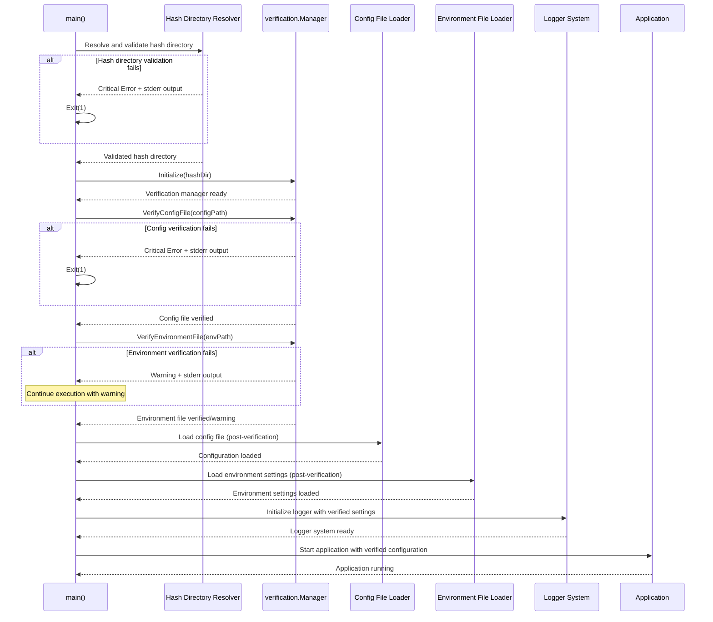
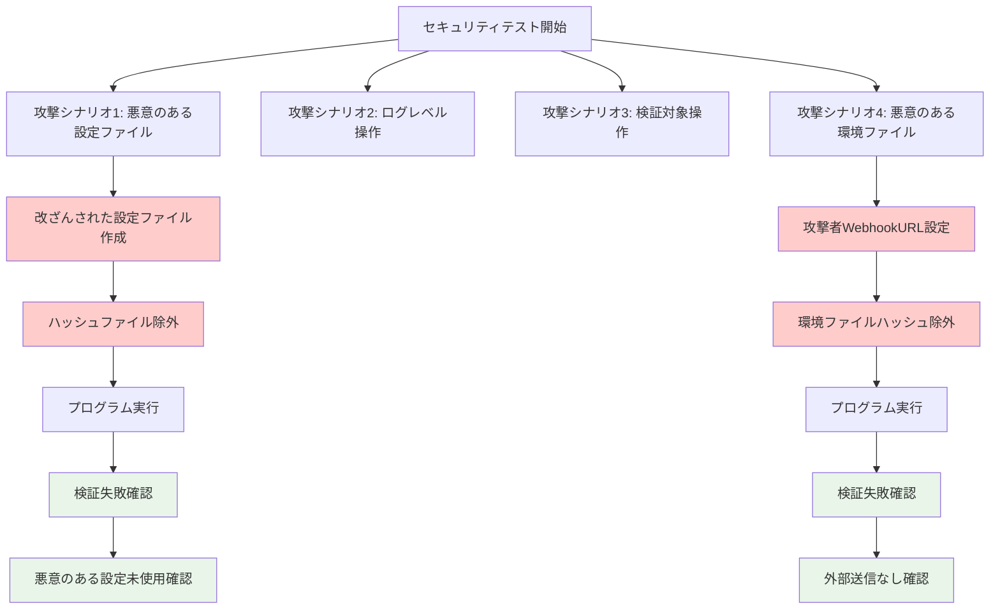

# 詳細仕様書：設定ファイル検証タイミングの修正

## 1. 概要 (Overview)

本ドキュメントは、go-safe-cmd-runnerにおける設定ファイル検証タイミング修正の詳細実装仕様を定義する。

## 2. 実装対象ファイル

### 2.1. 修正対象

- `cmd/runner/main.go` - メイン実行フロー
- `internal/cmdcommon/` - 共通ユーティリティ（必要に応じて）

### 2.2. 新規作成ファイル

- なし（既存の`verification.Manager`を活用）

## 3. 詳細実装仕様

### 3.1. ハッシュディレクトリ解決機能 (F-001)

#### 3.1.1. 関数仕様

```go
import (
    "errors"
    "fmt"
    "os"
    "path/filepath"
    "strings"

    "github.com/isseis/go-safe-cmd-runner/internal/cmdcommon"
    "github.com/isseis/go-safe-cmd-runner/internal/safefileio"
)

// getHashDirectoryWithValidation はハッシュディレクトリを優先順位に従って取得・検証する
func getHashDirectoryWithValidation() (string, error) {
    // 1. コマンドライン引数（最高優先度）
    if *hashDirectory != "" {
        if err := validateHashDirectory(*hashDirectory); err != nil {
            return "", fmt.Errorf("command line hash directory validation failed: %w", err)
        }
        return *hashDirectory, nil
    }

    // 2. 環境変数（中優先度）
    if envHashDir := os.Getenv("GO_SAFE_CMD_RUNNER_HASH_DIRECTORY"); envHashDir != "" {
        if err := validateHashDirectory(envHashDir); err != nil {
            return "", fmt.Errorf("environment variable hash directory validation failed: %w", err)
        }
        return envHashDir, nil
    }

    // 3. デフォルト値（最低優先度）
    defaultHashDir := cmdcommon.DefaultHashDirectory
    if err := validateHashDirectory(defaultHashDir); err != nil {
        return "", fmt.Errorf("default hash directory validation failed: %w", err)
    }
    return defaultHashDir, nil
}

// validateHashDirectory はハッシュディレクトリのパス検証を行う
func validateHashDirectory(path string) error {
    // 空文字チェック
    if path == "" {
        return NewHashDirectoryError(HashDirErrorEmpty, "", nil)
    }

    // 絶対パスチェック
    if !filepath.IsAbs(path) {
        return NewHashDirectoryError(HashDirErrorNotAbsolute, path, nil)
    }

    // パスの正規化チェック（相対パス要素の検出）
    if path != filepath.Clean(path) {
        return NewHashDirectoryError(HashDirErrorNotAbsolute, path,
            fmt.Errorf("path contains relative components"))
    }

    // シンボリックリンク攻撃防止（safefileioパッケージの公開関数を使用）
    if err := safefileio.EnsureParentDirsNoSymlinks(path); err != nil {
        if errors.Is(err, safefileio.ErrIsSymlink) {
            return NewHashDirectoryError(HashDirErrorSymlink, path, err)
        }
        return NewHashDirectoryError(HashDirErrorSymlink, path,
            fmt.Errorf("failed to validate path security: %w", err))
    }

    // ディレクトリ存在確認
    info, err := os.Stat(path)
    if err != nil {
        return NewHashDirectoryError(HashDirErrorNotExists, path, err)
    }

    // ディレクトリ確認
    if !info.IsDir() {
        return NewHashDirectoryError(HashDirErrorNotDirectory, path, nil)
    }

    // パーミッション確認（最低限の読み取り・実行権限が必要）
    if info.Mode().Perm()&0500 != 0500 {
        return NewHashDirectoryError(HashDirErrorInsufficientPermissions, path, nil)
    }

    return nil
}

// 注意: validatePathSafety関数は不要
// 理由：
// 1. safefileio.EnsureParentDirsNoSymlinks()が既に存在し、同じ機能を提供
// 2. safefileioの実装はクロスプラットフォーム対応済み（filepath.VolumeName等を使用）
// 3. コードの重複を避け、一元化された検証ロジックを使用することでセキュリティと保守性を向上
// 4. safefileio.EnsureParentDirsNoSymlinks()を公開関数として利用可能にする
```

#### 3.1.2. エラーハンドリング仕様

```go
// ハッシュディレクトリ検証失敗時のエラーハンドリング
func handleHashDirectoryValidationError(err error, runID string) {
    // 強制stderr出力
    fmt.Fprintf(os.Stderr, "[CRITICAL] Hash directory validation failed: %v\n", err)

    // 詳細ログ出力
    logging.HandlePreExecutionError(
        logging.ErrorTypeFileAccess,
        err.Error(),
        "hash_directory_validation",
        runID,
    )

    // 即座に終了
    os.Exit(1)
}
```

### 3.2. 修正された実行フロー (F-005)

#### 3.2.1. 実行フロー図



#### 3.2.2. 新しいrun関数仕様（シンプル検証版）

```go
func run(runID string) error {
    // 1. コマンドライン引数検証（変更なし）
    ctx, stop := signal.NotifyContext(context.Background(), syscall.SIGINT, syscall.SIGTERM)
    defer stop()

    // 2. ハッシュディレクトリ検証（新規追加）
    hashDir, err := getHashDirectoryWithValidation()
    if err != nil {
        handleHashDirectoryValidationError(err, runID)
        return err // この行は到達しないが、型安全性のため
    }

    // 3. verification.Manager初期化（タイミング変更）
    verificationManager, err := initializeVerificationManager(hashDir, runID)
    if err != nil {
        return err
    }

    // 4. 設定ファイル検証（クリティカル）
    if err := performConfigFileVerification(verificationManager, runID); err != nil {
        return err // クリティカルエラーのため即座に終了
    }

    // 5. 環境ファイル検証（非クリティカル）
    envFileToLoad, err := determineEnvironmentFile()
    if err != nil {
        return err
    }
    if envFileToLoad != "" {
        if err := performEnvironmentFileVerification(verificationManager, envFileToLoad, runID); err != nil {
            // 非クリティカルエラーのため警告として記録し実行継続
            slog.Warn("Environment file verification failed, continuing execution",
                "env_file", envFileToLoad,
                "error", err.Error())
        }
    }

    // 6. 設定ファイル読み込み（検証後実行）
    cfg, err := loadAndValidateConfig(runID)
    if err != nil {
        return err
    }

    // 7. 環境ファイルからの設定読み込み（検証後実行）
    slackWebhookURL, err := loadSlackWebhookFromVerifiedEnv(envFileToLoad)
    if err != nil {
        return err
    }

    // 8. ログシステム初期化（検証済み環境設定を使用）
    if err := setupVerifiedLogger(slackWebhookURL, runID); err != nil {
        return err
    }

    // ---- 以降は検証対象外のため変更なし ----
    // 9. その他の初期化処理
    return executeRunner(ctx, cfg, verificationManager, envFileToLoad, runID)
}
```

#### 3.2.3. 検証関数の詳細実装仕様

```go
// initializeVerificationManager はハッシュディレクトリを使用してverification.Managerを初期化する
func initializeVerificationManager(hashDir, runID string) (*verification.Manager, error) {
    manager, err := verification.NewManager(hashDir)
    if err != nil {
        return nil, &logging.PreExecutionError{
            Type:      logging.ErrorTypeFileAccess,
            Message:   fmt.Sprintf("Failed to initialize verification manager: %v", err),
            Component: "verification_manager",
            RunID:     runID,
        }
    }
    return manager, nil
}

#### 3.2.2. 補助関数仕様

```go
// determineEnvironmentFile は使用する環境ファイルを決定する
func determineEnvironmentFile() (string, error) {
    if *envFile != "" {
        return *envFile, nil
    } else {
        // デフォルト'.env'ファイルの存在確認
        if _, err := os.Stat(".env"); err == nil {
            return ".env", nil
        }
    }
    return "", nil
}

// performConfigFileVerification は設定ファイルの事前検証を実行する（クリティカル）
func performConfigFileVerification(verificationManager *verification.Manager, runID string) error {
    if *configPath == "" {
        return &logging.PreExecutionError{
            Type:      logging.ErrorTypeRequiredArgumentMissing,
            Message:   "Config file path is required",
            Component: "config_verification",
            RunID:     runID,
        }
    }

    if err := verificationManager.VerifyConfigFile(*configPath); err != nil {
        // 強制stderr出力（クリティカルエラー）
        logCriticalToStderr("config_verification", "Config file verification failed", err)

        return &logging.PreExecutionError{
            Type:      logging.ErrorTypeFileAccess,
            Message:   fmt.Sprintf("Config verification failed: %v", err),
            Component: "config_verification",
            RunID:     runID,
        }
    }
    return nil
}

// performEnvironmentFileVerification は環境ファイルの事前検証を実行する（非クリティカル）
func performEnvironmentFileVerification(verificationManager *verification.Manager, envPath, runID string) error {
    if err := verificationManager.VerifyEnvironmentFile(envPath); err != nil {
        // 非クリティカルなので通常ログ出力のみ（stderrへの強制出力はしない）
        return fmt.Errorf("environment file verification failed: %w", err)
    }
    return nil
}

// loadSlackWebhookFromVerifiedEnv は検証済み環境ファイルからSlack WebhookURLを読み込む
// 単一責任: 環境ファイルからの設定値取得のみを担当
func loadSlackWebhookFromVerifiedEnv(envFile string) (string, error) {
    if envFile == "" {
        return "", nil // 環境ファイル未指定の場合はSlack通知無効
    }

    // 検証済み環境ファイルから安全にSlack URLを取得
    slackURL, err := getSlackWebhookFromEnvFile(envFile)
    if err != nil {
        return "", fmt.Errorf("failed to read Slack configuration from verified environment file: %w", err)
    }

    return slackURL, nil
}

// setupVerifiedLogger は検証済み設定でログシステムを初期化する
// 単一責任: ログシステムの初期化のみを担当
func setupVerifiedLogger(slackWebhookURL, runID string) error {
    // ログシステム初期化
    loggerConfig := LoggerConfig{
        Level:           *logLevel,
        LogDir:          *logDir,
        RunID:           runID,
        SlackWebhookURL: slackWebhookURL,
    }

    if err := setupLoggerWithConfig(loggerConfig); err != nil {
        return &logging.PreExecutionError{
            Type:      logging.ErrorTypeLogFileOpen,
            Message:   fmt.Sprintf("Failed to setup logger: %v", err),
            Component: "logging",
            RunID:     runID,
        }
    }

    return nil
}

// getSlackWebhookFromEnvFile は検証済みの環境ファイルからSlack WebhookURLを取得する
// 注意: この関数を呼び出す前に環境ファイルの検証が完了していること
func getSlackWebhookFromEnvFile(envFile string) (string, error) {
    if envFile == "" {
        return "", nil // 環境ファイルが指定されていない場合はSlack通知なし
    }

    // 検証済みの環境ファイルから安全にWebhook URLを読み取り
    envMap, err := godotenv.Read(envFile)
    if err != nil {
        return "", fmt.Errorf("failed to read verified environment file %s: %w", envFile, err)
    }

    // Slack Webhook URLを取得（存在しない場合は空文字列）
    webhookURL := envMap["SLACK_WEBHOOK_URL"]

    return webhookURL, nil
}
```

### 3.3. 強制stderr出力機能 (F-006)

#### 3.3.1. 実装仕様

```go
// logCriticalToStderr は検証失敗を必ずstderrに出力する
func logCriticalToStderr(component, message string, err error) {
    timestamp := time.Now().Format(time.RFC3339)
    criticalMsg := fmt.Sprintf("[%s] [CRITICAL] [%s] %s: %v\n",
        timestamp, component, message, err)

    // ログレベルに関わらず必ずstderrに出力
    fmt.Fprint(os.Stderr, criticalMsg)
}

// 各検証関数内での使用例
func performConfigFileVerification(verificationManager *verification.Manager, runID string) error {
    if err := verificationManager.VerifyConfigFile(*configPath); err != nil {
        // 強制stderr出力
        logCriticalToStderr("config_verification",
            "Config file verification failed", err)

        return &logging.PreExecutionError{
            Type:      logging.ErrorTypeFileAccess,
            Message:   fmt.Sprintf("Config verification failed: %v", err),
            Component: "config_verification",
            RunID:     runID,
        }
    }
    return nil
}
```

### 3.4. エラーハンドリング詳細仕様

#### 3.4.1. エラー分類

```go
// 新しいエラータイプを追加（internal/logging/types.goに追加）
const (
    // 既存のエラータイプ...
    ErrorTypeHashDirectoryValidation ErrorType = "hash_directory_validation"
    ErrorTypeConfigVerification      ErrorType = "config_verification"
    ErrorTypeEnvironmentVerification ErrorType = "environment_verification"
)
```

#### 3.4.2. エラーメッセージ標準化

```go
// ErrorType に対応するエラーメッセージテンプレートマップ
var errorMessageTemplates = map[logging.ErrorType]string{
    logging.ErrorTypeHashDirectoryValidation: "Hash directory validation failed: %s",
    logging.ErrorTypeConfigVerification:      "Config file verification failed: %s",
    logging.ErrorTypeEnvironmentVerification: "Environment file verification failed: %s",
    logging.ErrorTypeFileAccess:              "File access error: %s",
    logging.ErrorTypeRequiredArgumentMissing: "Required argument missing: %s",
    logging.ErrorTypeLogFileOpen:             "Log file operation failed: %s",
}

// HashDirectoryError は詳細なハッシュディレクトリエラー分類
type HashDirectoryError struct {
    ErrorType logging.ErrorType
    Subtype   HashDirectoryErrorSubtype
    Path      string
    Cause     error
}

// HashDirectoryErrorSubtype はハッシュディレクトリエラーの詳細分類
type HashDirectoryErrorSubtype int

const (
    HashDirErrorEmpty HashDirectoryErrorSubtype = iota
    HashDirErrorNotAbsolute
    HashDirErrorSymlink
    HashDirErrorNotExists
    HashDirErrorNotDirectory
    HashDirErrorInsufficientPermissions
)

// 詳細エラーメッセージテンプレート
var hashDirectoryErrorMessages = map[HashDirectoryErrorSubtype]string{
    HashDirErrorEmpty:                 "Hash directory path is empty",
    HashDirErrorNotAbsolute:           "Hash directory must be absolute path, got: %s",
    HashDirErrorSymlink:               "Hash directory path contains symbolic links: %s",
    HashDirErrorNotExists:             "Hash directory does not exist: %s",
    HashDirErrorNotDirectory:          "Hash directory is not a directory: %s",
    HashDirErrorInsufficientPermissions: "Hash directory has insufficient permissions: %s (need at least r-x------)",
}

func (e *HashDirectoryError) Error() string {
    template, exists := hashDirectoryErrorMessages[e.Subtype]
    if !exists {
        return fmt.Sprintf("Unknown hash directory error: %v", e.Subtype)
    }

    var message string
    if e.Path != "" {
        message = fmt.Sprintf(template, e.Path)
    } else {
        message = template
    }

    if e.Cause != nil {
        message = fmt.Sprintf("%s: %v", message, e.Cause)
    }

    return message
}

// NewHashDirectoryError は型安全なハッシュディレクトリエラーを作成
func NewHashDirectoryError(subtype HashDirectoryErrorSubtype, path string, cause error) *HashDirectoryError {
    return &HashDirectoryError{
        ErrorType: logging.ErrorTypeHashDirectoryValidation,
        Subtype:   subtype,
        Path:      path,
        Cause:     cause,
    }
}

// FormatStandardError は ErrorType に基づいて標準エラーメッセージを生成
func FormatStandardError(errorType logging.ErrorType, details string) string {
    template, exists := errorMessageTemplates[errorType]
    if !exists {
        return fmt.Sprintf("Unknown error type %v: %s", errorType, details)
    }
    return fmt.Sprintf(template, details)
}

// CreatePreExecutionError は一貫した PreExecutionError を作成するヘルパー
func CreatePreExecutionError(errorType logging.ErrorType, message, component, runID string) *logging.PreExecutionError {
    return &logging.PreExecutionError{
        Type:      errorType,
        Message:   FormatStandardError(errorType, message),
        Component: component,
        RunID:     runID,
    }
}

// combineErrors は複数のエラーを適切にラップするユーティリティ関数
// Go 1.20以降のerrors.Joinを使用して、個別エラー検査可能な形式で結合
func combineErrors(errors []error) error {
    if len(errors) == 0 {
        return nil
    }
    if len(errors) == 1 {
        return errors[0]
    }
    // errors.Joinを使用することで、errors.Is/errors.Asによる検査が可能
    return errors.Join(errors...)
}

// handleMultipleErrors は複数エラーを適切に処理する標準パターン
func handleMultipleErrors(componentName string, errors []error) error {
    if len(errors) == 0 {
        return nil
    }

    // 個別エラーをログに記録
    for i, err := range errors {
        slog.Error("Component operation failed",
            "component", componentName,
            "error_index", i,
            "error", err.Error())
    }

    // 結合エラーを返す
    combinedErr := combineErrors(errors)
    return fmt.Errorf("%s failed with %d error(s): %w",
        componentName, len(errors), combinedErr)
}
```

### 3.5. 削除される機能

#### 3.5.1. 既存のgetHashDir関数

```go
// 削除対象（cmd/runner/main.go）
func getHashDir() string {
    // この関数は削除される
    // 理由：設定ファイルからのハッシュディレクトリ取得機能を削除
}
```

#### 3.5.2. 設定ファイルベースの初期化

```go
// 削除される処理（setupEnvironmentAndLogging内）
// 削除前：
// 1. 環境ファイル決定
// 2. 環境ファイル読み込み（未検証）
// 3. Slack URL取得（未検証データから）
// 4. ログシステム初期化

// 削除後：
// これらの処理は検証後に移動
```

## 4. テスト仕様

### 4.1. 単体テスト

#### 4.1.1. getHashDirectoryWithValidation関数

```go
func TestGetHashDirectoryWithValidation(t *testing.T) {
    tests := []struct {
        name           string
        cmdlineArg     string
        envVar         string
        defaultDir     string
        expectError    bool
        expectedResult string
    }{
        {
            name:           "CommandLineArgument_Valid",
            cmdlineArg:     "/tmp/test-hash",
            envVar:         "",
            expectError:    false,
            expectedResult: "/tmp/test-hash",
        },
        {
            name:           "CommandLineArgument_Invalid_Relative",
            cmdlineArg:     "relative/path",
            envVar:         "",
            expectError:    true,
            expectedResult: "",
        },
        {
            name:           "EnvironmentVariable_Valid",
            cmdlineArg:     "",
            envVar:         "/tmp/test-hash-env",
            expectError:    false,
            expectedResult: "/tmp/test-hash-env",
        },
        {
            name:           "EnvironmentVariable_Invalid_NotExists",
            cmdlineArg:     "",
            envVar:         "/nonexistent/path",
            expectError:    true,
            expectedResult: "",
        },
        {
            name:           "DefaultValue_Valid",
            cmdlineArg:     "",
            envVar:         "",
            expectError:    false,
            expectedResult: "/tmp/default-hash",
        },
    }

    for _, tt := range tests {
        t.Run(tt.name, func(t *testing.T) {
            // テスト環境セットアップ
            setupTestEnvironment(tt.cmdlineArg, tt.envVar, tt.defaultDir)

            result, err := getHashDirectoryWithValidation()

            if tt.expectError {
                assert.Error(t, err)
                assert.Empty(t, result)
            } else {
                assert.NoError(t, err)
                assert.Equal(t, tt.expectedResult, result)
            }
        })
    }
}
```

#### 4.1.2. validateHashDirectory関数

```go
func TestValidateHashDirectory(t *testing.T) {
    tests := []struct {
        name      string
        path      string
        setupFunc func() string
        expectErr bool
    }{
        {
            name: "Valid_AbsolutePath",
            setupFunc: func() string {
                dir, _ := os.MkdirTemp("", "test-hash-*")
                return dir
            },
            expectErr: false,
        },
        {
            name:      "Invalid_EmptyPath",
            path:      "",
            expectErr: true,
        },
        {
            name:      "Invalid_RelativePath",
            path:      "relative/path",
            expectErr: true,
        },
        {
            name:      "Invalid_NonexistentPath",
            path:      "/nonexistent/path/12345",
            expectErr: true,
        },
        {
            name: "Invalid_SymlinkInPath",
            setupFunc: func() string {
                // テスト用ディレクトリ作成
                baseDir, _ := os.MkdirTemp("", "test-symlink-*")
                realDir := filepath.Join(baseDir, "real")
                os.MkdirAll(realDir, 0755)

                // シンボリックリンク作成
                symlinkPath := filepath.Join(baseDir, "symlink")
                os.Symlink(realDir, symlinkPath)

                // シンボリックリンクを含むパスを返す
                return filepath.Join(symlinkPath, "hash")
            },
            expectErr: true,
        },
        {
            name: "Invalid_InsufficientPermissions",
            setupFunc: func() string {
                // 不適切なパーミッションのディレクトリ作成
                baseDir, _ := os.MkdirTemp("", "test-perm-*")
                restrictedDir := filepath.Join(baseDir, "restricted")
                os.MkdirAll(restrictedDir, 0000) // パーミッション無し
                return restrictedDir
            },
            expectErr: true,
        },
    }

    for _, tt := range tests {
        t.Run(tt.name, func(t *testing.T) {
            path := tt.path
            if tt.setupFunc != nil {
                path = tt.setupFunc()
                defer os.RemoveAll(path)
            }

            err := validateHashDirectory(path)

            if tt.expectErr {
                assert.Error(t, err)
            } else {
                assert.NoError(t, err)
            }
        })
    }
}
```

### 4.2. 統合テスト

#### 4.2.1. 検証処理統合テスト

```go
func TestVerificationIntegration(t *testing.T) {
    // テストシナリオ：全て正常なケース
    t.Run("AllVerificationSucceeds", func(t *testing.T) {
        // セットアップ
        tempDir := setupTestEnvironment(t)
        defer os.RemoveAll(tempDir)

        verificationManager := createMockVerificationManager(t)
        runID := "test-run-001"

        // 実行
        err := performConfigFileVerification(verificationManager, runID)
        assert.NoError(t, err)

        err = performEnvironmentFileVerification(verificationManager, "test.env", runID)
        assert.NoError(t, err)
    })

    // テストシナリオ：設定ファイル検証失敗（クリティカル）
    t.Run("ConfigVerificationFails", func(t *testing.T) {
        // セットアップ
        tempDir := setupTestEnvironment(t)
        defer os.RemoveAll(tempDir)

        verificationManager := createMockVerificationManagerWithConfigError(t)
        runID := "test-run-002"

        // 実行
        err := performConfigFileVerification(verificationManager, runID)

        // 検証
        assert.Error(t, err)

        var preExecErr *logging.PreExecutionError
        assert.True(t, errors.As(err, &preExecErr))
        assert.Equal(t, logging.ErrorTypeFileAccess, preExecErr.Type)
        assert.Equal(t, "config_verification", preExecErr.Component)
    })

    // テストシナリオ：環境ファイル検証失敗（非クリティカル）
    t.Run("EnvironmentVerificationFails", func(t *testing.T) {
        // セットアップ
        tempDir := setupTestEnvironment(t)
        defer os.RemoveAll(tempDir)

        verificationManager := createMockVerificationManagerWithEnvError(t)
        runID := "test-run-003"

        // 実行
        err := performEnvironmentFileVerification(verificationManager, "test.env", runID)

        // 検証：非クリティカルなのでエラーは返されるが、PreExecutionErrorではない
        assert.Error(t, err)
        assert.Contains(t, err.Error(), "environment file verification failed")

        // PreExecutionErrorではないことを確認（非クリティカル）
        var preExecErr *logging.PreExecutionError
        assert.False(t, errors.As(err, &preExecErr))
    })
}
```

#### 4.2.2. 実行フローテスト

```go
func TestSecureExecutionFlow(t *testing.T) {
    // テストシナリオ：正常な実行フロー
    t.Run("ValidFlow", func(t *testing.T) {
        // セットアップ
        tempDir := setupTestEnvironment(t)
        defer os.RemoveAll(tempDir)

        configFile := createTestConfigFile(t, tempDir)
        envFile := createTestEnvFile(t, tempDir)
        hashDir := createTestHashFiles(t, tempDir, configFile, envFile)

        // 実行
        cmd := exec.Command("./build/runner",
            "--config", configFile,
            "--env-file", envFile,
            "--hash-directory", hashDir,
            "--dry-run")

        output, err := cmd.CombinedOutput()

        // 検証
        assert.NoError(t, err)
        assert.Contains(t, string(output), "verification completed successfully")
    })

    // テストシナリオ：設定ファイル検証失敗
    t.Run("ConfigVerificationFailure", func(t *testing.T) {
        // セットアップ
        tempDir := setupTestEnvironment(t)
        defer os.RemoveAll(tempDir)

        configFile := createTestConfigFile(t, tempDir)
        envFile := createTestEnvFile(t, tempDir)
        hashDir := createTestHashFiles(t, tempDir, envFile) // 設定ファイルのハッシュを意図的に除外

        // 実行
        cmd := exec.Command("./build/runner",
            "--config", configFile,
            "--env-file", envFile,
            "--hash-directory", hashDir)

        output, err := cmd.CombinedOutput()

        // 検証
        assert.Error(t, err)
        assert.Contains(t, string(output), "[CRITICAL] Config file verification failed")

        // 終了コードの確認
        exitError, ok := err.(*exec.ExitError)
        assert.True(t, ok)
        assert.Equal(t, 1, exitError.ExitCode())
    })

    // テストシナリオ：環境ファイル検証警告
    t.Run("EnvironmentFileVerificationWarning", func(t *testing.T) {
        // セットアップ
        tempDir := setupTestEnvironment(t)
        defer os.RemoveAll(tempDir)

        configFile := createTestConfigFile(t, tempDir)
        envFile := createTestEnvFile(t, tempDir)
        hashDir := createTestHashFiles(t, tempDir, configFile) // 環境ファイルのハッシュを除外

        // 実行
        cmd := exec.Command("./build/runner",
            "--config", configFile,
            "--env-file", envFile,
            "--hash-directory", hashDir,
            "--dry-run")

        output, err := cmd.CombinedOutput()

        // 検証：実行は継続するが警告が出力される
        assert.NoError(t, err) // プログラムは正常終了
        assert.Contains(t, string(output), "Environment file verification failed, continuing execution")
    })
}
```

### 4.3. セキュリティテスト

#### 4.3.1. セキュリティテストフロー



#### 4.3.2. 攻撃シナリオテスト

```go
func TestSecurityScenarios(t *testing.T) {
    // 攻撃シナリオ1: 悪意のある設定ファイル
    t.Run("MaliciousConfigFile", func(t *testing.T) {
        tempDir := setupTestEnvironment(t)
        defer os.RemoveAll(tempDir)

        // 悪意のある設定ファイル作成（任意のworkdirを指定）
        maliciousConfig := createMaliciousConfigFile(t, tempDir, "/etc")
        hashDir := createTestHashFiles(t, tempDir) // ハッシュファイルなし

        cmd := exec.Command("./build/runner",
            "--config", maliciousConfig,
            "--hash-directory", hashDir)

        output, err := cmd.CombinedOutput()

        // 悪意のある設定が使用される前に終了することを確認
        assert.Error(t, err)
        assert.Contains(t, string(output), "verification failed")
        assert.NotContains(t, string(output), "workdir: /etc") // 悪意のある設定が読み込まれていないことを確認
    })

    // 攻撃シナリオ4: 悪意のある環境ファイル
    t.Run("MaliciousEnvironmentFile", func(t *testing.T) {
        tempDir := setupTestEnvironment(t)
        defer os.RemoveAll(tempDir)

        configFile := createTestConfigFile(t, tempDir)
        // 悪意のある環境ファイル作成（攻撃者のWebhook URL）
        maliciousEnvFile := createMaliciousEnvFile(t, tempDir, "http://attacker.com/webhook")
        hashDir := createTestHashFiles(t, tempDir, configFile) // 環境ファイルのハッシュなし

        cmd := exec.Command("./build/runner",
            "--config", configFile,
            "--env-file", maliciousEnvFile,
            "--hash-directory", hashDir)

        output, err := cmd.CombinedOutput()

        // 悪意のある環境ファイルが使用される前に終了することを確認
        assert.Error(t, err)
        assert.Contains(t, string(output), "Environment file verification failed")

        // 攻撃者のエンドポイントにデータが送信されていないことを確認
        // （ネットワーク監視やモック使用）
    })
}
```

## 5. パフォーマンス仕様

### 5.1. 起動時間要件

- 検証追加による起動時間増加: 100ms未満
- ハッシュ計算時間: ファイルサイズ1MBあたり50ms未満

### 5.2. メモリ使用量

- verification.Manager: 追加メモリ使用量10MB未満
- ハッシュ計算バッファ: 64KB固定

## 6. 運用仕様

### 6.1. ログ出力仕様

```
# 正常系ログ例
[INFO] Hash directory resolved from command line: /opt/hashes
[INFO] Verification manager initialized successfully
[INFO] Config file verification completed: /opt/config/app.toml
[INFO] Environment file verification completed: /opt/config/.env

# 異常系ログ例（必ずstderrに出力）
[CRITICAL] Hash directory validation failed: directory does not exist: /invalid/path
[CRITICAL] Hash directory validation failed: has insufficient permissions: /opt/hashes (need at least r-x------)
[CRITICAL] Config file verification failed: hash mismatch for /opt/config/app.toml
[CRITICAL] Environment file verification failed: permission denied: /opt/config/.env
```

### 6.2. 監視項目

- 検証成功/失敗の比率
- 検証処理時間
- 使用されるハッシュディレクトリのソース（コマンドライン/環境変数/デフォルト）
- 検証失敗時の原因分析

この仕様に基づいて実装することで、セキュリティ脆弱性を完全に解決できます。
