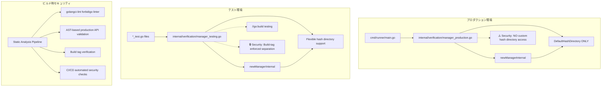
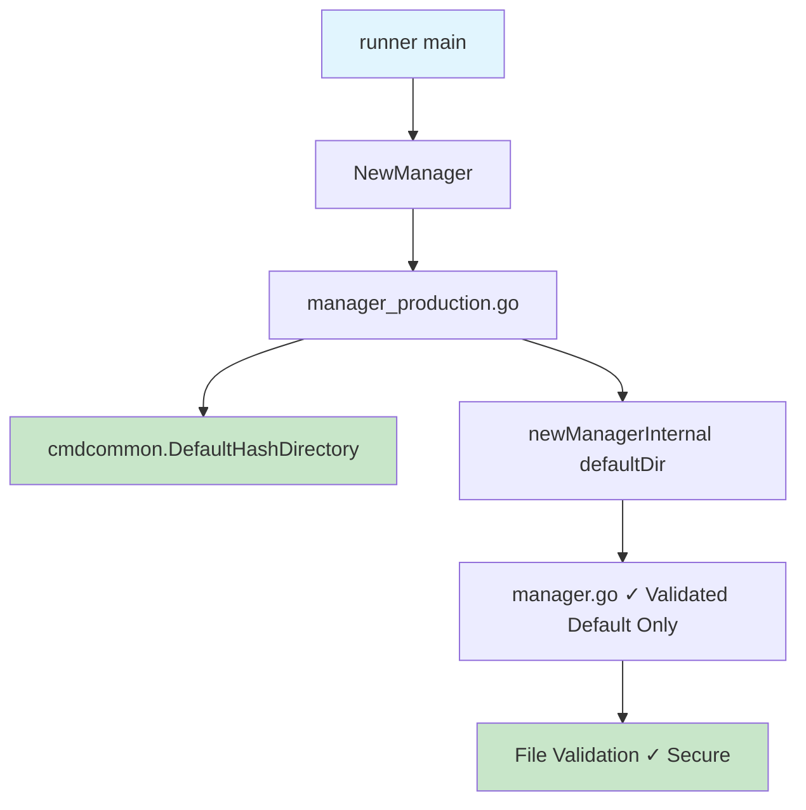
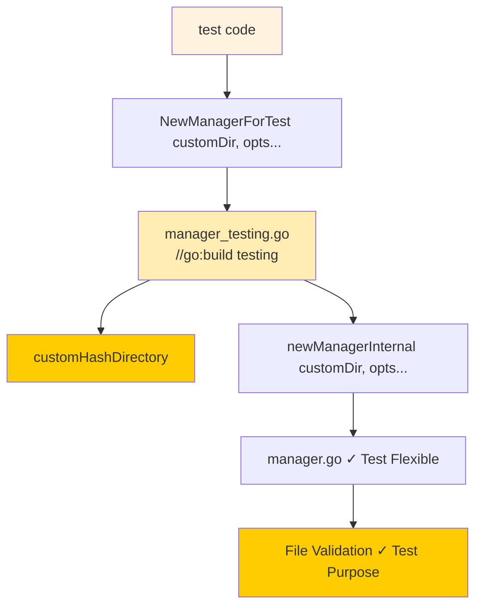

# アーキテクチャ設計書：ハッシュディレクトリセキュリティ強化

## 1. システム概要

### 1.1 設計原則

#### セキュリティファースト原則
- **ゼロトラスト**: カスタムハッシュディレクトリを一切信頼しない
- **最小権限**: 必要最小限のAPIのみを公開
- **多層防御**: コンパイル時・ビルド時・実行時の複数段階でのチェック

#### 関心の分離
- **プロダクション環境**: セキュリティ最優先、機能制限
- **テスト環境**: 柔軟性重視、開発効率優先
- **ビルドプロセス**: 自動化された品質保証

### 1.2 アーキテクチャ目標

1. **セキュリティ目標**
   - 任意ハッシュディレクトリ指定による攻撃を完全に防止
   - 特権昇格攻撃の可能性を排除

2. **品質目標**
   - テスト用API誤用の自動検出
   - ビルド時セキュリティ検証の自動化

3. **保守性目標**
   - コード複雑性の削減
   - 明確なAPI境界の設定

## 2. システムアーキテクチャ

### 2.1 全体アーキテクチャ図



### 2.2 コンポーネント構成

#### Core Components

1. **Production Manager** (`internal/verification/manager_production.go`)
   - プロダクション環境専用
   - デフォルトハッシュディレクトリのみ使用
   - シンプルで安全なAPI

2. **Testing Manager** (`internal/verification/manager_testing.go`)
   - テスト環境専用（`//go:build testing`）
   - 柔軟なハッシュディレクトリ指定
   - 豊富なテスト用オプション

3. **Internal Implementation** (`internal/verification/manager.go`)
   - 共通の内部実装
   - 外部パッケージからアクセス不可
   - 統一された検証ロジック

#### Security Components

1. **Build-time Constraints**
   - ビルドタグによる環境分離
   - コンパイル時API制限
   - 静的解析ルール

2. **Runtime Validation**
   - デフォルトハッシュディレクトリ検証
   - パス安全性チェック
   - 権限検証

### 2.3 データフローダイアグラム

#### プロダクション環境でのフロー



#### テスト環境でのフロー



## 3. セキュリティアーキテクチャ

### 3.1 セキュリティ層の設計

#### Layer 1: Build-Time Security
- **ビルドタグ制約**: テスト用APIをプロダクションビルドから完全排除
- **コンパイル時チェック**: 不正なAPI使用の検出
- **静的解析**: 自動化されたセキュリティ検証

#### Layer 2: API Design Security
- **最小権限API**: プロダクション環境では最低限の機能のみ
- **型安全性**: 誤用しにくいAPI設計
- **明確な境界**: プロダクション用とテスト用の明確な分離

#### Layer 3: Runtime Security
- **デフォルト値強制**: cmdcommon.DefaultHashDirectoryの強制使用
- **パス検証**: 既存のセキュアな検証ロジック活用
- **権限分離**: 特権管理との適切な連携

### 3.2 攻撃対策マトリックス

| 攻撃種類 | 現在の脆弱性 | 対策後の防御 | 実装方法 |
|---------|-------------|-------------|----------|
| 偽ハッシュディレクトリ攻撃 | `--hash-directory` による任意指定可能 | ✅ 完全防止 | コマンドライン引数削除 |
| テスト用API悪用 | なし（新規対策） | ✅ ビルドタグ制約 | `//go:build testing` |
| 内部API直接アクセス | なし（新規対策） | ✅ パッケージレベル制限 | internal package + 小文字関数 |
| CI/CD環境での誤用 | なし（新規対策） | ✅ 自動検出 | golangci-lint forbidigo |

### 3.3 セキュリティ検証ポイント

#### Compile-time Verification
```go
// ✅ 許可されるパターン（プロダクション）
manager, err := verification.NewManager()

// ❌ forbidigoによりビルド時エラー（プロダクションコードでは禁止）
manager, err := verification.NewManagerForTest("/custom/path")
```

#### Build-time Verification (AST-based)
```bash
# forbidigoによる正確な検証
golangci-lint run --config .golangci-security.yml ./...

# 検出例:
# ERROR: NewManagerForTest is only allowed in test files (forbidigo)
# ERROR: hash-directory flag has been removed for security (forbidigo)
```

## 4. API設計

### 4.1 公開API設計

#### Production API
```go
// internal/verification/manager_production.go
package verification

import "github.com/isseis/go-safe-cmd-runner/internal/cmdcommon"

// NewManager creates a verification manager for production use
// Uses the system default hash directory only - no customization allowed
func NewManager() (*Manager, error) {
    return newManagerInternal(cmdcommon.DefaultHashDirectory)
}
```

#### Testing API
```go
// internal/verification/manager_testing.go
//go:build testing

package verification

// NewManagerForTest creates a verification manager for testing
// Allows custom hash directory - TESTING ONLY
func NewManagerForTest(hashDir string, options ...Option) (*Manager, error) {
    return newManagerInternal(hashDir, options...)
}
```

#### Internal Implementation
```go
// internal/verification/manager.go
package verification

// newManagerInternal is the shared implementation
// Not accessible from external packages (lowercase function name)
func newManagerInternal(hashDir string, options ...Option) (*Manager, error) {
    // Existing NewManagerWithOpts implementation
}
```

### 4.2 API使用パターン

#### プロダクション環境での使用
```go
// cmd/runner/main.go
func run(runID string) error {
    // ✅ セキュア: デフォルトハッシュディレクトリのみ
    verificationManager, err := verification.NewManager()
    if err != nil {
        return err
    }
    // ... 以降の処理
}
```

#### テスト環境での使用
```go
// cmd/runner/integration_test.go
//go:build testing

func TestCustomHashDirectory(t *testing.T) {
    tempDir := t.TempDir()

    // ✅ テスト専用: カスタムハッシュディレクトリ使用可能
    manager, err := verification.NewManagerForTest(
        tempDir,
        verification.WithFS(mockFS),
    )
    require.NoError(t, err)
    // ... テスト処理
}
```

## 5. ビルドシステムアーキテクチャ

### 5.1 ビルドタグ戦略

#### Production Build
```bash
# デフォルトビルド - テスト用APIは除外
go build -o build/runner ./cmd/runner
```

#### Testing Build
```bash
# テスト実行 - テスト用API有効
go test -tags=testing -v ./...
```

### 5.2 静的解析パイプライン

#### Makefile Integration
```makefile
.PHONY: lint-security
lint-security:
	@echo "Checking for test-only API usage in production code..."
	@./scripts/check-production-api-usage.sh
	@golangci-lint run --config .golangci-security.yml

.PHONY: build-production
build-production: lint-security
	@echo "Building production binary..."
	go build -o build/runner ./cmd/runner

.PHONY: test-full
test-full:
	@echo "Running full test suite..."
	go test -tags=testing -v -race ./...
```

#### Forbidigo Linter Configuration
```yaml
# .golangci-security.yml
run:
  # テストファイルとテスト専用ディレクトリを除外
  skip-files:
    - ".*_test\\.go$"
    - ".*/testing/.*\\.go$"
  skip-dirs:
    - "internal/verification/testing"
  # タイムアウト設定（大きなプロジェクト向け）
  timeout: 5m

linters:
  enable:
    - forbidigo
  disable-all: false

linters-settings:
  forbidigo:
    # テスト用API・削除されたAPI の使用を禁止
    forbid:
      # テスト用API（プロダクションコードでは禁止）
      - p: 'verification\.NewManagerForTest\('
        msg: 'NewManagerForTest is only allowed in test files'
        pkg: '^(?!.*_test\.go$).*'  # テストファイル以外で検出

      - p: 'verification\.newManagerInternal\('
        msg: 'newManagerInternal is internal API, use NewManager() instead'

      # 削除されたハッシュディレクトリ関連API
      - p: 'hashdir\.GetWithValidation'
        msg: 'GetWithValidation has been removed, use verification.NewManager() instead'

      - p: 'hashdir\.GetHashDir'
        msg: 'GetHashDir has been removed for security'

      # 削除されたコマンドラインフラグ
      - p: 'flag\.String.*hash-directory'
        msg: 'hash-directory flag has been removed for security'

      # 危険なimportパターン
      - p: 'import.*".*verification/testing.*"'
        msg: 'testing packages should not be imported in production code'

    # AST解析を有効化（より正確な検出）
    analyze-types: true

issues:
  # セキュリティルール違反は例外なし
  exclude-use-default: false
  max-issues-per-linter: 0
  max-same-issues: 0
```

### 5.3 CI/CD Integration

#### GitHub Actions Workflow
```yaml
# .github/workflows/security-check.yml
name: Security Check

on: [push, pull_request]

jobs:
  security-lint:
    runs-on: ubuntu-latest
    steps:
      - uses: actions/checkout@v3
      - uses: actions/setup-go@v3
        with:
          go-version: '1.23.10'

      - name: Primary security validation
        run: |
          echo "Running AST-based security validation with forbidigo..."
          golangci-lint run --config .golangci-security.yml ./...

      - name: Supplementary security checks
        run: |
          echo "Running additional security validation..."
          make security-check
```

## 6. デプロイメントアーキテクチャ

### 6.1 環境分離戦略

#### Production Environment
- **Binary**: Standard build（テスト用API除外）
- **Configuration**: DefaultHashDirectory forced
- **Security**: Maximum restrictions

#### Development Environment
- **Binary**: Testing build（テスト用API有効）
- **Configuration**: Flexible hash directory
- **Security**: Development-friendly

#### CI/CD Environment
- **Build Stage**: Production build validation
- **Test Stage**: Testing build with full API
- **Deploy Stage**: Production binary only

### 6.2 移行戦略

#### Phase 1: Implementation
1. 新しいAPI構造の実装
2. ビルドタグ制約の追加
3. 静的解析ルールの導入

#### Phase 2: Migration
1. 既存テストコードのAPI移行
2. ドキュメント更新
3. 移行ガイド提供

#### Phase 3: Cleanup
1. 古いAPI（`--hash-directory`フラグ）の削除
2. 関連する複雑なロジックの削除
3. セキュリティ検証の完了

### 6.3 ロールバック計画

#### 緊急ロールバック
- 旧バージョンバイナリへの即座の切り戻し
- 設定ファイルの互換性維持
- ログ継続性の確保

#### 段階的ロールバック
- 機能フラグによる新API無効化
- 旧APIの一時的復活
- データ整合性の確認

## 7. パフォーマンス設計

### 7.1 パフォーマンス目標

- **ビルド時間**: 従来比5%以内の増加
- **実行時性能**: パフォーマンス劣化なし
- **メモリ使用量**: 現状維持

### 7.2 最適化戦略

#### ビルドタグ最適化
- 条件コンパイルによる不要コード除外
- バイナリサイズの最小化

#### API簡素化による効果
- コードパス削減による実行効率向上
- 条件分岐削除による予測性向上

## 8. 監視とログ

### 8.1 セキュリティログ

#### Build-time Logging
```bash
[INFO] Production build: Test APIs excluded
[INFO] Security validation: PASSED
[INFO] Binary size: 15.2MB (vs 15.1MB baseline)
```

#### Runtime Logging
```go
slog.Info("Verification manager initialized",
    "hash_directory", cmdcommon.DefaultHashDirectory,
    "mode", "production",
    "security_level", "maximum")
```

### 8.2 異常検知

#### 静的解析異常
- テスト用API誤用の検出
- 不正なビルドタグ使用

#### 実行時異常
- 予期しないハッシュディレクトリアクセス
- API使用パターンの異常

## 9. 品質保証

### 9.1 テスト戦略

#### 単体テスト
- API境界の正確な検証
- セキュリティ制約の確認
- エラーケースの網羅

#### 統合テスト
- エンドツーエンドのセキュリティ検証
- ビルドプロセス全体のテスト
- 環境間の互換性確認

#### セキュリティテスト
- 攻撃シナリオの検証
- 権限昇格テスト
- API誤用テスト

### 9.2 品質メトリクス

- **セキュリティ**: 脆弱性0件
- **テストカバレッジ**: 90%以上
- **静的解析**: 100%合格
- **ビルド成功率**: 100%

## 10. リスク管理

### 10.1 技術的リスク

#### 高リスク
- **破壊的変更による運用停止**
- **対策**: 段階的リリース、詳細な移行ガイド

#### 中リスク
- **テスト環境での開発効率低下**
- **対策**: 充実したテスト用API、詳細なドキュメント

### 10.2 運用リスク

#### ビルドプロセス複雑化
- **対策**: 自動化の徹底、明確なMakefile

#### 開発者学習コスト
- **対策**: サンプルコード提供、実践的なドキュメント

## 11. 今後の展望

### 11.1 短期的改善
- 環境変数制御の追加セキュリティ強化
- より詳細な静的解析ルール
- パフォーマンス最適化

### 11.2 長期的発展
- 暗号学的ハッシュディレクトリ保護
- 分散ハッシュストレージサポート
- AI/MLベースの異常検知
