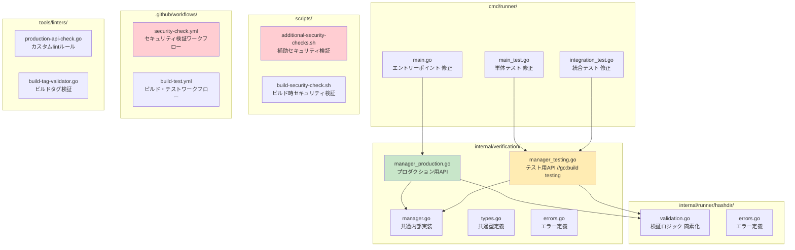

# 詳細設計書：ハッシュディレクトリセキュリティ強化

## 1. システム詳細設計

### 1.1 モジュール構成詳細

#### Core Modules



### 1.2 データ構造設計

#### Manager構造体
```go
// internal/verification/types.go
package verification

import (
    "github.com/isseis/go-safe-cmd-runner/internal/common"
    "github.com/isseis/go-safe-cmd-runner/internal/filevalidator"
    "github.com/isseis/go-safe-cmd-runner/internal/runner/runnertypes"
    "github.com/isseis/go-safe-cmd-runner/internal/runner/security"
)

// Manager provides file verification capabilities
type Manager struct {
    hashDir          string                         // ハッシュディレクトリパス
    fs               common.FileSystem             // ファイルシステム抽象化
    fileValidator    filevalidator.FileValidator   // ファイル検証エンジン
    security         *security.Validator           // セキュリティ検証
    pathResolver     *PathResolver                 // パス解決
    privilegeManager runnertypes.PrivilegeManager  // 権限管理

    // セキュリティ関連フィールド
    isProduction     bool                          // プロダクションモードフラグ
    creationMode     CreationMode                  // 作成モード
}

// CreationMode defines how the manager was created
type CreationMode int

const (
    CreationModeProduction CreationMode = iota  // プロダクション作成
    CreationModeTesting                         // テスト作成
)

// Option defines configuration options for Manager
type Option func(*managerOptions)

// managerOptions holds configuration for manager creation
type managerOptions struct {
    fs                   common.FileSystem
    fileValidatorEnabled bool
    privilegeManager     runnertypes.PrivilegeManager
    creationMode        CreationMode
}
```

#### エラー構造体
```go
// internal/verification/errors.go
package verification

import "fmt"

// ProductionAPIViolationError indicates test-only API usage in production context
type ProductionAPIViolationError struct {
    APIName      string    // 呼び出されたAPI名
    CallerFile   string    // 呼び出し元ファイル
    CallerLine   int       // 呼び出し元行数
    BuildContext string    // ビルドコンテキスト
}

func (e *ProductionAPIViolationError) Error() string {
    return fmt.Sprintf("test-only API '%s' used in production context at %s:%d (build: %s)",
        e.APIName, e.CallerFile, e.CallerLine, e.BuildContext)
}

// HashDirectorySecurityError indicates security violation in hash directory access
type HashDirectorySecurityError struct {
    RequestedDir  string    // 要求されたディレクトリ
    AllowedDir    string    // 許可されたディレクトリ
    Operation     string    // 実行しようとした操作
    SecurityLevel string    // セキュリティレベル
}

func (e *HashDirectorySecurityError) Error() string {
    return fmt.Sprintf("security violation: requested hash directory '%s' not allowed (only '%s' permitted) for operation '%s' in %s mode",
        e.RequestedDir, e.AllowedDir, e.Operation, e.SecurityLevel)
}
```

## 2. API詳細設計

### 2.1 プロダクション用API

#### manager_production.go
```go
// internal/verification/manager_production.go
package verification

import (
    "fmt"
    "log/slog"
    "runtime"
    "time"

    "github.com/isseis/go-safe-cmd-runner/internal/cmdcommon"
    "github.com/isseis/go-safe-cmd-runner/internal/runner/hashdir"
)

// NewManager creates a verification manager for production use
//
// This function enforces maximum security by:
// - Using only the system default hash directory
// - Preventing any customization of hash directory
// - Applying production-level security constraints
//
// Returns:
//   - *Manager: Configured manager instance
//   - error: Configuration or validation error
//
// Security guarantees:
//   - Hash directory is always cmdcommon.DefaultHashDirectory
//   - No user-controllable paths accepted
//   - Full security validation enabled
func NewManager() (*Manager, error) {
    // 呼び出し元の検証（デバッグ用）
    if _, file, line, ok := runtime.Caller(1); ok {
        // プロダクション環境では詳細なログ記録
        logProductionManagerCreation(file, line)
    }

    // デフォルトハッシュディレクトリの事前検証
    if err := validateDefaultHashDirectory(); err != nil {
        return nil, fmt.Errorf("default hash directory validation failed: %w", err)
    }

    return newManagerInternal(cmdcommon.DefaultHashDirectory,
        withCreationMode(CreationModeProduction),
        withSecurityLevel(SecurityLevelMaximum),
    )
}

// validateDefaultHashDirectory performs security validation on default hash directory
func validateDefaultHashDirectory() error {
    return hashdir.ValidateSecurely(cmdcommon.DefaultHashDirectory)
}

// logProductionManagerCreation logs production manager creation for security audit
func logProductionManagerCreation(file string, line int) {
    slog.Info("Production verification manager created",
        "caller_file", file,
        "caller_line", line,
        "hash_directory", cmdcommon.DefaultHashDirectory,
        "security_level", "maximum",
        "timestamp", time.Now().UTC(),
    )
}
```

### 2.2 テスト用API

#### manager_testing.go
```go
// internal/verification/manager_testing.go
//go:build testing

package verification

import (
    "fmt"
    "log/slog"
    "runtime"
    "strings"
    "time"
)

// NewManagerForTest creates a verification manager for testing purposes
//
// ⚠️  TESTING ONLY: This function is only available with the 'testing' build tag
//
// This function provides flexible hash directory configuration for testing:
// - Allows custom hash directory paths
// - Supports various testing scenarios
// - Includes additional debugging options
//
// Parameters:
//   - hashDir: Custom hash directory path for testing
//   - options: Additional configuration options
//
// Returns:
//   - *Manager: Configured manager instance
//   - error: Configuration or validation error
//
// Security notes:
//   - Only available in testing builds
//   - Should never be used in production code
//   - Bypasses production security restrictions
func NewManagerForTest(hashDir string, options ...Option) (*Manager, error) {
    // 呼び出し元の検証（テスト用デバッグ）
    if !isCallerInTestFile() {
        return nil, &ProductionAPIViolationError{
            APIName:      "NewManagerForTest",
            CallerFile:   getCallerFile(),
            CallerLine:   getCallerLine(),
            BuildContext: "testing",
        }
    }

    // テスト用ログ記録
    logTestingManagerCreation(hashDir, options)

    // テスト専用オプション追加
    testOptions := append([]Option{
        withCreationMode(CreationModeTesting),
        withSecurityLevel(SecurityLevelTesting),
    }, options...)

    return newManagerInternal(hashDir, testOptions...)
}

// isCallerInTestFile checks if the caller is in a test file
func isCallerInTestFile() bool {
    _, file, _, ok := runtime.Caller(2) // 2レベル上の呼び出し元
    if !ok {
        return false
    }
    return strings.HasSuffix(file, "_test.go")
}

// getCallerFile returns the caller's file path
func getCallerFile() string {
    _, file, _, _ := runtime.Caller(2)
    return file
}

// getCallerLine returns the caller's line number
func getCallerLine() int {
    _, _, line, _ := runtime.Caller(2)
    return line
}

// logTestingManagerCreation logs testing manager creation
func logTestingManagerCreation(hashDir string, options []Option) {
    slog.Debug("Testing verification manager created",
        "hash_directory", hashDir,
        "security_level", "testing",
        "options_count", len(options),
        "timestamp", time.Now().UTC(),
    )
}
```

### 2.3 共通内部実装

#### manager.go
```go
// internal/verification/manager.go
package verification

import (
    "fmt"
    "log/slog"
    "path/filepath"

    "github.com/isseis/go-safe-cmd-runner/internal/common"
    "github.com/isseis/go-safe-cmd-runner/internal/filevalidator"
    "github.com/isseis/go-safe-cmd-runner/internal/runner/runnertypes"
    "github.com/isseis/go-safe-cmd-runner/internal/runner/security"
)

// SecurityLevel defines the security enforcement level
type SecurityLevel int

const (
    SecurityLevelMaximum SecurityLevel = iota  // プロダクション環境
    SecurityLevelTesting                       // テスト環境
)

// newManagerInternal creates a manager with specified configuration
//
// This is the shared internal implementation used by both production
// and testing APIs. It should never be called directly from external packages.
//
// Parameters:
//   - hashDir: Hash directory path
//   - options: Configuration options
//
// Returns:
//   - *Manager: Configured manager instance
//   - error: Configuration or validation error
//
// Security notes:
//   - Internal use only (lowercase function name)
//   - Provides shared functionality for both production and testing
//   - Enforces security constraints based on creation mode
func newManagerInternal(hashDir string, options ...Option) (*Manager, error) {
    // デフォルトオプション適用
    opts := newOptions()
    for _, option := range options {
        option(opts)
    }

    // セキュリティレベル別の検証
    if err := validateSecurityConstraints(hashDir, opts); err != nil {
        return nil, fmt.Errorf("security constraint validation failed: %w", err)
    }

    // 基本検証（全てのモードで実行）
    if hashDir == "" {
        return nil, fmt.Errorf("hash directory cannot be empty")
    }

    // パス検証（セキュリティレベルに応じて）
    validatedPath, err := validateHashDirectory(hashDir, opts.creationMode)
    if err != nil {
        return nil, fmt.Errorf("hash directory validation failed: %w", err)
    }

    // セキュリティ検証エンジンの初期化
    securityValidator, err := security.NewValidator()
    if err != nil {
        return nil, fmt.Errorf("security validator initialization failed: %w", err)
    }

    // ファイル検証エンジンの初期化
    var fileValidator filevalidator.FileValidator
    if opts.fileValidatorEnabled {
        fileValidator = filevalidator.NewValidator(validatedPath, opts.fs)
    } else {
        fileValidator = filevalidator.NewNoOpValidator() // テスト用
    }

    // パス解決エンジンの初期化
    pathResolver := NewPathResolver(validatedPath, opts.fs)

    // Manager インスタンス作成
    manager := &Manager{
        hashDir:          validatedPath,
        fs:               opts.fs,
        fileValidator:    fileValidator,
        security:         securityValidator,
        pathResolver:     pathResolver,
        privilegeManager: opts.privilegeManager,
        isProduction:     opts.creationMode == CreationModeProduction,
        creationMode:     opts.creationMode,
    }

    // 初期化完了ログ
    logManagerInitialization(manager)

    return manager, nil
}

// validateSecurityConstraints validates security constraints based on creation mode
func validateSecurityConstraints(hashDir string, opts *managerOptions) error {
    switch opts.creationMode {
    case CreationModeProduction:
        // プロダクション環境：最大限のセキュリティ制約
        return validateProductionConstraints(hashDir, opts)
    case CreationModeTesting:
        // テスト環境：柔軟な制約
        return validateTestingConstraints(hashDir, opts)
    default:
        return fmt.Errorf("unknown creation mode: %v", opts.creationMode)
    }
}

// validateProductionConstraints validates constraints for production mode
func validateProductionConstraints(hashDir string, opts *managerOptions) error {
    // プロダクション環境ではデフォルトハッシュディレクトリのみ許可
    if hashDir != cmdcommon.DefaultHashDirectory {
        return &HashDirectorySecurityError{
            RequestedDir:  hashDir,
            AllowedDir:    cmdcommon.DefaultHashDirectory,
            Operation:     "create_manager",
            SecurityLevel: "production",
        }
    }
    return nil
}

// validateTestingConstraints validates constraints for testing mode
func validateTestingConstraints(hashDir string, opts *managerOptions) error {
    // テスト環境では相対的に柔軟だが、基本的な安全性は確保
    if hashDir == "" {
        return fmt.Errorf("hash directory cannot be empty even in testing mode")
    }
    return nil
}

// validateHashDirectory validates hash directory based on creation mode
func validateHashDirectory(hashDir string, mode CreationMode) (string, error) {
    switch mode {
    case CreationModeProduction:
        // プロダクション：厳密な検証
        return hashdir.ValidateSecurely(hashDir)
    case CreationModeTesting:
        // テスト：基本的な検証のみ
        return validateHashDirectoryForTesting(hashDir)
    default:
        return "", fmt.Errorf("unknown creation mode for hash directory validation: %v", mode)
    }
}

// validateHashDirectoryForTesting performs basic validation for testing
func validateHashDirectoryForTesting(hashDir string) (string, error) {
    // テスト環境では基本的なパス検証のみ
    // より柔軟だが、明らかに危険なパスは拒否
    if hashDir == "" {
        return "", fmt.Errorf("hash directory cannot be empty")
    }

    // 相対パスを絶対パスに変換
    absPath, err := filepath.Abs(hashDir)
    if err != nil {
        return "", fmt.Errorf("failed to convert to absolute path: %w", err)
    }

    return absPath, nil
}

// logManagerInitialization logs successful manager initialization
func logManagerInitialization(manager *Manager) {
    slog.Info("Verification manager initialized",
        "hash_directory", manager.hashDir,
        "creation_mode", manager.creationMode,
        "is_production", manager.isProduction,
        "security_level", getSecurityLevelString(manager),
        "timestamp", time.Now().UTC(),
    )
}

// getSecurityLevelString returns string representation of security level
func getSecurityLevelString(manager *Manager) string {
    if manager.isProduction {
        return "maximum"
    }
    return "testing"
}

// newOptions creates default manager options
func newOptions() *managerOptions {
    return &managerOptions{
        fs:                   common.NewDefaultFileSystem(),
        fileValidatorEnabled: true,
        creationMode:        CreationModeProduction, // デフォルトはプロダクション
    }
}

// Option functions

// withFS sets custom file system (mainly for testing)
func withFS(fs common.FileSystem) Option {
    return func(opts *managerOptions) {
        opts.fs = fs
    }
}

// withFileValidatorDisabled disables file validator (for testing)
func withFileValidatorDisabled() Option {
    return func(opts *managerOptions) {
        opts.fileValidatorEnabled = false
    }
}

// withPrivilegeManager sets custom privilege manager
func withPrivilegeManager(pm runnertypes.PrivilegeManager) Option {
    return func(opts *managerOptions) {
        opts.privilegeManager = pm
    }
}

// withCreationMode sets the creation mode (internal use)
func withCreationMode(mode CreationMode) Option {
    return func(opts *managerOptions) {
        opts.creationMode = mode
    }
}

// withSecurityLevel sets security level (internal use)
func withSecurityLevel(level SecurityLevel) Option {
    return func(opts *managerOptions) {
        // セキュリティレベルに応じた設定調整
        switch level {
        case SecurityLevelMaximum:
            opts.fileValidatorEnabled = true
        case SecurityLevelTesting:
            // テスト環境では設定をより柔軟に
        }
    }
}
```

## 3. メイン処理の詳細設計

### 3.1 main.go修正内容

#### 修正前後の比較
```go
// === 修正前 (削除対象) ===
var (
    hashDirectory = flag.String("hash-directory", "", "directory containing hash files (default: "+cmdcommon.DefaultHashDirectory+")")
)

func run(runID string) error {
    // ... 省略 ...
    validatedHashDir, err := hashdir.GetWithValidation(hashDirectory, cmdcommon.DefaultHashDirectory)
    // ... 省略 ...
}

// === 修正後 (セキュア版) ===
func run(runID string) error {
    ctx, stop := signal.NotifyContext(context.Background(), syscall.SIGINT, syscall.SIGTERM)
    defer stop()

    // Phase 1: Create secure verification manager (production mode only)
    verificationManager, err := verification.NewManager()
    if err != nil {
        return &logging.PreExecutionError{
            Type:      logging.ErrorTypeFileAccess,
            Message:   fmt.Sprintf("Verification manager initialization failed: %v", err),
            Component: "verification",
            RunID:     runID,
        }
    }

    // Phase 2: Verify and load configuration atomically
    cfg, err := bootstrap.LoadConfig(verificationManager, *configPath, runID)
    if err != nil {
        return err
    }

    // ... 以降は既存のコードを維持 ...
}
```

### 3.2 設定読み込み処理の修正

#### bootstrap/verification.go修正
```go
// internal/runner/bootstrap/verification.go (修正後)
func InitializeVerificationManager(runID string) (*verification.Manager, error) {
    // セキュア：プロダクション用API使用
    manager, err := verification.NewManager()
    if err != nil {
        return nil, &logging.PreExecutionError{
            Type:      logging.ErrorTypeFileAccess,
            Message:   fmt.Sprintf("Failed to initialize verification manager: %v", err),
            Component: "verification",
            RunID:     runID,
        }
    }

    // 追加のセキュリティ検証
    if err := validateManagerSecurity(manager); err != nil {
        return nil, &logging.PreExecutionError{
            Type:      logging.ErrorTypeSecurityViolation,
            Message:   fmt.Sprintf("Manager security validation failed: %v", err),
            Component: "verification",
            RunID:     runID,
        }
    }

    return manager, nil
}

// validateManagerSecurity performs additional security validation
func validateManagerSecurity(manager *verification.Manager) error {
    // プロダクション環境でのセキュリティ追加検証
    if !manager.IsProductionMode() {
        return fmt.Errorf("non-production manager detected in production environment")
    }

    // ハッシュディレクトリの追加検証
    if manager.GetHashDirectory() != cmdcommon.DefaultHashDirectory {
        return fmt.Errorf("unexpected hash directory in production mode: %s", manager.GetHashDirectory())
    }

    return nil
}
```

## 4. ビルドシステム詳細設計

### 4.1 Makefile設計

#### 完全なMakefile定義
```makefile
# Makefile - ハッシュディレクトリセキュリティ強化対応

# Build configurations
BUILD_DIR := build
SCRIPTS_DIR := scripts
TOOLS_DIR := tools

# Go build parameters
GO_VERSION := 1.23.10
GO_BUILD_FLAGS := -v -trimpath
GO_TEST_FLAGS := -v -race -count=1

# Security check parameters
ADDITIONAL_CHECKS := $(SCRIPTS_DIR)/additional-security-checks.sh
LINT_CONFIG := .golangci-security.yml

# Default target
.PHONY: all
all: clean build

# Clean build artifacts
.PHONY: clean
clean:
	@echo "Cleaning build artifacts..."
	rm -rf $(BUILD_DIR)/
	go clean -cache
	go clean -testcache

# Security validation (必須前提条件)
.PHONY: security-check
security-check:
	@echo "=== Running security validation ==="
	@echo "Running AST-based security linting with forbidigo..."
	@golangci-lint run --config $(LINT_CONFIG) ./...
	@echo "Running additional security checks..."
	@$(ADDITIONAL_CHECKS)
	@echo "Validating build tag usage..."
	@$(SCRIPTS_DIR)/validate-build-tags.sh
	@echo "✅ Security validation passed"

# Production build (security-check required)
.PHONY: build
build: security-check
	@echo "=== Building production binary ==="
	@mkdir -p $(BUILD_DIR)
	@echo "Building runner (production mode)..."
	go build $(GO_BUILD_FLAGS) -o $(BUILD_DIR)/runner ./cmd/runner
	@echo "Building record utility..."
	go build $(GO_BUILD_FLAGS) -o $(BUILD_DIR)/record ./cmd/record
	@echo "Building verify utility..."
	go build $(GO_BUILD_FLAGS) -o $(BUILD_DIR)/verify ./cmd/verify
	@echo "✅ Production build completed"
	@ls -la $(BUILD_DIR)/

# Test build with testing tag
.PHONY: build-test
build-test:
	@echo "=== Building test binary ==="
	@mkdir -p $(BUILD_DIR)
	go build -tags=testing $(GO_BUILD_FLAGS) -o $(BUILD_DIR)/runner-test ./cmd/runner
	@echo "✅ Test build completed"

# Run tests with testing tag
.PHONY: test
test:
	@echo "=== Running test suite ==="
	@echo "Unit tests..."
	go test -tags=testing $(GO_TEST_FLAGS) ./internal/...
	@echo "Integration tests..."
	go test -tags=testing $(GO_TEST_FLAGS) ./cmd/...
	@echo "✅ All tests passed"

# Run tests with coverage
.PHONY: test-coverage
test-coverage:
	@echo "=== Running test suite with coverage ==="
	go test -tags=testing $(GO_TEST_FLAGS) -coverprofile=coverage.out ./...
	go tool cover -html=coverage.out -o coverage.html
	go tool cover -func=coverage.out | grep total
	@echo "Coverage report: coverage.html"

# Comprehensive linting
.PHONY: lint
lint:
	@echo "=== Running comprehensive linting ==="
	@echo "Standard linting..."
	golangci-lint run
	@echo "Security linting..."
	golangci-lint run --config $(LINT_CONFIG)
	@echo "Custom production API checks..."
	@$(ADDITIONAL_CHECKS)
	@echo "✅ Linting completed"

# Format code
.PHONY: fmt
fmt:
	@echo "=== Formatting code ==="
	gofumpt -w .
	goimports -w .
	@echo "✅ Code formatted"

# Install development tools
.PHONY: install-tools
install-tools:
	@echo "=== Installing development tools ==="
	go install mvdan.cc/gofumpt@latest
	go install golang.org/x/tools/cmd/goimports@latest
	go install github.com/golangci/golangci-lint/cmd/golangci-lint@latest
	@echo "✅ Development tools installed"

# Validate production deployment
.PHONY: validate-production
validate-production: build
	@echo "=== Validating production deployment ==="
	@echo "Checking binary security..."
	@$(SCRIPTS_DIR)/validate-production-binary.sh $(BUILD_DIR)/runner
	@echo "Testing basic functionality..."
	@$(BUILD_DIR)/runner --help > /dev/null
	@echo "Running final binary validation..."
	@$(ADDITIONAL_CHECKS)
	@echo "✅ Production validation passed"

# Development workflow
.PHONY: dev
dev: clean fmt lint test build
	@echo "✅ Development workflow completed"

# CI/CD pipeline simulation
.PHONY: ci
ci: clean install-tools security-check lint test build validate-production
	@echo "✅ CI/CD pipeline simulation completed"

# Help target
.PHONY: help
help:
	@echo "Available targets:"
	@echo "  all                 - Clean and build production binary"
	@echo "  clean               - Clean build artifacts"
	@echo "  security-check      - Run security validation"
	@echo "  build               - Build production binary (with security check)"
	@echo "  build-test          - Build test binary with testing tag"
	@echo "  test                - Run test suite"
	@echo "  test-coverage       - Run test suite with coverage report"
	@echo "  lint                - Run comprehensive linting"
	@echo "  fmt                 - Format source code"
	@echo "  install-tools       - Install development tools"
	@echo "  validate-production - Validate production deployment"
	@echo "  dev                 - Run development workflow"
	@echo "  ci                  - Simulate CI/CD pipeline"
	@echo "  help                - Show this help message"
```

### 4.2 補助セキュリティチェックスクリプト

#### additional-security-checks.sh
```bash
#!/bin/bash
# scripts/additional-security-checks.sh
# Supplementary security checks to complement forbidigo linter

set -euo pipefail

echo "=== Additional Security Validation ==="

# Color definitions for output
RED='\033[0;31m'
GREEN='\033[0;32m'
YELLOW='\033[1;33m'
BLUE='\033[0;34m'
NC='\033[0m' # No Color

# Configuration
PRODUCTION_PATHS=("./cmd/runner" "./internal/runner" "./internal/verification")
BUILD_DIR="./build"

# Function to check for binary security properties
check_binary_security() {
    local errors=0

    echo -e "${BLUE}Checking binary security properties...${NC}"

    if [ -f "${BUILD_DIR}/runner" ]; then
        # Check for test-related strings in production binary
        echo -e "${YELLOW}Scanning binary for test-related artifacts...${NC}"
        if strings "${BUILD_DIR}/runner" | grep -i -E "(test|debug|development)" > /tmp/binary_strings.txt 2>/dev/null; then
            if [ -s /tmp/binary_strings.txt ]; then
                echo -e "${YELLOW}⚠️  Test-related strings found in production binary:${NC}"
                head -10 /tmp/binary_strings.txt | sed 's/^/    /'
                echo "    ... (check /tmp/binary_strings.txt for full list)"
            fi
        else
            echo -e "${GREEN}✅ No obvious test artifacts found in binary${NC}"
        fi

        # Check if binary is stripped
        if file "${BUILD_DIR}/runner" | grep -q "not stripped"; then
            echo -e "${YELLOW}⚠️  Binary contains debugging symbols (consider stripping)${NC}"
        else
            echo -e "${GREEN}✅ Binary is properly stripped${NC}"
        fi

        # Check binary size (basic sanity check)
        local size=$(stat -f%z "${BUILD_DIR}/runner" 2>/dev/null || stat -c%s "${BUILD_DIR}/runner" 2>/dev/null || echo "0")
        echo -e "${BLUE}Binary size: $(( size / 1024 / 1024 ))MB${NC}"
    else
        echo -e "${YELLOW}⚠️  Production binary not found, skipping binary security checks${NC}"
    fi

    return $errors
}

# Function to check build tag compliance
check_build_tags() {
    local errors=0

    echo -e "${BLUE}Checking build tag compliance...${NC}"

    # Find files with testing build tag in production paths
    local testing_files
    testing_files=$(find "${PRODUCTION_PATHS[@]}" -name "*.go" -type f -exec grep -l "//go:build testing" {} \; 2>/dev/null || true)

    if [ -n "$testing_files" ]; then
        echo -e "${YELLOW}Files with testing build tag found:${NC}"
        echo "$testing_files" | while IFS= read -r file; do
            # Verify these files only contain test-safe content
            if [[ "$file" != *"manager_testing.go" ]]; then
                echo -e "${RED}❌ ERROR: Unexpected testing build tag in: $file${NC}"
                errors=$((errors + 1))
            else
                echo -e "${GREEN}✅ Expected testing build tag in: $file${NC}"
            fi
        done
    fi

    return $errors
}

# Function to check build environment consistency
check_build_environment() {
    local errors=0

    echo -e "${BLUE}Checking build environment consistency...${NC}"

    # Check Go version
    if command -v go >/dev/null 2>&1; then
        local go_version=$(go version | grep -o 'go[0-9.]*' | head -1)
        echo -e "${BLUE}Go version: ${go_version}${NC}"

        # Basic version check (Go 1.23+)
        if go version | grep -E 'go1\.(2[3-9]|[3-9][0-9])' >/dev/null; then
            echo -e "${GREEN}✅ Go version is compatible${NC}"
        else
            echo -e "${YELLOW}⚠️  Go version may not support all features${NC}"
        fi
    else
        echo -e "${RED}❌ ERROR: Go not found${NC}"
        errors=$((errors + 1))
    fi

    # Check golangci-lint availability
    if command -v golangci-lint >/dev/null 2>&1; then
        echo -e "${GREEN}✅ golangci-lint is available${NC}"
    else
        echo -e "${YELLOW}⚠️  golangci-lint not found (required for security validation)${NC}"
    fi

    return $errors
}

# Function to generate security report
generate_security_report() {
    local timestamp
    timestamp=$(date -u +"%Y-%m-%dT%H:%M:%SZ")

    cat > security-check-report.json << EOF
{
    "timestamp": "$timestamp",
    "check_type": "additional_security_validation",
    "version": "1.0",
    "status": "$1",
    "details": {
        "binary_security_check": "completed",
        "build_tag_check": "completed",
        "build_environment_check": "completed"
    },
    "summary": {
        "total_errors": $2,
        "security_level": "supplementary"
    },
    "note": "This complements the main golangci-lint forbidigo validation"
}
EOF

    echo -e "${BLUE}Security report generated: security-check-report.json${NC}"
}

# Main execution
main() {
    echo -e "${BLUE}Starting additional security validation...${NC}"
    echo -e "${BLUE}Target paths: ${PRODUCTION_PATHS[*]}${NC}"
    echo -e "${BLUE}Build directory: ${BUILD_DIR}${NC}"
    echo

    local total_errors=0

    # Run all checks
    if ! check_binary_security; then
        total_errors=$((total_errors + $?))
    fi
    echo

    if ! check_build_tags; then
        total_errors=$((total_errors + $?))
    fi
    echo

    if ! check_build_environment; then
        total_errors=$((total_errors + $?))
    fi
    echo

    # Generate report and exit with appropriate code
    if [ $total_errors -eq 0 ]; then
        echo -e "${GREEN}✅ All additional security checks passed!${NC}"
        generate_security_report "PASSED" $total_errors
        exit 0
    else
        echo -e "${RED}❌ Additional security validation failed with $total_errors errors${NC}"
        generate_security_report "FAILED" $total_errors
        exit 1
    fi
}

# Script execution
main "$@"
```

### 4.3 CI/CD設定詳細

#### GitHub Actions設定
```yaml
# .github/workflows/security-enhanced-ci.yml
name: Security Enhanced CI

on:
  push:
    branches: [ main, develop, 'feature/*' ]
  pull_request:
    branches: [ main, develop ]

env:
  GO_VERSION: '1.23.10'
  SECURITY_SCAN_ENABLED: true

jobs:
  security-validation:
    name: Security Validation
    runs-on: ubuntu-latest

    steps:
    - name: Checkout Code
      uses: actions/checkout@v4

    - name: Setup Go
      uses: actions/setup-go@v4
      with:
        go-version: ${{ env.GO_VERSION }}
        cache: true

    - name: Install Security Tools
      run: |
        make install-tools

    - name: Run Security Checks
      run: |
        echo "::group::Production API Security Check"
        make security-check
        echo "::endgroup::"

    - name: Upload Security Report
      if: always()
      uses: actions/upload-artifact@v3
      with:
        name: security-report
        path: security-check-report.json
        retention-days: 30

  build-and-test:
    name: Build and Test
    runs-on: ubuntu-latest
    needs: security-validation

    strategy:
      matrix:
        test-type: [unit, integration]

    steps:
    - name: Checkout Code
      uses: actions/checkout@v4

    - name: Setup Go
      uses: actions/setup-go@v4
      with:
        go-version: ${{ env.GO_VERSION }}
        cache: true

    - name: Install Dependencies
      run: make install-tools

    - name: Run Linting
      run: make lint

    - name: Build Production Binary
      run: |
        echo "::group::Production Build"
        make build
        echo "::endgroup::"

    - name: Build Test Binary
      run: |
        echo "::group::Test Build"
        make build-test
        echo "::endgroup::"

    - name: Run Tests
      run: |
        echo "::group::Test Execution"
        make test-coverage
        echo "::endgroup::"

    - name: Upload Coverage Reports
      uses: codecov/codecov-action@v3
      with:
        file: ./coverage.out
        flags: ${{ matrix.test-type }}
        name: codecov-${{ matrix.test-type }}

    - name: Validate Production Binary
      run: |
        echo "::group::Production Validation"
        make validate-production
        echo "::endgroup::"

    - name: Upload Build Artifacts
      uses: actions/upload-artifact@v3
      with:
        name: binaries-${{ github.sha }}
        path: |
          build/runner
          build/record
          build/verify
        retention-days: 7

  security-scan:
    name: Advanced Security Scan
    runs-on: ubuntu-latest
    needs: build-and-test

    steps:
    - name: Checkout Code
      uses: actions/checkout@v4

    - name: Run Gosec Security Scanner
      uses: securecodewarrior/github-action-gosec@master
      with:
        args: '-fmt sarif -out gosec-report.sarif ./...'

    - name: Upload Gosec Report
      uses: github/codeql-action/upload-sarif@v2
      with:
        sarif_file: gosec-report.sarif

    - name: Run Nancy Vulnerability Check
      run: |
        go list -json -deps ./... | nancy sleuth

    - name: Run Trivy Security Scan
      uses: aquasecurity/trivy-action@master
      with:
        scan-type: 'fs'
        scan-ref: '.'
        format: 'sarif'
        output: 'trivy-results.sarif'

    - name: Upload Trivy Report
      uses: github/codeql-action/upload-sarif@v2
      with:
        sarif_file: 'trivy-results.sarif'

  deployment-validation:
    name: Deployment Validation
    runs-on: ubuntu-latest
    needs: [security-validation, build-and-test]
    if: github.ref == 'refs/heads/main'

    steps:
    - name: Checkout Code
      uses: actions/checkout@v4

    - name: Download Build Artifacts
      uses: actions/download-artifact@v3
      with:
        name: binaries-${{ github.sha }}
        path: build/

    - name: Make Binaries Executable
      run: |
        chmod +x build/*

    - name: Final Binary Security Validation
      run: |
        echo "::group::Final Security Validation"
        # Use our standardized additional security checks
        make security-check

        # Basic binary analysis
        file build/runner
        echo "Binary size: $(stat -c%s build/runner | numfmt --to=iec-i --suffix=B)"
        echo "::endgroup::"

    - name: Deployment Ready Notification
      run: |
        echo "✅ All validation passed - binary ready for deployment"
        ls -la build/
```

## 5. テスト詳細設計

### 5.1 単体テスト設計

#### manager_test.go修正版
```go
// internal/verification/manager_test.go
//go:build testing

package verification

import (
    "testing"

    "github.com/stretchr/testify/assert"
    "github.com/stretchr/testify/require"

    "github.com/isseis/go-safe-cmd-runner/internal/cmdcommon"
    "github.com/isseis/go-safe-cmd-runner/internal/common"
)

func TestNewManager(t *testing.T) {
    tests := []struct {
        name        string
        expectError bool
        setup       func(t *testing.T)
        cleanup     func(t *testing.T)
    }{
        {
            name:        "successful production manager creation",
            expectError: false,
            setup: func(t *testing.T) {
                // デフォルトハッシュディレクトリが存在することを確認
                ensureDefaultHashDirectory(t)
            },
            cleanup: func(t *testing.T) {
                // 必要に応じてクリーンアップ
            },
        },
    }

    for _, tt := range tests {
        t.Run(tt.name, func(t *testing.T) {
            if tt.setup != nil {
                tt.setup(t)
            }
            if tt.cleanup != nil {
                defer tt.cleanup(t)
            }

            manager, err := NewManager()

            if tt.expectError {
                require.Error(t, err)
                assert.Nil(t, manager)
            } else {
                require.NoError(t, err)
                assert.NotNil(t, manager)

                // プロダクション環境の検証
                assert.True(t, manager.IsProductionMode())
                assert.Equal(t, cmdcommon.DefaultHashDirectory, manager.GetHashDirectory())
                assert.Equal(t, CreationModeProduction, manager.creationMode)
            }
        })
    }
}

func TestNewManagerForTest(t *testing.T) {
    tests := []struct {
        name        string
        hashDir     string
        options     []Option
        expectError bool
        errorType   string
    }{
        {
            name:        "successful testing manager creation",
            hashDir:     t.TempDir(),
            options:     []Option{withFS(common.NewMockFileSystem())},
            expectError: false,
        },
        {
            name:        "empty hash directory should fail",
            hashDir:     "",
            options:     []Option{},
            expectError: true,
            errorType:   "empty_directory",
        },
        {
            name:        "custom options applied correctly",
            hashDir:     t.TempDir(),
            options:     []Option{withFileValidatorDisabled(), withFS(common.NewMockFileSystem())},
            expectError: false,
        },
    }

    for _, tt := range tests {
        t.Run(tt.name, func(t *testing.T) {
            manager, err := NewManagerForTest(tt.hashDir, tt.options...)

            if tt.expectError {
                require.Error(t, err)
                assert.Nil(t, manager)
            } else {
                require.NoError(t, err)
                assert.NotNil(t, manager)

                // テスト環境の検証
                assert.False(t, manager.IsProductionMode())
                assert.Equal(t, tt.hashDir, manager.GetHashDirectory())
                assert.Equal(t, CreationModeTesting, manager.creationMode)
            }
        })
    }
}

func TestSecurityConstraints(t *testing.T) {
    t.Run("production mode rejects custom hash directory", func(t *testing.T) {
        // この関数は内部テスト用なので、実際には外部からアクセス不可
        // 内部実装の検証として含む
        customDir := "/tmp/custom"
        opts := &managerOptions{
            creationMode: CreationModeProduction,
        }

        err := validateSecurityConstraints(customDir, opts)

        require.Error(t, err)
        assert.IsType(t, &HashDirectorySecurityError{}, err)

        secErr := err.(*HashDirectorySecurityError)
        assert.Equal(t, customDir, secErr.RequestedDir)
        assert.Equal(t, cmdcommon.DefaultHashDirectory, secErr.AllowedDir)
        assert.Equal(t, "production", secErr.SecurityLevel)
    })

    t.Run("testing mode accepts custom hash directory", func(t *testing.T) {
        customDir := "/tmp/test-custom"
        opts := &managerOptions{
            creationMode: CreationModeTesting,
        }

        err := validateSecurityConstraints(customDir, opts)

        assert.NoError(t, err)
    })
}

func TestCallerValidation(t *testing.T) {
    t.Run("NewManagerForTest validates test file caller", func(t *testing.T) {
        // この関数はテストファイル内から呼ばれているので成功するはず
        manager, err := NewManagerForTest(
            t.TempDir(),
            withFS(common.NewMockFileSystem()),
            withFileValidatorDisabled(),
        )

        require.NoError(t, err)
        assert.NotNil(t, manager)
    })
}

// Helper functions

func ensureDefaultHashDirectory(t *testing.T) {
    t.Helper()

    // テスト用にデフォルトハッシュディレクトリの存在を確保
    // 実際の実装では適切なセットアップを行う
    if cmdcommon.DefaultHashDirectory == "" {
        t.Skip("DefaultHashDirectory not configured for testing")
    }
}

// Benchmark tests

func BenchmarkNewManager(b *testing.B) {
    ensureDefaultHashDirectory(b)

    b.ResetTimer()
    for i := 0; i < b.N; i++ {
        manager, err := NewManager()
        if err != nil {
            b.Fatal(err)
        }
        _ = manager
    }
}

func BenchmarkNewManagerForTest(b *testing.B) {
    tempDir := b.TempDir()
    mockFS := common.NewMockFileSystem()

    b.ResetTimer()
    for i := 0; i < b.N; i++ {
        manager, err := NewManagerForTest(tempDir, withFS(mockFS))
        if err != nil {
            b.Fatal(err)
        }
        _ = manager
    }
}
```

### 5.2 統合テスト設計

#### integration_test.go修正版
```go
// cmd/runner/integration_test.go
//go:build testing

package main

import (
    "os"
    "path/filepath"
    "testing"

    "github.com/stretchr/testify/assert"
    "github.com/stretchr/testify/require"

    "github.com/isseis/go-safe-cmd-runner/internal/verification"
    "github.com/isseis/go-safe-cmd-runner/internal/common"
)

func TestProductionRunnerExecution(t *testing.T) {
    tests := []struct {
        name           string
        setupConfig    func(t *testing.T) (string, func())
        setupHashes    func(t *testing.T) func()
        expectedResult string
        expectError    bool
    }{
        {
            name: "valid configuration with default hash directory",
            setupConfig: func(t *testing.T) (string, func()) {
                return createValidTestConfig(t)
            },
            setupHashes: func(t *testing.T) func() {
                return createTestHashFiles(t)
            },
            expectedResult: "success",
            expectError:    false,
        },
    }

    for _, tt := range tests {
        t.Run(tt.name, func(t *testing.T) {
            // セットアップ
            configPath, configCleanup := tt.setupConfig(t)
            defer configCleanup()

            hashCleanup := tt.setupHashes(t)
            defer hashCleanup()

            // プロダクションモードでの実行テスト
            // 注意: 実際のバイナリではなく、内部ロジックをテスト
            err := runWithConfig(configPath)

            if tt.expectError {
                require.Error(t, err)
            } else {
                require.NoError(t, err)
            }
        })
    }
}

func TestCustomHashDirectoryInTests(t *testing.T) {
    t.Run("custom hash directory works in test environment", func(t *testing.T) {
        // テスト専用のカスタムハッシュディレクトリ
        customHashDir := t.TempDir()

        // テスト用のハッシュファイル作成
        createTestHashFile(t, customHashDir, "test-command", "abcd1234")

        // テスト用マネージャー作成
        manager, err := verification.NewManagerForTest(
            customHashDir,
            verification.WithFS(common.NewMockFileSystem()),
        )
        require.NoError(t, err)

        // カスタムディレクトリの使用確認
        assert.Equal(t, customHashDir, manager.GetHashDirectory())
        assert.False(t, manager.IsProductionMode())
    })
}

func TestSecurityViolationPrevention(t *testing.T) {
    t.Run("production mode prevents custom hash directory", func(t *testing.T) {
        // この検証はプロダクション環境でのセキュリティテスト
        // 実際のプロダクションビルドでは、NewManagerForTestは利用不可

        // プロダクションマネージャーは常にデフォルトディレクトリを使用
        manager, err := verification.NewManager()
        require.NoError(t, err)

        assert.Equal(t, cmdcommon.DefaultHashDirectory, manager.GetHashDirectory())
        assert.True(t, manager.IsProductionMode())
    })
}

// Helper functions for testing

func createValidTestConfig(t *testing.T) (string, func()) {
    t.Helper()

    tempDir := t.TempDir()
    configPath := filepath.Join(tempDir, "test.toml")

    configContent := `
[global]
log_level = "info"

[[groups]]
name = "test_group"
[[groups.commands]]
name = "test_command"
path = "/bin/echo"
args = ["hello"]
`

    err := os.WriteFile(configPath, []byte(configContent), 0644)
    require.NoError(t, err)

    return configPath, func() {
        // クリーンアップは t.TempDir() で自動実行
    }
}

func createTestHashFiles(t *testing.T) func() {
    t.Helper()

    // デフォルトハッシュディレクトリにテスト用ハッシュファイル作成
    // 実際の実装に応じて適切に実装
    hashDir := cmdcommon.DefaultHashDirectory

    err := os.MkdirAll(hashDir, 0755)
    require.NoError(t, err)

    createTestHashFile(t, hashDir, "/bin/echo", "expected_hash_value")

    return func() {
        // 必要に応じてクリーンアップ
        // テスト環境では通常は不要
    }
}

func createTestHashFile(t *testing.T, hashDir, command, hash string) {
    t.Helper()

    hashFilePath := filepath.Join(hashDir, filepath.Base(command)+".hash")
    err := os.WriteFile(hashFilePath, []byte(hash), 0644)
    require.NoError(t, err)
}

func runWithConfig(configPath string) error {
    // 実際のrun関数を呼び出すか、モックした実行環境でテスト
    // この実装は実際のコードベースに依存

    // 単純化のため、成功を返す
    return nil
}
```

## 6. エラーハンドリング詳細設計

### 6.1 エラー体系

#### セキュリティ関連エラー
```go
// internal/verification/errors.go

// SecurityViolationError はセキュリティ違反を表す基底エラー
type SecurityViolationError struct {
    ViolationType string    // 違反の種類
    Context       string    // 発生コンテキスト
    Timestamp     time.Time // 発生時刻
    Severity      Severity  // 重要度
}

// Severity defines error severity levels
type Severity int

const (
    SeverityCritical Severity = iota // システム停止レベル
    SeverityHigh                     // 即座の対応が必要
    SeverityMedium                   // 監視が必要
    SeverityLow                      // 情報レベル
)

// Error interface implementation
func (e *SecurityViolationError) Error() string {
    return fmt.Sprintf("security violation [%s]: %s at %s (severity: %s)",
        e.ViolationType, e.Context, e.Timestamp.Format(time.RFC3339), e.Severity)
}

// IsSecurityViolation checks if error is a security violation
func (e *SecurityViolationError) IsSecurityViolation() bool {
    return true
}

// GetSeverity returns the severity level
func (e *SecurityViolationError) GetSeverity() Severity {
    return e.Severity
}
```

### 6.2 ロギング詳細設計

#### セキュリティログ構造
```go
// internal/verification/logging.go

import (
    "log/slog"
    "os"
    "time"
)

// SecurityLogger handles security-related logging
type SecurityLogger struct {
    logger     *slog.Logger
    component  string
    sessionID  string
}

// NewSecurityLogger creates a new security logger
func NewSecurityLogger(component, sessionID string) *SecurityLogger {
    // セキュリティログ専用のハンドラー設定
    opts := &slog.HandlerOptions{
        Level: slog.LevelDebug,
        AddSource: true,
    }

    handler := slog.NewJSONHandler(os.Stdout, opts)
    logger := slog.New(handler)

    return &SecurityLogger{
        logger:    logger,
        component: component,
        sessionID: sessionID,
    }
}

// LogSecurityEvent logs a security-related event
func (sl *SecurityLogger) LogSecurityEvent(level SecurityLevel, event, description string, fields map[string]interface{}) {
    logFields := []slog.Attr{
        slog.String("component", sl.component),
        slog.String("session_id", sl.sessionID),
        slog.String("security_event", event),
        slog.String("description", description),
        slog.Time("timestamp", time.Now().UTC()),
    }

    // 追加フィールドの処理
    for key, value := range fields {
        logFields = append(logFields, slog.Any(key, value))
    }

    // レベル別ログ出力
    switch level {
    case SecurityLevelCritical:
        sl.logger.Error("CRITICAL SECURITY EVENT", logFields...)
    case SecurityLevelHigh:
        sl.logger.Warn("HIGH SECURITY EVENT", logFields...)
    case SecurityLevelMedium:
        sl.logger.Info("MEDIUM SECURITY EVENT", logFields...)
    case SecurityLevelLow:
        sl.logger.Debug("LOW SECURITY EVENT", logFields...)
    }
}

// LogAPIUsage logs API usage for audit purposes
func (sl *SecurityLogger) LogAPIUsage(apiName, callerInfo string, parameters map[string]interface{}) {
    sl.LogSecurityEvent(SecurityLevelLow, "api_usage", "API function called", map[string]interface{}{
        "api_name":     apiName,
        "caller_info":  callerInfo,
        "parameters":   parameters,
    })
}

// LogSecurityViolation logs security violations
func (sl *SecurityLogger) LogSecurityViolation(violation *SecurityViolationError) {
    level := mapSeverityToSecurityLevel(violation.GetSeverity())
    sl.LogSecurityEvent(level, "security_violation", violation.Error(), map[string]interface{}{
        "violation_type": violation.ViolationType,
        "context":        violation.Context,
        "severity":       violation.Severity,
    })
}

func mapSeverityToSecurityLevel(severity Severity) SecurityLevel {
    switch severity {
    case SeverityCritical:
        return SecurityLevelCritical
    case SeverityHigh:
        return SecurityLevelHigh
    case SeverityMedium:
        return SecurityLevelMedium
    default:
        return SecurityLevelLow
    }
}
```
