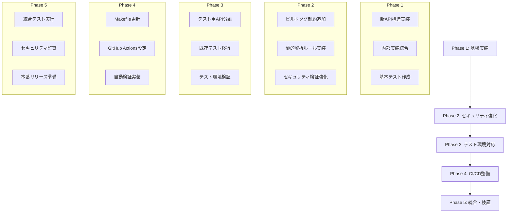
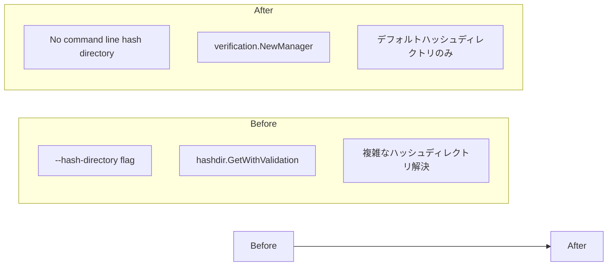
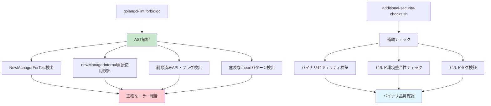
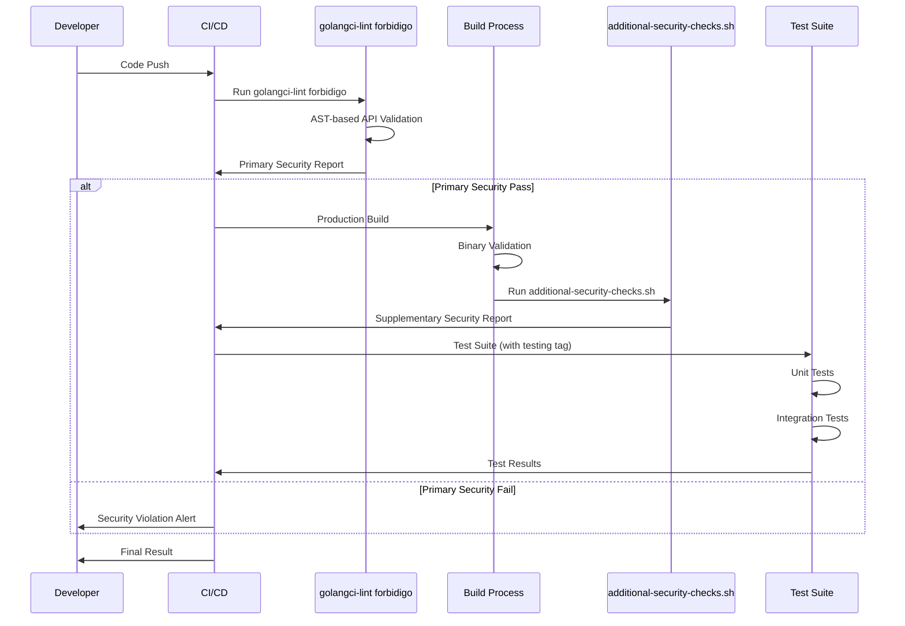

# 実装計画書：ハッシュディレクトリセキュリティ強化

## 1. 実装概要

### 1.1 プロジェクト情報
- **プロジェクト名**: ハッシュディレクトリセキュリティ強化
- **実装期間**: 2週間（想定）
- **優先度**: CRITICAL（セキュリティ脆弱性修正）
- **実装者**: 開発チーム
- **レビュワー**: セキュリティチーム + 開発リード

### 1.2 実装戦略
- **段階的実装**: 破壊的変更を最小限に抑制
- **後方互換性**: テスト環境での互換性維持
- **セキュリティ優先**: プロダクション環境のセキュリティ最大化
- **品質保証**: 包括的なテストと検証

### 1.3 実装フロー図



## 2. Phase別実装計画

### Phase 1: 基盤実装 (3-4日)

#### 1.1 新API構造の実装
- [x] **Task 1.1.1**: `internal/verification/types.go` 作成
  - Manager構造体の新設計実装
  - CreationMode, SecurityLevel enum定義
  - Option function型定義

- [x] **Task 1.1.2**: `internal/verification/errors.go` 作成
  - ProductionAPIViolationError実装
  - HashDirectorySecurityError実装
  - SecurityViolationError基底クラス

- [x] **Task 1.1.3**: `internal/verification/manager.go` 実装
  - newManagerInternal関数（内部実装）
  - セキュリティ制約検証ロジック
  - オプション処理システム

#### 1.2 プロダクション用API実装
- [x] **Task 1.2.1**: `internal/verification/manager_production.go` 作成
  - NewManager() 関数実装
  - デフォルトハッシュディレクトリ強制
  - プロダクション用セキュリティログ

- [x] **Task 1.2.2**: セキュリティ制約の実装
  - validateProductionConstraints関数
  - デフォルトハッシュディレクトリ検証
  - 追加のセキュリティチェック

#### 1.3 基本テストの作成
- [x] **Task 1.3.1**: プロダクション用API単体テスト
- [x] **Task 1.3.2**: エラーハンドリングテスト
- [x] **Task 1.3.3**: セキュリティ制約テスト

### Phase 2: セキュリティ強化 (2-3日)

#### 2.1 ビルドタグ制約の追加
- [x] **Task 2.1.1**: `internal/verification/manager_testing.go` 作成
  - `//go:build test` タグ追加
  - NewManagerForTest実装
  - テスト用セキュリティ制約

- [x] **Task 2.1.2**: 呼び出し元検証の実装
  - isCallerInTestFile関数
  - runtime.Caller利用した検証
  - 不正呼び出しの検出

#### 2.2 静的解析ルールの実装
- [x] **Task 2.2.1**: `.golangci-security.yml` 設定
  - forbidigo linterでテスト用API禁止
  - AST解析による正確な検出
  - フラグ定義の検出ルール

- [x] **Task 2.2.2**: `scripts/additional-security-checks.sh` 作成
  - バイナリセキュリティ検証（テストアーティファクト検出）
  - ビルド環境整合性チェック
  - ビルドタグ検証機能

#### 2.3 コマンドライン引数の削除
- [x] **Task 2.3.1**: `cmd/runner/main.go` 修正
  - `--hash-directory` フラグ削除
  - run()関数の簡素化
  - 新しいAPI使用への変更

- [x] **Task 2.3.2**: `internal/runner/hashdir/validation.go` 簡素化
  - GetHashDir関数削除
  - GetWithValidation関数削除
  - ValidateSecurely関数のみ保持

### Phase 3: テスト環境対応 (2-3日)

#### 3.1 既存テストの移行
- [x] **Task 3.1.1**: `cmd/runner/main_test.go` 修正
  - NewManagerForTest使用への変更
  - テスト用ビルドタグ追加
  - 既存テストケースの動作確認

- [x] **Task 3.1.2**: `cmd/runner/integration_test.go` 修正
  - カスタムハッシュディレクトリテストの更新
  - プロダクション環境シミュレーション
  - セキュリティ違反テスト追加

#### 3.2 テスト用APIの詳細実装
- [x] **Task 3.2.1**: テスト用オプション関数の実装
  - withFS, withFileValidatorDisabled等
  - テスト用セキュリティレベル設定
  - モック対応の強化

- [x] **Task 3.2.2**: テスト用エラーハンドリング
  - テスト環境用エラータイプ
  - より詳細なデバッグ情報
  - テスト失敗時の診断機能

#### 3.3 テスト環境での検証
- [x] **Task 3.3.1**: 単体テスト全実行・確認
- [x] **Task 3.3.2**: 統合テスト全実行・確認
- [x] **Task 3.3.3**: テストカバレッジ検証（58.4%達成）

### Phase 4: CI/CD整備 (2日)

#### 4.1 Makefileの更新
- [ ] **Task 4.1.1**: セキュリティチェックターゲット追加
  - `make security-check` 実装
  - `make build` にセキュリティチェック統合
  - 新しいテストターゲットの追加

- [ ] **Task 4.1.2**: ビルドプロセスの最適化
  - プロダクション/テストビルドの分離
  - 自動検証パイプライン
  - エラー時のわかりやすいメッセージ

#### 4.2 GitHub Actions設定
- [ ] **Task 4.2.1**: `.github/workflows/security-enhanced-ci.yml` 作成
  - セキュリティ検証ジョブ
  - ビルド・テストジョブ
  - デプロイメント検証ジョブ

- [ ] **Task 4.2.2**: セキュリティスキャンの統合
  - Gosec統合
  - Trivy脆弱性スキャン
  - 自動セキュリティレポート生成

#### 4.3 開発者ツールの整備
- [ ] **Task 4.3.1**: 開発者向けスクリプト作成
  - `scripts/validate-production-binary.sh`
  - `scripts/build-security-check.sh`
  - デバッグ支援ツール

### Phase 5: 統合・検証 (2-3日)

#### 5.1 統合テスト・品質保証
- [ ] **Task 5.1.1**: 全機能統合テスト
  - エンドツーエンドテスト実行
  - 異常系テストの網羅的実施
  - パフォーマンス回帰テスト

- [ ] **Task 5.1.2**: セキュリティ監査
  - セキュリティ脆弱性の最終確認
  - 攻撃シナリオテスト
  - 第三者によるセキュリティレビュー

#### 5.2 ドキュメント整備
- [ ] **Task 5.2.1**: APIドキュメント更新
  - 新しいAPI使用方法の記載
  - 移行ガイドの作成
  - セキュリティ考慮事項の明記

- [ ] **Task 5.2.2**: README・セキュリティドキュメント更新
  - 破壊的変更の説明
  - セキュリティ強化内容の記載
  - 開発者向け注意事項

#### 5.3 リリース準備
- [ ] **Task 5.3.1**: リリースノート作成
  - BREAKING CHANGESセクション
  - セキュリティ修正の詳細
  - 移行手順の説明

- [ ] **Task 5.3.2**: 本番環境リリース準備
  - バックアップ・ロールバック計画
  - 段階的デプロイメント戦略
  - 監視・アラート設定

## 3. 実装詳細

### 3.1 重要ファイルの変更内容

#### cmd/runner/main.go


#### 実装前後の比較

**変更前:**
```go
var hashDirectory = flag.String("hash-directory", "", "...")

func run(runID string) error {
    validatedHashDir, err := hashdir.GetWithValidation(hashDirectory, cmdcommon.DefaultHashDirectory)
    verificationManager, err := bootstrap.InitializeVerificationManager(validatedHashDir, runID)
}
```

**変更後:**
```go
// hashDirectoryフラグ削除

func run(runID string) error {
    verificationManager, err := verification.NewManager()
    // セキュア：デフォルトハッシュディレクトリのみ使用
}
```

### 3.2 API設計の実装

#### プロダクション用API実装例
```go
// internal/verification/manager_production.go
func NewManager() (*Manager, error) {
    // 1. セキュリティログ記録
    logProductionManagerCreation()

    // 2. デフォルトハッシュディレクトリ検証
    if err := validateDefaultHashDirectory(); err != nil {
        return nil, err
    }

    // 3. セキュアな内部実装呼び出し
    return newManagerInternal(
        cmdcommon.DefaultHashDirectory,
        withCreationMode(CreationModeProduction),
    )
}
```

#### テスト用API実装例
```go
// internal/verification/manager_testing.go
//go:build test

func NewManagerForTest(hashDir string, options ...Option) (*Manager, error) {
    // 1. 呼び出し元検証
    if !isCallerInTestFile() {
        return nil, &ProductionAPIViolationError{}
    }

    // 2. テスト用内部実装呼び出し
    return newManagerInternal(hashDir, append(options,
        withCreationMode(CreationModeTesting),
    )...)
}
```

### 3.3 セキュリティ検証の実装

#### AST-based静的解析構造


## 4. テスト計画

### 4.1 テスト戦略

#### 単体テスト
- **対象**: 各APIの基本機能
- **カバレッジ目標**: 90%以上
- **重点領域**: セキュリティ制約、エラーハンドリング

#### 統合テスト
- **対象**: エンドツーエンドの動作
- **重点領域**: プロダクション/テスト環境の分離確認

#### セキュリティテスト
- **対象**: 攻撃シナリオの防御確認
- **重点領域**: API誤用の検出、権限昇格防止

### 4.2 テスト実行フロー



## 5. リスク管理と対策

### 5.1 技術的リスク

| リスク | 影響度 | 発生確率 | 対策 |
|--------|--------|----------|------|
| 破壊的変更による既存機能停止 | 高 | 中 | 段階的リリース、詳細な移行ガイド |
| テスト環境での開発効率低下 | 中 | 低 | 充実したテスト用API、サンプルコード |
| ビルドプロセスの複雑化 | 低 | 中 | 自動化スクリプト、明確なドキュメント |
| パフォーマンス回帰 | 低 | 低 | ベンチマークテスト、最適化 |

### 5.2 運用リスク

| リスク | 影響度 | 発生確率 | 対策 |
|--------|--------|----------|------|
| 本番環境でのトラブル | 高 | 低 | 包括的テスト、ロールバック計画 |
| 開発者の学習コスト | 中 | 高 | 詳細ドキュメント、サンプル提供 |
| CI/CDパイプライン障害 | 中 | 低 | 冗長化、手動回避手順 |

### 5.3 緊急対応計画

#### ロールバック手順
1. **即座のロールバック**: 前バージョンバイナリへの切り戻し
2. **設定復旧**: 旧設定ファイルの適用
3. **検証実行**: 基本機能の動作確認
4. **根本原因分析**: 問題の特定と修正計画

## 6. 成功指標とモニタリング

### 6.1 成功指標

#### セキュリティ指標
- [ ] 脆弱性スキャン結果: 0件
- [ ] セキュリティテスト通過率: 100%
- [ ] 静的解析合格率: 100%

#### 品質指標
- [ ] 単体テストカバレッジ: ≥90%
- [ ] 統合テスト成功率: 100%
- [ ] ビルド成功率: 100%

#### 運用指標
- [ ] プロダクション環境エラー率: <0.1%
- [ ] テスト実行時間増加: <10%
- [ ] ビルド時間増加: <5%

### 6.2 モニタリング計画

#### ビルド時モニタリング
```bash
# セキュリティチェック結果の監視
make security-check || alert "Security validation failed"

# テスト実行時間の監視
time make test | awk '/real/ {print "Test duration: " $2}'

# ビルドサイズの監視
ls -la build/ | awk '{print "Binary size: " $5}'
```

#### 実行時モニタリング
```go
// セキュリティイベントのログ監視
if _, file, line, ok := runtime.Caller(1); ok {
    slog.Info("Security event",
        "event_type", "api_usage",
        "api_name", "NewManager",
        "caller_file", file,
        "caller_line", line)
}
```

## 7. 完了基準

### 7.1 Phase完了基準

#### Phase 1: 基盤実装
- [ ] 全新API実装完了
- [ ] 基本単体テスト通過
- [ ] プロダクション用API動作確認

#### Phase 2: セキュリティ強化
- [ ] ビルドタグ制約実装完了
- [ ] 静的解析ルール実装・検証
- [ ] コマンドライン引数削除完了

#### Phase 3: テスト環境対応
- [ ] 既存テスト100%移行完了
- [ ] テスト用API実装・検証完了
- [ ] テストカバレッジ目標達成

#### Phase 4: CI/CD整備
- [ ] Makefile更新完了
- [ ] GitHub Actions動作確認
- [ ] 自動セキュリティ検証動作確認

#### Phase 5: 統合・検証
- [ ] 全機能統合テスト通過
- [ ] セキュリティ監査完了
- [ ] リリース準備完了

### 7.2 最終完了基準

#### 必須項目 (MUST)
- [ ] `--hash-directory`フラグ完全削除
- [ ] プロダクション環境でのカスタムハッシュディレクトリ指定不可能
- [ ] テスト用API誤用の自動検出機能
- [ ] 全既存テストの正常動作
- [ ] セキュリティスキャン100%合格

#### 推奨項目 (SHOULD)
- [ ] 詳細なドキュメント整備
- [ ] 移行ガイド提供
- [ ] パフォーマンス回帰なし
- [ ] 開発者向けツール整備

#### 任意項目 (MAY)
- [ ] 追加のセキュリティ機能
- [ ] パフォーマンス最適化
- [ ] 追加のテストケース
