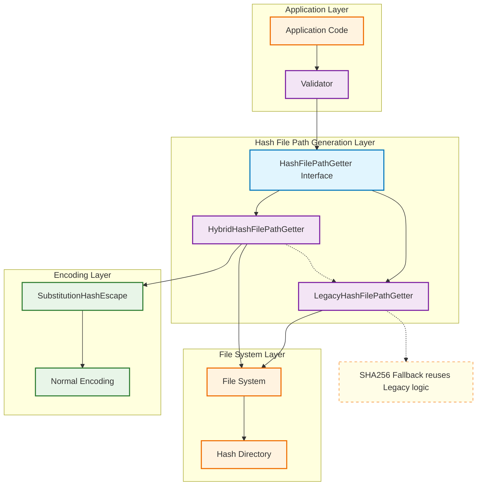
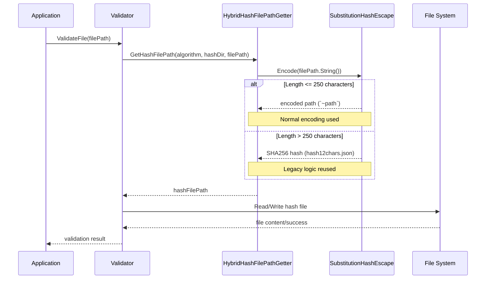
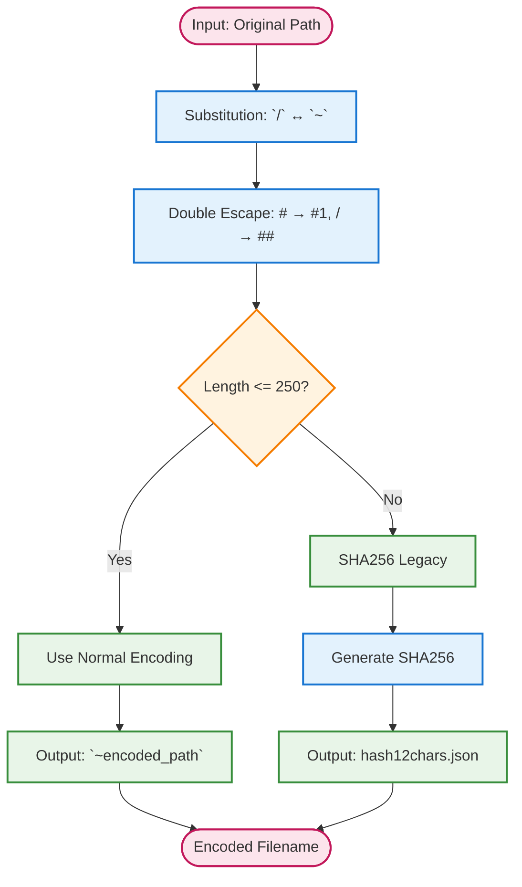
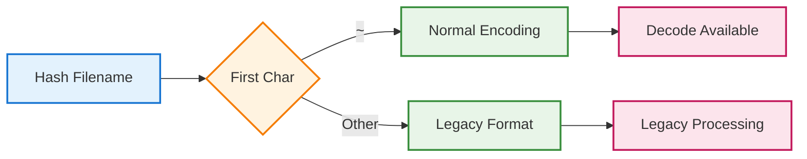
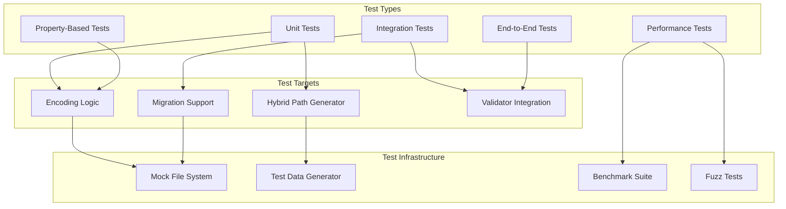

# アーキテクチャ設計書：ハイブリッドハッシュファイル名エンコーディング

## 1. システム概要 (System Overview)

### 1.1. アーキテクチャの目的

本アーキテクチャは、go-safe-cmd-runnerプロジェクトにおけるファイル整合性検証用ハッシュファイルの命名方式を、従来のSHA256短縮方式からハイブリッド換字+ダブルエスケープ方式に変更することを目的とする。

### 1.2. 設計原則

- **Space Efficiency**: 通常ケースで1.00x膨張率を実現
- **Reversibility**: 数学的に保証された完全な可逆性
- **Robustness**: NAME_MAX制限に対する自動フォールバック
- **Compatibility**: 既存システムとの段階的移行サポート
- **Simplicity**: 理解しやすく保守可能な実装

## 2. システムアーキテクチャ (System Architecture)

### 2.1. 全体アーキテクチャ図



### 2.2. コンポーネント間関係

#### 2.2.1 レイヤー構造

| レイヤー | 責務 | 主要コンポーネント |
|----------|------|-------------------|
| Application | アプリケーション固有の処理 | cmd/record, cmd/runner, cmd/verify |
| Validation | ファイル検証・ハッシュ管理 | Validator |
| Path Generation | ハッシュファイルパス生成 | HashFilePathGetter実装群 |
| Encoding | ファイル名エンコーディング | SubstitutionHashEscape |
| File System | ファイルシステム操作 | OS File System |

#### 2.2.2 データフロー



## 3. コンポーネント設計 (Component Design)

### 3.1. SubstitutionHashEscape

#### 3.1.1 責務

- ファイルパスの換字+ダブルエスケープエンコーディング
- エンコード済みファイル名のデコーディング
- NAME_MAX制限チェックとlegacy方式フォールバック

#### 3.1.2 実装構造

```go
type SubstitutionHashEscape struct {
    maxLength int // NAME_MAX制限（デフォルト: 250）
}

type EncodingResult struct {
    EncodedName string
    UsedLegacy  bool
    OriginalLength int
    EncodedLength  int
}
```

#### 3.1.3 エンコーディングアルゴリズム



### 3.2. HybridHashFilePathGetter

#### 3.2.1 責務

- HashFilePathGetterインターフェースの実装
- SubstitutionHashEscapeとの連携
- 長いパス名に対するlegacy方式の再利用
- エラーハンドリングとログ出力

#### 3.2.2 実装構造

```go
type HybridHashFilePathGetter struct {
    encoder *SubstitutionHashEscape
    logger  Logger // ログ出力用
}

func (h *HybridHashFilePathGetter) GetHashFilePath(
    hashAlgorithm HashAlgorithm,
    hashDir string,
    filePath common.ResolvedPath) (string, error)
```

### 3.3. 移行サポートコンポーネント

#### 3.3.1 MigrationHashFilePathGetter

```go
type MigrationHashFilePathGetter struct {
    newGetter    HashFilePathGetter // HybridHashFilePathGetter
    legacyGetter HashFilePathGetter // 既存のSHA256短縮方式
    fileSystem   FileSystemInterface
}

func (m *MigrationHashFilePathGetter) GetHashFilePath(
    hashAlgorithm HashAlgorithm,
    hashDir string,
    filePath common.ResolvedPath) (string, error) {

    // 新方式を優先、存在しない場合は旧方式確認
    // 移行ログ出力
}
```

## 4. インターフェース設計 (Interface Design)

### 4.1. 既存インターフェースの拡張

#### 4.1.1 HashFilePathGetter (既存)

```go
type HashFilePathGetter interface {
    GetHashFilePath(
        hashAlgorithm HashAlgorithm,
        hashDir string,
        filePath common.ResolvedPath) (string, error)
}
```

#### 4.1.2 新規インターフェース

```go
// ファイル名エンコーディングの抽象化
type FilenameEncoder interface {
    Encode(path string) string
    Decode(encoded string) (string, error)
}

// デバッグ・分析用インターフェース
type EncodingAnalyzer interface {
    AnalyzeEncoding(path string) EncodingResult
    GetExpansionRatio(path string) float64
    IsNormalEncoding(encoded string) bool
}

// 移行サポート用インターフェース
type MigrationSupport interface {
    FindExistingHashFile(
        hashDir string,
        filePath common.ResolvedPath) (string, bool, error)
    MigrateHashFile(
        oldPath, newPath string) error
}
```

### 4.2. エラーハンドリング

#### 4.2.1 カスタムエラータイプ

```go
// エンコーディング関連エラー
type EncodingError struct {
    Operation string // "encode", "decode"
    Path      string
    Reason    string
    Err       error
}

// ファイルパス生成関連エラー
type HashFilePathError struct {
    Algorithm HashAlgorithm
    HashDir   string
    FilePath  common.ResolvedPath
    Reason    string
    Err       error
}
```

## 5. データ設計 (Data Design)

### 5.1. エンコーディング仕様

#### 5.1.1 通常エンコーディング

| ステップ | 変換ルール | 例 |
|----------|------------|-----|
| 1. 換字 | `/` ↔ `~` | `/home/user` → `~home~user` |
| 2. エスケープ | `#` → `#1`, `/` → `##` | `~home~user` → `~home~user` |

#### 5.1.2 Legacy方式エンコーディング（フォールバック）

| 形式 | 構造 | 例 |
|------|------|-----|
| プレフィックス | なし | `` |
| ハッシュ部 | SHA256の12文字 | `AbCdEf123456` |
| 拡張子 | `.json` | `.json` |
| 合計 | 17文字 | `AbCdEf123456.json` |

### 5.2. ファイル識別方式



### 5.3. 設定定数

```go
const (
    // エンコーディング関連定数
    DefaultMaxFilenameLength = 250  // NAME_MAX - 安全マージン
    DefaultHashLength        = 12   // SHA256ハッシュの使用文字数
)
```

## 6. セキュリティ設計 (Security Design)

### 6.1. セキュリティ考慮事項

#### 6.1.1 入力検証

- **パス文字列の長さ制限**: 異常に長い入力に対する保護
- **不正文字の検出**: ファイルパスとして不適切な文字の検証
- **nullバイト攻撃の防止**: 文字列の null termination 検証

#### 6.1.2 情報漏洩の防止

- **エラーメッセージの制御**: センシティブなパス情報の漏洩防止
- **ログ出力の制御**: デバッグ情報における機密情報の除去
- **一時データの適切な処理**: メモリ上の機密データのクリア

#### 6.1.3 ファイルシステムセキュリティ

- **ディレクトリトラバーサル攻撃の防止**: `../` 等を含むパスの適切な処理
- **シンボリックリンク攻撃の防止**: リンク先の検証
- **権限昇格の防止**: ハッシュディレクトリ外へのアクセス制御

### 6.2. セキュリティ実装

```go
type SecurityValidator struct {
    maxPathLength    int
    allowedChars     *charset.Set
    forbiddenPattern *regexp.Regexp
}

func (s *SecurityValidator) ValidateInput(path string) error {
    // 長さチェック、文字チェック、パターンチェック
}
```

## 7. パフォーマンス設計 (Performance Design)

### 7.1. パフォーマンス目標

| メトリック | 目標値 | 測定方法 |
|------------|--------|----------|
| エンコード速度 | 10,000 paths/sec | ベンチマークテスト |
| メモリ使用量 | < 1MB per 1000 paths | メモリプロファイリング |
| 空間効率 | 1.00x (99%+ files) | 実世界データ測定 |
| Legacy方式時間 | < 1ms per path | 単体測定 |

### 7.2. 最適化戦略

#### 7.2.1 文字列処理の最適化

```go
// strings.Builderを使用した効率的な文字列構築
func (e *SubstitutionHashEscape) encodeOptimized(path string) string {
    var builder strings.Builder
    builder.Grow(len(path) * 2) // 予想される容量で事前確保

    // 効率的な一回走査でエンコーディング実行
}
```

#### 7.2.2 メモリプールの活用

```go
var builderPool = sync.Pool{
    New: func() interface{} {
        return &strings.Builder{}
    },
}

func (e *SubstitutionHashEscape) Encode(path string) string {
    builder := builderPool.Get().(*strings.Builder)
    defer func() {
        builder.Reset()
        builderPool.Put(builder)
    }()

    // エンコーディング処理
}
```

### 7.3. 測定・監視

#### 7.3.1 パフォーマンス測定機能

```go
type PerformanceMetrics struct {
    EncodingDuration    time.Duration
    DecodingDuration    time.Duration
    ExpansionRatio      float64
    LegacyUsageCount    int64
    MemoryUsage         int64
}

type PerformanceMonitor struct {
    metrics     map[string]*PerformanceMetrics
    mutex       sync.RWMutex
    sampleSize  int
}
```

## 8. 運用設計 (Operations Design)

### 8.1. ログ出力設計

#### 8.1.1 ログレベル

| レベル | 内容 | 例 |
|--------|------|-----|
| DEBUG | エンコーディング詳細 | `Encoding path: /long/path -> ~long~path` |
| INFO | Legacy方式使用 | `Long path detected, using legacy SHA256 encoding` |
| WARN | 移行関連警告 | `Legacy hash file found, consider migration` |
| ERROR | エラー状況 | `Failed to encode path: invalid characters` |

#### 8.1.2 構造化ログ

```go
type LogEntry struct {
    Timestamp    time.Time `json:"timestamp"`
    Level        string    `json:"level"`
    Component    string    `json:"component"`
    Operation    string    `json:"operation"`
    FilePath     string    `json:"file_path,omitempty"`
    EncodedName  string    `json:"encoded_name,omitempty"`
    UsedLegacy   bool      `json:"used_legacy,omitempty"`
    Duration     string    `json:"duration,omitempty"`
    Error        string    `json:"error,omitempty"`
}
```

### 8.2. 監視・メトリクス

#### 8.2.1 運用メトリクス

- **Legacy方式使用率**: legacy SHA256方式の使用頻度
- **エンコーディング成功率**: エンコード・デコード処理の成功率
- **平均膨張率**: ファイル名の空間効率測定
- **処理時間分布**: エンコード処理時間のヒストグラム

#### 8.2.2 アラート設定

```go
type AlertThresholds struct {
    LegacyUsagePercent      float64 // Legacy方式使用率 > 5%
    EncodingFailurePercent  float64 // エンコード失敗率 > 1%
    AverageExpansionRatio   float64 // 平均膨張率 > 1.1
    ProcessingTimeMS        int64   // 処理時間 > 10ms
}
```

### 8.3. 移行運用

#### 8.3.1 段階的移行手順

1. **準備フェーズ**: 新システムのデプロイ（読み込みのみ）
2. **並行フェーズ**: 新システムでの書き込み開始
3. **移行フェーズ**: 旧ハッシュファイルの段階的変換
4. **完了フェーズ**: 旧システムの削除

#### 8.3.2 ロールバック計画

```go
type RollbackManager struct {
    backupDir     string
    rollbackQueue []string
    validator     *Validator
}

func (r *RollbackManager) PrepareRollback() error {
    // 旧システムへの復旧準備
}

func (r *RollbackManager) ExecuteRollback() error {
    // 旧システムへの緊急復旧実行
}
```

## 9. テスト戦略 (Testing Strategy)

### 9.1. テストアーキテクチャ



### 9.2. テスト自動化

#### 9.2.1 CI/CD パイプライン

```yaml
# .github/workflows/hash-encoding-tests.yml
name: Hash Encoding Tests
on: [push, pull_request]
jobs:
  unit-tests:
    runs-on: ubuntu-latest
    steps:
      - name: Run unit tests
        run: go test ./internal/filevalidator/... -v -race -coverprofile=coverage.out

  property-tests:
    runs-on: ubuntu-latest
    steps:
      - name: Run property-based tests
        run: go test ./internal/filevalidator/... -tags property -v

  performance-tests:
    runs-on: ubuntu-latest
    steps:
      - name: Run benchmark tests
        run: go test ./internal/filevalidator/... -bench=. -benchmem
```

## 10. デプロイメント設計 (Deployment Design)

### 10.1. デプロイメント戦略

#### 10.1.1 ブルーグリーンデプロイメント

- **ブルー環境**: 既存のSHA256短縮方式
- **グリーン環境**: 新しいハイブリッド方式
- **段階的切り替え**: 読み込み → 書き込み → 完全移行

## 11. 今後の拡張性 (Future Extensibility)

### 11.1. 拡張ポイント

#### 11.1.1 エンコーディング方式の追加

```go
type EncodingStrategy interface {
    Name() string
    Encode(path string) (string, error)
    Decode(encoded string) (string, error)
    MaxLength() int
}

type EncodingRegistry struct {
    strategies map[string]EncodingStrategy
    default    string
}
```

#### 11.1.2 ファイルシステム対応の拡張

```go
type FileSystemSupport interface {
    MaxFilenameLength() int
    ForbiddenChars() []rune
    IsCaseSensitive() bool
    SupportUnicode() bool
}
```

### 11.2. 将来的な改善案

- **压缩アルゴリズムの追加**: より効率的な圧縮方式の実装
- **暗号化サポート**: ハッシュファイル名の暗号化機能
- **分散ストレージ対応**: クラウドストレージでの動作最適化
- **機械学習による最適化**: パスパターン学習による動的最適化
