# アーキテクチャ設計書：コマンド出力キャプチャ機能

## 1. 概要 (Overview)

### 1.1 目的
本文書は、go-safe-cmd-runnerにおけるコマンド出力キャプチャ機能の高レベルアーキテクチャを定義する。この機能により、実行されるコマンドの標準出力を指定されたファイルに安全かつ効率的に保存できるようになる。

### 1.2 設計原則
- **セキュリティファースト**: パストラバーサル攻撃の防止、適切なファイル権限管理
- **権限分離**: コマンド実行権限と出力ファイル権限の明確な分離
- **既存アーキテクチャとの整合性**: 現在のResourceManager/Executor パターンとの統合
- **Dry-Run対応**: 実行前の出力予測と検証
- **エラーハンドリング**: 部分失敗の適切な処理とクリーンアップ

## 2. システムアーキテクチャ概要

### 2.1 コンポーネント配置

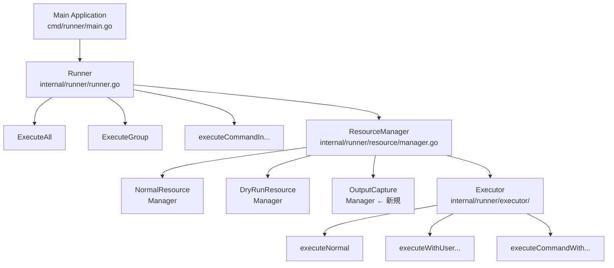

### 2.2 データフロー概要

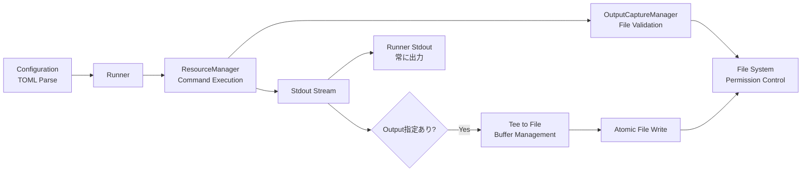

## 3. 新規コンポーネント設計

### 3.1 OutputCaptureManager
新たに導入するコアコンポーネントで、出力キャプチャのライフサイクル全体を管理する。

#### 3.1.1 責任範囲
- 出力パスの検証とセキュリティチェック
- ディレクトリの自動作成と権限管理
- ストリーミング書き込みとバッファ管理
- 出力サイズ制限の監視
- 原子的ファイル操作の実装
- エラー時のクリーンアップ

#### 3.1.2 インターフェース
```go
type OutputCaptureManager interface {
    // 出力キャプチャの準備（事前検証）
    PrepareOutput(outputPath string, workDir string, maxSize int64) (*OutputCapture, error)

    // ストリーミング出力書き込み
    WriteOutput(capture *OutputCapture, data []byte) error

    // 出力完了と最終化
    FinalizeOutput(capture *OutputCapture) error

    // エラー時のクリーンアップ
    CleanupOutput(capture *OutputCapture) error

    // Dry-Run用の分析
    AnalyzeOutput(outputPath string, workDir string) (*OutputAnalysis, error)
}
```

### 3.2 OutputCapture 構造体
個別の出力キャプチャセッションを管理する。

```go
type OutputCapture struct {
    OutputPath   string    // 最終出力先パス
    TempPath     string    // 一時ファイルパス
    TempFile     *os.File  // 一時ファイルハンドル
    MaxSize      int64     // 最大出力サイズ
    CurrentSize  int64     // 現在の書き込みサイズ
    StartTime    time.Time // 開始時刻
}
```

### 3.3 OutputAnalysis 構造体 (Dry-Run用)
```go
type OutputAnalysis struct {
    OutputPath      string        // 出力先パス
    ResolvedPath    string        // 解決済み絶対パス
    DirectoryExists bool          // ディレクトリ存在確認
    WritePermission bool          // 書き込み権限確認
    EstimatedSize   string        // 推定サイズ ("Unknown"等)
    SecurityRisk    SecurityLevel // セキュリティリスク評価
    MaxSizeLimit    int64         // サイズ制限
}
```

## 4. 既存コンポーネントとの統合

### 4.1 ResourceManager 統合パターン
既存のResourceManagerインターフェースを拡張し、出力キャプチャ機能を統合する。

#### 4.1.1 NormalResourceManager 拡張
```go
type NormalResourceManager struct {
    // 既存フィールド
    executor         executor.CommandExecutor
    pathResolver     PathResolver
    privilegeManager runnertypes.PrivilegeManager

    // 新規追加フィールド
    outputManager    OutputCaptureManager  // 出力キャプチャ管理
    maxOutputSize    int64                // デフォルト出力サイズ制限
}
```

#### 4.1.2 DryRunResourceManager 拡張
```go
type DryRunResourceManager struct {
    // 既存フィールド
    executor         executor.CommandExecutor
    pathResolver     PathResolver

    // 新規追加フィールド
    outputManager    OutputCaptureManager  // 出力分析用
}
```

### 4.2 Command構造体拡張
既存のCommand構造体にoutputフィールドを追加する。

```go
type Command struct {
    // 既存フィールド
    Name         string   `toml:"name"`
    Description  string   `toml:"description"`
    Cmd          string   `toml:"cmd"`
    Args         []string `toml:"args"`
    // ... その他既存フィールド

    // 新規追加フィールド
    Output       string   `toml:"output"`  // 標準出力の書き込み先ファイル
}
```

### 4.3 GlobalConfig構造体拡張
グローバル設定にデフォルト出力サイズ制限を追加する。

```go
type GlobalConfig struct {
    // 既存フィールド
    Timeout           int      `toml:"timeout"`
    WorkDir           string   `toml:"workdir"`
    // ... その他既存フィールド

    // 新規追加フィールド
    MaxOutputSize     int64    `toml:"max_output_size"`  // デフォルト出力サイズ制限
}
```

## 5. 実行フロー設計

### 5.1 通常実行モードのフロー

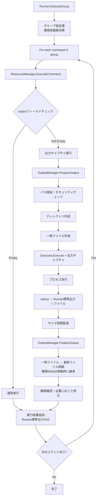

### 5.2 Dry-Runモードのフロー

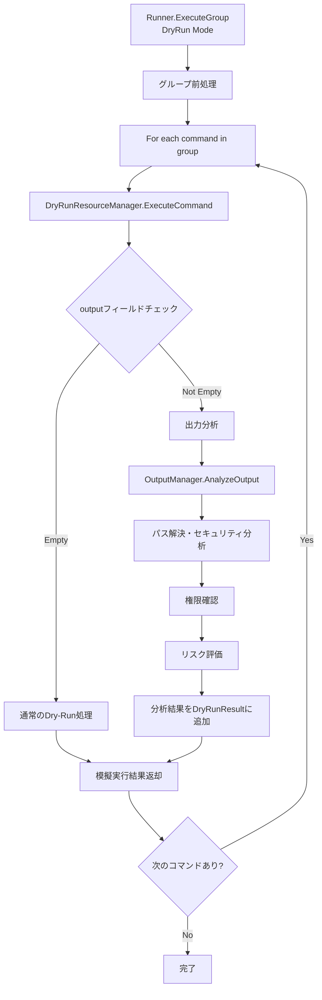

## 6. セキュリティアーキテクチャ

### 6.1 権限分離モデル

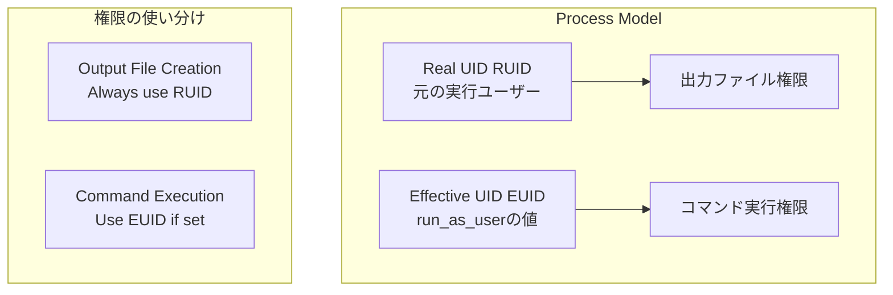

### 6.2 セキュリティ検証フロー

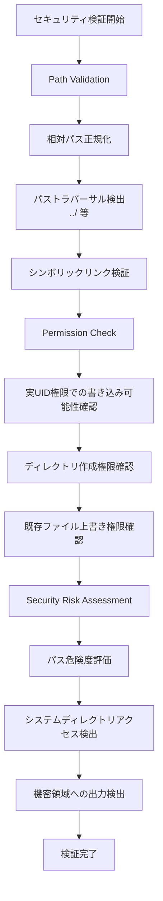

### 6.3 ファイル権限管理

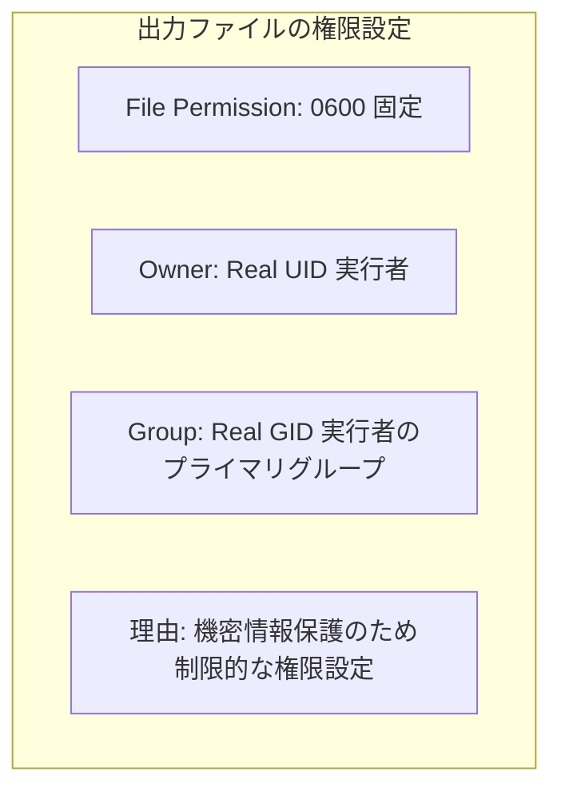

## 7. エラーハンドリング戦略

### 7.1 エラー分類と対応
```go
type OutputCaptureError struct {
    Type    ErrorType
    Path    string
    Phase   ExecutionPhase
    Cause   error
}

type ErrorType int
const (
    ErrorTypePathValidation ErrorType = iota  // パス検証エラー
    ErrorTypePermission                       // 権限エラー
    ErrorTypeFileSystem                       // ファイルシステムエラー
    ErrorTypeSizeLimit                        // サイズ制限エラー
    ErrorTypeCleanup                          // クリーンアップエラー
)

type ExecutionPhase int
const (
    PhasePreparation ExecutionPhase = iota    // 準備段階
    PhaseExecution                            // 実行段階
    PhaseFinalization                         // 完了段階
    PhaseCleanup                              // クリーンアップ段階
)
```

### 7.2 エラー復旧戦略

| エラー段階 | 対応戦略 | 影響範囲 |
|------------|----------|----------|
| 準備段階失敗 | コマンド実行中止 | 該当コマンドのみ |
| 実行中ファイルエラー | プロセス強制終了 | 該当コマンドのみ |
| サイズ制限超過 | プロセス強制終了 | 該当コマンドのみ |
| 完了段階失敗 | 一時ファイル削除 | 該当コマンドのみ |
| クリーンアップ失敗 | ログ記録・継続 | 影響なし |

## 8. パフォーマンス設計

### 8.1 メモリ効率戦略
```go
// ストリーミング書き込み設定
const (
    DefaultBufferSize = 64 * 1024    // 64KB バッファ（bufio.Writerが自動管理）
    MaxBufferSize     = 1024 * 1024  // 1MB 最大バッファ
)

// サイズ制限
const (
    DefaultMaxOutputSize = 10 * 1024 * 1024  // 10MB デフォルト制限
    AbsoluteMaxSize      = 100 * 1024 * 1024 // 100MB 絶対制限
)
```

### 8.2 I/O効率戦略

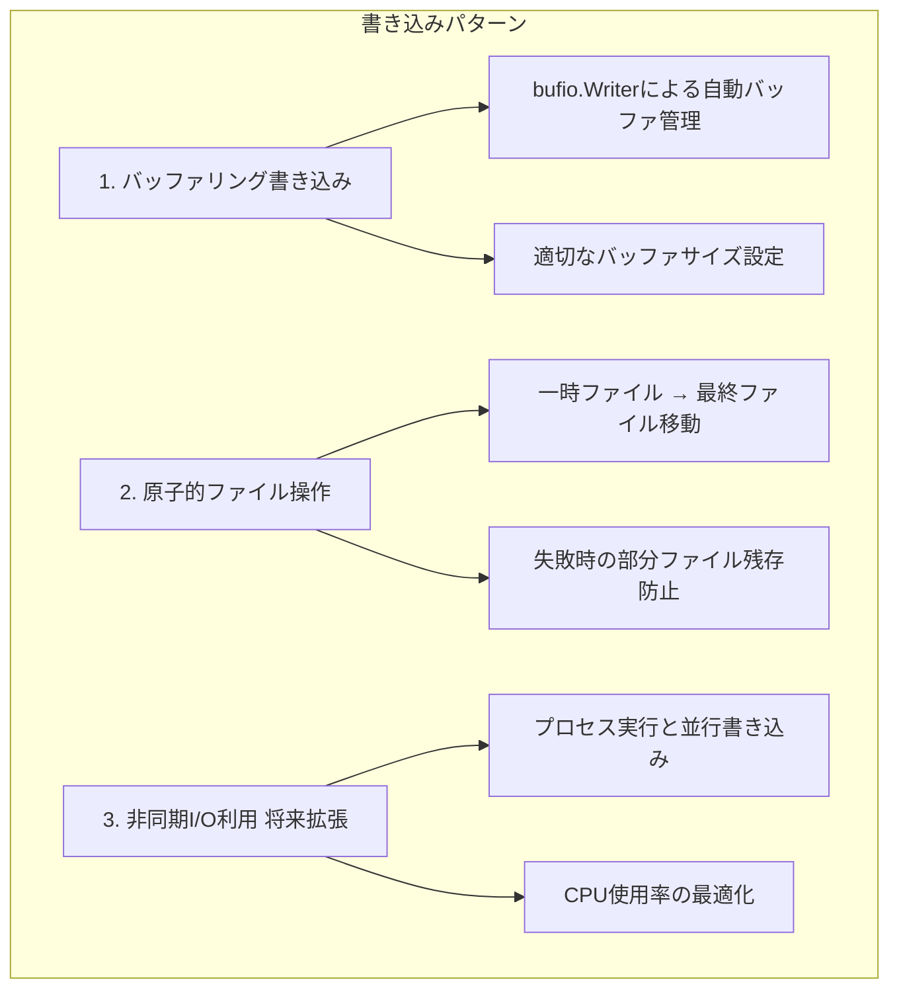

## 9. 拡張性設計

### 9.1 将来拡張ポイント

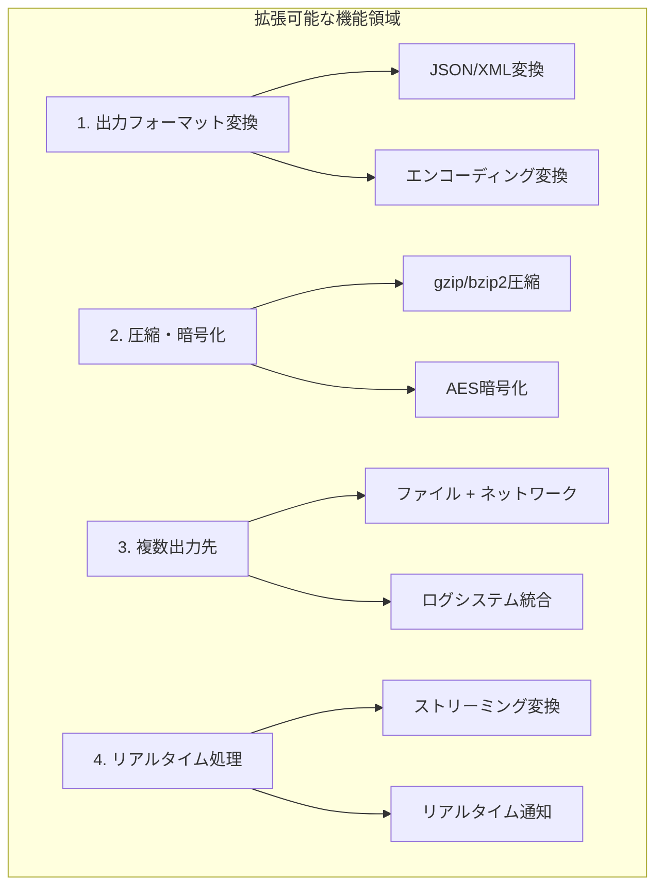

### 9.2 インターフェース設計
```go
// プラグイン可能な出力プロセッサ（将来拡張）
type OutputProcessor interface {
    ProcessOutput(data []byte) ([]byte, error)
    Finalize() error
}

// 設定可能な出力ハンドラー（将来拡張）
type OutputHandler interface {
    HandleOutput(capture *OutputCapture, data []byte) error
    SupportedSchemes() []string  // file://, s3://, http:// etc.
}
```

## 10. テスト戦略アーキテクチャ

### 10.1 テストレベル設計

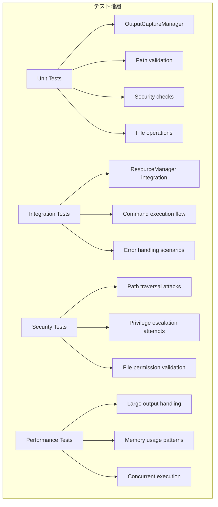

### 10.2 モック戦略
```go
// テスト用モックインターフェース
type MockOutputCaptureManager struct {
    PrepareOutputFunc    func(string, string, int64) (*OutputCapture, error)
    WriteOutputFunc      func(*OutputCapture, []byte) error
    FinalizeOutputFunc   func(*OutputCapture) error
    CleanupOutputFunc    func(*OutputCapture) error
}

// ExtendedFileSystemのモック
type MockExtendedFileSystem struct {
    // common.FileSystemの埋め込み
    *common.DefaultFileSystem

    // 拡張機能のモック関数
    CreateTempFileFunc  func(dir, pattern string) (*os.File, error)
    StatFunc           func(path string) (os.FileInfo, error)
    ChownFunc          func(path string, uid, gid int) error
    ChmodFunc          func(path string, mode os.FileMode) error
    RenameFunc         func(oldpath, newpath string) error
    OpenFunc           func(name string) (*os.File, error)
    OpenFileFunc       func(name string, flag int, perm os.FileMode) (*os.File, error)
}
```

## 11. 運用考慮事項

### 11.1 監視・ログ戦略
```go
// ログ出力項目
type OutputCaptureMetrics struct {
    CommandName     string        `json:"command_name"`
    OutputPath      string        `json:"output_path"`
    OutputSize      int64         `json:"output_size"`
    Duration        time.Duration `json:"duration"`
    Success         bool          `json:"success"`
    ErrorType       string        `json:"error_type,omitempty"`
    SecurityRisk    string        `json:"security_risk"`
}
```

### 11.2 リソース管理

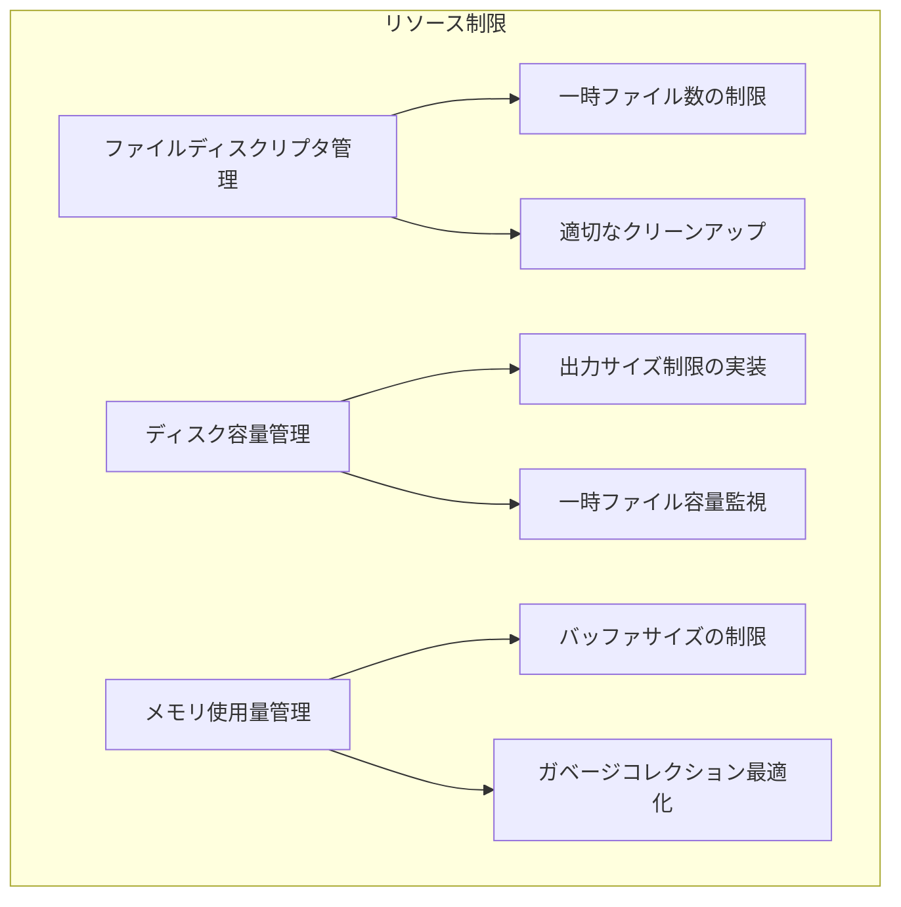

この設計により、既存のgo-safe-cmd-runnerアーキテクチャと整合性を保ちながら、安全で効率的なコマンド出力キャプチャ機能を実現できる。
