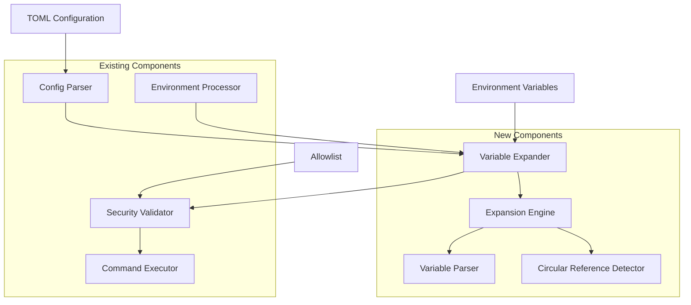
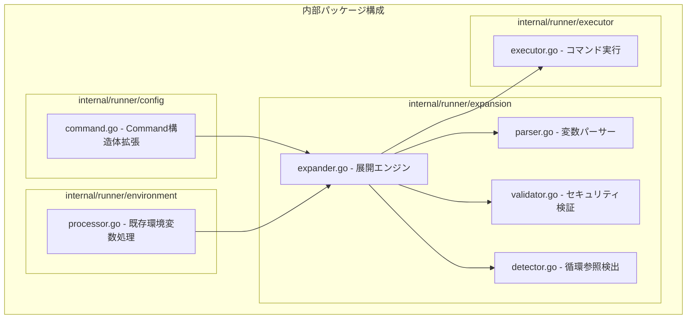
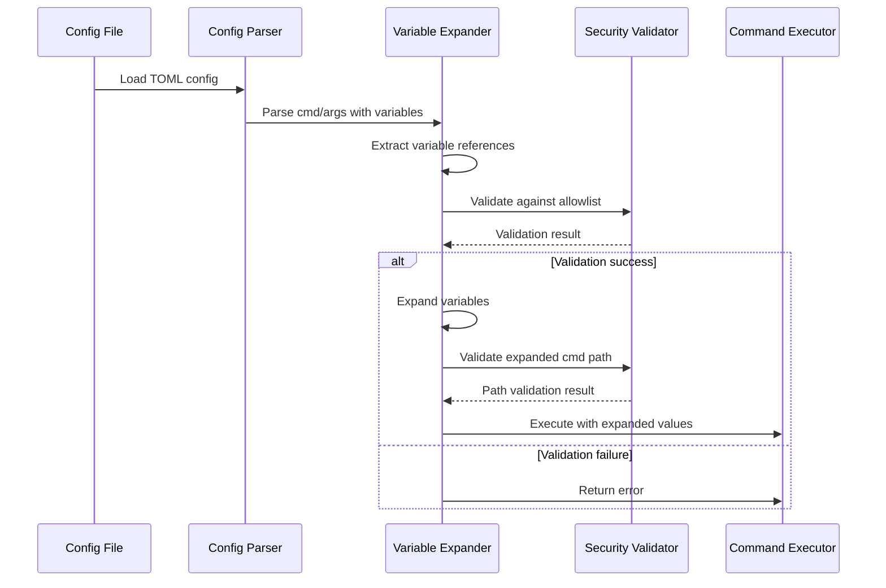
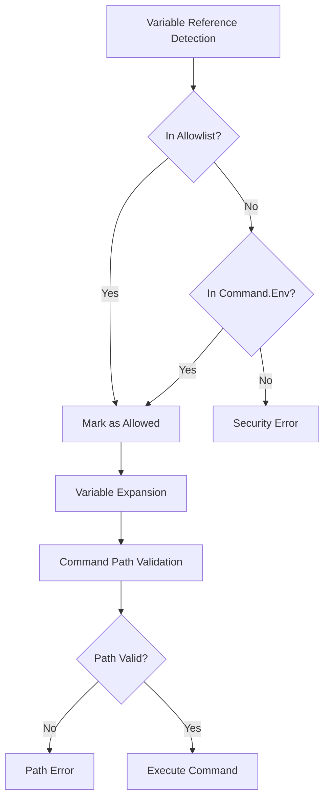
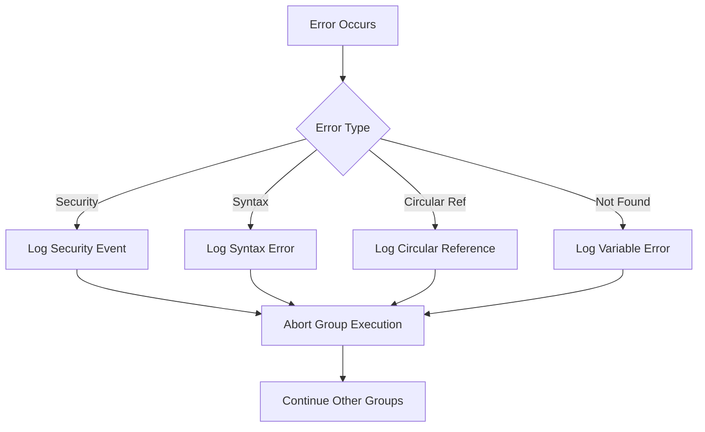

# アーキテクチャ設計書: コマンド・引数内環境変数展開機能

## 1. システム概要

### 1.1 アーキテクチャ目標
- 既存システムへの影響最小化
- セキュリティの堅牢性確保
- 高性能な変数展開処理
- モジュラー設計による保守性向上

### 1.2 設計原則
- **セキュリティファースト**: allowlist検証を展開前に実施
- **関心の分離**: 変数展開ロジックを独立モジュール化
- **既存互換性**: 既存設定ファイルの無変更動作
- **段階的処理**: 検証→展開→実行の明確な分離

## 2. システム構成

### 2.1 全体アーキテクチャ



### 2.2 コンポーネント配置



### 2.3 データフロー



## 3. 詳細設計

### 3.1 新規コンポーネント設計

#### 3.1.1 Variable Expander (internal/runner/expansion/expander.go)
**責務**: 変数展開の統合制御

**主要インターフェース**:
```go
type VariableExpander interface {
    ExpandCommand(cmd string, env map[string]string, allowlist []string) (string, error)
    ExpandArgs(args []string, env map[string]string, allowlist []string) ([]string, error)
}
```

**主要機能**:
- cmdとargsの変数展開統合制御
- セキュリティ検証との連携
- エラーハンドリングと詳細エラーメッセージ

#### 3.1.2 Variable Parser (internal/runner/expansion/parser.go)
**責務**: 変数参照の解析と抽出

**主要インターフェース**:
```go
type VariableParser interface {
    ExtractVariables(text string) ([]VariableRef, error)
    ReplaceVariables(text string, variables map[string]string) (string, error)
}

type VariableRef struct {
    Name     string
    Position int
    Length   int
    Format   VariableFormat // $VAR or ${VAR}
}
```

**主要機能**:
- `$VAR`と`${VAR}`形式の検出
- 複数変数参照の処理
- パース結果のメタデータ提供

#### 3.1.3 Security Validator (internal/runner/expansion/validator.go)
**責務**: セキュリティ検証

**主要インターフェース**:
```go
type SecurityValidator interface {
    ValidateVariables(variables []string, allowlist []string, commandEnv map[string]string) error
    ValidateExpandedCommand(cmd string) error
}
```

**主要機能**:
- allowlist検証
- Command.Env変数の優先処理
- 展開後のコマンドパス検証

#### 3.1.4 Circular Reference Detector (internal/runner/expansion/detector.go)
**責務**: 循環参照の検出

**主要インターフェース**:
```go
type CircularReferenceDetector interface {
    DetectCircularReference(env map[string]string) error
}
```

**主要機能**:
- 依存グラフの構築
- 循環参照の検出アルゴリズム
- 詳細なエラー報告

### 3.2 既存コンポーネントとの統合

#### 3.2.1 Config Parser拡張
**変更点**:
- Command構造体の処理時にVariable Expanderを呼び出し
- 展開処理の挿入ポイント設計

#### 3.2.2 Environment Processor連携
**連携方法**:
- 既存のCommand.Env処理結果を利用
- 優先順位制御の実装
- 変数マップの統合処理

## 4. セキュリティアーキテクチャ

### 4.1 セキュリティ処理フロー



### 4.2 セキュリティレイヤー

1. **入力検証レイヤー**: 変数参照の形式チェック
2. **認可レイヤー**: allowlist / Command.Env検証
3. **展開レイヤー**: 安全な変数展開処理
4. **実行前検証レイヤー**: 展開後の最終検証

### 4.3 攻撃ベクター対策

| 攻撃タイプ | 対策 |
|-----------|------|
| 権限昇格 | allowlist強制、Command.Env優先 |
| 情報漏洩 | 変数アクセス監査、ログマスキング |
| インジェクション | シェル実行禁止、特殊文字エスケープなし |
| 循環参照DoS | 循環参照検出、最大深度制限 |

## 5. パフォーマンス設計

### 5.1 性能最適化戦略

- **遅延評価**: 実際に使用される変数のみ展開
- **キャッシング**: 同一変数の重複展開防止
- **パイプライン処理**: 検証と展開の並列化
- **メモリ効率**: インプレース文字列操作

### 5.2 パフォーマンス監視ポイント

```go
type ExpansionMetrics struct {
    TotalExpansions   int64
    ExpansionDuration time.Duration
    VariableCount     int
    CacheHitRatio     float64
    ErrorCount        int64
}
```

### 5.3 スケーラビリティ考慮

- **引数数制限**: 最大1000個の引数
- **変数数制限**: 要素あたり最大50個の変数
- **ネスト深度**: 最大10レベル
- **メモリ使用量**: 展開前の2倍以下

## 6. エラーハンドリング設計

### 6.1 エラー階層

```go
type ExpansionError struct {
    Type    ErrorType
    Message string
    Context ErrorContext
}

type ErrorType int
const (
    VariableNotFound ErrorType = iota
    CircularReference
    SecurityViolation
    SyntaxError
    PathValidationError
)
```

### 6.2 エラー処理フロー



## 7. 監視・運用設計

### 7.1 ログ出力設計

**デバッグレベル**:
- 変数参照の検出結果
- allowlist検証の詳細
- 展開前後の値比較

**エラーレベル**:
- セキュリティ違反
- 循環参照検出
- パス検証失敗

**統計レベル**:
- 処理時間統計
- 変数展開回数
- エラー発生率

### 7.2 運用監視項目

| メトリクス | 説明 | 閾値例 |
|----------|------|-------|
| 展開処理時間 | 1要素あたりの処理時間 | >1ms |
| エラー率 | 展開失敗の割合 | >5% |
| メモリ使用量 | 展開処理時のメモリ | >2倍 |
| セキュリティ違反 | allowlist違反回数 | >0 |

## 8. テスト戦略

### 8.1 テスト階層

```mermaid
pyramid
    title テストピラミッド
    tier1 : 統合テスト
    tier2 : コンポーネントテスト
    tier3 : 単体テスト
```

### 8.2 テストカテゴリ

**単体テスト**:
- Variable Parser: 全パターンの変数形式
- Security Validator: allowlist検証ロジック
- Circular Reference Detector: 循環参照パターン

**コンポーネントテスト**:
- Variable Expander: 統合展開処理
- エラーハンドリング: 異常系パターン

**統合テスト**:
- 実際のコマンド実行
- 既存機能との互換性
- パフォーマンステスト

### 8.3 テストデータ設計

**正常系**:
- 基本的な変数展開
- 複数変数展開
- ネスト変数展開

**異常系**:
- 存在しない変数参照
- 循環参照
- allowlist違反
- 不正な変数形式

## 9. 段階的実装計画

### 9.1 Phase 1: 基盤実装
- [ ] Variable Parser実装
- [ ] Security Validator実装
- [ ] 基本的なVariable Expander実装
- [ ] 単体テスト実装

### 9.2 Phase 2: 統合実装
- [ ] Config Parserとの統合
- [ ] Circular Reference Detector実装
- [ ] エラーハンドリング強化
- [ ] 統合テスト実装

### 9.3 Phase 3: 最適化
- [ ] パフォーマンス最適化
- [ ] 監視機能実装
- [ ] 包括的テスト
- [ ] ドキュメント整備

## 10. 依存関係とリスク

### 10.1 外部依存関係
- **Go標準ライブラリ**: `os`, `strings`, `regexp`
- **既存内部パッケージ**: `internal/runner/environment`, `internal/runner/config`
- **新規依存関係**: なし（要件に従い最小限）

### 10.2 アーキテクチャリスク

| リスク | 影響度 | 対策 |
|-------|-------|-----|
| 既存コード影響 | 高 | インターフェース設計、段階的統合 |
| 性能劣化 | 中 | ベンチマーク測定、最適化実装 |
| セキュリティホール | 高 | 多層防御、包括的テスト |
| 複雑性増大 | 中 | 関心の分離、明確な責務分担 |

### 10.3 技術的課題

**変数展開の複雑性**:
- ネスト展開の処理順序
- 循環参照検出のアルゴリズム効率性

**セキュリティとパフォーマンスの両立**:
- 検証処理のオーバーヘッド
- メモリ使用量の制御

**既存システムとの統合**:
- 設定ファイル処理フローの変更点
- エラー処理の一貫性確保
