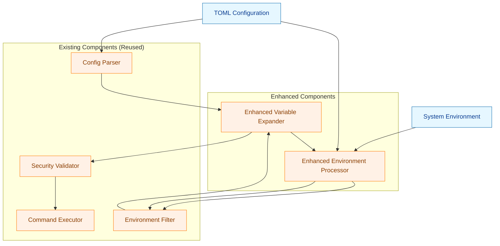
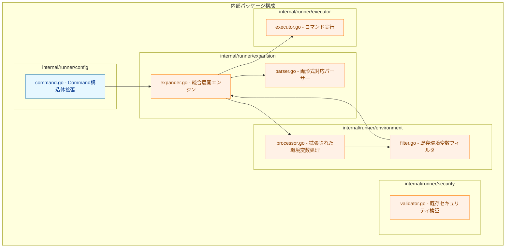
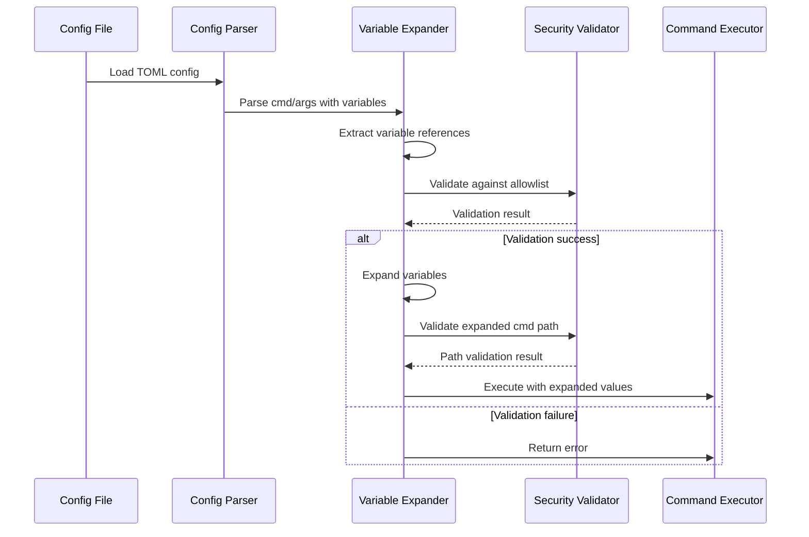
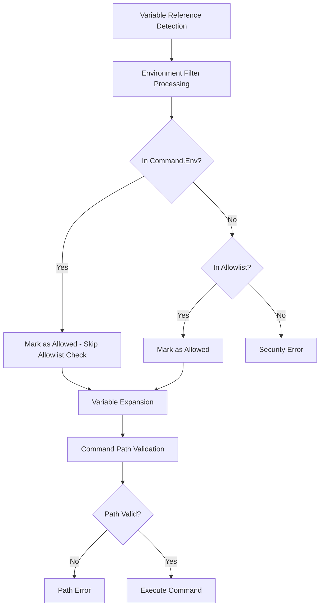
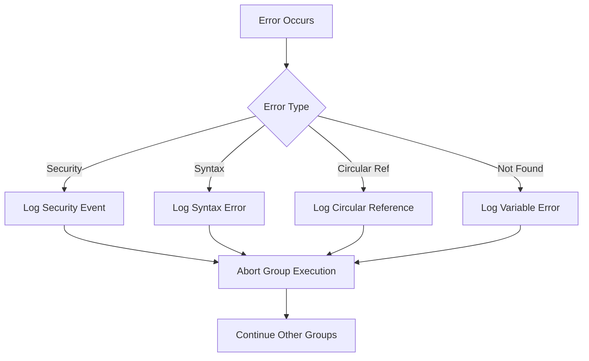
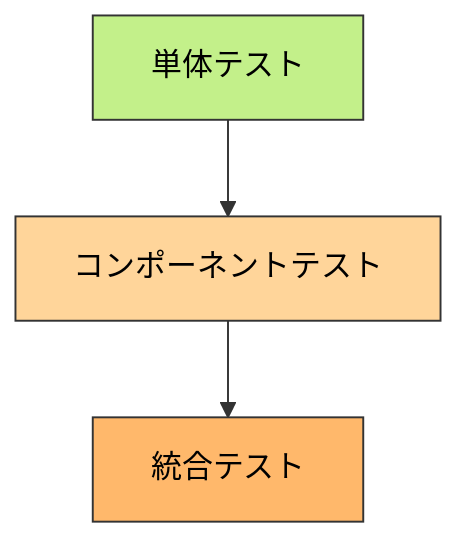

# アーキテクチャ設計書: コマンド・引数内環境変数展開機能

## 1. システム概要

### 1.1 アーキテクチャ目標
- 既存システムへの影響最小化
- セキュリティの堅牢性確保
- 実績のある反復制限方式を活用したシンプルな実装
- 直感的な設計による保守性向上

### 1.2 設計原則
- **セキュリティファースト**: allowlist検証を展開前に実施
- **既存活用**: 実績のある反復制限方式の循環参照検出を拡張
- **既存互換性**: 既存設定ファイルの無変更動作
- **直感的実装**: 複雑なDFSではなく理解しやすいアルゴリズム

## 2. システム構成

### 2.1 全体アーキテクチャ



<!-- Legend for colored nodes -->
**凡例（Legend）**

以下の図は、ダイアグラムで使用している色の意味を示します。青系はデータ（configuration / environment）、オレンジ系は処理（プロセス）を表します。


### 2.2 コンポーネント配置



### 2.3 データフロー



## 3. 詳細設計

### 3.1 コンポーネント設計方針

#### 3.1.1 既存実装を活用したシンプルなアプローチ
**既存の反復制限方式を基盤として使用**:
- `internal/runner/environment/processor.go` の `resolveVariableReferencesForCommandEnv`
- 最大15回の反復制限で循環参照を検出
- 実績のあるアルゴリズムを両変数形式に拡張

#### 3.1.2 Variable Expander (internal/runner/expansion/expander.go)
**責務**: cmd/args 展開の統合制御

**主要インターフェース**:
```go
type VariableExpander interface {
    // 既存の反復制限方式を使用したシンプルな展開
    Expand(text string, env map[string]string, allowlist []string) (string, error)
    ExpandAll(texts []string, env map[string]string, allowlist []string) ([]string, error)
}
```

**主要機能**:
- 既存の理解しやすいアルゴリズムを活用
- セキュリティ検証とのシンプルな連携
- 最小限のエラーハンドリング

#### 3.1.3 Variable Parser (internal/runner/expansion/parser.go)
**責務**: `${VAR}`形式の解析と抽出

**主要インターフェース**:
```go
type VariableParser interface {
    // ${VAR}形式のみをサポート
    ReplaceVariables(text string, resolver VariableResolver) (string, error)
}
```

**主要機能**:
- `${VAR}` 形式の明示的な処理
- 既存の `variableReferenceRegex` との一貫性
- 曖昧さのない明確な変数境界

### 3.2 既存コンポーネントとの統合

#### 3.2.1 Environment Processor 拡張 (internal/runner/environment/processor.go)
**既存機能の統合拡張**:
- 既存の `resolveVariableReferencesForCommandEnv` を拡張
- `${VAR}` 形式の一貫したサポート
- 反復上限を 10 → 15 に拡張

**拡張点**:
- Command.Env での一貫した `${VAR}` 形式
- cmd/args での `${VAR}` 形式サポート
- 統一されたエラーハンドリング

#### 3.2.2 Security Validator 連携
**既存機能をそのまま活用**:
- `ValidateAllEnvironmentVars` - allowlist 検証
- Command.Env 優先ポリシーの継続
- 既存のセキュリティポリシーを保持

#### 3.2.3 Config Parser 統合
**シンプルな統合方式**:
- Command 構造体処理時に展開処理を挿入
- 既存の処理フローへの影響を最小限に抑制
- エラーハンドリングの一貫性を維持

## 4. セキュリティアーキテクチャ

### 4.1 セキュリティ処理フロー



### 4.2 セキュリティレイヤー

1. **入力検証レイヤー**: 変数参照の形式チェック
2. **認可レイヤー**: allowlist / Command.Env検証
3. **展開レイヤー**: 安全な変数展開処理
4. **実行前検証レイヤー**: 展開後の最終検証

### 4.3 攻撃ベクター対策

| 攻撃タイプ | 対策 |
|-----------|------|
| 権限昇格 | allowlist強制、Command.Env優先 |
| 情報漏洩 | 変数アクセス監査、ログマスキング |
| インジェクション | シェル実行禁止、特殊文字エスケープなし |
| 循環参照DoS | 循環参照検出、最大深度制限 |
| パス展開攻撃 | グロブパターンをリテラル扱い、エスケープ機能でリテラル文字列制御 |

## 5. パフォーマンス設計

### 5.1 性能最適化戦略

- **既存アルゴリズムの活用**: 実績のある高速な反復制限方式
- **シンプルな実装**: 複雑なDFSアルゴリズムを回避
- **最小限のメモリ使用**: 既存コードの効率的な文字列操作を活用
- **予測可能な性能**: 反復上限による明確な処理時間の上限

### 5.2 パフォーマンス監視ポイント

```go
type ExpansionMetrics struct {
    TotalExpansions   int64
    ExpansionDuration time.Duration
    VariableCount     int
    CacheHitRatio     float64
    ErrorCount        int64
}
```

### 5.3 スケーラビリティ考慮

- **引数数制限**: 最大1000個の引数
- **変数数制限**: 要素あたり最大50個の変数
- **反復深度**: 最大15回の反復制限（実用ネスト深度5段階+安全マージン）
- **メモリ使用量**: 既存アルゴリズムの効率的なメモリ使用を維持

## 6. エラーハンドリング設計

### 6.1 エラー階層

```go
type ExpansionError struct {
    Type    ErrorType
    Message string
    Context ErrorContext
}

type ErrorType int
const (
    VariableNotFound ErrorType = iota
    CircularReference
    SecurityViolation
    SyntaxError
    PathValidationError
)
```

### 6.2 エラー処理フロー



## 7. 監視・運用設計

### 7.1 ログ出力設計

**デバッグレベル**:
- 変数参照の検出結果
- allowlist検証の詳細
- 展開前後の値比較

**エラーレベル**:
- セキュリティ違反
- 循環参照検出
- パス検証失敗

**統計レベル**:
- 処理時間統計
- 変数展開回数
- エラー発生率

### 7.2 運用監視項目

| メトリクス | 説明 | 閾値例 |
|----------|------|-------|
| 展開処理時間 | 1要素あたりの処理時間 | >1ms |
| エラー率 | 展開失敗の割合 | >5% |
| メモリ使用量 | 展開処理時のメモリ | >2倍 |
| セキュリティ違反 | allowlist違反回数 | >0 |

## 8. テスト戦略

### 8.1 テスト階層



### 8.2 テストカテゴリ

**単体テスト**:
- Variable Parser: 全パターンの変数形式
- Security Validator: allowlist検証ロジック
- Circular Reference Detector: 循環参照パターン

**コンポーネントテスト**:
- Variable Expander: 統合展開処理
- エラーハンドリング: 異常系パターン

**統合テスト**:
- 実際のコマンド実行
- 既存機能との互換性
- パフォーマンステスト

### 8.3 テストデータ設計

**正常系**:
- 基本的な変数展開
- 複数変数展開
- ネスト変数展開

**異常系**:
- 存在しない変数参照
- 循環参照
- allowlist違反
- 不正な変数形式

## 9. 段階的実装計画

### 9.1 Phase 1: 既存コードの拡張
- [ ] Environment Processor での `${VAR}` 形式一貫性確保
- [ ] 反復上限を 10 → 15 に拡張
- [ ] 既存テストケースの拡張
- [ ] 基本的な単体テスト

### 9.2 Phase 2: cmd/args 統合
- [ ] 拡張された Variable Expander の実装
- [ ] Config Parser での cmd/args 展開統合
- [ ] セキュリティ検証の統合
- [ ] 統合テストの実装

### 9.3 Phase 3: 最終化
- [ ] パフォーマンス検証と最適化
- [ ] 包括的テストケース
- [ ] ドキュメント更新
- [ ] パフォーマンスベンチマーク

## 10. 依存関係とリスク

### 10.1 外部依存関係
- **Go標準ライブラリ**: `os`, `strings`, `regexp`
- **既存内部パッケージ**: `internal/runner/environment`, `internal/runner/config`
- **新規依存関係**: なし（要件に従い最小限）

### 10.2 アーキテクチャリスク

| リスク | 影響度 | 対策 |
|-------|-------|-----|
| 既存コード影響 | 高 | インターフェース設計、段階的統合 |
| 性能劣化 | 中 | ベンチマーク測定、最適化実装 |
| セキュリティホール | 高 | 多層防御、包括的テスト |
| 複雑性増大 | 中 | 関心の分離、明確な責務分担 |

### 10.3 技術的課題

**変数展開の複雑性**:
- ネスト展開の処理順序
- 循環参照検出のアルゴリズム効率性
- `${VAR}` 形式のみによる明確な変数境界の確保

**セキュリティとパフォーマンスの両立**:
- 検証処理のオーバーヘッド
- メモリ使用量の制御

**既存システムとの統合**:
- 設定ファイル処理フローの変更点
- エラー処理の一貫性確保
