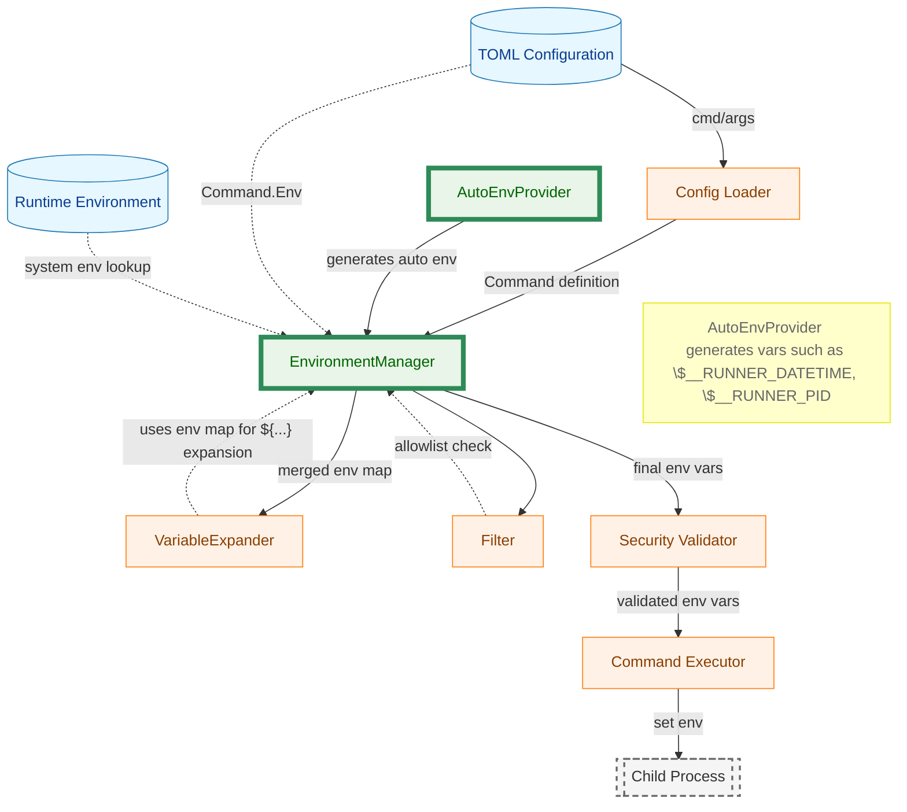
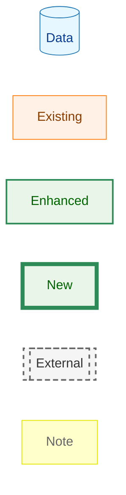
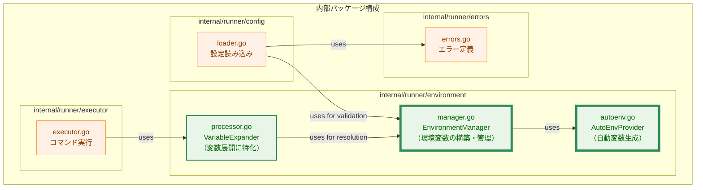
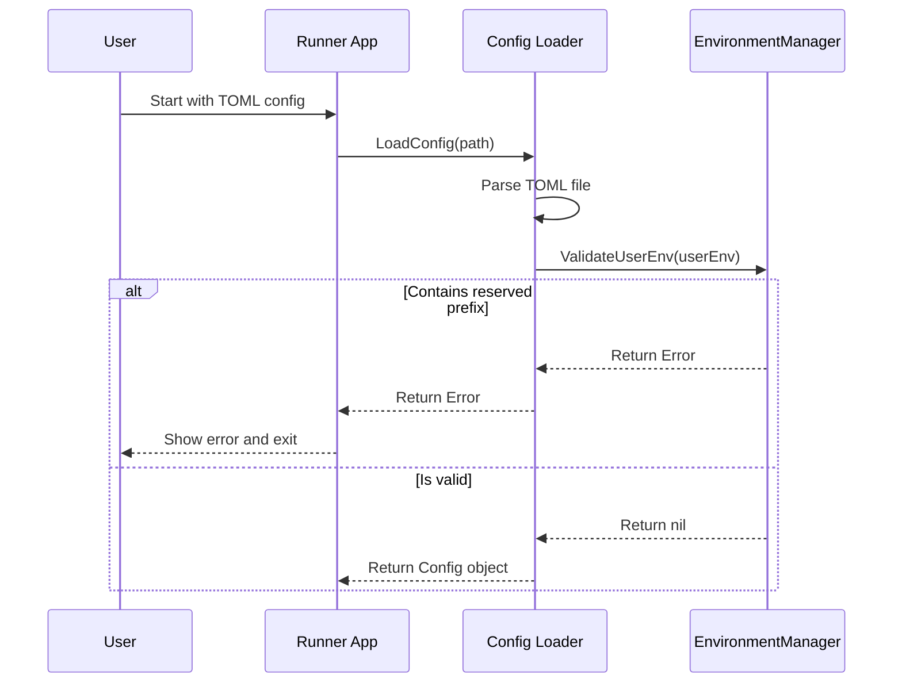
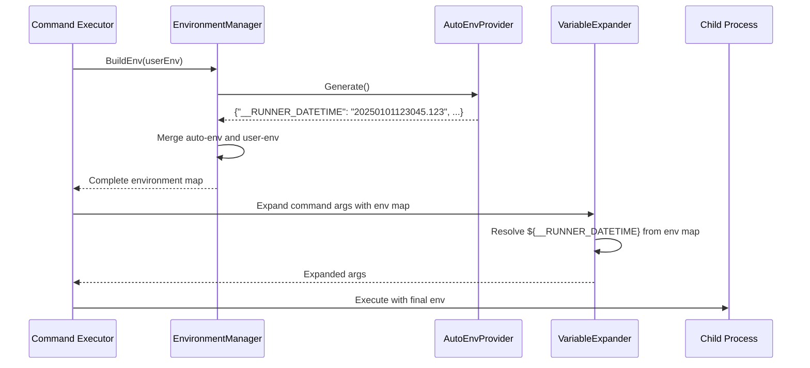
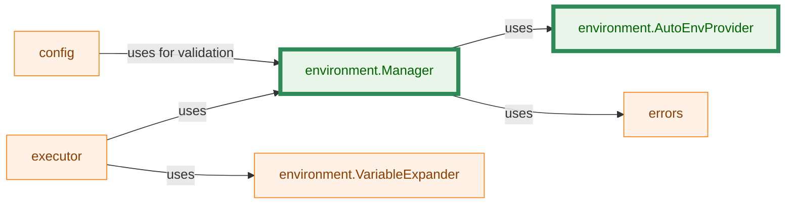
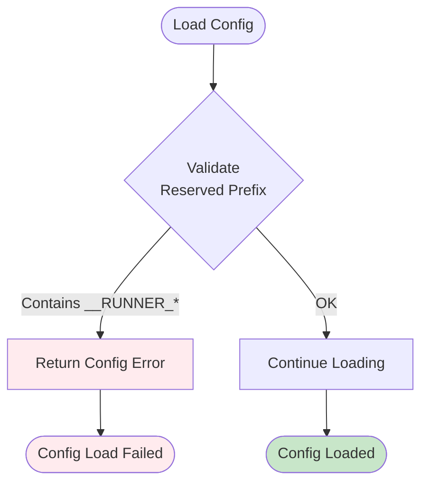

# アーキテクチャ設計書: 自動環境変数設定機能

## 1. 概要

本ドキュメントは、runnerが子プロセスに自動的に環境変数を設定する機能のアーキテクチャ設計を定義する。

## 2. アーキテクチャ原則

- **単一責任**: 各コンポーネントは明確な責任を持つ
- **疎結合**: 既存コンポーネントへの影響を最小化
- **拡張性**: 将来的な環境変数追加を容易にする
- **セキュリティ**: 予約プレフィックスの保護を確実にする

## 3. 定数定義

### 3.1 予約プレフィックス

自動環境変数の予約プレフィックスは以下の通り定義する：

```go
const AutoEnvPrefix = "__RUNNER_"
```

このプレフィックスは以下の用途で使用される：
- AutoEnvProviderでの自動環境変数の識別
- Config Loaderでのユーザー定義環境変数の検証（このプレフィックスの使用を禁止）

## 4. コンポーネント設計

### 4.1 全体アーキテクチャ



<!-- Legend for colored nodes -->
**凡例（Legend）**



**説明:**
- **円柱形（青）**: データソース（TOML設定、システム環境変数）
- **長方形（オレンジ）**: 既存のコンポーネント
- **長方形（緑、細枠 2px）**: 拡張されたコンポーネント
- **長方形（緑、太枠 5px）**: 新規追加のコンポーネント
- **六角形（グレー、点線）**: 外部プロセス（runnerの外部で実行）
- **長方形（黄色）**: 注釈・説明

### 4.2 コンポーネント配置



### 4.3 主要コンポーネント

#### 4.3.1 EnvironmentManager（新規コンポーネント）

**責務**: 環境変数の構築、管理、検証

**機能**:
- `AutoEnvProvider` を利用して自動環境変数を事前生成
- ユーザー定義の環境変数と自動環境変数をマージして完全な環境変数マップを構築
- ユーザー定義の環境変数が予約プレフィックス（`AutoEnvPrefix`）を使用していないか検証（`ValidateUserEnv` メソッド内で実装）
- 構築した環境変数マップを `VariableExpander` に提供（Expander は通常の変数として展開）

**配置**:
- パッケージ: `internal/runner/environment`
- ファイル: `manager.go`

**インターフェース設計**:
```go
// EnvironmentManager manages the lifecycle of environment variables
type EnvironmentManager interface {
    // ValidateUserEnv validates that user-defined env vars do not use reserved prefixes.
    // The validation logic is implemented within this method.
    ValidateUserEnv(userEnv map[string]string) error

    // BuildEnv builds the final environment for a command, merging auto-generated
    // and user-defined variables. The returned map includes all auto env variables
    // and can be used directly by VariableExpander.
    BuildEnv(userEnv map[string]string) (map[string]string, error)
}
```

#### 4.3.2 AutoEnvProvider（新規コンポーネント）

**責務**: 自動環境変数の生成

**機能**:
- サポートされるすべての自動環境変数を一括生成
- 各自動環境変数のロジックを集約
- プレフィックスの一貫性を保証

**配置**:
- パッケージ: `internal/runner/environment`
- ファイル: `autoenv.go`

**インターフェース設計**:
```go
// AutoEnvProvider provides automatic environment variables
type AutoEnvProvider interface {
    // Generate returns all auto environment variables as a map.
    // All keys have the AutoEnvPrefix (__RUNNER_).
    Generate() map[string]string
}

// Clock defines a function that returns the current time.
type Clock func() time.Time

// Implementation
type autoEnvProvider struct {
    logger *slog.Logger
    clock  Clock
}

// NewAutoEnvProvider creates a new AutoEnvProvider.
// If clock is nil, it defaults to time.Now.
func NewAutoEnvProvider(clock Clock) AutoEnvProvider {
    if clock == nil {
        clock = time.Now
    }
    return &autoEnvProvider{
        logger: slog.Default().With("component", "AutoEnvProvider"),
        clock:  clock,
    }
}
```

**実装例**:
```go
// AutoEnvPrefixはセクション3.1で定義された定数を使用

func (p *autoEnvProvider) Generate() map[string]string {
    return map[string]string{
        AutoEnvPrefix + "DATETIME": p.generateDateTime(),
        AutoEnvPrefix + "PID":      p.generatePID(),
    }
}
```

#### 4.3.3 VariableExpander（変更なし）

**責務**: 文字列内の変数（`${...}`）を展開することに特化

**変更内容**:
- **変更不要**: `EnvironmentManager` が事前に自動環境変数を含む完全な環境変数マップを構築するため、`VariableExpander` は既存のロジックをそのまま使用できる
- `VariableExpander` は通常の環境変数として `__RUNNER_*` 変数を展開する

**変更ファイル**:
- なし（既存の `internal/runner/environment/processor.go` をそのまま使用）

#### 4.3.4 Config Loader での予約プレフィックス検証

**責務**: TOML読み込み時に予約プレフィックスの使用を検出

**検証内容**:
- `EnvironmentManager.ValidateUserEnv()` を呼び出して、Command.Env の各環境変数名をチェックする
- 検証ロジックは `EnvironmentManager` の `ValidateUserEnv` メソッド内で実装される

**変更ファイル**:
- `internal/runner/config/loader.go`

#### 4.3.5 エラー定義の追加

**責務**: 予約プレフィックス使用エラーの定義

**追加内容**:
- `ErrReservedEnvPrefix` エラー定義を追加
- エラーメッセージに違反した変数名を含める

**変更ファイル**:
- `internal/runner/errors/errors.go`

### 4.4 データフロー

`EnvironmentManager`の導入により、データフローは「設定ロード時」と「コマンド実行時」の2つのフェーズで明確に分離されます。

#### 4.4.1 設定ロード時の検証フロー



#### 4.4.2 コマンド実行時の環境変数構築フロー



## 5. 詳細設計

### 5.1 AutoEnvProvider の実装

#### 5.1.1 時刻フォーマット生成

**要件**: `YYYYMMDDHHmmSS.msec` 形式（UTC、ミリ秒3桁）

**実装例**:
```go
func (p *autoEnvProvider) generateDateTime() string {
    now := p.clock().UTC()

    // YYYYMMDDHHmmSS部分
    dateTimePart := now.Format("20060102150405")

    // ミリ秒部分（3桁ゼロパディング）
    msec := now.Nanosecond() / 1_000_000
    msecPart := fmt.Sprintf("%03d", msec)

    return fmt.Sprintf("%s.%s", dateTimePart, msecPart)
}
```

#### 5.1.2 PID値生成

**実装例**:
```go
func (p *autoEnvProvider) generatePID() string {
    return strconv.Itoa(os.Getpid())
}
```

### 5.2 EnvironmentManager の実装

#### 5.2.1 BuildEnv() の実装ロジック

**処理フロー**:
```go
func (m *environmentManager) BuildEnv(userEnv map[string]string) (map[string]string, error) {
    // 1. 自動環境変数を生成
    autoEnv := m.autoProvider.Generate()

    // 2. 結果用のマップを作成
    result := make(map[string]string, len(autoEnv)+len(userEnv))

    // 3. 自動環境変数を追加（優先度：高）
    for k, v := range autoEnv {
        result[k] = v
    }

    // 4. ユーザー定義環境変数を追加（自動環境変数は上書きしない）
    for k, v := range userEnv {
        if _, isAuto := autoEnv[k]; !isAuto {
            result[k] = v
        }
    }

    return result, nil
}
```

#### 5.2.2 ValidateUserEnv() の実装ロジック

**処理フロー**:
```go
func (m *environmentManager) ValidateUserEnv(userEnv map[string]string) error {
    // Validate that user env vars do not use the reserved prefix
    for key := range userEnv {
        if strings.HasPrefix(key, AutoEnvPrefix) {
            return errors.NewReservedEnvPrefixError(key, AutoEnvPrefix)
        }
    }
    return nil
}
```

### 5.3 モジュール間の依存関係




## 6. エラーハンドリング戦略

### 6.1 設定ロード時のエラー



### 6.2 エラータイプ

- `ErrReservedEnvPrefix`: 予約プレフィックスの使用エラー
  - パッケージ: `internal/runner/errors`
  - 設定ファイルパスと違反した環境変数名を含む

## 7. セキュリティ考慮事項

### 7.1 環境変数の保護

- 自動環境変数は上書き不可
- 予約プレフィックスの使用を設定ロード時に検証
- 検証失敗時は実行前にエラー終了

### 7.2 監査とロギング

- 自動環境変数は監査ログに記録
- redaction対象外（機密情報を含まない）
- 設定ロード時の検証結果をログに記録

## 8. テスト戦略

### 8.1 ユニットテスト

- **予約プレフィックス検証 (`EnvironmentManager.ValidateUserEnv` メソッドで実施)**
  - 正常系: 予約プレフィックスなし
  - 異常系: 予約プレフィックスあり
  - 境界値: 大文字小文字の違い

- **自動環境変数生成 (`AutoEnvProvider`で実施)**
  - 日時フォーマットの検証（時刻を固定してテスト）
  - PID値の取得
  - タイムゾーン（UTC）の検証
  - ミリ秒のフォーマット（3桁ゼロパディング）

- **環境変数マージ (`EnvironmentManager`で実施)**
  - ユーザー定義と自動変数の統合
  - 優先順位の検証

### 8.2 統合テスト

- 実際の子プロセスでの環境変数確認
- dry-runモードでの動作確認
- グループ実行時の各コマンドでの設定確認

### 8.3 テスト戦略

**時刻とPIDのテスト**:
- 時刻: `AutoEnvProvider`に`Clock`関数を注入することで、テスト時に時刻を固定し、決定的なテストを実施する。
- PID: テストでは実際の `os.Getpid()` を使用し、数値文字列として返されることを検証。
- 決定性が不要な場合は、生成された値のパターン検証で対応。
  - DATETIME: 正規表現 `^\d{12}\.\d{3}$` でフォーマット検証
  - PID: 正規表現 `^\d+$` で数値文字列を検証

## 9. パフォーマンス考慮事項

- 日時取得: 各子プロセス起動時に1回のみ
- PID取得: `os.Getpid()`は高速な操作
- 環境変数マージ: mapのコピーによる軽微なオーバーヘッド
- 予約プレフィックス検証: 設定ロード時の1回のみ

## 10. 実装の優先順位

1. **Phase 1: コア機能**
   - `AutoEnvProvider` の実装
   - `EnvironmentManager` の実装（検証・構築ロジックを含む、`ValidateUserEnv` メソッド内で予約プレフィックス検証を実装）
   - `Config Loader` への検証ロジック組込み

2. **Phase 2: テスト**
   - ユニットテスト（`AutoEnvProvider`, `EnvironmentManager`）
   - 統合テスト

3. **Phase 3: ドキュメント**
   - ユーザードキュメント更新
   - サンプル追加

## 11. 関連ファイル

### 新規作成

- `internal/runner/environment/manager.go` (EnvironmentManager実装、予約プレフィックス検証を含む)
- `internal/runner/environment/manager_test.go` (EnvironmentManagerのテスト)
- `internal/runner/environment/autoenv.go` (AutoEnvProvider実装)
- `internal/runner/environment/autoenv_test.go` (AutoEnvProviderのテスト)

### 変更予定

- `internal/runner/config/loader.go` (検証ロジックの呼び出しを追加)
- `internal/runner/errors/errors.go` (予約プレフィックスエラーを追加)
- `internal/runner/executor/executor.go` (EnvironmentManagerの利用を追加)
- `cmd/runner/main.go` (依存性注入の変更)
