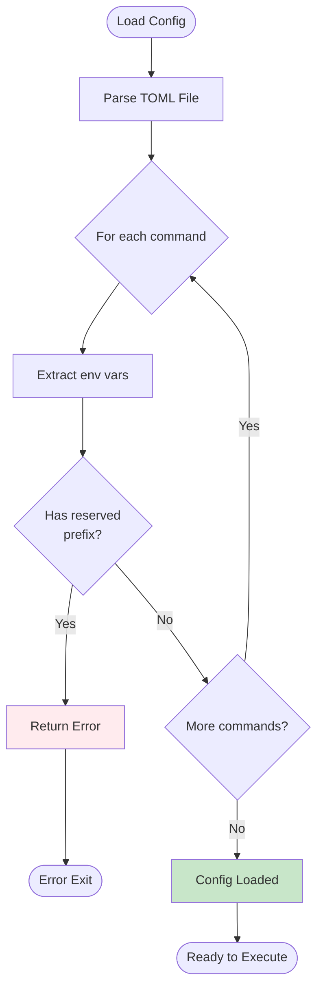
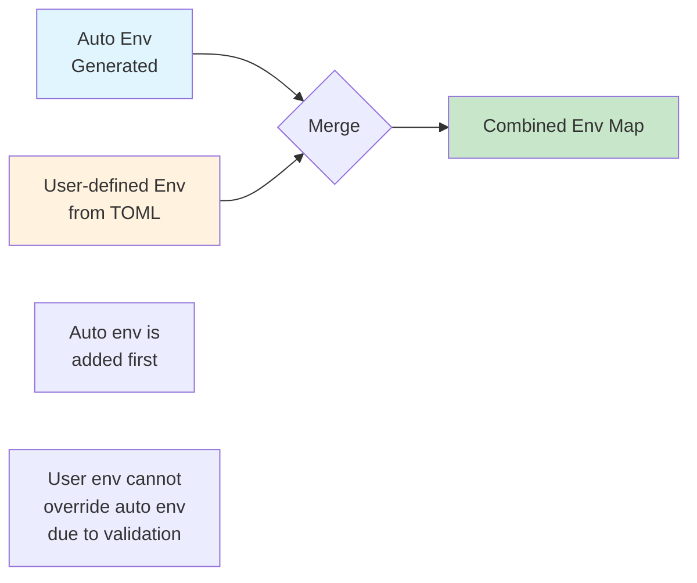
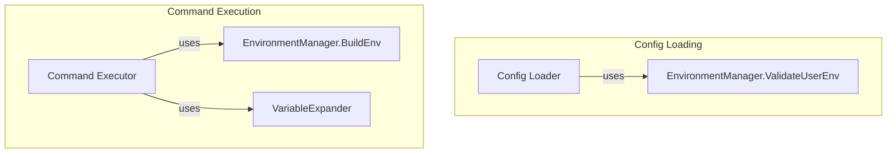
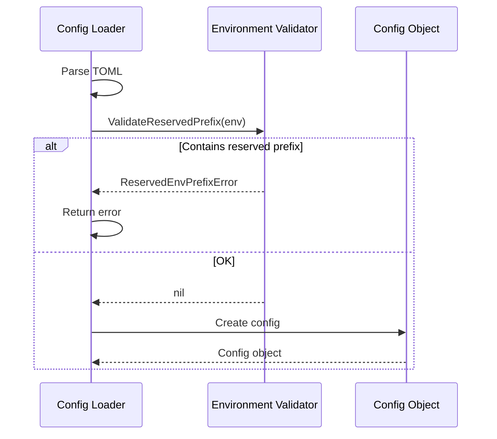
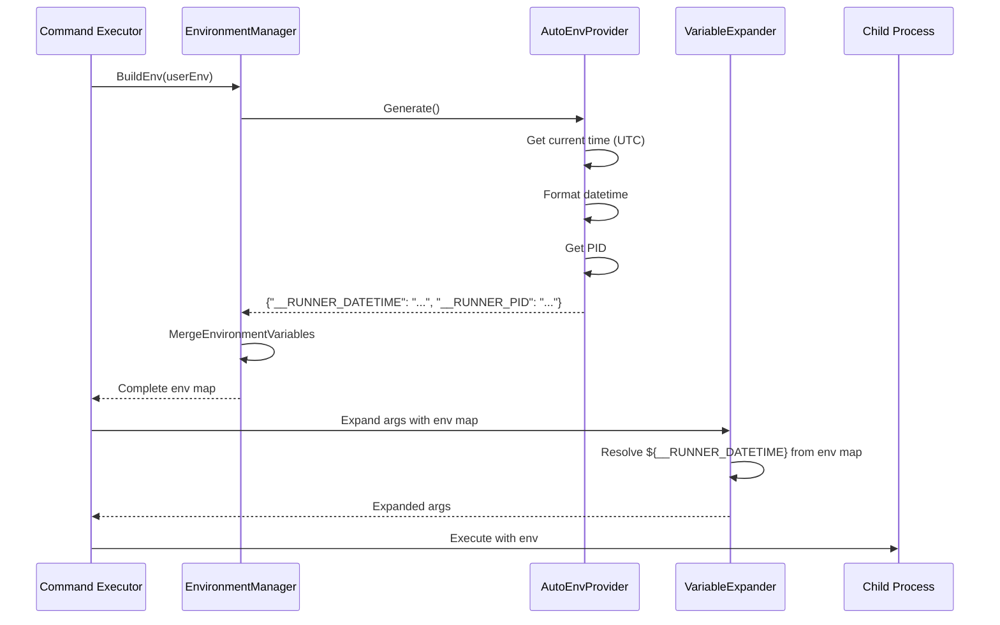

# 詳細仕様書: 自動環境変数設定機能

## 1. 概要

本ドキュメントは、自動環境変数設定機能の詳細な実装仕様を定義する。

## 2. 定数定義

### 2.1 予約プレフィックスとキー

```go
package environment

const (
    // AutoEnvPrefix is the prefix for automatically generated environment variables
    AutoEnvPrefix = "__RUNNER_"

    // Auto environment variable keys (without prefix)
    AutoEnvKeyDatetime = "DATETIME"
    AutoEnvKeyPID      = "PID"
)
```

**使用例**:
```go
// 完全な変数名を構築
datetimeVarName := AutoEnvPrefix + AutoEnvKeyDatetime  // "__RUNNER_DATETIME"
pidVarName := AutoEnvPrefix + AutoEnvKeyPID            // "__RUNNER_PID"
```

### 2.2 日時フォーマット

```go
const (
    // DatetimeLayout is the Go time format for __RUNNER_DATETIME
    // Format: YYYYMMDDHHmmSS.msec (e.g., "20251005143032.123")
    DatetimeLayout = "20060102150405"  // Go time format for YYYYMMDDHHmmSS
)
```

## 3. AutoEnvProvider インターフェース

### 3.1 インターフェース定義

```go
// Clock is a function type that returns the current time
// This allows for dependency injection of time for testing
type Clock func() time.Time

// AutoEnvProvider provides automatic environment variables
type AutoEnvProvider interface {
    // Generate returns all auto environment variables as a map.
    // All keys have the AutoEnvPrefix (__RUNNER_).
    Generate() map[string]string
}
```

### 3.2 実装

```go
type autoEnvProvider struct {
    logger *slog.Logger
    clock  Clock
}

func NewAutoEnvProvider(clock Clock) AutoEnvProvider {
    if clock == nil {
        clock = time.Now
    }
    return &autoEnvProvider{
        logger: slog.Default().With("component", "AutoEnvProvider"),
        clock:  clock,
    }
}

func (p *autoEnvProvider) Generate() map[string]string {
    return map[string]string{
        AutoEnvPrefix + "DATETIME": p.generateDateTime(),
        AutoEnvPrefix + "PID":      p.generatePID(),
    }
}

func (p *autoEnvProvider) generateDateTime() string {
    now := p.clock().UTC()
    dateTimePart := now.Format(DatetimeLayout)
    msec := now.Nanosecond() / 1_000_000
    return fmt.Sprintf("%s.%03d", dateTimePart, msec)
}

func (p *autoEnvProvider) generatePID() string {
    return strconv.Itoa(os.Getpid())
}
```

## 4. 日時フォーマット仕様

### 4.1 フォーマット関数

```go
// formatDatetime formats time.Time to YYYYMMDDHHmmSS.msec format
// Example: 2025-10-05 14:30:22.123456789 UTC -> "202510051430.123"
func formatDatetime(t time.Time) string {
    // Extract milliseconds (0-999)
    ms := t.Nanosecond() / 1000000

    // Format: YYYYMMDDHHmmSS
    dateTimePart := t.Format(DatetimeLayout)

    // Format: YYYYMMDDHHmmSS.msec (msec is 3 digits with zero padding)
    return fmt.Sprintf("%s.%03d", dateTimePart, ms)
}
```

### 4.2 フォーマット例

| 入力時刻 (UTC) | 出力文字列 |
|---------------|-----------|
| 2025-10-05 14:30:22.000000000 | `202510051430.000` |
| 2025-10-05 14:30:22.123000000 | `202510051430.123` |
| 2025-10-05 14:30:22.999000000 | `202510051430.999` |
| 2025-10-05 14:30:22.001234567 | `202510051430.001` |
| 2025-12-31 23:59:59.999999999 | `202512312359.999` |

### 4.3 ミリ秒の精度

- ナノ秒を1,000,000で除算してミリ秒を取得
- 小数点以下は切り捨て
- 3桁フォーマット（`%03d`）でゼロパディング

## 5. 予約プレフィックス検証

### 5.1 検証ロジック

予約プレフィックス検証は `EnvironmentManager` の `ValidateUserEnv` メソッド内で実装される。

```go
// ValidateUserEnv validates that user-defined environment variables
// do not use the reserved prefix
func (m *environmentManager) ValidateUserEnv(userEnv map[string]string) error {
    for key := range userEnv {
        if strings.HasPrefix(key, AutoEnvPrefix) {
            return errors.NewReservedEnvPrefixError(key, AutoEnvPrefix)
        }
    }
    return nil
}
```

### 5.2 検証タイミング



### 5.3 検証対象

以下の設定項目で定義された環境変数を検証：

1. **コマンドレベルの環境変数**
   ```toml
   [[commands]]
   name = "test"
   command = "/bin/echo"
   env = { KEY = "value" }
   ```

2. **グループレベルの環境変数**
   ```toml
   [[groups]]
   name = "group1"
   env = { KEY = "value" }
   ```

3. **グローバル環境変数（存在する場合）**
   ```toml
   [env]
   KEY = "value"
   ```

## 6. エラー定義

### 6.1 ReservedEnvPrefixError

```go
// ReservedEnvPrefixError represents an error when user tries to use reserved env prefix
type ReservedEnvPrefixError struct {
    VarName string
    Prefix  string
}

func NewReservedEnvPrefixError(varName, prefix string) *ReservedEnvPrefixError {
    return &ReservedEnvPrefixError{
        VarName: varName,
        Prefix:  prefix,
    }
}

func (e *ReservedEnvPrefixError) Error() string {
    return fmt.Sprintf(
        "environment variable %q uses reserved prefix %q; "+
            "this prefix is reserved for automatically generated variables",
        e.VarName,
        e.Prefix,
    )
}
```

### 6.2 エラーメッセージ例

```
environment variable "__RUNNER_CUSTOM" uses reserved prefix "__RUNNER_"; this prefix is reserved for automatically generated variables
```

## 7. 環境変数マージ仕様

### 7.1 マージ順序



### 7.2 マージロジック

```go
// MergeEnvironmentVariables merges auto-generated and user-defined environment variables
// Auto-generated variables are added first, and user-defined cannot override them
// (validation ensures no conflicts)
func MergeEnvironmentVariables(autoEnv, userEnv map[string]string) map[string]string {
    result := make(map[string]string, len(autoEnv)+len(userEnv))

    // Add auto-generated variables first
    for k, v := range autoEnv {
        result[k] = v
    }

    // Add user-defined variables
    // Note: No conflicts possible due to ValidateReservedPrefix
    for k, v := range userEnv {
        result[k] = v
    }

    return result
}
```

### 7.3 優先順位

1. **最優先**: 自動生成環境変数（`__RUNNER_*`）
2. **次点**: ユーザー定義環境変数
3. **注**: 予約プレフィックス検証により衝突は発生しない

## 8. EnvironmentManager への統合

`AutoEnvProvider`とプレフィックス検証ロジックを既存コンポーネントに統合するため、`EnvironmentManager`を導入する。これは、環境変数に関する責務を集約する役割を担う。

- **`Config Loader`**: 設定読み込み時、`EnvironmentManager`の`ValidateUserEnv`メソッドを呼び出して予約プレフィックスを検証する。
- **`Command Executor`**: コマンド実行時、`EnvironmentManager`の`BuildEnv`メソッドで自動環境変数とユーザー環境変数をマージした完全な環境変数マップを取得する。
- **`VariableExpander`**: `EnvironmentManager`が構築した環境変数マップを使用して、`${__RUNNER_*}` を通常の変数として展開する（変更不要）。



### 8.1 インターフェース定義

```go
// EnvironmentManager manages environment variables for command execution
type EnvironmentManager interface {
    // ValidateUserEnv validates that user-defined env vars do not use reserved prefixes.
    ValidateUserEnv(userEnv map[string]string) error

    // BuildEnv builds the final environment for a command, merging auto-generated
    // and user-defined variables. The returned map includes all auto env variables
    // and can be used directly by VariableExpander.
    BuildEnv(userEnv map[string]string) (map[string]string, error)
}
```

### 8.2 実装

```go
type environmentManager struct {
    autoProvider AutoEnvProvider
}

func NewEnvironmentManager(clock Clock) EnvironmentManager {
    if clock == nil {
        clock = time.Now
    }
    return &environmentManager{
        autoProvider: NewAutoEnvProvider(clock),
    }
}

func (m *environmentManager) ValidateUserEnv(userEnv map[string]string) error {
    // Validate reserved prefix within this method
    for key := range userEnv {
        if strings.HasPrefix(key, AutoEnvPrefix) {
            return errors.NewReservedEnvPrefixError(key, AutoEnvPrefix)
        }
    }
    return nil
}

func (m *environmentManager) BuildEnv(userEnv map[string]string) (map[string]string, error) {
    // Generate auto env variables
    autoEnv := m.autoProvider.Generate()

    return MergeEnvironmentVariables(autoEnv, userEnv), nil
}
```

## 9. 実行フロー

### 9.1 設定ロード時



### 9.2 コマンド実行時



## 10. テストケース仕様

### 10.1 単体テストケース

#### 10.1.1 日時フォーマットテスト

| テストケース | 入力時刻 (UTC) | 期待出力 |
|------------|---------------|---------|
| 正常系: ミリ秒0 | 2025-10-05 14:30:22.000000000 | `202510051430.000` |
| 正常系: ミリ秒あり | 2025-10-05 14:30:22.123000000 | `202510051430.123` |
| 境界値: 年末 | 2025-12-31 23:59:59.999000000 | `202512312359.999` |
| 境界値: 年始 | 2025-01-01 00:00:00.001000000 | `202501010000.001` |
| エッジケース: ナノ秒精度 | 2025-10-05 14:30:22.123456789 | `202510051430.123` |

#### 10.1.2 予約プレフィックス検証テスト

| テストケース | 入力環境変数 | 期待結果 |
|------------|------------|---------|
| 正常系: 通常の環境変数 | `{"PATH": "/bin"}` | nil |
| 正常系: プレフィックス類似 | `{"GO_SAFE_CMD": "value"}` | nil |
| 異常系: 完全一致 | `{"__RUNNER_CUSTOM": "v"}` | ReservedEnvPrefixError |
| 異常系: DATETIME | `{"__RUNNER_DATETIME": "v"}` | ReservedEnvPrefixError |
| 異常系: PID | `{"__RUNNER_PID": "123"}` | ReservedEnvPrefixError |

#### 10.1.3 環境変数マージテスト

| テストケース | Auto Env | User Env | 期待結果 |
|------------|----------|----------|---------|
| 正常系: 衝突なし | `{DATETIME: "...", PID: "123"}` | `{PATH: "/bin"}` | 両方含む |
| 正常系: 空のユーザーEnv | `{DATETIME: "...", PID: "123"}` | `{}` | Auto Envのみ |

#### 10.1.4 Clock関数によるテスト

Clock関数を使用して、時刻を固定した状態でのテストを実施する。

```go
// Test with fixed time
func TestAutoEnvProviderWithFixedTime(t *testing.T) {
    // Fixed time: 2025-10-05 14:30:22.123456789 UTC
    fixedTime := time.Date(2025, 10, 5, 14, 30, 22, 123456789, time.UTC)
    clock := func() time.Time { return fixedTime }

    provider := NewAutoEnvProvider(clock)

    result := provider.Generate()
    assert.Equal(t, "202510051430.123", result["__RUNNER_DATETIME"])
    assert.NotEmpty(t, result["__RUNNER_PID"])
}
```

**テスト利点**:
- 時刻を固定することで、テストが再現可能になる
- タイムゾーンの影響を受けない
- ミリ秒の丸め処理を正確にテストできる

### 10.2 統合テストケース

#### 10.2.1 シナリオ1: 正常実行

```toml
[[commands]]
name = "test"
command = "/bin/sh"
args = ["-c", "echo $__RUNNER_DATETIME $__RUNNER_PID"]
```

期待動作:
- 子プロセスで環境変数が設定される
- 出力に日時とPIDが含まれる

#### 10.2.2 シナリオ2: 予約プレフィックスエラー

```toml
[[commands]]
name = "invalid"
command = "/bin/echo"
env = { __RUNNER_CUSTOM = "value" }
```

期待動作:
- 設定ロード時にエラー
- `ReservedEnvPrefixError` が返される

#### 10.2.3 シナリオ3: dry-runモード

```toml
[[commands]]
name = "test"
command = "/bin/echo"
```

期待動作:
- dry-runモードでも環境変数が生成される
- 実行時点の日時が使用される

#### 10.2.4 シナリオ4: グループ実行

```toml
[[groups]]
name = "group1"
commands = ["cmd1", "cmd2"]

[[commands]]
name = "cmd1"
command = "/bin/sh"
args = ["-c", "echo $__RUNNER_DATETIME"]

[[commands]]
name = "cmd2"
command = "/bin/sh"
args = ["-c", "echo $__RUNNER_DATETIME"]
```

期待動作:
- 各コマンドが個別に環境変数を取得
- 実行タイミングが異なる場合、DATETIMEが異なる可能性がある

## 11. パフォーマンス仕様

### 11.1 実行時間目標

- 環境変数生成: < 1μs
- 予約プレフィックス検証: O(n) where n = 環境変数数
- 環境変数マージ: O(n + m) where n = auto env数, m = user env数

### 11.2 メモリ使用量

- 自動環境変数マップ: 約200バイト（2つの文字列ペア）
- 統合後の環境変数マップ: ユーザー定義環境変数数に依存

## 12. 互換性仕様

### 12.1 後方互換性

- 既存のTOMLファイルは変更なく動作
- 予約プレフィックスを使用していないTOMLファイルは影響なし

### 12.2 設定ファイルバージョン

- 設定ファイル形式の変更なし
- 新機能は自動的に有効化（opt-inなし）

## 13. セキュリティ仕様

### 13.1 環境変数の保護

- 自動環境変数は読み取り専用（ユーザーによる上書き不可）
- 予約プレフィックス検証は設定ロード時に強制実行

### 13.2 監査ログ

- 自動環境変数は他の環境変数と同様に監査ログに記録
- redaction対象外（機密情報を含まないため）

### 13.3 情報漏洩リスク

- DATETIME: 実行時刻（機密情報なし）
- PID: プロセスID（低リスク情報）

## 14. ドキュメント要件

### 14.1 ユーザードキュメント

以下のドキュメントを更新：

1. **README.md**: 自動環境変数機能の説明
2. **設定ファイルガイド**: 予約プレフィックスの説明
3. **サンプル**: 自動環境変数を使用した例

### 14.2 サンプルファイル

```toml
# sample/auto_env_example.toml

[[commands]]
name = "timestamp_backup"
command = "/usr/bin/tar"
args = [
    "czf",
    "/backup/data-${__RUNNER_DATETIME}.tar.gz",
    "/data"
]

[[commands]]
name = "show_env"
command = "/bin/sh"
args = [
    "-c",
    "echo 'DateTime: $__RUNNER_DATETIME' && echo 'PID: $__RUNNER_PID'"
]
```

## 15. 実装チェックリスト

実装時に確認すべき項目：

- [ ] 定数定義が正しい（`AutoEnvPrefix`, `AutoEnvKeyDatetime`, `AutoEnvKeyPID`）
- [ ] Clock関数型の定義
- [ ] AutoEnvProviderインターフェースの実装
- [ ] NewAutoEnvProviderでのClock関数のデフォルト処理（nilの場合は `time.Now`）
- [ ] 日時フォーマットが仕様通り（`YYYYMMDDHHmmSS.msec`）
- [ ] ミリ秒が3桁フォーマット（`%03d`）
- [ ] UTCタイムゾーンの使用（`p.clock().UTC()`）
- [ ] 予約プレフィックス検証の実装（`manager.go` の `ValidateUserEnv` メソッド内）
- [ ] エラータイプの定義
- [ ] 環境変数マージロジック
- [ ] `EnvironmentManager` の実装
- [ ] `NewEnvironmentManager` でのClock関数のデフォルト処理（nilの場合は `time.Now`）
- [ ] `Config Loader` への検証ロジック組込み
- [ ] Clock関数を使用したテストケースの実装
- [ ] 全テストケースの実装
- [ ] dry-runモードでの動作確認
- [ ] ドキュメント更新
