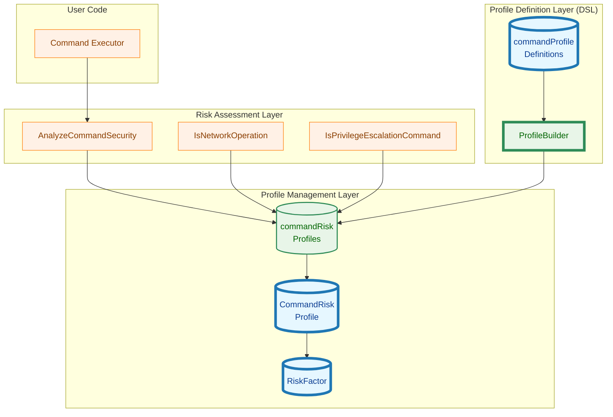
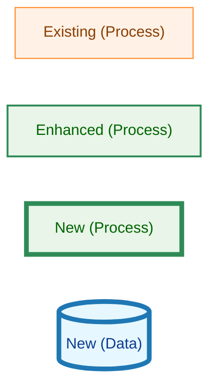
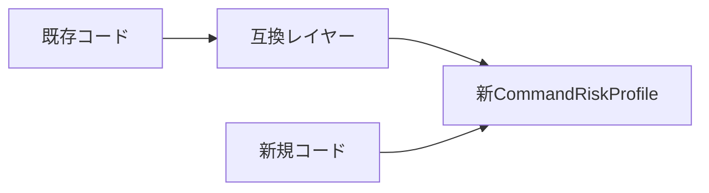

# アーキテクチャ設計: コマンドリスクプロファイルのリファクタリング

## 1. 概要

本設計書は、コマンドリスクプロファイルシステムのリファクタリングにおけるアーキテクチャを定義する。リスク要因を明示的に分離し、ビルダーパターンによるDSLを導入することで、保守性・拡張性・監査可能性を向上させる。

## 2. アーキテクチャ原則

### 2.1 設計原則

1. **明示的な設計 (Explicit is better than implicit)**
   - リスク要因を個別のフィールドとして明示
   - 暗黙的な依存関係を排除

2. **型安全性 (Type safety)**
   - コンパイル時にエラーを検出
   - ビルダーパターンで構築時のバリデーションを強制

3. **不変性 (Immutability)**
   - 一度構築されたプロファイルは変更不可
   - セキュリティ設定の意図しない変更を防止

4. **拡張性 (Extensibility)**
   - 新しいリスク要因の追加が容易
   - 既存コードへの影響を最小化

5. **セキュリティファースト (Security first)**
   - ユーザーによる設定の改変を許可しない
   - バリデーションを複数層で実行

## 3. コンポーネント設計

### 3.1 コンポーネント構成



<!-- Legend for colored nodes -->
**凡例（Legend）**



**説明:**
- **長方形（オレンジ）**: 既存のコンポーネント（処理）
- **長方形（緑、細枠 2px）**: 拡張されたコンポーネント（処理）
- **長方形（緑、太枠 5px）**: 新規追加のコンポーネント（処理）
- **シリンダー（青、太枠 5px）**: 新規追加のコンポーネント（データ）

### 3.2 レイヤー構成

#### Layer 1: Profile Definition Layer (DSL)

プロファイルの定義を行う層。ビルダーパターンによるDSLを提供。

**責務:**
- リスクプロファイルの宣言的な定義
- 定義時のバリデーション
- 構築時のエラー検出（panic）

**コンポーネント:**
- `ProfileBuilder`: ビルダーパターンの実装
- `commandProfileDefinitions`: 全コマンドのプロファイル定義

#### Layer 2: Profile Management Layer

リスクプロファイルの管理と提供を行う層。

**責務:**
- プロファイルの格納と検索
- リスクレベルの計算
- リスク理由の取得

**コンポーネント:**
- `commandRiskProfiles`: コマンド名→プロファイルのマップ
- `CommandRiskProfile`: リスクプロファイル構造体
- `RiskFactor`: 個別リスク要因

#### Layer 3: Risk Assessment Layer

コマンドのリスク評価を行う層。

**責務:**
- コマンドパスと引数からリスク評価
- ネットワーク操作の検出
- 権限昇格コマンドの検出

**コンポーネント:**
- `AnalyzeCommandSecurity`: メインのリスク評価関数
- `IsNetworkOperation`: ネットワーク操作検出
- `IsPrivilegeEscalationCommand`: 権限昇格検出

## 4. データ構造設計

### 4.1 RiskFactor

個別のリスク要因を表す構造体。

```go
// RiskFactor represents an individual risk factor with its level and explanation
type RiskFactor struct {
    Level  runnertypes.RiskLevel // Risk level for this specific factor
    Reason string                // Human-readable explanation of this risk
}
```

**設計の意図:**
- リスクレベルと理由を常にペアで保持
- 監査ログ出力時に理由を提供
- 複数リスク要因の独立した評価を可能に

### 4.2 CommandRiskProfile

コマンドの包括的なリスクプロファイル。

```go
// CommandRiskProfile defines comprehensive risk information for a command
type CommandRiskProfile struct {
    // Individual risk factors (explicit separation)
    PrivilegeRisk   RiskFactor // Risk from privilege escalation (sudo, su, doas)
    NetworkRisk     RiskFactor // Risk from network operations
    DestructionRisk RiskFactor // Risk from destructive operations (rm, dd, format)
    DataExfilRisk   RiskFactor // Risk from data exfiltration to external services
    SystemModRisk   RiskFactor // Risk from system modifications (systemctl, service)

    // Network behavior configuration
    NetworkType        NetworkOperationType // How network operations are determined
    NetworkSubcommands []string              // Subcommands that trigger network operations

    // Derived properties
    IsPrivilege bool // True if PrivilegeRisk.Level >= High
}
```

**フィールド設計の根拠:**

| フィールド | 目的 | 使用例 |
|-----------|------|--------|
| `PrivilegeRisk` | 権限昇格リスク | sudo, su, doas |
| `NetworkRisk` | ネットワーク操作リスク | curl, wget, ssh, git push |
| `DestructionRisk` | 破壊的操作リスク | rm -rf, dd, format |
| `DataExfilRisk` | データ流出リスク | AI CLI、クラウドアップロード |
| `SystemModRisk` | システム変更リスク | systemctl, service, apt install |

**将来の拡張候補:**
- `CryptoRisk`: 暗号化・復号化操作のリスク
- `DatabaseRisk`: データベース操作のリスク
- `CompilationRisk`: コード生成・コンパイルのリスク

### 4.3 ProfileBuilder

ビルダーパターンによるDSL実装。

```go
// ProfileBuilder provides a fluent API for building CommandRiskProfile
type ProfileBuilder struct {
    commands           []string
    privilegeRisk      *RiskFactor
    networkRisk        *RiskFactor
    destructionRisk    *RiskFactor
    dataExfilRisk      *RiskFactor
    systemModRisk      *RiskFactor
    networkType        NetworkOperationType
    networkSubcommands []string
}
```

**設計の特徴:**
- ポインタフィールド：未設定（nil）と明示的なUnknown（&RiskFactor{Level: Unknown}）を区別
- Fluent API：メソッドチェーンによる簡潔な記述
- Build時バリデーション：不整合な設定をpanicで即座に検出

### 4.4 CommandProfileDef

コマンドリストとプロファイルの組。

```go
// CommandProfileDef associates a list of commands with their risk profile
type CommandProfileDef struct {
    commands []string
    profile  CommandRiskProfile
}
```

## 5. 主要なメソッド設計

### 5.1 BaseRiskLevel()

全リスク要因の最大値を返す。

```go
func (p CommandRiskProfile) BaseRiskLevel() runnertypes.RiskLevel {
    return max(
        p.PrivilegeRisk.Level,
        p.NetworkRisk.Level,
        p.DestructionRisk.Level,
        p.DataExfilRisk.Level,
        p.SystemModRisk.Level,
    )
}
```

**設計の根拠:**
- 複数リスク要因が存在する場合、最も高いリスクレベルを採用
- セキュリティの観点から保守的な判断
- 既存の`BaseRiskLevel`フィールドとの互換性を保持

### 5.2 GetRiskReasons()

リスクレベルが`Unknown`でない全要因の理由を返す。空文字列の理由は除外する。

```go
func (p CommandRiskProfile) GetRiskReasons() []string {
    var reasons []string

    // Helper function to add non-empty reasons
    addReason := func(risk RiskFactor) {
        if risk.Level > runnertypes.RiskLevelUnknown && risk.Reason != "" {
            reasons = append(reasons, risk.Reason)
        }
    }

    // Collect all risk factors in order
    addReason(p.PrivilegeRisk)
    addReason(p.NetworkRisk)
    addReason(p.DestructionRisk)
    addReason(p.DataExfilRisk)
    addReason(p.SystemModRisk)

    return reasons
}
```

**設計上の改善点:**
- 空文字列の理由を除外することで、有意義な情報のみを返す
- ヘルパー関数により重複コードを削減
- 将来的にリスク要因が増えた場合も、`addReason()`呼び出しを追加するだけで対応可能

**使用目的:**
- 監査ログへの詳細なリスク情報の記録
- デバッグ・トラブルシューティング
- セキュリティレビュー時の根拠提示

### 5.3 Validate()

プロファイルの整合性をチェック。

```go
func (p CommandRiskProfile) Validate() error {
    // Rule 1: NetworkTypeAlways implies NetworkRisk >= Medium
    if p.NetworkType == NetworkTypeAlways && p.NetworkRisk.Level < runnertypes.RiskLevelMedium {
        return fmt.Errorf("%w (got %v)", ErrNetworkAlwaysRequiresMediumRisk, p.NetworkRisk.Level)
    }

    // Rule 2: IsPrivilege implies PrivilegeRisk >= High
    if p.IsPrivilege && p.PrivilegeRisk.Level < runnertypes.RiskLevelHigh {
        return fmt.Errorf("%w (got %v)", ErrPrivilegeRequiresHighRisk, p.PrivilegeRisk.Level)
    }

    // Rule 3: NetworkSubcommands only for NetworkTypeConditional
    if len(p.NetworkSubcommands) > 0 && p.NetworkType != NetworkTypeConditional {
        return ErrNetworkSubcommandsOnlyForConditional
    }

    return nil
}
```

**バリデーションルール:**

| ルール | 内容 | 根拠 | エラー型 |
|--------|------|------|---------|
| Rule 1 | `NetworkTypeAlways` → `NetworkRisk ≥ Medium` | 常にネットワーク操作を行うコマンドは最低でもMediumリスク | `ErrNetworkAlwaysRequiresMediumRisk` |
| Rule 2 | `IsPrivilege` → `PrivilegeRisk ≥ High` | 権限昇格コマンドは最低でもHighリスク | `ErrPrivilegeRequiresHighRisk` |
| Rule 3 | `NetworkSubcommands`は`NetworkTypeConditional`のみ | 設定ミスの防止 | `ErrNetworkSubcommandsOnlyForConditional` |

**エラーハンドリングの利点:**
- 各ルール違反に対応する具体的なエラー型を返すことで、`errors.Is()`による型判別が可能
- 将来的に`Validate()`を`Build()`以外で使用する場合、エラーの種類に応じた処理分岐が容易
- デバッグ時に問題の特定が迅速化

### 5.4 ProfileBuilder.Build()

プロファイルを構築してバリデーション。

```go
func (b *ProfileBuilder) Build() CommandProfileDef {
    profile := CommandRiskProfile{
        PrivilegeRisk:      b.getOrDefault(b.privilegeRisk),
        NetworkRisk:        b.getOrDefault(b.networkRisk),
        DestructionRisk:    b.getOrDefault(b.destructionRisk),
        DataExfilRisk:      b.getOrDefault(b.dataExfilRisk),
        SystemModRisk:      b.getOrDefault(b.systemModRisk),
        NetworkType:        b.networkType,
        NetworkSubcommands: b.networkSubcommands,
        IsPrivilege:        b.privilegeRisk != nil && b.privilegeRisk.Level >= runnertypes.RiskLevelHigh,
    }

    // Validate at build time
    if err := profile.Validate(); err != nil {
        panic(fmt.Sprintf("invalid profile for commands %v: %v", b.commands, err))
    }

    return CommandProfileDef{
        commands: b.commands,
        profile:  profile,
    }
}
```

**設計の特徴:**
- `panic`による即座のエラー検出：設定ミスを早期発見
- `IsPrivilege`の自動設定：`PrivilegeRisk.Level >= High`から導出
- `getOrDefault`：未設定のリスク要因を`Unknown`に自動変換

## 6. 移行戦略

### 6.1 後方互換性の保持

既存のインターフェースを維持しつつ、段階的に新構造へ移行。



**互換レイヤーの実装例:**

```go
// Legacy accessor for backward compatibility
func (p CommandRiskProfile) GetBaseRiskLevel() runnertypes.RiskLevel {
    return p.BaseRiskLevel()
}

// Legacy accessor for reason
func (p CommandRiskProfile) GetReason() string {
    reasons := p.GetRiskReasons()
    if len(reasons) == 0 {
        return ""
    }
    return strings.Join(reasons, "; ")
}
```

### 6.2 移行フェーズ

#### Phase 1: 基盤実装 (Week 1)

1. `RiskFactor`型の追加
2. `ProfileBuilder`の実装
3. 新`CommandRiskProfile`の実装
4. テストケースの作成

**成功基準:**
- [ ] 全ユニットテストがパス
- [ ] `go build`が成功
- [ ] `make lint`でエラーなし

#### Phase 2: プロファイル移行 (Week 2-3)

1. 既存の全コマンド定義を新DSLで書き直し
2. ビルダーのバリデーションでエラーがないことを確認
3. 移行前後でリスクレベルが一致することを確認

**移行例:**

```go
// Before
{
    commands: []string{"sudo", "su", "doas"},
    profile: CommandRiskProfile{
        BaseRiskLevel: runnertypes.RiskLevelCritical,
        Reason:        "Privilege escalation",
        IsPrivilege:   true,
        NetworkType:   NetworkTypeNone,
    },
}

// After
NewProfile("sudo", "su", "doas").
    PrivilegeRisk(runnertypes.RiskLevelCritical, "Allows execution with elevated privileges, can compromise entire system").
    Build()
```

**成功基準:**
- [ ] 全コマンド定義の移行完了
- [ ] リスクレベルの一致を確認するテストがパス
- [ ] 既存の統合テストが全てパス

#### Phase 3: 機能拡張 (Week 4)

1. 監査ログへのリスク要因内訳の追加
2. `GetRiskReasons()`の活用
3. セキュリティレポート機能の実装（オプション）

**成功基準:**
- [ ] 監査ログにリスク要因が記録される
- [ ] ログフォーマットのテストがパス

## 7. エラーハンドリング

### 7.1 エラーの種類

```go
var (
    // ErrInconsistentRiskProfile indicates inconsistent risk profile configuration
    ErrInconsistentRiskProfile = errors.New("inconsistent risk profile")

    // ErrNetworkAlwaysRequiresMediumRisk is returned when NetworkTypeAlways has NetworkRisk < Medium
    ErrNetworkAlwaysRequiresMediumRisk = errors.New("NetworkTypeAlways commands must have NetworkRisk >= Medium")

    // ErrPrivilegeRequiresHighRisk is returned when IsPrivilege is true but PrivilegeRisk < High
    ErrPrivilegeRequiresHighRisk = errors.New("privilege escalation commands must have PrivilegeRisk >= High")

    // ErrNetworkSubcommandsOnlyForConditional is returned when NetworkSubcommands is set for non-conditional network type
    ErrNetworkSubcommandsOnlyForConditional = errors.New("NetworkSubcommands should only be set for NetworkTypeConditional")
)
```

### 7.2 エラー処理戦略

| フェーズ | エラー処理 | 理由 |
|---------|-----------|------|
| ビルド時（`Build()`） | `panic` | プログラマエラー、実行前に検出すべき |
| 実行時（`Validate()`） | `error`返却 | 動的バリデーション用（将来の拡張） |

## 8. テスト戦略

### 8.1 ユニットテスト

#### RiskFactorのテスト

```go
func TestRiskFactor(t *testing.T) {
    tests := []struct {
        name  string
        risk  RiskFactor
        want  runnertypes.RiskLevel
    }{
        {"Unknown", RiskFactor{Level: runnertypes.RiskLevelUnknown}, runnertypes.RiskLevelUnknown},
        {"Low", RiskFactor{Level: runnertypes.RiskLevelLow, Reason: "test"}, runnertypes.RiskLevelLow},
        // ...
    }
    // ...
}
```

#### ProfileBuilderのテスト

```go
func TestProfileBuilder(t *testing.T) {
    t.Run("valid privilege escalation profile", func(t *testing.T) {
        def := NewProfile("sudo").
            PrivilegeRisk(runnertypes.RiskLevelCritical, "Privilege escalation").
            Build()

        assert.Equal(t, runnertypes.RiskLevelCritical, def.profile.BaseRiskLevel())
        assert.True(t, def.profile.IsPrivilege)
    })

    t.Run("invalid network profile should panic", func(t *testing.T) {
        assert.Panics(t, func() {
            NewProfile("test").
                NetworkRisk(runnertypes.RiskLevelLow, "test"). // Should be Medium or higher
                AlwaysNetwork().
                Build()
        })
    })
}
```

#### CommandRiskProfileのテスト

```go
func TestCommandRiskProfile_BaseRiskLevel(t *testing.T) {
    profile := CommandRiskProfile{
        NetworkRisk:     RiskFactor{Level: runnertypes.RiskLevelMedium},
        DataExfilRisk:   RiskFactor{Level: runnertypes.RiskLevelHigh},
        PrivilegeRisk:   RiskFactor{Level: runnertypes.RiskLevelUnknown},
        DestructionRisk: RiskFactor{Level: runnertypes.RiskLevelUnknown},
        SystemModRisk:   RiskFactor{Level: runnertypes.RiskLevelUnknown},
    }

    assert.Equal(t, runnertypes.RiskLevelHigh, profile.BaseRiskLevel())
}

func TestCommandRiskProfile_GetRiskReasons(t *testing.T) {
    profile := CommandRiskProfile{
        NetworkRisk:   RiskFactor{Level: runnertypes.RiskLevelMedium, Reason: "Network access"},
        DataExfilRisk: RiskFactor{Level: runnertypes.RiskLevelHigh, Reason: "Data exfiltration"},
    }

    reasons := profile.GetRiskReasons()
    assert.Contains(t, reasons, "Network access")
    assert.Contains(t, reasons, "Data exfiltration")
}

func TestCommandRiskProfile_GetRiskReasons_EmptyReason(t *testing.T) {
    profile := CommandRiskProfile{
        NetworkRisk:   RiskFactor{Level: runnertypes.RiskLevelMedium, Reason: ""},
        DataExfilRisk: RiskFactor{Level: runnertypes.RiskLevelHigh, Reason: "Data exfiltration"},
    }

    reasons := profile.GetRiskReasons()
    // Empty reasons should be excluded
    assert.NotContains(t, reasons, "")
    assert.Contains(t, reasons, "Data exfiltration")
    assert.Len(t, reasons, 1)
}
```

### 8.2 統合テスト

#### 全プロファイル定義の品質保証

```go
func TestAllProfilesAreValid(t *testing.T) {
    for _, def := range commandProfileDefinitions {
        err := def.Profile().Validate()
        assert.NoError(t, err, "Profile for commands %v should be valid", def.Commands())
    }
}

func TestAllProfilesHaveReasons(t *testing.T) {
    for _, def := range commandProfileDefinitions {
        profile := def.Profile()
        baseRisk := profile.BaseRiskLevel()
        reasons := profile.GetRiskReasons()

        // Only profiles with risk level > Unknown should have reasons
        if baseRisk > runnertypes.RiskLevelUnknown {
            assert.NotEmpty(t, reasons,
                "Profile for commands %v has risk level %v but no reasons",
                def.Commands(), baseRisk)
        }
    }
}
```

**テスト設計のポイント:**
- リスクレベルが`Unknown`のコマンド（例：`ls`, `pwd`）は理由がなくても正当
- リスクレベルが`Unknown`より高い場合のみ、理由の存在をチェック
- これにより、安全なコマンドでもテストが通過する

#### 既存機能との統合テスト

既存の`AnalyzeCommandSecurity`との統合をテスト。

```go
func TestAnalyzeCommandSecurity_WithNewProfiles(t *testing.T) {
    tests := []struct {
        name    string
        cmdPath string
        args    []string
        want    runnertypes.RiskLevel
    }{
        {"sudo without args", "/usr/bin/sudo", []string{}, runnertypes.RiskLevelCritical},
        {"git clone", "/usr/bin/git", []string{"clone", "https://example.com/repo.git"}, runnertypes.RiskLevelMedium},
        {"git status", "/usr/bin/git", []string{"status"}, runnertypes.RiskLevelUnknown},
    }

    for _, tt := range tests {
        t.Run(tt.name, func(t *testing.T) {
            risk, _, _, err := AnalyzeCommandSecurity(tt.cmdPath, tt.args, nil)
            assert.NoError(t, err)
            assert.Equal(t, tt.want, risk)
        })
    }
}
```

### 8.3 バリデーションテスト

全プロファイル定義のバリデーションをテスト。

```go
func TestAllProfilesAreValid(t *testing.T) {
    for _, def := range commandProfileDefinitions {
        err := def.profile.Validate()
        assert.NoError(t, err, "Profile for commands %v should be valid", def.commands)
    }
}
```

## 9. パフォーマンス考慮事項

### 9.1 メモリフットプリント

**変更前:**
```go
type CommandRiskProfile struct {
    BaseRiskLevel      runnertypes.RiskLevel // 1 byte
    Reason             string                // 16 bytes (string header)
    IsPrivilege        bool                  // 1 byte
    NetworkType        NetworkOperationType  // 1 byte
    NetworkSubcommands []string              // 24 bytes (slice header)
}
// Total: ~48 bytes (with padding)
```

**変更後:**
```go
type RiskFactor struct {
    Level  runnertypes.RiskLevel // 1 byte
    Reason string                // 16 bytes
}

type CommandRiskProfile struct {
    PrivilegeRisk      RiskFactor            // 24 bytes
    NetworkRisk        RiskFactor            // 24 bytes
    DestructionRisk    RiskFactor            // 24 bytes
    DataExfilRisk      RiskFactor            // 24 bytes
    SystemModRisk      RiskFactor            // 24 bytes
    NetworkType        NetworkOperationType  // 1 byte
    NetworkSubcommands []string              // 24 bytes
    IsPrivilege        bool                  // 1 byte
}
// Total: ~152 bytes (with padding)
```

**影響評価:**
- プロファイル数: 約20個（現状）
- 追加メモリ: 約2KB
- **結論**: 無視できる増加量

### 9.2 実行時パフォーマンス

**BaseRiskLevel()の計算:**
- 変更前: 直接フィールドアクセス（O(1)）
- 変更後: 5つのフィールドの最大値計算（O(1)、定数時間）

**影響評価:**
- クリティカルパスではない（コマンド実行前の1回のみ）
- **結論**: パフォーマンス影響なし

## 10. セキュリティ考慮事項

### 10.1 セキュリティ原則

1. **Fail-safe defaults**
   - 未設定のリスク要因は`Unknown`（最低リスク）
   - ただし、バリデーションで明示的な設定を推奨

2. **Complete mediation**
   - 全プロファイルに対して`Validate()`を実行
   - ビルド時とテスト時の二重チェック

3. **Separation of privilege**
   - プロファイル定義はソースコードに限定
   - ユーザーによる変更を許可しない

### 10.2 攻撃シナリオと対策

| 攻撃シナリオ | 対策 |
|-------------|------|
| プロファイル定義ファイルの改ざん | ソースコードにハードコード、コンパイル時にバイナリに埋め込み |
| 不整合なプロファイル設定 | `Build()`時のバリデーションでpanic |
| リスクレベルの意図的な低下 | `Validate()`で最低リスクレベルを強制 |

## 11. 運用考慮事項

### 11.1 ログ出力

**従来:**
```
Command: /usr/bin/aws, Risk: Medium, Reason: Cloud service operations
```

**新方式:**
```
Command: /usr/bin/aws, Risk: Medium
Risk Factors:
  - Network: Medium (Always communicates with AWS API endpoints)
  - Data Exfiltration: Medium (Can upload data to cloud storage)
  - System Modification: Medium (Can modify cloud infrastructure)
```

### 11.2 デバッグ情報

開発者向けにリスクプロファイルのダンプ機能を提供。

```go
func (p CommandRiskProfile) DebugString() string {
    var buf strings.Builder
    buf.WriteString(fmt.Sprintf("BaseRiskLevel: %v\n", p.BaseRiskLevel()))
    buf.WriteString(fmt.Sprintf("PrivilegeRisk: %v (%s)\n", p.PrivilegeRisk.Level, p.PrivilegeRisk.Reason))
    buf.WriteString(fmt.Sprintf("NetworkRisk: %v (%s)\n", p.NetworkRisk.Level, p.NetworkRisk.Reason))
    // ... other factors
    return buf.String()
}
```

## 12. 今後の拡張計画

### 12.1 短期（3ヶ月以内）

- [ ] セキュリティレポート生成機能
- [ ] リスク要因別の統計情報
- [ ] 監査ログの詳細化

### 12.2 中期（6ヶ月以内）

- [ ] 新リスク要因の追加（CryptoRisk、DatabaseRisk）
- [ ] コマンド引数に基づく動的リスク評価
- [ ] リスクプロファイルのバージョン管理

### 12.3 長期（1年以内）

- [ ] 機械学習によるリスク評価の自動化
- [ ] コミュニティからのプロファイル貢献メカニズム
- [ ] 外部セキュリティデータベースとの統合

## 13. 参考資料

### 13.1 関連ドキュメント

- [要件定義書](01_requirements.md)
- [CLAUDE.md](../../CLAUDE.md)
- [既存のcommand_analysis.go](../../internal/runner/security/command_analysis.go)

### 13.2 設計パターン

- Builder Pattern: GoFパターン
- Fluent Interface: マーティン・ファウラー
- Fail-safe defaults: Saltzer & Schroeder, "The Protection of Information in Computer Systems"
