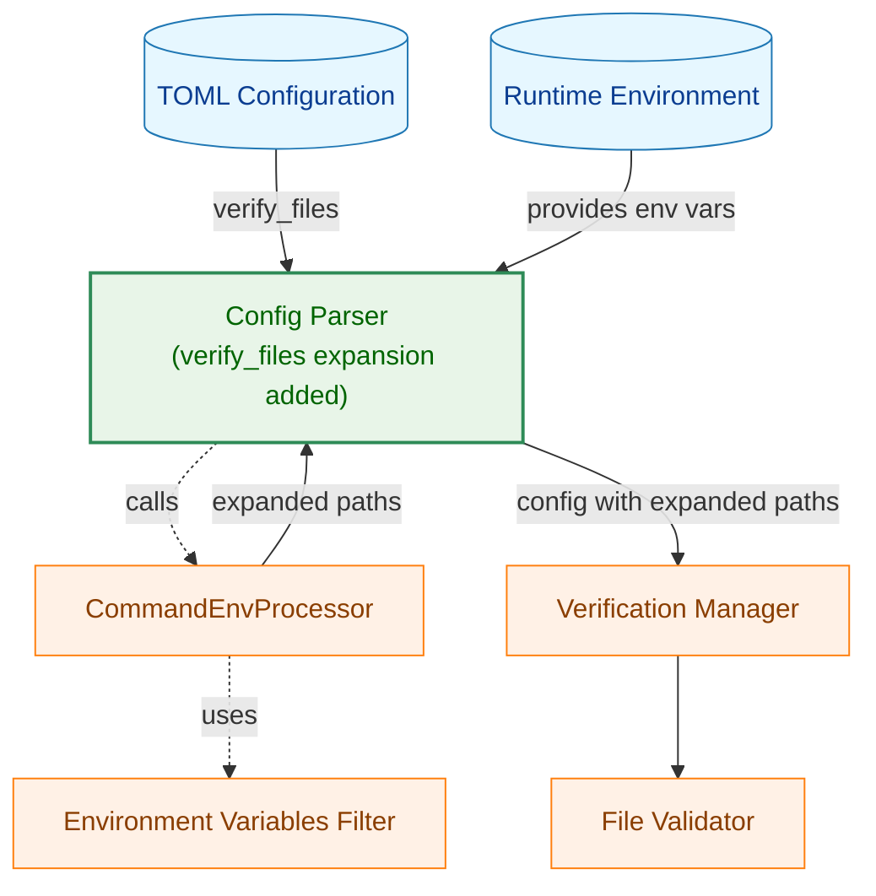
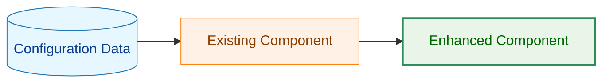
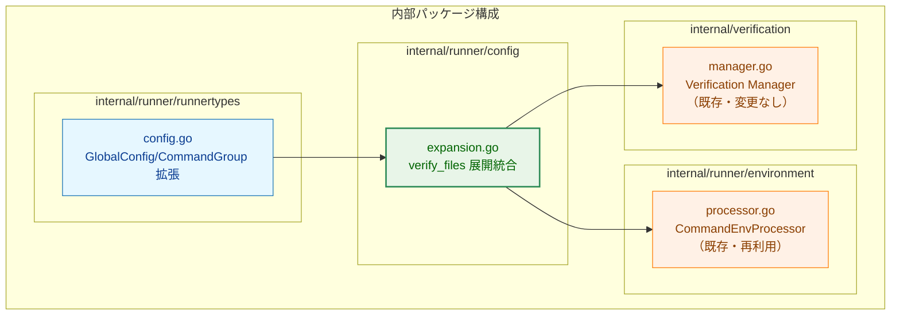
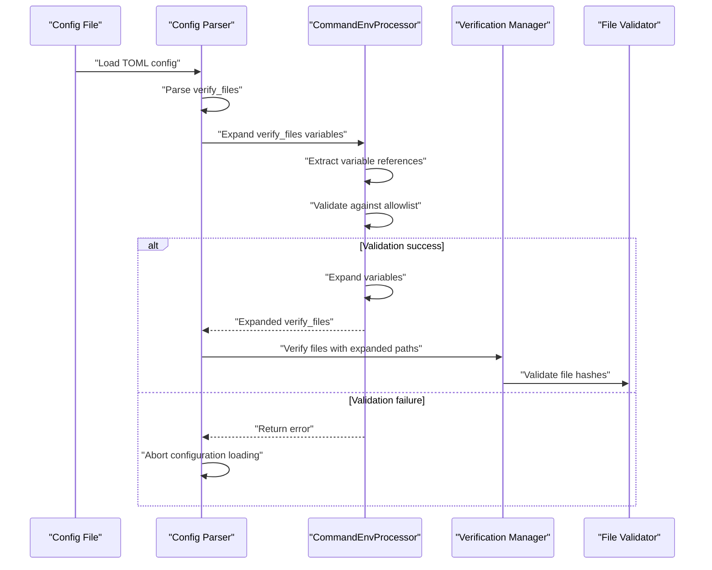
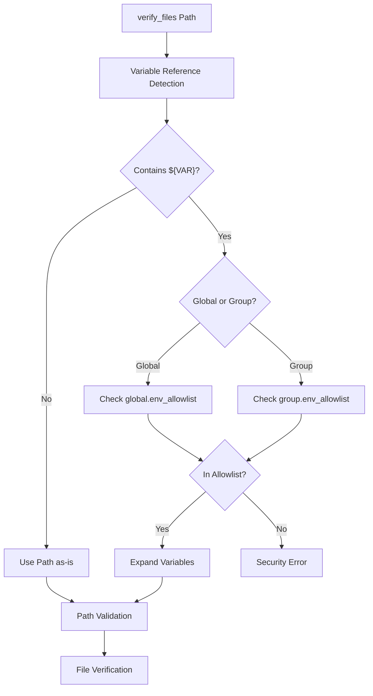
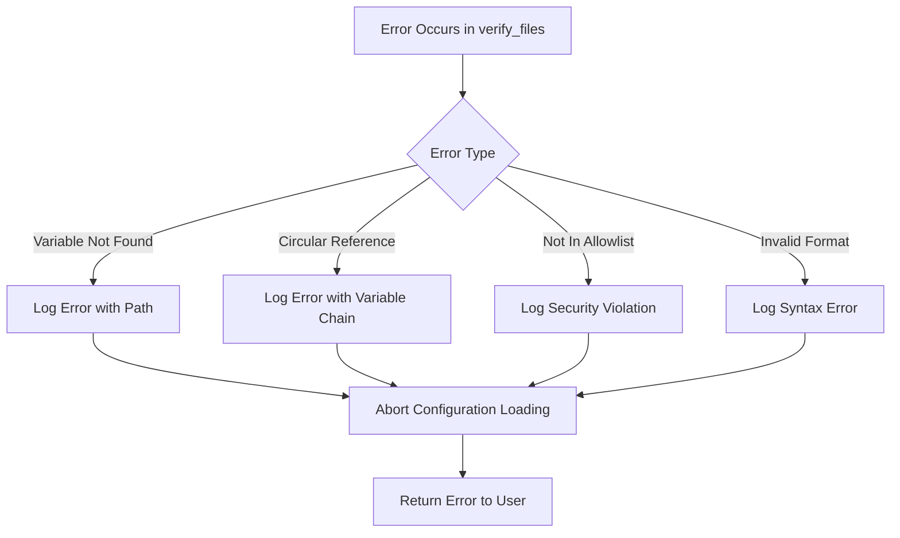
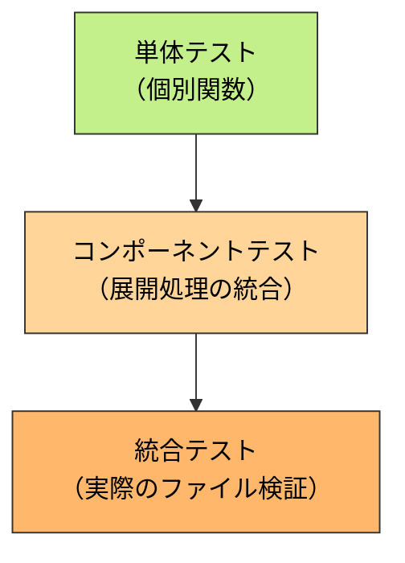

# アーキテクチャ設計書: verify_files フィールド環境変数展開機能

## 1. システム概要

### 1.1 アーキテクチャ目標
- 既存の環境変数展開機能（タスク 0026）の再利用
- verify_files への最小限の統合
- セキュリティの堅牢性確保
- 既存の検証フローへの影響最小化

### 1.2 設計原則
- **既存活用**: タスク 0026 で実装された `CommandEnvProcessor` を再利用
- **セキュリティファースト**: allowlist 検証を展開前に実施
- **最小変更**: verify_files 処理への最小限の統合
- **一貫性**: cmd/args と同じ展開動作

## 2. システム構成

### 2.1 全体アーキテクチャ



**凡例（Legend）**



### 2.2 コンポーネント配置



### 2.3 データフロー



## 3. コンポーネント設計

### 3.1 データ構造の拡張

#### 3.1.1 GlobalConfig 構造体の拡張

```go
// internal/runner/runnertypes/config.go
type GlobalConfig struct {
    // 既存フィールド
    VerifyFiles []string `toml:"verify_files"`

    // 新規フィールド: 展開後の verify_files を保存
    ExpandedVerifyFiles []string `toml:"-"`
}
```

#### 3.1.2 CommandGroup 構造体の拡張

```go
// internal/runner/runnertypes/config.go
type CommandGroup struct {
    // 既存フィールド
    VerifyFiles []string `toml:"verify_files"`

    // 新規フィールド: 展開後の verify_files を保存
    ExpandedVerifyFiles []string `toml:"-"`
}
```

### 3.2 環境変数展開の統合

#### 3.2.1 Config Parser での展開処理

```go
// internal/runner/config/expansion.go

// ExpandGlobalVerifyFiles expands environment variables in global verify_files
func ExpandGlobalVerifyFiles(
    global *runnertypes.GlobalConfig,
    processor *environment.CommandEnvProcessor,
) error {
    if len(global.VerifyFiles) == 0 {
        global.ExpandedVerifyFiles = []string{}
        return nil
    }

    // システム環境変数のみを使用
    systemEnv := make(map[string]string)

    // 全てのパスを展開
    expanded := make([]string, 0, len(global.VerifyFiles))
    for _, path := range global.VerifyFiles {
        expandedPath, err := processor.Expand(
            path,
            systemEnv,
            global.EnvAllowlist,
            "global",
            make(map[string]bool),
        )
        if err != nil {
            return fmt.Errorf("failed to expand global verify_files: %w", err)
        }
        expanded = append(expanded, expandedPath)
    }

    global.ExpandedVerifyFiles = expanded
    return nil
}

// ExpandGroupVerifyFiles expands environment variables in group verify_files
func ExpandGroupVerifyFiles(
    group *runnertypes.CommandGroup,
    global *runnertypes.GlobalConfig,
    processor *environment.CommandEnvProcessor,
) error {
    if len(group.VerifyFiles) == 0 {
        group.ExpandedVerifyFiles = []string{}
        return nil
    }

    // グループ環境変数マップを構築
    groupEnv, err := buildGroupEnvironmentMap(group.Commands)
    if err != nil {
        return fmt.Errorf("failed to build group environment map: %w", err)
    }

    // allowlist の決定（継承モードに従う）
    allowlist := determineAllowlist(group, global)

    // 全てのパスを展開
    expanded := make([]string, 0, len(group.VerifyFiles))
    for _, path := range group.VerifyFiles {
        expandedPath, err := processor.Expand(
            path,
            groupEnv,
            allowlist,
            group.Name,
            make(map[string]bool),
        )
        if err != nil {
            return fmt.Errorf("failed to expand verify_files for group %s: %w", group.Name, err)
        }
        expanded = append(expanded, expandedPath)
    }

    group.ExpandedVerifyFiles = expanded
    return nil
}
```

### 3.3 Verification Manager との統合

#### 3.3.1 既存コードの変更

```go
// internal/verification/manager.go

// VerifyGlobalFiles の変更: ExpandedVerifyFiles を使用
func (m *Manager) VerifyGlobalFiles(globalConfig *runnertypes.GlobalConfig) (*Result, error) {
    // 変更前: globalConfig.VerifyFiles を使用
    // 変更後: globalConfig.ExpandedVerifyFiles を使用
    for _, filePath := range globalConfig.ExpandedVerifyFiles {
        // 既存の検証ロジックはそのまま
        if err := m.verifyFileWithFallback(filePath); err != nil {
            // エラーハンドリング
        }
    }
}

// VerifyGroupFiles の変更: ExpandedVerifyFiles を使用
func (m *Manager) VerifyGroupFiles(groupConfig *runnertypes.CommandGroup) (*Result, error) {
    // collectVerificationFiles 内で ExpandedVerifyFiles を使用
    allFiles := append([]string{}, groupConfig.ExpandedVerifyFiles...)
    // 既存の検証ロジックはそのまま
}
```

## 4. セキュリティアーキテクチャ

### 4.1 セキュリティ処理フロー



### 4.2 セキュリティレイヤー

1. **入力検証レイヤー**: `${VAR}` 形式のチェック
2. **認可レイヤー**: allowlist による変数アクセス制御
3. **展開レイヤー**: 安全な変数展開処理
4. **検証レイヤー**: 展開後のパス検証とハッシュ検証

### 4.3 攻撃ベクター対策

| 攻撃タイプ | 対策 |
|-----------|------|
| 権限昇格 | allowlist 強制、システム環境変数のフィルタリング |
| パストラバーサル | 展開後のパス正規化と検証 |
| シンボリックリンク攻撃 | 既存の safefileio による防御を維持 |
| インジェクション | シェル実行なし、ファイルパスのみ |
| 循環参照DoS | visited map による循環参照検出 |

## 5. パフォーマンス設計

### 5.1 性能最適化戦略

- **Phase 1 での展開**: 設定読み込み時に一度だけ展開
- **既存実装の再利用**: CommandEnvProcessor の効率的な展開ロジック
- **最小限のメモリ使用**: 展開済みパスを配列で保持
- **キャッシュの活用**: SecurityValidator のキャッシュを活用

### 5.2 パフォーマンス要件

| メトリクス | 目標値 | 根拠 |
|----------|-------|------|
| 展開処理時間（パスあたり） | < 1ms | タスク 0026 の実績値 |
| メモリ増加量 | < 10% | 展開済みパスの追加分のみ |
| 検証処理への影響 | < 5% | 展開済みパスを使用するため最小限 |

### 5.3 スケーラビリティ考慮

- **パス数制限**: verify_files は通常数個～数十個程度
- **変数数制限**: パスあたり最大50個の変数（タスク 0026 と同じ）
- **展開深度**: visited map による循環参照検出で安全性を保証

## 6. エラーハンドリング設計

### 6.1 エラー種別

```go
// 既存の environment パッケージのエラーを再利用
var (
    ErrVariableNotFound     error // 未定義変数
    ErrCircularReference    error // 循環参照
    ErrNotInAllowlist       error // allowlist 違反
    ErrInvalidVariableFormat error // 不正な変数形式
)

// verify_files 固有のエラー
var (
    ErrGlobalVerifyFilesExpansion error // グローバル verify_files 展開エラー
    ErrGroupVerifyFilesExpansion  error // グループ verify_files 展開エラー
)
```

### 6.2 エラー処理フロー



### 6.3 エラーメッセージ設計

**グローバルレベルのエラー**:
```
Error: failed to expand global verify_files: variable not in allowlist: PATH
  Path: ${PATH}/bin/tool
  Global allowlist: [HOME, USER]
```

**グループレベルのエラー**:
```
Error: failed to expand verify_files for group "development": undefined variable: UNDEFINED_VAR
  Path: ${UNDEFINED_VAR}/script.sh
  Group: development
  Available variables: [DEV_TOOLS, VERSION]
```

## 7. 段階的実装計画

### 7.1 Phase 1: データ構造の拡張

- [ ] GlobalConfig に ExpandedVerifyFiles フィールドを追加
- [ ] CommandGroup に ExpandedVerifyFiles フィールドを追加
- [ ] 基本的な単体テストの作成

### 7.2 Phase 2: 環境変数展開の統合

- [ ] ExpandGlobalVerifyFiles 関数の実装
- [ ] ExpandGroupVerifyFiles 関数の実装
- [ ] Config Parser への統合
- [ ] 環境変数展開のテスト

### 7.3 Phase 3: Verification Manager の更新

- [ ] VerifyGlobalFiles の更新
- [ ] VerifyGroupFiles の更新
- [ ] collectVerificationFiles の更新
- [ ] 統合テストの実装

### 7.4 Phase 4: テストとドキュメント

- [ ] 包括的なテストケースの作成
- [ ] エラーケースのテスト
- [ ] パフォーマンステスト
- [ ] ユーザーガイドの更新

## 8. テスト戦略

### 8.1 テスト階層



### 8.2 テストカテゴリ

**単体テスト**:
- ExpandGlobalVerifyFiles: グローバルレベルの展開
- ExpandGroupVerifyFiles: グループレベルの展開
- エラーハンドリング: 各種エラーケース

**統合テスト**:
- Config Parser との統合: 設定読み込みから展開まで
- Verification Manager との統合: 展開から検証まで
- 既存機能との互換性: 変数なしのパスの動作確認

**E2Eテスト**:
- 実際の TOML ファイルを使用した検証
- システム環境変数を使用したテスト
- グループ環境変数を使用したテスト

### 8.3 テストデータ設計

**正常系**:
```toml
# グローバルレベル
[global]
env_allowlist = ["HOME"]
verify_files = ["${HOME}/bin/tool.sh"]

# グループレベル
[[groups]]
name = "test"
env = ["TOOLS_DIR=/opt/tools"]
env_allowlist = ["TOOLS_DIR"]
verify_files = ["${TOOLS_DIR}/verify.sh"]
```

**異常系**:
```toml
# 未定義変数
[global]
verify_files = ["${UNDEFINED}/path"]

# allowlist 違反
[global]
env_allowlist = ["HOME"]
verify_files = ["${PATH}/tool"]

# 循環参照
[[groups]]
name = "test"
env = ["A=${B}", "B=${A}"]
verify_files = ["${A}/file"]
```

## 9. 依存関係とリスク

### 9.1 内部依存関係

- **既存実装への依存**:
  - `internal/runner/environment.CommandEnvProcessor` - 環境変数展開
  - `internal/verification.Manager` - ファイル検証
  - `internal/runner/runnertypes` - データ構造定義

### 9.2 アーキテクチャリスク

| リスク | 影響度 | 対策 |
|-------|-------|-----|
| 既存検証フローへの影響 | 中 | ExpandedVerifyFiles の導入で影響を局所化 |
| パフォーマンス劣化 | 低 | Phase 1 で展開、既存実装の再利用 |
| セキュリティホール | 高 | 既存の allowlist 検証を再利用 |
| テストカバレッジ不足 | 中 | 段階的テスト実装 |

### 9.3 技術的課題

**グループ環境変数の取得**:
- グループレベルでは各コマンドが独立した env を持つ
- 最初のコマンドの env を代表として使用する設計

**allowlist 継承モードの処理**:
- グループの env_allowlist が未定義の場合はグローバルを継承
- 空配列の場合は全て拒否

## 10. 監視・運用設計

### 10.1 ログ出力設計

**デバッグレベル**:
```
Debug: Expanding global verify_files
  Original: ${HOME}/bin/tool.sh
  Expanded: /home/user/bin/tool.sh
  Allowlist: [HOME, USER]
```

**エラーレベル**:
```
Error: Failed to expand verify_files for group "development"
  Path: ${UNDEFINED_VAR}/script.sh
  Error: undefined variable: UNDEFINED_VAR
  Group: development
```

### 10.2 運用監視項目

| メトリクス | 説明 | 閾値例 |
|----------|------|-------|
| 展開処理時間 | verify_files の展開時間 | >10ms |
| 展開エラー率 | 展開失敗の割合 | >1% |
| セキュリティ違反 | allowlist 違反回数 | >0 |
