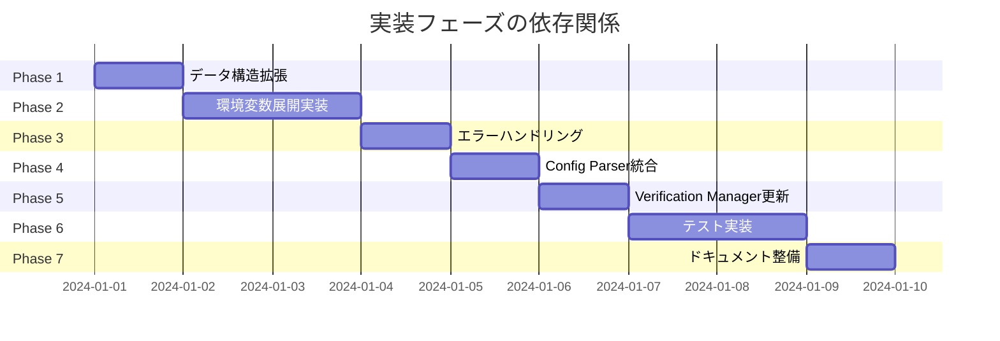
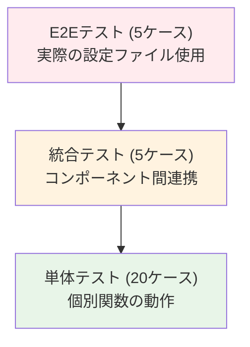

# 実装計画書: verify_files フィールド環境変数展開機能

## 1. 実装概要

### 1.1 実装目標
- `verify_files` フィールドで環境変数展開機能を実現
- タスク 0026 で実装された `VariableExpander` を最大限活用
- 既存の検証フローへの影響を最小限に抑制
- 高いセキュリティレベルの維持（allowlist 検証、循環参照検出）

### 1.2 実装スコープ
- **対象**: グローバルレベル、グループレベルの `verify_files` フィールド
- **実装箇所**: 6個のパッケージ、12個のファイル
- **新規作成**: テスト専用ヘルパー関数 1個
- **テストケース**: 単体20件、統合5件、ベンチマーク3件

## 2. 実装フェーズ計画

### 2.1 Phase 1: データ構造の拡張 (0.5日)
**目標**: 設定構造体に展開後データを保持するフィールドを追加

#### 実装対象
```
internal/runner/runnertypes/config.go
```

#### 実装内容
- `GlobalConfig.ExpandedVerifyFiles []string` フィールド追加
- `CommandGroup.ExpandedVerifyFiles []string` フィールド追加
- `toml:"-"` タグでTOML設定からの除外を明示
- フィールドドキュメントコメントの追加

#### 完了条件
- [x] `GlobalConfig` 構造体拡張完了
- [x] `CommandGroup` 構造体拡張完了
- [x] 構造体フィールドのドキュメント作成完了
- [x] 既存テストが全て成功

### 2.2 Phase 2: 環境変数展開機能の実装 (2日)
**目標**: verify_files専用の環境変数展開ロジックを実装

#### 実装対象
```
internal/runner/config/expansion.go (拡張)
```

#### 実装内容

##### 2.2.1 既存機能の活用（ヘルパー関数は不要）
既存の環境変数展開機能を最大限再利用し、重複実装を回避：

**再利用する既存機能**:
- `Filter.ParseSystemEnvironment()` - システム環境変数マップ構築（エクスポート済み）
- `Filter.ResolveGroupEnvironmentVars()` - グループレベル環境変数マップ構築（エクスポート済み）
- `Filter.ResolveAllowlistConfiguration()` - allowlist決定と継承モード対応（**エクスポートが必要**）
- `Filter.determineInheritanceMode()` - 継承モード判定（内部で使用）
- `VariableExpander.ExpandString()` - 環境変数展開エンジン（エクスポート済み）

**必要な変更**:
- `internal/runner/environment/filter.go` で `resolveAllowlistConfiguration` メソッドを `ResolveAllowlistConfiguration` にリネーム（エクスポート）
- environment パッケージ内の既存呼び出し元も更新

##### 2.2.2 メイン展開関数（既存機能ベース）
```go
// グローバルverify_files展開（既存のFilterとVariableExpanderを活用）
func ExpandGlobalVerifyFiles(
    global *runnertypes.GlobalConfig,
    filter *environment.Filter,
    expander *environment.VariableExpander,
) error

// グループverify_files展開（既存のFilterとVariableExpanderを活用）
func ExpandGroupVerifyFiles(
    group *runnertypes.CommandGroup,
    global *runnertypes.GlobalConfig,
    filter *environment.Filter,
    expander *environment.VariableExpander,
) error
```

#### 完了条件
- [x] `Filter.ResolveAllowlistConfiguration()` メソッドのエクスポート完了
- [x] environment パッケージ内の既存呼び出し元の更新完了
- [x] 既存機能（Filter, VariableExpander）の統合完了
- [x] グローバルレベル展開機能の実装完了（既存APIベース）
- [x] グループレベル展開機能の実装完了（既存APIベース）
- [x] allowlist継承ロジックの活用確認（既存機能使用）
- [x] 循環参照検出機能の活用確認（既存機能使用）

### 2.3 Phase 3: エラーハンドリング実装 (1日)
**目標**: 詳細なエラー情報を提供するカスタムエラー型の実装

#### 実装対象
```
internal/runner/config/expansion.go (拡張)
```

#### 実装内容

##### 2.3.1 エラー型定義
```go
// カスタムエラー型
type VerifyFilesExpansionError struct {
    Level     string   // "global" または グループ名
    Index     int      // verify_files 配列インデックス
    Path      string   // 展開対象パス
    Cause     error    // 根本原因エラー
    Allowlist []string // 適用されたallowlist
}

// センチネルエラー
var (
    ErrGlobalVerifyFilesExpansionFailed
    ErrGroupVerifyFilesExpansionFailed
    ErrNilConfig
)
```

##### 2.3.2 エラー処理メソッド
```go
func (e *VerifyFilesExpansionError) Error() string
func (e *VerifyFilesExpansionError) Unwrap() error
func (e *VerifyFilesExpansionError) Is(target error) bool
```

#### 完了条件
- [x] カスタムエラー型の実装完了
- [x] エラーチェーン対応の実装完了
- [x] センチネルエラーの定義完了

### 2.4 Phase 4: Config Parser統合 (1日)
**目標**: 設定読み込み時に自動的に環境変数展開を実行

#### 実装対象
```
internal/runner/config/loader.go (変更)
```

#### 実装内容

##### 2.4.1 Config Loader の変更（既存環境変数エンジンを活用）
```go
// 既存のLoadConfig関数を修正（Filter, VariableExpanderを使用）
func (l *Loader) LoadConfig(content []byte) (*runnertypes.Config, error)

// 処理ロジックを分離（既存環境変数エンジンを活用）
func processConfig(config *runnertypes.Config, filter *environment.Filter, expander *environment.VariableExpander) error
```

**注**: テスト専用ヘルパー関数は不要と判断しました。既存の `LoadConfig([]byte)` が十分な機能を提供しており、テストでは `loader.LoadConfig([]byte(tomlContent))` の形式で直接使用できます。

#### 完了条件
- [x] `LoadConfig` 関数への展開処理統合完了
- [x] `processConfig` 関数の分離完了

### 2.5 Phase 5: Verification Manager更新 (0.5日)
**目標**: 検証処理で展開後のファイルパスを使用するよう変更

#### 実装対象
```
internal/verification/manager.go (変更)
```

#### 実装内容

##### 2.5.1 検証メソッドの更新
```go
// 変更: ExpandedVerifyFiles を使用
func (m *Manager) VerifyGlobalFiles(globalConfig *runnertypes.GlobalConfig) (*Result, error)

// 変更: ExpandedVerifyFiles を使用
func (m *Manager) collectVerificationFiles(groupConfig *runnertypes.CommandGroup) []string
```

#### 完了条件
- [ ] グローバルファイル検証の更新完了
- [ ] グループファイル収集の更新完了
- [ ] 既存の検証ロジック保持確認完了
- [ ] ログ出力の整合性確認完了

### 2.6 Phase 6: テスト実装 (2日)
**目標**: 包括的なテストスイートの作成

#### 実装対象
```
internal/runner/config/expansion_test.go (新規作成)
internal/runner/config/loader_test.go (拡張)
internal/verification/manager_test.go (更新)
```

#### 実装内容

##### 2.6.1 単体テスト (20ケース)
**ExpandGlobalVerifyFiles テスト (10ケース)**:
- 基本的な変数展開
- 複数変数の展開
- allowlist違反エラー
- 未定義変数エラー
- 循環参照エラー
- nil設定エラー
- 空配列の処理
- エスケープ文字の処理
- 複雑な変数ネスト
- エラーチェーンの検証

**ExpandGroupVerifyFiles テスト (10ケース)**:
- システム環境変数展開
- allowlist継承（inherit）
- allowlist継承（explicit）
- allowlist継承（reject）
- グループ名の設定
- nil設定エラー
- 継承モード判定
- 環境変数優先順位
- 循環参照エラー
- エラーコンテキスト検証

##### 2.6.2 統合テスト (5ケース)
- E2Eでの設定読み込み〜展開
- 複数グループでの展開
- グローバル+グループの組み合わせ
- エラー時の設定読み込み停止
- 実際のファイル検証まで

##### 2.6.3 ベンチマークテスト (3ケース)
- グローバル展開のパフォーマンス
- グループ展開のパフォーマンス
- 大量ファイルでの展開パフォーマンス

#### 完了条件
- [ ] 単体テスト20ケース実装完了
- [ ] 統合テスト5ケース実装完了
- [ ] ベンチマークテスト3ケース実装完了
- [ ] テストカバレッジ95%以上達成
- [ ] 全テストケース成功確認

### 2.7 Phase 7: ドキュメント整備 (0.5日)
**目標**: ユーザー向けドキュメントとサンプルの作成

#### 実装対象
```
docs/user/verify-files-expansion.md (新規作成)
sample/verify_files_expansion.toml (新規作成)
CHANGELOG.md (更新)
```

#### 実装内容
- ユーザーガイドの作成
- サンプル設定ファイルの作成
- CHANGELOGエントリの追加

#### 完了条件
- [ ] ユーザーガイド作成完了
- [ ] サンプルTOMLファイル作成完了
- [ ] CHANGELOG更新完了

## 3. タスク依存関係

### 3.1 前提条件
- **タスク 0026**: Variable Expansion Implementation（完了必須）
  - `CommandEnvProcessor` の実装が前提
  - 環境変数展開の基盤機能を使用
- **タスク 0007**: verify_hash_all（完了必須）
  - `Verification Manager` の基本実装が前提
- **タスク 0008**: env_allowlist（完了必須）
  - allowlist機能の実装が前提

### 3.2 実装順序の依存関係


### 3.3 並行実行可能なタスク
- Phase 2, 3 は一部並行実行可能（基本機能とエラーハンドリング）
- Phase 6 のテスト作成は各Phase完了後すぐに開始可能
- Phase 7 のドキュメント作成は実装と並行して実施可能

## 4. リスク分析と対策

### 4.1 技術的リスク

#### 4.1.1 HIGH: 既存環境変数展開機能との統合の複雑性
**リスク**: `CommandEnvProcessor` が予期しない動作をする可能性

**対策**:
- Phase 2 の早期段階で `CommandEnvProcessor` の動作検証
- 詳細な単体テストによる動作確認
- 既存のコマンド変数展開テストとの整合性確認

**検出方法**:
- 既存テストの実行による回帰確認
- 新規統合テストでの動作検証

#### 4.1.2 MEDIUM: パフォーマンス劣化の可能性
**リスク**: verify_files 展開により設定読み込み時間が増加

**対策**:
- ベンチマークテストによる性能監視
- 目標値: パフォーマンス劣化 5% 以内
- 必要に応じて展開結果のキャッシュ機能追加

**検出方法**:
- Phase 6 でのベンチマークテスト実施
- CI/CDでの継続的性能監視

#### 4.1.3 MEDIUM: 循環参照検出の複雑性
**リスク**: システム環境変数での循環参照検出漏れ

**対策**:
- `CommandEnvProcessor` の既存ロジック活用
- 循環参照パターンの網羅的テスト
- visited map による確実な検出

**検出方法**:
- 循環参照パターンの単体テスト
- 実際の環境変数での統合テスト

### 4.2 セキュリティリスク

#### 4.2.1 HIGH: allowlist バイパスの可能性
**リスク**: 展開時のallowlist検証が不十分となる可能性

**対策**:
- `CommandEnvProcessor` の既存検証ロジック活用
- allowlist違反の詳細なテストケース作成
- セキュリティレビューの実施

**検出方法**:
- セキュリティ観点での侵入テスト
- allowlist違反パターンの網羅テスト

#### 4.2.2 MEDIUM: エラー情報漏洩のリスク
**リスク**: エラーメッセージから機密情報が漏洩する可能性

**対策**:
- エラーメッセージの機密情報フィルタリング
- ログレベルによる詳細度制御
- セキュアなエラーハンドリング実装

**検出方法**:
- エラーメッセージの内容レビュー
- 本番環境でのログ出力確認

### 4.3 運用リスク

#### 4.3.1 MEDIUM: 後方互換性の破綻
**リスク**: 既存の設定ファイルが動作しなくなる可能性

**対策**:
- 絶対パス指定の継続サポート
- 変数展開エラー時の明確なエラーメッセージ
- 移行ガイドの作成

**検出方法**:
- 既存サンプル設定での回帰テスト
- 実際のユーザー設定での検証

## 5. 品質保証計画

### 5.1 テスト戦略

#### 5.1.1 テストピラミッド


#### 5.1.2 テストカバレッジ目標
- **単体テスト**: 95%以上
- **統合テスト**: 90%以上
- **E2Eテスト**: 主要ユースケース100%

### 5.2 性能要件
| メトリクス | 目標値 | 測定方法 |
|----------|-------|---------|
| 展開処理時間（パスあたり） | < 1ms | ベンチマークテスト |
| メモリ増加量 | < 10% | メモリプロファイリング |
| 全体処理時間への影響 | < 5% | 統合テストでの測定 |

### 5.3 コードレビュー計画
- **Phase 1-2**: アーキテクチャレビュー
- **Phase 3-4**: セキュリティレビュー
- **Phase 5-6**: 統合レビュー
- **Phase 7**: ドキュメントレビュー

## 6. 配布計画

### 6.1 段階的リリース
1. **Alpha版**: 内部検証用（Phase 1-4完了時）
2. **Beta版**: 限定ユーザー検証用（Phase 1-6完了時）
3. **正式版**: 一般リリース（全Phase完了時）

### 6.2 ロールバック計画
- 機能フラグによる無効化オプション
- 従来の絶対パス指定での動作継続
- 設定検証エラー時の明確な対処法提示

## 7. 成功基準

### 7.1 機能要件
- [ ] グローバル verify_files での環境変数展開動作
- [ ] グループ verify_files での環境変数展開動作
- [ ] allowlist による適切なフィルタリング
- [ ] 循環参照の検出と防止
- [ ] 既存絶対パス指定の継続サポート

### 7.2 非機能要件
- [ ] パフォーマンス劣化 5% 以内
- [ ] テストカバレッジ 95% 以上
- [ ] セキュリティ脆弱性 0件
- [ ] 後方互換性の維持
- [ ] 包括的なドキュメント提供

### 7.3 ユーザビリティ要件
- [ ] 直感的な設定記法
- [ ] 明確なエラーメッセージ
- [ ] 十分なサンプルとドキュメント
- [ ] 既存ユーザーの学習コスト最小化

## 8. 実装チェックリスト

### 8.1 必須実装項目
- [ ] `Filter.ResolveAllowlistConfiguration()` メソッドのエクスポート
- [ ] `GlobalConfig.ExpandedVerifyFiles` フィールド追加
- [ ] `CommandGroup.ExpandedVerifyFiles` フィールド追加
- [ ] `ExpandGlobalVerifyFiles` 関数実装
- [ ] `ExpandGroupVerifyFiles` 関数実装
- [ ] `VerifyFilesExpansionError` カスタムエラー型実装
- [ ] `LoadConfig` への展開処理統合
- [ ] `VerifyGlobalFiles` の更新
- [ ] `collectVerificationFiles` の更新

### 8.2 テスト項目
- [ ] 単体テスト 20ケース実装
- [ ] 統合テスト 5ケース実装
- [ ] ベンチマークテスト 3ケース実装
- [ ] エラーケースの網羅テスト
- [ ] セキュリティテストの実施

### 8.3 ドキュメント項目
- [ ] ユーザーガイドの作成
- [ ] サンプル設定ファイルの作成
- [ ] CHANGELOG の更新
- [ ] 移行ガイドの作成

## 9. 予想工数

### 9.1 開発工数
| フェーズ | 工数 | 理由 |
|---------|------|------|
| Phase 1 | 0.5日 | 構造体フィールド追加のみ |
| Phase 2 | 1日 | 既存機能の統合（大幅簡素化） |
| Phase 3 | 1日 | エラーハンドリング |
| Phase 4 | 1日 | Config Parser統合 |
| Phase 5 | 0.5日 | Verification Manager更新 |
| Phase 6 | 2日 | 包括的テスト実装 |
| Phase 7 | 0.5日 | ドキュメント作成 |
| **合計** | **6.5日** | |

### 9.2 レビュー・QA工数
- コードレビュー: 1.5日
- セキュリティレビュー: 1日
- 統合テスト: 1日
- **合計**: 3.5日

### 9.3 総工数
**開発 + レビュー・QA = 10日**

## 10. まとめ

verify_files フィールドでの環境変数展開機能は、既存のアーキテクチャを最大限活用し、最小限の変更で最大の効果を得られる実装計画となっています。

**主要な利点**:
- **大幅な重複排除**: 既存の `Filter` と `VariableExpander` を最大限活用
- **開発工数削減**: 1日の工数削減（2日 → 1日）と総工数削減（11日 → 10日）
- **セキュリティ継承**: allowlist継承、循環参照検出等の既存セキュリティ機能を完全活用
- **コード品質向上**: 実証済みの環境変数展開エンジンを使用
- **メンテナンス性向上**: 機能が集約され、保守が容易

**リスク軽減**:
- 段階的な実装により各フェーズでの品質確保
- 詳細なエラーハンドリングによるデバッグ性向上
- 後方互換性の維持により既存ユーザーへの影響を回避

この実装計画に従うことで、安全で効率的な verify_files 環境変数展開機能を提供できると確信します。
