# アーキテクチャ設計書: Global・Groupレベル環境変数設定機能

## 1. 設計概要

### 1.1 設計目的
Global・Groupレベルで環境変数を定義し、階層的なスコープとオーバーライド機構を提供するアーキテクチャを設計する。既存の環境変数展開機構（Task 0026, 0030）を最大限活用し、後方互換性を完全に維持しながら、新機能を統合する。

### 1.2 設計原則
1. **既存実装の再利用**: Task 0026の`VariableExpander`を拡張して使用
2. **段階的展開**: Global → Global.VerifyFiles → Group → Group.VerifyFiles → Command → Cmd/Args の順で展開
3. **不変性の保持**: 展開済みデータは不変（実行時の再展開なし）
4. **セキュリティ優先**: allowlistチェックを各レベルで厳格に実施
5. **明確な責任分離**: 各コンポーネントは単一の責任を持つ

### 1.3 設計制約
- 後方互換性の完全維持（既存の設定ファイルが変更なしで動作）
- 既存のallowlist継承ルールの維持（Override方式）
- 既存のエスケープシーケンス機能の維持
- 循環参照検出の既存方式（visited map）の継続使用

## 2. システムアーキテクチャ

### 2.1 allowlistによる環境変数フィルタリング

#### 2.1.1 フィルタリング方式の概要

環境変数展開時のセキュリティは、Task 0030で実装された`Filter.ResolveAllowlistConfiguration()`を活用し、各レベル（Global、Group）でallowlistによる厳格な制御を行います。

**フィルタリングの原則**:
- **設定ファイル内定義変数**: allowlistチェック不要（Global.Env、Group.Env、Command.Env）
- **システム環境変数**: 必ずallowlistチェックを実施
- **未定義変数**: エラーとして展開を中断

#### 2.1.2 継承モードによるallowlist決定

| Group.EnvAllowlist定義 | 継承モード | 適用されるallowlist | システム環境変数へのアクセス |
|----------------------|------------|-------------------|---------------------------|
| **未定義**（`env_allowlist`キーなし） | `inherit` | `global.env_allowlist` | Globalの設定に従う |
| **空配列**（`env_allowlist = []`） | `reject` | `[]`（空） | すべて拒否 |
| **値あり**（`env_allowlist = ["VAR1"]`） | `explicit` | 指定されたリスト | 明示的許可のみ |

#### 2.1.3 allowlistチェックフロー

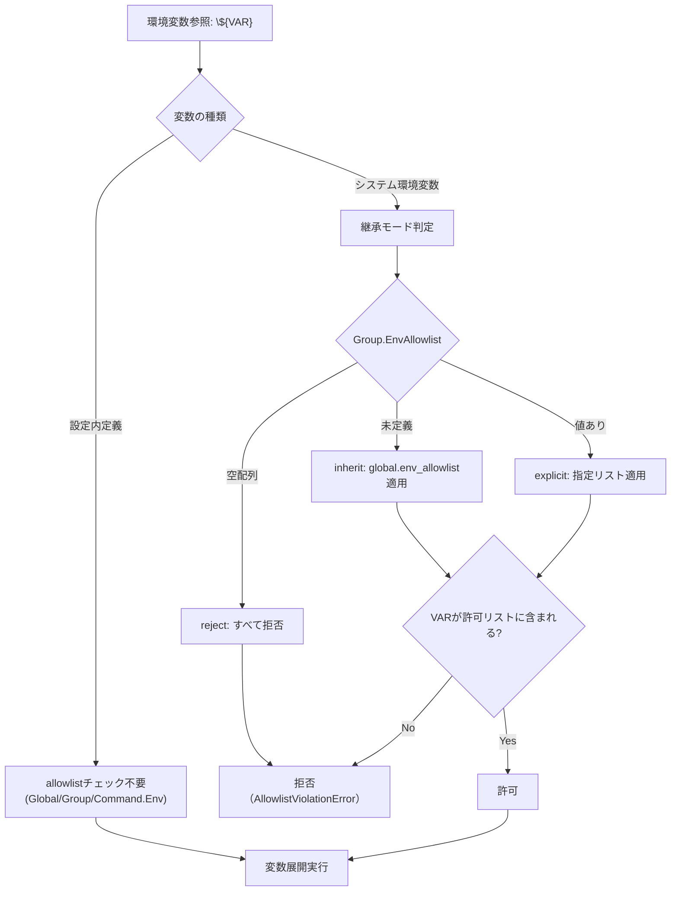

#### 2.1.4 具体的なフィルタリング例

**例1: inherit モード（Global設定を継承）**
```toml
[global]
env_allowlist = ["HOME", "USER", "PATH"]
env = ["BASE_DIR=${HOME}/app"]

[[groups]]
name = "development"
# env_allowlist未定義 → inherit mode
env = ["DEV_TOOLS=${HOME}/tools", "BUILD_DIR=${WORKSPACE}/build"]
```

| 変数 | フィルタリング結果 | 理由 |
|------|------------------|------|
| `${HOME}` | ✅ 許可 | global.env_allowlistに含まれる |
| `${WORKSPACE}` | ❌ 拒否 | global.env_allowlistに含まれない |

**例2: explicit モード（明示的リスト指定）**
```toml
[global]
env_allowlist = ["HOME", "USER", "PATH"]

[[groups]]
name = "production"
env_allowlist = ["PROD_ENV", "DEPLOY_KEY"]  # explicit mode
env = ["CONFIG=${HOME}/config", "SECRETS=${PROD_ENV}/secrets"]
```

| 変数 | フィルタリング結果 | 理由 |
|------|------------------|------|
| `${HOME}` | ❌ 拒否 | group allowlistに含まれない |
| `${PROD_ENV}` | ✅ 許可 | group allowlistに含まれる |

**例3: reject モード（すべて拒否）**
```toml
[[groups]]
name = "isolated"
env_allowlist = []  # reject mode
env = ["STATIC_VAR=fixed_value", "DYNAMIC_VAR=${HOME}/path"]
```

| 変数 | フィルタリング結果 | 理由 |
|------|------------------|------|
| `${HOME}` | ❌ 拒否 | reject modeですべてのシステム環境変数を拒否 |

### 2.2 全体構成

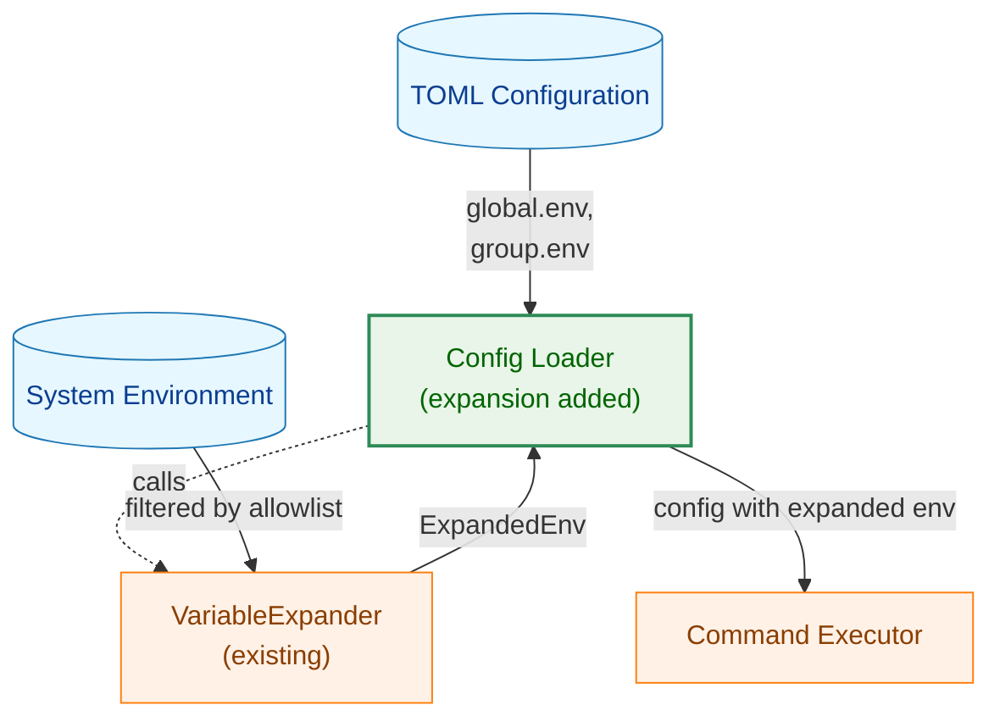

**凡例（Legend）**

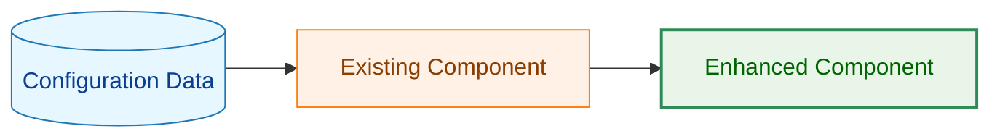

### 2.3 コンポーネント配置

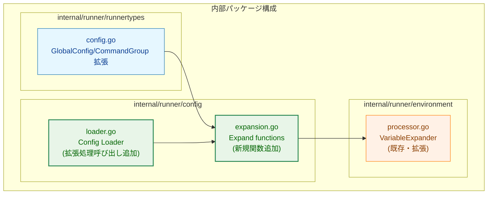

### 2.4 データフロー

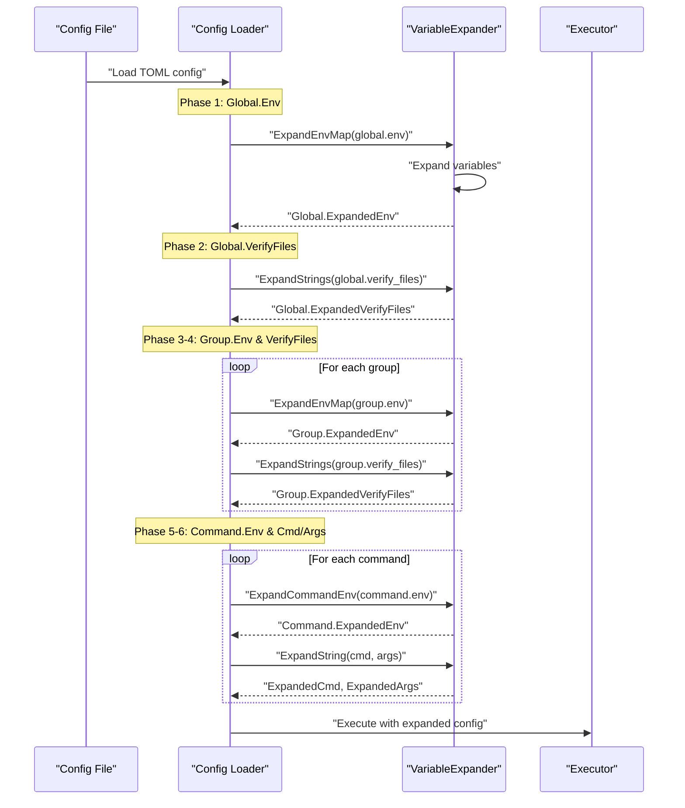

### 2.5 環境変数展開の階層構造

#### 2.5.1 変数参照の優先順位と展開順序

| 展開フェーズ | 対象データ | 参照可能な変数ソース | 優先順位（高→低） | allowlistチェック |
|------------|-----------|-------------------|-------------------|-------------------|
| **Phase 1** | Global.Env | システム環境変数のみ | システム環境変数 | `global.env_allowlist` |
| **Phase 2** | Global.VerifyFiles | Global.ExpandedEnv<br>システム環境変数 | Global.ExpandedEnv<br>→ システム環境変数 | `global.env_allowlist` |
| **Phase 3** | Group.Env | Global.ExpandedEnv<br>システム環境変数 | Global.ExpandedEnv<br>→ システム環境変数 | Group有効allowlist |
| **Phase 4** | Group.VerifyFiles | Global.ExpandedEnv<br>Group.ExpandedEnv<br>システム環境変数 | Group.ExpandedEnv<br>→ Global.ExpandedEnv<br>→ システム環境変数 | Group有効allowlist |
| **Phase 5** | Command.Env | Global.ExpandedEnv<br>Group.ExpandedEnv<br>システム環境変数 | Group.ExpandedEnv<br>→ Global.ExpandedEnv<br>→ システム環境変数 | Group有効allowlist |
| **Phase 6** | Cmd/Args | Command.ExpandedEnv<br>Global.ExpandedEnv<br>Group.ExpandedEnv<br>システム環境変数 | Command.ExpandedEnv<br>→ Group.ExpandedEnv<br>→ Global.ExpandedEnv<br>→ システム環境変数 | Group有効allowlist |

#### 2.5.2 Group有効allowlistの決定方式

| Group.EnvAllowlist | 継承モード | 有効allowlist | 説明 |
|-------------------|-----------|---------------|------|
| `nil`（未定義） | inherit | `global.env_allowlist` | Global設定を継承 |
| `[]`（空配列） | reject | `[]`（空） | すべての変数を拒否 |
| `["VAR1", "VAR2"]` | explicit | `["VAR1", "VAR2"]` | 明示的にリスト指定 |

#### 2.5.3 変数解決の具体例

**Global.Env展開時の変数解決**:
```toml
[global]
env_allowlist = ["HOME", "USER"]
env = ["BASE_DIR=${HOME}/app", "LOG_FILE=${BASE_DIR}/app.log"]
```

| 変数 | 解決順序 | 結果 |
|------|---------|------|
| `${HOME}` | 1. システム環境変数→ `/home/user` | `/home/user` |
| `${BASE_DIR}` | 1. Global.Env内他エントリ→ `${HOME}/app`<br>2. `${HOME}`をシステム環境変数で解決 | `/home/user/app` |

**Group.Env展開時の変数解決**:
```toml
[global]
env = ["BASE_DIR=/opt/app"]

[[groups]]
name = "dev"
env_allowlist = ["HOME", "DEV_MODE"]  # explicit mode
env = ["CONFIG_DIR=${BASE_DIR}/config", "DATA_DIR=${HOME}/data"]
```

| 変数 | 解決順序 | 結果 |
|------|---------|------|
| `${BASE_DIR}` | 1. Global.ExpandedEnv→ `/opt/app` | `/opt/app` |
| `${HOME}` | 1. Global.ExpandedEnv（見つからず）<br>2. システム環境変数（allowlist OK）→ `/home/user` | `/home/user` |

**Command.Env展開時の変数解決**:
```toml
[[groups.commands]]
name = "deploy"
env = ["OUTPUT_DIR=${DATA_DIR}/output", "LOG_LEVEL=debug"]
```

| 変数 | 解決順序 | 結果 |
|------|---------|------|
| `${DATA_DIR}` | 1. Group.ExpandedEnv→ `/home/user/data` | `/home/user/data` |

## 3. コンポーネント設計

### 3.1 データ構造の拡張

#### 3.1.1 GlobalConfig構造体

```go
// internal/runner/runnertypes/config.go
type GlobalConfig struct {
    // 既存フィールド
    Timeout           int
    WorkDir           string
    LogLevel          string
    VerifyFiles       []string
    SkipStandardPaths bool
    EnvAllowlist      []string
    MaxOutputSize     int64
    ExpandedVerifyFiles []string `toml:"-"`

    // 新規追加フィールド
    Env               []string          `toml:"env"`
    ExpandedEnv       map[string]string `toml:"-"`
}
```

**新規フィールドの説明**:
- `Env`: Global環境変数定義（KEY=VALUE形式の配列）
- `ExpandedEnv`: 展開済みGlobal環境変数マップ（設定読み込み時に生成）

#### 3.1.2 CommandGroup構造体

```go
// internal/runner/runnertypes/config.go
type CommandGroup struct {
    // 既存フィールド
    Name        string
    Description string
    Priority    int
    TempDir     bool
    WorkDir     string
    Commands    []Command
    VerifyFiles []string
    EnvAllowlist []string
    ExpandedVerifyFiles []string `toml:"-"`

    // 新規追加フィールド
    Env         []string          `toml:"env"`
    ExpandedEnv map[string]string `toml:"-"`
}
```

**新規フィールドの説明**:
- `Env`: Group環境変数定義（KEY=VALUE形式の配列）
- `ExpandedEnv`: 展開済みGroup環境変数マップ（設定読み込み時に生成）

#### 3.1.3 Command構造体

**変更なし**: 既存の`Env`と`ExpandedEnv`フィールドをそのまま使用。

### 3.2 環境変数展開コンポーネント

#### 3.2.1 VariableExpander（既存、活用）

**既存のメソッド（Task 0026で実装済み）**:
- `ExpandCommandEnv()`: Command.Envの展開
- `ExpandString()`: 文字列内の変数展開
- `ExpandStrings()`: 文字列配列の展開
- `resolveVariable()`: 変数の解決（allowlistチェック、循環参照検出含む）

**活用方針**:
- `ExpandString()`と`ExpandStrings()`を使用してGlobal/Group環境変数とVerifyFilesを展開
- `ExpandCommandEnv()`を拡張して、Global.EnvとGroup.Envを参照できるようにする

#### 3.2.2 新規展開関数（expansion.goに追加）

**ExpandGlobalEnv()**:
```go
// Global.Env を展開し、GlobalConfig.ExpandedEnv に保存
func ExpandGlobalEnv(
    cfg *GlobalConfig,
    expander *VariableExpander,
) error
```
- 既存の`ExpandString()`を使用
- システム環境変数のみを参照
- `global.env_allowlist`を適用

**ExpandGroupEnv()**:
```go
// Group.Env を展開し、CommandGroup.ExpandedEnv に保存
func ExpandGroupEnv(
    group *CommandGroup,
    globalEnv map[string]string,
    globalAllowlist []string,
    expander *VariableExpander,
) error
```
- 既存の`ExpandString()`を使用
- Global.ExpandedEnvとシステム環境変数を参照
- グループの有効なallowlistを適用

**ExpandCommandEnv()の拡張**:
```go
// Command.Env を展開（Global.Env と Group.Env を参照可能に）
func (p *VariableExpander) ExpandCommandEnv(
    cmd *Command,
    groupName string,
    groupEnvAllowList []string,
    baseEnv map[string]string,  // Global.Env + Group.Env をマージして渡す
) (map[string]string, error)
```
- 既存実装を活用
- `baseEnv`にGlobal.EnvとGroup.Envをマージして渡すことで階層的参照を実現

### 3.3 処理フロー

#### 3.3.1 設定読み込み時の展開順序

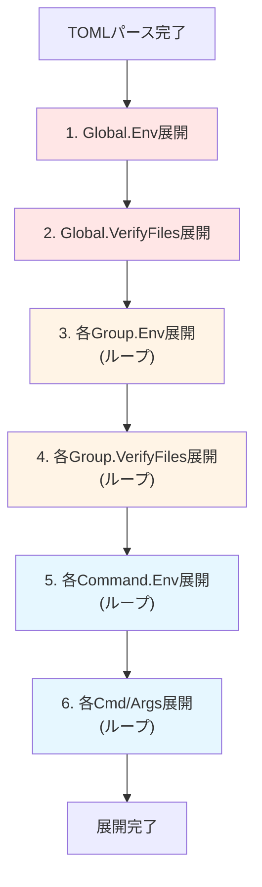

#### 3.3.2 変数解決の優先順位

**Commandレベルでの変数解決**:
```
${VAR}の解決順序:
1. Command.ExpandedEnv[VAR]
2. Group.ExpandedEnv[VAR]
3. Global.ExpandedEnv[VAR]
4. システム環境変数[VAR] (allowlistチェック)
5. 見つからない → エラー
```

**Groupレベルでの変数解決**:
```
${VAR}の解決順序:
1. Group.Env内の他のエントリ[VAR]
2. Global.ExpandedEnv[VAR]
3. システム環境変数[VAR] (allowlistチェック)
4. 見つからない → エラー
```

**Globalレベルでの変数解決**:
```
${VAR}の解決順序:
1. Global.Env内の他のエントリ[VAR]
2. システム環境変数[VAR] (allowlistチェック)
3. 見つからない → エラー
```

## 4. セキュリティアーキテクチャ

### 4.1 Allowlist検証フロー

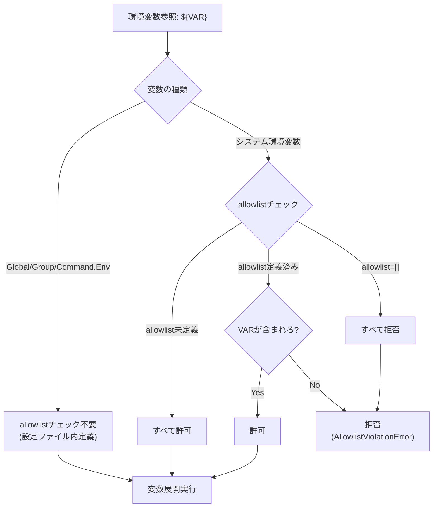

### 4.2 循環参照検出

**検出方式**: visited mapによる検出（既存実装を活用）

**自己参照の扱い**:
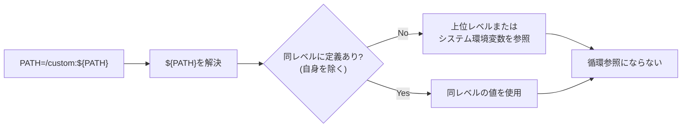

**循環参照のエラーケース**:
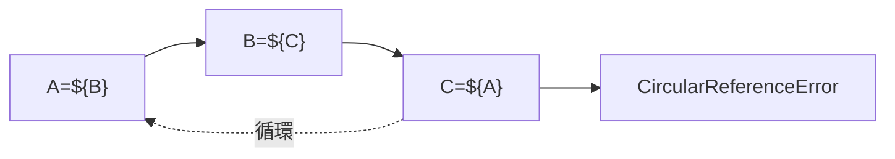

## 5. エラーハンドリング

### 5.1 エラー種別

#### 既存エラーの再利用

**internal/runner/environment**:
- `ErrVariableNotFound`: 未定義変数
- `ErrCircularReference`: 循環参照
- `ErrNotInAllowlist`: allowlist違反
- `ErrInvalidVariableFormat`: 不正な変数形式
- `ErrInvalidEscapeSequence`: 無効なエスケープシーケンス

#### 新規エラー型

**internal/runner/config**:
- `ErrGlobalEnvExpansionFailed`: Global.Env展開エラー
- `ErrGroupEnvExpansionFailed`: Group.Env展開エラー

### 5.2 エラー処理フロー

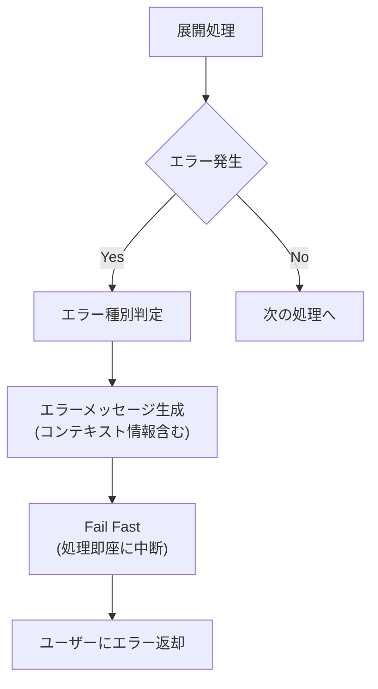

### 5.3 エラーメッセージ例

**未定義変数エラー**:
```
Error: Undefined environment variable 'DB_HOST'
Context: group.env:database
Available variables:
  - Global.Env: [BASE_DIR, LOG_LEVEL]
  - Group.Env: [DB_PORT, DB_NAME]
  - System (allowlist): [HOME, PATH, USER]
```

**Allowlist違反エラー**:
```
Error: Environment variable 'SECRET_KEY' not in allowlist
Effective allowlist: [HOME, PATH, USER]
Referenced in: command.env:deploy_app (group: production)
```

## 6. パフォーマンス設計

### 6.1 性能最適化戦略

- **設定読み込み時の一度だけ展開**: 実行時の再展開なし
- **既存実装の再利用**: `VariableExpander`の効率的な展開ロジック
- **展開済みデータの保存**: map形式でO(1)アクセス
- **不要な再計算の回避**: 各レベルで一度だけ展開

### 6.2 パフォーマンス要件

| メトリクス | 目標値 |
|----------|-------|
| 環境変数1個あたりの展開時間 | < 1ms |
| 設定読み込み時間への影響 | < 10% |
| メモリ使用量の増加 | 環境変数定義の2倍以内 |

## 7. テスト戦略

### 7.1 テスト階層

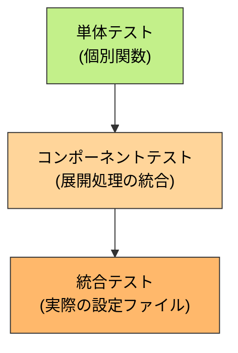

### 7.2 テストカテゴリ

**単体テスト**:
- `ExpandGlobalEnv()`: Global.Env展開
- `ExpandGroupEnv()`: Group.Env展開（Global.Envを参照）
- `ExpandCommandEnv()`: Command.Env展開（拡張版）
- Allowlist継承/上書きの動作確認
- 循環参照検出
- 自己参照の正常動作

**統合テスト**:
- 階層的展開（Global → Group → Command）
- VerifyFiles展開との統合
- 既存機能との互換性確認

**E2Eテスト**:
- 実際のTOMLファイルを使用した検証
- 複雑な変数参照パターンの動作確認

## 8. 依存関係と影響範囲

### 8.1 変更が必要なコンポーネント

**internal/runner/runnertypes/config.go**:
- GlobalConfigとCommandGroupの構造体定義拡張

**internal/runner/config/expansion.go**:
- `ExpandGlobalEnv()`関数追加
- `ExpandGroupEnv()`関数追加

**internal/runner/config/loader.go**:
- 展開処理の呼び出し追加

**internal/runner/environment/processor.go**:
- `ExpandCommandEnv()`の拡張（baseEnvパラメータの活用）

### 8.2 変更が不要なコンポーネント

**internal/runner/executor/**:
- 展開済みデータを使用するため変更不要

**internal/runner/environment/processor.go**:
- 既存の`ExpandString()`, `ExpandStrings()`, `resolveVariable()`は変更不要

**internal/verification/**:
- Task 0030で既に対応済み（ExpandedVerifyFiles使用）

### 8.3 外部依存関係

**依存ライブラリ**:
- `github.com/pelletier/go-toml/v2`: TOMLパース（変更なし）
- 標準ライブラリのみを使用（新規依存なし）

## 9. 実装の段階的アプローチ

### 9.1 Phase 1: データ構造の拡張
- [ ] GlobalConfigとCommandGroupにEnv/ExpandedEnvフィールドを追加
- [ ] TOMLパーサーの拡張（新フィールドの読み込み）
- [ ] 基本的な単体テストの作成

### 9.2 Phase 2: Global.Env展開の実装
- [ ] `ExpandGlobalEnv()`関数の実装
- [ ] Global.VerifyFiles展開の拡張（Global.Envを参照可能に）
- [ ] 単体テストの追加

### 9.3 Phase 3: Group.Env展開の実装
- [ ] `ExpandGroupEnv()`関数の実装
- [ ] Group.VerifyFiles展開の拡張（Global.EnvとGroup.Envを参照可能に）
- [ ] Allowlist継承ロジックの統合
- [ ] 単体テストの追加

### 9.4 Phase 4: Command.Env展開の拡張
- [ ] `ExpandCommandEnv()`の拡張（Global.EnvとGroup.Envを参照）
- [ ] Cmd/Args展開の拡張
- [ ] 単体テストの追加

### 9.5 Phase 5: 統合とテスト
- [ ] 全機能の統合
- [ ] 統合テストの実施
- [ ] 既存機能との互換性確認
- [ ] ドキュメント更新

## 10. まとめ

### 10.1 設計の要点

1. **既存実装の最大活用**: `VariableExpander`の既存メソッドを活用
2. **階層的展開**: Global → Group → Command の順で段階的に展開
3. **セキュリティ優先**: Allowlistチェックと循環参照検出を厳格に実施
4. **パフォーマンス**: 設定読み込み時の一度だけ展開、実行時は再展開なし
5. **後方互換性**: 新フィールドはオプショナル、既存動作を維持

### 10.2 成功の指標

- [ ] すべての既存テストがPASS
- [ ] 新機能のユニットテストカバレッジ95%以上
- [ ] 統合テスト全パターンPASS
- [ ] 設定読み込み時間の増加10%以内
- [ ] メモリ使用量の増加が環境変数定義の2倍以内
