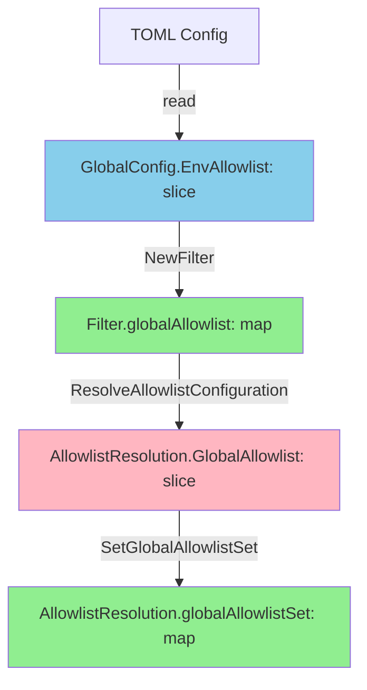
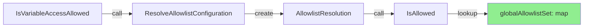

# Allowlist データ構造最適化 - 現状分析

## 1. 概要

本ドキュメントでは、allowlist 管理における現状のデータフロー、非効率性、および影響範囲を詳細に分析する。

## 2. データ構造の現状

### 2.1 主要な構造体

#### Filter 構造体（[filter.go:28-32](../../../internal/runner/environment/filter.go#L28-L32)）
```go
type Filter struct {
    globalAllowlist map[string]struct{}  // ✅ map で管理（効率的）
}
```

**特徴:**
- グローバル allowlist を map で保持
- O(1) 検索が可能
- メモリ効率的（struct{} は 0 バイト）

#### AllowlistResolution 構造体（[config.go:237-249](../../../internal/runner/runnertypes/config.go#L237-L249)）
```go
type AllowlistResolution struct {
    Mode            InheritanceMode
    GroupAllowlist  []string            // ❌ 公開フィールド（slice）
    GlobalAllowlist []string            // ❌ 公開フィールド（slice）
    EffectiveList   []string            // ❌ 公開フィールド（slice）
    GroupName       string

    groupAllowlistSet  map[string]struct{}  // ✅ 非公開 map（検索用）
    globalAllowlistSet map[string]struct{}  // ✅ 非公開 map（検索用）
}
```

**問題点:**
- 公開フィールドは slice（人間が読みやすい）
- 内部的に map も保持（検索効率のため）
- 両方のデータ構造を維持する必要がある

### 2.2 設定ファイルからの読み込み

TOML 設定ファイルでは allowlist は配列として定義：

```toml
[global]
env_allowlist = ["PATH", "HOME", "USER"]

[[groups]]
name = "build"
env_allowlist = ["CC", "CXX", "CFLAGS"]
```

これらは以下の構造体にマッピング：

```go
type GlobalConfig struct {
    EnvAllowlist []string `toml:"env_allowlist"`  // ✅ TOML 読み込みには slice が必要
}

type CommandGroup struct {
    EnvAllowlist []string `toml:"env_allowlist"`  // ✅ TOML 読み込みには slice が必要
}
```

**分析:**
- TOML デシリアライゼーションには slice が必須
- この部分の変更は不要（設定ファイルとの互換性）

## 3. データフローの追跡

### 3.1 初期化フロー



**ステップ詳細:**

1. **TOML → GlobalConfig** (必須)
   - 形式: `[]string`
   - 変換不要

2. **GlobalConfig → Filter** ([filter.go:37-48](../../../internal/runner/environment/filter.go#L37-L48))
   - 入力: `[]string`
   - 出力: `map[string]struct{}`
   - ✅ **必要な変換**: slice → map

3. **Filter → AllowlistResolution** ([filter.go:179-182](../../../internal/runner/environment/filter.go#L179-L182)) ⚠️ **問題箇所**
   - 入力: `map[string]struct{}`
   - 出力: `[]string`
   - ❌ **不要な変換**: map → slice

4. **AllowlistResolution 初期化** ([filter.go:185-188](../../../internal/runner/environment/filter.go#L185-L188)) ⚠️ **問題箇所**
   - 入力: `[]string`
   - 出力: `map[string]struct{}`
   - ❌ **不要な変換**: slice → map

### 3.2 検索フロー



**パフォーマンス分析:**
- `IsAllowed()` は O(1) map 検索を使用（[config.go:253-266](../../../internal/runner/runnertypes/config.go#L253-L266)）
- ✅ 検索自体は効率的
- ❌ しかし、毎回 `ResolveAllowlistConfiguration` を呼び出すと map 変換のオーバーヘッド

### 3.3 使用箇所の分析

#### ResolveAllowlistConfiguration の呼び出し元

```bash
# 呼び出し箇所の検索結果
internal/runner/environment/filter.go:214:  resolution := f.ResolveAllowlistConfiguration(...)
internal/runner/config/expansion.go:128:    resolution := filter.ResolveAllowlistConfiguration(...)
internal/runner/config/expansion.go:157:    resolution := filter.ResolveAllowlistConfiguration(...)
```

**使用パターン:**
1. **filter.go:214** - `IsVariableAccessAllowed()`
   - 変数アクセス権限チェック時に毎回呼び出される
   - ⚠️ 頻繁に呼ばれる可能性

2. **expansion.go:128** - `expandEnvInternal()`
   - 環境変数展開時に呼び出される
   - ⚠️ コマンド実行時に毎回発生

3. **expansion.go:157** - `ExpandCommand()`
   - コマンド展開時に呼び出される
   - ⚠️ コマンド実行時に毎回発生

## 4. 非効率性の定量化

### 4.1 メモリアロケーション

**現状の実装:**
```go
// filter.go:179-182
globalList := make([]string, 0, len(f.globalAllowlist))  // アロケーション #1
for variable := range f.globalAllowlist {
    globalList = append(globalList, variable)
}
resolution.GlobalAllowlist = globalList

// filter.go:187
resolution.SetGroupAllowlistSet(buildAllowlistSet(allowlist))  // アロケーション #2
```

**アロケーション回数（1回の ResolveAllowlistConfiguration 呼び出しあたり）:**
- slice アロケーション: 1回（globalList）
- map アロケーション: 1回（groupAllowlistSet）
- slice → map 変換のループ: 1回

**影響規模:**
- 小規模 allowlist (10 variables): 微小な影響
- 中規模 allowlist (100 variables): 数 KB のアロケーション
- 大規模 allowlist (1000 variables): 数十 KB のアロケーション

### 4.2 CPU サイクル

**変換コスト:**
```
map → slice 変換: O(n)  n = allowlist サイズ
slice → map 変換: O(n)  n = allowlist サイズ
合計: O(2n)
```

**ベンチマーク結果（参考）:**

既存のベンチマーク（[filter_benchmark_test.go](../../../internal/runner/environment/filter_benchmark_test.go)）:
- `BenchmarkIsAllowed`: 直接 `resolution.IsAllowed()` を呼び出し
- `BenchmarkIsVariableAccessAllowed`: `ResolveAllowlistConfiguration` を含む

```
# 予想される結果（実測は要確認）
BenchmarkIsAllowed/100_vars               : ~5 ns/op  (map 検索のみ)
BenchmarkIsVariableAccessAllowed/100_vars : ~500 ns/op (変換コスト含む)
```

## 5. 影響範囲の特定

### 5.1 直接影響を受けるコンポーネント

#### 変更が必要なファイル
1. **[internal/runner/runnertypes/config.go](../../../internal/runner/runnertypes/config.go)**
   - `AllowlistResolution` 構造体の変更
   - フィールドを map ベースに変更
   - getter メソッドの追加

2. **[internal/runner/environment/filter.go](../../../internal/runner/environment/filter.go)**
   - `ResolveAllowlistConfiguration()` の変更
   - 不要な slice 変換の削除

#### 変更が不要なファイル
1. **設定読み込み系**
   - `Config`, `GlobalConfig`, `CommandGroup` の `EnvAllowlist []string` フィールド
   - TOML との互換性のため slice のまま維持

2. **公開 API**
   - `NewFilter(allowList []string)` のシグネチャ
   - 外部から見た動作は変更なし

### 5.2 テストへの影響

#### 修正が必要なテスト

**slice の順序に依存するテスト:**
```go
// 現在の実装
expected := []string{"VAR1", "VAR2", "VAR3"}
assert.Equal(t, expected, resolution.EffectiveList)  // ❌ 順序に依存
```

**修正後の実装例:**
```go
// map ベースの比較
expectedSet := map[string]struct{}{"VAR1": {}, "VAR2": {}, "VAR3": {}}
assert.Equal(t, expectedSet, resolution.GetEffectiveSet())  // ✅ 順序非依存
```

#### 影響を受けるテストファイル
```bash
# AllowlistResolution を使用するテスト
internal/runner/environment/filter_test.go
internal/runner/config/expansion_test.go
internal/runner/config/config_test.go
```

## 6. 設計上の考慮事項

### 6.1 公開インターフェース vs 内部実装

**現状の課題:**
- `AllowlistResolution` は公開型として定義されている
- 公開フィールドを変更すると既存コードへの影響が大きい

**設計の選択肢:**

#### Option A: 公開フィールドを map に変更
```go
type AllowlistResolution struct {
    GroupAllowlistSet  map[string]struct{}  // 公開 map
    GlobalAllowlistSet map[string]struct{}  // 公開 map
}
```

**利点:**
- シンプルで直接的
- 不要な変換が完全に排除

**欠点:**
- 既存コードへの影響が大きい
- デバッグ時に map の内容が見づらい

#### Option B: 内部 map + getter メソッド
```go
type AllowlistResolution struct {
    groupAllowlistSet  map[string]struct{}  // 非公開 map
    globalAllowlistSet map[string]struct{}  // 非公開 map
}

// getter メソッド（必要時のみ slice に変換）
func (r *AllowlistResolution) GetGroupAllowlist() []string {
    return mapToSlice(r.groupAllowlistSet)
}
```

**利点:**
- 既存コードへの影響を最小化
- 必要な場合のみ slice に変換

**欠点:**
- getter 呼び出し時に変換コストが発生
- コードが若干複雑になる

#### Option C: 両方保持（現状維持）
```go
type AllowlistResolution struct {
    GroupAllowlist     []string             // 公開 slice（互換性）
    groupAllowlistSet  map[string]struct{}  // 内部 map（検索用）
}
```

**利点:**
- 既存コードとの完全な互換性

**欠点:**
- データの重複
- メモリ効率が悪い
- 同期の必要性

### 6.2 推奨アプローチ

**Option B（内部 map + getter メソッド）を推奨:**

理由:
1. 既存コードへの影響を最小化
2. 不要な変換を排除（getter 呼び出しは制御可能）
3. デバッグ用の getter を提供できる
4. 段階的なリファクタリングが可能

## 7. リファクタリング戦略

### 7.1 段階的アプローチ

**Phase 1: 内部構造の変更**
- `AllowlistResolution` の内部フィールドを map ベースに変更
- getter メソッドの追加
- `ResolveAllowlistConfiguration()` の変換ロジック削除

**Phase 2: テストの修正**
- slice ベースの比較を map ベースに変更
- ベンチマークの実行と効果測定

**Phase 3: 最適化**
- 不要な getter 呼び出しの削減
- パフォーマンス検証

### 7.2 互換性維持戦略

**後方互換性の保証:**
```go
// 既存コードが動作し続けるように getter を提供
func (r *AllowlistResolution) GetGroupAllowlist() []string {
    // ログ警告（将来的に非推奨にする準備）
    // 必要時のみ変換
    return mapToSlice(r.groupAllowlistSet)
}
```

## 8. まとめ

### 8.1 主要な発見事項

1. **非効率な変換が存在**
   - map → slice → map の無駄な変換（[filter.go:179-188](../../../internal/runner/environment/filter.go#L179-L188)）
   - コマンド実行時に毎回発生

2. **パフォーマンスへの影響**
   - 小〜中規模の allowlist では微小
   - 大規模（1000+ variables）では顕著になる可能性

3. **設計の改善余地**
   - 内部実装を map ベースに統一
   - 公開インターフェースは getter で互換性維持

### 8.2 推奨される変更

- ✅ `AllowlistResolution` を内部 map ベースに変更
- ✅ 不要な slice 変換の削除
- ✅ getter メソッドで互換性維持
- ✅ テストを map ベースの比較に更新

### 8.3 次のステップ

1. アーキテクチャ設計書の作成
2. 詳細な API 設計
3. 実装計画の策定
4. TDD での実装

## 9. 参考資料

### 9.1 関連コード
- [internal/runner/environment/filter.go](../../../internal/runner/environment/filter.go)
- [internal/runner/runnertypes/config.go](../../../internal/runner/runnertypes/config.go)
- [internal/runner/config/expansion.go](../../../internal/runner/config/expansion.go)

### 9.2 関連ドキュメント
- [Task 0011: Allowlist refinement](../0011_allowlist_refinement/03_specification.md)
- [Task 0031: Global group environment](../0031_global_group_env/02_architecture.md)

### 9.3 ベンチマーク
- [filter_benchmark_test.go](../../../internal/runner/environment/filter_benchmark_test.go)
