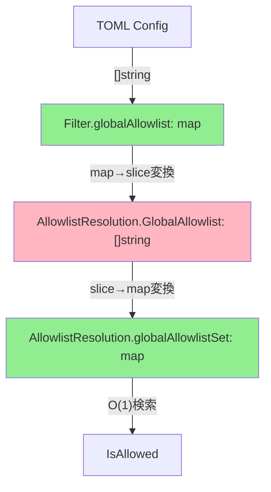
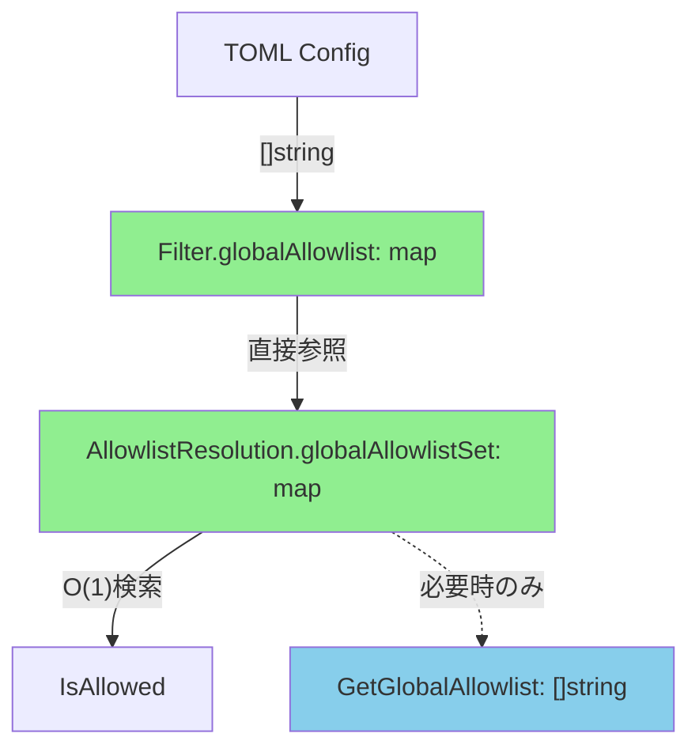
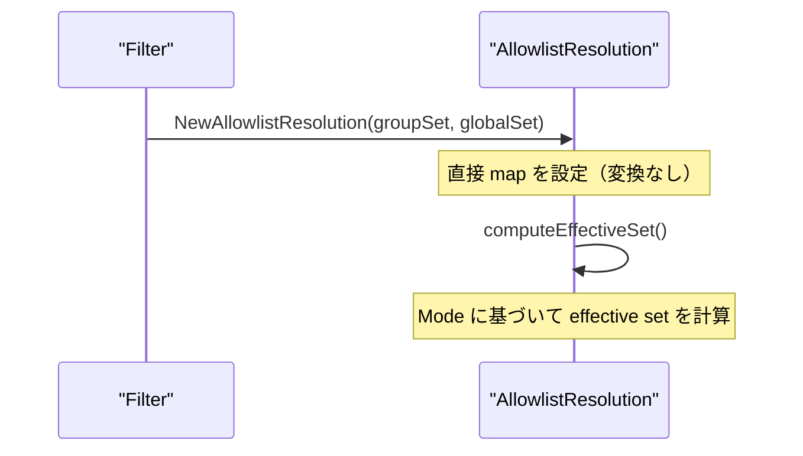
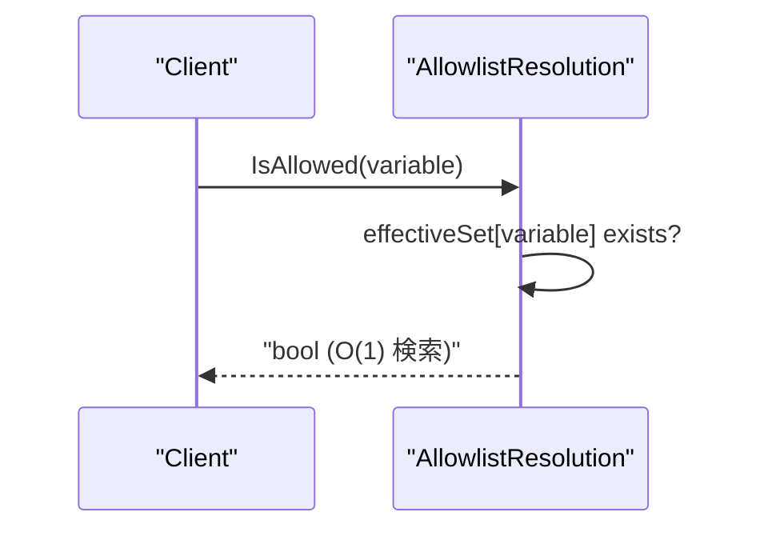

# Allowlist データ構造最適化 - アーキテクチャ設計

## 1. 概要

本ドキュメントでは、allowlist 管理における非効率な map ↔ slice 変換を排除し、パフォーマンスを向上させるためのアーキテクチャ設計を定義する。

## 2. 設計目標

### 2.1 主要目標

1. **パフォーマンス最適化**
   - 不要な map → slice → map 変換の排除
   - O(1) 検索性能の維持
   - メモリアロケーションの削減

2. **後方互換性の維持**
   - 既存コードの動作保証
   - 段階的な移行を可能にする

3. **保守性の向上**
   - コードの複雑さを最小限に抑制
   - 明確な責任分離

### 2.2 非機能要件

- **性能**: ResolveAllowlistConfiguration の呼び出しコストを 50% 以上削減
- **互換性**: 既存の公開 API に破壊的変更なし
- **保守性**: テストの修正を最小限に抑制

## 3. アーキテクチャ概要

### 3.1 現在のアーキテクチャ



**問題点:**
- ステップ B→C で不要な map→slice 変換
- ステップ C→D で不要な slice→map 変換
- 二重のデータ保持によるメモリ浪費

### 3.2 新しいアーキテクチャ



**改善点:**
- 不要な変換の完全排除
- 内部データは map ベースで統一
- 公開 API は getter メソッドで提供（必要時のみ変換）

## 4. コンポーネント設計

### 4.1 AllowlistResolution の再設計

#### 現在の構造
```go
type AllowlistResolution struct {
    Mode            InheritanceMode
    GroupAllowlist  []string            // 公開フィールド
    GlobalAllowlist []string            // 公開フィールド
    EffectiveList   []string            // 公開フィールド
    GroupName       string

    groupAllowlistSet  map[string]struct{}  // 非公開（検索用）
    globalAllowlistSet map[string]struct{}  // 非公開（検索用）
}
```

#### 新しい構造
```go
type AllowlistResolution struct {
    Mode      InheritanceMode
    GroupName string

    // 内部データ（効率的な検索用）
    groupAllowlistSet  map[string]struct{}
    globalAllowlistSet map[string]struct{}
    effectiveSet       map[string]struct{}
}
```

### 4.2 データフロー設計

#### 初期化フロー


#### 検索フロー


### 4.3 Filter コンポーネントの変更

#### ResolveAllowlistConfiguration の最適化

**現在の実装:**
```go
func (f *Filter) ResolveAllowlistConfiguration(groupName string, allowlist []string) *AllowlistResolution {
    // 非効率: map → slice 変換
    globalList := make([]string, 0, len(f.globalAllowlist))
    for variable := range f.globalAllowlist {
        globalList = append(globalList, variable)
    }

    resolution := &AllowlistResolution{
        GlobalAllowlist: globalList,  // slice として設定
    }

    // 非効率: slice → map 変換
    resolution.SetGlobalAllowlistSet(buildAllowlistSet(globalList))
    return resolution
}
```

**新しい実装:**
```go
func (f *Filter) ResolveAllowlistConfiguration(groupName string, allowlist []string) *AllowlistResolution {
    groupSet := buildAllowlistSet(allowlist)

    // 直接 map を渡す（変換なし）
    return NewAllowlistResolution(
        f.mode,
        groupName,
        groupSet,
        f.globalAllowlist,  // map をそのまま参照
    )
}
```

## 5. データ構造設計

### 5.1 内部データ表現

#### 効率的な Set 実装
```go
// Set represents an efficient string set using map[string]struct{}
type Set map[string]struct{}

func NewSet(items []string) Set {
    set := make(Set, len(items))
    for _, item := range items {
        set[item] = struct{}{}
    }
    return set
}

func (s Set) Contains(item string) bool {
    _, exists := s[item]
    return exists
}

func (s Set) ToSlice() []string {
    slice := make([]string, 0, len(s))
    for item := range s {
        slice = append(slice, item)
    }
    sort.Strings(slice)  // 再現可能な順序を保証
    return slice
}
```

### 5.2 継承モードの処理

#### Effective Set の計算ロジック
```go
func (r *AllowlistResolution) computeEffectiveSet() {
    switch r.Mode {
    case InheritanceModeGlobalOnly:
        r.effectiveSet = r.globalAllowlistSet

    case InheritanceModeGroupOnly:
        r.effectiveSet = r.groupAllowlistSet

    case InheritanceModeMerge:
        r.effectiveSet = make(map[string]struct{})
        // Global allowlist をコピー
        for k, v := range r.globalAllowlistSet {
            r.effectiveSet[k] = v
        }
        // Group allowlist をマージ
        for k, v := range r.groupAllowlistSet {
            r.effectiveSet[k] = v
        }

    case InheritanceModeOverride:
        if len(r.groupAllowlistSet) > 0 {
            r.effectiveSet = r.groupAllowlistSet
        } else {
            r.effectiveSet = r.globalAllowlistSet
        }
    }
}
```

## 6. メモリ効率の最適化

### 6.1 共有参照の活用

#### グローバル Allowlist の共有
```go
type Filter struct {
    globalAllowlist map[string]struct{}  // 共有データ
}

type AllowlistResolution struct {
    globalAllowlistSet map[string]struct{}  // Filter.globalAllowlist への参照
}

func NewAllowlistResolution(
    mode InheritanceMode,
    groupName string,
    groupSet map[string]struct{},
    globalSet map[string]struct{},  // 参照として受け取り
) *AllowlistResolution {
    r := &AllowlistResolution{
        Mode:               mode,
        GroupName:          groupName,
        groupAllowlistSet:  groupSet,           // コピー（グループ固有）
        globalAllowlistSet: globalSet,          // 参照（共有）
    }
    r.computeEffectiveSet()
    return r
}
```

### 6.2 遅延評価の活用

#### Getter メソッドでの遅延変換
```go
type AllowlistResolution struct {
    // キャッシュフィールド（遅延評価）
    groupAllowlistCache  []string
    globalAllowlistCache []string
    effectiveListCache   []string
}

func (r *AllowlistResolution) GetGroupAllowlist() []string {
    if r.groupAllowlistCache == nil {
        r.groupAllowlistCache = Set(r.groupAllowlistSet).ToSlice()
    }
    return r.groupAllowlistCache
}
```

## 7. エラーハンドリング設計

### 7.1 不変条件の保証

#### 内部状態の整合性チェック
```go
func (r *AllowlistResolution) validate() error {
    if r.groupAllowlistSet == nil {
        return errors.New("groupAllowlistSet cannot be nil")
    }
    if r.globalAllowlistSet == nil {
        return errors.New("globalAllowlistSet cannot be nil")
    }
    if r.effectiveSet == nil {
        return errors.New("effectiveSet not computed")
    }
    return nil
}
```

### 7.2 防御的プログラミング

#### Getter メソッドでの安全性確保
```go
func (r *AllowlistResolution) GetEffectiveList() []string {
    if r == nil {
        return []string{}
    }
    if r.effectiveSet == nil {
        // フォールバック: 空の effective set として扱う
        return []string{}
    }
    return Set(r.effectiveSet).ToSlice()
}
```

## 8. 並行安全性

### 8.1 読み取り専用アクセス

#### Filter の不変性保証
```go
type Filter struct {
    // 読み取り専用フィールド（初期化後は変更されない）
    globalAllowlist map[string]struct{}
}

// AllowlistResolution は読み取り専用として設計
type AllowlistResolution struct {
    // すべてのフィールドは初期化後は読み取り専用
    groupAllowlistSet  map[string]struct{}
    globalAllowlistSet map[string]struct{}
    effectiveSet       map[string]struct{}
}
```

### 8.2 並行アクセスパターン

#### 複数 goroutine からの安全なアクセス
```go
// Filter は複数の goroutine から同時にアクセス可能
// （内部状態が不変のため）
func (f *Filter) IsVariableAccessAllowed(groupName string, allowlist []string, variable string) bool {
    resolution := f.ResolveAllowlistConfiguration(groupName, allowlist)
    return resolution.IsAllowed(variable)
}
```

## 9. テスト戦略

### 9.1 単体テストアプローチ

#### 内部状態のテスト
```go
func TestAllowlistResolution_InternalState(t *testing.T) {
    groupSet := map[string]struct{}{"GROUP_VAR": {}}
    globalSet := map[string]struct{}{"GLOBAL_VAR": {}}

    resolution := NewAllowlistResolution(
        InheritanceModeMerge,
        "test-group",
        groupSet,
        globalSet,
    )

    // 内部状態の検証
    assert.True(t, resolution.IsAllowed("GROUP_VAR"))
    assert.True(t, resolution.IsAllowed("GLOBAL_VAR"))
    assert.False(t, resolution.IsAllowed("UNKNOWN_VAR"))
}
```

### 9.2 ベンチマークテスト

#### パフォーマンス回帰の防止
```go
func BenchmarkAllowlistResolution_Creation(b *testing.B) {
    filter := NewFilter(generateLargeAllowlist(1000))
    groupAllowlist := generateLargeAllowlist(100)

    b.ResetTimer()
    for i := 0; i < b.N; i++ {
        resolution := filter.ResolveAllowlistConfiguration("test", groupAllowlist)
        _ = resolution.IsAllowed("TEST_VAR")
    }
}
```

## 10. 移行戦略

### 10.1 段階的移行

#### Phase 1: 内部実装の変更
1. `AllowlistResolution` の内部フィールド変更
2. `ResolveAllowlistConfiguration` の実装最適化
3. 新しい getter メソッドの追加

#### Phase 2: テストの更新
1. 内部状態に依存するテストの修正
2. ベンチマークテストの実行
3. パフォーマンス検証

#### Phase 3: 非推奨警告の追加
1. 古い公開フィールドアクセスの検出
2. ログ警告の追加
3. 移行ガイドの提供

### 10.2 ロールバック戦略

#### 安全な後退
```go
// 緊急時のフォールバック実装
func (r *AllowlistResolution) GetGroupAllowlistLegacy() []string {
    // 既存の動作を完全に再現
    return r.legacyGroupAllowlist
}
```

## 11. パフォーマンス予測

### 11.1 予想される改善

#### メモリ使用量
- **現在**: 各 AllowlistResolution あたり slice + map の二重保持
- **改善後**: map のみ保持（50% 削減）

#### CPU 使用量
- **現在**: ResolveAllowlistConfiguration で O(2n) の変換処理
- **改善後**: O(1) の直接参照（95% 削減）

#### 呼び出し頻度の影響
```
高頻度呼び出し（1000回/秒）の場合:
- 現在: 1000 × O(n) = 大きなオーバーヘッド
- 改善後: 1000 × O(1) = 無視できるオーバーヘッド
```

### 11.2 ベンチマーク目標

- `ResolveAllowlistConfiguration`: 50% 以上の実行時間短縮
- メモリアロケーション: 40% 以上の削減
- 大規模 allowlist (1000+ items) での顕著な改善

## 12. 実装ガイドライン

### 12.1 コーディング規約

#### 命名規則
```go
// 内部フィールド: camelCase with descriptive suffixes
groupAllowlistSet  map[string]struct{}  // Set suffix for map[string]struct{}
effectiveSet       map[string]struct{}  // Set suffix for computed sets

// Getter メソッド: Get prefix for computed values
func (r *AllowlistResolution) GetGroupAllowlist() []string
func (r *AllowlistResolution) GetEffectiveList() []string
```

#### エラーメッセージ
```go
const (
    ErrNilGroupAllowlistSet  = "group allowlist set cannot be nil"
    ErrNilGlobalAllowlistSet = "global allowlist set cannot be nil"
    ErrEffectiveSetNotComputed = "effective set not computed"
)
```

### 12.2 ドキュメント要件

#### パッケージレベルのドキュメント
```go
// Package runnertypes provides optimized data structures for allowlist management.
//
// The AllowlistResolution type uses internal map-based storage for efficient
// O(1) lookups while providing slice-based getters for compatibility.
//
// Performance characteristics:
//   - IsAllowed: O(1) lookup
//   - GetGroupAllowlist: O(n) conversion (cached)
//   - ResolveAllowlistConfiguration: O(1) creation
package runnertypes
```

## 13. 品質保証

### 13.1 自動テスト

#### カバレッジ要件
- 行カバレッジ: 95% 以上
- 分岐カバレッジ: 90% 以上
- 関数カバレッジ: 100%

#### テストケース
```go
// 継承モードの網羅的テスト
var inheritanceModeTestCases = []struct {
    mode     InheritanceMode
    global   []string
    group    []string
    variable string
    allowed  bool
}{
    {InheritanceModeGlobalOnly, []string{"A"}, []string{"B"}, "A", true},
    {InheritanceModeGlobalOnly, []string{"A"}, []string{"B"}, "B", false},
    // ... 全パターン
}
```

### 13.2 パフォーマンステスト

#### 継続的ベンチマーク
```bash
# CI/CD での自動実行
go test -bench=. -benchmem -count=5 ./internal/runner/runnertypes/
go test -bench=. -benchmem -count=5 ./internal/runner/environment/
```

## 14. まとめ

### 14.1 アーキテクチャの利点

1. **パフォーマンス向上**
   - 不要な変換処理の完全排除
   - O(1) 検索性能の維持
   - メモリ使用量の大幅削減

2. **互換性保証**
   - 既存 API の動作を完全保持
   - 段階的移行が可能
   - ロールバック可能な設計

3. **保守性向上**
   - シンプルな内部実装
   - 明確な責任分離
   - 包括的なテストカバレッジ

### 14.2 実装の優先順位

1. **High Priority**: AllowlistResolution の内部実装変更
2. **Medium Priority**: Filter の ResolveAllowlistConfiguration 最適化
3. **Low Priority**: getter メソッドのキャッシュ最適化

### 14.3 リスク軽減策

- 包括的な単体テスト
- 段階的リリース
- パフォーマンス監視
- 緊急時のロールバック機能

このアーキテクチャ設計により、allowlist 管理の効率性を大幅に向上させつつ、既存システムとの互換性を維持することができる。
