# アーキテクチャ設計書: 内部変数とプロセス環境変数の分離

## 1. アーキテクチャ概要

### 1.1 設計目標
本アーキテクチャは、TOML設定ファイルにおける変数管理の課題を解決するため、以下の分離アーキテクチャを採用します：

- **内部変数レイヤー**: TOML展開専用の変数管理
- **プロセス環境変数レイヤー**: 子プロセス実行時の環境変数管理
- **セキュリティレイヤー**: システム環境変数へのアクセス制御

### 1.2 アーキテクチャ原則

1. **明示的な分離**: 内部変数とプロセス環境変数の明確な分離
2. **最小権限の原則**: システム環境変数への最小限のアクセス
3. **段階的展開**: 設定読み込み時の一回限りの変数展開
4. **階層的継承**: Global → Group → Command の階層的設定継承

## 2. システム全体アーキテクチャ

### 2.1 システム構成図

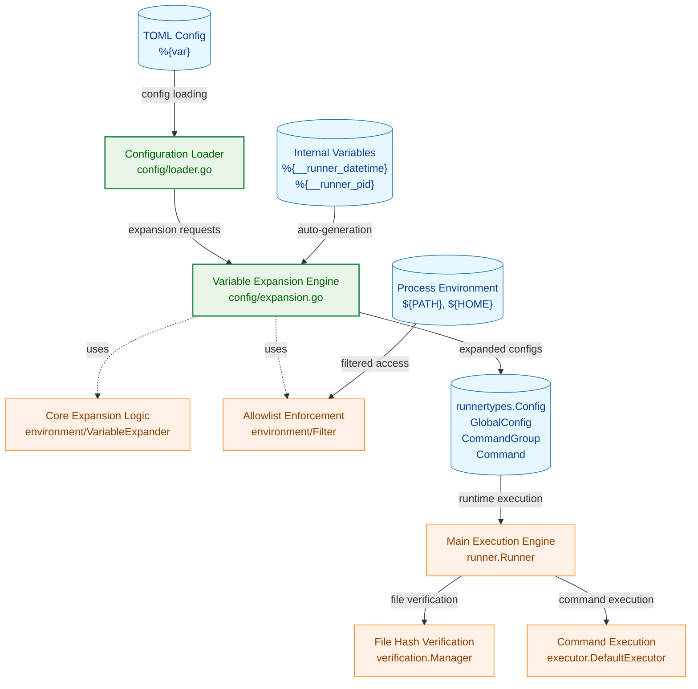

**凡例（Legend）**

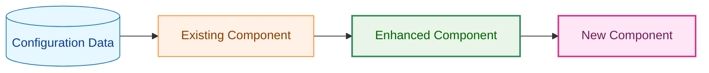

## 3. 変数展開アーキテクチャ

### 3.1 設定読み込み時の変数展開フロー

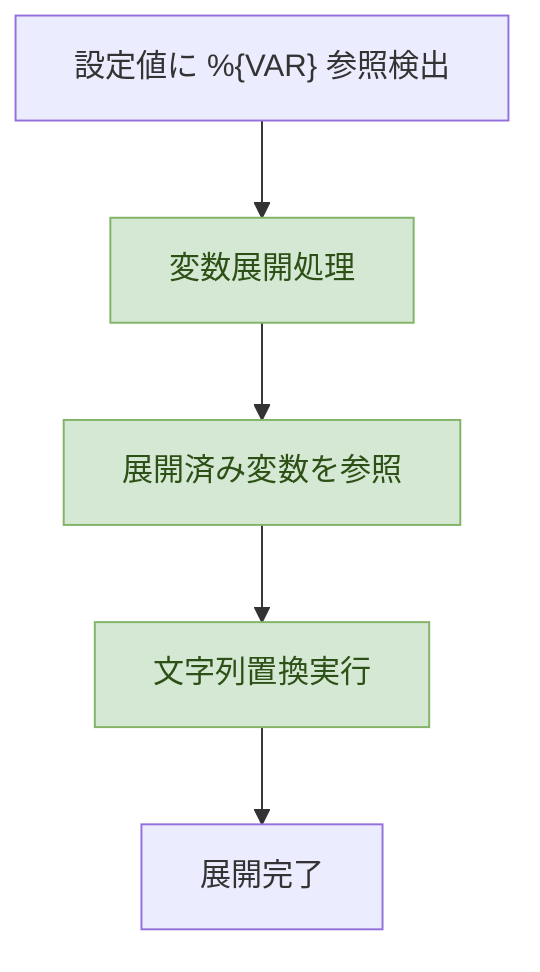

**重要**: 変数展開は階層的に処理されます:
1. **Global.vars** → Global.from_env で取り込んだ環境変数を参照可能
2. **Group.vars** → Global.vars と Group.from_env で取り込んだ環境変数を参照可能
3. **Command.vars** → Global.vars、Group.vars、Command.from_env で取り込んだ環境変数を参照可能

この処理順序により、`PATH=/custom:%{path}` のような参照も自然に解決されます（`%{path}` は既に確定済みの値を参照）。

**注記**: `$` 記法は廃止されており、`${VAR}` は単純なリテラル文字列として処理されます。特別な展開処理は行われません。

補足（参照制約の明文化）:
- `env` フィールドは内部変数（%{VAR}）のみ参照可能です。`env` 自体を他フィールド（cmd/args/verify_files/vars）から参照することはできません。
- `verify_files` は内部変数（%{VAR}）のみ参照可能で、`env` の値は参照できません。

### 3.2 allowlistチェックフロー（from_env参照時）

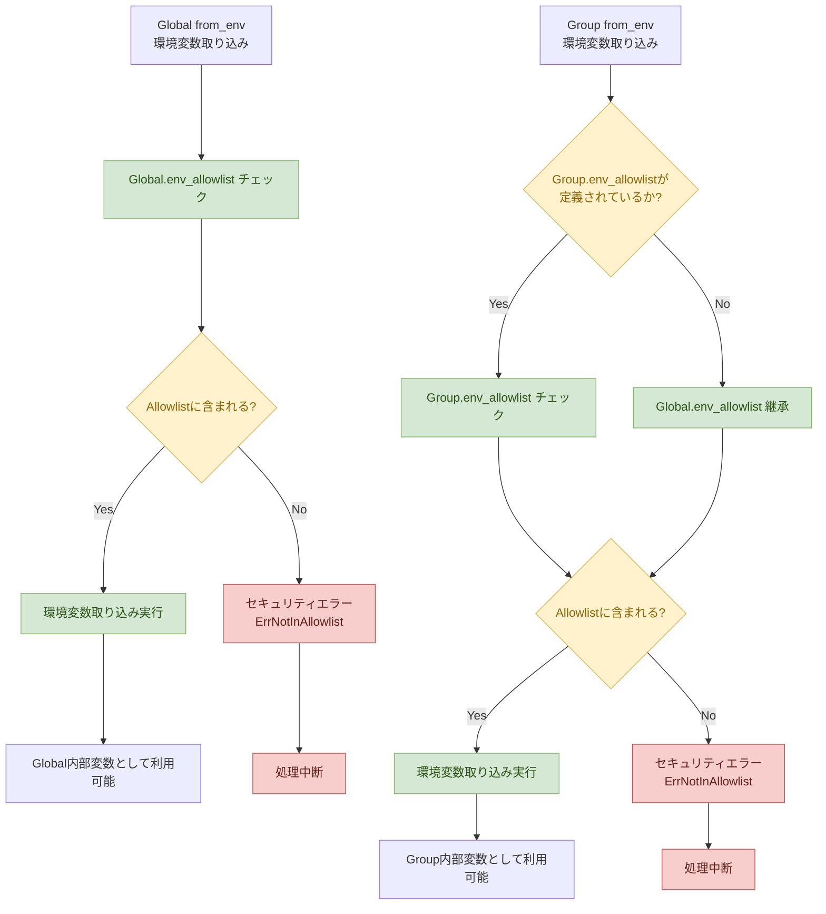

## 4. データフローアーキテクチャ

### 4.1 設定読み込みフロー

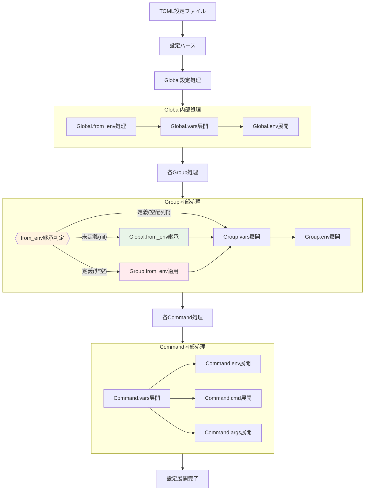

### 4.2 実行時環境変数構築フロー

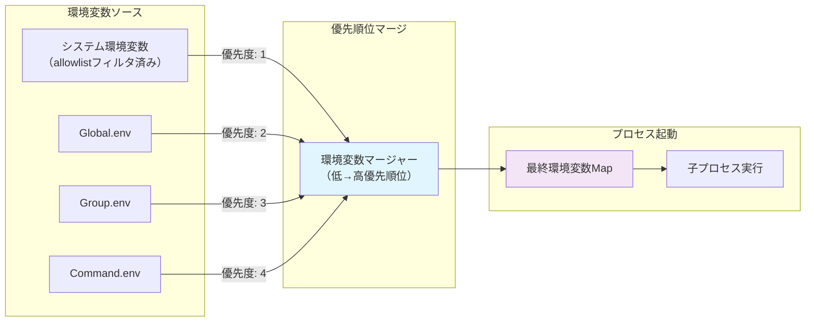

### 4.3 階層的なPATH拡張の処理フロー例

**シナリオ**: システムPATHに段階的にディレクトリを追加する

```toml
[global]
env_allowlist = ["PATH"]
from_env = ["system_path=PATH"]
vars = ["path_level1=%{system_path}"]
env = ["PATH=/custom/bin:%{system_path}"]

[[groups]]
vars = ["path_level2=/custom/bin:%{system_path}"]
env = ["PATH=/group/bin:%{path_level2}"]

[[groups.commands]]
env = ["PATH=/cmd/bin:%{path_level2}"]
```

**処理フロー**:

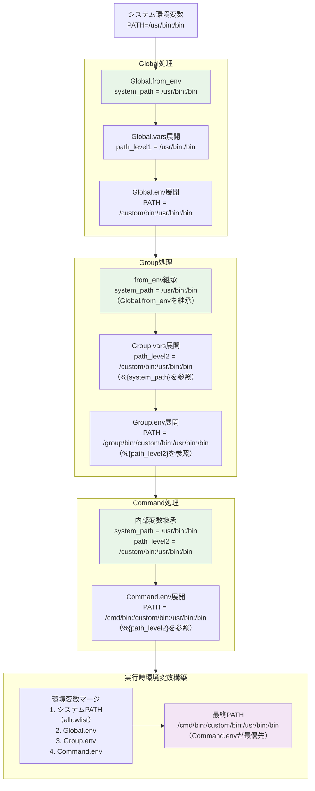

**ポイント**:
1. **from_env でシステム環境変数を取り込み**: `system_path=PATH` で `/usr/bin:/bin` を取得
2. **vars で段階的に構築**: `path_level2` で既存PATHに `/custom/bin` を追加
3. **env で最終的な環境変数を設定**: 各レベルで構築した内部変数を参照
4. **実行時にマージ**: Command.env が最優先で、最終的なPATH値が決定

補足（マージポリシーの前提）:
- システム環境変数は `env_allowlist` に含まれるもののみが候補となります。
- 優先度は低→高で上書き（SYS < Global.env < Group.env < Command.env）。
- `env` は内部変数（%{VAR}）のみ展開し、システム環境変数を直接参照しません。

## 5. セキュリティアーキテクチャ

### 5.1 セキュリティコンポーネント構成

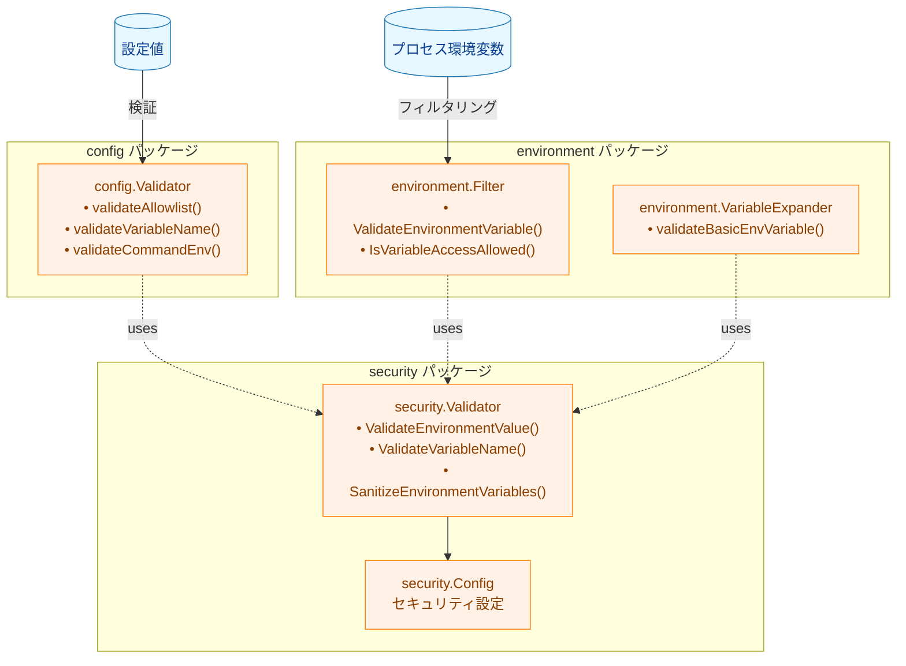

注記（パッケージ名について）:
- 本図の `environment/*` や `security/*` は概念上の区分を示します。実装上は本リポジトリの `internal/` 配下の実パッケージに対応付けて実装します（例: `internal/runner/config`, `internal/runner/environment`, `internal/runner/verification` など）。

### 5.2 セキュリティ検証の階層

1. **変数名検証** (`security.ValidateVariableName`)
   - POSIX準拠の変数名チェック
   - 危険なパターンの検出

2. **変数値検証** (`security.ValidateEnvironmentValue`)
   - コマンドインジェクションパターン検出
   - 危険な文字列の検証

3. **allowlist制御** (`environment.Filter`)
   - 環境変数アクセス制御
   - 継承モード処理

4. **機密情報サニタイズ** (`security.Validator.SanitizeEnvironmentVariables`)
   - 機密情報の自動検出・マスク
   - ログ出力時の安全性確保

5. **アクセス制御レイヤー**
   - システム環境変数への制限付きアクセス
   - from_env による明示的な取り込み
   - 内部変数の名前空間分離

6. **実行時保護レイヤー**
   - 子プロセスへの環境変数の最小限伝達
   - 意図しない変数漏洩の防止

## 6. 性能アーキテクチャ

### 6.1 展開処理の最適化

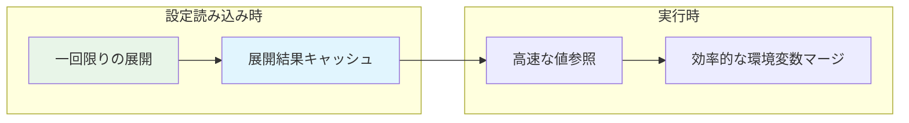

### 6.2 メモリ効率化戦略

1. **遅延評価**: 必要な時点での変数展開
2. **共有参照**: 同じ値の内部変数の参照共有
3. **階層キャッシュ**: レベル別の展開結果キャッシュ

### 6.3 Dry-Run デバッグ支援機能

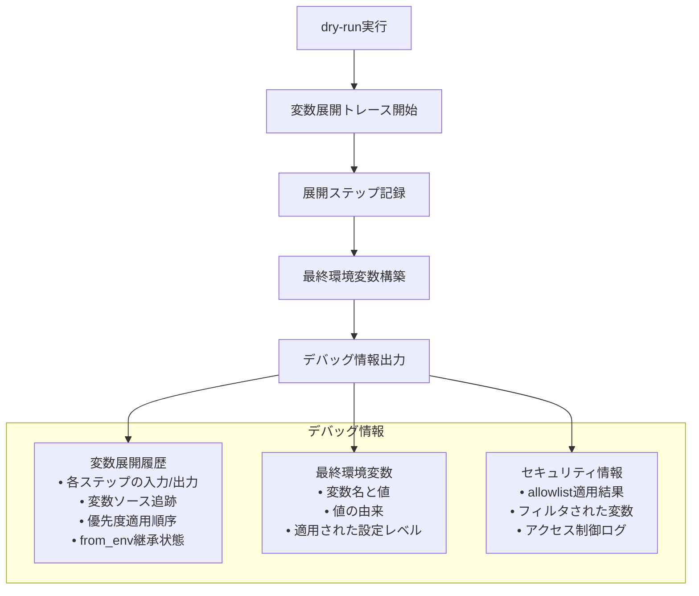

**デバッグ出力例（from_env継承情報を含む）**:
```
=== Variable Expansion Trace ===

[Global.from_env] Processing system environment variable import
  HOME: /home/user (allowed by global.env_allowlist)
  PATH: /usr/bin:/bin (allowed by global.env_allowlist)

[Global.vars] Expanding internal variables
  app_dir: %{HOME}/app → /home/user/app
  config_dir: %{app_dir}/config → /home/user/app/config

[Global.env] Expanding process environment variables
  PATH: /custom/bin:%{PATH} → /custom/bin:/usr/bin:/bin (source: from_env[PATH])

[Group "backup"] from_env inheritance decision
  ✓ from_env NOT defined → Inheriting Global.from_env (2 variables)
    HOME: /home/user (inherited from global)
    PATH: /usr/bin:/bin (inherited from global)

[Group "backup".vars] Expanding internal variables
  backup_dir: %{app_dir}/backups → /home/user/app/backups (source: global.vars)
  log_dir: %{backup_dir}/logs → /home/user/app/backups/logs

[Group "backup".env] Expanding process environment variables
  BACKUP_DIR: %{backup_dir} → /home/user/app/backups (source: group.vars)

[Group "custom"] from_env inheritance decision
  ✗ from_env DEFINED → Overriding Global.from_env (1 variable, global variables discarded)
    CUSTOM_VAR: /custom/path (allowed by group.env_allowlist)
  ⚠ Note: Global.from_env variables (HOME, PATH) are NOT available in this group

[Group "custom".vars] Expanding internal variables
  custom_path: %{CUSTOM_VAR}/data → /custom/path/data (source: group.from_env)
  # HOME is NOT available here (Global.from_env was overridden)

[Command "backup_task"] Inheriting variables
  From Global: app_dir, config_dir
  From Group: backup_dir, log_dir, HOME, PATH (from_env inherited)

[Command "backup_task".env] Expanding process environment variables
  LOG_FILE: %{log_dir}/app.log → /home/user/app/backups/logs/app.log (expansion: 3 steps)

=== Final Environment Variables ===
HOME=/home/user (source: system, filtered: global.env_allowlist)
PATH=/custom/bin:/usr/bin:/bin (source: global.env, expansion: from_env)
BACKUP_DIR=/home/user/app/backups (source: group.env, expansion: group.vars)
LOG_FILE=/home/user/app/backups/logs/app.log (source: command.env, expansion: 3 steps)

=== from_env Inheritance Summary ===
Global: 2 variables (HOME, PATH)
Group "backup": inherited global (2 variables)
Group "custom": overridden (1 variable: CUSTOM_VAR), global discarded
```

**デバッグ出力のポイント**:
1. **from_env継承判定の明示**: 各グループでfrom_envが定義されているか、継承されているかを明確に表示
2. **継承時の変数リスト**: 継承された変数の一覧と値を表示
3. **上書き時の警告**: Global.from_envが上書きされた場合、どの変数が使用不可になるかを警告
4. **変数ソースの追跡**: 各変数がどのレベル（global/group/command）のどのフィールド（from_env/vars/env）から来たかを表示
5. **展開チェーンの可視化**: 複数ステップの展開がある場合、その過程を表示

数値目標（非機能要件の反映）:
- 変数1個あたりの展開時間: 1ms以下を目標
- 設定読み込み時間の増加: 既存比 +10%以内
- メモリ使用量の増加: 変数定義総量の2倍以内
- 展開の最大ネスト深度: 10レベル程度を上限とし、無限ループ防止のため反復上限は15回

## 7. エラーハンドリング設計

### 7.1 エラー検出ポイント

| フェーズ | エラータイプ | 発生条件 | 対処法 |
|---------|------------|----------|--------|
| **設定読み込み** | `ConfigLoadError` | TOML構文エラー、必須フィールド不足 | プログラム終了 |
| **allowlist検証** | `AllowlistValidationError` | 不正な変数名、重複エントリ | プログラム終了 |
| **変数展開** | `VariableExpansionError` | 未定義変数、循環参照、allowlist違反 | プログラム終了 |
| **継承モード** | `InheritanceModeError` | 継承ルール矛盾 | 警告表示、デフォルト適用 |
| **型変換** | `TypeConversionError` | 不正なデータ型 | プログラム終了 |
| **検証** | `ValidationError` | 設定値範囲外、形式不正 | プログラム終了 |

### 7.2 エラー伝播戦略

1. **早期検出**: 設定読み込み時での全エラー検出
2. **コンテキスト保持**: エラー発生箇所の詳細情報保持
3. **段階的報告**: レベル別のエラー情報提供

## 8. 拡張性アーキテクチャ

### 8.1 統一実装設計

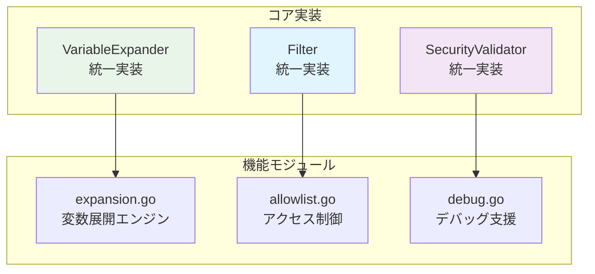

### 8.2 単一実装の利点

1. **シンプルさ**: 実装の複雑性を排除、保守性の向上
2. **統一性**: 一貫したAPIと動作、テストの簡素化
3. **性能**: 不要な抽象化を排除、直接的な実装
4. **デバッグ**: 統一されたログ出力、問題の特定容易

### 8.3 将来の拡張ポイント

1. **条件付き変数展開**: 実行時条件に基づく展開
2. **テンプレートエンジン**: より高度な文字列展開
3. **動的環境変数**: 実行時の動的変数変更
4. **監査ログ**: 変数アクセスの詳細ログ

## 9. 非機能要件の実現方式

### 9.1 性能要件の実現

- **展開処理性能**: O(n)での線形展開、visited mapによる循環検出
- **メモリ効率**: 展開済み変数の適切なキャッシュ、不要なコピーの回避
- **スケーラビリティ**: ハッシュマップベースの高速検索、階層的な変数管理

### 9.2 信頼性要件の実現

- **エラーハンドリング**: 包括的なバリデーション、詳細なエラーメッセージ
- **デバッグサポート**: 構造化ログ、変数展開の追跡機能
- **設定検証**: 設定読み込み時の完全性チェック

### 9.3 セキュリティ要件の実現

- **アクセス制御**: allowlistベースの厳格な制御
- **情報漏洩防止**: 明示的な環境変数設定、デフォルトでの非公開
- **監査証跡**: セキュリティ関連操作のログ記録

## 10. 実装ガイダンス

### 10.1 実装優先順位

1. **Phase 1**: コアデータ構造とパーサー
2. **Phase 2**: 基本的な変数展開機能
3. **Phase 3**: セキュリティ機能とバリデーション
4. **Phase 4**: エラーハンドリングと診断機能
5. **Phase 5**: 性能最適化と拡張機能

### 10.2 重要な設計判断

1. **継承方式**: Override方式の採用（Union方式ではない）
2. **展開タイミング**: 設定読み込み時の一回限り実行
3. **変数構文**: %{VAR}への統一（${VAR}の廃止）
4. **セキュリティモデル**: ホワイトリストベースの厳格な制御

### 10.3 エスケープ仕様

以下のエスケープのみをサポートします（他の `\x` 形式はエラー）:
- `\%` → `%` （%{...} の展開抑止に使用）
- `\\` → `\`

適用対象: `vars`, `env`, `cmd`, `args`, `verify_files` の各フィールドの文字列展開時。

### 10.4 テスト戦略

1. **単体テスト**: 各コンポーネントの独立テスト
2. **統合テスト**: コンポーネント間の相互作用テスト
3. **セキュリティテスト**: 攻撃シナリオに対する耐性テスト
4. **性能テスト**: スケーラビリティとレスポンス性能の検証

## 11. 実装後ドキュメント更新戦略

### 11.1 更新対象ドキュメントの特定

#### 11.1.1 ユーザー向けドキュメント（高優先度）

| ドキュメント | 更新内容 | 理由 |
|------------|----------|------|
| **docs/user/toml_config/** | `vars`, `from_env` フィールドの追加説明 | 新機能の利用方法 |
| **docs/user/README.md** | 変数システムの概要説明 | ユーザー理解促進 |
| **sample/*.toml** | `vars`, `from_env` の実用例追加 | 実践的な利用例提供 |

#### 11.1.2 開発者向けドキュメント（中優先度）

| ドキュメント | 更新内容 | 理由 |
|------------|----------|------|
| **docs/dev/design-implementation-overview.md** | 変数展開システムの技術解説 | 実装理解支援 |
| **docs/dev/config-inheritance-behavior.ja.md** | 変数継承ルールの詳細 | 動作仕様明確化 |
| **CHANGELOG.md** | 機能追加の記録 | 変更履歴管理 |

#### 11.1.3 API・設定ドキュメント（低優先度）

| ドキュメント | 更新内容 | 理由 |
|------------|----------|------|
| **docs/user/toml_config/04_global_level.md** | Global.vars, Global.from_env 仕様 | 詳細設定説明 |
| **docs/user/toml_config/05_group_level.md** | Group.vars, Group.from_env 仕様 | 詳細設定説明 |

### 11.2 更新内容の詳細

#### 11.2.1 新機能説明

**追加する説明項目**:
1. **内部変数システム** (`%{VAR}` 記法)
   - 基本概念と利点
   - プロセス環境変数との違い
   - 使用例とベストプラクティス

2. **from_env メカニズム**
   - システム環境変数の安全な取り込み
   - allowlist との関係
   - 継承動作の詳細

3. **階層的変数参照**
   - 変数展開の処理順序（Global → Group → Command）
   - 上位レベルの変数を下位レベルで参照する方法
   - PATH拡張パターンなどの実用例

#### 11.2.2 移行ガイド

**`$` 記法廃止に関する説明**:
- 既存の `${VAR}` はリテラル文字列として処理
- `%{VAR}` への移行推奨
- 互換性に関する注意点

#### 11.2.3 デバッグ・運用情報

**dry-runでの変数デバッグ**:
- 展開トレースの見方
- 問題診断方法
- ログ出力の解釈

### 11.3 更新スケジュール

| フェーズ | タイミング | 対象 |
|---------|-----------|------|
| **Phase 1** | 実装完了直後 | sample/*.toml, 基本的なREADME更新 |
| **Phase 2** | テスト完了後 | ユーザー向けドキュメント全般 |
| **Phase 3** | リリース前 | CHANGELOG, 開発者向けドキュメント |
| **Phase 4** | リリース後 | 詳細API仕様、トラブルシューティング |

### 11.4 品質保証

1. **ドキュメント検証**
   - サンプルコードの動作確認
   - 内部リンクの整合性チェック
   - 用語の統一性確認

2. **ユーザビリティテスト**
   - 新規ユーザーによる理解度確認
   - 既存ユーザーの移行容易性検証

3. **保守性確保**
   - ドキュメント生成の自動化検討
   - 実装変更時の更新フロー確立
