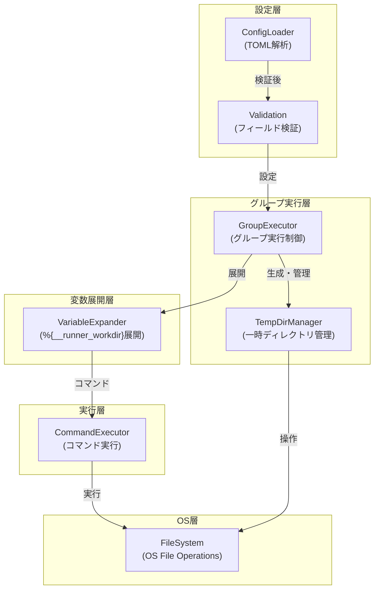
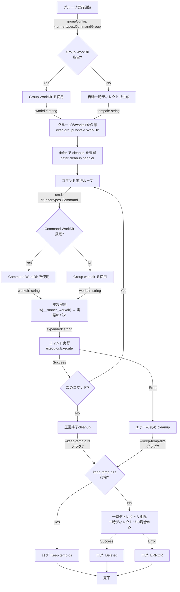
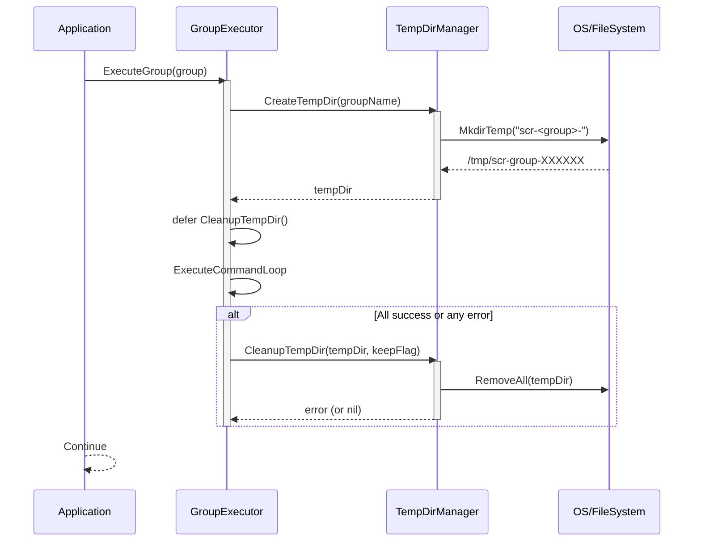
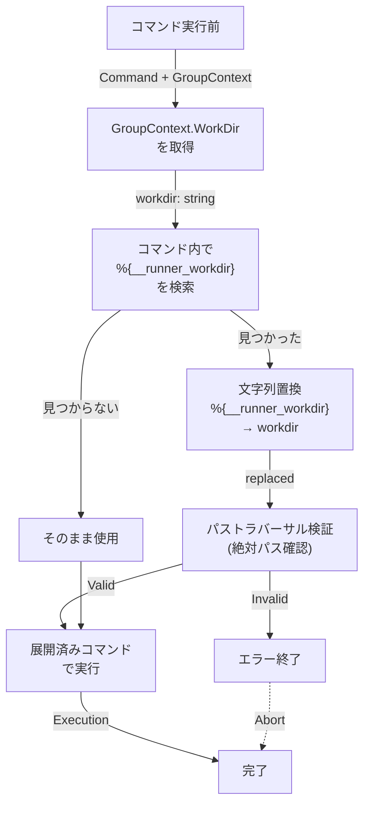
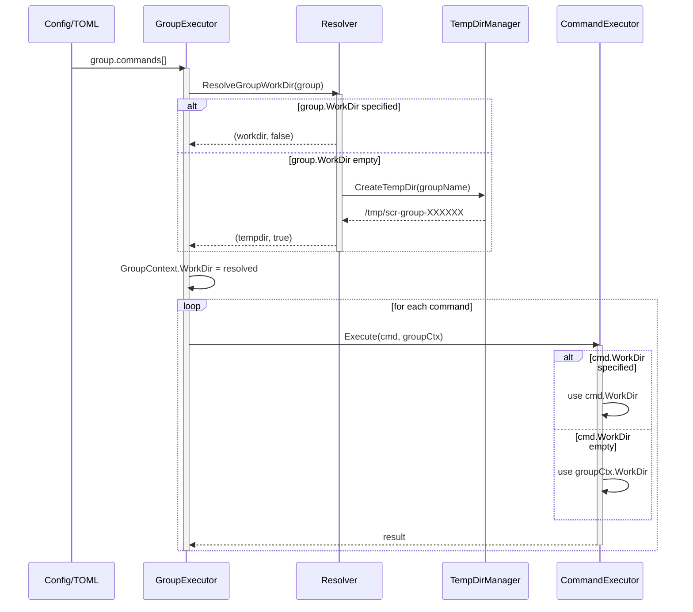
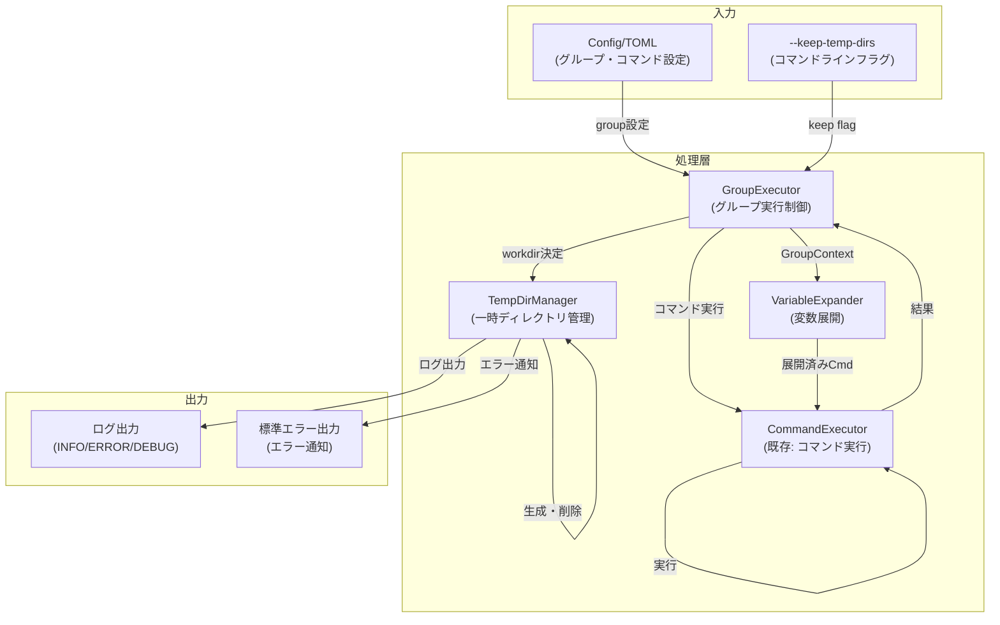
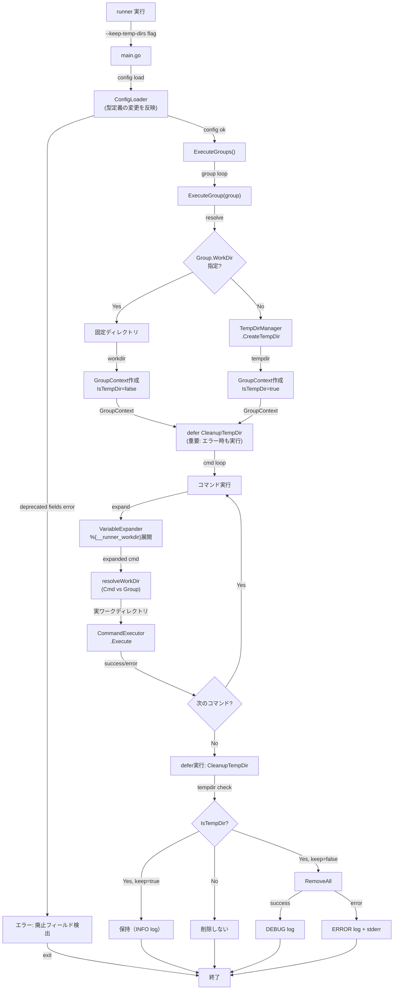

# アーキテクチャ設計書: 作業ディレクトリ仕様の再設計

## 1. 概要

本ドキュメントは、タスク0034「作業ディレクトリ仕様の再設計」のハイレベルなアーキテクチャ設計を記述します。

### ドキュメント体系

本タスクは3つのドキュメントで構成されます：

| ドキュメント | 内容 | 対象者 |
|----------|------|------|
| **01_requirements.md** | 要件定義書：ビジネス要件、機能要件、テスト要件 | PM、QA、開発全体 |
| **02_architecture.md** (本文) | アーキテクチャ設計書：ハイレベルな設計、図式、パターン、全体フロー | 設計者、シニア開発者 |
| **03_specification.md** | 詳細仕様書：インターフェース、API、コード例、エラーハンドリング | 実装者 |

本タスクは、複雑な3階層のワークディレクトリ設定を、シンプルな2階層に簡素化し、デフォルトで安全な一時ディレクトリ方式を採用することで、セキュリティと利便性を同時に実現します。

### 1.1 設計の目標

- **セキュリティの向上**: デフォルトで一時ディレクトリを使用し、機密情報の残留リスクを低減
- **設定の簡素化**: グローバルレベル設定を削除し、優先順位の階層を2段階に統一
- **命名の統一**: `dir` と `workdir` の不統一を解消
- **ユーザビリティの向上**: `%{__runner_workdir}` 予約変数でパスアクセスを簡素化
- **信頼性**: エラー時も確実にリソースのクリーンアップを実施する Fail-Safe 原則

### 1.2 設計の原則

1. **Separation of Concerns**: 一時ディレクトリ管理と設定管理を分離し、各コンポーネントが単一責務を持つ
2. **Fail-Safe**: `defer` パターンでエラー時も確実にリソースのクリーンアップを実施
3. **Security First**: セキュリティを優先し、デフォルト動作は常に安全側を選択
4. **Explicit is Better than Implicit**: 一時ディレクトリの利用を明示的に把握可能にする（ログ出力）
5. **YAGNI**: 不要な機能は追加しない。実装スコープは要件に基づく

## 2. 現状分析

### 2.1 現在の構造

```
作業ディレクトリ設定（3階層）
│
├─ グローバルレベル: Global.WorkDir (デフォルト: /tmp)
├─ グループレベル:
│  ├─ TempDir (bool) - true時に自動一時ディレクトリ生成
│  └─ WorkDir - 固定ディレクトリ
└─ コマンドレベル: Command.Dir

優先順位:
  Command.Dir (優先度1)
  → Group.TempDir=true (優先度2)
  → Group.WorkDir (優先度3)
  → Global.WorkDir (優先度4)
  → カレントディレクトリ (優先度5)
```

### 2.2 現在の問題点

| 問題 | 影響 | 深刻度 |
|-----|------|-------|
| 3階層の設定が複雑 | ユーザーが優先順位を理解しづらい | 中 |
| `temp_dir` フラグが必須 | デフォルトで永続ディレクトリが使用される | 高 |
| 命名が不統一 | `dir` vs `workdir` の混在 | 中 |
| グローバル設定の必要性が低い | グループごとに設定できるため冗長 | 低 |

## 3. 新アーキテクチャ

### 3.1 簡素化された構造

```
作業ディレクトリ設定（2階層）
│
├─ グループレベル: Group.WorkDir
│  ├─ 指定: 固定ディレクトリを使用
│  └─ 未指定: 自動一時ディレクトリ生成（推奨デフォルト）
│
└─ コマンドレベル: Command.WorkDir
   ├─ 指定: そのディレクトリを使用
   └─ 未指定: グループの設定を継承

優先順位 (シンプル化):
  1. Command.WorkDir
  2. Group.WorkDir
  3. 自動生成一時ディレクトリ
```

### 3.2 コンポーネント図



### 3.3 フローチャート

#### グループ実行のライフサイクル



#### 変数展開プロセス

```mermaid
flowchart LR
    Input["コマンド設定"]
    Input -->|args, cmd, workdir| HasVariable{%{__runner_workdir}<br/>を含む?}

    HasVariable -->|Yes| GetWorkDirPath["GroupContext から<br/>WorkDir パスを取得"]
    HasVariable -->|No| NoExpansion["展開せず使用"]

    GetWorkDirPath -->|workdir: string| ReplaceVariable["すべての<br/>%{__runner_workdir}<br/>を置換"]

    ReplaceVariable -->|expanded| ResolveAbsPath["絶対パス化<br/>filepath.Abs"]

    ResolveAbsPath -->|absolute| ValidatePath["パス検証<br/>(トラバーサル検査)"]

    ValidatePath -->|Valid| Output["展開済みコマンド"]
    ValidatePath -->|Invalid| Error["エラー: Invalid path"]

    NoExpansion --> Output
    Error -.->|error| End["エラー終了"]
    Output --> End
```

## 4. データモデル

### 4.1 設定型の変更方針

本タスクでは、以下の設定型の変更を行う：

**削除対象**:
- `GlobalConfig.WorkDir`: グローバルレベルでのデフォルトディレクトリ設定
- `CommandGroup.TempDir`: グループレベルでの一時ディレクトリフラグ

**名称変更**:
- `Command.Dir` → `Command.WorkDir`: コマンドレベルのワークディレクトリ指定

これにより、TOML 設定ファイルで既にこれらのフィールドを使用している場合は、パーサーレベルで「未知フィールド」エラーが発生し、ユーザーに明確な移行メッセージを促す。

### 4.2 実行時コンテキスト

グループ実行時に以下の情報を保持するコンテキストを導入：

| フィールド | 型 | 用途 |
|----------|-----|------|
| `GroupName` | `string` | グループの識別、ログ出力 |
| `WorkDir` | `string` | 実際に使用されるワークディレクトリ（絶対パス） |
| `IsTempDir` | `bool` | 一時ディレクトリ（true）か固定ディレクトリ（false）かの区別 |
| `TempDirPath` | `string` | 一時ディレクトリの場合のパス（クリーンアップ用） |
| `KeepTempDirs` | `bool` | `--keep-temp-dirs` フラグの値 |

このコンテキストは、グループ実行を通して各コマンド実行に渡され、ワークディレクトリの決定と変数展開に使用される。

## 5. 一時ディレクトリ管理

### 5.1 TempDirManager の責務

一時ディレクトリ管理を専門とするコンポーネント `TempDirManager` を導入する。

**責務**:
- グループごとの一時ディレクトリ生成（`scr-<groupName>-XXXXXX` 形式）
- パーミッション管理（0700: 所有者のみアクセス可能）
- 一時ディレクトリの削除（エラー時も確実に実施）
- 削除失敗時のエラーハンドリング（ログ出力、標準エラー出力）

### 5.2 一時ディレクトリのライフサイクル



**ポイント**:
1. グループ実行開始時に一時ディレクトリを生成（未指定の場合）
2. `defer` で削除処理を登録（エラー時も確実に実行）
3. コマンド実行中は同じディレクトリを共有
4. `--keep-temp-dirs` フラグで削除をスキップ可能
5. 削除失敗時もプロセスは継続（エラーハンドリング戦略）

### 5.3 命名規則

```
ディレクトリ名: scr-<groupName>-<randomSuffix>
例:
  /tmp/scr-backup-a1b2c3d4e5f6
  /tmp/scr-build-f7g8h9i0j1k2
  /tmp/scr-deploy-l3m4n5o6p7q8

プレフィックス "scr-" は以下の目的：
- コマンド実行でのディレクトリ作成と明確に区別
- 削除時に一時ディレクトリと固定ディレクトリを区別
```

## 6. 変数展開機構

### 6.1 `%{__runner_workdir}` 予約変数

グループのワークディレクトリにアクセスするための予約変数を導入する：

| 項目 | 値 |
|-----|-----|
| 変数名 | `%{__runner_workdir}` |
| スコープ | グループ内のすべてのコマンド（コマンドレベル） |
| 値 | グループのワークディレクトリの絶対パス |
| 命名規則 | `__runner_` プレフィックスは予約（Task 0033で定義） |

**値の決定ロジック**:
- `Group.WorkDir` が指定 → その値を使用
- `Group.WorkDir` が未指定 → 自動生成された一時ディレクトリのパスを使用

### 6.2 VariableExpander コンポーネント

変数展開を担当する専門のコンポーネントを導入する。

**責務**:
- コマンド文字列内の `%{__runner_workdir}` を実際のパスに置換
- 置換後の文字列を絶対パス化
- パストラバーサル攻撃を防ぐためのパス検証

**対象フィールド**:
- `Command.Cmd`: コマンド実行ファイルパス
- `Command.Args`: コマンド引数（複数）
- `Command.WorkDir`: ワークディレクトリ

### 6.3 展開の流れ



### 6.4 例

**グループ "backup" で一時ディレクトリを使用**:
```toml
[[groups]]
name = "backup"

[[groups.commands]]
name = "dump"
cmd = "pg_dump"
args = ["mydb", "-f", "%{__runner_workdir}/dump.sql"]
```

実行時に:
- `GroupContext.WorkDir` = `/tmp/scr-backup-a1b2c3d4`
- `args[1]` = `"%{__runner_workdir}/dump.sql"` → `/tmp/scr-backup-a1b2c3d4/dump.sql`

**グループ "build" で固定ディレクトリを使用**:
```toml
[[groups]]
name = "build"
workdir = "/opt/project"

[[groups.commands]]
name = "checkout"
cmd = "git"
args = ["clone", "https://github.com/example/repo.git", "%{__runner_workdir}/project"]
```

実行時に:
- `GroupContext.WorkDir` = `/opt/project`
- `args[2]` = `"%{__runner_workdir}/project"` → `/opt/project/project`

## 7. ワークディレクトリ解決ロジック

### 7.1 優先順位と決定プロセス

ワークディレクトリは以下の優先順位で決定されます:

1. **コマンドレベル**: `Command.WorkDir` が指定されている場合、そのディレクトリを使用
2. **グループレベル**: `Group.WorkDir` が指定されている場合、そのディレクトリを使用
3. **自動一時ディレクトリ**: どちらも未指定の場合、自動生成された一時ディレクトリを使用

### 7.2 決定マトリックス

| Group.WorkDir | Command.WorkDir | 実際の動作 | 備考 |
|--------------|-----------------|----------|------|
| 未指定 | 未指定 | 自動一時ディレクトリ | デフォルト、最も安全 |
| 未指定 | `/opt/app` | `/opt/app` | コマンド特化ディレクトリ |
| `/var/data` | 未指定 | `/var/data` | グループ全体で固定 |
| `/var/data` | `/opt/app` | `/opt/app` | コマンドが優先 |

### 7.3 シーケンス図



## 8. コマンドラインオプション

### 8.1 `--keep-temp-dirs` フラグ

一時ディレクトリを削除せずに保持するオプション。デバッグ時やトラブルシューティングで一時ディレクトリ内のファイルを検査したい場合に使用される。

**定義**:
- **フラグ名**: `--keep-temp-dirs`
- **型**: ブール フラグ（boolean flag）
- **デフォルト**: `false`（一時ディレクトリ自動削除）
- **用途**: `runner --config config.toml --keep-temp-dirs`

**動作**:
- フラグなし → グループ実行終了後に一時ディレクトリを削除
- フラグあり → グループ実行終了後も一時ディレクトリを保持
- 固定ディレクトリ → フラグの値に関わらず削除しない

**ユースケース**:
```bash
# 通常実行
$ ./runner --config backup.toml
# グループ実行完了後、一時ディレクトリは自動削除

# デバッグ実行
$ ./runner --config backup.toml --keep-temp-dirs
# グループ実行完了後、一時ディレクトリは保持
$ ls -la /tmp/scr-backup-*/
$ cat /tmp/scr-backup-*/dump.sql
```

## 9. エラーハンドリング戦略

### 9.1 エラー分類と対応

| エラー | 原因例 | 処理 | グループ継続 | ログレベル |
|-------|-------|------|-----------|----------|
| 一時ディレクトリ生成失敗 | ディスク容量不足 | グループ実行中止 | ✗ | ERROR |
| 一時ディレクトリ削除失敗 | パーミッション不足 | ログ記録のみ | ✓ | ERROR + stderr |
| 変数展開エラー | パストラバーサル検出 | コマンド実行中止 | 設定依存 | ERROR |
| パス検証エラー | 相対パス指定 | エラーを返す | 設定依存 | ERROR |

### 9.2 削除失敗時の処理（重要）

一時ディレクトリの削除失敗は、**セキュリティリスク** になるため、特別な配慮が必要：

1. **必ず通知**: ERROR レベルログ + 標準エラー出力
2. **処理継続**: 削除失敗でもプロセスを中断しない
3. **パス明記**: ディレクトリパスをログに含める
4. **ユーザー対応**: ユーザーが手動で確認・削除可能にする

```
一時ディレクトリ削除エラー → ERROR ログ → 標準エラー出力
    └─ ユーザーが認識 → 手動確認・削除
```

### 9.3 Fail-Safe パターン

エラー時も確実にリソースのクリーンアップを実施するため、`defer` パターンを採用：

```
GroupExecutor.ExecuteGroup():
  1. ワークディレクトリを決定
  2. GroupContext を作成
  3. defer CleanupTempDir を登録 ← 重要: ここで登録
  4. コマンド実行ループ
     └─ エラー発生
  5. グループ実行終了
  6. defer が実行 ← ここでリソース削除（エラー時も実行）
```

**利点**:
- 成功時と失敗時の両方でクリーンアップが実行される
- 複数の異なる終了パスでも同じクリーンアップロジックが使われる
- コードの重複が少ない

## 10. セキュリティ考慮事項

### 10.1 一時ディレクトリのセキュリティ

**パーミッション管理**:
- 生成パーミッション: `0700`（所有者のみアクセス可能）
- OS の `os.MkdirTemp()` のデフォルト動作に依存
- 他のユーザーのアクセスは物理的に不可能

**確実な削除戦略**:
1. グループ実行終了時に必ず削除（`defer` で確保）
2. 成功時・失敗時の両方で削除
3. 削除失敗時はユーザーに通知（ERROR ログ + stderr）
4. ユーザーが手動対応可能にする

**ファイル残留リスクの低減**:
- デフォルトで一時ディレクトリ使用（改善前は `/tmp` 永続化）
- グループごとに独立したディレクトリ（グループ間の汚染なし）
- 自動削除でユーザー忘却の可能性を排除

### 10.2 パストラバーサル攻撃への対策

変数展開後のパスに対して以下の検証を実施：

1. **絶対パス要件**: 相対パスは許可しない
2. **コンポーネント検証**: `..` などの相対パスコンポーネントを検出
3. **シンボリックリンク**: 既存の SafeFileIO メカニズムを活用

この検証により、`%{__runner_workdir}/../../../etc/passwd` のようなトラバーサル攻撃を防止。

### 10.3 機密情報保護

1. **アクセス制限**: 一時ディレクトリは所有者のみアクセス（0700）
2. **自動削除**: デフォルトで削除（情報残留の最小化）
3. **ログ管理**: 削除失敗時のみ目立つログ（セキュリティ意識向上）

## 11. 統合アーキテクチャ

### 11.1 既存コンポーネントとの連携

新機能は既存の `CommandExecutor` に統合される：



### 11.2 フロー統合図



### 11.3 インターフェース定義（概要）

新規に導入されるインターフェースの概要：

**TempDirManager**:
- `CreateTempDir(groupName string) (string, error)`: 一時ディレクトリ生成
- `CleanupTempDir(path string, keepFlag bool) error`: ディレクトリ削除
- `IsTempDir(path string) bool`: 一時ディレクトリ判定

**VariableExpander**:
- `ExpandCommand(ctx, cmd) (cmd, error)`: コマンド内の変数展開
- `ExpandString(ctx, str) (string, error)`: 文字列内の変数展開

**GroupExecutor** (拡張):
- `ExecuteGroup(group, opts) error`: グループ実行（新）
- グループレベルで GroupContext を管理
- 一時ディレクトリの生成・削除を統括

詳細なインターフェース定義は **詳細仕様書** を参照。

## 12. 実装フェーズ

### 12.1 Phase 1: 型定義とバリデーション

**実装項目**:
1. 設定型から廃止フィールドを削除
   - `GlobalConfig.WorkDir` 削除
   - `CommandGroup.TempDir` 削除
   - `Command.Dir` → `Command.WorkDir` に名称変更

2. 実行時型の定義
   - `GroupContext` 構造体
   - `ExecutionOptions` 構造体

3. TOML パーサーレベルのバリデーション
   - 廃止フィールド存在時にエラー表示

### 12.2 Phase 2: 一時ディレクトリ機能

**実装項目**:
1. `TempDirManager` インターフェース実装
   - `DefaultTempDirManager` の実装
   - `CreateTempDir()`: プレフィックス付きディレクトリ生成
   - `CleanupTempDir()`: 削除とエラーハンドリング
   - `IsTempDir()`: 一時ディレクトリ判定

2. `GroupExecutor` への統合
   - グループレベルでワークディレクトリ決定
   - `GroupContext` の作成
   - `defer` でクリーンアップ登録

3. `--keep-temp-dirs` フラグ実装
   - コマンドラインフラグの追加
   - 削除処理への反映

### 12.3 Phase 3: 変数展開

**実装項目**:
1. `VariableExpander` インターフェース実装
   - `DefaultVariableExpander` の実装
   - `ExpandCommand()`: コマンド内の変数展開
   - `ExpandString()`: 文字列内の変数展開

2. `CommandExecutor` への統合
   - コマンド実行前に変数展開を実行
   - `GroupContext` をパススルー

3. パストラバーサル検証
   - 絶対パス要件
   - 相対パスコンポーネント検出

### 12.4 Phase 4: テストとドキュメント

**実装項目**:
1. 単体テスト
   - `TempDirManager` のテスト
   - `VariableExpander` のテスト
   - エラーハンドリングのテスト

2. 統合テスト
   - グループ実行全体のライフサイクル
   - 複数グループでの独立性

3. ドキュメント更新
   - ユーザードキュメント
   - サンプルファイル
   - CHANGELOG

## 13. 設計パターン

### 13.1 Fail-Safe パターン

エラー時も確実にリソースのクリーンアップを実施するため、`defer` パターンを採用：

```
グループ実行開始
  ├─ ワークディレクトリ決定
  ├─ GroupContext 作成
  ├─ defer CleanupTempDir 登録 ← ここで登録
  ├─ コマンド実行ループ
  │   └─ エラー可能性あり
  ├─ グループ実行終了
  └─ defer 実行 ← エラー時も成功時も実行
```

この設計により、複数の異なる終了パスでも確実にクリーンアップが実行される。

### 13.2 Context パターン

`GroupContext` でグループレベルの状態を一元管理：

- ワークディレクトリ（絶対パス）
- グループ名
- 一時ディレクトリフラグ
- `--keep-temp-dirs` フラグ

コンテキストはグループ内のすべてのコマンド実行に渡され、一貫した状態を維持。

### 13.3 Strategy パターン

ワークディレクトリ決定は優先順位に基づく Strategy パターン：

```
ResolveWorkDir:
  if Command.WorkDir != "" → strategy 1 (コマンド優先)
  else if Group.WorkDir != "" → strategy 2 (グループ優先)
  else → strategy 3 (自動一時ディレクトリ)
```

### 13.4 Composition パターン

`GroupExecutor` は複数のコンポーネントを合成：

```
GroupExecutor
  ├─ TempDirManager (一時ディレクトリ生成・管理)
  ├─ VariableExpander (変数展開)
  └─ CommandExecutor (コマンド実行)
```

各コンポーネントは独立し、テスト可能で再利用可能。

## 14. 関連ドキュメント

- **詳細仕様書** (`03_specification.md`): インターフェース定義、API 仕様、実装詳細
- **要件定義書** (`01_requirements.md`): 機能要件、非機能要件、テスト要件

## 15. まとめ

このアーキテクチャ設計は、3階層の複雑な設定を2階層に簡素化し、デフォルトで一時ディレクトリを使用することでセキュリティと利便性を同時に実現します。

**主要な特性**:

✅ **シンプル**: 優先順位が明確で理解しやすい（3階層 → 2階層）

✅ **セキュリティファースト**: デフォルトで一時ディレクトリ使用、自動削除

✅ **信頼性**: `defer` パターンでエラー時も確実にクリーンアップ

✅ **柔軟性**: `%{__runner_workdir}` 変数でパスアクセスを簡素化

✅ **拡張性**: 既存コンポーネントとの良好な統合、インターフェースベースの設計

**セキュリティ側面**:
- パーミッション: 0700（所有者のみアクセス可能）
- 確実な削除: エラー時も実施
- パストラバーサル対策: 絶対パス要件、コンポーネント検証
- 自動クリーンアップ: ユーザー忘却の排除
