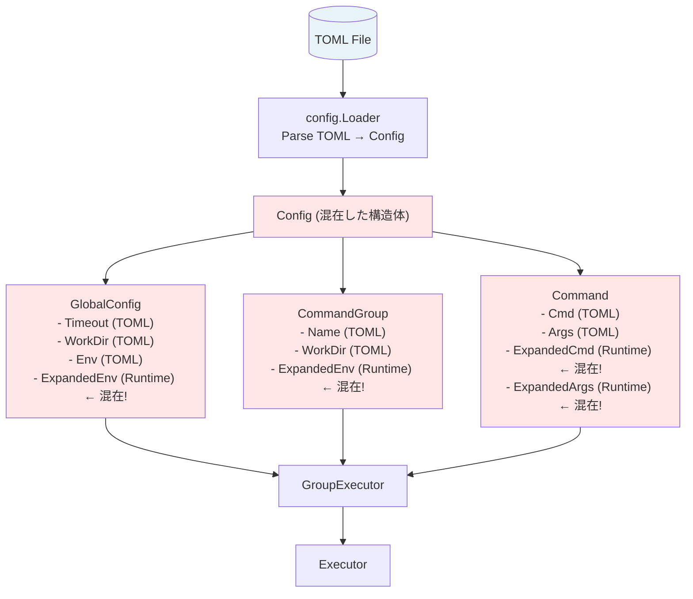
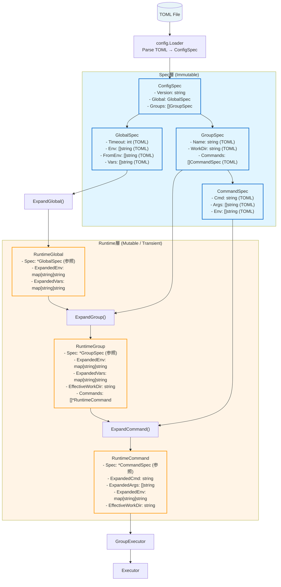
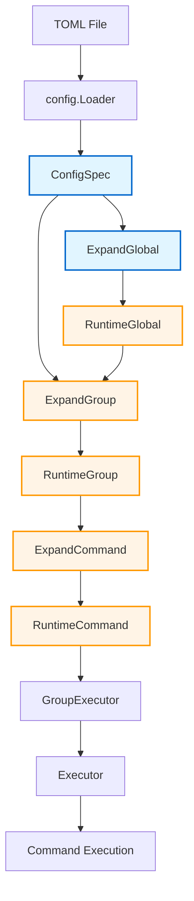

# アーキテクチャ設計書: 構造体分離（Spec/Runtime分離）

## 1. 概要

### 1.1 ドキュメントの目的

本ドキュメントは、Task 0035「構造体分離（Spec/Runtime分離）」のアーキテクチャ設計を記述します。

### 1.2 前提ドキュメント

本設計は以下のドキュメントに基づいています:

| ドキュメント | 参照目的 |
|----------|---------|
| `01_requirements.md` | 機能要件、非機能要件、セキュリティ要件の確認 |

### 1.3 設計原則

本設計は以下の原則に基づいています:

1. **明確な責務分離**: Spec層（設定）とRuntime層（実行時状態）を明確に分離
2. **型による安全性**: 展開前/展開後を型で区別し、コンパイル時にエラーを検出
3. **不変性の保証**: Spec層は読み取り専用、Runtime層は一時的なインスタンス
4. **YAGNI原則**: 将来の拡張を考慮しつつ、現在必要な機能のみを実装
5. **DRY原則**: 既存の展開ロジックを再利用し、重複を避ける

---

## 2. システムアーキテクチャ

### 2.1 全体構成

#### 現在のアーキテクチャ（Before）



**問題点**:
- TOML由来フィールドと実行時計算フィールドが混在
- シャローコピーで不変性を保証（脆弱）
- 展開前/展開後を型で区別できない

#### 新しいアーキテクチャ（After）



**利点**:
- Spec層は読み取り専用(不変性保証)
- Runtime層は一時的(実行ごとに生成・破棄)
- 展開前/展開後を型で明確に区別

### 2.2 データフロー



**凡例**:
- 🔵 **Spec層** (水色): Immutable、永続的
- 🟠 **Runtime層** (オレンジ): Mutable、一時的

---

## 3. コンポーネント設計

### 3.1 Spec層の設計

#### 3.1.1 ConfigSpec

```go
// ConfigSpec: TOMLファイル全体の構造（immutable）
type ConfigSpec struct {
    Version string      `toml:"version"`
    Global  GlobalSpec  `toml:"global"`
    Groups  []GroupSpec `toml:"groups"`
}
```

**責務**:
- TOMLファイルのルート構造を表現
- パース後のデータを保持
- 読み取り専用として扱われる

**ライフサイクル**:
1. `config.Loader.Load()` で生成
2. アプリケーション全体で共有
3. アプリケーション終了まで保持

#### 3.1.2 GlobalSpec

```go
// GlobalSpec: グローバル設定の仕様（immutable）
type GlobalSpec struct {
    // 実行制御
    Timeout           int    `toml:"timeout"`
    LogLevel          string `toml:"log_level"`
    SkipStandardPaths bool   `toml:"skip_standard_paths"`
    MaxOutputSize     int64  `toml:"max_output_size"`

    // セキュリティ
    VerifyFiles  []string `toml:"verify_files"`
    EnvAllowlist []string `toml:"env_allowlist"`

    // 変数定義（生の値）
    Env     []string `toml:"env"`      // KEY=VALUE format
    FromEnv []string `toml:"from_env"` // internal_name=SYSTEM_VAR format
    Vars    []string `toml:"vars"`     // VAR=value format
}
```

**責務**:
- グローバル設定の生の値を保持
- TOML由来のフィールドのみを含む
- 展開済みフィールドは含まない

**不変性**:
- すべてのフィールドは読み取り専用
- 変更が必要な場合は新しいインスタンスを生成

#### 3.1.3 GroupSpec

```go
// GroupSpec: グループ設定の仕様（immutable）
type GroupSpec struct {
    Name        string `toml:"name"`
    Description string `toml:"description"`
    Priority    int    `toml:"priority"`

    // リソース管理
    WorkDir string `toml:"workdir"`

    // コマンド定義
    Commands []CommandSpec `toml:"commands"`

    // セキュリティ
    VerifyFiles  []string `toml:"verify_files"`
    EnvAllowlist []string `toml:"env_allowlist"`

    // 変数定義（生の値）
    Env     []string `toml:"env"`
    FromEnv []string `toml:"from_env"`
    Vars    []string `toml:"vars"`
}
```

**責務**:
- グループ設定の生の値を保持
- コマンドのリストを含む（`[]CommandSpec`）
- 変数の生の値を保持（展開前）

#### 3.1.4 CommandSpec

```go
// CommandSpec: コマンド設定の仕様（immutable）
type CommandSpec struct {
    Name         string   `toml:"name"`
    Description  string   `toml:"description"`
    Cmd          string   `toml:"cmd"`
    Args         []string `toml:"args"`
    WorkDir      string   `toml:"workdir"`
    Timeout      int      `toml:"timeout"`
    RunAsUser    string   `toml:"run_as_user"`
    RunAsGroup   string   `toml:"run_as_group"`
    MaxRiskLevel string   `toml:"max_risk_level"`
    Output       string   `toml:"output"`

    // 変数定義（生の値）
    Env     []string `toml:"env"`
    FromEnv []string `toml:"from_env"`
    Vars    []string `toml:"vars"`
}

// GetMaxRiskLevel: リスクレベルの取得
func (s *CommandSpec) GetMaxRiskLevel() (RiskLevel, error) {
    return ParseRiskLevel(s.MaxRiskLevel)
}

// HasUserGroupSpecification: ユーザー/グループ指定の有無
func (s *CommandSpec) HasUserGroupSpecification() bool {
    return s.RunAsUser != "" || s.RunAsGroup != ""
}
```

**責務**:
- コマンド設定の生の値を保持
- ビジネスロジック用のメソッド（`GetMaxRiskLevel`, `HasUserGroupSpecification`）を提供

### 3.2 Runtime層の設計

#### 3.2.1 RuntimeGlobal

```go
// RuntimeGlobal: グローバル設定の実行時展開結果
type RuntimeGlobal struct {
    Spec *GlobalSpec // 元の仕様への参照

    // 展開済み変数
    ExpandedVerifyFiles []string
    ExpandedEnv         map[string]string
    ExpandedVars        map[string]string
}
```

**責務**:
- グローバル設定の展開結果を保持
- `Spec` への参照で元の設定にアクセス可能
- 実行時に一度だけ生成される

**ライフサイクル**:
1. `ExpandGlobal(globalSpec)` で生成
2. グループ展開時に参照される（`ExpandGroup` の引数）
3. アプリケーション実行中に保持

#### 3.2.2 RuntimeGroup

```go
// RuntimeGroup: グループ設定の実行時展開結果
type RuntimeGroup struct {
    Spec *GroupSpec // 元の仕様への参照

    // 展開済み変数
    ExpandedVerifyFiles []string
    ExpandedEnv         map[string]string
    ExpandedVars        map[string]string

    // 実行時リソース
    EffectiveWorkDir string // 解決済み作業ディレクトリ

    // 展開済みコマンド（この時点では未設定）
    Commands []*RuntimeCommand
}
```

**責務**:
- グループ設定の展開結果を保持
- 作業ディレクトリの解決結果を保持
- コマンドリストを保持（GroupExecutor内で設定）

**ライフサイクル**:
1. `ExpandGroup(groupSpec, globalVars)` で生成
2. `GroupExecutor.ExecuteGroup()` 内で `EffectiveWorkDir` を設定
3. コマンドごとに `ExpandCommand()` を呼び出し、`Commands` に追加
4. グループ実行終了後に破棄

#### 3.2.3 RuntimeCommand

```go
// RuntimeCommand: コマンドの実行時展開結果
type RuntimeCommand struct {
    Spec *CommandSpec // 元の仕様への参照

    // 展開済みコマンド情報
    ExpandedCmd  string
    ExpandedArgs []string
    ExpandedEnv  map[string]string
    ExpandedVars map[string]string

    // 実行時情報
    EffectiveWorkDir string
    EffectiveTimeout int // Global/Group からの継承を解決
}

// 便利メソッド: Spec へのアクセスを簡略化
func (r *RuntimeCommand) Name() string {
    return r.Spec.Name
}

func (r *RuntimeCommand) RunAsUser() string {
    return r.Spec.RunAsUser
}

func (r *RuntimeCommand) RunAsGroup() string {
    return r.Spec.RunAsGroup
}

func (r *RuntimeCommand) Output() string {
    return r.Spec.Output
}

func (r *RuntimeCommand) GetMaxRiskLevel() (RiskLevel, error) {
    return r.Spec.GetMaxRiskLevel()
}

func (r *RuntimeCommand) HasUserGroupSpecification() bool {
    return r.Spec.HasUserGroupSpecification()
}
```

**責務**:
- コマンドの展開結果を保持
- 実行時情報（`EffectiveWorkDir`, `EffectiveTimeout`）を保持
- Spec へのアクセスを簡略化する便利メソッドを提供

**ライフサイクル**:
1. `ExpandCommand(commandSpec, groupVars, groupName)` で生成
2. `GroupExecutor` 内で `EffectiveWorkDir`, `EffectiveTimeout` を設定
3. `Executor.Execute(runtimeCmd)` に渡される
4. コマンド実行終了後に破棄

### 3.3 展開関数の設計

#### 3.3.1 ExpandGlobal

```go
// ExpandGlobal: GlobalSpec → RuntimeGlobal への展開
func ExpandGlobal(spec *GlobalSpec) (*RuntimeGlobal, error) {
    runtime := &RuntimeGlobal{
        Spec:         spec,
        ExpandedVars: make(map[string]string),
        ExpandedEnv:  make(map[string]string),
    }

    // 1. FromEnv の処理（システム環境変数のインポート）
    if err := ProcessFromEnv(spec.FromEnv, runtime.ExpandedVars, nil); err != nil {
        return nil, fmt.Errorf("failed to process global from_env: %w", err)
    }

    // 2. Vars の処理（内部変数の定義）
    if err := ProcessVars(spec.Vars, runtime.ExpandedVars); err != nil {
        return nil, fmt.Errorf("failed to process global vars: %w", err)
    }

    // 3. Env の展開（環境変数の定義）
    for _, envPair := range spec.Env {
        key, value, err := parseKeyValue(envPair)
        if err != nil {
            return nil, fmt.Errorf("invalid global env format: %w", err)
        }
        expandedValue, err := ExpandString(value, runtime.ExpandedVars, "global", fmt.Sprintf("env[%s]", key))
        if err != nil {
            return nil, err
        }
        runtime.ExpandedEnv[key] = expandedValue
    }

    // 4. VerifyFiles の展開
    runtime.ExpandedVerifyFiles = make([]string, len(spec.VerifyFiles))
    for i, file := range spec.VerifyFiles {
        expandedFile, err := ExpandString(file, runtime.ExpandedVars, "global", fmt.Sprintf("verify_files[%d]", i))
        if err != nil {
            return nil, err
        }
        runtime.ExpandedVerifyFiles[i] = expandedFile
    }

    return runtime, nil
}
```

**処理フロー**:
1. `RuntimeGlobal` インスタンスを生成
2. `FromEnv` を処理し、システム環境変数を `ExpandedVars` にインポート
3. `Vars` を処理し、内部変数を `ExpandedVars` に設定
4. `Env` を展開し、`ExpandedEnv` に設定
5. `VerifyFiles` を展開し、`ExpandedVerifyFiles` に設定

**エラーハンドリング**:
- 各ステップで詳細なエラーメッセージを返す
- エラー発生時は即座に処理を中止

#### 3.3.2 ExpandGroup

```go
// ExpandGroup: GroupSpec → RuntimeGroup への展開
func ExpandGroup(spec *GroupSpec, globalVars map[string]string) (*RuntimeGroup, error) {
    runtime := &RuntimeGroup{
        Spec:         spec,
        ExpandedVars: make(map[string]string),
        ExpandedEnv:  make(map[string]string),
        Commands:     make([]*RuntimeCommand, 0, len(spec.Commands)),
    }

    // 1. グローバル変数を継承
    for k, v := range globalVars {
        runtime.ExpandedVars[k] = v
    }

    // 2. FromEnv の処理（グループレベル）
    if err := ProcessFromEnv(spec.FromEnv, runtime.ExpandedVars, nil); err != nil {
        return nil, fmt.Errorf("failed to process group[%s] from_env: %w", spec.Name, err)
    }

    // 3. Vars の処理（グループレベル）
    if err := ProcessVars(spec.Vars, runtime.ExpandedVars); err != nil {
        return nil, fmt.Errorf("failed to process group[%s] vars: %w", spec.Name, err)
    }

    // 4. Env の展開
    for _, envPair := range spec.Env {
        key, value, err := parseKeyValue(envPair)
        if err != nil {
            return nil, fmt.Errorf("invalid group[%s] env format: %w", spec.Name, err)
        }
        expandedValue, err := ExpandString(value, runtime.ExpandedVars, fmt.Sprintf("group[%s]", spec.Name), fmt.Sprintf("env[%s]", key))
        if err != nil {
            return nil, err
        }
        runtime.ExpandedEnv[key] = expandedValue
    }

    // 5. VerifyFiles の展開
    runtime.ExpandedVerifyFiles = make([]string, len(spec.VerifyFiles))
    for i, file := range spec.VerifyFiles {
        expandedFile, err := ExpandString(file, runtime.ExpandedVars, fmt.Sprintf("group[%s]", spec.Name), fmt.Sprintf("verify_files[%d]", i))
        if err != nil {
            return nil, err
        }
        runtime.ExpandedVerifyFiles[i] = expandedFile
    }

    // 注意: Commands はこの時点では展開しない（GroupExecutor内で展開）
    return runtime, nil
}
```

**処理フロー**:
1. `RuntimeGroup` インスタンスを生成
2. グローバル変数を `ExpandedVars` に継承
3. `FromEnv`, `Vars`, `Env`, `VerifyFiles` を展開
4. コマンドは展開せず、空のスライスを設定

**設計上の注意**:
- コマンドは `GroupExecutor` 内で展開される（`ExpandCommand` を使用）
- これにより、`__runner_workdir` などの実行時変数を含めることが可能

#### 3.3.3 ExpandCommand

```go
// ExpandCommand: CommandSpec → RuntimeCommand への展開
func ExpandCommand(spec *CommandSpec, groupVars map[string]string, groupName string) (*RuntimeCommand, error) {
    runtime := &RuntimeCommand{
        Spec:         spec,
        ExpandedVars: make(map[string]string),
        ExpandedEnv:  make(map[string]string),
    }

    // 1. グループ変数を継承
    for k, v := range groupVars {
        runtime.ExpandedVars[k] = v
    }

    // 2. FromEnv の処理（コマンドレベル）
    if err := ProcessFromEnv(spec.FromEnv, runtime.ExpandedVars, nil); err != nil {
        return nil, fmt.Errorf("failed to process command[%s] from_env: %w", spec.Name, err)
    }

    // 3. Vars の処理（コマンドレベル）
    if err := ProcessVars(spec.Vars, runtime.ExpandedVars); err != nil {
        return nil, fmt.Errorf("failed to process command[%s] vars: %w", spec.Name, err)
    }

    level := fmt.Sprintf("command[%s]", spec.Name)

    // 4. Cmd の展開
    expandedCmd, err := ExpandString(spec.Cmd, runtime.ExpandedVars, level, "cmd")
    if err != nil {
        return nil, err
    }
    runtime.ExpandedCmd = expandedCmd

    // 5. Args の展開
    runtime.ExpandedArgs = make([]string, len(spec.Args))
    for i, arg := range spec.Args {
        expandedArg, err := ExpandString(arg, runtime.ExpandedVars, level, fmt.Sprintf("args[%d]", i))
        if err != nil {
            return nil, err
        }
        runtime.ExpandedArgs[i] = expandedArg
    }

    // 6. Env の展開
    for _, envPair := range spec.Env {
        key, value, err := parseKeyValue(envPair)
        if err != nil {
            return nil, fmt.Errorf("invalid command[%s] env format: %w", spec.Name, err)
        }
        expandedValue, err := ExpandString(value, runtime.ExpandedVars, level, fmt.Sprintf("env[%s]", key))
        if err != nil {
            return nil, err
        }
        runtime.ExpandedEnv[key] = expandedValue
    }

    // 注意: EffectiveWorkDir, EffectiveTimeout は GroupExecutor 内で設定
    return runtime, nil
}
```

**処理フロー**:
1. `RuntimeCommand` インスタンスを生成
2. グループ変数を継承
3. `FromEnv`, `Vars` を処理
4. `Cmd`, `Args`, `Env` を展開

---

## 4. パッケージ構成

### 4.1 ファイル構成

```
internal/runner/runnertypes/
├── spec.go              # Spec層の型定義
├── runtime.go           # Runtime層の型定義
├── config.go            # 既存の型定義（削除予定または移行先を明記）
├── errors.go            # エラー定義（変更なし）
├── allowlist_resolution.go  # Allowlist解決（変更なし）
├── spec_test.go         # Spec層のテスト
├── runtime_test.go      # Runtime層のテスト
└── *_test_helper.go     # テストヘルパー

internal/runner/config/
├── loader.go            # TOMLローダー（ConfigSpec を返すように更新）
├── expansion.go         # 展開関数（ExpandGlobal, ExpandGroup, ExpandCommand を追加）
├── loader_test.go       # ローダーのテスト
└── expansion_test.go    # 展開関数のテスト
```

### 4.2 依存関係

```
runnertypes/spec.go
  ↓ (参照)
runnertypes/runtime.go
  ↓ (使用)
config/expansion.go
  ↓ (使用)
config/loader.go
  ↓ (使用)
runner/group_executor.go
  ↓ (使用)
executor/command_executor.go
```

---

## 5. インターフェース設計

### 5.1 TOMLローダーのインターフェース

```go
// Loader: TOML設定ファイルのローダー
type Loader interface {
    // Load: TOMLファイルをロードし、ConfigSpec を返す
    Load(path string) (*runnertypes.ConfigSpec, error)
}

// DefaultLoader: 標準的なローダー実装
type DefaultLoader struct {
    // ...
}

func (l *DefaultLoader) Load(path string) (*runnertypes.ConfigSpec, error) {
    // TOML パース処理
}
```

**変更点**:
- 戻り値を `*Config` から `*ConfigSpec` に変更
- パース処理は変更なし

### 5.2 GroupExecutor のインターフェース

```go
// GroupExecutor: グループ実行のインターフェース
type GroupExecutor interface {
    // ExecuteGroup: グループを実行
    ExecuteGroup(ctx context.Context, groupSpec *runnertypes.GroupSpec) error
}

// DefaultGroupExecutor: 標準的なGroupExecutor実装
type DefaultGroupExecutor struct {
    // ...
}

func (e *DefaultGroupExecutor) ExecuteGroup(ctx context.Context, groupSpec *runnertypes.GroupSpec) error {
    // 1. ExpandGroup() を呼び出し、RuntimeGroup を生成
    runtimeGroup, err := config.ExpandGroup(groupSpec, e.globalVars)
    if err != nil {
        return err
    }

    // 2. EffectiveWorkDir を解決
    // ...

    // 3. 各コマンドを展開・実行
    for _, cmdSpec := range groupSpec.Commands {
        runtimeCmd, err := config.ExpandCommand(&cmdSpec, runtimeGroup.ExpandedVars, groupSpec.Name)
        if err != nil {
            return err
        }
        // EffectiveWorkDir を設定
        // ...
        // 実行
        if err := e.executor.Execute(ctx, runtimeCmd); err != nil {
            return err
        }
    }

    return nil
}
```

**変更点**:
- 引数を `*CommandGroup` から `*GroupSpec` に変更
- 内部で `ExpandGroup()`, `ExpandCommand()` を呼び出す

### 5.3 Executor のインターフェース

```go
// CommandExecutor: コマンド実行のインターフェース
type CommandExecutor interface {
    // Execute: コマンドを実行
    Execute(ctx context.Context, cmd *runnertypes.RuntimeCommand) error
}

// DefaultCommandExecutor: 標準的なExecutor実装
type DefaultCommandExecutor struct {
    // ...
}

func (e *DefaultCommandExecutor) Execute(ctx context.Context, cmd *runnertypes.RuntimeCommand) error {
    // cmd.ExpandedCmd, cmd.ExpandedArgs を使用してコマンドを実行
    // cmd.Spec.Name, cmd.Spec.RunAsUser なども参照可能
}
```

**変更点**:
- 引数を `*Command` から `*RuntimeCommand` に変更
- `cmd.ExpandedCmd`, `cmd.ExpandedArgs` を直接使用

---

## 6. 移行計画

### 6.1 段階的な移行

#### Phase 1: Spec層の定義

1. `spec.go` を新規作成
2. `ConfigSpec`, `GlobalSpec`, `GroupSpec`, `CommandSpec` を定義
3. 単体テストを作成

#### Phase 2: Runtime層の定義

1. `runtime.go` を新規作成
2. `RuntimeGlobal`, `RuntimeGroup`, `RuntimeCommand` を定義
3. 便利メソッドを実装
4. 単体テストを作成

#### Phase 3: 展開関数の実装

1. `expansion.go` に `ExpandGlobal`, `ExpandGroup`, `ExpandCommand` を追加
2. 既存の展開ロジックを再利用
3. 単体テストを作成

#### Phase 4: TOMLローダーの更新

1. `loader.go` を更新し、`ConfigSpec` を返すように変更
2. 既存のパース処理は変更なし
3. テストを更新

#### Phase 5: GroupExecutor の更新

1. `group_executor.go` を更新し、`GroupSpec` を受け取るように変更
2. 内部で `ExpandGroup()`, `ExpandCommand()` を呼び出す
3. テストを更新

#### Phase 6: Executor の更新

1. `command_executor.go` を更新し、`RuntimeCommand` を受け取るように変更
2. テストを更新

#### Phase 7: 既存コードのクリーンアップ

1. `config.go` から古い型定義を削除
2. すべてのテストが成功することを確認

### 6.2 移行のリスク

| リスク | 影響 | 対策 |
|------|------|------|
| デグレーション | 高 | 段階的な移行、徹底的なテスト |
| レビューコスト | 中 | PR の分割、詳細なコメント |
| パフォーマンス劣化 | 低 | ベンチマークテストの実施 |

---

## 7. セキュリティ考慮事項

### 7.1 不変性の保証

- **Spec層**: すべてのフィールドは読み取り専用として扱う
- **Runtime層**: 実行ごとに新しいインスタンスを生成し、再利用しない

### 7.2 並行実行の安全性

- **Spec層**: 複数のgoroutineから安全に参照可能
- **Runtime層**: 各goroutineで独立したインスタンスを使用

---

## 8. パフォーマンス考慮事項

### 8.1 メモリ使用量

- **Spec層**: 1回だけロード、アプリケーション全体で共有
- **Runtime層**: 実行ごとに生成・破棄、長期保持しない
- **推定増加量**: 従来比 +20% 程度（展開済みフィールドの追加分）

### 8.2 展開処理のパフォーマンス

- **既存ロジックの再利用**: `ExpandString`, `ProcessFromEnv`, `ProcessVars` は変更なし
- **追加オーバーヘッド**: インスタンス生成のみ（微小）

---

## まとめ

本アーキテクチャ設計により、以下の目標を達成します:

1. ✅ **型安全性の向上**: 展開前/展開後を型で明確に区別
2. ✅ **不変性の保証**: Spec層は読み取り専用
3. ✅ **テストの容易化**: 責務が明確で、テストが簡潔
4. ✅ **将来の拡張性**: Runtime層に実行時情報を追加しやすい

次のステップは、詳細仕様書（`03_specification.md`）の作成です。
