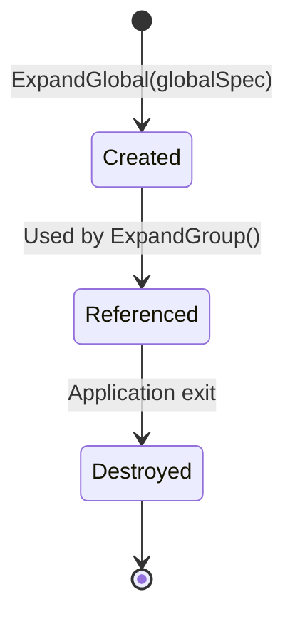
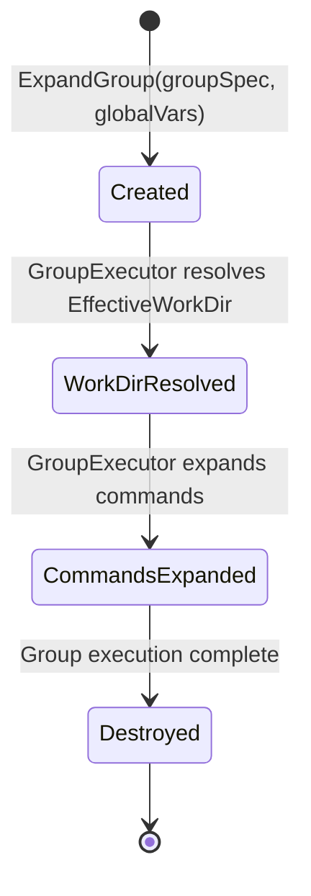
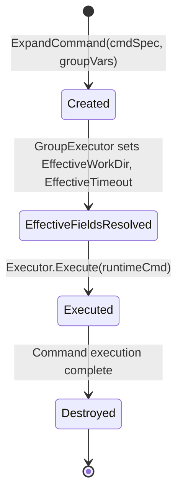
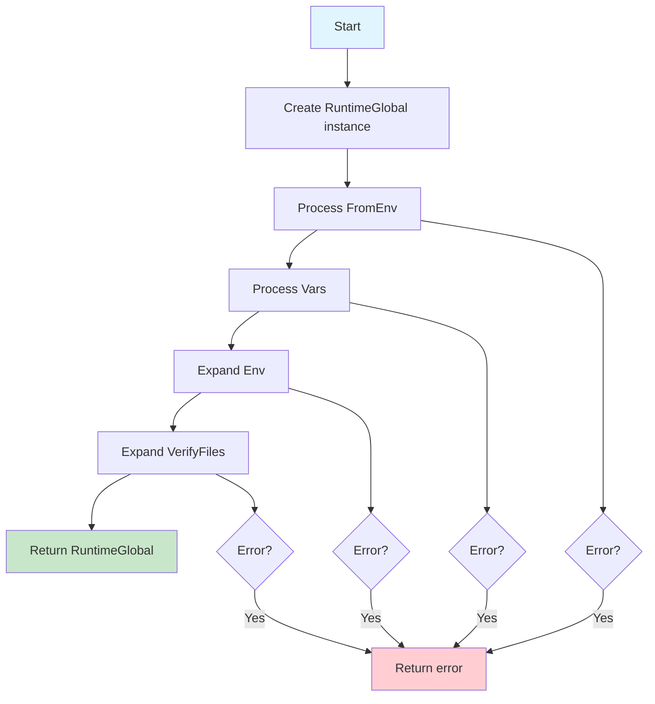
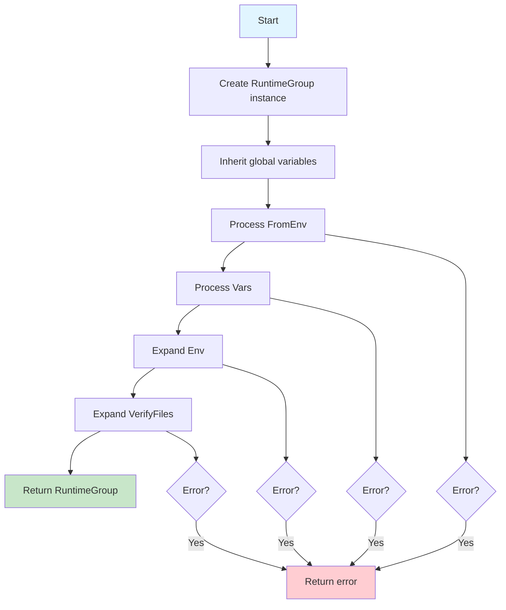
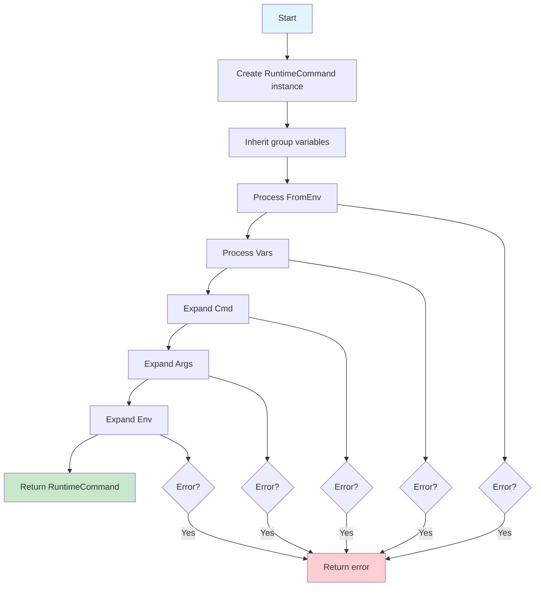

# 詳細仕様書: 構造体分離（Spec/Runtime分離）

## 1. 概要

### 1.1 ドキュメントの目的

本ドキュメントは、Task 0035「構造体分離（Spec/Runtime分離）」の詳細仕様を記述します。

### 1.2 前提ドキュメント

本仕様は以下のドキュメントに基づいています:

| ドキュメント | 参照目的 |
|----------|---------|
| `01_requirements.md` | 機能要件、非機能要件の確認 |
| `02_architecture.md` | アーキテクチャ設計、コンポーネント設計の理解 |

---

## 2. Spec層の詳細仕様

### 2.1 ConfigSpec

#### 2.1.1 型定義

**ファイル**: `internal/runner/runnertypes/spec.go`

```go
// ConfigSpec represents the root configuration structure loaded from TOML file.
// This is an immutable representation of the configuration file and should not be modified after loading.
//
// All fields in this struct correspond directly to TOML file structure.
// For runtime-expanded values, see RuntimeGlobal and RuntimeGroup instead.
type ConfigSpec struct {
    // Version specifies the configuration file version (e.g., "1.0")
    Version string `toml:"version"`

    // Global contains global-level configuration
    Global GlobalSpec `toml:"global"`

    // Groups contains all command groups defined in the configuration
    Groups []GroupSpec `toml:"groups"`
}
```

#### 2.1.2 検証ルール

| 項目 | 検証ルール | エラー時の動作 |
|------|----------|--------------|
| `Version` | 空文字列でないこと | ロード時にエラーを返す |
| `Groups` | 少なくとも1つのグループが存在すること | ロード時にエラーを返す |

### 2.2 GlobalSpec

#### 2.2.1 型定義

```go
// GlobalSpec contains global configuration options loaded from TOML file.
// This is an immutable representation and should not be modified after loading.
//
// For runtime-expanded values (e.g., ExpandedEnv, ExpandedVars), see RuntimeGlobal instead.
type GlobalSpec struct {
    // Execution control
    Timeout           int    `toml:"timeout"`              // Global timeout in seconds (0 = no timeout)
    LogLevel          string `toml:"log_level"`            // Log level: debug, info, warn, error
    SkipStandardPaths bool   `toml:"skip_standard_paths"`  // Skip verification for standard system paths
    MaxOutputSize     int64  `toml:"max_output_size"`      // Maximum output size in bytes (0 = unlimited)

    // Security
    VerifyFiles  []string `toml:"verify_files"`   // Files to verify before execution (raw paths)
    EnvAllowlist []string `toml:"env_allowlist"`  // Allowed environment variables

    // Variable definitions (raw values, not yet expanded)
    Env     []string `toml:"env"`      // Environment variables in KEY=VALUE format
    FromEnv []string `toml:"from_env"` // System env var imports in internal_name=SYSTEM_VAR format
    Vars    []string `toml:"vars"`     // Internal variables in VAR=value format
}
```

#### 2.2.2 フィールドの詳細

| フィールド | 型 | デフォルト値 | 説明 |
|---------|---|-----------|------|
| `Timeout` | `int` | `0` | グローバルタイムアウト（秒）。0の場合はタイムアウトなし |
| `LogLevel` | `string` | `"info"` | ログレベル。`debug`, `info`, `warn`, `error` のいずれか |
| `SkipStandardPaths` | `bool` | `false` | 標準システムパスの検証をスキップするかどうか |
| `MaxOutputSize` | `int64` | `0` | 最大出力サイズ（バイト）。0の場合は無制限 |
| `VerifyFiles` | `[]string` | `[]` | 実行前に検証するファイルパス（生の値、変数展開前） |
| `EnvAllowlist` | `[]string` | `[]` | 許可する環境変数のリスト |
| `Env` | `[]string` | `[]` | 環境変数定義（`KEY=VALUE` 形式、生の値） |
| `FromEnv` | `[]string` | `[]` | システム環境変数インポート（`internal_name=SYSTEM_VAR` 形式） |
| `Vars` | `[]string` | `[]` | 内部変数定義（`VAR=value` 形式、生の値） |

### 2.3 GroupSpec

#### 2.3.1 型定義

```go
// GroupSpec represents a command group configuration loaded from TOML file.
// This is an immutable representation and should not be modified after loading.
//
// For runtime-expanded values, see RuntimeGroup instead.
type GroupSpec struct {
    // Basic information
    Name        string `toml:"name"`        // Group name (must be unique within the config)
    Description string `toml:"description"` // Human-readable description
    Priority    int    `toml:"priority"`    // Execution priority (lower number = higher priority)

    // Resource management
    WorkDir string `toml:"workdir"` // Working directory for this group (raw value, not yet expanded)

    // Command definitions
    Commands []CommandSpec `toml:"commands"` // Commands in this group

    // Security
    VerifyFiles  []string `toml:"verify_files"`   // Files to verify for this group (raw paths)
    EnvAllowlist []string `toml:"env_allowlist"`  // Group-level environment variable allowlist

    // Variable definitions (raw values, not yet expanded)
    Env     []string `toml:"env"`      // Group-level environment variables in KEY=VALUE format
    FromEnv []string `toml:"from_env"` // System env var imports in internal_name=SYSTEM_VAR format
    Vars    []string `toml:"vars"`     // Group-level internal variables in VAR=value format
}
```

#### 2.3.2 検証ルール

| 項目 | 検証ルール | エラー時の動作 |
|------|----------|--------------|
| `Name` | 空文字列でないこと | ロード時にエラーを返す |
| `Name` | 設定ファイル内で一意であること | ロード時にエラーを返す |
| `Commands` | 少なくとも1つのコマンドが存在すること | ロード時にエラーを返す |

### 2.4 CommandSpec

#### 2.4.1 型定義

```go
// CommandSpec represents a single command configuration loaded from TOML file.
// This is an immutable representation and should not be modified after loading.
//
// For runtime-expanded values (e.g., ExpandedCmd, ExpandedArgs), see RuntimeCommand instead.
type CommandSpec struct {
    // Basic information
    Name        string `toml:"name"`        // Command name (must be unique within the group)
    Description string `toml:"description"` // Human-readable description

    // Command definition (raw values, not yet expanded)
    Cmd  string   `toml:"cmd"`  // Command path (may contain variables like %{VAR})
    Args []string `toml:"args"` // Command arguments (may contain variables)

    // Execution settings
    WorkDir      string `toml:"workdir"`        // Working directory for this command (raw value)
    Timeout      int    `toml:"timeout"`        // Command-specific timeout in seconds (overrides global/group)
    RunAsUser    string `toml:"run_as_user"`    // User to execute command as (using seteuid)
    RunAsGroup   string `toml:"run_as_group"`   // Group to execute command as (using setegid)
    MaxRiskLevel string `toml:"max_risk_level"` // Maximum allowed risk level: low, medium, high
    Output       string `toml:"output"`         // Standard output file path for capture

    // Variable definitions (raw values, not yet expanded)
    Env     []string `toml:"env"`      // Command-level environment variables in KEY=VALUE format
    FromEnv []string `toml:"from_env"` // System env var imports in internal_name=SYSTEM_VAR format
    Vars    []string `toml:"vars"`     // Command-level internal variables in VAR=value format
}

// GetMaxRiskLevel parses and returns the maximum risk level for this command.
// Returns RiskLevelUnknown and an error if the risk level string is invalid.
//
// Critical risk level cannot be set in configuration (reserved for internal use only).
func (s *CommandSpec) GetMaxRiskLevel() (RiskLevel, error) {
    return ParseRiskLevel(s.MaxRiskLevel)
}

// HasUserGroupSpecification returns true if either run_as_user or run_as_group is specified.
func (s *CommandSpec) HasUserGroupSpecification() bool {
    return s.RunAsUser != "" || s.RunAsGroup != ""
}
```

#### 2.4.2 検証ルール

| 項目 | 検証ルール | エラー時の動作 |
|------|----------|--------------|
| `Name` | 空文字列でないこと | ロード時にエラーを返す |
| `Name` | グループ内で一意であること | ロード時にエラーを返す |
| `Cmd` | 空文字列でないこと | ロード時にエラーを返す |
| `MaxRiskLevel` | `low`, `medium`, `high`, `""` のいずれか | `GetMaxRiskLevel()` 呼び出し時にエラーを返す |

---

## 3. Runtime層の詳細仕様

### 3.1 RuntimeGlobal

#### 3.1.1 型定義

**ファイル**: `internal/runner/runnertypes/runtime.go`

```go
// RuntimeGlobal represents the runtime-expanded global configuration.
// This is a transient representation created during execution and contains
// all variable-expanded values.
//
// Unlike GlobalSpec, this struct is mutable and created fresh for each execution.
type RuntimeGlobal struct {
    // Spec is a reference to the original configuration spec
    Spec *GlobalSpec

    // Expanded variables
    ExpandedVerifyFiles []string          // Verify files with variables expanded
    ExpandedEnv         map[string]string // Environment variables with variables expanded
    ExpandedVars        map[string]string // Internal variables (after FromEnv, Vars processing)
}
```

#### 3.1.2 ライフサイクル



**生成**: `config.ExpandGlobal(globalSpec)` によって生成される
**使用**: グループ展開時に `globalVars` として参照される
**破棄**: アプリケーション終了時に破棄される

### 3.2 RuntimeGroup

#### 3.2.1 型定義

```go
// RuntimeGroup represents the runtime-expanded group configuration.
// This is a transient representation created during group execution and contains
// all variable-expanded values and runtime-resolved information.
//
// Unlike GroupSpec, this struct is mutable and created fresh for each group execution.
type RuntimeGroup struct {
    // Spec is a reference to the original configuration spec
    Spec *GroupSpec

    // Expanded variables
    ExpandedVerifyFiles []string          // Verify files with variables expanded
    ExpandedEnv         map[string]string // Environment variables with variables expanded
    ExpandedVars        map[string]string // Internal variables (includes Global, FromEnv, Vars)

    // Runtime resources
    EffectiveWorkDir string // Resolved working directory (set by GroupExecutor)

    // Expanded commands (populated by GroupExecutor during command execution)
    Commands []*RuntimeCommand
}
```

#### 3.2.2 ライフサイクル



**生成**: `config.ExpandGroup(groupSpec, globalVars)` によって生成される
**WorkDir解決**: `GroupExecutor` 内で `EffectiveWorkDir` が設定される
**コマンド展開**: `GroupExecutor` 内で各コマンドが展開され、`Commands` に追加される
**破棄**: グループ実行終了後に破棄される

### 3.3 RuntimeCommand

#### 3.3.1 型定義

```go
// RuntimeCommand represents the runtime-expanded command configuration.
// This is a transient representation created during command execution and contains
// all variable-expanded values and runtime-resolved information.
//
// Unlike CommandSpec, this struct is mutable and created fresh for each command execution.
type RuntimeCommand struct {
    // Spec is a reference to the original configuration spec
    Spec *CommandSpec

    // Expanded command information
    ExpandedCmd  string            // Command path with variables expanded
    ExpandedArgs []string          // Command arguments with variables expanded
    ExpandedEnv  map[string]string // Environment variables with variables expanded
    ExpandedVars map[string]string // Internal variables (includes Group, FromEnv, Vars)

    // Runtime information (set by GroupExecutor)
    EffectiveWorkDir string // Resolved working directory
    EffectiveTimeout int    // Resolved timeout (considers Global/Group inheritance)
}

// Convenience methods for accessing Spec fields

// Name returns the command name from the spec.
func (r *RuntimeCommand) Name() string {
    return r.Spec.Name
}

// RunAsUser returns the run_as_user from the spec.
func (r *RuntimeCommand) RunAsUser() string {
    return r.Spec.RunAsUser
}

// RunAsGroup returns the run_as_group from the spec.
func (r *RuntimeCommand) RunAsGroup() string {
    return r.Spec.RunAsGroup
}

// Output returns the output file path from the spec.
func (r *RuntimeCommand) Output() string {
    return r.Spec.Output
}

// GetMaxRiskLevel delegates to the spec's GetMaxRiskLevel method.
func (r *RuntimeCommand) GetMaxRiskLevel() (RiskLevel, error) {
    return r.Spec.GetMaxRiskLevel()
}

// HasUserGroupSpecification delegates to the spec's HasUserGroupSpecification method.
func (r *RuntimeCommand) HasUserGroupSpecification() bool {
    return r.Spec.HasUserGroupSpecification()
}
```

#### 3.3.2 便利メソッドの設計意図

便利メソッド（`Name()`, `RunAsUser()` など）は、以下の目的で提供されます:

1. **アクセスの簡略化**: `cmd.Spec.Name` を `cmd.Name()` に簡略化
2. **コードの可読性向上**: `cmd.Name()` の方が直感的
3. **将来の拡張性**: メソッド内部で追加のロジックを実装可能

**使用例**:

```go
// Before（冗長）
log.Infof("Executing command: %s", cmd.Spec.Name)

// After（簡潔）
log.Infof("Executing command: %s", cmd.Name())
```

#### 3.3.3 ライフサイクル



**生成**: `config.ExpandCommand(cmdSpec, groupVars, groupName)` によって生成される
**実行時フィールド解決**: `GroupExecutor` 内で `EffectiveWorkDir`, `EffectiveTimeout` が設定される
**実行**: `Executor.Execute(runtimeCmd)` に渡される
**破棄**: コマンド実行終了後に破棄される

---

## 4. 展開関数の詳細仕様

### 4.1 ExpandGlobal

#### 4.1.1 関数シグネチャ

**ファイル**: `internal/runner/config/expansion.go`

```go
// ExpandGlobal expands a GlobalSpec into a RuntimeGlobal.
//
// This function processes:
// 1. FromEnv: Imports system environment variables as internal variables
// 2. Vars: Defines internal variables
// 3. Env: Expands environment variables using internal variables
// 4. VerifyFiles: Expands file paths using internal variables
//
// Parameters:
//   - spec: The global configuration spec to expand
//
// Returns:
//   - *RuntimeGlobal: The expanded runtime global configuration
//   - error: An error if expansion fails (e.g., undefined variable reference)
//
// Example:
//   globalSpec := &GlobalSpec{
//       Env: []string{"PATH=/usr/bin"},
//       Vars: []string{"PREFIX=/opt"},
//   }
//   runtimeGlobal, err := ExpandGlobal(globalSpec)
//   if err != nil {
//       return err
//   }
//   // runtimeGlobal.ExpandedEnv["PATH"] == "/usr/bin"
//   // runtimeGlobal.ExpandedVars["PREFIX"] == "/opt"
func ExpandGlobal(spec *GlobalSpec) (*RuntimeGlobal, error)
```

#### 4.1.2 処理フロー



#### 4.1.3 実装例

```go
func ExpandGlobal(spec *GlobalSpec) (*RuntimeGlobal, error) {
    runtime := &RuntimeGlobal{
        Spec:         spec,
        ExpandedVars: make(map[string]string),
        ExpandedEnv:  make(map[string]string),
    }

    // 1. FromEnv の処理
    if err := ProcessFromEnv(spec.FromEnv, runtime.ExpandedVars, nil); err != nil {
        return nil, fmt.Errorf("failed to process global from_env: %w", err)
    }

    // 2. Vars の処理
    if err := ProcessVars(spec.Vars, runtime.ExpandedVars); err != nil {
        return nil, fmt.Errorf("failed to process global vars: %w", err)
    }

    // 3. Env の展開
    for _, envPair := range spec.Env {
        key, value, err := parseKeyValue(envPair)
        if err != nil {
            return nil, fmt.Errorf("invalid global env format: %w", err)
        }
        expandedValue, err := ExpandString(value, runtime.ExpandedVars, "global", fmt.Sprintf("env[%s]", key))
        if err != nil {
            return nil, err
        }
        runtime.ExpandedEnv[key] = expandedValue
    }

    // 4. VerifyFiles の展開
    runtime.ExpandedVerifyFiles = make([]string, len(spec.VerifyFiles))
    for i, file := range spec.VerifyFiles {
        expandedFile, err := ExpandString(file, runtime.ExpandedVars, "global", fmt.Sprintf("verify_files[%d]", i))
        if err != nil {
            return nil, err
        }
        runtime.ExpandedVerifyFiles[i] = expandedFile
    }

    return runtime, nil
}
```

### 4.2 ExpandGroup

#### 4.2.1 関数シグネチャ

```go
// ExpandGroup expands a GroupSpec into a RuntimeGroup.
//
// This function processes:
// 1. Inherits global variables
// 2. FromEnv: Imports system environment variables as internal variables (group-level)
// 3. Vars: Defines internal variables (group-level)
// 4. Env: Expands environment variables using internal variables
// 5. VerifyFiles: Expands file paths using internal variables
//
// Parameters:
//   - spec: The group configuration spec to expand
//   - globalVars: Global-level internal variables (from RuntimeGlobal.ExpandedVars)
//
// Returns:
//   - *RuntimeGroup: The expanded runtime group configuration
//   - error: An error if expansion fails
//
// Note:
//   - Commands are NOT expanded by this function. They are expanded separately
//     by GroupExecutor using ExpandCommand() for each command.
//
// Example:
//   groupSpec := &GroupSpec{
//       Name: "build",
//       Vars: []string{"BUILD_DIR=/tmp/build"},
//   }
//   runtimeGroup, err := ExpandGroup(groupSpec, runtimeGlobal.ExpandedVars)
//   if err != nil {
//       return err
//   }
//   // runtimeGroup.ExpandedVars["BUILD_DIR"] == "/tmp/build"
func ExpandGroup(spec *GroupSpec, globalVars map[string]string) (*RuntimeGroup, error)
```

#### 4.2.2 処理フロー



**注意事項**:
- この関数はコマンドを展開**しません**
- コマンドは `GroupExecutor` 内で `ExpandCommand()` を使用して個別に展開されます
- これにより、`__runner_workdir` などの実行時変数を含めることが可能になります

#### 4.2.3 実装例

```go
func ExpandGroup(spec *GroupSpec, globalVars map[string]string) (*RuntimeGroup, error) {
    runtime := &RuntimeGroup{
        Spec:         spec,
        ExpandedVars: make(map[string]string),
        ExpandedEnv:  make(map[string]string),
        Commands:     make([]*RuntimeCommand, 0, len(spec.Commands)),
    }

    // 1. グローバル変数を継承
    for k, v := range globalVars {
        runtime.ExpandedVars[k] = v
    }

    // 2. FromEnv の処理（グループレベル）
    if err := ProcessFromEnv(spec.FromEnv, runtime.ExpandedVars, nil); err != nil {
        return nil, fmt.Errorf("failed to process group[%s] from_env: %w", spec.Name, err)
    }

    // 3. Vars の処理（グループレベル）
    if err := ProcessVars(spec.Vars, runtime.ExpandedVars); err != nil {
        return nil, fmt.Errorf("failed to process group[%s] vars: %w", spec.Name, err)
    }

    // 4. Env の展開
    for _, envPair := range spec.Env {
        key, value, err := parseKeyValue(envPair)
        if err != nil {
            return nil, fmt.Errorf("invalid group[%s] env format: %w", spec.Name, err)
        }
        expandedValue, err := ExpandString(value, runtime.ExpandedVars, fmt.Sprintf("group[%s]", spec.Name), fmt.Sprintf("env[%s]", key))
        if err != nil {
            return nil, err
        }
        runtime.ExpandedEnv[key] = expandedValue
    }

    // 5. VerifyFiles の展開
    runtime.ExpandedVerifyFiles = make([]string, len(spec.VerifyFiles))
    for i, file := range spec.VerifyFiles {
        expandedFile, err := ExpandString(file, runtime.ExpandedVars, fmt.Sprintf("group[%s]", spec.Name), fmt.Sprintf("verify_files[%d]", i))
        if err != nil {
            return nil, err
        }
        runtime.ExpandedVerifyFiles[i] = expandedFile
    }

    // 注意: Commands はこの時点では展開しない
    return runtime, nil
}
```

### 4.3 ExpandCommand

#### 4.3.1 関数シグネチャ

```go
// ExpandCommand expands a CommandSpec into a RuntimeCommand.
//
// This function processes:
// 1. Inherits group variables
// 2. FromEnv: Imports system environment variables as internal variables (command-level)
// 3. Vars: Defines internal variables (command-level)
// 4. Cmd: Expands command path using internal variables
// 5. Args: Expands command arguments using internal variables
// 6. Env: Expands environment variables using internal variables
//
// Parameters:
//   - spec: The command configuration spec to expand
//   - groupVars: Group-level internal variables (from RuntimeGroup.ExpandedVars)
//   - groupName: Group name for error messages
//
// Returns:
//   - *RuntimeCommand: The expanded runtime command configuration
//   - error: An error if expansion fails
//
// Note:
//   - EffectiveWorkDir and EffectiveTimeout are NOT set by this function.
//     They are set by GroupExecutor after expansion.
//
// Example:
//   cmdSpec := &CommandSpec{
//       Name: "test",
//       Cmd: "/usr/bin/make",
//       Args: []string{"test", "-C", "%{BUILD_DIR}"},
//   }
//   runtimeCmd, err := ExpandCommand(cmdSpec, runtimeGroup.ExpandedVars, "build")
//   if err != nil {
//       return err
//   }
//   // runtimeCmd.ExpandedCmd == "/usr/bin/make"
//   // runtimeCmd.ExpandedArgs == []string{"test", "-C", "/tmp/build"}
func ExpandCommand(spec *CommandSpec, groupVars map[string]string, groupName string) (*RuntimeCommand, error)
```

#### 4.3.2 処理フロー



**注意事項**:
- `EffectiveWorkDir` と `EffectiveTimeout` はこの関数では設定**されません**
- これらのフィールドは `GroupExecutor` 内で設定されます

#### 4.3.3 実装例

```go
func ExpandCommand(spec *CommandSpec, groupVars map[string]string, groupName string) (*RuntimeCommand, error) {
    runtime := &RuntimeCommand{
        Spec:         spec,
        ExpandedVars: make(map[string]string),
        ExpandedEnv:  make(map[string]string),
    }

    // 1. グループ変数を継承
    for k, v := range groupVars {
        runtime.ExpandedVars[k] = v
    }

    // 2. FromEnv の処理（コマンドレベル）
    if err := ProcessFromEnv(spec.FromEnv, runtime.ExpandedVars, nil); err != nil {
        return nil, fmt.Errorf("failed to process command[%s] from_env: %w", spec.Name, err)
    }

    // 3. Vars の処理（コマンドレベル）
    if err := ProcessVars(spec.Vars, runtime.ExpandedVars); err != nil {
        return nil, fmt.Errorf("failed to process command[%s] vars: %w", spec.Name, err)
    }

    level := fmt.Sprintf("command[%s]", spec.Name)

    // 4. Cmd の展開
    expandedCmd, err := ExpandString(spec.Cmd, runtime.ExpandedVars, level, "cmd")
    if err != nil {
        return nil, err
    }
    runtime.ExpandedCmd = expandedCmd

    // 5. Args の展開
    runtime.ExpandedArgs = make([]string, len(spec.Args))
    for i, arg := range spec.Args {
        expandedArg, err := ExpandString(arg, runtime.ExpandedVars, level, fmt.Sprintf("args[%d]", i))
        if err != nil {
            return nil, err
        }
        runtime.ExpandedArgs[i] = expandedArg
    }

    // 6. Env の展開
    for _, envPair := range spec.Env {
        key, value, err := parseKeyValue(envPair)
        if err != nil {
            return nil, fmt.Errorf("invalid command[%s] env format: %w", spec.Name, err)
        }
        expandedValue, err := ExpandString(value, runtime.ExpandedVars, level, fmt.Sprintf("env[%s]", key))
        if err != nil {
            return nil, err
        }
        runtime.ExpandedEnv[key] = expandedValue
    }

    // 注意: EffectiveWorkDir, EffectiveTimeout はここでは設定しない
    return runtime, nil
}
```

---

## 5. 統合の詳細仕様

### 5.1 TOMLローダーの更新

#### 5.1.1 インターフェース変更

**変更前**:

```go
func (l *DefaultLoader) Load(path string) (*runnertypes.Config, error)
```

**変更後**:

```go
func (l *DefaultLoader) Load(path string) (*runnertypes.ConfigSpec, error)
```

**変更内容**:
- 戻り値の型を `*Config` から `*ConfigSpec` に変更
- パース処理は変更なし（TOMLファイルフォーマットは同じ）

#### 5.1.2 実装例

```go
func (l *DefaultLoader) Load(path string) (*runnertypes.ConfigSpec, error) {
    data, err := os.ReadFile(path)
    if err != nil {
        return nil, fmt.Errorf("failed to read config file: %w", err)
    }

    var config runnertypes.ConfigSpec
    if err := toml.Unmarshal(data, &config); err != nil {
        return nil, fmt.Errorf("failed to parse TOML: %w", err)
    }

    // 既存の検証ロジック
    if err := validateConfig(&config); err != nil {
        return nil, err
    }

    return &config, nil
}
```

### 5.2 GroupExecutor の更新

#### 5.2.1 メソッドシグネチャ変更

**変更前**:

```go
func (e *DefaultGroupExecutor) ExecuteGroup(ctx context.Context, group *runnertypes.CommandGroup) error
```

**変更後**:

```go
func (e *DefaultGroupExecutor) ExecuteGroup(ctx context.Context, groupSpec *runnertypes.GroupSpec) error
```

#### 5.2.2 実装例

```go
func (e *DefaultGroupExecutor) ExecuteGroup(ctx context.Context, groupSpec *runnertypes.GroupSpec) error {
    // 1. グループを展開
    runtimeGroup, err := config.ExpandGroup(groupSpec, e.globalVars)
    if err != nil {
        return fmt.Errorf("failed to expand group[%s]: %w", groupSpec.Name, err)
    }

    // 2. EffectiveWorkDir を解決（Task 0034 で実装予定）
    // workDir, tempDirMgr, err := e.resolveGroupWorkDir(runtimeGroup)
    // if err != nil {
    //     return err
    // }
    // runtimeGroup.EffectiveWorkDir = workDir

    // 3. 各コマンドを展開・実行
    for i := range groupSpec.Commands {
        cmdSpec := &groupSpec.Commands[i]

        // コマンドを展開
        runtimeCmd, err := config.ExpandCommand(cmdSpec, runtimeGroup.ExpandedVars, groupSpec.Name)
        if err != nil {
            return fmt.Errorf("failed to expand command[%s]: %w", cmdSpec.Name, err)
        }

        // EffectiveWorkDir を設定（Task 0034 で実装予定）
        // runtimeCmd.EffectiveWorkDir = resolveCommandWorkDir(runtimeCmd, runtimeGroup)

        // EffectiveTimeout を設定
        runtimeCmd.EffectiveTimeout = resolveTimeout(runtimeCmd.Spec.Timeout, e.globalTimeout)

        // コマンドを実行
        if err := e.executor.Execute(ctx, runtimeCmd); err != nil {
            return err
        }
    }

    return nil
}
```

### 5.3 Executor の更新

#### 5.3.1 メソッドシグネチャ変更

**変更前**:

```go
func (e *DefaultCommandExecutor) Execute(ctx context.Context, cmd *runnertypes.Command) error
```

**変更後**:

```go
func (e *DefaultCommandExecutor) Execute(ctx context.Context, cmd *runnertypes.RuntimeCommand) error
```

#### 5.3.2 実装例

```go
func (e *DefaultCommandExecutor) Execute(ctx context.Context, cmd *runnertypes.RuntimeCommand) error {
    // 展開済みフィールドを使用
    execCmd := exec.CommandContext(ctx, cmd.ExpandedCmd, cmd.ExpandedArgs...)

    // Spec フィールドも参照可能
    e.logger.Infof("Executing command: %s", cmd.Name())

    // 実行時フィールドを使用
    execCmd.Dir = cmd.EffectiveWorkDir

    // 環境変数を設定
    for k, v := range cmd.ExpandedEnv {
        execCmd.Env = append(execCmd.Env, fmt.Sprintf("%s=%s", k, v))
    }

    // コマンドを実行
    return execCmd.Run()
}
```

---

## 6. エラーハンドリング

### 6.1 展開エラー

| エラーケース | エラーメッセージ例 | 対処方法 |
|------------|------------------|---------|
| 未定義変数参照 | `undefined variable '%{FOO}' in global env[PATH]` | 変数を定義するか、参照を削除 |
| 不正なフォーマット | `invalid env format: missing '=' in 'INVALID'` | `KEY=VALUE` 形式に修正 |
| システム変数不在 | `system environment variable 'MISSING_VAR' not found` | システム環境変数を設定するか、`from_env` から削除 |

### 6.2 検証エラー

| エラーケース | エラーメッセージ例 | 対処方法 |
|------------|------------------|---------|
| 空のグループ名 | `group name cannot be empty` | グループ名を設定 |
| 重複グループ名 | `duplicate group name: 'build'` | グループ名を一意にする |
| 空のコマンド名 | `command name cannot be empty in group 'build'` | コマンド名を設定 |
| 空のコマンドパス | `cmd cannot be empty in command 'test'` | コマンドパスを設定 |

---

## 7. テスト要件

### 7.1 Spec層のテスト

#### 7.1.1 TOMLパーステスト

**ファイル**: `internal/runner/runnertypes/spec_test.go`

```go
func TestConfigSpec_Parse(t *testing.T) {
    tests := []struct {
        name    string
        toml    string
        want    *ConfigSpec
        wantErr bool
    }{
        {
            name: "valid config",
            toml: `
version = "1.0"

[global]
timeout = 300

[[groups]]
name = "test"

[[groups.commands]]
name = "hello"
cmd = "/bin/echo"
args = ["hello"]
`,
            want: &ConfigSpec{
                Version: "1.0",
                Global: GlobalSpec{
                    Timeout: 300,
                },
                Groups: []GroupSpec{
                    {
                        Name: "test",
                        Commands: []CommandSpec{
                            {
                                Name: "hello",
                                Cmd:  "/bin/echo",
                                Args: []string{"hello"},
                            },
                        },
                    },
                },
            },
            wantErr: false,
        },
        // ... more test cases
    }

    for _, tt := range tests {
        t.Run(tt.name, func(t *testing.T) {
            var got ConfigSpec
            err := toml.Unmarshal([]byte(tt.toml), &got)
            if (err != nil) != tt.wantErr {
                t.Errorf("Unmarshal() error = %v, wantErr %v", err, tt.wantErr)
                return
            }
            if !reflect.DeepEqual(&got, tt.want) {
                t.Errorf("Unmarshal() = %v, want %v", &got, tt.want)
            }
        })
    }
}
```

### 7.2 Runtime層のテスト

#### 7.2.1 展開関数のテスト

**ファイル**: `internal/runner/config/expansion_test.go`

```go
func TestExpandGlobal(t *testing.T) {
    tests := []struct {
        name    string
        spec    *GlobalSpec
        want    *RuntimeGlobal
        wantErr bool
    }{
        {
            name: "basic expansion",
            spec: &GlobalSpec{
                Vars: []string{"PREFIX=/opt"},
                Env:  []string{"PATH=%{PREFIX}/bin"},
            },
            want: &RuntimeGlobal{
                ExpandedVars: map[string]string{
                    "PREFIX": "/opt",
                },
                ExpandedEnv: map[string]string{
                    "PATH": "/opt/bin",
                },
            },
            wantErr: false,
        },
        {
            name: "undefined variable error",
            spec: &GlobalSpec{
                Env: []string{"PATH=%{UNDEFINED}"},
            },
            want:    nil,
            wantErr: true,
        },
        // ... more test cases
    }

    for _, tt := range tests {
        t.Run(tt.name, func(t *testing.T) {
            got, err := ExpandGlobal(tt.spec)
            if (err != nil) != tt.wantErr {
                t.Errorf("ExpandGlobal() error = %v, wantErr %v", err, tt.wantErr)
                return
            }
            if !tt.wantErr {
                if !reflect.DeepEqual(got.ExpandedVars, tt.want.ExpandedVars) {
                    t.Errorf("ExpandedVars = %v, want %v", got.ExpandedVars, tt.want.ExpandedVars)
                }
                if !reflect.DeepEqual(got.ExpandedEnv, tt.want.ExpandedEnv) {
                    t.Errorf("ExpandedEnv = %v, want %v", got.ExpandedEnv, tt.want.ExpandedEnv)
                }
            }
        })
    }
}
```

---

## まとめ

本詳細仕様書により、Spec/Runtime分離の実装に必要なすべての情報が提供されます。次のステップは、実装計画書（`04_implementation_plan.md`）の作成です。
